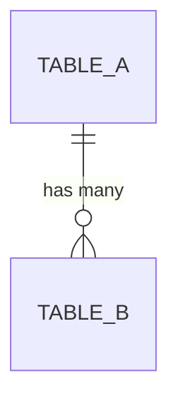
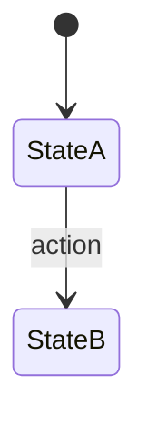
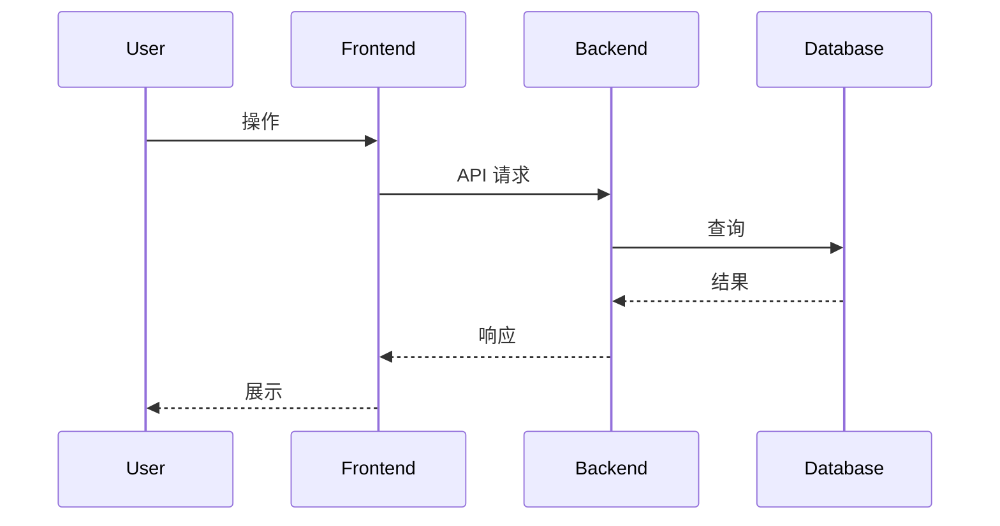

# {模块名} 技术规格书

> 版本：v0.1 | 状态：草稿 | 日期：YYYY-MM-DD | 关联 PRD：{link}

---

## 1. 概述

### 1.1 目的
{一句话说明本 Spec 解决什么问题}

### 1.2 范围
- **包含**：{列出本 Spec 覆盖的内容}
- **不包含**：{列出明确排除的内容}

### 1.3 关联文档
| 文档 | 路径 | 关系 |
|------|------|------|
| PRD | docs/prd-xxx.md | 需求来源 |
| 上游 Spec | docs/specs/xx-xxx.md | 依赖 |

---

## 2. 数据模型

### 2.1 表定义

#### `{table_name}`

| 列名 | 类型 | 约束 | 说明 |
|------|------|------|------|
| id | INTEGER | PK, AUTO | 主键 |
| ... | ... | ... | ... |
| created_at | TIMESTAMP | NOT NULL, DEFAULT NOW | 创建时间 |
| updated_at | TIMESTAMP | NOT NULL, DEFAULT NOW | 更新时间 |

### 2.2 ER 关系图



### 2.3 索引策略

| 表 | 索引名 | 列 | 类型 | 用途 |
|----|--------|-----|------|------|
| ... | ... | ... | BTREE | ... |

### 2.4 迁移说明
{Alembic 迁移注意事项}

---

## 3. API 设计

### 3.1 端点总览

| 方法 | 路径 | 说明 | 认证 | 角色 |
|------|------|------|------|------|
| GET | /api/xxx | 列表 | 需要 | analyst+ |
| POST | /api/xxx | 创建 | 需要 | admin |

### 3.2 请求/响应 Schema

#### `GET /api/xxx`

**请求参数：**
```json
{
  "page": 1,
  "page_size": 20
}
```

**响应 (200)：**
```json
{
  "items": [],
  "total": 0,
  "page": 1,
  "page_size": 20,
  "pages": 0
}
```

**错误响应 (4xx/5xx)：**
```json
{
  "error_code": "MOD_001",
  "message": "描述",
  "detail": {}
}
```

---

## 4. 业务逻辑

### 4.1 状态机



### 4.2 校验规则
- {规则1}
- {规则2}

### 4.3 约束
- {约束1}

---

## 5. 错误码

| 错误码 | HTTP | 说明 | 触发条件 |
|--------|------|------|---------|
| MOD_001 | 400 | ... | ... |
| MOD_002 | 404 | ... | ... |

---

## 6. 安全

### 6.1 角色权限矩阵

| 操作 | admin | data_admin | analyst | user |
|------|-------|-----------|---------|------|
| 查看 | Y | Y | Y | N |
| 创建 | Y | N | N | N |

### 6.2 加密
{相关加密说明}

### 6.3 敏感度处理
{数据分级规则}

---

## 7. 集成点

### 7.1 上游依赖
| 模块 | 接口 | 用途 |
|------|------|------|
| ... | ... | ... |

### 7.2 下游消费者
| 模块 | 消费方式 | 说明 |
|------|---------|------|
| ... | ... | ... |

### 7.3 事件发射
| 事件名 | 触发时机 | Payload |
|--------|---------|---------|
| ... | ... | ... |

---

## 8. 时序图



---

## 9. 测试策略

### 9.1 关键场景
| # | 场景 | 预期 | 优先级 |
|---|------|------|--------|
| 1 | ... | ... | P0 |

### 9.2 验收标准
- [ ] {标准1}
- [ ] {标准2}

### 9.3 Mock 与测试约束

{列出本模块测试时 coder 必须知道的非显而易见的约束。architect 填写，coder 遵循。
 如果模块没有特殊约束，写"无特殊约束"。}

常见需标注的情形：
- 异常兜底设计：某函数内部 catch 所有异常不向外传播，测试时需绕过
- async generator / SSE 流：mock 策略（patch 层级、返回值类型）
- 同步/异步边界：SQLAlchemy sync Session vs async def 的不匹配
- 内部 HTTP 转发：httpx.AsyncClient mock 需区分 `.stream()` 和 `.post()` 路径
- 依赖注入覆盖：FastAPI `dependency_overrides` 的生命周期与 TestClient 的关系

条目格式：
```
- **{函数/类名}**：{行为描述} → {正确的 mock/测试策略}
```

示例：
```
- **`_stream_via_agent`**：内部 catch 所有异常并 yield error event，不向外传播异常
  → 测试 fallback 路径需在模块层面替换为首次迭代即抛异常的 async generator
- **`SessionManager`**：使用同步 SQLAlchemy Session，所有方法为 def 非 async def
  → 测试中 mock db.query 链不需要 AsyncMock
```

---

## 10. 开放问题

| # | 问题 | 负责人 | 状态 |
|---|------|--------|------|
| 1 | ... | ... | 待定 |

---

## 11. 开发交付约束

> architect 必填。此节内容嵌入 SPEC 后，coder（人类或 AI）开发时强制遵循。
> 通用约束见 [`SPEC_DEVELOPER_PROMPT_TEMPLATE.md`](../SPEC_DEVELOPER_PROMPT_TEMPLATE.md) §通用约束，此处只写**本模块特有的**约束。

### 11.1 架构约束
{本模块特有的架构红线、禁止操作、import 限制等}

示例：
```
- services/data_agent/ 不得 import app.api 层任何模块
- engine.py 的 ReAct 循环最大步数由 max_steps 参数控制，禁止硬编码
```

### 11.2 强制检查清单
- [ ] {检查项1 — 违反即 PR 拒绝}
- [ ] {检查项2}

### 11.3 验证命令
```bash
# coder 提交前必须执行的命令
{ruff / grep / pytest 等}
```

### 11.4 正确/错误示范
```python
# ✗ 错误 — {说明}
...

# ✓ 正确 — {说明}
...
```
