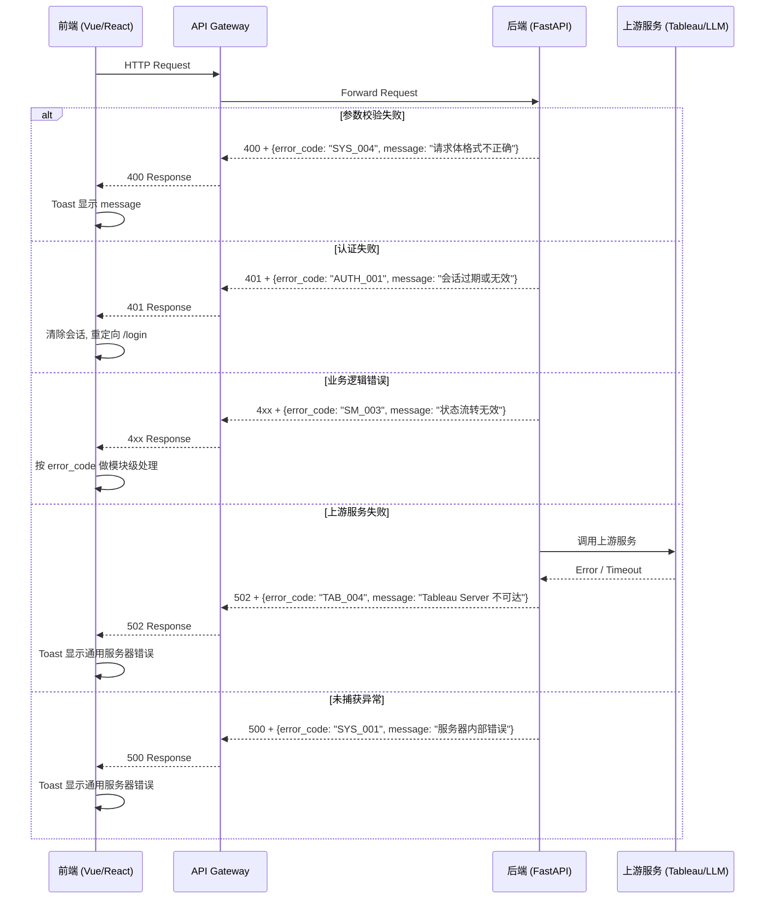

# 统一错误码标准

> **Version:** v1.0
> **Date:** 2026-04-04
> **Status:** Draft
> **Owner:** Mulan BI Platform Team

---

## 1. 概述

本文档定义了 Mulan BI Platform 所有模块的统一错误码标准。其目的是：

- **前端一致性**：所有模块返回相同结构的错误响应，前端可用统一逻辑处理。
- **可调试性**：通过唯一的错误码快速定位问题模块和具体原因。
- **可维护性**：新模块接入时只需申请前缀、注册错误码，无需重新设计错误格式。

适用范围：所有后端 API 返回的 4xx/5xx 响应。

---

## 2. 错误响应包络

所有错误响应 **必须** 使用以下 JSON 结构：

```json
{
  "error_code": "AUTH_001",
  "message": "用户名或密码错误",
  "detail": {}
}
```

### 字段说明

| 字段 | 类型 | 必填 | 说明 |
|---|---|---|---|
| `error_code` | `string` | 是 | 格式为 `{MODULE_PREFIX}_{3位数字}`，如 `AUTH_001`、`DS_003` |
| `message` | `string` | 是 | 面向用户的中文可读描述 |
| `detail` | `object` | 否 | 调试上下文信息，生产环境可根据配置决定是否返回 |

### 规则

1. 所有 HTTP 4xx/5xx 响应 **必须** 使用此格式，不得返回裸文本或非结构化 JSON。
2. `error_code` 始终为 `{MODULE_PREFIX}_{3位数字}` 格式，数字不足三位时前补零。
3. `message` 必须是面向用户的中文描述，不得包含堆栈信息或内部实现细节。
4. `detail` 为可选字段，用于携带调试上下文（如字段校验明细、上游服务错误摘要等）。
5. 成功响应（2xx）不使用此格式，按各模块正常数据结构返回。

### detail 示例

```json
{
  "error_code": "SYS_004",
  "message": "请求体格式不正确",
  "detail": {
    "validation_errors": [
      {"field": "name", "reason": "不能为空"},
      {"field": "type", "reason": "不支持的值: xyz"}
    ]
  }
}
```

---

## 3. HTTP 状态码映射

| HTTP 状态码 | 含义 | 使用场景 |
|---|---|---|
| 400 | Bad Request | 请求参数校验失败、格式错误 |
| 401 | Unauthorized | 未认证：无会话、会话无效、会话过期 |
| 403 | Forbidden | 已认证但权限不足 |
| 404 | Not Found | 请求的资源不存在 |
| 409 | Conflict | 资源冲突：重名、状态冲突、并发操作冲突 |
| 422 | Unprocessable Entity | 业务规则校验不通过（参数格式正确但业务逻辑不允许） |
| 429 | Too Many Requests | 请求频率超限 |
| 500 | Internal Server Error | 服务端内部错误 |
| 502 | Bad Gateway | 上游服务（Tableau Server、LLM 供应商等）调用失败 |
| 503 | Service Unavailable | 服务不可用（维护中、依赖服务宕机） |

### 映射原则

- 一个 `error_code` 固定对应一个 HTTP 状态码，不得同一错误码在不同场景返回不同状态码。
- 客户端应优先根据 `error_code` 处理逻辑，HTTP 状态码仅作为粗粒度分类。

---

## 4. 模块前缀分配

| 前缀 | 模块 | 码段范围 | 说明 |
|---|---|---|---|
| `SYS` | 系统/全局 | SYS_001 - SYS_099 | 框架级错误、通用错误 |
| `AUTH` | 认证与权限 (RBAC) | AUTH_001 - AUTH_099 | 登录、注册、角色权限 |
| `DS` | 数据源管理 | DS_001 - DS_099 | 数据源 CRUD、连接测试 |
| `DDL` | DDL 合规检查 | DDL_001 - DDL_099 | DDL 语法检查、规则管理 |
| `TAB` | Tableau MCP 集成 (V1) | TAB_001 - TAB_099 | Tableau 连接、同步、V1 MCP 查询 |
| `MCP` | Tableau MCP V2 直连 | MCP_001 - MCP_099 | V2 直连查询、MCPClientPool、VizQL 查询 |
| `SM` | 语义维护 | SM_001 - SM_099 | 语义标注、审批、发布 |
| `LLM` | LLM 能力层 | LLM_001 - LLM_099 | LLM 配置、调用、解析 |
| `HS` | 健康扫描 | HS_001 - HS_099 | 数据源健康检查、扫描任务 |
| `GOV` | 数据治理质量 | GOV_001 - GOV_099 | 数据质量规则、治理评分 |
| `SEARCH` | 自然语言查询 | SEARCH_001 - SEARCH_099 | NL-to-Query 搜索 |
| `KB` | 知识库 | KB_001 - KB_099 | 知识库管理 |
| `EVT` | 事件/通知 | EVT_001 - EVT_099 | 事件推送、通知管理 |
| `DQC` | 数据质量流水线 | DQC_001 - DQC_099 | 质量规则、检测执行、信号灯评分 |

> **新模块接入**：在本表追加新行，提交 PR 审批后即可使用。前缀长度不超过 6 个大写字母。

---

## 5. 错误码目录

### 5.1 SYS - 系统/全局

| 错误码 | HTTP | 描述 | 触发场景 |
|---|---|---|---|
| `SYS_001` | 500 | 服务器内部错误 | 未捕获的异常、未预期的运行时错误 |
| `SYS_002` | 503 | 数据库连接失败 | 启动时或运行中数据库不可达 |
| `SYS_003` | 429 | 请求频率超限 | 全局或 IP 级别限流触发 |
| `SYS_004` | 400 | 请求体格式不正确 | JSON 解析失败、必填字段缺失、类型不匹配 |

### 5.2 AUTH - 认证与权限

| 错误码 | HTTP | 描述 | 触发场景 |
|---|---|---|---|
| `AUTH_001` | 401 | 会话过期或无效 | Token 过期、Token 被篡改、未携带 Token |
| `AUTH_002` | 401 | 用户名或密码错误 | 登录时凭据校验失败 |
| `AUTH_003` | 403 | 权限不足 | 当前角色无权访问目标资源或执行目标操作 |
| `AUTH_004` | 403 | 需要管理员角色 | 仅限 admin 的操作被非 admin 用户调用 |
| `AUTH_005` | 409 | 用户名已存在 | 注册时用户名重复 |
| `AUTH_006` | 409 | 邮箱已存在 | 注册时邮箱重复 |
| `AUTH_007` | 404 | 用户不存在 | 按 ID/用户名查询用户未找到 |
| `AUTH_008` | 403 | 账号已禁用 | 被管理员禁用的账号尝试登录或操作 |
| `AUTH_009` | 429 | 注册请求过于频繁 | 同一 IP 短时间内注册次数超限 |

### 5.3 DS - 数据源管理

| 错误码 | HTTP | 描述 | 触发场景 |
|---|---|---|---|
| `DS_001` | 404 | 数据源不存在 | 按 ID 查询数据源未找到 |
| `DS_002` | 403 | 非数据源所有者 | 非所有者尝试编辑/删除数据源 |
| `DS_003` | 400 | 连接测试失败 | 创建/编辑数据源时连接测试不通过 |
| `DS_004` | 400 | 不支持的数据库类型 | 提供了平台未支持的 `db_type` |
| `DS_005` | 400 | 加密密钥未配置 | 环境变量中未设置 `ENCRYPTION_KEY` |
| `DS_006` | 409 | 数据源名称已存在 | 同一用户下数据源名称重复 |

### 5.4 DDL - DDL 合规检查

| 错误码 | HTTP | 描述 | 触发场景 |
|---|---|---|---|
| `DDL_001` | 400 | DDL 语法无效 | 提交的 DDL 语句解析失败 |
| `DDL_002` | 404 | 规则不存在 | 按 ID 查询 DDL 规则未找到 |
| `DDL_003` | 400 | 规则配置无效 | 规则参数校验不通过 |

### 5.5 TAB - Tableau MCP 集成

| 错误码 | HTTP | 描述 | 触发场景 |
|---|---|---|---|
| `TAB_001` | 404 | 连接不存在 | 按 ID 查询 Tableau 连接未找到 |
| `TAB_002` | 403 | 无权访问此连接 | 非所有者且无共享权限 |
| `TAB_003` | 400 | PAT 认证失败 | Personal Access Token 无效或过期 |
| `TAB_004` | 502 | Tableau Server 不可达 | 网络不通或 Tableau Server 宕机 |
| `TAB_005` | 409 | 同步任务进行中 | 对同一连接重复触发同步 |
| `TAB_006` | 404 | 资产不存在 | 请求的工作簿/视图/数据源在 Tableau 中未找到 |
| `TAB_007` | 502 | 同步失败 | Tableau API 调用返回错误 |
| `TAB_008` | 400 | 连接类型无效 | 提供了不支持的 Tableau 连接类型 |
| `TAB_009` | 502 | MCP 查询失败 | 通过 MCP 协议查询 Tableau 数据失败 |
| `TAB_010` | 404 | 同步日志不存在 | 按 ID 查询同步日志未找到 |

### 5.6 SM - 语义维护

| 错误码 | HTTP | 描述 | 触发场景 |
|---|---|---|---|
| `SM_001` | 404 | 数据源语义不存在 | 未为该数据源创建语义记录 |
| `SM_002` | 404 | 字段语义不存在 | 按 ID 查询字段语义未找到 |
| `SM_003` | 409 | 状态流转无效 | 不符合 `draft -> review -> published` 流程 |
| `SM_004` | 403 | 仅审核者/管理员可审批 | 非 reviewer/admin 角色尝试审批 |
| `SM_005` | 403 | 仅管理员可回滚 | 非 admin 角色尝试回滚版本 |
| `SM_006` | 502 | AI 生成失败 | 调用 LLM 生成语义描述时失败 |
| `SM_007` | 409 | 已发布 | 对已处于 published 状态的语义重复发布 |
| `SM_008` | 422 | 机密字段不可发布 | 标记为机密的字段尝试发布到公开语义层 |
| `SM_009` | 404 | 版本不存在 | 按版本号查询语义快照未找到 |

### 5.7 LLM - LLM 能力层

| 错误码 | HTTP | 描述 | 触发场景 |
|---|---|---|---|
| `LLM_001` | 404 | 无可用 LLM 配置 | 系统中未配置任何活跃的 LLM 供应商 |
| `LLM_002` | 400 | API Key 无效 | 配置的 API Key 校验失败 |
| `LLM_003` | 502 | LLM 供应商超时 | 调用 LLM 接口超过 30 秒未响应 |
| `LLM_004` | 502 | LLM 供应商不可用 | LLM 服务端返回 5xx 或网络不可达 |
| `LLM_005` | 502 | LLM 响应解析失败 | LLM 返回内容无法按预期格式解析 |

### 5.8 HS - 健康扫描

| 错误码 | HTTP | 描述 | 触发场景 |
|---|---|---|---|
| `HS_001` | 404 | 扫描记录不存在 | 按 ID 查询扫描记录未找到 |
| `HS_002` | 409 | 扫描任务进行中 | 对同一数据源重复触发扫描 |
| `HS_003` | 400 | 数据源连接失败 | 扫描时无法连接目标数据库 |
| `HS_004` | 502 | 数据库查询超时 | 执行健康检查 SQL 超时 |

### 5.9 SEARCH - 自然语言查询（规划中）

| 错误码 | HTTP | 描述 | 触发场景 |
|---|---|---|---|
| `SEARCH_001` | 404 | 无 LLM 配置 | 搜索模块需要 LLM 但未配置 |
| `SEARCH_002` | 404 | 无可用语义数据 | 目标数据源没有已发布的语义信息 |
| `SEARCH_003` | 404 | 未匹配到相关字段 | 自然语言查询无法映射到任何已知字段 |
| `SEARCH_004` | 502 | 查询执行失败 | 生成的 SQL 执行出错 |
| `SEARCH_005` | 409 | 歧义：匹配到多个数据源 | 用户查询命中多个数据源，需要用户消歧 |

### 5.10 MCP - Tableau MCP V2 直连

| 错误码 | HTTP | 描述 | 触发场景 |
|---|---|---|---|
| `MCP_001` | 400 | VizQL 查询 JSON 格式错误 | query 参数不符合 VizQL Schema |
| `MCP_002` | 400 | 查询引用了不存在的字段 | 字段名不在目标数据源的字段列表中 |
| `MCP_003` | 503 | MCP 服务不可用 | MCP Server 进程未运行或不可达 |
| `MCP_004` | 504 | MCP 查询超时（30s） | 查询复杂或数据量过大 |
| `MCP_005` | 401 | MCP 认证失败（PAT 过期） | PAT Token 已过期，需管理员更新 |
| `MCP_006` | 400 | 数据源 LUID 无效 | datasource_luid 不存在或已删除 |
| `MCP_007` | 400 | 查询 limit 超出允许范围 | limit 必须在 1–10000 之间 |
| `MCP_008` | 429 | MCP 请求频率超限 | 短时间内请求过多，稍后重试 |
| `MCP_009` | 500 | MCP 响应解析失败 | MCP Server 版本不兼容或响应格式异常 |
| `MCP_010` | 400 | 目标资产不是 datasource 类型 | metadata/preview 接口仅支持 datasource |

### 5.11 GOV - 数据治理质量

| 错误码 | HTTP | 描述 | 触发场景 |
|---|---|---|---|
| `GOV_001` | 404 | 质量规则不存在 | 按 ID 查询质量规则未找到 |
| `GOV_002` | 404 | 质量检测结果不存在 | 按 ID 查询检测结果未找到 |
| `GOV_003` | 409 | 质量扫描任务进行中 | 对同一数据源重复触发质量扫描 |
| `GOV_004` | 400 | 数据源连接失败 | 质量扫描时无法连接目标数据库 |

### 5.12 DQC - 数据质量流水线

| 错误码 | HTTP | 描述 | 触发场景 |
|---|---|---|---|
| `DQC_001` | 404 | 监控资产不存在 | 按 ID 查询监控资产未找到 |
| `DQC_002` | 409 | 监控资产已存在 | 重复注册同一监控资产 |
| `DQC_003` | 400 | 数据源不存在或未激活 | 关联的数据源被删除或禁用 |
| `DQC_004` | 403 | 非资产所有者 | 非所有者尝试编辑/删除监控资产 |
| `DQC_010` | 400 | 维度权重非法 | 权重之和不为 1 或包含负值 |
| `DQC_011` | 400 | 信号阈值非法 | 阈值不在 [0, 100] 区间或 green > yellow > red 不成立 |
| `DQC_020` | 400 | 规则类型不支持 | 提供了平台未支持的规则类型 |
| `DQC_021` | 400 | 规则配置参数无效 | 规则 JSON 参数校验不通过 |
| `DQC_022` | 400 | 维度与规则类型不兼容 | 将不适用的规则类型绑定到特定维度 |
| `DQC_023` | 409 | 规则已存在 | 同一资产下同类规则重复创建 |
| `DQC_024` | 404 | 规则不存在 | 按 ID 查询质量规则未找到 |
| `DQC_025` | 400 | custom_sql 非只读 | 自定义 SQL 包含 INSERT/UPDATE/DELETE 等写操作 |
| `DQC_030` | 409 | DQC cycle 正在运行 | 对同一资产重复触发检测周期 |
| `DQC_031` | 404 | cycle 不存在 | 按 ID 查询检测周期未找到 |
| `DQC_040` | 502 | 目标数据库连接失败 | 执行规则时无法连接目标数据库 |
| `DQC_041` | 504 | 目标数据库查询超时 | 规则 SQL 执行超时 |
| `DQC_042` | 422 | 扫描行数超限 | 单次扫描结果行数超过安全上限 |
| `DQC_050` | 502 | LLM 调用失败 | 质量分析中 LLM 调用返回错误 |
| `DQC_051` | 502 | LLM 响应解析失败 | LLM 返回内容无法按预期格式解析 |

### 5.13 KB - 知识库（TBD）

> 待 Spec 17 (Knowledge Base & RAG) 进入实现阶段时补充。前缀 `KB_001~099` 已预留。

### 5.14 EVT - 事件/通知（TBD）

> 待 Spec 16 (Notification & Events) 进入实现阶段时补充。前缀 `EVT_001~099` 已预留。

---

## 6. 前端错误处理约定

### 6.1 错误响应类型定义

```typescript
interface ErrorResponse {
  error_code: string;
  message: string;
  detail?: Record<string, unknown>;
}

// 从 error_code 中提取模块前缀
function getModule(code: string): string {
  return code.split('_')[0];
}

// 从 error_code 中提取数字编号
function getNumber(code: string): string {
  return code.split('_')[1];
}
```

### 6.2 全局错误拦截策略

在 Axios/Fetch 拦截器中按 HTTP 状态码分类处理：

| HTTP 状态码 | 前端行为 |
|---|---|
| 401 | 清除本地会话，重定向至 `/login` |
| 403 | 显示权限不足提示（Toast） |
| 429 | 显示限流提示，读取 `Retry-After` 响应头后自动重试 |
| 5xx | 显示通用服务器错误提示（Toast） |
| 其他 4xx | 显示 `response.message` 内容（Toast） |

### 6.3 模块级特殊处理示例

```typescript
// 在具体业务页面中，可针对特定 error_code 做细粒度处理
async function handleLogin(credentials: Credentials) {
  try {
    await api.login(credentials);
  } catch (err) {
    const error = err as ErrorResponse;
    switch (error.error_code) {
      case 'AUTH_002':
        // 用户名或密码错误 - 高亮表单字段
        setFieldError('password', error.message);
        break;
      case 'AUTH_008':
        // 账号已禁用 - 显示特殊提示
        showDisabledAccountDialog();
        break;
      default:
        // 其余交给全局拦截器处理
        throw err;
    }
  }
}
```

---

## 7. 实施指南

### 7.1 后端实现

#### 基础异常类

在 `backend/app/core/errors.py` 中创建统一异常基类：

```python
from fastapi import HTTPException
from typing import Optional, Any


class MulanError(HTTPException):
    """Mulan BI Platform 统一异常基类"""

    def __init__(
        self,
        error_code: str,
        message: str,
        status_code: int = 500,
        detail: Optional[dict[str, Any]] = None,
    ):
        self.error_code = error_code
        self.message = message
        self.error_detail = detail
        super().__init__(
            status_code=status_code,
            detail={
                "error_code": error_code,
                "message": message,
                "detail": detail or {},
            },
        )
```

#### 模块异常示例

```python
# backend/app/core/errors.py (续)

class AuthError:
    """认证与权限模块错误"""

    @staticmethod
    def session_expired():
        return MulanError("AUTH_001", "会话过期或无效", 401)

    @staticmethod
    def invalid_credentials():
        return MulanError("AUTH_002", "用户名或密码错误", 401)

    @staticmethod
    def insufficient_permissions():
        return MulanError("AUTH_003", "权限不足", 403)

    @staticmethod
    def admin_required():
        return MulanError("AUTH_004", "需要管理员角色", 403)


class DSError:
    """数据源管理模块错误"""

    @staticmethod
    def not_found():
        return MulanError("DS_001", "数据源不存在", 404)

    @staticmethod
    def not_owner():
        return MulanError("DS_002", "非数据源所有者", 403)

    @staticmethod
    def connection_failed(detail: dict = None):
        return MulanError("DS_003", "连接测试失败", 400, detail)
```

#### 全局异常处理器

在 `backend/app/main.py` 中注册：

```python
from fastapi import FastAPI, Request
from fastapi.responses import JSONResponse
from app.core.errors import MulanError

app = FastAPI()


@app.exception_handler(MulanError)
async def mulan_error_handler(request: Request, exc: MulanError):
    return JSONResponse(
        status_code=exc.status_code,
        content={
            "error_code": exc.error_code,
            "message": exc.message,
            "detail": exc.error_detail or {},
        },
    )


@app.exception_handler(Exception)
async def global_error_handler(request: Request, exc: Exception):
    return JSONResponse(
        status_code=500,
        content={
            "error_code": "SYS_001",
            "message": "服务器内部错误",
            "detail": {},
        },
    )
```

### 7.2 错误处理流程



### 7.3 迁移路径

| 阶段 | 内容 | 目标 |
|---|---|---|
| **Phase 1** | 添加全局异常处理器和 `MulanError` 基类；新开发的接口强制使用错误码 | 新代码合规 |
| **Phase 2** | 按模块逐步改造已有接口：AUTH -> DS -> TAB -> SM -> 其他 | 存量代码合规 |
| **Phase 3** | 前端全面切换到基于 `error_code` 的处理逻辑，移除硬编码的 message 判断 | 前后端统一 |

### 7.4 新增错误码流程

1. 在本文档 **第 5 节** 对应模块表格中追加一行。
2. 在 `backend/app/core/errors.py` 对应模块类中添加静态方法。
3. 提交 PR，确保文档与代码同步更新。

---

## 8. 测试策略

### 8.1 关键场景

| # | 场景 | 预期 | 优先级 |
|---|------|------|--------|
| 1 | 全局异常处理器捕获 `MulanError` | 返回 `{error_code, message, detail}` 包络，HTTP 状态码与 `MulanError.status_code` 一致 | P0 |
| 2 | 未捕获的 `Exception` 被兜底处理器捕获 | 返回 `SYS_001` + 500 | P0 |
| 3 | 各模块 Error 工厂方法（如 `AuthError.session_expired()`） | 返回正确的 `error_code`、`message`、`status_code` | P0 |
| 4 | 带 `detail` 参数的工厂方法 | `detail` 字段完整透传到响应 | P1 |
| 5 | 前端收到 401 响应 | 清除会话，重定向 `/login` | P1 |
| 6 | 前端收到 429 响应 | 显示限流提示，读取 `Retry-After` | P2 |
| 7 | `error_code` 格式校验 | 所有已注册 error_code 符合 `{PREFIX}_{NNN}` 格式 | P1 |

### 8.2 验收标准

- [ ] `MulanError` 基类已实现于 `backend/app/core/errors.py`
- [ ] 全局异常处理器已注册于 `backend/app/main.py`
- [ ] 所有已有模块 Error 类（SYS/AUTH/DS/DDL/TAB/MCP/SM/LLM/HS/SEARCH/GOV/DQC）的工厂方法与 Section 5 错误码表一一对应
- [ ] 后端无裸 `raise HTTPException`（除标注 `# LEGACY` 的历史代码外）
- [ ] 前端 `ErrorResponse` 类型定义存在，拦截器按 Section 6 策略处理
- [ ] 单元测试覆盖场景 1-4

### 8.3 Mock 与测试约束

- **`MulanError`**：继承 `HTTPException` 并在 `__init__` 中双写 `self.error_detail` 和 `super().__init__(detail=...)`。测试时应通过 HTTP 响应 JSON 断言 `error_code` 字段，不要直接断言异常对象的 `detail` 属性（它是 FastAPI 的 dict 包装，不是原始 detail）
- **全局兜底处理器**：测试时触发一个非 `MulanError` 的异常（如 `RuntimeError`），断言响应为 `{"error_code": "SYS_001", ...}`

---

## 9. 开发交付约束

### 9.1 架构约束

- 所有 Error 工厂类（`AuthError`、`DSError` 等）必须定义在 `backend/app/core/errors.py`，不得分散到各 service 模块
- `services/` 层可以 `from app.core.errors import XXXError` 抛出错误，但不得自行定义 `HTTPException` 子类
- 一个 `error_code` 只能出现在一个工厂方法中，禁止重复定义

### 9.2 强制检查清单

- [ ] **禁止裸 `raise HTTPException`**：所有 4xx/5xx 必须通过模块 Error 工厂抛出
- [ ] **新模块必须注册前缀**：在 Section 4 追加一行，PR 中同步更新 spec 和代码
- [ ] **`error_code` 格式强制**：`{PREFIX}_{NNN}`，数字三位前补零
- [ ] **spec 与代码同步**：`errors.py` 中的每个工厂方法必须在 Section 5 有对应行，反之亦然
- [ ] **`message` 必须中文**：面向用户的 message 不得使用英文

### 9.3 验证命令

```bash
# 检查是否存在裸 HTTPException（LEGACY 标注除外）
grep -rn "raise HTTPException" backend/app/api/ | grep -v "# LEGACY" && echo "FAIL: 存在裸 HTTPException" || echo "PASS"

# 检查 errors.py 中的 error_code 格式
grep -oP '"[A-Z]+_\d+"' backend/app/core/errors.py | sort -u

# 检查 error_code 是否有重复定义
grep -oP '"[A-Z]+_\d+"' backend/app/core/errors.py | sort | uniq -d && echo "FAIL: 存在重复 error_code" || echo "PASS"

# 后端编译检查
cd backend && python3 -m py_compile app/core/errors.py

# 后端测试
cd backend && pytest tests/ -x -q
```

### 9.4 正确/错误示范

```python
# ❌ 错误：裸 HTTPException
raise HTTPException(status_code=404, detail="数据源不存在")

# ✅ 正确：使用模块 Error 工厂
from app.core.errors import DSError
raise DSError.not_found()

# ❌ 错误：在 services/ 中自定义异常
class MyServiceError(HTTPException): ...

# ✅ 正确：在 errors.py 中注册，services/ 中引用
from app.core.errors import GOVError
raise GOVError.rule_not_found()
```

---

## 附录 A: 错误码速查索引

| 错误码 | HTTP | 模块 | 描述 |
|---|---|---|---|
| SYS_001 | 500 | 系统 | 服务器内部错误 |
| SYS_002 | 503 | 系统 | 数据库连接失败 |
| SYS_003 | 429 | 系统 | 请求频率超限 |
| SYS_004 | 400 | 系统 | 请求体格式不正确 |
| AUTH_001 | 401 | 认证 | 会话过期或无效 |
| AUTH_002 | 401 | 认证 | 用户名或密码错误 |
| AUTH_003 | 403 | 认证 | 权限不足 |
| AUTH_004 | 403 | 认证 | 需要管理员角色 |
| AUTH_005 | 409 | 认证 | 用户名已存在 |
| AUTH_006 | 409 | 认证 | 邮箱已存在 |
| AUTH_007 | 404 | 认证 | 用户不存在 |
| AUTH_008 | 403 | 认证 | 账号已禁用 |
| AUTH_009 | 429 | 认证 | 注册请求过于频繁 |
| DS_001 | 404 | 数据源 | 数据源不存在 |
| DS_002 | 403 | 数据源 | 非数据源所有者 |
| DS_003 | 400 | 数据源 | 连接测试失败 |
| DS_004 | 400 | 数据源 | 不支持的数据库类型 |
| DS_005 | 400 | 数据源 | 加密密钥未配置 |
| DS_006 | 409 | 数据源 | 数据源名称已存在 |
| DDL_001 | 400 | DDL | DDL 语法无效 |
| DDL_002 | 404 | DDL | 规则不存在 |
| DDL_003 | 400 | DDL | 规则配置无效 |
| TAB_001 | 404 | Tableau | 连接不存在 |
| TAB_002 | 403 | Tableau | 无权访问此连接 |
| TAB_003 | 400 | Tableau | PAT 认证失败 |
| TAB_004 | 502 | Tableau | Tableau Server 不可达 |
| TAB_005 | 409 | Tableau | 同步任务进行中 |
| TAB_006 | 404 | Tableau | 资产不存在 |
| TAB_007 | 502 | Tableau | 同步失败 |
| TAB_008 | 400 | Tableau | 连接类型无效 |
| TAB_009 | 502 | Tableau | MCP 查询失败 |
| TAB_010 | 404 | Tableau | 同步日志不存在 |
| SM_001 | 404 | 语义 | 数据源语义不存在 |
| SM_002 | 404 | 语义 | 字段语义不存在 |
| SM_003 | 409 | 语义 | 状态流转无效 |
| SM_004 | 403 | 语义 | 仅审核者/管理员可审批 |
| SM_005 | 403 | 语义 | 仅管理员可回滚 |
| SM_006 | 502 | 语义 | AI 生成失败 |
| SM_007 | 409 | 语义 | 已发布 |
| SM_008 | 422 | 语义 | 机密字段不可发布 |
| SM_009 | 404 | 语义 | 版本不存在 |
| LLM_001 | 404 | LLM | 无可用 LLM 配置 |
| LLM_002 | 400 | LLM | API Key 无效 |
| LLM_003 | 502 | LLM | LLM 供应商超时 |
| LLM_004 | 502 | LLM | LLM 供应商不可用 |
| LLM_005 | 502 | LLM | LLM 响应解析失败 |
| HS_001 | 404 | 健康扫描 | 扫描记录不存在 |
| HS_002 | 409 | 健康扫描 | 扫描任务进行中 |
| HS_003 | 400 | 健康扫描 | 数据源连接失败 |
| HS_004 | 502 | 健康扫描 | 数据库查询超时 |
| SEARCH_001 | 404 | 搜索 | 无 LLM 配置 |
| SEARCH_002 | 404 | 搜索 | 无可用语义数据 |
| SEARCH_003 | 404 | 搜索 | 未匹配到相关字段 |
| SEARCH_004 | 502 | 搜索 | 查询执行失败 |
| SEARCH_005 | 409 | 搜索 | 歧义：匹配到多个数据源 |
| MCP_001 | 400 | MCP V2 | VizQL 查询 JSON 格式错误 |
| MCP_002 | 400 | MCP V2 | 查询引用了不存在的字段 |
| MCP_003 | 503 | MCP V2 | MCP 服务不可用 |
| MCP_004 | 504 | MCP V2 | MCP 查询超时（30s） |
| MCP_005 | 401 | MCP V2 | MCP 认证失败（PAT 过期） |
| MCP_006 | 400 | MCP V2 | 数据源 LUID 无效 |
| MCP_007 | 400 | MCP V2 | 查询 limit 超出允许范围 |
| MCP_008 | 429 | MCP V2 | MCP 请求频率超限 |
| MCP_009 | 500 | MCP V2 | MCP 响应解析失败 |
| MCP_010 | 400 | MCP V2 | 目标资产不是 datasource 类型 |
| GOV_001 | 404 | 治理 | 质量规则不存在 |
| GOV_002 | 404 | 治理 | 质量检测结果不存在 |
| GOV_003 | 409 | 治理 | 质量扫描任务进行中 |
| GOV_004 | 400 | 治理 | 数据源连接失败 |
| DQC_001 | 404 | DQC | 监控资产不存在 |
| DQC_002 | 409 | DQC | 监控资产已存在 |
| DQC_003 | 400 | DQC | 数据源不存在或未激活 |
| DQC_004 | 403 | DQC | 非资产所有者 |
| DQC_010 | 400 | DQC | 维度权重非法 |
| DQC_011 | 400 | DQC | 信号阈值非法 |
| DQC_020 | 400 | DQC | 规则类型不支持 |
| DQC_021 | 400 | DQC | 规则配置参数无效 |
| DQC_022 | 400 | DQC | 维度与规则类型不兼容 |
| DQC_023 | 409 | DQC | 规则已存在 |
| DQC_024 | 404 | DQC | 规则不存在 |
| DQC_025 | 400 | DQC | custom_sql 非只读 |
| DQC_030 | 409 | DQC | DQC cycle 正在运行 |
| DQC_031 | 404 | DQC | cycle 不存在 |
| DQC_040 | 502 | DQC | 目标数据库连接失败 |
| DQC_041 | 504 | DQC | 目标数据库查询超时 |
| DQC_042 | 422 | DQC | 扫描行数超限 |
| DQC_050 | 502 | DQC | LLM 调用失败 |
| DQC_051 | 502 | DQC | LLM 响应解析失败 |
