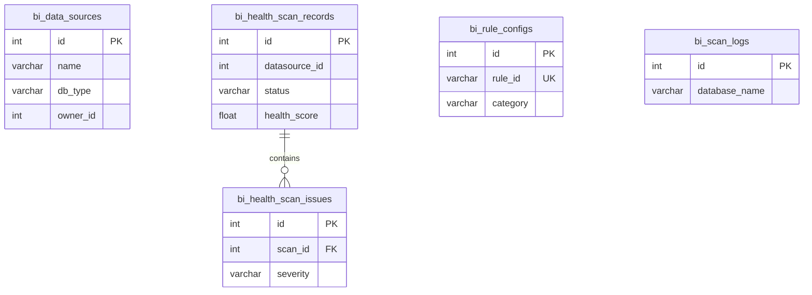
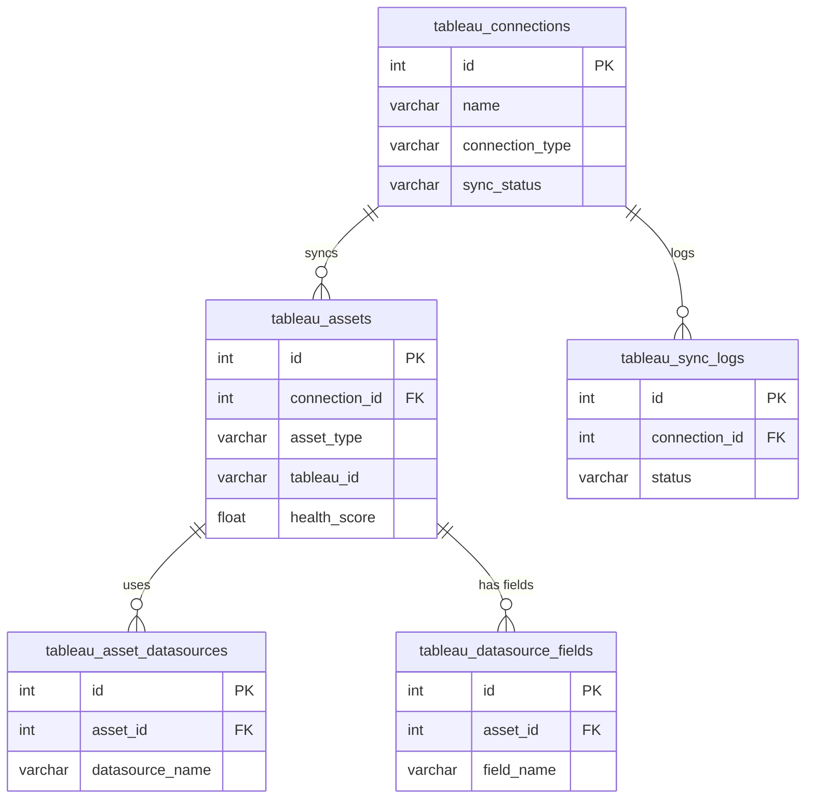
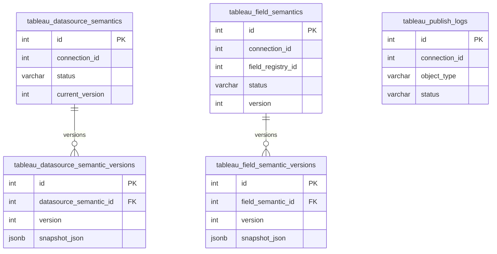

# 数据模型总览

> 版本：v1.0 | 状态：已完成 | 日期：2026-04-04

---

## 1. 概述

| 项目 | 值 |
|------|-----|
| 数据库 | PostgreSQL 16 |
| ORM | SQLAlchemy 2.x |
| 迁移工具 | Alembic |
| 连接池 | pool_size=10, max_overflow=20, pool_pre_ping=True |
| 基类 | `backend/app/core/database.py` → `Base = declarative_base()` |

---

## 2. 命名约定

| 类别 | 约定 | 示例 |
|------|------|------|
| 表名前缀 | 按模块分区 | `auth_`, `bi_`, `ai_`, `tableau_` |
| 列名 | snake_case | `created_at`, `owner_id` |
| 时间戳 | `*_at` 后缀 | `created_at`, `synced_at` |
| 外键 | `*_id` 后缀 | `connection_id`, `asset_id` |
| JSONB | `*_json` 后缀 | `tags_json`, `diff_json` |
| 布尔 | `is_*` 前缀 | `is_active`, `is_deleted` |
| 加密 | `*_encrypted` 后缀 | `password_encrypted` |

---

## 3. 表清单 (23 张)

### 3.1 认证模块 `auth_` (4 张)

#### `auth_users`

| 列 | 类型 | 约束 | 默认值 | 说明 |
|----|------|------|--------|------|
| id | INTEGER | PK, AUTO | - | 主键 |
| username | VARCHAR(64) | UNIQUE, NOT NULL, INDEX | - | 用户名 |
| display_name | VARCHAR(128) | NOT NULL | - | 显示名 |
| password_hash | VARCHAR(256) | NOT NULL | - | PBKDF2-SHA256 哈希 |
| email | VARCHAR(128) | UNIQUE, NOT NULL, INDEX | - | 邮箱 |
| role | VARCHAR(32) | - | `'user'` | 角色: admin/data_admin/analyst/user |
| permissions | JSONB | NULLABLE | - | 个人权限 |
| is_active | BOOLEAN | - | `true` | 是否启用 |
| created_at | TIMESTAMP | NOT NULL | `now()` | 创建时间 |
| last_login | TIMESTAMP | NULLABLE | - | 最后登录 |

#### `auth_user_groups`

| 列 | 类型 | 约束 | 默认值 | 说明 |
|----|------|------|--------|------|
| id | INTEGER | PK, AUTO | - | 主键 |
| name | VARCHAR(64) | UNIQUE, NOT NULL, INDEX | - | 组名 |
| description | VARCHAR(256) | NULLABLE | - | 描述 |
| created_at | TIMESTAMP | NOT NULL | `now()` | 创建时间 |

#### `auth_group_permissions`

| 列 | 类型 | 约束 | 默认值 | 说明 |
|----|------|------|--------|------|
| group_id | INTEGER | PK, FK→auth_user_groups.id | - | 用户组 |
| permission_key | VARCHAR(64) | PK | - | 权限标识 |
| created_at | TIMESTAMP | - | `now()` | 创建时间 |

#### `auth_user_group_members` (关联表)

| 列 | 类型 | 约束 | 默认值 | 说明 |
|----|------|------|--------|------|
| user_id | INTEGER | PK, FK→auth_users.id | - | 用户 |
| group_id | INTEGER | PK, FK→auth_user_groups.id | - | 用户组 |
| created_at | TIMESTAMP | - | `now()` | 关联时间 |

---

### 3.2 核心业务模块 `bi_` (8 张)

#### `bi_data_sources`

| 列 | 类型 | 约束 | 默认值 | 说明 |
|----|------|------|--------|------|
| id | INTEGER | PK, AUTO | - | 主键 |
| name | VARCHAR(128) | NOT NULL | - | 数据源名称 |
| db_type | VARCHAR(32) | NOT NULL | - | mysql/sqlserver/postgresql/hive/starrocks/doris |
| host | VARCHAR(256) | NOT NULL | - | 主机地址 |
| port | INTEGER | NOT NULL | - | 端口 |
| database_name | VARCHAR(128) | NOT NULL | - | 数据库名 |
| username | VARCHAR(128) | NOT NULL | - | 用户名 |
| password_encrypted | VARCHAR(512) | NOT NULL | - | Fernet 加密密码 |
| extra_config | JSONB | NULLABLE | - | 额外配置 (SSL等) |
| owner_id | INTEGER | NOT NULL | - | 所有者 |
| is_active | BOOLEAN | - | `true` | 是否启用 |
| created_at | TIMESTAMP | NOT NULL | `now()` | 创建时间 |
| updated_at | TIMESTAMP | - | `now()` | 更新时间 (onupdate) |

#### `bi_rule_configs`

| 列 | 类型 | 约束 | 默认值 | 说明 |
|----|------|------|--------|------|
| id | INTEGER | PK, AUTO | - | 主键 |
| rule_id | VARCHAR(64) | UNIQUE, NOT NULL, INDEX | - | 规则标识 |
| name | VARCHAR(256) | NOT NULL | - | 规则名称 |
| description | VARCHAR(1024) | NOT NULL | `""` | 描述 |
| level | VARCHAR(32) | NOT NULL | `"MEDIUM"` | 级别 |
| category | VARCHAR(64) | NOT NULL | `"general"` | 分类 |
| db_type | VARCHAR(32) | NOT NULL | `"MySQL"` | 数据库类型 |
| suggestion | VARCHAR(1024) | NOT NULL | `""` | 修复建议 |
| enabled | BOOLEAN | NOT NULL | `true` | 是否启用 |
| is_custom | BOOLEAN | NOT NULL | `false` | 是否自定义 |
| config_json | JSONB | NOT NULL | `{}` | 规则配置 |
| created_at | TIMESTAMP | NOT NULL | `now()` | 创建时间 |
| updated_at | TIMESTAMP | NOT NULL | `now()` | 更新时间 |

#### `bi_health_scan_records`

| 列 | 类型 | 约束 | 默认值 | 说明 |
|----|------|------|--------|------|
| id | INTEGER | PK, AUTO | - | 主键 |
| datasource_id | INTEGER | NOT NULL, INDEX | - | 数据源 ID |
| datasource_name | VARCHAR(128) | NOT NULL | - | 数据源名称 |
| db_type | VARCHAR(32) | NOT NULL | - | 数据库类型 |
| database_name | VARCHAR(128) | NOT NULL | - | 数据库名 |
| status | VARCHAR(16) | NOT NULL | `'pending'` | pending/running/completed/failed |
| started_at | TIMESTAMP | NULLABLE | - | 开始时间 |
| finished_at | TIMESTAMP | NULLABLE | - | 结束时间 |
| total_tables | INTEGER | - | `0` | 扫描表数 |
| total_issues | INTEGER | - | `0` | 问题总数 |
| high_count | INTEGER | - | `0` | 高危数 |
| medium_count | INTEGER | - | `0` | 中危数 |
| low_count | INTEGER | - | `0` | 低危数 |
| health_score | FLOAT | NULLABLE | - | 健康分 (0-100) |
| error_message | TEXT | NULLABLE | - | 错误信息 |
| triggered_by | INTEGER | NULLABLE | - | 触发用户 |
| created_at | TIMESTAMP | NOT NULL | `now()` | 创建时间 |

#### `bi_health_scan_issues`

| 列 | 类型 | 约束 | 默认值 | 说明 |
|----|------|------|--------|------|
| id | INTEGER | PK, AUTO | - | 主键 |
| scan_id | INTEGER | NOT NULL, FK→bi_health_scan_records.id (CASCADE) | - | 扫描记录 |
| severity | VARCHAR(16) | NOT NULL | - | HIGH/MEDIUM/LOW |
| object_type | VARCHAR(16) | NOT NULL | - | table/column |
| object_name | VARCHAR(256) | NOT NULL | - | 对象名 |
| database_name | VARCHAR(128) | NULLABLE | - | 数据库名 |
| issue_type | VARCHAR(64) | NOT NULL | - | 问题类型 |
| description | TEXT | NOT NULL | - | 问题描述 |
| suggestion | TEXT | NULLABLE | - | 修复建议 |
| created_at | TIMESTAMP | NOT NULL | `now()` | 创建时间 |

#### `bi_scan_logs`

| 列 | 类型 | 约束 | 默认值 | 说明 |
|----|------|------|--------|------|
| id | INTEGER | PK, AUTO | - | 主键 |
| scan_time | TIMESTAMP | NOT NULL | `now()` | 扫描时间 |
| database_name | VARCHAR(128) | NOT NULL | - | 数据库名 |
| db_type | VARCHAR(32) | NOT NULL | - | 数据库类型 |
| table_count | INTEGER | - | `0` | 扫描表数 |
| total_violations | INTEGER | - | `0` | 违规总数 |
| error_count | INTEGER | - | `0` | 错误数 |
| warning_count | INTEGER | - | `0` | 警告数 |
| info_count | INTEGER | - | `0` | 信息数 |
| duration_seconds | TEXT | NULLABLE | - | 耗时 |
| status | VARCHAR(32) | - | `'completed'` | 状态 |
| error_message | TEXT | NULLABLE | - | 错误信息 |
| results_json | JSONB | NULLABLE | - | 扫描结果 |

#### `bi_rule_change_logs`

| 列 | 类型 | 约束 | 默认值 | 说明 |
|----|------|------|--------|------|
| id | INTEGER | PK, AUTO | - | 主键 |
| change_time | TIMESTAMP | NOT NULL | `now()` | 变更时间 |
| operator | VARCHAR(128) | - | `'system'` | 操作者 |
| operator_id | INTEGER | NULLABLE | - | 操作者 ID |
| rule_section | VARCHAR(64) | NOT NULL | - | 规则分类 |
| change_type | VARCHAR(32) | NOT NULL | - | 变更类型 |
| old_value | TEXT | NULLABLE | - | 旧值 |
| new_value | TEXT | NULLABLE | - | 新值 |
| description | TEXT | NULLABLE | - | 描述 |

#### `bi_operation_logs`

| 列 | 类型 | 约束 | 默认值 | 说明 |
|----|------|------|--------|------|
| id | INTEGER | PK, AUTO | - | 主键 |
| op_time | TIMESTAMP | NOT NULL | `now()` | 操作时间 |
| operator | VARCHAR(128) | - | `'anonymous'` | 操作者 |
| operator_id | INTEGER | NULLABLE | - | 操作者 ID |
| operation_type | VARCHAR(64) | NOT NULL | - | 操作类型 |
| target | VARCHAR(256) | NULLABLE | - | 操作目标 |
| status | VARCHAR(32) | - | `'success'` | 状态 |
| details | JSONB | NULLABLE | - | 详情 |

#### `bi_requirements`

| 列 | 类型 | 约束 | 默认值 | 说明 |
|----|------|------|--------|------|
| id | INTEGER | PK, AUTO | - | 主键 |
| create_time | TIMESTAMP | NOT NULL | `now()` | 创建时间 |
| update_time | TIMESTAMP | - | `now()` | 更新时间 |
| title | VARCHAR(256) | NOT NULL | - | 标题 |
| requirement_type | VARCHAR(64) | NOT NULL | - | 需求类型 |
| what_to_do | TEXT | NOT NULL | - | 需要做什么 |
| why_to_do | TEXT | NULLABLE | - | 为什么做 |
| impact_scope | TEXT | NULLABLE | - | 影响范围 |
| status | VARCHAR(32) | - | `'pending'` | 状态 |
| priority | VARCHAR(32) | - | `'medium'` | 优先级 |
| related_tables | TEXT | NULLABLE | - | 关联表 |
| applicant | VARCHAR(128) | NULLABLE | - | 申请人 |
| assignee | VARCHAR(128) | NULLABLE | - | 指派人 |
| approver | VARCHAR(128) | NULLABLE | - | 审批人 |
| approve_comment | TEXT | NULLABLE | - | 审批意见 |
| approve_time | TIMESTAMP | NULLABLE | - | 审批时间 |
| extra_data | JSONB | NULLABLE | - | 扩展数据 |

---

### 3.3 AI 模块 `ai_` (1 张)

#### `ai_llm_configs`

| 列 | 类型 | 约束 | 默认值 | 说明 |
|----|------|------|--------|------|
| id | INTEGER | PK | - | 主键 |
| provider | VARCHAR(32) | - | `'openai'` | 供应商 |
| base_url | VARCHAR(512) | - | `'https://api.openai.com/v1'` | 接口地址 |
| api_key_encrypted | VARCHAR(512) | NOT NULL | - | Fernet 加密 Key |
| model | VARCHAR(128) | - | `'gpt-4o-mini'` | 模型标识 |
| temperature | FLOAT | - | `0.7` | 温度 |
| max_tokens | INTEGER | - | `1024` | 最大 Token |
| is_active | BOOLEAN | - | `false` | 是否启用 |
| created_at | TIMESTAMP | - | `now()` | 创建时间 |
| updated_at | TIMESTAMP | - | `now()` | 更新时间 |

---

### 3.4 Tableau 模块 `tableau_` (10 张)

#### `tableau_connections`

| 列 | 类型 | 约束 | 默认值 | 说明 |
|----|------|------|--------|------|
| id | INTEGER | PK, AUTO | - | 主键 |
| name | VARCHAR(128) | NOT NULL | - | 连接名 |
| server_url | VARCHAR(512) | NOT NULL | - | 服务器地址 |
| site | VARCHAR(128) | NOT NULL | - | 站点 |
| api_version | VARCHAR(16) | - | `'3.21'` | API 版本 |
| connection_type | VARCHAR(16) | NOT NULL | `'mcp'` | mcp/tsc |
| token_name | VARCHAR(256) | NOT NULL | - | PAT 名称 |
| token_encrypted | VARCHAR(512) | NOT NULL | - | Fernet 加密 Token |
| owner_id | INTEGER | NOT NULL | - | 所有者 |
| is_active | BOOLEAN | - | `true` | 是否启用 |
| auto_sync_enabled | BOOLEAN | - | `false` | 自动同步 |
| sync_interval_hours | INTEGER | - | `24` | 同步间隔(小时) |
| last_test_at | TIMESTAMP | NULLABLE | - | 最后测试时间 |
| last_test_success | BOOLEAN | NULLABLE | - | 测试结果 |
| last_test_message | TEXT | NULLABLE | - | 测试消息 |
| last_sync_at | TIMESTAMP | NULLABLE | - | 最后同步时间 |
| last_sync_duration_sec | INTEGER | NULLABLE | - | 同步耗时(秒) |
| sync_status | VARCHAR(16) | - | `'idle'` | idle/running/failed |
| created_at | TIMESTAMP | NOT NULL | `now()` | 创建时间 |
| updated_at | TIMESTAMP | - | `now()` | 更新时间 |

#### `tableau_assets`

| 列 | 类型 | 约束 | 默认值 | 说明 |
|----|------|------|--------|------|
| id | INTEGER | PK, AUTO | - | 主键 |
| connection_id | INTEGER | NOT NULL, FK→tableau_connections.id (CASCADE) | - | 连接 |
| asset_type | VARCHAR(32) | NOT NULL | - | workbook/dashboard/view/datasource |
| tableau_id | VARCHAR(256) | NOT NULL | - | Tableau 原始 ID |
| name | VARCHAR(256) | NOT NULL | - | 名称 |
| project_name | VARCHAR(256) | NULLABLE | - | 项目名 |
| description | TEXT | NULLABLE | - | 描述 |
| owner_name | VARCHAR(128) | NULLABLE | - | 所有者 |
| thumbnail_url | VARCHAR(512) | NULLABLE | - | 缩略图 |
| content_url | VARCHAR(512) | NULLABLE | - | 内容 URL |
| raw_metadata | JSONB | NULLABLE | - | 原始元数据 |
| is_deleted | BOOLEAN | - | `false` | 软删除 |
| synced_at | TIMESTAMP | NOT NULL | `now()` | 同步时间 |
| ai_summary | TEXT | NULLABLE | - | AI 摘要 |
| ai_summary_generated_at | TIMESTAMP | NULLABLE | - | 摘要生成时间 |
| ai_summary_error | TEXT | NULLABLE | - | 摘要错误 |
| parent_workbook_id | VARCHAR(256) | NULLABLE | - | 父工作簿 ID |
| parent_workbook_name | VARCHAR(256) | NULLABLE | - | 父工作簿名 |
| tags | JSONB | NULLABLE | - | 标签数组 |
| sheet_type | VARCHAR(32) | NULLABLE | - | 表类型 |
| created_on_server | TIMESTAMP | NULLABLE | - | 服务端创建时间 |
| updated_on_server | TIMESTAMP | NULLABLE | - | 服务端更新时间 |
| view_count | INTEGER | NULLABLE | - | 浏览次数 |
| ai_explain | TEXT | NULLABLE | - | AI 深度解读 |
| ai_explain_at | TIMESTAMP | NULLABLE | - | 解读时间 |
| health_score | FLOAT | NULLABLE | - | 健康分 |
| health_details | JSONB | NULLABLE | - | 健康详情 |
| field_count | INTEGER | NULLABLE | - | 字段数 |
| is_certified | BOOLEAN | NULLABLE | - | 是否认证 |

#### `tableau_asset_datasources`

| 列 | 类型 | 约束 | 默认值 | 说明 |
|----|------|------|--------|------|
| id | INTEGER | PK, AUTO | - | 主键 |
| asset_id | INTEGER | NOT NULL, FK→tableau_assets.id (CASCADE) | - | 资产 |
| datasource_name | VARCHAR(256) | NOT NULL | - | 数据源名 |
| datasource_type | VARCHAR(64) | NULLABLE | - | 数据源类型 |

#### `tableau_sync_logs`

| 列 | 类型 | 约束 | 默认值 | 说明 |
|----|------|------|--------|------|
| id | INTEGER | PK, AUTO | - | 主键 |
| connection_id | INTEGER | NOT NULL, FK→tableau_connections.id (CASCADE) | - | 连接 |
| trigger_type | VARCHAR(16) | NOT NULL | - | manual/scheduled |
| started_at | TIMESTAMP | NOT NULL | `now()` | 开始时间 |
| finished_at | TIMESTAMP | NULLABLE | - | 结束时间 |
| status | VARCHAR(16) | NOT NULL | `'running'` | running/completed/failed |
| workbooks_synced | INTEGER | - | `0` | 工作簿数 |
| views_synced | INTEGER | - | `0` | 视图数 |
| dashboards_synced | INTEGER | - | `0` | 仪表板数 |
| datasources_synced | INTEGER | - | `0` | 数据源数 |
| assets_deleted | INTEGER | - | `0` | 删除资产数 |
| error_message | TEXT | NULLABLE | - | 错误信息 |
| details | JSONB | NULLABLE | - | 同步详情 |

#### `tableau_datasource_fields`

| 列 | 类型 | 约束 | 默认值 | 说明 |
|----|------|------|--------|------|
| id | INTEGER | PK, AUTO | - | 主键 |
| asset_id | INTEGER | NOT NULL, FK→tableau_assets.id (CASCADE) | - | 资产 |
| datasource_luid | VARCHAR(256) | NOT NULL | - | 数据源 LUID |
| field_name | VARCHAR(256) | NOT NULL | - | 字段名 |
| field_caption | VARCHAR(256) | NULLABLE | - | 字段标题 |
| data_type | VARCHAR(64) | NULLABLE | - | 数据类型 |
| role | VARCHAR(32) | NULLABLE | - | dimension/measure |
| description | TEXT | NULLABLE | - | 描述 |
| formula | TEXT | NULLABLE | - | 计算公式 |
| aggregation | VARCHAR(32) | NULLABLE | - | 聚合方式 |
| is_calculated | BOOLEAN | - | `false` | 是否计算字段 |
| metadata_json | JSONB | NULLABLE | - | 扩展元数据 |
| fetched_at | TIMESTAMP | NOT NULL | `now()` | 采集时间 |
| ai_caption | VARCHAR(256) | NULLABLE | - | AI 标题 |
| ai_description | TEXT | NULLABLE | - | AI 描述 |
| ai_role | VARCHAR(32) | NULLABLE | - | AI 角色判定 |
| ai_confidence | FLOAT | NULLABLE | - | AI 置信度 |
| ai_annotated_at | TIMESTAMP | NULLABLE | - | AI 标注时间 |

#### `tableau_datasource_semantics`

| 列 | 类型 | 约束 | 默认值 | 说明 |
|----|------|------|--------|------|
| id | INTEGER | PK, AUTO | - | 主键 |
| connection_id | INTEGER | NOT NULL | - | 连接 (逻辑 FK) |
| tableau_datasource_id | VARCHAR(256) | NOT NULL | - | Tableau 数据源 ID |
| semantic_name | VARCHAR(256) | NULLABLE | - | 语义名称 |
| semantic_name_zh | VARCHAR(256) | NULLABLE | - | 中文名 |
| semantic_description | TEXT | NULLABLE | - | 语义描述 |
| business_definition | TEXT | NULLABLE | - | 业务定义 |
| usage_scenarios | TEXT | NULLABLE | - | 使用场景 |
| owner | VARCHAR(128) | NULLABLE | - | 数据属主 |
| steward | VARCHAR(128) | NULLABLE | - | 数据管家 |
| sensitivity_level | VARCHAR(16) | - | `'low'` | low/medium/high/confidential |
| tags_json | JSONB | NULLABLE | - | 标签 |
| status | VARCHAR(32) | - | `'draft'` | 状态 |
| source | VARCHAR(16) | - | `'manual'` | manual/ai/imported |
| current_version | INTEGER | - | `1` | 当前版本 |
| published_to_tableau | BOOLEAN | - | `false` | 是否已发布 |
| published_at | TIMESTAMP | NULLABLE | - | 发布时间 |
| created_by | INTEGER | NULLABLE | - | 创建者 |
| updated_by | INTEGER | NULLABLE | - | 更新者 |
| created_at | TIMESTAMP | NOT NULL | `now()` | 创建时间 |
| updated_at | TIMESTAMP | - | `now()` | 更新时间 |

#### `tableau_datasource_semantic_versions`

| 列 | 类型 | 约束 | 默认值 | 说明 |
|----|------|------|--------|------|
| id | INTEGER | PK, AUTO | - | 主键 |
| datasource_semantic_id | INTEGER | NOT NULL, FK→tableau_datasource_semantics.id (CASCADE) | - | 语义记录 |
| version | INTEGER | NOT NULL | - | 版本号 |
| snapshot_json | JSONB | NOT NULL | - | 完整快照 |
| changed_by | INTEGER | NULLABLE | - | 变更者 |
| change_reason | TEXT | NULLABLE | - | 变更原因 |
| created_at | TIMESTAMP | NOT NULL | `now()` | 创建时间 |

#### `tableau_field_semantics`

| 列 | 类型 | 约束 | 默认值 | 说明 |
|----|------|------|--------|------|
| id | INTEGER | PK, AUTO | - | 主键 |
| field_registry_id | INTEGER | NULLABLE | - | 字段注册 (逻辑 FK) |
| connection_id | INTEGER | NOT NULL | - | 连接 (逻辑 FK) |
| tableau_field_id | VARCHAR(256) | NOT NULL | - | Tableau 字段 ID |
| semantic_name | VARCHAR(256) | NULLABLE | - | 语义名称 |
| semantic_name_zh | VARCHAR(256) | NULLABLE | - | 中文名 |
| semantic_definition | TEXT | NULLABLE | - | 语义定义 |
| metric_definition | TEXT | NULLABLE | - | 指标口径 |
| dimension_definition | TEXT | NULLABLE | - | 维度说明 |
| unit | VARCHAR(64) | NULLABLE | - | 单位 |
| enum_desc_json | JSONB | NULLABLE | - | 枚举值描述 |
| tags_json | JSONB | NULLABLE | - | 标签 |
| synonyms_json | JSONB | NULLABLE | - | 同义词 |
| sensitivity_level | VARCHAR(16) | - | `'low'` | 敏感度 |
| is_core_field | BOOLEAN | - | `false` | 是否核心字段 |
| ai_confidence | FLOAT | NULLABLE | - | AI 置信度 |
| status | VARCHAR(32) | - | `'draft'` | 状态 |
| source | VARCHAR(16) | - | `'manual'` | 来源 |
| version | INTEGER | - | `1` | 版本号 |
| published_to_tableau | BOOLEAN | - | `false` | 是否已发布 |
| published_at | TIMESTAMP | NULLABLE | - | 发布时间 |
| created_by | INTEGER | NULLABLE | - | 创建者 |
| updated_by | INTEGER | NULLABLE | - | 更新者 |
| created_at | TIMESTAMP | NOT NULL | `now()` | 创建时间 |
| updated_at | TIMESTAMP | - | `now()` | 更新时间 |

#### `tableau_field_semantic_versions`

| 列 | 类型 | 约束 | 默认值 | 说明 |
|----|------|------|--------|------|
| id | INTEGER | PK, AUTO | - | 主键 |
| field_semantic_id | INTEGER | NOT NULL, FK→tableau_field_semantics.id (CASCADE) | - | 字段语义 |
| version | INTEGER | NOT NULL | - | 版本号 |
| snapshot_json | JSONB | NOT NULL | - | 完整快照 |
| changed_by | INTEGER | NULLABLE | - | 变更者 |
| change_reason | TEXT | NULLABLE | - | 变更原因 |
| created_at | TIMESTAMP | NOT NULL | `now()` | 创建时间 |

#### `tableau_publish_logs`

| 列 | 类型 | 约束 | 默认值 | 说明 |
|----|------|------|--------|------|
| id | INTEGER | PK, AUTO | - | 主键 |
| connection_id | INTEGER | NOT NULL | - | 连接 (逻辑 FK) |
| object_type | VARCHAR(32) | NOT NULL | - | datasource/field |
| object_id | INTEGER | NOT NULL | - | 语义记录 ID |
| tableau_object_id | VARCHAR(256) | NULLABLE | - | Tableau 对象 ID |
| target_system | VARCHAR(32) | - | `'tableau'` | 目标系统 |
| publish_payload_json | JSONB | NULLABLE | - | 发布内容 |
| diff_json | JSONB | NULLABLE | - | 差异对比 |
| status | VARCHAR(16) | - | `'pending'` | pending/success/failed/rolled_back/not_supported |
| response_summary | TEXT | NULLABLE | - | 响应摘要 |
| operator | INTEGER | NULLABLE | - | 操作者 |
| created_at | TIMESTAMP | NOT NULL | `now()` | 创建时间 |

---

## 4. ER 关系图

### 4.1 认证模块

```mermaid
erDiagram
    auth_users ||--o{ auth_user_group_members : "belongs to"
    auth_user_groups ||--o{ auth_user_group_members : "contains"
    auth_user_groups ||--o{ auth_group_permissions : "has"

    auth_users {
        int id PK
        varchar username UK
        varchar email UK
        varchar role
        boolean is_active
    }
    auth_user_groups {
        int id PK
        varchar name UK
    }
    auth_group_permissions {
        int group_id PK_FK
        varchar permission_key PK
    }
    auth_user_group_members {
        int user_id PK_FK
        int group_id PK_FK
    }
```

### 4.2 核心业务模块



### 4.3 Tableau 核心模块



### 4.4 语义治理模块



---

## 5. 索引策略

| 表 | 索引名 | 列 | 类型 | 说明 |
|----|--------|-----|------|------|
| auth_users | (auto) | username | UNIQUE | 用户名唯一 |
| auth_users | (auto) | email | UNIQUE | 邮箱唯一 |
| bi_rule_configs | (auto) | rule_id | UNIQUE | 规则标识唯一 |
| bi_health_scan_records | (auto) | datasource_id | BTREE | 按数据源查询 |
| bi_health_scan_issues | ix_issue_scan_severity | (scan_id, severity) | BTREE | 按扫描+严重级别 |
| tableau_assets | uq_asset_conn_tid | (connection_id, tableau_id) | UNIQUE | 防止重复同步 |
| tableau_assets | ix_asset_conn_deleted_type | (connection_id, is_deleted, asset_type) | BTREE | 资产列表过滤 |
| tableau_assets | ix_asset_conn_parent | (connection_id, parent_workbook_id) | BTREE | 层级查询 |
| tableau_asset_datasources | uq_asset_ds_name | (asset_id, datasource_name) | UNIQUE | 防止重复关联 |
| tableau_sync_logs | ix_synclog_conn_started | (connection_id, started_at) | BTREE | 同步历史查询 |
| tableau_datasource_fields | ix_dsfield_asset_luid | (asset_id, datasource_luid) | BTREE | 字段查询 |
| tableau_datasource_semantics | uq_ds_semantic_conn_ds | (connection_id, tableau_datasource_id) | UNIQUE | 唯一语义 |
| tableau_datasource_semantics | ix_ds_semantic_status | status | BTREE | 状态过滤 |
| tableau_datasource_semantics | ix_ds_semantic_conn_id | connection_id | BTREE | 连接过滤 |
| tableau_field_semantics | uq_field_semantic_conn_fid | (connection_id, tableau_field_id) | UNIQUE | 唯一语义 |
| tableau_field_semantics | ix_field_semantic_status | status | BTREE | 状态过滤 |
| tableau_field_semantics | ix_field_semantic_conn_id | connection_id | BTREE | 连接过滤 |
| tableau_field_semantics | ix_field_semantic_reg_id | field_registry_id | BTREE | 注册关联 |
| tableau_*_semantic_versions | ix_*_ver_sem_id | *_semantic_id | BTREE | 版本查询 |
| tableau_publish_logs | ix_publish_log_conn_status | (connection_id, status) | BTREE | 日志过滤 |
| tableau_publish_logs | ix_publish_log_object | (object_type, object_id) | BTREE | 对象查询 |

---

## 6. JSONB 使用模式

| 列 | 预期结构 | 示例 |
|----|---------|------|
| `auth_users.permissions` | `{key: bool}` | `{"tableau": true, "ddl": true}` |
| `bi_data_sources.extra_config` | `{key: value}` | `{"ssl": true, "encoding": "utf-8"}` |
| `bi_rule_configs.config_json` | 规则专有配置 | `{"pattern": "^[a-z_]+$", "max_length": 64}` |
| `bi_scan_logs.results_json` | 扫描结果详情 | `{"tables": [...], "summary": {...}}` |
| `bi_operation_logs.details` | 操作详情 | `{"action": "create", "target_id": 1}` |
| `tableau_assets.raw_metadata` | Tableau API 原始响应 | `{"workbook": {...}}` |
| `tableau_assets.tags` | 字符串数组 | `["finance", "daily"]` |
| `tableau_assets.health_details` | 检查项详情 | `{"has_description": {"score": 20, "passed": true}}` |
| `tableau_datasource_fields.metadata_json` | 扩展元数据 | `{"is_hidden": false}` |
| `tableau_*_semantics.tags_json` | 字符串数组 | `["KPI", "revenue"]` |
| `tableau_field_semantics.enum_desc_json` | 枚举值映射 | `{"M": "男", "F": "女"}` |
| `tableau_field_semantics.synonyms_json` | 同义词数组 | `["收入", "营收", "revenue"]` |
| `tableau_*_versions.snapshot_json` | 完整记录快照 | `{...全部字段...}` |
| `tableau_publish_logs.publish_payload_json` | 发布内容 | `{"description": "...", "caption": "..."}` |
| `tableau_publish_logs.diff_json` | 差异对比 | `{"description": {"tableau": "old", "mulan": "new"}}` |
| `tableau_sync_logs.details` | 同步详细指标 | `{"errors": [], "warnings": []}` |

---

## 7. 规划表 (待实现)

### `bi_quality_rules` (数据质量规则)

| 列 | 类型 | 说明 |
|----|------|------|
| id | INTEGER PK | 主键 |
| name | VARCHAR(256) | 规则名称 |
| datasource_id | INTEGER FK | 关联数据源 |
| table_name | VARCHAR(128) | 目标表 |
| field_name | VARCHAR(128) | 目标字段 |
| rule_type | VARCHAR(32) | null_rate/duplicate_rate/enum/fluctuation/custom_sql |
| operator | VARCHAR(16) | 比较运算符 |
| threshold | JSONB | 阈值配置 |
| severity | VARCHAR(16) | 严重级别 |
| execution_mode | VARCHAR(16) | realtime/scheduled |
| cron | VARCHAR(64) | Cron 表达式 |
| enabled | BOOLEAN | 是否启用 |
| created_at | TIMESTAMP | 创建时间 |

### `bi_quality_results` (质量检查结果)

| 列 | 类型 | 说明 |
|----|------|------|
| id | INTEGER PK | 主键 |
| rule_id | INTEGER FK | 关联规则 |
| executed_at | TIMESTAMP | 执行时间 |
| passed | BOOLEAN | 是否通过 |
| actual_value | FLOAT | 实际值 |
| detail | JSONB | 详细结果 |

### `semantic_glossary` (业务术语表)

| 列 | 类型 | 说明 |
|----|------|------|
| id | INTEGER PK | 主键 |
| term | VARCHAR(128) | 术语 |
| canonical_term | VARCHAR(128) | 标准术语 |
| synonyms | JSONB | 同义词数组 |
| definition | TEXT | 定义 |
| formula | TEXT | 计算公式 |
| category | VARCHAR(64) | 分类 |
| source | VARCHAR(16) | manual/imported/ai_suggested |
| created_at | TIMESTAMP | 创建时间 |
| updated_at | TIMESTAMP | 更新时间 |

### `semantic_schemas` (语义 Schema)

| 列 | 类型 | 说明 |
|----|------|------|
| id | INTEGER PK | 主键 |
| datasource_id | INTEGER FK | 关联数据源 |
| schema_yaml | TEXT | YAML 格式 Schema |
| version | INTEGER | 版本号 |
| auto_generated | BOOLEAN | 是否自动生成 |
| created_at | TIMESTAMP | 创建时间 |
| updated_at | TIMESTAMP | 更新时间 |

### `bi_events` (事件/通知)

| 列 | 类型 | 说明 |
|----|------|------|
| id | INTEGER PK | 主键 |
| event_type | VARCHAR(64) | 事件类型 |
| source_module | VARCHAR(32) | 来源模块 |
| source_id | INTEGER | 来源对象 ID |
| severity | VARCHAR(16) | info/warning/error |
| payload | JSONB | 事件数据 |
| is_read | BOOLEAN | 是否已读 |
| target_user_id | INTEGER | 目标用户 |
| created_at | TIMESTAMP | 创建时间 |

---

## 8. 迁移策略

| 项目 | 值 |
|------|-----|
| 工具 | Alembic |
| 配置 | `backend/alembic.ini` |
| 脚本目录 | `backend/alembic/versions/` |

**工作流：**
```bash
# 生成迁移脚本
cd backend && alembic revision --autogenerate -m "add_quality_rules"

# 审查生成的脚本
vim alembic/versions/xxxx_add_quality_rules.py

# 执行迁移
alembic upgrade head

# 回滚一步
alembic downgrade -1
```

**约定：**
- 每个功能分支一个迁移文件
- 自动生成后必须人工审查
- 禁止在迁移中执行数据变更（DDL only）
- 生产环境部署前先在测试库验证

---

## 9. 数据库配置

源文件：`backend/app/core/database.py`

```python
engine = create_engine(
    DATABASE_URL,
    pool_size=10,
    max_overflow=20,
    pool_recycle=3600,
    pool_pre_ping=True,
)
```

Docker 服务：`docker-compose.yml` → PostgreSQL 16 Alpine，端口 5432。
