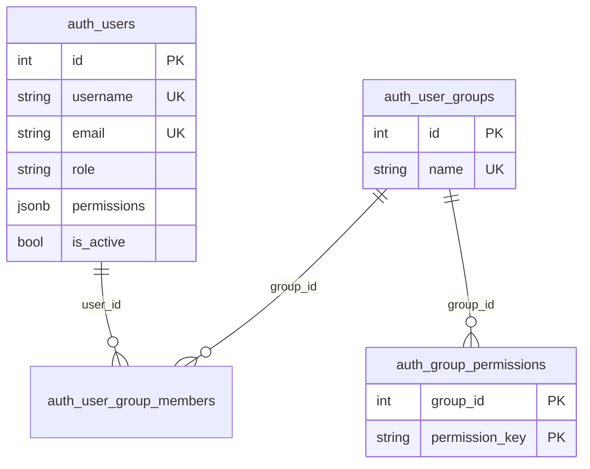
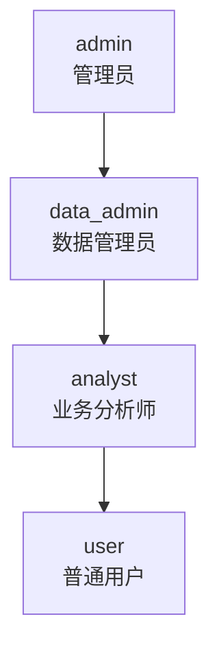
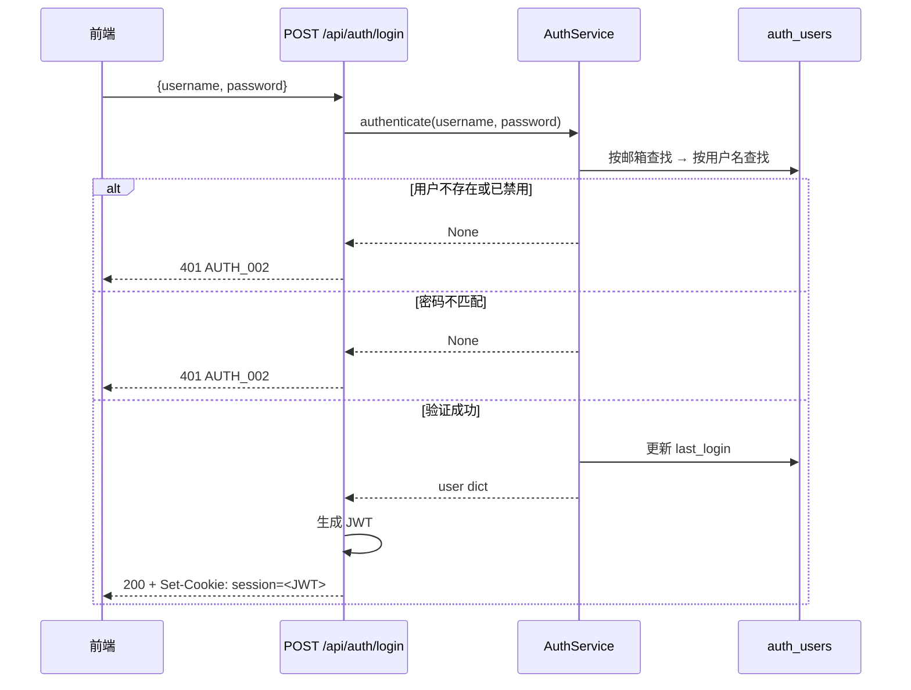
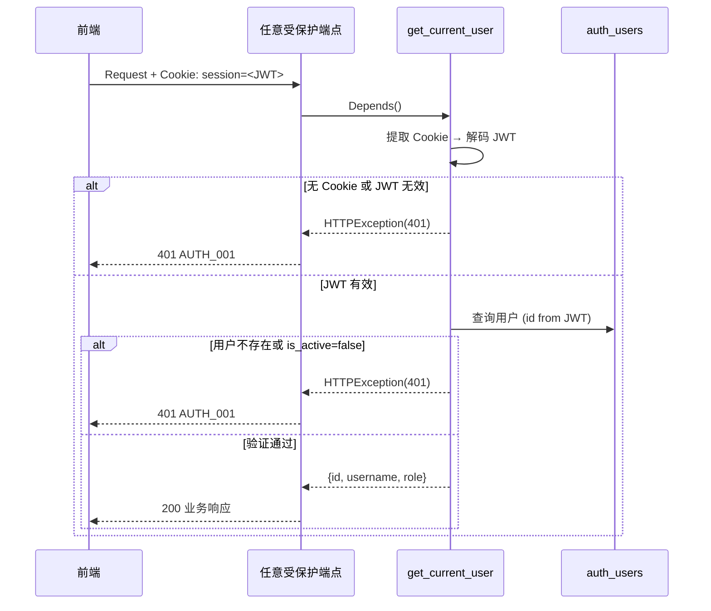

# 认证与权限 (Auth/RBAC) 技术规格书

> 版本：v1.0 | 状态：已完成 | 日期：2026-04-03

---

## 1. 概述

### 1.1 目的
定义木兰 BI 平台的完整认证授权机制，包括用户管理、用户组、权限配置、JWT 会话管理和 RBAC 权限控制。

### 1.2 范围
- **包含**：登录/注册/登出、JWT 会话、RBAC 四级角色、用户 CRUD、用户组管理、权限配置、活动标签
- **不含**：OAuth2/SSO 集成（规划中）；MFA 已实现（见 §6.3）

### 1.3 关联文档
- [02-api-conventions.md](02-api-conventions.md) — 认证守卫约定
- [01-error-codes-standard.md](01-error-codes-standard.md) — AUTH 模块错误码

---

## 2. 数据模型

### 2.1 表定义

#### auth_users
| 列名 | 类型 | 约束 | 说明 |
|------|------|------|------|
| id | INTEGER | PK, AUTO | 用户 ID |
| username | VARCHAR(64) | UNIQUE, NOT NULL, INDEX | 用户名 |
| display_name | VARCHAR(128) | NOT NULL | 显示名 |
| password_hash | VARCHAR(256) | NOT NULL | PBKDF2-SHA256 哈希 |
| email | VARCHAR(128) | UNIQUE, NOT NULL, INDEX | 邮箱 |
| role | VARCHAR(32) | DEFAULT 'user' | 角色：admin/data_admin/analyst/user |
| permissions | JSONB | NULLABLE | 个人额外权限列表 |
| is_active | BOOLEAN | DEFAULT true | 是否激活 |
| created_at | TIMESTAMP | NOT NULL, DEFAULT now() | 创建时间 |
| last_login | TIMESTAMP | NULLABLE | 最后登录时间 |

#### auth_user_groups
| 列名 | 类型 | 约束 | 说明 |
|------|------|------|------|
| id | INTEGER | PK, AUTO | 组 ID |
| name | VARCHAR(64) | UNIQUE, NOT NULL, INDEX | 组名 |
| description | VARCHAR(256) | NULLABLE | 描述 |
| created_at | TIMESTAMP | NOT NULL, DEFAULT now() | 创建时间 |

#### auth_user_group_members
| 列名 | 类型 | 约束 | 说明 |
|------|------|------|------|
| user_id | INTEGER | PK, FK → auth_users.id | 用户 ID |
| group_id | INTEGER | PK, FK → auth_user_groups.id | 组 ID |
| created_at | TIMESTAMP | DEFAULT now() | 加入时间 |

#### auth_group_permissions
| 列名 | 类型 | 约束 | 说明 |
|------|------|------|------|
| group_id | INTEGER | PK, FK → auth_user_groups.id | 组 ID |
| permission_key | VARCHAR(64) | PK | 权限标识 |
| created_at | TIMESTAMP | DEFAULT now() | 创建时间 |

### 2.2 ER 关系



---

## 3. API 设计

### 3.1 认证端点 (`/api/auth`)

| Method | Path | Auth | 说明 |
|--------|------|------|------|
| POST | `/api/auth/login` | 无 | 用户登录（用户名或邮箱），MFA 启用时返回 `{ mfa_required: true }` |
| POST | `/api/auth/register` | 无 | 用户自助注册 |
| POST | `/api/auth/logout` | Cookie | 登出（清除 Cookie + 撤销 Refresh Token） |
| POST | `/api/auth/refresh` | Cookie | 使用 Refresh Token 刷新 Access Token（Sliding Window） |
| POST | `/api/auth/refresh/revoke-all` | Cookie | 撤销当前用户所有 Refresh Token |
| GET | `/api/auth/me` | Cookie | 获取当前用户信息 |
| GET | `/api/auth/verify` | Cookie | 验证会话有效性 |
| GET | `/api/auth/mfa/status` | Cookie | 查询 MFA 启用状态 |
| POST | `/api/auth/mfa/setup` | Cookie | 生成 TOTP Secret 和 QR Code |
| POST | `/api/auth/mfa/verify-setup` | Cookie | 验证首个 Code 完成 MFA 启用 |
| POST | `/api/auth/mfa/verify` | Cookie | 登录流程第二步：验证 TOTP Code |
| POST | `/api/auth/mfa/disable` | Cookie | 禁用 MFA（需密码+MFA Code） |

#### POST /api/auth/login

**Request:**
```json
{
  "username": "admin",
  "password": "password123"
}
```
> `username` 字段支持用户名或邮箱。

**Response (200):**
```json
{
  "success": true,
  "message": "登录成功",
  "mfa_required": false,
  "user": {
    "id": 1,
    "username": "admin",
    "display_name": "管理员",
    "email": "admin@mulan.local",
    "role": "admin",
    "permissions": ["ddl_check", "tableau", "llm"],
    "group_ids": [1],
    "group_names": ["核心团队"],
    "is_active": true,
    "mfa_enabled": false,
    "created_at": "2026-04-01 00:00:00",
    "last_login": "2026-04-03 10:30:00"
  }
}
```
> 若用户已启用 MFA，`mfa_required` 为 `true`，`message` 为"请输入 MFA 验证码完成登录"，session cookie 已预置。
> 同时设置两个 HTTP-only Cookie：
> - `session=<JWT>`：Access Token，7 天有效（`Max-Age=604800`）
> - `refresh_token=<Token>`：Refresh Token，30 天 Sliding Window（`Max-Age=2592000`）

#### POST /api/auth/register

**Request:**
```json
{
  "email": "user@example.com",
  "password": "password123",
  "display_name": "张三"
}
```

**Response (200):** 同 login，自动登录并设置 Cookie。

**限流**：同一 IP 60 秒内最多 5 次，超限返回 429。

#### POST /api/auth/refresh

**说明**：使用 Refresh Token 换取新的 Access Token（Sliding Window 机制）。

**Request**: 无 Body，从 Cookie 自动读取 `refresh_token`。

**Response (200):**
```json
{ "success": true, "message": "Token 已刷新" }
```
同时颁发新的 `session` Cookie 和 `refresh_token` Cookie（轮换）。

**Response (401)**: Refresh Token 无效或已过期。

#### POST /api/auth/refresh/revoke-all

**说明**：撤销当前用户所有 Refresh Token（"退出所有设备"功能）。

**Response (200):**
```json
{ "success": true, "message": "已撤销 3 个设备登录", "revoked_count": 3 }
```

#### POST /api/auth/mfa/verify

**说明**：登录 MFA Challenge 的第二步。登录接口在 MFA 启用时返回 `mfa_required: true` 并预置 session cookie，前端调用此接口完成验证。

**Request:**
```json
{ "code": "123456" }
```

**Response (200):**
```json
{
  "success": true,
  "message": "MFA 验证成功",
  "user": { ... },
  "mfa_required": false
}
```
同时颁发 `refresh_token` Cookie 完成登录流程。

### 3.2 用户管理端点 (`/api/users`) — 仅 admin

| Method | Path | 说明 |
|--------|------|------|
| GET | `/api/users/` | 获取用户列表（可选 `?role=` 过滤） |
| POST | `/api/users/` | 创建用户 |
| PUT | `/api/users/{id}/role` | 更新角色（不可自降） |
| PUT | `/api/users/{id}/toggle-active` | 切换激活状态 |
| PUT | `/api/users/{id}/permissions` | 更新个人权限 |
| DELETE | `/api/users/{id}` | 删除用户（不可删自己） |
| GET | `/api/users/permissions` | 获取所有可用权限定义 |
| GET | `/api/users/roles` | 获取所有角色定义及默认权限 |

#### POST /api/users/

**Request:**
```json
{
  "username": "zhangsan",
  "display_name": "张三",
  "password": "password123",
  "email": "zhangsan@example.com",
  "role": "analyst"
}
```

### 3.3 用户组端点 (`/api/groups`) — 仅 admin

| Method | Path | 说明 |
|--------|------|------|
| GET | `/api/groups/` | 获取所有用户组 |
| GET | `/api/groups/{id}` | 获取组详情（含成员） |
| POST | `/api/groups/` | 创建组 |
| PUT | `/api/groups/{id}` | 更新组信息 |
| DELETE | `/api/groups/{id}` | 删除组 |
| GET | `/api/groups/{id}/members` | 获取组成员 |
| POST | `/api/groups/{id}/members` | 批量添加成员 |
| DELETE | `/api/groups/{id}/members/{user_id}` | 移除成员 |
| GET | `/api/groups/{id}/permissions` | 获取组权限 |
| PUT | `/api/groups/{id}/permissions` | 设置组权限 |

### 3.4 权限配置端点 (`/api/permissions`) — 仅 admin

| Method | Path | 说明 |
|--------|------|------|
| GET | `/api/permissions/` | 获取所有权限定义 |
| GET | `/api/permissions/users/{id}` | 获取用户完整权限（个人+组继承） |
| GET | `/api/permissions/users` | 获取所有用户（带活动标签） |
| GET | `/api/permissions/groups` | 获取所有组（带权限） |

---

## 4. 业务逻辑

### 4.1 密码哈希

- 算法：PBKDF2-SHA256
- 迭代次数：100,000
- 盐值：16 字节随机 hex
- 存储格式：`{salt}${hash_hex}`

### 4.2 JWT 会话

| 属性 | 值 |
|------|-----|
| 算法 | HS256 |
| 签名密钥 | `SESSION_SECRET` 环境变量 |
| 有效期 | 7 天 (604800 秒) |
| 存储 | HTTP-Only Cookie `session` |
| Cookie 标志 | `HttpOnly=true`, `SameSite=Lax`, `Secure=SECURE_COOKIES` |

**JWT Payload:**
```json
{
  "sub": "1",
  "username": "admin",
  "role": "admin",
  "exp": 1743724800,
  "iat": 1743120000
}
```

### 4.3 RBAC 角色体系



#### 角色默认权限

| 角色 | 默认权限 |
|------|---------|
| admin | 全部 8 项权限 |
| data_admin | database_monitor, ddl_check, rule_config, scan_logs, tableau, llm |
| analyst | scan_logs, tableau |
| user | 无默认权限 |

#### 权限标识列表

| 权限键 | 说明 |
|--------|------|
| `ddl_check` | DDL 规范检查 |
| `ddl_generator` | DDL 生成器 |
| `database_monitor` | 数据库监控 |
| `rule_config` | 规则配置 |
| `scan_logs` | 扫描日志 |
| `user_management` | 用户管理 |
| `tableau` | Tableau 资产 |
| `llm` | LLM 管理 |

### 4.4 权限计算

用户实际权限 = 角色默认权限 ∪ 个人额外权限 ∪ 组继承权限

```python
effective = set(ROLE_DEFAULT_PERMISSIONS[user.role])
         | set(user.permissions or [])
         | set(group_inherited_permissions)
```

admin 角色自动拥有全部权限，无需额外检查。

### 4.5 用户活动标签

| 标签 | 条件 | 颜色 |
|------|------|------|
| 活跃 | last_login ≤ 7 天 | emerald |
| 正常 | 7 < last_login ≤ 30 天 | blue |
| 冷门 | 30 < last_login ≤ 90 天 | orange |
| 潜水 | last_login > 90 天 | gray |
| 僵尸 | 从未登录 | red |

### 4.6 初始管理员

启动时自动检查并创建管理员账户：
- 用户名：`ADMIN_USERNAME` 环境变量（默认 `admin`）
- 密码：`ADMIN_PASSWORD` 环境变量（未设置则跳过创建）
- 邮箱：`admin@mulan.local`
- 权限：全部权限

### 4.7 自注册流程

1. 验证邮箱格式
2. 检查邮箱唯一性
3. 从邮箱 `@` 前部分生成 username（冲突则追加数字）
4. 创建用户（角色 `user`，无额外权限）
5. 自动登录（设置 JWT Cookie）

---

## 5. 错误码

| 错误码 | HTTP | 描述 |
|--------|------|------|
| AUTH_001 | 401 | 会话过期或无效 |
| AUTH_002 | 401 | 用户名或密码错误 |
| AUTH_003 | 403 | 权限不足 |
| AUTH_004 | 403 | 需要管理员角色 |
| AUTH_005 | 409 | 用户名已存在 |
| AUTH_006 | 409 | 邮箱已存在 |
| AUTH_007 | 404 | 用户不存在 |
| AUTH_008 | 403 | 账号已禁用 |
| AUTH_009 | 429 | 注册请求过于频繁 |

---

## 6. 安全

### 6.1 认证守卫

| 守卫函数 | 注入方式 | 行为 |
|---------|---------|------|
| `get_current_user(request, db)` | `Depends()` | Cookie → JWT → DB 验证 → `{id, username, role}` |
| `get_current_admin(request, db)` | `Depends()` | `get_current_user` + `role == "admin"` |
| `require_roles(request, roles, db)` | 显式调用 | `get_current_user` + `role in allowed_roles` |

### 6.2 安全措施

- JWT 每次请求从 DB 重新验证用户状态和角色（防止 Token 中角色过期）
- 密码哈希使用 PBKDF2-SHA256（100k 迭代），不存储明文
- 注册限流：IP 级别，60s/5 次
- 管理员不可自降角色、不可删除自己
- `password_hash` 不出现在 API 响应中（`to_dict()` 不包含）

### 6.3 MFA（TOTP）

**实现状态**：✅ 已实现（Sprint 3）

**功能概述**：
- 用户可在个人设置中启用/禁用 TOTP MFA
- 启用时生成随机 Base32 Secret，QR Code URI 通过 `pyotp` 生成
- Secret 和备用码（8个）使用 Fernet（`LLM_ENCRYPTION_KEY`）加密存储
- 登录流程支持 MFA Challenge：`/api/auth/login` 验证密码后，若 `mfa_enabled=true` 返回 `{ mfa_required: true }` 并预置 session cookie，前端显示 MFA 验证码输入框

**API 端点**：

| 方法 | 路径 | 说明 |
|------|------|------|
| `GET /api/auth/mfa/status` | 查询 MFA 启用状态 |
| `POST /api/auth/mfa/setup` | 生成 TOTP Secret 和 QR Code URI |
| `POST /api/auth/mfa/verify-setup` | 验证首个 Code 完成 MFA 启用 |
| `POST /api/auth/mfa/verify` | 登录流程第二步：验证 TOTP Code |
| `POST /api/auth/mfa/disable` | 禁用 MFA（需密码+MFA Code 双重验证） |

**备用码**：8个一次性备用码，加密存储，使用后标记为 `None`

---

## 7. 集成点

| 方向 | 对象 | 说明 |
|------|------|------|
| 被依赖 | 全部 API 模块 | 所有端点通过守卫函数验证身份 |
| 被依赖 | 数据源模块 | `owner_id` FK → `auth_users.id` |
| 被依赖 | Tableau 模块 | `owner_id` FK → `auth_users.id` |
| 被依赖 | 语义模块 | 审批/发布操作需角色验证 |
| 被依赖 | 操作日志 | 记录 `operator` 用户名 |

---

## 8. 时序图

### 8.1 登录流程



### 8.2 受保护端点访问



---

## 9. 测试策略

### 9.1 关键测试场景

| 场景 | 预期 |
|------|------|
| 正确凭据登录 | 200 + Cookie 设置 |
| 错误密码登录 | 401 |
| 禁用用户登录 | 401 |
| 邮箱登录 | 200 |
| 注册重复邮箱 | 400 |
| 注册限流 | 429 (第 6 次) |
| 无 Cookie 访问受保护端点 | 401 |
| 过期 JWT 访问 | 401 |
| user 角色访问 admin 端点 | 403 |
| admin 自降角色 | 400 |
| admin 删除自己 | 400 |
| 组权限继承 | 用户获得组权限 |

---

## 10. 开放问题

| # | 问题 | 状态 |
|---|------|------|
| 1 | 是否引入 OAuth2/SSO（如 LDAP、企业微信） | 规划中 |
| 2 | 是否增加 MFA（TOTP/WebAuthn） | ✅ 已实现 TOTP（Sprint 3） |
| 3 | JWT Token 刷新机制（当前 7 天一刀切） | ✅ 已实现 Refresh Token（Sprint 3） |
| 4 | 密码策略是否需要加强（复杂度、过期） | 待讨论 |
| 5 | 权限键是否需要细粒度化（如 `tableau:read` vs `tableau:write`） | 待讨论 |
