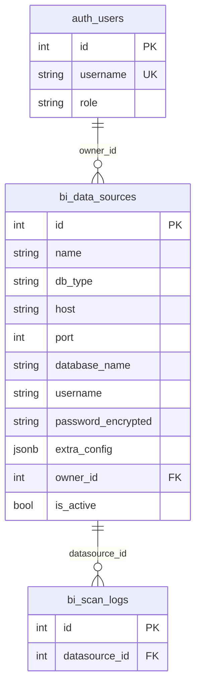
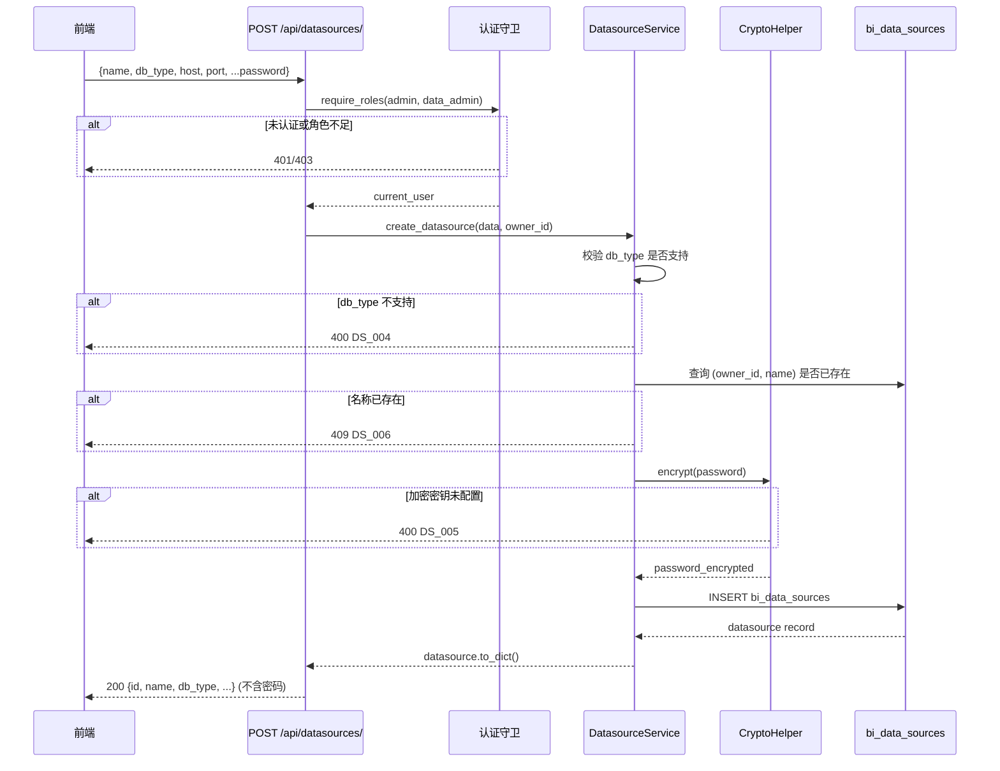
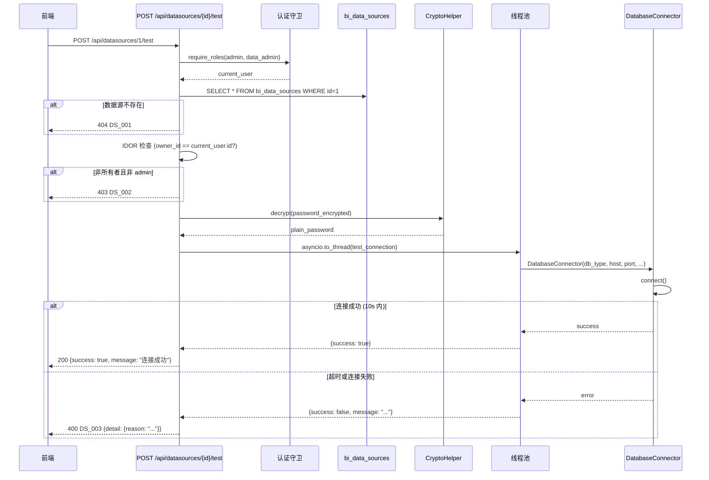

# 数据源管理技术规格书

> 版本：v1.0 | 状态：已完成 | 日期：2026-04-03

---

## 1. 概述

### 1.1 目的
定义木兰 BI 平台的数据源管理模块，包括数据源 CRUD、密码加密存储、连接测试和基于所有者的访问控制（IDOR 防护）。

### 1.2 范围
- **包含**：数据源注册/编辑/删除、Fernet 密码加密、连接测试、所有权隔离、多数据库类型支持
- **不包含**：Tableau 连接管理（独立模型，见 TAB 模块）、连接池管理、数据源元数据自动发现

### 1.3 关联文档
| 文档 | 路径 | 关系 |
|------|------|------|
| 统一错误码标准 | [01-error-codes-standard.md](01-error-codes-standard.md) | DS 模块错误码定义 |
| API 约定 | [02-api-conventions.md](02-api-conventions.md) | 请求/响应格式规范 |
| 认证与权限 | [04-auth-rbac-spec.md](04-auth-rbac-spec.md) | 上游依赖 — 认证守卫、角色定义 |

---

## 2. 数据模型

### 2.1 表定义

#### `bi_data_sources`

| 列名 | 类型 | 约束 | 说明 |
|------|------|------|------|
| id | INTEGER | PK, AUTO | 主键 |
| name | VARCHAR(128) | NOT NULL | 数据源名称（同一 owner 下唯一） |
| db_type | VARCHAR(32) | NOT NULL | 数据库类型 |
| host | VARCHAR(256) | NOT NULL | 主机地址 |
| port | INTEGER | NOT NULL | 端口号 |
| database_name | VARCHAR(128) | NOT NULL | 数据库名 |
| username | VARCHAR(128) | NOT NULL | 连接用户名 |
| password_encrypted | VARCHAR(512) | NOT NULL | Fernet 加密后的密码 |
| extra_config | JSONB | NULLABLE | 扩展配置（SSL、编码等） |
| owner_id | INTEGER | NOT NULL, FK → auth_users.id | 所有者 |
| is_active | BOOLEAN | DEFAULT true | 是否启用 |
| created_at | TIMESTAMP | NOT NULL, DEFAULT now() | 创建时间 |
| updated_at | TIMESTAMP | DEFAULT now(), ON UPDATE | 更新时间 |

#### 支持的 `db_type` 枚举值

| 值 | 数据库 |
|----|--------|
| `mysql` | MySQL |
| `sqlserver` | SQL Server |
| `postgresql` | PostgreSQL |
| `hive` | Apache Hive |
| `starrocks` | StarRocks |
| `doris` | Apache Doris |

#### `extra_config` JSON 结构示例

```json
{
  "ssl": true,
  "ssl_ca": "/path/to/ca.pem",
  "charset": "utf8mb4",
  "connect_timeout": 30,
  "query_timeout": 60
}
```

### 2.2 ER 关系图



### 2.3 索引策略

| 表 | 索引名 | 列 | 类型 | 用途 |
|----|--------|-----|------|------|
| bi_data_sources | ix_ds_owner_id | owner_id | BTREE | 按所有者查询加速 |
| bi_data_sources | uq_ds_owner_name | (owner_id, name) | UNIQUE | 同一用户下名称唯一 |

### 2.4 迁移说明

- Alembic 迁移脚本需确保 `password_encrypted` 列长度足够容纳 Fernet 密文（建议 512）。
- `extra_config` 使用 PostgreSQL `JSONB` 类型，支持 JSON 路径查询。
- `owner_id` 外键添加 `ON DELETE CASCADE`（删除用户时级联删除其数据源）需根据业务决策确定，当前建议为 `RESTRICT`。

---

## 3. API 设计

### 3.1 端点总览

| 方法 | 路径 | 认证 | 角色 | 说明 |
|------|------|------|------|------|
| GET | `/api/datasources/` | Cookie | 任意已认证 | 列表 — admin 见全部，其他仅见自有 |
| POST | `/api/datasources/` | Cookie | admin, data_admin | 创建数据源 |
| GET | `/api/datasources/{id}` | Cookie | owner 或 admin | 获取单个数据源 |
| PUT | `/api/datasources/{id}` | Cookie | admin, data_admin (owner 或 admin) | 更新数据源 |
| DELETE | `/api/datasources/{id}` | Cookie | admin, data_admin (owner 或 admin) | 删除数据源 |
| POST | `/api/datasources/{id}/test` | Cookie | admin, data_admin (owner 或 admin) | 测试连接 |

### 3.2 请求/响应 Schema

#### `POST /api/datasources/` - 创建数据源

**Request:**
```json
{
  "name": "生产环境 MySQL",
  "db_type": "mysql",
  "host": "10.0.1.100",
  "port": 3306,
  "database_name": "prod_bi",
  "username": "bi_reader",
  "password": "plain_text_password",
  "extra_config": {
    "ssl": true,
    "charset": "utf8mb4"
  }
}
```

**Response (200):**
```json
{
  "id": 1,
  "name": "生产环境 MySQL",
  "db_type": "mysql",
  "host": "10.0.1.100",
  "port": 3306,
  "database_name": "prod_bi",
  "username": "bi_reader",
  "extra_config": {
    "ssl": true,
    "charset": "utf8mb4"
  },
  "owner_id": 2,
  "is_active": true,
  "created_at": "2026-04-03 10:00:00",
  "updated_at": "2026-04-03 10:00:00"
}
```

> **注意**：响应中 **不包含** `password_encrypted` 字段，`to_dict()` 方法默认排除密码。

**错误响应：**
```json
{
  "error_code": "DS_006",
  "message": "数据源名称已存在",
  "detail": {}
}
```

#### `GET /api/datasources/` - 列表查询

**Response (200):**
```json
[
  {
    "id": 1,
    "name": "生产环境 MySQL",
    "db_type": "mysql",
    "host": "10.0.1.100",
    "port": 3306,
    "database_name": "prod_bi",
    "username": "bi_reader",
    "extra_config": {},
    "owner_id": 2,
    "is_active": true,
    "created_at": "2026-04-03 10:00:00",
    "updated_at": "2026-04-03 10:00:00"
  }
]
```

> admin 角色返回所有数据源；其他角色仅返回 `owner_id` 等于当前用户 ID 的记录。

#### `GET /api/datasources/{id}` - 获取单个

**Response (200):** 同创建响应结构。

**错误响应：**
- 404: `DS_001` 数据源不存在
- 403: `DS_002` 非数据源所有者（非 admin 访问他人数据源）

#### `PUT /api/datasources/{id}` - 更新

**Request:**
```json
{
  "name": "生产环境 MySQL (更新)",
  "host": "10.0.1.101",
  "port": 3306,
  "password": "new_password"
}
```

> 所有字段均为可选，仅传入需要更新的字段。若传入 `password`，将重新加密存储。

#### `DELETE /api/datasources/{id}` - 删除

**Response (200):**
```json
{
  "success": true,
  "message": "数据源已删除"
}
```

#### `POST /api/datasources/{id}/test` - 连接测试

**Response (200):**
```json
{
  "success": true,
  "message": "连接成功"
}
```

**错误响应 (400):**
```json
{
  "error_code": "DS_003",
  "message": "连接测试失败",
  "detail": {
    "reason": "Can't connect to MySQL server on '10.0.1.100' (timed out)"
  }
}
```

---

## 4. 业务逻辑

### 4.1 密码加密

| 属性 | 值 |
|------|-----|
| 算法 | Fernet (AES-128-CBC + HMAC-SHA256) |
| 密钥来源 | `DATASOURCE_ENCRYPTION_KEY` 环境变量 |
| 实现 | `services/common/crypto.py` — `CryptoHelper` |
| 加密时机 | 创建/更新数据源时对 `password` 明文加密 |
| 解密时机 | 连接测试、健康扫描等需要实际连接时内部解密 |

**加密流程：**
1. 从环境变量读取 Fernet 密钥
2. 若密钥未配置，抛出 `DS_005` 错误
3. 使用 `Fernet(key).encrypt(password.encode())` 加密
4. 将密文存入 `password_encrypted` 列

**密码不可逆原则：**
- API 响应 **永不** 返回 `password_encrypted` 字段
- `to_dict()` 方法默认排除该字段
- 更新时若未传入 `password` 字段，保留原密文不变

### 4.2 IDOR 防护

所有涉及单个数据源的操作（GET/{id}、PUT/{id}、DELETE/{id}、POST/{id}/test）均执行以下检查：

```
1. 从 DB 查询数据源记录
2. 若记录不存在 → 返回 DS_001 (404)
3. 若当前用户角色为 admin → 放行
4. 若当前用户 ID != datasource.owner_id → 返回 DS_002 (403)
5. 执行业务操作
```

### 4.3 连接测试

| 属性 | 值 |
|------|-----|
| 连接器 | `ddl_check_engine.connector.DatabaseConnector` |
| 执行方式 | `asyncio.to_thread()` 线程池 |
| 超时 | 10 秒 |
| 返回 | `{success: bool, message: str}` |

**连接测试流程：**
1. 验证 IDOR 权限
2. 从 DB 读取数据源记录
3. 解密 `password_encrypted`
4. 构造连接参数（host, port, db, user, password, extra_config）
5. 在线程池中创建 `DatabaseConnector` 并尝试连接
6. 10 秒超时后中断返回失败

### 4.4 校验规则

- `name`：非空，最大 128 字符，同一 `owner_id` 下唯一
- `db_type`：必须在支持列表内（mysql/sqlserver/postgresql/hive/starrocks/doris）
- `host`：非空，最大 256 字符
- `port`：正整数，范围 1-65535
- `database_name`：非空，最大 128 字符
- `username`：非空，最大 128 字符
- `password`：创建时必填，更新时可选

---

## 5. 错误码

| 错误码 | HTTP | 描述 | 触发条件 |
|--------|------|------|---------|
| DS_001 | 404 | 数据源不存在 | 按 ID 查询数据源未找到 |
| DS_002 | 403 | 非数据源所有者 | 非所有者尝试访问/编辑/删除数据源 |
| DS_003 | 400 | 连接测试失败 | 连接目标数据库超时或被拒绝 |
| DS_004 | 400 | 不支持的数据库类型 | 提供的 `db_type` 不在支持列表内 |
| DS_005 | 400 | 加密密钥未配置 | 环境变量 `DATASOURCE_ENCRYPTION_KEY` 未设置 |
| DS_006 | 409 | 数据源名称已存在 | 同一用户下数据源名称重复 |

---

## 6. 安全

### 6.1 角色权限矩阵

| 操作 | admin | data_admin | analyst | user |
|------|-------|-----------|---------|------|
| 列表（全部） | Y | N | N | N |
| 列表（仅自有） | Y | Y | Y | Y |
| 创建 | Y | Y | N | N |
| 查看详情（自有） | Y | Y | Y | Y |
| 查看详情（他人） | Y | N | N | N |
| 更新（自有） | Y | Y | N | N |
| 更新（他人） | Y | N | N | N |
| 删除（自有） | Y | Y | N | N |
| 删除（他人） | Y | N | N | N |
| 连接测试（自有） | Y | Y | N | N |
| 连接测试（他人） | Y | N | N | N |

### 6.2 加密密钥隔离

- `DATASOURCE_ENCRYPTION_KEY` **不得** 硬编码在代码或配置文件中
- 生产环境通过 Secret Manager 或环境变量注入
- 密钥丢失将导致所有已存储密码不可解密（不可逆），需重新录入
- 建议密钥长度：Fernet 标准 32 字节 URL-safe base64 编码

### 6.3 密码处理

| 环节 | 处理方式 |
|------|---------|
| API 接收 | 明文传入（HTTPS 传输加密） |
| 存储 | Fernet 加密后存入 `password_encrypted` |
| API 返回 | **永不返回**，`to_dict()` 排除 |
| 内部使用 | 仅在连接测试/健康扫描时解密，解密后立即使用，不缓存明文 |
| 日志 | 禁止记录明文密码或密文 |

### 6.4 IDOR 防护总结

- 所有单资源操作均验证 `owner_id` 与当前用户匹配
- admin 角色豁免所有权检查
- 列表接口通过 SQL 过滤（非 admin 仅查询 `owner_id = current_user.id`）
- 不依赖前端隐藏 ID，后端强制校验

---

## 7. 集成点

### 7.1 上游依赖

| 模块 | 接口 | 用途 |
|------|------|------|
| 认证模块 (AUTH) | `get_current_user` / `require_roles` | 身份验证与角色校验 |
| 加密工具 | `services/common/crypto.py` — `CryptoHelper` | 密码加密/解密 |
| DDL 检查引擎 | `ddl_check_engine.connector.DatabaseConnector` | 连接测试 |

### 7.2 下游消费者

| 模块 | 消费方式 | 说明 |
|------|---------|------|
| 健康扫描 (HS) | 读取数据源连接信息 | 扫描目标数据库的表结构与健康指标 |
| DDL 检查 | 通过 `DatabaseConnector` | 执行 DDL 合规检查时连接目标库 |
| 语义维护 (SM) | 关联数据源 | 为数据源字段添加语义标注 |

### 7.3 独立模块说明

- **Tableau 模块不依赖本数据源模型**。Tableau 连接使用独立的 `tableau_connections` 表（PAT 认证），与 `bi_data_sources` 无关联关系。

---

## 8. 时序图

### 8.1 创建数据源



### 8.2 连接测试



---

## 9. 测试策略

### 9.1 关键测试场景

| # | 场景 | 预期 | 优先级 |
|---|------|------|--------|
| 1 | admin 创建数据源 | 200，密码加密存储，响应不含密码 | P0 |
| 2 | data_admin 创建数据源 | 200 | P0 |
| 3 | analyst 创建数据源 | 403 | P0 |
| 4 | 创建重名数据源（同 owner） | 409 DS_006 | P0 |
| 5 | 创建不支持的 db_type | 400 DS_004 | P1 |
| 6 | 加密密钥未配置时创建 | 400 DS_005 | P1 |
| 7 | owner 查看自有数据源 | 200 | P0 |
| 8 | 非 owner 非 admin 查看他人数据源 | 403 DS_002 | P0 |
| 9 | admin 查看任意数据源 | 200 | P0 |
| 10 | 列表接口 admin 返回全部 | 全量数据 | P0 |
| 11 | 列表接口非 admin 仅返回自有 | 过滤后数据 | P0 |
| 12 | owner 更新自有数据源 | 200 | P1 |
| 13 | 更新时修改密码 | 密码重新加密 | P1 |
| 14 | 更新时不传密码 | 原密码保留 | P1 |
| 15 | 连接测试成功 | 200 {success: true} | P0 |
| 16 | 连接测试超时 (>10s) | 400 DS_003 | P0 |
| 17 | 连接测试拒绝连接 | 400 DS_003 | P1 |
| 18 | 删除不存在的数据源 | 404 DS_001 | P1 |
| 19 | 非 owner 删除他人数据源 | 403 DS_002 | P0 |
| 20 | 密码字段不出现在任何响应中 | 检查所有 API 响应 | P0 |

### 9.2 验收标准

- [ ] 所有 6 种 db_type 均可正常创建和测试连接
- [ ] 密码在数据库中以 Fernet 密文存储，API 响应不包含密码
- [ ] 非 admin 用户无法访问/修改/删除他人数据源
- [ ] 连接测试 10 秒超时正确触发
- [ ] 加密密钥缺失时返回明确错误而非 500
- [ ] 同一 owner 下数据源名称唯一约束生效

---

## 10. 开放问题

| # | 问题 | 负责人 | 状态 |
|---|------|--------|------|
| 1 | `owner_id` 外键删除策略：CASCADE vs RESTRICT，用户删除时数据源如何处理 | 架构组 | 待定 |
| 2 | 是否需要数据源共享机制（将数据源共享给其他用户/用户组） | 产品经理 | 待讨论 |
| 3 | 加密密钥轮转方案：密钥更新后如何批量重加密已有密码 | 安全组 | 待定 |
| 4 | 是否需要连接池复用（当前每次测试新建连接） | 架构组 | 待讨论 |
| 5 | `extra_config` 是否需要定义各 db_type 的 JSON Schema 校验 | 后端组 | 待定 |
| 6 | 数据源被健康扫描或语义维护引用时，是否允许删除 | 产品经理 | 待讨论 |
