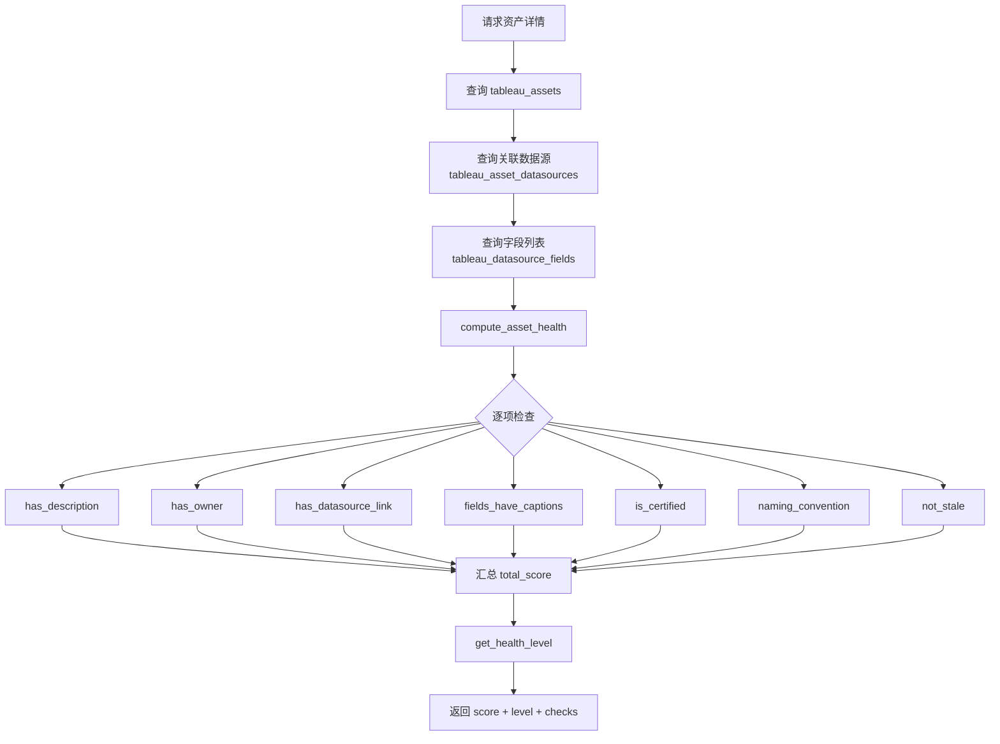

# Tableau 资产健康评分技术规格书

> 版本：v1.0 | 状态：已完成 | 日期：2026-04-03

---

## 1. 概述

### 1.1 目的
定义 Tableau 资产的 7 因子健康评分体系，用于评估工作簿、视图、数据源等资产的元数据完备性和治理水平。

### 1.2 范围
- **包含**：7 项检查因子定义、权重分配、评分算法、等级划分
- **不含**：数仓级健康扫描（见 [11-health-scan-spec.md](11-health-scan-spec.md)）

### 1.3 区别说明

| 项目 | Tableau 健康评分 (本 Spec) | 数仓健康扫描 (Spec 11) |
|------|---------------------------|----------------------|
| 评估对象 | Tableau 资产元数据 | 目标数据库表结构 |
| 数据来源 | 已同步的 tableau_assets | 直连目标数据库 |
| 执行方式 | 同步计算（API 请求时） | 异步 Celery 任务 |
| 存储 | 计算结果缓存至 `tableau_assets.health_score` / `health_details`（见 §4.2） | bi_health_scan_records |

### 1.4 关联文档
- [07-tableau-mcp-v1-spec.md](07-tableau-mcp-v1-spec.md) — Tableau 资产模型

---

## 2. 评分因子

### 2.1 因子定义

| # | 因子键 | 名称 | 权重 | 判定逻辑 |
|---|--------|------|------|---------|
| 1 | `has_description` | 有描述信息 | 20 | `asset.description` 非空且非纯空白 |
| 2 | `has_owner` | 有所有者 | 15 | `asset.owner_name` 非空且非纯空白 |
| 3 | `has_datasource_link` | 有关联数据源 | 15 | `len(datasources) > 0` |
| 4 | `fields_have_captions` | 字段有中文名 | 20 | 有 caption 的字段 / 总字段 ≥ 50% |
| 5 | `is_certified` | 已认证 | 10 | `asset.is_certified == true` |
| 6 | `naming_convention` | 命名规范 | 10 | 名称不以数字开头、不含特殊字符(@#$!) |
| 7 | `not_stale` | 近期有更新 | 10 | `updated_on_server` 距今 < 90 天 |
| | | **合计** | **100** | |

### 2.2 特殊处理

- **fields_have_captions**：当无字段数据时，跳过检查并给满分（20 分）
- **fields_have_captions**：按比例给分 `20 × min(1.0, ratio)`，如 80% 字段有中文名得 16 分
- **not_stale**：无 `updated_on_server` 值时判定为过期

---

## 3. 评分算法

### 3.1 计算公式

```python
total_score = 0
for check in HEALTH_CHECKS:
    if check_passed(asset, check):
        total_score += check["weight"]  # fields_have_captions 按比例
score = round(total_score, 1)  # 保留 1 位小数
```

### 3.2 等级划分

| 等级 | 英文代码 | 分数范围 | 含义 |
|------|---------|---------|------|
| 优秀 | `excellent` | ≥ 80 | 元数据完备，治理良好 |
| 良好 | `good` | 60 ~ 79 | 部分元数据缺失 |
| 警告 | `warning` | 40 ~ 59 | 较多元数据缺失 |
| 差 | `poor` | < 40 | 元数据严重缺失 |

---

## 4. API 集成

健康评分不独立暴露 API，而是嵌入 Tableau 资产详情接口。

### 4.1 调用方式

```
GET /api/tableau/assets/{asset_id}
```

响应中包含 `health` 字段：

```json
{
  "id": 1,
  "name": "销售月报",
  "asset_type": "view",
  "...": "...",
  "health": {
    "score": 75.0,
    "level": "good",
    "checks": [
      {
        "key": "has_description",
        "label": "有描述信息",
        "weight": 20,
        "passed": true,
        "detail": "已填写描述"
      },
      {
        "key": "fields_have_captions",
        "label": "字段有中文名",
        "weight": 20,
        "passed": true,
        "detail": "15/20 个字段有中文名 (75%)"
      }
    ]
  }
}
```

### 4.2 计算时机

- **请求时计算**：每次访问资产详情时实时计算
- **结果缓存**：评分结果写入 `tableau_assets.health_score`（Float）和 `health_details`（JSONB），供列表页快速显示和连接级健康总览聚合使用
- **输入来源**：`tableau_assets` + `tableau_asset_datasources` + `tableau_datasource_fields`

---

## 5. 业务逻辑流程



---

## 6. 安全

- 健康评分仅对有资产浏览权限的角色可见（admin/data_admin/analyst）
- 评分结果不含敏感数据，仅包含元数据完备性判断

---

## 7. 集成点

| 方向 | 对象 | 说明 |
|------|------|------|
| 依赖 | tableau_assets | 资产基本信息 |
| 依赖 | tableau_asset_datasources | 数据源关联关系 |
| 依赖 | tableau_datasource_fields | 字段中文名比例 |
| 被消费 | 资产详情 API | 嵌入响应中 |
| 被消费 | 前端健康看板 | 展示评分和改进建议 |

---

## 8. 测试策略

| 场景 | 预期 |
|------|------|
| 全部因子通过 | score=100, level=excellent |
| 无描述 + 无所有者 | score ≤ 65 |
| 无字段数据 | fields_have_captions 跳过，给满分 |
| 50% 字段有中文名 | 该项得 10 分 (20×50%) |
| 超过 90 天未更新 | not_stale 不通过 |
| 名称以数字开头 | naming_convention 不通过 |
| 空资产（所有字段为空） | score ≤ 20, level=poor |

---

## 9. 开放问题

| # | 问题 | 状态 |
|---|------|------|
| 1 | 是否需要持久化评分用于趋势分析 | 待讨论 |
| 2 | 权重是否支持管理员自定义 | 规划中 |
| 3 | 是否增加更多检查因子（如标签完备性、权限分配） | 规划中 |
