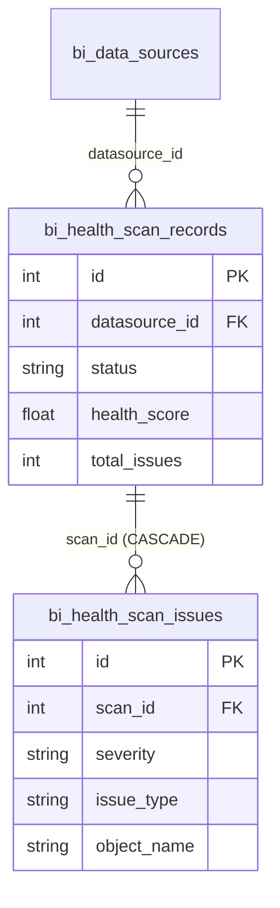
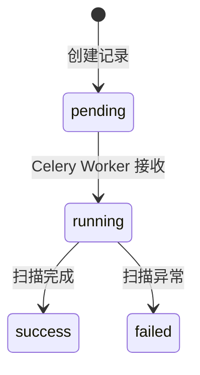
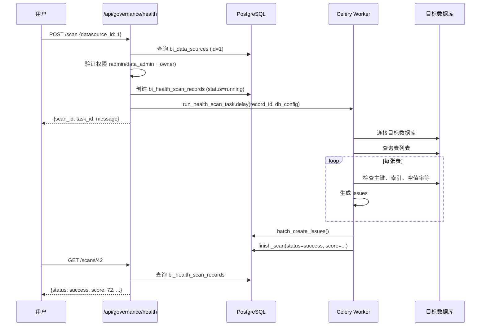

# 数仓健康扫描技术规格书

> 版本：v1.0 | 状态：已完成 | 日期：2026-04-03

---

## 1. 概述

### 1.1 目的
定义数仓健康扫描模块的完整技术规格，包括对目标数据库表结构进行自动化检查、问题识别和评分报告。

### 1.2 范围
- **包含**：扫描触发、异步执行、问题识别、评分计算、HTML 报告导出、扫描历史管理
- **不含**：Tableau 资产健康评分（见 [10-tableau-health-scoring-spec.md](10-tableau-health-scoring-spec.md)）

### 1.3 关联文档
- [05-datasource-management-spec.md](05-datasource-management-spec.md) — 数据源连接信息
- [01-error-codes-standard.md](01-error-codes-standard.md) — HS 模块错误码

---

## 2. 数据模型

### 2.1 表定义

#### bi_health_scan_records
| 列名 | 类型 | 约束 | 说明 |
|------|------|------|------|
| id | INTEGER | PK, AUTO | 扫描记录 ID |
| datasource_id | INTEGER | NOT NULL, INDEX | 目标数据源 ID |
| datasource_name | VARCHAR(128) | NOT NULL | 数据源名称（冗余存储） |
| db_type | VARCHAR(32) | NOT NULL | 数据库类型 |
| database_name | VARCHAR(128) | NOT NULL | 数据库名 |
| status | VARCHAR(16) | NOT NULL, DEFAULT 'pending' | pending/running/success/failed |
| started_at | TIMESTAMP | NULLABLE | 开始时间 |
| finished_at | TIMESTAMP | NULLABLE | 完成时间 |
| total_tables | INTEGER | DEFAULT 0 | 检查表数 |
| total_issues | INTEGER | DEFAULT 0 | 问题总数 |
| high_count | INTEGER | DEFAULT 0 | 高风险问题数 |
| medium_count | INTEGER | DEFAULT 0 | 中风险问题数 |
| low_count | INTEGER | DEFAULT 0 | 低风险问题数 |
| health_score | FLOAT | NULLABLE | 健康评分 |
| error_message | TEXT | NULLABLE | 失败错误信息 |
| triggered_by | INTEGER | NULLABLE | 触发用户 ID |
| created_at | TIMESTAMP | NOT NULL, DEFAULT now() | 创建时间 |

#### bi_health_scan_issues
| 列名 | 类型 | 约束 | 说明 |
|------|------|------|------|
| id | INTEGER | PK, AUTO | 问题 ID |
| scan_id | INTEGER | NOT NULL, FK → records.id, CASCADE | 所属扫描 |
| severity | VARCHAR(16) | NOT NULL | HIGH/MEDIUM/LOW |
| object_type | VARCHAR(16) | NOT NULL | table/field |
| object_name | VARCHAR(256) | NOT NULL | 对象名称 |
| database_name | VARCHAR(128) | NULLABLE | 所属数据库 |
| issue_type | VARCHAR(64) | NOT NULL | 问题类型 |
| description | TEXT | NOT NULL | 问题描述 |
| suggestion | TEXT | NULLABLE | 改进建议 |
| created_at | TIMESTAMP | NOT NULL, DEFAULT now() | 创建时间 |

### 2.2 索引
- `ix_issue_scan_severity` — `(scan_id, severity)` 复合索引
- `bi_health_scan_records.datasource_id` — 单列索引

### 2.3 ER 关系



---

## 3. API 设计

### 3.1 端点总览 (`/api/governance/health`)

| Method | Path | Auth | 说明 |
|--------|------|------|------|
| POST | `/scan` | admin/data_admin | 发起扫描 |
| GET | `/scans` | 已认证 | 扫描历史列表 |
| GET | `/scans/{id}` | 已认证 | 扫描详情 |
| GET | `/scans/{id}/issues` | 已认证 | 问题列表 |
| GET | `/scans/{id}/report` | 已认证 | 导出 HTML 报告 |
| GET | `/summary` | 已认证 | 各数据源最新扫描总览 |

### 3.2 POST /scan — 发起扫描

**Request:**
```json
{
  "datasource_id": 1
}
```

**Response (200):**
```json
{
  "scan_id": 42,
  "task_id": "celery-task-uuid",
  "message": "扫描已启动"
}
```

### 3.3 GET /scans — 扫描历史

**Query Params:** `datasource_id`(可选), `page`(默认1), `page_size`(默认20)

**Response:**
```json
{
  "scans": [
    {
      "id": 42,
      "datasource_id": 1,
      "datasource_name": "生产数据库",
      "db_type": "postgresql",
      "database_name": "prod_db",
      "status": "success",
      "started_at": "2026-04-03 10:00:00",
      "finished_at": "2026-04-03 10:02:30",
      "total_tables": 50,
      "total_issues": 12,
      "high_count": 2,
      "medium_count": 5,
      "low_count": 5,
      "health_score": 72.0,
      "triggered_by": 1,
      "created_at": "2026-04-03 10:00:00"
    }
  ],
  "total": 1,
  "page": 1,
  "page_size": 20
}
```

### 3.4 GET /scans/{id}/issues — 问题列表

**Query Params:** `severity`(可选, HIGH/MEDIUM/LOW), `page`, `page_size`(默认50)

**Response:**
```json
{
  "issues": [
    {
      "id": 1,
      "scan_id": 42,
      "severity": "HIGH",
      "object_type": "table",
      "object_name": "orders",
      "database_name": "prod_db",
      "issue_type": "missing_primary_key",
      "description": "表缺少主键定义",
      "suggestion": "建议添加主键以确保数据完整性"
    }
  ],
  "total": 12,
  "page": 1,
  "page_size": 50
}
```

### 3.5 GET /scans/{id}/report — HTML 报告

返回 `Content-Type: text/html`，附带 `Content-Disposition: attachment` 头。

报告包含：
- 健康评分（带颜色指示：绿 ≥80, 黄 ≥60, 红 <60）
- 检查表数、问题总数、高/中/低分布
- 问题明细表格（风险/对象类型/对象名/问题类型/描述/建议）

### 3.6 GET /summary — 数据源总览

返回每个数据源的最新一次扫描记录（通过子查询 `MAX(id) GROUP BY datasource_id`）。

---

## 4. 业务逻辑

### 4.1 扫描状态机



### 4.2 评分算法

```python
score = 100 - high_count * 20 - medium_count * 5 - low_count * 1
score = max(0, min(100, score))
```

### 4.3 异步执行

1. API 创建 `HealthScanRecord`（status=running）
2. 调用 `run_health_scan_task.delay(record_id, db_config)` 发送到 Celery
3. Celery Worker 连接目标数据库
4. 执行检查 SQL（表统计、空值率、索引缺失等）
5. 批量创建 `HealthScanIssue` 记录
6. 更新 `HealthScanRecord`（status=success/failed，统计计数，评分）

### 4.4 IDOR 保护

- 发起扫描：非 admin 只能扫描 `owner_id == user.id` 的数据源
- 查看结果：所有已认证用户可查看（analyst 角色可查看）

---

## 5. 错误码

| 错误码 | HTTP | 描述 |
|--------|------|------|
| HS_001 | 404 | 扫描记录不存在 |
| HS_002 | 409 | 扫描任务进行中 |
| HS_003 | 400 | 数据源连接失败 |
| HS_004 | 502 | 数据库查询超时 |

---

## 6. 安全

- 扫描时解密数据源密码（`DATASOURCE_ENCRYPTION_KEY`），密码仅在 Worker 进程内存中存在
- 扫描 SQL 使用参数化查询
- 扫描不修改目标数据库（只读操作）
- `error_message` 不暴露连接凭证

---

## 7. 集成点

| 方向 | 对象 | 说明 |
|------|------|------|
| 依赖 | bi_data_sources | 获取连接凭证 |
| 依赖 | Celery + Redis | 异步任务执行 |
| 依赖 | DATASOURCE_ENCRYPTION_KEY | 解密密码 |
| 被消费 | 前端健康看板 | 展示扫描结果和趋势 |
| 被消费 | 数据治理模块 | 质量评分输入 |

---

## 8. 时序图



---

## 9. 测试策略

| 场景 | 预期 |
|------|------|
| 扫描正常数据库 | status=success, 有评分 |
| 数据源不存在 | 404 |
| 非所有者发起扫描 | 403 |
| 目标数据库不可达 | status=failed, error_message 有值 |
| 扫描无问题的数据库 | score=100, total_issues=0 |
| 按 severity 过滤问题 | 只返回对应级别 |
| HTML 报告导出 | Content-Type: text/html |
| 未完成扫描导出报告 | 400 |
| 数据源总览 | 每个数据源只返回最新一条 |

---

## 10. 开放问题

| # | 问题 | 状态 |
|---|------|------|
| 1 | 是否支持定时自动扫描（Celery Beat） | 规划中 |
| 2 | 扫描检查项是否可配置化 | 待讨论 |
| 3 | 是否需要扫描结果对比（两次扫描的 diff） | 规划中 |
| 4 | 大表扫描超时策略（单表超时 vs 总超时） | 待讨论 |
