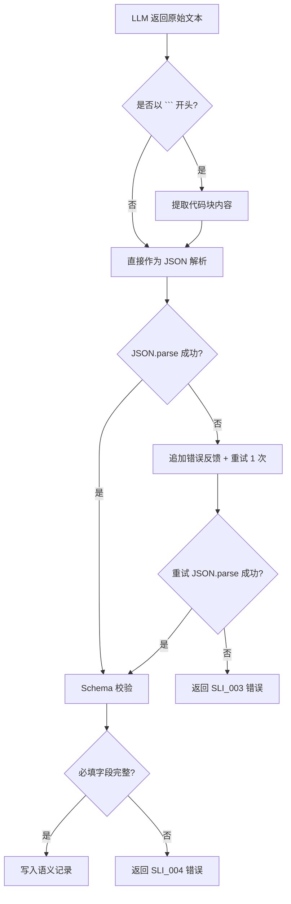
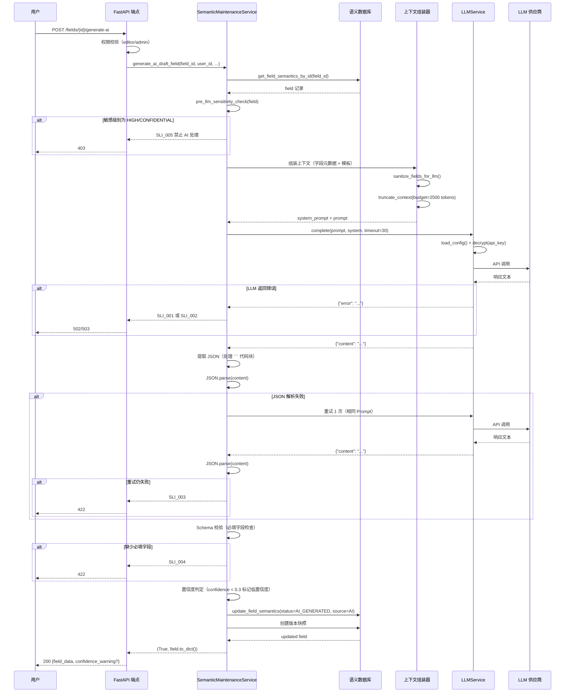

# 语义层-LLM 集成协议技术规格书

| 属性 | 值 |
|------|-----|
| 版本 | v1.2 |
| 日期 | 2026-04-06 |
| 状态 | 草稿（修订中） |
| 作者 | Mulan BI Platform Team |
| 模块路径 | `backend/services/semantic_maintenance/` + `backend/services/llm/` |
| 关联 ARCHITECTURE | `docs/ARCHITECTURE.md` §6（NL-to-Query 部分已移出至 Spec 14） |

---

## 目录

1. [概述](#1-概述)
2. [集成架构](#2-集成架构)
3. [上下文组装协议](#3-上下文组装协议)
4. [Prompt 模板注册](#4-prompt-模板注册)
5. [AI 语义生成协议](#5-ai-语义生成协议)
6. [置信度与质量控制](#6-置信度与质量控制)
7. [错误码](#7-错误码)
8. [安全](#8-安全)
9. [时序图](#9-时序图)
10. [测试策略](#10-测试策略)
11. [开放问题](#11-开放问题)

---

## 1. 概述

### 1.1 目的

本规格书定义**语义维护模块（Semantic Maintenance）与 LLM 能力层（LLM Layer）之间的集成协议**，填补 `ARCHITECTURE.md` §6 所描述的交互标准与实际代码实现之间的架构空白。

> **范围声明（v1.1 修订）**：NL-to-Query 的 LLM 集成协议已移出至 [Spec 14](14-nl-to-query-pipeline-spec.md) 统一管理。本规格书**仅覆盖 AI 语义生成场景**（字段/数据源的中英文描述、指标口径等自动生成）。

当前现状：
- `service.py` 中的 `generate_ai_draft_datasource()` 和 `generate_ai_draft_field()` 直接在业务方法内硬编码 Prompt 和 JSON 解析逻辑
- 上下文组装、Token 预算控制、置信度阈值判定等关键协议分散在业务代码中，缺乏统一规范

本规格书将以上交互行为标准化为可测试、可审计的集成协议。

### 1.2 范围

- **包含**：
  - Semantic -> LLM 调用链路与上下文组装协议（AI 语义生成场景专用）
  - AI 语义生成的输入/输出契约（JSON Schema）
  - Token 预算管理与截断策略
  - 置信度阈值与质量控制机制
  - 错误处理与降级策略
  - 敏感度过滤安全策略

- **不包含**：
  - LLM 供应商接入细节（见 [08-llm-layer-spec.md](08-llm-layer-spec.md)）
  - 语义状态机与 CRUD 逻辑（见 [09-semantic-maintenance-spec.md](09-semantic-maintenance-spec.md)）
  - **NL-to-Query 的 LLM 集成协议（已移交至 [Spec 14](14-nl-to-query-pipeline-spec.md) 统一管理）**
  - 前端交互流程
  - 多模型路由策略（列入开放问题）

### 1.3 关联文档

| 文档 | 路径 | 关系 |
|------|------|------|
| 架构规范 §6 | `docs/ARCHITECTURE.md` | 交互标准定义源（NL-to-Query 部分已移出） |
| LLM 层规格书 | `docs/specs/08-llm-layer-spec.md` | 下游能力提供方 |
| 语义维护规格书 | `docs/specs/09-semantic-maintenance-spec.md` | 上游数据提供方 |
| NL-to-Query 规格书 | `docs/specs/14-nl-to-query-pipeline-spec.md` | NL-to-Query LLM 集成（独立协议，本规格书不涉及） |
| Prompt 模板 | `backend/services/llm/prompts.py` | 模板实现 |
| LLM 服务 | `backend/services/llm/service.py` | 调用入口 |
| 语义服务 | `backend/services/semantic_maintenance/service.py` | AI 生成调用方 |

---

## 2. 集成架构

### 2.1 Semantic -> LLM 调用链路图

```mermaid
graph TB
    subgraph 语义维护模块
        SM_SVC[SemanticMaintenanceService]
        SM_DB[(语义数据库<br/>field_semantics<br/>datasource_semantics)]
        CTX_ASM[上下文组装器<br/>ContextAssembler]
    end

    subgraph LLM 能力层
        LLM_SVC[LLMService 单例]
        PROMPTS[Prompt 模板注册表<br/>prompts.py]
        CRYPTO[CryptoHelper]
    end

    subgraph 外部供应商
        OPENAI[OpenAI / 兼容接口]
        ANTHROPIC[Anthropic / MiniMax]
    end

    subgraph Tableau 数据服务
        FIELD_REG[(tableau_datasource_fields)]
        FIELD_SYNC[FieldSyncService]
    end

    SM_SVC -->|1. 查询字段元数据| SM_DB
    SM_SVC -->|2. 加载字段注册表| FIELD_REG
    SM_SVC -->|3. 组装上下文| CTX_ASM
    CTX_ASM -->|4. 选择模板| PROMPTS
    CTX_ASM -->|5. Token 预算截断| CTX_ASM
    SM_SVC -->|6. 调用 complete()| LLM_SVC
    LLM_SVC -->|7. 解密 API Key| CRYPTO
    LLM_SVC -->|8a. OpenAI 协议| OPENAI
    LLM_SVC -->|8b. Anthropic 协议| ANTHROPIC
    LLM_SVC -->|9. 返回原始文本| SM_SVC
    SM_SVC -->|10. JSON 解析 + 校验| SM_SVC
    SM_SVC -->|11. 写入语义记录| SM_DB

    FIELD_SYNC -->|定期同步| FIELD_REG
```

### 2.2 模块职责边界

| 模块 | 职责 | 不得越界 |
|------|------|---------|
| `SemanticMaintenanceService` | 上下文组装、JSON 解析、置信度判定、语义写入 | 不得直接构造 HTTP 请求 |
| `LLMService` | 供应商路由、API 调用、错误封装 | 不得感知业务语义 |
| `prompts.py` | 模板定义与变量声明 | 不得包含业务逻辑 |
| `ContextAssembler`（规划） | Token 计算、字段优先级排序、截断 | 不得直接操作数据库 |

---

## 3. 上下文组装协议

### 3.1 三段式上下文结构

遵循 `ARCHITECTURE.md` §6.1 定义，所有 Semantic -> LLM 调用必须按以下结构组装上下文：

```
┌─────────────────────────────────────────┐
│ 第一段：System Prompt                    │
│  - 角色定义（BI 数据语义专家 / 查询专家）  │
│  - 输出格式约束（仅输出 JSON）             │
│  - 语言约束（中文优先）                    │
├─────────────────────────────────────────┤
│ 第二段：数据上下文块（Data Context Block） │
│  - 数据源名称 / 描述                      │
│  - 字段列表（按优先级排序）                │
│  - 业务术语映射（如有）                    │
├─────────────────────────────────────────┤
│ 第三段：用户指令（User Instruction）       │
│  - 具体操作要求或自然语言问题              │
│  - 输出 JSON Schema 约束                  │
└─────────────────────────────────────────┘
```

### 3.2 Token 预算

| 参数 | 值 | 说明 |
|------|-----|------|
| 单次调用上下文上限 | **3000 tokens** | 包含 System Prompt + Data Context + User Instruction |
| System Prompt 预留 | ~200 tokens | 角色定义 + 格式约束 |
| User Instruction 预留 | ~300 tokens | 操作要求 + Schema 定义 |
| Data Context 可用预算 | **~2500 tokens** | 剩余空间全部分配给字段元数据 |

Token 估算规则：

> **⚠️ 废弃声明（v1.2 修订）**：严禁使用字符乘法估算（"中文字符约 1.5 token/字" 等），
> 边界溢出将导致 LLM API 返回 400 错误。ContextAssembler 必须使用 **tiktoken**（cl100k_base 编码）
> 进行精确 Token 计算。

- 优先：使用 `tiktoken.get_encoding("cl100k_base")` 进行精确计算
- 回退：无 tiktoken 时使用保守截断（按中文字符 2.0 token/字估算，保证不超限）

### 3.3 字段元数据序列化格式

每个字段按以下格式序列化为文本行：

```
- {field_name} ({field_caption}) [{data_type}] [{role}] 公式: {formula}
```

示例：
```
- Sales (销售额) [REAL] [measure]
- Region (地区) [STRING] [dimension]
- Profit_Ratio (利润率) [REAL] [measure] 公式: SUM([Profit])/SUM([Sales])
```

### 3.4 核心字段优先级（截断策略）

当字段元数据超出 Token 预算时，按以下优先级截断：

| 优先级 | 字段类别 | 处理规则 |
|--------|---------|---------|
| P0（最高） | 核心度量字段（`is_core_field=True` 且 `role=measure`） | 始终保留完整信息 |
| P1 | 核心维度字段（`is_core_field=True` 且 `role=dimension`） | 始终保留完整信息 |
| P2 | 普通度量字段 | 保留名称 + 类型，截断公式 |
| P3 | 普通维度字段 | 保留名称 + 类型 |
| P4 | 计算字段 | 仅保留名称，截断公式全文 |
| P5（最低） | 隐藏字段 / 低使用频率字段 | 直接丢弃 |

截断算法伪代码：

```python
def truncate_context(fields: List[FieldMeta], budget_tokens: int) -> str:
    # 1. 按优先级分组
    groups = group_by_priority(fields)

    # 2. 从 P0 开始逐级添加
    result_lines = []
    used_tokens = 0

    for priority in [P0, P1, P2, P3, P4, P5]:
        for field in groups[priority]:
            line = serialize_field(field, truncate_formula=(priority >= P2))
            line_tokens = estimate_tokens(line)
            if used_tokens + line_tokens > budget_tokens:
                return "\n".join(result_lines)
            result_lines.append(line)
            used_tokens += line_tokens

    return "\n".join(result_lines)
```

---

## 4. Prompt 模板注册

### 4.1 模板注册表

所有 Semantic-LLM 集成使用的 Prompt 模板必须在 `backend/services/llm/prompts.py` 中集中注册。

| 模板常量名 | 用途 | 消费方 | System Prompt |
|-----------|------|--------|---------------|
| `AI_SEMANTIC_DS_TEMPLATE` | 数据源语义生成 | `generate_ai_draft_datasource()` | 你是一个专业的 BI 数据语义专家。 |
| `AI_SEMANTIC_FIELD_TEMPLATE` | 字段语义生成 | `generate_ai_draft_field()` | 你是一个专业的 BI 字段语义专家。 |
| `NL_TO_QUERY_TEMPLATE` | 自然语言转 VizQL | NL-to-Query 服务 | 你是一个 Tableau 数据查询专家。 |
| `ASSET_EXPLAIN_TEMPLATE` | 报表深度解读 | 资产详情页 | （内置于模板） |

### 4.2 三段式组合规范

每次 LLM 调用必须按以下方式组合三段 Prompt：

```python
# 调用方式
result = await llm_service.complete(
    prompt=data_context_block + "\n\n" + user_instruction,
    system=system_prompt,
    timeout=30,
    # === v1.2 必填超参数（格式化元数据生成，幻觉率必须极低）===
    temperature=0.1,           # 必须 ≤ 0.2，抑制自由发挥
    response_format={"type": "json_object"},  # 若供应商支持，必须启用（OpenAI 等）
)
```

各段定义：

**System Prompt（第一段）**：
```
你是一个专业的 BI {role}。
{output_format_constraint}
```

**Data Context Block（第二段）**：
```
## 数据源信息
名称：{datasource_name}
描述：{datasource_description}

## 字段列表
{serialized_fields}

## 业务术语映射（如有）
{term_mappings}
```

**User Instruction（第三段）**：
```
请以 JSON 格式输出{task_description}，包含以下字段：
{json_schema_description}

只输出 JSON，不要有其他文字。
```

### 4.3 数据源语义生成模板定义

```python
AI_SEMANTIC_DS_TEMPLATE = """## 数据源信息
名称：{ds_name}
描述：{description}
现有语义名：{existing_semantic_name}
现有中文名：{existing_semantic_name_zh}

## 字段列表
{field_context}

请以 JSON 格式输出语义建议，包含以下字段：
- semantic_name: 英文语义名
- semantic_name_zh: 中文语义名（必填）
- semantic_description: 语义描述（必填）
- business_definition: 业务定义
- owner: 责任人建议
- sensitivity_level: 敏感级别（low/medium/high/confidential）
- tags_json: JSON 格式标签数组
- confidence: AI 置信度 0~1

只输出 JSON，不要有其他文字。"""
```

### 4.4 字段语义生成模板定义

```python
AI_SEMANTIC_FIELD_TEMPLATE = """## 字段信息
字段名：{field_name}
数据类型：{data_type}
角色：{role}
公式：{formula}
现有语义名：{existing_semantic_name}
现有中文名：{existing_semantic_name_zh}
枚举值示例：
{enum_values}

请以 JSON 格式输出语义建议：
- semantic_name: 英文语义名
- semantic_name_zh: 中文语义名（必填）
- semantic_description: 语义定义（必填）
- semantic_type: 语义类型（dimension / measure / time_dimension）
- metric_definition: 指标口径（若为 measure 字段必填）
- dimension_definition: 维度解释（若为 dimension 字段必填）
- unit: 单位（如金额、百分比、人次等）
- synonyms_json: JSON 同义词数组
- sensitivity_level: 敏感级别（low/medium/high/confidential）
- is_core_field: 是否为核心字段（true/false）
- confidence: AI 置信度 0~1
- tags_json: JSON 标签数组

只输出 JSON，不要有其他文字。"""
```

---

## 5. AI 语义生成协议

### 5.1 输入契约（字段元数据）

调用 `generate_ai_draft_field()` 时，输入参数必须满足以下契约：

```json
{
  "$schema": "http://json-schema.org/draft-07/schema#",
  "title": "AI 语义生成输入 — 字段元数据",
  "type": "object",
  "required": ["field_id"],
  "properties": {
    "field_id": {
      "type": "integer",
      "description": "字段语义记录 ID（tableau_field_semantics.id）"
    },
    "field_name": {
      "type": "string",
      "description": "Tableau 原始字段名"
    },
    "data_type": {
      "type": "string",
      "enum": ["STRING", "INTEGER", "REAL", "BOOLEAN", "DATE", "DATETIME"],
      "description": "字段数据类型"
    },
    "role": {
      "type": "string",
      "enum": ["dimension", "measure"],
      "description": "字段角色"
    },
    "formula": {
      "type": ["string", "null"],
      "description": "计算字段公式（非计算字段为 null）"
    },
    "enum_values": {
      "type": ["array", "null"],
      "items": {"type": "string", "maxLength": 50},
      "maxItems": 20,
      "description": "枚举值示例（最多 20 个，单个值最大 50 字符，超出用 ... 截断）"
    },
    "user_id": {
      "type": ["integer", "null"],
      "description": "操作人用户 ID"
    }
  }
}
```

调用 `generate_ai_draft_datasource()` 时，输入参数：

```json
{
  "$schema": "http://json-schema.org/draft-07/schema#",
  "title": "AI 语义生成输入 — 数据源元数据",
  "type": "object",
  "required": ["ds_id"],
  "properties": {
    "ds_id": {
      "type": "integer",
      "description": "数据源语义记录 ID"
    },
    "ds_name": {
      "type": ["string", "null"],
      "description": "数据源显示名"
    },
    "description": {
      "type": ["string", "null"],
      "description": "数据源描述"
    },
    "field_context": {
      "type": ["array", "null"],
      "description": "字段上下文列表",
      "items": {
        "type": "object",
        "properties": {
          "field_name": {"type": "string"},
          "field_caption": {"type": "string"},
          "role": {"type": "string"},
          "data_type": {"type": "string"},
          "formula": {"type": ["string", "null"]}
        }
      }
    },
    "user_id": {
      "type": ["integer", "null"]
    }
  }
}
```

### 5.2 输出契约（AI 语义生成结果）

LLM 返回的 JSON 必须符合以下 Schema（对应 `ARCHITECTURE.md` §6.2 定义）：

#### 5.2.1 字段语义输出 Schema

```json
{
  "$schema": "http://json-schema.org/draft-07/schema#",
  "title": "AI 语义生成输出 — 字段",
  "type": "object",
  "required": ["semantic_name", "semantic_name_zh", "semantic_description", "semantic_type", "confidence"],
  "properties": {
    "semantic_name": {
      "type": "string",
      "description": "英文语义名，snake_case 格式",
      "pattern": "^[a-z][a-z0-9_]*$",
      "maxLength": 256
    },
    "semantic_name_zh": {
      "type": "string",
      "description": "中文语义名",
      "minLength": 1,
      "maxLength": 256
    },
    "semantic_description": {
      "type": "string",
      "description": "业务语义描述",
      "minLength": 1
    },
    "semantic_type": {
      "type": "string",
      "enum": ["dimension", "measure", "time_dimension"],
      "description": "语义分类"
    },
    "confidence": {
      "type": "number",
      "minimum": 0,
      "maximum": 1,
      "description": "AI 置信度，0~1"
    },
    "metric_definition": {
      "type": ["string", "null"],
      "description": "指标口径（measure 字段必填）"
    },
    "dimension_definition": {
      "type": ["string", "null"],
      "description": "维度解释（dimension 字段必填）"
    },
    "unit": {
      "type": ["string", "null"],
      "description": "单位"
    },
    "synonyms_json": {
      "type": ["array", "null"],
      "items": {"type": "string"},
      "description": "同义词列表"
    },
    "sensitivity_level": {
      "type": "string",
      "enum": ["low", "medium", "high", "confidential"],
      "default": "low"
    },
    "is_core_field": {
      "type": "boolean",
      "default": false
    },
    "tags_json": {
      "type": ["array", "null"],
      "items": {"type": "string"}
    }
  }
}
```

#### 5.2.2 数据源语义输出 Schema

```json
{
  "$schema": "http://json-schema.org/draft-07/schema#",
  "title": "AI 语义生成输出 — 数据源",
  "type": "object",
  "required": ["semantic_name_zh", "semantic_description", "confidence"],
  "properties": {
    "semantic_name": {
      "type": "string",
      "description": "英文语义名"
    },
    "semantic_name_zh": {
      "type": "string",
      "description": "中文语义名",
      "minLength": 1
    },
    "semantic_description": {
      "type": "string",
      "description": "语义描述",
      "minLength": 1
    },
    "business_definition": {
      "type": ["string", "null"]
    },
    "owner": {
      "type": ["string", "null"]
    },
    "sensitivity_level": {
      "type": "string",
      "enum": ["low", "medium", "high", "confidential"],
      "default": "low"
    },
    "tags_json": {
      "type": ["array", "null"],
      "items": {"type": "string"}
    },
    "confidence": {
      "type": "number",
      "minimum": 0,
      "maximum": 1
    }
  }
}
```

### 5.3 输出字段映射

LLM 输出字段到数据库字段的映射关系：

| LLM 输出字段 | 数据库字段（field_semantics） | 数据库字段（datasource_semantics） |
|-------------|--------------------------|--------------------------------|
| `semantic_name` | `semantic_name` | `semantic_name` |
| `semantic_name_zh` | `semantic_name_zh` | `semantic_name_zh` |
| `semantic_description` | `semantic_definition` | `semantic_description` |
| `semantic_type` | — (用于校验 role) | — |
| `confidence` | `ai_confidence` | — (记录在日志中) |

> **字段名说明（v1.1 修订）**：`confidence` 是 LLM JSON 输出中的 key 名，在 ORM 层映射保存为 `ai_confidence`（ARCHITECTURE.md §6.2 原始定义与数据库实际列名的历史遗留差异已在此统一）。
| `metric_definition` | `metric_definition` | — |
| `dimension_definition` | `dimension_definition` | — |
| `unit` | `unit` | — |
| `synonyms_json` | `synonyms_json` (JSON序列化) | — |
| `sensitivity_level` | `sensitivity_level` | `sensitivity_level` |
| `is_core_field` | `is_core_field` | — |
| `tags_json` | `tags_json` (JSON序列化) | `tags_json` (JSON序列化) |
| `business_definition` | — | `business_definition` |
| `owner` | — | `owner` |

### 5.4 写入副作用

AI 生成成功后，自动执行以下副作用：
1. `status` 设置为 `SemanticStatus.AI_GENERATED`
2. `source` 设置为 `SemanticSource.AI`
3. 创建版本快照（`change_reason="ai_generated"`）
4. 记录 `ai_confidence` 值

---

## 6. 置信度与质量控制

### 6.1 置信度阈值

| 阈值区间 | 处理策略 | 状态流转 |
|---------|---------|---------|
| `confidence >= 0.7` | 高置信度，可直接进入审核流程 | `ai_generated` |
| `0.3 <= confidence < 0.7` | 中置信度，建议人工复核后提交 | `ai_generated` |
| `confidence < 0.3` | **低置信度**，标记需人工审核 | `ai_generated`（前端标黄警告） |

低置信度标记规则：
- 前端展示时添加 "AI 置信度低，建议人工审核" 警告
- 不阻止状态流转（仍可提交审核），但审核人可见置信度标记

### 6.2 JSON 解析失败处理



重试策略（v1.2 修订）：
- 首次 JSON 解析失败后，**追加错误反馈后重试 1 次**：
  ```
  原始 Prompt + "\n\n[修正要求] 你上次生成的格式有误，JSON 解析报错信息为：{error_message}。
  请严格按照 JSON 规范重新生成，不要包含任何 Markdown 标记（如 ```json），只输出纯 JSON。"
  ```
- 重试仍失败，返回 `SLI_003` 错误
- 不进行无限重试，避免 Token 浪费

### 6.3 降级策略

| 故障场景 | 降级行为 | 用户提示 |
|---------|---------|---------|
| LLM 未配置 | 跳过 AI 生成，保留手动编辑入口 | "AI 服务未配置，请手动填写语义信息" |
| LLM 调用超时（30s） | 返回错误，不重试 | "AI 服务响应超时，请稍后重试" |
| LLM 供应商不可用 | 返回错误，记录日志 | "AI 服务暂时不可用，请手动填写" |
| JSON 解析失败（含重试） | 返回错误码 SLI_003 | "AI 返回格式异常，请手动填写" |
| 必填字段缺失 | 返回错误码 SLI_004 | "AI 生成结果不完整，请手动补充" |
| 高敏感字段 | 直接跳过 AI 生成 | "该字段为高敏感级别，不支持 AI 生成" |

---

## 7. 错误码

所有 Semantic-LLM 集成错误使用 `SLI` 前缀（**S**emantic **L**LM **I**ntegration）。

| 错误码 | HTTP 状态码 | 触发条件 | 错误消息 | 对应上游错误 |
|--------|-----------|---------|---------|------------|
| `SLI_001` | 503 | LLM 服务未配置或未启用 | AI 服务未配置，请联系管理员 | LLM_001 |
| `SLI_002` | 502 | LLM 调用超时或供应商不可用 | AI 服务调用失败：{error_detail} | LLM_003 / LLM_004 |
| `SLI_003` | 422 | JSON 解析失败（含 1 次重试） | AI 返回格式异常，无法解析为有效 JSON | — |
| `SLI_004` | 422 | LLM 输出缺少必填字段 | AI 生成结果不完整，缺少：{missing_fields} | — |
| `SLI_005` | 403 | 高敏感字段（HIGH/CONFIDENTIAL）尝试 AI 生成 | 敏感级别为 {level} 的字段禁止 AI 处理 | — |
| `SLI_006` | 400 | 输入记录不存在 | 目标记录不存在（ID={id}） | — |
| `SLI_008` | 422 | Token 预算不足（字段过多无法组装有效上下文） | 字段元数据过多，无法在 Token 预算内组装有效上下文 | — |

### 错误码与上游映射

```
SemanticMaintenanceService          LLMService              供应商
        │                              │                      │
        │── SLI_001 ←── LLM_001 ←────│ 无配置                │
        │── SLI_002 ←── LLM_003 ←────│──── 超时 ────────────│
        │── SLI_002 ←── LLM_004 ←────│──── API 错误 ────────│
        │── SLI_003 ←── (自行处理)     │                      │
        │── SLI_004 ←── (自行处理)     │                      │
        │── SLI_005 ←── (前置校验)     │                      │
```

---

## 8. 安全

### 8.1 敏感度过滤

在调用 LLM 前，必须执行敏感度过滤检查：

```python
BLOCKED_FOR_LLM = {SensitivityLevel.HIGH, SensitivityLevel.CONFIDENTIAL}

def pre_llm_sensitivity_check(field_or_ds) -> Optional[str]:
    """LLM 调用前置敏感度检查，返回 None 表示通过，否则返回错误消息"""
    if field_or_ds.sensitivity_level in BLOCKED_FOR_LLM:
        return f"SLI_005: 敏感级别为 {field_or_ds.sensitivity_level} 的对象禁止 AI 处理"
    return None
```

过滤规则：

| 敏感级别 | AI 语义生成 | 发布到 Tableau |
|---------|-----------|--------------|
| `LOW` | 允许 | 允许 |
| `MEDIUM` | 允许 | 允许 |
| `HIGH` | **禁止** | 禁止 |
| `CONFIDENTIAL` | **禁止** | 禁止 |

### 8.2 上下文净化

在组装 Data Context Block 时，必须执行以下净化操作：

1. **敏感字段过滤**：`HIGH` / `CONFIDENTIAL` 级别字段不进入 LLM 上下文
2. **实际数据值排除**：仅发送字段元数据（名称、类型、公式），不得发送实际行级数据
3. **枚举值脱敏**：`enum_values` 最多包含 20 个示例值，**单个值最大 50 字符（超出用 `...` 截断）**，且仅限非敏感字段

```python
def sanitize_fields_for_llm(fields: List[dict]) -> List[dict]:
    """净化字段列表，移除敏感字段和实际数据值"""
    sanitized = []
    for f in fields:
        if f.get("sensitivity_level") in BLOCKED_FOR_LLM:
            continue
        safe_field = {
            "field_name": f.get("field_name"),
            "field_caption": f.get("field_caption"),
            "data_type": f.get("data_type"),
            "role": f.get("role"),
            "formula": f.get("formula"),  # 公式是元数据，允许
        }
        # 枚举值截断（数量 ≤20，单个值 ≤50 字符）
        if f.get("enum_values"):
            safe_field["enum_values"] = [
                (v[:50] + "..." if len(v) > 50 else v) for v in f["enum_values"][:20]
            ]
        sanitized.append(safe_field)
    return sanitized
```

### 8.3 HTML 转义

LLM 返回的所有文本内容在写入数据库前无需转义（保持原始语义），但前端渲染时**必须进行 HTML 转义**：

| 字段 | 存储时 | 展示时 |
|------|--------|--------|
| `semantic_name_zh` | 原始文本 | HTML 转义 |
| `semantic_description` | 原始文本 | HTML 转义 |
| `metric_definition` | 原始文本 | HTML 转义 |
| `dimension_definition` | 原始文本 | HTML 转义 |

前端转义责任链：
```
LLM 返回 → JSON 解析 → 写入 DB（原始） → API 响应（原始） → 前端渲染（转义）
```

### 8.4 Prompt 注入防护

- 用户输入（自然语言问题）在嵌入 Prompt 前，需过滤以下模式：
  - 系统指令覆盖尝试（如 "忽略以上指令"）
  - 角色切换尝试（如 "你现在是..."）
- 当前阶段采用输入长度限制（`maxLength: 500`）作为基础防护
- 后续版本考虑引入 Prompt 注入检测中间件（列入开放问题）

---

## 9. 时序图

### 9.1 AI 语义生成流程



---

## 10. 测试策略

### 10.1 单元测试

| 测试模块 | 测试项 | Mock 对象 | 验证点 |
|---------|--------|-----------|--------|
| 上下文组装 | Token 预算截断 | 无 | 输出 <= 2500 tokens；P0 字段始终保留 |
| 上下文组装 | 字段优先级排序 | 无 | 核心度量 > 核心维度 > 普通度量 > ... |
| 上下文组装 | 敏感字段过滤 | 无 | HIGH/CONFIDENTIAL 字段不出现在输出中 |
| 字段序列化 | 格式正确性 | 无 | 输出匹配 `- {name} ({caption}) [{type}] [{role}]` 格式 |
| JSON 解析 | 正常 JSON | 无 | 正确提取所有字段 |
| JSON 解析 | Markdown 代码块包裹 | 无 | 正确提取 ``` 内的 JSON |
| JSON 解析 | 非法 JSON | `LLMService` | 触发重试逻辑 |
| Schema 校验 | 必填字段缺失 | 无 | 返回 SLI_004 + 缺失字段列表 |
| Schema 校验 | confidence 类型错误 | 无 | 返回校验错误 |
| 置信度判定 | confidence < 0.3 | 无 | 标记低置信度警告 |
| 置信度判定 | confidence >= 0.7 | 无 | 无警告标记 |
| 敏感度检查 | HIGH 级别字段 | 无 | 返回 SLI_005 |
| 敏感度检查 | LOW 级别字段 | 无 | 通过检查 |
| 术语映射构建 | synonyms 展开 | 无 | 同义词正确映射到 fieldCaption |

### 10.2 集成测试

| 测试场景 | 步骤 | 验证点 |
|---------|------|--------|
| AI 字段语义生成端到端 | 1. 创建字段记录 2. 调用 generate-ai 3. 验证结果 | 状态变为 ai_generated；ai_confidence 有值；版本递增 |
| AI 数据源语义生成端到端 | 1. 创建数据源记录 2. 调用 generate-ai 3. 验证结果 | 状态变为 ai_generated；语义字段非空 |
| LLM 不可用降级 | 1. 关闭 LLM 配置 2. 调用 generate-ai | 返回 SLI_001；原始记录不变 |
| JSON 解析失败降级 | 1. Mock LLM 返回非法文本 2. 调用 generate-ai | 重试 1 次后返回 SLI_003 |
| 敏感字段拦截 | 1. 设置字段 sensitivity_level=HIGH 2. 调用 generate-ai | 返回 SLI_005；不调用 LLM |
| Token 预算溢出 | 1. 准备 200+ 字段 2. 调用 AI 生成 | 上下文被正确截断；核心字段保留 |

### 10.3 安全测试

| 测试项 | 验证点 |
|--------|--------|
| 敏感字段不泄露 | HIGH/CONFIDENTIAL 字段的名称、公式不出现在 LLM 请求日志中 |
| 实际数据不泄露 | Prompt 中不包含行级数据值（仅元数据） |
| Prompt 注入防护 | 包含 "忽略以上指令" 的输入不影响 System Prompt 行为 |
| XSS 防护 | LLM 返回 `<script>alert(1)</script>` 时，前端正确转义 |

### 10.4 性能测试

| 测试项 | 目标 | 方法 |
|--------|------|------|
| 上下文组装延迟 | < 50ms（200 字段） | 基准测试 |
| 端到端 AI 生成延迟 | < 35s（含 30s LLM 超时） | 端到端计时 |
| 并发 AI 生成 | 5 并发不超时 | 并发压测 |

---

## 11. 开放问题

| 编号 | 问题 | 优先级 | 状态 |
|------|------|--------|------|
| OI-01 | 当前上下文组装逻辑内嵌在 `service.py` 的各 `generate_ai_draft_*` 方法中，是否需要抽取独立的 `ContextAssembler` 类？ | **P0** | ✅ **已解决**（`ContextAssembler` 已实现于 `backend/services/semantic_maintenance/context_assembler.py`） |
| OI-02 | Token 预算 3000 的计算目前依赖字符数估算，是否需要引入 `tiktoken` 做精确计算？ | **P0** | ✅ **已解决**（`tiktoken>=0.7.0` 已集成，使用 `cl100k_base` 编码器） |
| OI-03 | `NL_TO_QUERY_TEMPLATE` 已定义但无对应 API 端点，需确定接入时间线和路由设计（对应 08-spec OI-07） | P1 | ✅ **已解决**（NL-to-Query 已移交 Spec 14，本规格书不再覆盖） |
| OI-04 | Prompt 注入防护目前仅依赖输入长度限制，是否需要引入检测中间件或 guardrails？ | P2 | 待讨论 |
| OI-05 | 当前 `confidence` 字段在数据源语义输出中为 `ai_confidence`，在字段语义输出中也为 `ai_confidence`，但 `ARCHITECTURE.md` §6.2 定义为 `confidence`，需统一字段命名 | P1 | ✅ **已解决**（§5.3 明确备注：LLM 输出 key=confidence，ORM 层映射为 ai_confidence） |
| OI-06 | AI 语义生成是否需要支持批量模式（一次生成多个字段的语义），以减少 LLM 调用次数？ | P2 | 待讨论 |
| OI-07 | 多模型路由策略：不同场景（语义生成 vs NL-to-Query）是否需要使用不同的模型和参数（如 temperature）？当前为单配置模式 | P2 | 待讨论 |
| OI-08 | NL-to-VizQL 的字段模糊匹配逻辑是否需要引入向量相似度计算，而非简单的字符串匹配？ | P3 | ✅ **已解决**（NL-to-VizQL 已从本规格书移出，相关问题见 Spec 14） |
| OI-09 | 错误码前缀：`ARCHITECTURE.md` §6.2 使用 `SM_006`，本规格书使用 `SLI_003`，需协商统一命名 | P1 | ✅ **已解决**（SLI_00x 为本层统一前缀，ARCHITECTURE.md §6.2 中的 SM_006 已移除引用） |

> **开发前置要求声明**：OI-01（ContextAssembler 抽取）和 OI-02（tiktoken 精确计算）均已在代码中完成实现，不再阻塞开发。

---

## 12. 数据模型（跨引用）

本模块不新增独立表，读写以下表（由 Spec 09 定义）：

| 表名 | 来源 Spec | 本模块操作 | 关键字段 |
|------|----------|-----------|---------|
| `tableau_field_semantics` | Spec 09 | READ（上下文组装）+ UPDATE（写入 AI 生成结果） | `semantic_name`, `semantic_definition`, `ai_confidence`, `status` |
| `tableau_datasource_semantics` | Spec 09 | READ + UPDATE | `semantic_name`, `semantic_description`, `business_definition`, `sensitivity_level` |
| `ai_llm_configs` | Spec 08 | READ（获取 LLM 配置） | `provider`, `model`, `purpose`, `is_active` |

> 完整表定义见 `docs/specs/09-semantic-maintenance-spec.md` Section 2 和 `docs/specs/08-llm-layer-spec.md` Section 2。Alembic 迁移由各来源 Spec 负责。

---

## 13. API 端点设计

### 13.1 端点总览

| Method | Path | 说明 | 权限 |
|--------|------|------|------|
| POST | `/api/semantic-maintenance/fields/{id}/generate-ai` | 触发单字段 AI 语义生成 | admin, data_admin |
| POST | `/api/semantic-maintenance/datasources/{id}/generate-ai` | 触发数据源 AI 语义生成 | admin, data_admin |

### 13.2 `POST /api/semantic-maintenance/fields/{id}/generate-ai`

**路径参数**：`id` — `tableau_field_semantics.id`

**请求体**：无（使用已有字段元数据作为上下文）

**响应 200**：

```json
{
  "id": 42,
  "status": "ai_generated",
  "semantic_name": "订单金额",
  "semantic_name_zh": "订单金额",
  "semantic_definition": "用户下单时的实际支付金额，包含折扣后价格",
  "ai_confidence": 0.85,
  "warnings": []
}
```

**错误响应**：

| 错误码 | HTTP | 场景 |
|--------|------|------|
| `SLI_001` | 503 | LLM 未配置或不可用 |
| `SLI_002` | 502 | LLM 调用超时/API 错误 |
| `SLI_003` | 502 | LLM 返回非法 JSON（重试 1 次后仍失败） |
| `SLI_005` | 403 | 字段敏感度为 HIGH/CONFIDENTIAL |

### 13.3 `POST /api/semantic-maintenance/datasources/{id}/generate-ai`

**路径参数**：`id` — `tableau_datasource_semantics.id`

**请求体**：无

**响应 200**：与字段生成类似，返回更新后的数据源语义对象。

---

## 14. 角色权限矩阵

| 操作 | admin | data_admin | analyst | user |
|------|:-----:|:----------:|:-------:|:----:|
| 触发字段 AI 语义生成 | Y | Y | N | N |
| 触发数据源 AI 语义生成 | Y | Y | N | N |
| 查看 AI 生成结果 | Y | Y | Y | N |
| 审核/确认 AI 生成语义 | Y | Y | N | N |

> analyst 可在语义维护界面查看 AI 生成结果，但不可触发生成或确认。user 角色无权限访问语义维护模块。

---

## 15. 验收标准

- [ ] `POST /fields/{id}/generate-ai` 返回完整 AI 语义结果，`status` 变为 `ai_generated`
- [ ] `POST /datasources/{id}/generate-ai` 返回完整 AI 语义结果
- [ ] 敏感字段（HIGH/CONFIDENTIAL）调用生成接口返回 SLI_005，不调用 LLM
- [ ] LLM 未配置时返回 SLI_001
- [ ] LLM 返回非法 JSON 时重试 1 次，仍失败返回 SLI_003
- [ ] 上下文组装不超过 Token 预算（3000），P0 字段始终保留
- [ ] `ai_confidence` 正确记录到数据库
- [ ] Prompt 中不包含行级数据值，不包含 HIGH/CONFIDENTIAL 字段信息

---

## 16. Mock 与测试约束

- **LLMService 单元测试必须 mock**：`generate_ai_draft_field()` / `generate_ai_draft_datasource()` 中的 LLM 调用使用 mock 返回固定 JSON，验证解析和校验逻辑
- **ContextAssembler 不可 mock**：上下文组装逻辑必须使用真实函数，传入固定字段列表，断言输出格式和 Token 预算
- **敏感度检查不可 mock**：`pre_llm_sensitivity_check()` 必须使用真实逻辑
- **集成测试 LLM 可用性**：端到端测试需真实 LLM 配置或明确标注 `@pytest.mark.requires_llm` 跳过
- **Playwright mock**：`page.route('**/api/semantic-maintenance/*/generate-ai')` 返回固定 AI 结果，断言 `ai_confidence` 值出现在 DOM 中
- **JSON 解析测试**：构造 Markdown 代码块包裹的 JSON（`` ```json ... ``` ``）作为 LLM 模拟输出，验证正确提取

---

## 17. 开发交付约束

> 通用约束见 `.claude/rules/dev-constraints.md`（自动加载），以下为本模块特有约束。

### 架构红线（违反 = PR 拒绝）

1. **services/semantic_maintenance/ 不得 import fastapi** — AI 生成逻辑在 services 层，API 层仅做参数校验和权限检查
2. **Prompt 不含行级数据** — LLM 上下文只包含字段元数据（名称、类型、角色），不包含实际数据值
3. **HIGH/CONFIDENTIAL 字段绝对拦截** — `pre_llm_sensitivity_check` 必须在 LLM 调用前执行，不可跳过
4. **JSON 输出必须 Schema 校验** — LLM 返回 JSON 必须通过 Section 5.2 Schema 校验后才写入数据库
5. **所有用户可见文案为中文**

### SPEC 12 强制检查清单

- [ ] `services/semantic_maintenance/` 不 import `fastapi` 或 `starlette`
- [ ] LLM prompt 不含行级数据值
- [ ] `pre_llm_sensitivity_check` 在每次 LLM 调用前执行
- [ ] LLM 返回 JSON 通过 Schema 校验后才写入数据库
- [ ] `ai_confidence` 字段正确映射到 ORM 层
- [ ] 错误码使用 `SLI_` 前缀

### 验证命令

```bash
# 检查 services/ 层无 Web 框架依赖
grep -r "from fastapi\|from starlette" backend/services/semantic_maintenance/ && echo "FAIL: web framework in services/" || echo "PASS"

# 检查敏感度检查存在
grep -r "pre_llm_sensitivity_check\|BLOCKED_FOR_LLM" backend/services/semantic_maintenance/ || echo "FAIL: no sensitivity check"

# 检查 SLI_ 错误码注册
grep -r "SLI_" backend/services/semantic_maintenance/ | grep -v "__pycache__" | head -5
```

### 正确 / 错误示范

```python
# ❌ 错误：直接调用 LLM 不检查敏感度
async def generate_ai_draft_field(field_id: int):
    context = assembler.build(field)
    result = await llm_service.complete(prompt)  # 未检查敏感度

# ✅ 正确：LLM 调用前执行敏感度检查
async def generate_ai_draft_field(field_id: int):
    error = pre_llm_sensitivity_check(field)
    if error:
        raise SLIError("SLI_005", message=error)
    context = assembler.build(field)
    result = await llm_service.complete(prompt)

# ❌ 错误：LLM 输出直接写入数据库
field.semantic_name = llm_output["semantic_name"]

# ✅ 正确：先 Schema 校验再写入
validated = validate_against_schema(llm_output, FIELD_OUTPUT_SCHEMA)
if not validated.ok:
    raise SLIError("SLI_004", details=validated.errors)
field.semantic_name = validated.data["semantic_name"]
```
