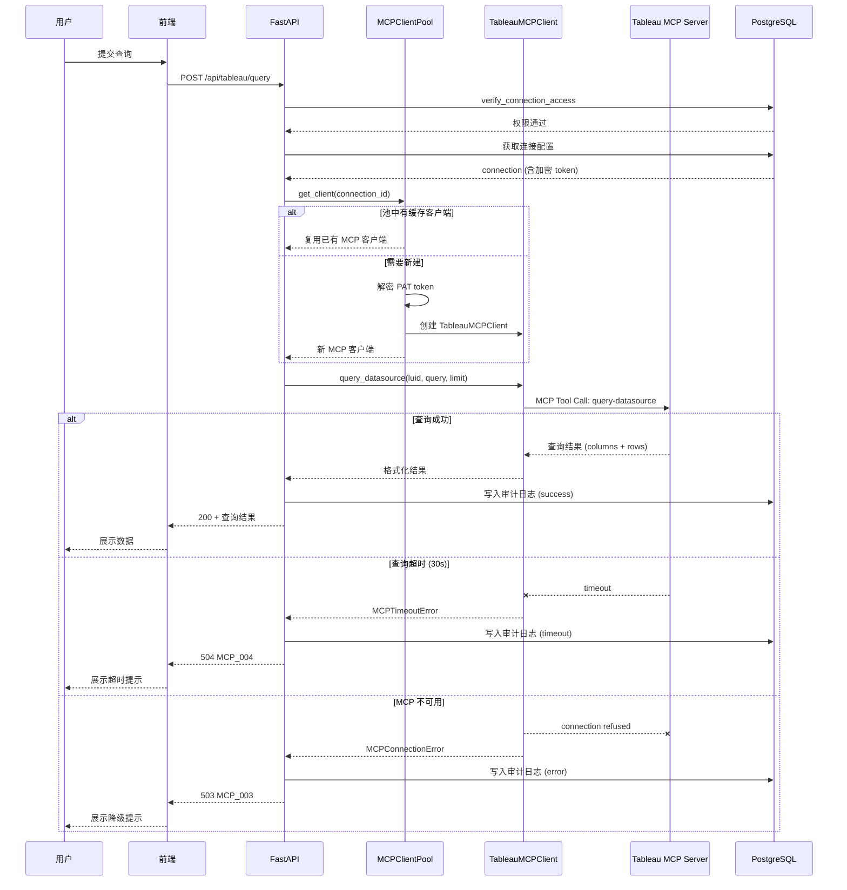
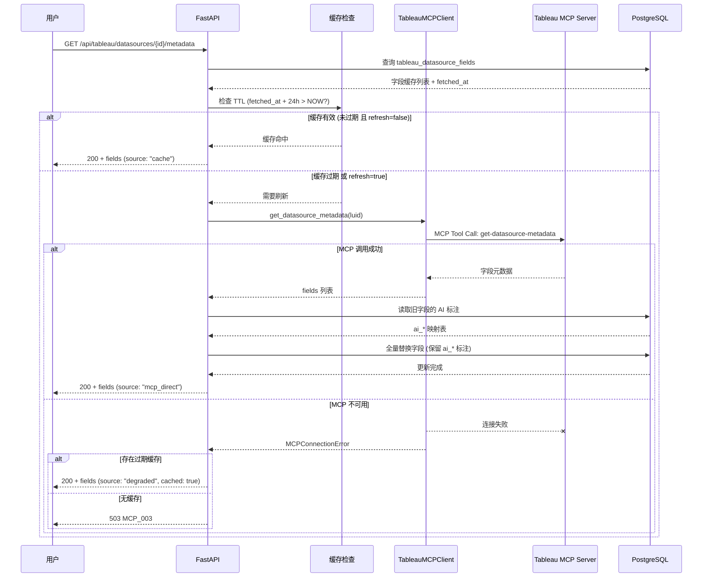
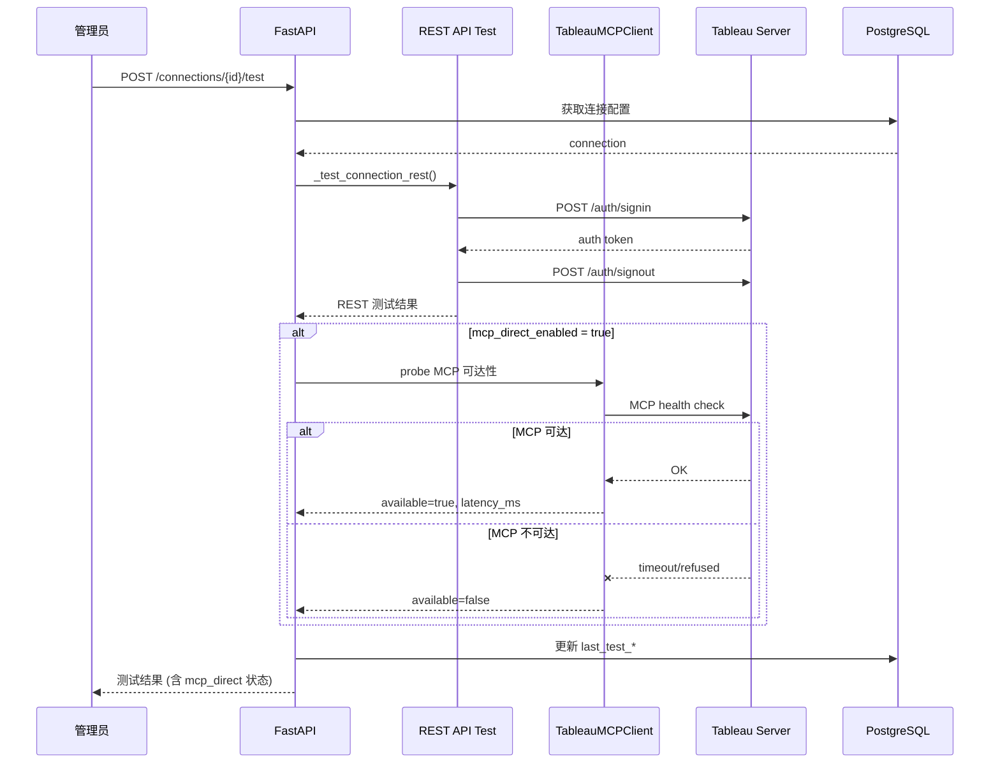

# Tableau MCP V2 Direct Connect 技术规格书

| 版本 | 日期 | 状态 | 作者 |
|------|------|------|------|
| v1.0 | 2026-04-04 | Draft | Mulan BI Team |

---

## 目录

1. [概述](#1-概述)
2. [MCP 连接管理](#2-mcp-连接管理)
3. [VizQL 查询协议](#3-vizql-查询协议)
4. [数据源元数据缓存](#4-数据源元数据缓存)
5. [API 设计](#5-api-设计)
6. [降级策略](#6-降级策略)
7. [错误码](#7-错误码)
8. [安全](#8-安全)
9. [与 V1 共存方案](#9-与-v1-共存方案)
10. [时序图](#10-时序图)
11. [测试策略](#11-测试策略)
12. [开放问题](#12-开放问题)

---

## 1. 概述

### 1.1 目的

V1（`07-tableau-mcp-v1-spec.md`）的 Tableau 集成仅通过 TSC / REST API 进行周期性资产同步，数据能力局限于本地缓存的元数据快照。V2 引入 **MCP Direct Connect 协议**，允许平台通过 Tableau MCP 工具（`query-datasource`、`get-datasource-metadata`、`get-view-image`、`get-view-data`、`search-content`）直接查询 Tableau 数据源，实现实时数据访问。

核心价值：
- **实时查询**：前端可对 Tableau 数据源发起即席聚合查询，无需等待同步落库
- **字段级元数据**：通过 `get-datasource-metadata` 自动获取字段定义并缓存
- **数据预览**：支持 View 级数据和图片导出
- **语义搜索**：利用 `search-content` 实现跨内容类型的 Tableau 资产发现

### 1.2 范围

- **包含**：MCP 工具封装层（TableauMCPClient）、VizQL 查询 JSON Schema、元数据缓存机制、3 个新 API 端点、降级策略、与 V1 的共存方案
- **不包含**：Pulse Metric 集成、Tableau Prep Flow 管理、前端 UI 实现、数据写回 Tableau

### 1.3 与 V1 区别

| 维度 | V1 (TSC/REST 同步) | V2 (MCP 直连) |
|------|-------------------|---------------|
| 数据获取方式 | 周期性全量同步到本地 | 实时通过 MCP 工具查询 |
| 数据新鲜度 | 取决于同步间隔（默认 24h） | 实时（查询时获取） |
| 字段元数据 | 依赖外部填入 | 自动通过 `get-datasource-metadata` 拉取 |
| 查询能力 | 无（仅浏览同步后的元数据） | 支持聚合、过滤、排序的 VizQL 查询 |
| 数据源依赖 | `tableauserverclient` 或原生 REST | Tableau MCP Server（工具调用协议） |
| 离线能力 | 完全离线可用 | 依赖 MCP 连接，降级至缓存元数据 |
| 部署要求 | 仅需网络可达 Tableau Server | 需运行 Tableau MCP Server 进程 |

### 1.4 关联文档

| 文档 | 路径 | 关系 |
|------|------|------|
| Tableau MCP V1 Spec | `docs/specs/07-tableau-mcp-v1-spec.md` | 基线，V2 向后兼容 |
| 健康评分 Spec | `docs/specs/10-tableau-health-scoring-spec.md` | 消费字段缓存 |
| LLM 层 Spec | `docs/specs/08-llm-layer-spec.md` | AI 解读依赖 |
| 错误码标准 | `docs/specs/01-error-codes-standard.md` | 错误码前缀规范 |
| API 约定 | `docs/specs/02-api-conventions.md` | 分页、响应格式 |

---

## 2. MCP 连接管理

### 2.1 TableauMCPClient 接口设计

`TableauMCPClient` 是 MCP 工具调用的统一封装层，位于 `backend/services/tableau/mcp_client.py`。

```python
class TableauMCPClient:
    """Tableau MCP 工具调用客户端"""

    def __init__(self, connection_id: int, server_url: str,
                 site: str, token_name: str, token_value: str):
        """
        Args:
            connection_id: 本地 tableau_connections.id，用于日志关联
            server_url: Tableau Server URL
            site: Site Content URL
            token_name: PAT Token 名称
            token_value: PAT Token 明文（调用前解密）
        """
        ...

    async def get_datasource_metadata(self, datasource_luid: str) -> Dict[str, Any]:
        """
        获取数据源字段元数据。
        对应 MCP 工具: get-datasource-metadata

        Args:
            datasource_luid: 数据源 LUID（Tableau 全局唯一标识）

        Returns:
            {
                "fields": [
                    {
                        "fieldName": "Sales",
                        "fieldCaption": "Total Sales",
                        "dataType": "REAL",
                        "role": "MEASURE",
                        "description": "...",
                        "dataCategory": "QUANTITATIVE",
                        "aggregation": "SUM",
                        "isCalculated": false,
                        "formula": null
                    }
                ],
                "parameters": [...]
            }

        Raises:
            MCPConnectionError: MCP 连接失败
            MCPTimeoutError: 请求超时（30s）
            MCPAuthError: PAT 认证失败
        """
        ...

    async def query_datasource(self, datasource_luid: str,
                                query: Dict[str, Any],
                                limit: int = 1000) -> Dict[str, Any]:
        """
        执行 VizQL 查询。
        对应 MCP 工具: query-datasource

        Args:
            datasource_luid: 数据源 LUID
            query: VizQL 查询 JSON（详见第 3 节 Schema）
            limit: 返回行数上限，默认 1000，最大 10000

        Returns:
            {
                "columns": ["Category", "Total Sales"],
                "rows": [
                    ["Technology", 836154.03],
                    ["Furniture", 741999.80]
                ],
                "totalRowCount": 2,
                "truncated": false
            }

        Raises:
            MCPConnectionError, MCPTimeoutError, MCPAuthError,
            MCPQueryError: 查询语法错误或字段不存在
        """
        ...

    async def get_view_image(self, view_id: str,
                              width: int = 800,
                              height: int = 800) -> bytes:
        """
        获取 View 截图。
        对应 MCP 工具: get-view-image

        Args:
            view_id: Tableau View ID
            width: 图片宽度（像素），默认 800
            height: 图片高度（像素），默认 800

        Returns:
            PNG 图片二进制数据

        Raises:
            MCPConnectionError, MCPTimeoutError, MCPAuthError
        """
        ...

    async def get_view_data(self, view_id: str) -> str:
        """
        获取 View 的 CSV 数据。
        对应 MCP 工具: get-view-data

        Args:
            view_id: Tableau View ID

        Returns:
            CSV 格式字符串

        Raises:
            MCPConnectionError, MCPTimeoutError, MCPAuthError
        """
        ...

    async def search_content(self, terms: str = None,
                              content_types: List[str] = None,
                              limit: int = 100) -> List[Dict[str, Any]]:
        """
        跨内容类型搜索 Tableau 资产。
        对应 MCP 工具: search-content

        Args:
            terms: 搜索关键词（可选）
            content_types: 过滤内容类型，如 ['workbook', 'datasource', 'view']
            limit: 返回结果上限，默认 100，最大 2000

        Returns:
            [
                {
                    "type": "workbook",
                    "id": "abc-123",
                    "name": "Sales Dashboard",
                    "owner": "John",
                    "projectName": "Finance",
                    "updatedAt": "2026-04-01T10:00:00Z"
                }
            ]

        Raises:
            MCPConnectionError, MCPTimeoutError, MCPAuthError
        """
        ...
```

### 2.2 连接池管理

MCP 客户端实例按 `connection_id` 缓存，避免重复认证开销。

```python
class MCPClientPool:
    """MCP 客户端连接池"""

    _pool: Dict[int, TableauMCPClient] = {}
    _lock: asyncio.Lock = asyncio.Lock()
    _max_idle_seconds: int = 300  # 空闲 5 分钟后回收

    @classmethod
    async def get_client(cls, connection_id: int) -> TableauMCPClient:
        """获取或创建 MCP 客户端实例"""
        ...

    @classmethod
    async def invalidate(cls, connection_id: int) -> None:
        """移除指定连接的客户端（连接配置变更时调用）"""
        ...

    @classmethod
    async def cleanup_idle(cls) -> None:
        """清理空闲超时的客户端（由定时任务触发）"""
        ...
```

**池管理规则**：
- 每个 `connection_id` 至多一个活跃客户端实例
- 空闲 300 秒后自动回收
- 连接配置更新时（`PUT /connections/{id}`）主动 invalidate
- 连接池最大容量：50 个客户端

### 2.3 认证方式

V2 继续使用 PAT (Personal Access Token) 认证，与 V1 共享 `tableau_connections` 表的凭证。

| 环节 | 说明 |
|------|------|
| 存储 | PAT 以 Fernet 加密存储在 `token_encrypted` 字段 |
| 解密时机 | 创建 `TableauMCPClient` 实例时解密 |
| 传递方式 | 通过 MCP 工具调用的认证参数传入 |
| Token 刷新 | PAT 无自动刷新机制，过期后需管理员重新配置 |
| 作用域 | PAT 权限决定可访问的数据源范围 |

---

## 3. VizQL 查询协议

### 3.1 查询 JSON Schema

查询 JSON 必须严格匹配 Tableau MCP `query-datasource` 工具的参数格式。以下为完整 Schema 定义。

```json
{
  "$schema": "http://json-schema.org/draft-07/schema#",
  "type": "object",
  "required": ["fields"],
  "properties": {
    "fields": {
      "type": "array",
      "minItems": 1,
      "items": {
        "oneOf": [
          { "$ref": "#/definitions/dimensionField" },
          { "$ref": "#/definitions/measureField" },
          { "$ref": "#/definitions/calculatedField" },
          { "$ref": "#/definitions/binField" }
        ]
      }
    },
    "filters": {
      "type": "array",
      "items": {
        "oneOf": [
          { "$ref": "#/definitions/setFilter" },
          { "$ref": "#/definitions/topFilter" },
          { "$ref": "#/definitions/matchFilter" },
          { "$ref": "#/definitions/quantitativeNumericalFilter" },
          { "$ref": "#/definitions/quantitativeDateFilter" },
          { "$ref": "#/definitions/dateFilter" }
        ]
      }
    },
    "parameters": {
      "type": "array",
      "items": {
        "type": "object",
        "required": ["parameterCaption", "value"],
        "properties": {
          "parameterCaption": { "type": "string" },
          "value": {}
        }
      }
    }
  }
}
```

### 3.2 字段类型

#### 3.2.1 Dimension 字段

不带聚合函数的维度字段，用于分组。

```json
{
  "fieldCaption": "Category",
  "fieldAlias": "Product Category",
  "sortDirection": "ASC",
  "sortPriority": 1
}
```

| 属性 | 类型 | 必填 | 说明 |
|------|------|------|------|
| fieldCaption | string | 是 | 字段标题（与 Tableau 数据源中的 caption 匹配） |
| fieldAlias | string | 否 | 返回结果中的列别名 |
| sortDirection | "ASC" / "DESC" | 否 | 排序方向 |
| sortPriority | integer (>0) | 否 | 排序优先级（多字段排序时生效） |
| maxDecimalPlaces | integer (>=0) | 否 | 小数位数限制 |

#### 3.2.2 Measure 字段

带聚合函数的度量字段。

```json
{
  "fieldCaption": "Sales",
  "function": "SUM",
  "fieldAlias": "Total Sales",
  "maxDecimalPlaces": 2,
  "sortDirection": "DESC",
  "sortPriority": 1
}
```

| 属性 | 类型 | 必填 | 说明 |
|------|------|------|------|
| fieldCaption | string | 是 | 字段标题 |
| function | enum | 是 | 聚合函数 |
| fieldAlias | string | 否 | 列别名 |
| maxDecimalPlaces | integer | 否 | 小数位数 |
| sortDirection | enum | 否 | 排序方向 |
| sortPriority | integer | 否 | 排序优先级 |

**支持的聚合函数**：

| 函数 | 说明 |
|------|------|
| SUM | 求和 |
| AVG | 平均值 |
| MEDIAN | 中位数 |
| COUNT | 计数 |
| COUNTD | 去重计数 |
| MIN | 最小值 |
| MAX | 最大值 |
| STDEV | 标准差 |
| VAR | 方差 |
| YEAR | 年份提取 |
| QUARTER | 季度提取 |
| MONTH | 月份提取 |
| WEEK | 周提取 |
| DAY | 日提取 |
| TRUNC_YEAR | 按年截断 |
| TRUNC_QUARTER | 按季截断 |
| TRUNC_MONTH | 按月截断 |
| TRUNC_WEEK | 按周截断 |
| TRUNC_DAY | 按日截断 |
| AGG | 已聚合字段 |
| NONE | 不聚合 |

#### 3.2.3 Calculated 字段

运行时自定义计算字段。

```json
{
  "fieldCaption": "Profit Ratio",
  "calculation": "SUM([Profit]) / SUM([Sales])",
  "fieldAlias": "Profit %",
  "maxDecimalPlaces": 4
}
```

| 属性 | 类型 | 必填 | 说明 |
|------|------|------|------|
| fieldCaption | string | 是 | 字段标题（需唯一） |
| calculation | string | 是 | Tableau 计算表达式 |
| fieldAlias | string | 否 | 列别名 |

#### 3.2.4 Bin 字段

将连续值分箱为离散区间。

```json
{
  "fieldCaption": "Sales",
  "binSize": 1000,
  "fieldAlias": "Sales Range"
}
```

| 属性 | 类型 | 必填 | 说明 |
|------|------|------|------|
| fieldCaption | string | 是 | 目标字段标题 |
| binSize | number (>0) | 是 | 分箱大小 |
| fieldAlias | string | 否 | 列别名 |

### 3.3 过滤器类型

#### 3.3.1 SET 过滤器

匹配指定值集合。

```json
{
  "field": { "fieldCaption": "Category" },
  "filterType": "SET",
  "values": ["Technology", "Furniture"],
  "exclude": false,
  "context": false
}
```

| 属性 | 类型 | 必填 | 说明 |
|------|------|------|------|
| field | object | 是 | 目标字段（`fieldCaption` 或 `calculation`） |
| filterType | "SET" | 是 | 固定值 |
| values | array | 是 | 匹配值列表（string/number/boolean） |
| exclude | boolean | 否 | true 表示排除匹配值，默认 false |
| context | boolean | 否 | true 表示上下文过滤器（优先级更高），默认 false |

#### 3.3.2 TOP 过滤器

取聚合度量值的 Top/Bottom N。

```json
{
  "field": { "fieldCaption": "Customer Name" },
  "filterType": "TOP",
  "howMany": 10,
  "fieldToMeasure": { "fieldCaption": "Sales", "function": "SUM" },
  "direction": "TOP"
}
```

| 属性 | 类型 | 必填 | 说明 |
|------|------|------|------|
| field | object | 是 | 筛选维度字段 |
| filterType | "TOP" | 是 | 固定值 |
| howMany | integer | 是 | 取前/后 N 项 |
| fieldToMeasure | object | 是 | 排序依据的度量字段（含聚合函数） |
| direction | "TOP" / "BOTTOM" | 否 | 默认 "TOP" |

#### 3.3.3 MATCH 过滤器

基于字符串模式匹配。

```json
{
  "field": { "fieldCaption": "Product Name" },
  "filterType": "MATCH",
  "startsWith": "Apple",
  "contains": null,
  "endsWith": null,
  "exclude": false
}
```

| 属性 | 类型 | 必填 | 说明 |
|------|------|------|------|
| field | object | 是 | 目标字段 |
| filterType | "MATCH" | 是 | 固定值 |
| startsWith | string | 条件必填 | 前缀匹配（三选一至少填一个） |
| contains | string | 条件必填 | 包含匹配 |
| endsWith | string | 条件必填 | 后缀匹配 |
| exclude | boolean | 否 | 排除匹配项，默认 false |

#### 3.3.4 QUANTITATIVE_NUMERICAL 过滤器

数值范围过滤。

```json
{
  "field": { "fieldCaption": "Sales", "function": "SUM" },
  "filterType": "QUANTITATIVE_NUMERICAL",
  "quantitativeFilterType": "RANGE",
  "min": 1000,
  "max": 50000,
  "includeNulls": false
}
```

| quantitativeFilterType | 必填参数 | 说明 |
|-----------------------|---------|------|
| RANGE | min, max | 数值区间 [min, max] |
| MIN | min | 大于等于 min |
| MAX | max | 小于等于 max |
| ONLY_NULL | 无 | 仅空值 |
| ONLY_NON_NULL | 无 | 仅非空值 |

#### 3.3.5 QUANTITATIVE_DATE 过滤器

日期范围过滤。

```json
{
  "field": { "fieldCaption": "Order Date" },
  "filterType": "QUANTITATIVE_DATE",
  "quantitativeFilterType": "RANGE",
  "minDate": "2025-01-01",
  "maxDate": "2025-12-31",
  "includeNulls": false
}
```

| quantitativeFilterType | 必填参数 | 说明 |
|-----------------------|---------|------|
| RANGE | minDate, maxDate | 日期区间 |
| MIN | minDate | 不早于 minDate |
| MAX | maxDate | 不晚于 maxDate |
| ONLY_NULL | 无 | 仅空值 |
| ONLY_NON_NULL | 无 | 仅非空值 |

#### 3.3.6 DATE 相对日期过滤器

基于锚定日期的相对时间过滤。

```json
{
  "field": { "fieldCaption": "Order Date" },
  "filterType": "DATE",
  "periodType": "MONTHS",
  "dateRangeType": "LASTN",
  "rangeN": 6,
  "anchorDate": "2026-04-04"
}
```

| dateRangeType | 额外参数 | 说明 |
|--------------|---------|------|
| CURRENT | 无 | 当前周期 |
| LAST | 无 | 上一个周期 |
| NEXT | 无 | 下一个周期 |
| TODATE | 无 | 当前周期至今 |
| LASTN | rangeN | 过去 N 个周期 |
| NEXTN | rangeN | 未来 N 个周期 |

**periodType 取值**：MINUTES, HOURS, DAYS, WEEKS, MONTHS, QUARTERS, YEARS

### 3.4 排序

排序通过字段定义中的 `sortDirection` 和 `sortPriority` 控制：

- `sortDirection`：`"ASC"` 升序 或 `"DESC"` 降序
- `sortPriority`：正整数，数值越小优先级越高（支持多字段复合排序）
- 未指定排序时，使用 Tableau 数据源的默认排序

### 3.5 分页与数据量限制

| 参数 | 默认值 | 最大值 | 说明 |
|------|--------|--------|------|
| limit | 1000 | 10000 | 单次查询返回的最大行数 |

- 不支持 offset 分页（VizQL 查询特性限制）
- 超过 limit 的结果集会被截断，响应中 `truncated: true`
- 建议使用 TOP 过滤器或更精确的 SET/DATE 过滤器控制数据量

### 3.6 查询示例

**示例 1：按类别统计销售额 Top 5**

```json
{
  "fields": [
    { "fieldCaption": "Category" },
    {
      "fieldCaption": "Sales",
      "function": "SUM",
      "fieldAlias": "Total Sales",
      "maxDecimalPlaces": 2,
      "sortDirection": "DESC",
      "sortPriority": 1
    }
  ],
  "filters": [
    {
      "field": { "fieldCaption": "Category" },
      "filterType": "TOP",
      "howMany": 5,
      "fieldToMeasure": { "fieldCaption": "Sales", "function": "SUM" },
      "direction": "TOP"
    }
  ]
}
```

**示例 2：最近 3 个月各地区月度销售趋势**

```json
{
  "fields": [
    {
      "fieldCaption": "Order Date",
      "function": "TRUNC_MONTH",
      "fieldAlias": "Month",
      "sortDirection": "ASC",
      "sortPriority": 1
    },
    { "fieldCaption": "Region" },
    {
      "fieldCaption": "Sales",
      "function": "SUM",
      "fieldAlias": "Monthly Sales",
      "maxDecimalPlaces": 2
    }
  ],
  "filters": [
    {
      "field": { "fieldCaption": "Order Date" },
      "filterType": "DATE",
      "periodType": "MONTHS",
      "dateRangeType": "LASTN",
      "rangeN": 3
    }
  ]
}
```

**示例 3：利润率计算字段**

```json
{
  "fields": [
    { "fieldCaption": "Sub-Category" },
    {
      "fieldCaption": "Sales",
      "function": "SUM",
      "fieldAlias": "Total Sales",
      "maxDecimalPlaces": 2
    },
    {
      "fieldCaption": "Profit Ratio",
      "calculation": "SUM([Profit]) / SUM([Sales])",
      "fieldAlias": "Profit %",
      "maxDecimalPlaces": 4
    }
  ]
}
```

---

## 4. 数据源元数据缓存

### 4.1 缓存存储

V2 复用 V1 中已有的 `tableau_datasource_fields` 表作为字段级元数据缓存。该表已在 `backend/services/tableau/models.py` 中定义（`TableauDatasourceField`）。

**关键字段映射**（MCP 工具返回 -> 缓存表）：

| MCP 返回字段 | 缓存表列 | 说明 |
|-------------|---------|------|
| fieldName | field_name | 字段原始名称 |
| fieldCaption | field_caption | 字段显示名（用于 VizQL 查询） |
| dataType | data_type | 数据类型（STRING, INTEGER, REAL, DATE, DATETIME, BOOLEAN） |
| role | role | 角色：DIMENSION / MEASURE -> dimension / measure |
| description | description | 字段描述 |
| aggregation | aggregation | 默认聚合方式 |
| isCalculated | is_calculated | 是否为计算字段 |
| formula | formula | 计算字段公式 |
| (完整 JSON) | metadata_json | 原始 MCP 返回的完整元数据 |

### 4.2 缓存 TTL 与刷新策略

| 策略 | 值 | 说明 |
|------|---|------|
| 默认 TTL | 24 小时 | 从 `fetched_at` 计算 |
| 主动刷新 | 用户请求 `GET /api/tableau/datasources/{id}/metadata?refresh=true` | 强制从 MCP 重新拉取 |
| 被动刷新 | 查询时发现缓存过期 | 后台异步刷新，本次查询使用过期缓存 |
| 增量判定 | 比对字段数量与名称列表 | 字段数量或名称变化时全量替换 |

**刷新流程**：

```
1. 检查 fetched_at + 24h > NOW ?
2. 如果未过期 -> 返回缓存数据
3. 如果已过期:
   a. 标记为"刷新中"（防重入）
   b. 调用 MCP get-datasource-metadata
   c. 比对字段列表:
      - 无变化 -> 仅更新 fetched_at
      - 有变化 -> 全量替换（保留 ai_* 标注字段）
   d. 清除"刷新中"标记
```

### 4.3 增量刷新保护

在全量替换字段缓存时，需保留人工或 AI 标注的语义信息：

```python
def refresh_fields(asset_id: int, datasource_luid: str,
                   new_fields: List[Dict]) -> int:
    """
    刷新字段缓存，保留已有 AI 标注。

    1. 获取旧字段列表，建立 field_name -> ai_* 的映射
    2. 清除旧记录
    3. 插入新记录
    4. 对 field_name 匹配的记录，回填 ai_caption / ai_description / ai_role / ai_confidence
    """
    ...
```

### 4.4 新增数据库索引

在现有 `ix_dsfield_asset_luid` 基础上，增加 TTL 查询优化索引：

| 索引名 | 列 | 说明 |
|--------|---|------|
| ix_dsfield_fetched_at | (asset_id, fetched_at) | 加速过期判定查询 |

---

## 5. API 设计

### 5.1 新增端点总览

| # | 方法 | 路径 | 权限 | 说明 |
|---|------|------|------|------|
| V2-1 | POST | /api/tableau/query | 登录用户 | MCP 直连查询 |
| V2-2 | GET | /api/tableau/datasources/{id}/metadata | 登录用户 | 获取数据源字段元数据 |
| V2-3 | GET | /api/tableau/datasources/{id}/preview | 登录用户 | 数据预览（前 N 行） |

### 5.2 端点详情

#### 5.2.1 MCP 直连查询

```
POST /api/tableau/query
```

**权限**：已登录用户，需有目标数据源所属连接的访问权。

**请求体**：

```json
{
  "connection_id": 1,
  "datasource_luid": "abc-123-def-456",
  "query": {
    "fields": [
      { "fieldCaption": "Category" },
      {
        "fieldCaption": "Sales",
        "function": "SUM",
        "fieldAlias": "Total Sales",
        "maxDecimalPlaces": 2
      }
    ],
    "filters": [
      {
        "field": { "fieldCaption": "Order Date" },
        "filterType": "DATE",
        "periodType": "YEARS",
        "dateRangeType": "CURRENT"
      }
    ]
  },
  "limit": 500
}
```

| 参数 | 类型 | 必填 | 说明 |
|------|------|------|------|
| connection_id | integer | 是 | Tableau 连接 ID |
| datasource_luid | string | 是 | 数据源 LUID |
| query | object | 是 | VizQL 查询 JSON（详见第 3 节） |
| limit | integer | 否 | 返回行数上限，默认 1000，最大 10000 |

**响应 200**：

```json
{
  "columns": [
    { "name": "Category", "dataType": "STRING" },
    { "name": "Total Sales", "dataType": "REAL" }
  ],
  "rows": [
    ["Technology", 836154.03],
    ["Furniture", 741999.80],
    ["Office Supplies", 719047.03]
  ],
  "totalRowCount": 3,
  "truncated": false,
  "queryTimeMs": 1250,
  "source": "mcp_direct"
}
```

| 响应字段 | 类型 | 说明 |
|---------|------|------|
| columns | array | 列定义（名称 + 数据类型） |
| rows | array | 数据行（二维数组） |
| totalRowCount | integer | 返回行数 |
| truncated | boolean | 是否因 limit 截断 |
| queryTimeMs | integer | 查询耗时（毫秒） |
| source | string | 数据来源标识："mcp_direct" |

**错误响应**：

| HTTP 状态码 | 错误码 | 说明 |
|------------|--------|------|
| 400 | MCP_001 | 查询 JSON 格式错误 |
| 400 | MCP_002 | 字段不存在于目标数据源 |
| 403 | TAB_002 | 无权访问该连接 |
| 404 | TAB_004 | 连接不存在 |
| 503 | MCP_003 | MCP 服务不可用 |
| 504 | MCP_004 | MCP 查询超时 |

#### 5.2.2 获取数据源字段元数据

```
GET /api/tableau/datasources/{id}/metadata
```

**权限**：已登录用户，需有数据源所属连接的访问权。

**路径参数**：

| 参数 | 说明 |
|------|------|
| id | 本地 tableau_assets.id（asset_type='datasource'） |

**请求参数**：

| 参数 | 类型 | 必填 | 默认 | 说明 |
|------|------|------|------|------|
| refresh | boolean | 否 | false | 强制从 MCP 重新拉取（忽略缓存） |

**响应 200**：

```json
{
  "datasource_luid": "abc-123-def-456",
  "datasource_name": "Superstore",
  "fields": [
    {
      "id": 101,
      "field_name": "Sales",
      "field_caption": "Sales",
      "data_type": "REAL",
      "role": "measure",
      "description": "Total sales amount",
      "aggregation": "SUM",
      "is_calculated": false,
      "formula": null,
      "ai_caption": "销售金额",
      "ai_description": "订单的实际成交金额",
      "ai_role": "measure"
    }
  ],
  "field_count": 25,
  "cached": true,
  "fetched_at": "2026-04-03 10:00:00",
  "cache_expires_at": "2026-04-04 10:00:00",
  "source": "cache"
}
```

| 响应字段 | 类型 | 说明 |
|---------|------|------|
| source | string | "cache" (本地缓存) 或 "mcp_direct" (实时拉取) |
| cached | boolean | 是否来自缓存 |
| cache_expires_at | string | 缓存过期时间（仅 cached=true 时有值） |

**错误**：
- 404：资产不存在或非 datasource 类型
- 503：MCP 不可用且无缓存数据

#### 5.2.3 数据预览

```
GET /api/tableau/datasources/{id}/preview
```

**权限**：已登录用户，需有数据源所属连接的访问权。

**路径参数**：

| 参数 | 说明 |
|------|------|
| id | 本地 tableau_assets.id（asset_type='datasource'） |

**请求参数**：

| 参数 | 类型 | 必填 | 默认 | 说明 |
|------|------|------|------|------|
| limit | integer | 否 | 100 | 预览行数，最大 500 |

**响应 200**：

```json
{
  "columns": [
    { "name": "Category", "dataType": "STRING" },
    { "name": "Sales", "dataType": "REAL" },
    { "name": "Order Date", "dataType": "DATE" }
  ],
  "rows": [
    ["Technology", 261.96, "2025-11-08"],
    ["Furniture", 731.94, "2025-11-08"]
  ],
  "totalRowCount": 100,
  "truncated": true,
  "source": "mcp_direct"
}
```

**说明**：预览查询自动选取缓存元数据中的前 10 个字段（按 role=dimension 优先、role=measure 次之排列），所有 measure 字段不做聚合（`function: "NONE"`），以展示原始行级数据。

---

## 6. 降级策略

### 6.1 降级场景

| 场景 | 触发条件 | 降级行为 |
|------|---------|---------|
| MCP 服务不可用 | 连接超时或认证失败 | 元数据接口返回缓存数据（`source: "cache"`）；查询接口返回 503 |
| MCP 查询超时 | 单次查询超过 30s | 返回 504 + 超时提示 |
| 数据源 LUID 无效 | MCP 返回字段不存在错误 | 返回 400 + 具体错误信息 |
| PAT 过期 | MCP 返回 401 | 返回 503 + 提示管理员更新 PAT |

### 6.2 超时策略

| 操作 | 超时时间 | 说明 |
|------|---------|------|
| get-datasource-metadata | 15s | 元数据拉取 |
| query-datasource | 30s | VizQL 查询 |
| get-view-image | 30s | 图片渲染 |
| get-view-data | 30s | CSV 导出 |
| search-content | 15s | 内容搜索 |

### 6.3 重试策略

| 参数 | 值 | 说明 |
|------|---|------|
| 最大重试次数 | 1 | 单次请求最多重试 1 次 |
| 重试间隔 | 2s | 固定间隔 |
| 可重试错误 | 连接超时、网络瞬断 | 不重试认证失败和查询语法错误 |
| 幂等性 | 所有 MCP 工具调用均为只读 | 重试安全 |

### 6.4 降级模式标识

所有 V2 API 响应中包含 `source` 字段，标识数据来源：

| source 值 | 含义 |
|-----------|------|
| mcp_direct | 实时通过 MCP 工具获取 |
| cache | 从本地缓存返回 |
| degraded | MCP 不可用，返回部分缓存数据 |

---

## 7. 错误码

MCP V2 使用 `MCP_` 前缀的错误码，与 V1 的 `TAB_` 前缀区分。

| 错误码 | HTTP 状态码 | 说明 | 处理建议 |
|--------|-----------|------|---------|
| MCP_001 | 400 | VizQL 查询 JSON 格式错误 | 检查 query 参数是否符合 Schema |
| MCP_002 | 400 | 查询引用了不存在的字段 | 先通过 metadata 接口确认可用字段 |
| MCP_003 | 503 | MCP 服务不可用 | 检查 MCP Server 进程是否运行 |
| MCP_004 | 504 | MCP 查询超时（30s） | 简化查询条件或减少数据量 |
| MCP_005 | 401 | MCP 认证失败（PAT 过期） | 管理员更新 PAT Token |
| MCP_006 | 400 | 数据源 LUID 无效 | 检查 datasource_luid 是否正确 |
| MCP_007 | 400 | 查询 limit 超出允许范围 | limit 必须在 1-10000 之间 |
| MCP_008 | 429 | MCP 请求频率超限 | 稍后重试 |
| MCP_009 | 500 | MCP 响应解析失败 | 联系管理员检查 MCP Server 版本兼容性 |
| MCP_010 | 400 | 目标资产不是 datasource 类型 | metadata/preview 接口仅支持 datasource |

---

## 8. 安全

### 8.1 PAT 加密存储

与 V1 共享加密机制，PAT 通过 Fernet 加密后存储在 `tableau_connections.token_encrypted`。

| 项目 | 说明 |
|------|------|
| 加密算法 | Fernet（AES-128-CBC + HMAC-SHA256） |
| 密钥来源 | 环境变量 `TABLEAU_ENCRYPTION_KEY` |
| 解密时机 | 仅在创建 `TableauMCPClient` 实例时解密 |
| 内存驻留 | 明文 token 随 MCPClientPool 中的客户端实例存在，空闲 5 分钟后回收 |

### 8.2 查询审计日志

所有 MCP 直连查询记录审计日志，存储至 `tableau_mcp_query_logs` 表（新增）。

```sql
CREATE TABLE tableau_mcp_query_logs (
    id              SERIAL PRIMARY KEY,
    connection_id   INTEGER NOT NULL REFERENCES tableau_connections(id) ON DELETE CASCADE,
    user_id         INTEGER NOT NULL,
    datasource_luid VARCHAR(256) NOT NULL,
    query_json      JSONB NOT NULL,           -- 完整查询 JSON
    row_count       INTEGER,                  -- 返回行数
    query_time_ms   INTEGER,                  -- 查询耗时
    status          VARCHAR(16) NOT NULL,     -- success / error / timeout
    error_code      VARCHAR(16),              -- MCP_xxx 错误码
    error_message   TEXT,
    created_at      TIMESTAMP NOT NULL DEFAULT NOW()
);

CREATE INDEX ix_mcp_querylog_conn_user ON tableau_mcp_query_logs(connection_id, user_id);
CREATE INDEX ix_mcp_querylog_created ON tableau_mcp_query_logs(created_at);
```

**日志字段说明**：

| 字段 | 说明 |
|------|------|
| query_json | 完整的请求 query 参数（用于审计和问题排查） |
| status | success / error / timeout |
| error_code | 仅失败时记录 MCP 错误码 |
| query_time_ms | 从发起 MCP 调用到收到响应的耗时 |

### 8.3 数据量限制

| 限制 | 默认值 | 最大值 | 配置方式 |
|------|--------|--------|---------|
| 单次查询行数 | 1000 | 10000 | 请求参数 `limit` |
| 预览行数 | 100 | 500 | 请求参数 `limit` |
| 单次查询结果大小 | 10 MB | - | 超出时截断并标记 truncated |
| 每用户每分钟查询次数 | 30 | - | 429 状态码 |

### 8.4 角色权限矩阵

| 操作 | admin | data_admin | analyst | user |
|------|-------|-----------|---------|------|
| MCP 直连查询 | Y | Y | Y | Y |
| 查看数据源元数据 | Y | Y | Y | Y |
| 数据预览 | Y | Y | Y | Y |
| 查看查询审计日志 | Y | Y | N | N |

**说明**：所有查询操作都需要用户对目标连接有访问权（通过 `verify_connection_access` 校验）。

---

## 9. 与 V1 共存方案

### 9.1 双模式切换

V1 和 V2 通过 `tableau_connections` 表的 `connection_type` 字段共存：

| connection_type | V1 同步 | V2 直连查询 | 说明 |
|----------------|---------|------------|------|
| tsc | TSC 库同步 | 不可用 | 传统模式，仅支持同步 |
| mcp | REST API 同步 | 可用 | 推荐模式，同步 + 直连 |

**新增字段**（`tableau_connections` 表）：

| 字段 | 类型 | 默认值 | 说明 |
|------|------|--------|------|
| mcp_direct_enabled | Boolean | false | 是否启用 MCP 直连查询功能 |
| mcp_server_url | String(512) | null | MCP Server 地址（如与 Tableau Server 不同） |

### 9.2 功能对照矩阵

| 功能 | V1 (tsc) | V1 (mcp) | V2 (mcp + direct) |
|------|---------|---------|-------------------|
| 连接管理 | Y | Y | Y |
| 连接测试 | Y (TSC) | Y (REST) | Y (REST + MCP probe) |
| 资产同步 | Y (TSC Pager) | Y (REST Pager) | Y (REST Pager) |
| 资产浏览 | Y | Y | Y |
| 资产搜索（本地） | Y (ILIKE) | Y (ILIKE) | Y (ILIKE) |
| 资产搜索（Tableau） | N | N | Y (search-content) |
| 数据源元数据 | 手动填入 | 手动填入 | 自动拉取 + 缓存 |
| 即席查询 | N | N | Y (query-datasource) |
| 数据预览 | N | N | Y |
| View 截图 | N | N | Y (get-view-image) |
| View CSV 导出 | N | N | Y (get-view-data) |
| 健康评分 | Y | Y | Y（元数据更完整，评分更准确） |
| AI 解读 | Y | Y | Y（元数据更完整，解读更精确） |
| 离线浏览 | Y | Y | Y（缓存数据） |
| 离线查询 | N/A | N/A | N（依赖 MCP） |

### 9.3 升级路径

1. 现有 `mcp` 类型连接默认 `mcp_direct_enabled = false`
2. 管理员在连接设置中启用 MCP Direct Connect
3. 系统自动执行一次元数据拉取，填充 `tableau_datasource_fields`
4. V2 API 端点仅对 `mcp_direct_enabled = true` 的连接生效
5. V1 的所有功能不受影响，保持完全向后兼容

### 9.4 连接测试增强

当 `mcp_direct_enabled = true` 时，`POST /connections/{id}/test` 增加 MCP 可达性检测：

```json
{
  "success": true,
  "message": "REST API 连接成功 (site_id=xxx)",
  "mcp_direct": {
    "available": true,
    "latency_ms": 120,
    "message": "MCP Direct Connect 可用"
  }
}
```

---

## 10. 时序图

### 10.1 MCP 直连查询流程



### 10.2 元数据缓存刷新流程



### 10.3 连接测试增强流程



---

## 11. 测试策略

### 11.1 单元测试

| 测试对象 | 测试内容 | Mock 范围 |
|---------|---------|----------|
| VizQL Query Schema 校验 | 各字段类型的合法/非法 JSON | 无需 mock |
| SET/TOP/MATCH/DATE 过滤器解析 | 每种过滤器类型的序列化和反序列化 | 无需 mock |
| MCPClientPool | 缓存命中、空闲回收、invalidate | mock TableauMCPClient |
| 元数据缓存 TTL | 过期判定、刷新触发、AI 标注保留 | mock MCP 调用 |
| 查询审计日志 | success/error/timeout 三种状态的日志写入 | mock MCP 调用 |
| limit 边界 | 0/1/1000/10000/10001 各值的校验 | 无需 mock |

### 11.2 集成测试

| # | 场景 | 前置条件 | 验证点 | 优先级 |
|---|------|---------|--------|--------|
| 1 | 端到端 MCP 查询 | 运行中的 MCP Server + 有效 PAT | 查询返回正确数据 | P0 |
| 2 | 元数据自动拉取 | datasource LUID 有效 | `tableau_datasource_fields` 正确填充 | P0 |
| 3 | 缓存过期刷新 | 已有过期缓存 | 刷新后 AI 标注保留 | P1 |
| 4 | MCP 不可用降级 | 停止 MCP Server | metadata 返回缓存; query 返回 503 | P0 |
| 5 | PAT 过期场景 | 使用已过期 PAT | 返回 MCP_005 错误码 | P1 |
| 6 | 并发查询 | 10 并发请求同一数据源 | MCPClientPool 正确复用 | P1 |
| 7 | 大结果集截断 | 查询返回 >limit 行 | truncated=true, 行数=limit | P1 |
| 8 | V1/V2 共存 | 同一连接同时使用同步和直连 | 两者互不干扰 | P0 |

### 11.3 性能基线

| 指标 | 目标 | 说明 |
|------|------|------|
| 简单聚合查询（1 dim + 1 measure） | < 2s (P95) | 含网络延迟 |
| 复杂查询（3 dim + 5 measure + 3 filter） | < 5s (P95) | 含网络延迟 |
| 元数据拉取 | < 3s (P95) | 字段数 < 200 |
| 缓存命中的元数据查询 | < 100ms (P95) | 纯 DB 读取 |
| MCPClientPool 命中 | < 5ms | 无 IO 操作 |

### 11.4 验收标准

- [ ] `POST /api/tableau/query` 能正确执行 VizQL 查询并返回结构化结果
- [ ] `GET /api/tableau/datasources/{id}/metadata` 自动拉取并缓存 MCP 元数据
- [ ] 缓存刷新时保留已有 AI 语义标注
- [ ] MCP 不可用时，metadata 接口降级返回缓存数据
- [ ] 所有 MCP 查询记录审计日志
- [ ] V1 同步功能在 V2 启用后保持正常
- [ ] limit 超限、字段不存在等错误返回正确的 MCP 错误码

---

## 12. 开放问题

| # | 问题 | 影响 | 优先级 | 状态 |
|---|------|------|--------|------|
| 1 | MCP Server 的部署架构：是作为 sidecar 还是独立服务？延迟特性如何？ | 架构 | P0 | 待定 |
| 2 | MCP 工具调用的认证方式——当前假设透传 PAT，实际 MCP Server 可能有自己的认证层 | 安全 | P0 | 待调研 |
| 3 | `query-datasource` 对计算字段（calculation）中可用的函数范围是否有限制 | 功能 | P1 | 待验证 |
| 4 | 是否需要支持跨数据源 Join 查询（当前设计为单数据源查询） | 功能 | P2 | 暂不支持 |
| 5 | MCPClientPool 的空闲回收策略是否需要结合 PAT 的剩余有效期 | 可靠性 | P2 | 待定 |
| 6 | 审计日志表 `tableau_mcp_query_logs` 的保留策略（自动清理周期） | 运维 | P2 | 建议 90 天滚动 |
| 7 | `get-view-image` 返回的 PNG 图片是否需要缓存（避免重复渲染） | 性能 | P3 | 待评估 |
| 8 | 前端是否需要构建 VizQL Query Builder UI，还是仅支持 JSON 模式 | 前端 | P1 | 待讨论 |
| 9 | Pulse Metric 集成是否纳入 V2 范围（当前排除） | 范围 | P2 | V3 规划 |
| 10 | 数据预览的字段自动选取策略是否需要可配置 | 功能 | P3 | 待定 |

---

*文档结束*
