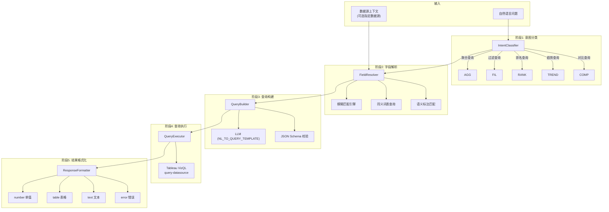
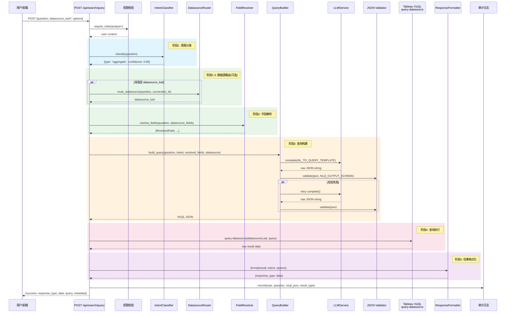
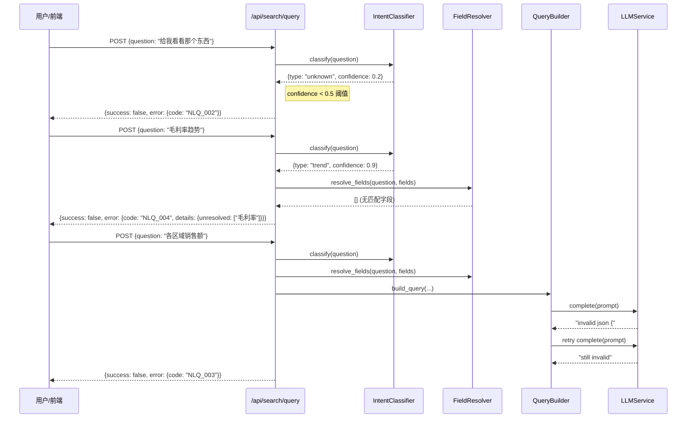

# NL-to-Query 流水线技术规格书

| 属性 | 值 |
|------|-----|
| 版本 | v1.0 |
| 日期 | 2026-04-04 |
| 状态 | 草稿 |
| 作者 | Mulan BI Platform Team |
| 模块路径 | `backend/services/llm/`, `backend/app/api/search.py`(规划) |
| API 前缀 | `/api/search` |

---

## 目录

1. [概述](#1-概述)
2. [流水线架构](#2-流水线架构)
3. [意图分类](#3-意图分类)
4. [字段解析](#4-字段解析)
5. [查询构建](#5-查询构建)
6. [API 设计](#6-api-设计)
7. [多数据源路由](#7-多数据源路由)
8. [响应类型](#8-响应类型)
9. [错误码](#9-错误码)
10. [安全](#10-安全)
11. [时序图](#11-时序图)
12. [测试策略](#12-测试策略)
13. [开放问题](#13-开放问题)

---

## 1. 概述

### 1.1 目的

NL-to-Query 流水线将用户的自然语言问题（如"上个月各区域销售额是多少"）转换为结构化的 Tableau VizQL 查询 JSON，并通过 Tableau VizQL Data Service 的 `query-datasource` 接口执行查询，返回格式化的数据结果。

该流水线是 Mulan BI Platform 的核心交互入口，使业务用户无需了解数据模型即可通过自然语言获取数据洞察。

### 1.2 范围

- **包含**：自然语言解析、意图分类、字段映射、VizQL JSON 构建、查询执行、结果格式化、多数据源路由
- **不包含**：可视化图表渲染（由前端负责）、数据源元数据同步（由 Tableau MCP 模块负责）、LLM 基础设施管理（由 08-llm-layer-spec 覆盖）

### 1.3 关联文档

| 文档 | 路径 | 关系 |
|------|------|------|
| 架构规范 | `docs/ARCHITECTURE.md` 6.3 | NL-to-Query 输出契约定义 |
| LLM 能力层规格书 | `docs/specs/08-llm-layer-spec.md` | LLM 调用基础设施 |
| Tableau MCP 规格书 | `docs/specs/07-tableau-mcp-v1-spec.md` | 数据源元数据来源 |
| 语义维护规格书 | `docs/specs/09-semantic-maintenance-spec.md` | 语义标注/术语映射 |
| 数据模型总览 | `docs/specs/03-data-model-overview.md` | 表结构定义 |
| 错误码标准 | `docs/specs/01-error-codes-standard.md` | 错误码命名规范 |

---

## 2. 流水线架构

NL-to-Query 流水线分为 5 个阶段，各阶段串行执行，前序失败时提前终止并返回错误响应。

### 2.1 五阶段流水线


### 2.2 阶段职责总览

| 阶段 | 名称 | 输入 | 输出 | 执行者 |
|------|------|------|------|--------|
| 1 | 意图分类 | 用户自然语言 | 查询意图类型 + 置信度 | LLM / 规则引擎 |
| 2 | 字段解析 | 用户问题 + 数据源字段列表 | 匹配的 fieldCaption 列表 | 模糊匹配 + 同义词表 |
| 3 | 查询构建 | 意图 + 字段列表 + 用户问题 | VizQL JSON（匹配 `query-datasource` 格式） | LLM（`NL_TO_QUERY_TEMPLATE`） |
| 4 | 查询执行 | VizQL JSON + datasourceLuid | 原始查询结果 | Tableau VizQL Data Service |
| 5 | 结果格式化 | 原始数据 + 意图类型 | 结构化响应（number/table/text/error） | 格式化引擎 |

### 2.3 数据流详细



---

## 3. 意图分类

### 3.1 查询意图类型

| 意图类型 | 标识符 | 描述 | 典型问句 |
|---------|--------|------|---------|
| 聚合查询 | `aggregate` | 对度量字段进行聚合计算 | "总销售额是多少" |
| 过滤查询 | `filter` | 按条件过滤后查看数据 | "华东区的订单有哪些" |
| 排名查询 | `ranking` | 排序并取前/后 N 条 | "销售额前10的产品" |
| 趋势查询 | `trend` | 按时间维度分析变化趋势 | "过去6个月销售额趋势" |
| 对比查询 | `comparison` | 多维度/多指标对比 | "各区域本月vs上月销售额" |

### 3.2 分类逻辑

意图分类采用**规则优先 + LLM 兜底**的混合策略：

```python
# 伪代码
def classify_intent(question: str) -> IntentResult:
    # 1. 关键词规则匹配（快速路径）
    if matches_ranking_keywords(question):    # "前N"、"Top"、"排名"、"最高/低"
        return IntentResult(type="ranking", confidence=0.95, source="rule")
    if matches_trend_keywords(question):      # "趋势"、"走势"、"变化"、"同比/环比"
        return IntentResult(type="trend", confidence=0.90, source="rule")
    if matches_comparison_keywords(question):  # "对比"、"vs"、"比较"、"各...的"
        return IntentResult(type="comparison", confidence=0.85, source="rule")

    # 2. LLM 分类（复杂/模糊场景）
    return llm_classify(question)
```

### 3.3 意图关键词映射表

| 意图 | 中文关键词 | 英文关键词 |
|------|----------|-----------|
| `ranking` | 前N、排名、最高、最低、最多、最少、排行 | top, bottom, rank, highest, lowest |
| `trend` | 趋势、走势、变化、同比、环比、月度、季度 | trend, over time, monthly, quarterly |
| `comparison` | 对比、vs、比较、各...的、分别 | compare, versus, each, by |
| `filter` | ...的、哪些、筛选、包含、不包含 | where, which, filter, include |
| `aggregate` | 总、合计、总共、一共、平均、数量 | total, sum, average, count, how many |

---

## 4. 字段解析

### 4.1 字段来源

字段解析的基础数据来自 `tableau_datasource_fields` 表（由 Tableau 同步流水线维护）。

#### 表结构引用

| 列名 | 说明 | 解析用途 |
|------|------|---------|
| `field_name` | Tableau 内部字段名 | 精确匹配 |
| `field_caption` | 字段显示名（中/英文） | 模糊匹配主要目标 |
| `data_type` | 数据类型（string/integer/real/date/datetime/boolean） | 类型推断 |
| `role` | 维度/度量（dimension/measure） | 聚合函数判断 |
| `description` | 字段描述 | 语义匹配辅助 |
| `formula` | 计算字段公式 | 计算字段识别 |

### 4.2 自然语言字段名 -> fieldCaption 映射

映射流程按优先级执行，匹配成功即返回：

```
1. 精确匹配  →  用户词 == field_caption（不区分大小写）
2. 同义词匹配 →  用户词 ∈ synonym_table[field_caption]
3. 语义标注匹配 → 用户词 ∈ tableau_field_semantics.semantic_name_zh
4. 模糊匹配  →  编辑距离(用户词, field_caption) <= 阈值
5. LLM 兜底  →  将字段列表交给 LLM，由 LLM 完成映射
```

### 4.3 模糊匹配策略

| 策略 | 算法 | 阈值 | 适用场景 |
|------|------|------|---------|
| 编辑距离 | Levenshtein | 距离 <= 2 且长度比 >= 0.6 | 拼写接近（"销售额" vs "销售金额"） |
| 包含匹配 | substring | 子串长度 >= 2 | "销售" 匹配 "销售额" |
| 拼音匹配 | pypinyin | 拼音完全相同 | "xiaoshoue" 匹配 "销售额" |

### 4.4 同义词表

同义词表存储在 `nlq_synonym_mappings` 表中（规划），初始版本硬编码在配置中：

```python
DEFAULT_SYNONYMS = {
    # 常见财务指标
    "销售额": ["sales", "营业额", "销售金额", "收入", "营收"],
    "利润": ["profit", "净利润", "毛利", "利润额"],
    "成本": ["cost", "费用", "支出"],
    "订单数": ["order count", "订单量", "订单总数"],
    "折扣": ["discount", "折扣率", "优惠"],

    # 常见维度
    "区域": ["region", "地区", "大区"],
    "产品": ["product", "商品", "产品名称", "货品"],
    "类别": ["category", "分类", "品类", "产品类别"],
    "客户": ["customer", "顾客", "客户名称"],
    "日期": ["date", "时间", "订单日期", "下单时间"],

    # 时间表达
    "上个月": ["last month", "上月"],
    "本月": ["this month", "当月"],
    "今年": ["this year", "本年度"],
    "去年": ["last year", "上年"],
}
```

### 4.5 字段解析输出

```python
@dataclass
class ResolvedField:
    field_caption: str        # 匹配到的 Tableau 字段显示名
    field_name: str           # Tableau 内部字段名
    role: str                 # "dimension" | "measure"
    data_type: str            # 数据类型
    match_source: str         # "exact" | "synonym" | "semantic" | "fuzzy" | "llm"
    match_confidence: float   # 0.0 ~ 1.0
    user_term: str            # 用户原始表达
```

---

## 5. 查询构建

### 5.1 VizQL JSON 生成

查询构建阶段由 LLM 驱动，使用 `NL_TO_QUERY_TEMPLATE` 将用户问题、解析后的字段信息和数据源上下文组合为 Prompt，生成符合 Tableau VizQL Data Service `query-datasource` 工具参数格式的 JSON。

#### Prompt 上下文组装

```
┌──────────────────────────────────────────┐
│ System: "你是一个 Tableau 数据查询专家"      │
├──────────────────────────────────────────┤
│ 数据源信息:                                │
│   · datasource_luid                       │
│   · datasource_name                       │
├──────────────────────────────────────────┤
│ 可用字段 (fields_with_types):              │
│   · field_caption + data_type + role      │
│   · 经阶段2解析后的候选字段优先排列          │
├──────────────────────────────────────────┤
│ 业务术语映射 (term_mappings):               │
│   · 同义词表 + 语义标注                     │
├──────────────────────────────────────────┤
│ 用户问题 (question)                        │
├──────────────────────────────────────────┤
│ 输出格式约束 + 规则                         │
└──────────────────────────────────────────┘
```

### 5.2 输出格式（NL-to-Query 输出契约）

输出直接匹配 Tableau VizQL Data Service `query-datasource` 工具的参数格式：

```json
{
  "fields": [
    {"fieldCaption": "Sales", "function": "SUM", "fieldAlias": "总销售额"},
    {"fieldCaption": "Region"}
  ],
  "filters": [
    {
      "field": {"fieldCaption": "Order Date"},
      "filterType": "DATE",
      "periodType": "MONTHS",
      "dateRangeType": "LAST"
    }
  ]
}
```

### 5.3 操作符映射表

LLM 生成的抽象操作符需映射为 VizQL 过滤器类型：

#### 过滤器类型映射

| 用户意图表达 | VizQL filterType | 附加参数 | 示例 |
|------------|-----------------|---------|------|
| "等于X" / "是X" | `SET` | `values: [X]` | 区域是华东 |
| "包含X和Y" | `SET` | `values: [X, Y]` | 类别包含家具和办公用品 |
| "不包含X" | `SET` | `values: [X], exclude: true` | 不包含退货订单 |
| "大于X" | `QUANTITATIVE_NUMERICAL` | `quantitativeFilterType: "MIN", min: X` | 销售额大于1000 |
| "小于X" | `QUANTITATIVE_NUMERICAL` | `quantitativeFilterType: "MAX", max: X` | 折扣小于0.5 |
| "在X到Y之间" | `QUANTITATIVE_NUMERICAL` | `quantitativeFilterType: "RANGE", min: X, max: Y` | 利润在100到500之间 |
| "上个月" | `DATE` | `periodType: "MONTHS", dateRangeType: "LAST"` | 上个月的销售额 |
| "本月" | `DATE` | `periodType: "MONTHS", dateRangeType: "CURRENT"` | 本月订单 |
| "最近N天" | `DATE` | `periodType: "DAYS", dateRangeType: "LASTN", rangeN: N` | 最近7天 |
| "今年至今" | `DATE` | `periodType: "YEARS", dateRangeType: "TODATE"` | 今年累计销售额 |
| "前N名" | `TOP` | `direction: "TOP", howMany: N` | 销售额前10的产品 |
| "后N名" | `TOP` | `direction: "BOTTOM", howMany: N` | 利润最低的5个区域 |
| "包含关键词" | `MATCH` | `contains: "keyword"` | 产品名包含"桌" |

#### 聚合函数映射

| 用户表达 | VizQL function |
|---------|----------------|
| 总/合计/总共 | `SUM` |
| 平均/均值/平均值 | `AVG` |
| 数量/个数/多少个 | `COUNT` |
| 去重数量/有多少种 | `COUNTD` |
| 最大/最高 | `MAX` |
| 最小/最低 | `MIN` |
| 中位数 | `MEDIAN` |

#### 时间粒度映射

| 用户表达 | VizQL function |
|---------|----------------|
| 按年/年度 | `YEAR` |
| 按季度 | `QUARTER` |
| 按月/月度 | `MONTH` |
| 按周 | `WEEK` |
| 按天/每日 | `DAY` |

### 5.4 JSON Schema 校验

LLM 输出的 JSON 必须通过以下校验：

```python
NLQ_OUTPUT_SCHEMA = {
    "type": "object",
    "required": ["fields"],
    "properties": {
        "fields": {
            "type": "array",
            "minItems": 1,
            "items": {
                "type": "object",
                "required": ["fieldCaption"],
                "properties": {
                    "fieldCaption": {"type": "string"},
                    "function": {
                        "type": "string",
                        "enum": ["SUM", "AVG", "MEDIAN", "COUNT", "COUNTD",
                                 "MIN", "MAX", "STDEV", "VAR",
                                 "YEAR", "QUARTER", "MONTH", "WEEK", "DAY",
                                 "TRUNC_YEAR", "TRUNC_QUARTER", "TRUNC_MONTH",
                                 "TRUNC_WEEK", "TRUNC_DAY"]
                    },
                    "fieldAlias": {"type": "string"},
                    "sortDirection": {"type": "string", "enum": ["ASC", "DESC"]},
                    "sortPriority": {"type": "integer", "minimum": 1},
                    "maxDecimalPlaces": {"type": "integer", "minimum": 0}
                }
            }
        },
        "filters": {
            "type": "array",
            "items": {"type": "object"}
        }
    }
}
```

校验失败处理：
1. 首次校验失败：重试 1 次（重新调用 LLM）
2. 重试仍失败：返回 `NLQ_003` 错误

---

## 6. API 设计

### 6.1 端点总览

| 方法 | 路径 | 权限 | 说明 |
|------|------|------|------|
| `POST` | `/api/search/query` | analyst+ | 自然语言查询 |
| `GET` | `/api/search/suggestions` | analyst+ | 查询建议（自动补全） |
| `GET` | `/api/search/history` | analyst+ | 查询历史 |

### 6.2 POST /api/search/query

将用户自然语言问题转换为数据查询并返回结果。

#### 请求体

```json
{
  "question": "上个月各区域的销售额是多少",
  "datasource_luid": "optional-datasource-luid",
  "connection_id": 1,
  "options": {
    "limit": 100,
    "timeout": 30,
    "response_type": "auto"
  }
}
```

| 字段 | 类型 | 必填 | 默认值 | 说明 |
|------|------|------|--------|------|
| `question` | `string` | 是 | - | 自然语言问题，长度 1~500 字符 |
| `datasource_luid` | `string` | 否 | - | 指定数据源 LUID，不指定则自动路由 |
| `connection_id` | `integer` | 否 | - | 指定 Tableau 连接 ID（限定数据源范围） |
| `options.limit` | `integer` | 否 | `100` | 返回结果最大行数（1~1000） |
| `options.timeout` | `integer` | 否 | `30` | 查询超时秒数（5~60） |
| `options.response_type` | `string` | 否 | `"auto"` | 期望响应类型：`auto` / `number` / `table` / `text` |

#### 响应 200（成功 - number 类型）

```json
{
  "success": true,
  "response_type": "number",
  "data": {
    "value": 1523456.78,
    "label": "总销售额",
    "unit": "",
    "formatted": "1,523,456.78"
  },
  "query": {
    "datasource_luid": "abc-123",
    "datasource_name": "Superstore",
    "vizql_json": {
      "fields": [
        {"fieldCaption": "Sales", "function": "SUM", "fieldAlias": "总销售额"}
      ],
      "filters": []
    }
  },
  "metadata": {
    "intent": "aggregate",
    "intent_confidence": 0.95,
    "field_mappings": [
      {"user_term": "销售额", "field_caption": "Sales", "match_source": "synonym"}
    ],
    "execution_time_ms": 1250,
    "cached": false
  }
}
```

#### 响应 200（成功 - table 类型）

```json
{
  "success": true,
  "response_type": "table",
  "data": {
    "columns": [
      {"name": "Region", "label": "区域", "type": "string"},
      {"name": "SUM(Sales)", "label": "总销售额", "type": "number"}
    ],
    "rows": [
      {"Region": "华东", "SUM(Sales)": 523456.78},
      {"Region": "华北", "SUM(Sales)": 412345.67}
    ],
    "total_rows": 4,
    "truncated": false
  },
  "query": { "..." : "..." },
  "metadata": { "..." : "..." }
}
```

#### 响应 200（失败）

```json
{
  "success": false,
  "response_type": "error",
  "error": {
    "code": "NLQ_004",
    "message": "未找到与问题匹配的字段",
    "details": {
      "unresolved_terms": ["毛利率"],
      "available_measures": ["Sales", "Profit", "Discount"]
    }
  }
}
```

---

## 7. 多数据源路由

当用户未指定 `datasource_luid` 时，系统自动选择最合适的数据源。

### 7.1 路由算法

```python
def route_datasource(question: str, connection_id: int = None) -> DatasourceCandidate:
    """
    数据源路由算法
    输入: 用户问题 + 可选连接限定
    输出: 最优数据源候选
    """
    # 1. 获取候选数据源池
    candidates = get_candidate_datasources(connection_id)

    # 2. 提取用户问题中的字段候选词
    user_terms = extract_terms(question)

    # 3. 对每个数据源评分
    scored = []
    for ds in candidates:
        fields = get_datasource_fields(ds.datasource_luid)
        score = calculate_routing_score(user_terms, fields, ds)
        scored.append((ds, score))

    # 4. 按得分排序，返回最高分
    scored.sort(key=lambda x: x[1], reverse=True)
    if scored[0][1] < MIN_ROUTING_SCORE:
        raise NLQError("NLQ_005", "无法匹配到合适的数据源")
    return scored[0][0]
```

### 7.2 评分维度

| 维度 | 权重 | 说明 |
|------|------|------|
| 字段完备度 | 0.50 | 用户问题中提及的字段在该数据源中的覆盖率 |
| 同步新鲜度 | 0.25 | 数据源最近一次同步时间距现在的间隔（越新越好） |
| 字段总数 | 0.10 | 字段数量适中优先（避免超大宽表干扰匹配） |
| 使用频次 | 0.15 | 该数据源被查询的历史频次（冷启动阶段权重降低） |

### 7.3 评分公式

```
routing_score = 0.50 * field_coverage_ratio
             + 0.25 * freshness_score(last_sync_at)
             + 0.10 * field_count_score(field_count)
             + 0.15 * usage_frequency_score(query_count)
```

其中：
- `field_coverage_ratio` = 匹配字段数 / 用户提及字段数（0.0~1.0）
- `freshness_score` = max(0, 1 - hours_since_sync / 24)，24 小时内线性衰减
- `field_count_score` = 1.0 if 10 <= count <= 100 else 0.8（惩罚过大/过小数据源）
- `usage_frequency_score` = min(1.0, query_count / 100)，按百次查询归一化

### 7.4 最低得分阈值

`MIN_ROUTING_SCORE = 0.3`。低于该阈值时返回 `NLQ_005` 错误，提示用户指定数据源。

---

## 8. 响应类型

### 8.1 四种响应类型

| 类型 | 标识符 | 触发条件 | 典型场景 |
|------|--------|---------|---------|
| 单值 | `number` | 查询结果为单行单列 | "总销售额是多少" |
| 表格 | `table` | 查询结果为多行或多列 | "各区域销售额" |
| 文本 | `text` | 需要自然语言解释的复杂结果 | "销售额变化原因分析" |
| 错误 | `error` | 流水线任意阶段失败 | 字段匹配失败、查询超时 |

### 8.2 自动类型推断规则

当 `response_type = "auto"` 时，按以下规则推断：

```python
def infer_response_type(intent: str, result_shape: tuple) -> str:
    rows, cols = result_shape

    # 单值场景
    if rows == 1 and cols == 1:
        return "number"

    # 空结果
    if rows == 0:
        return "text"  # 返回"无匹配数据"的文本说明

    # 多行/多列
    return "table"
```

### 8.3 number 响应格式

```json
{
  "value": 1523456.78,
  "label": "总销售额",
  "unit": "",
  "formatted": "1,523,456.78"
}
```

### 8.4 table 响应格式

```json
{
  "columns": [
    {"name": "Region", "label": "区域", "type": "string"},
    {"name": "SUM(Sales)", "label": "总销售额", "type": "number"}
  ],
  "rows": [...],
  "total_rows": 100,
  "truncated": false
}
```

- `total_rows`：实际结果总行数
- `truncated`：若 `total_rows > options.limit`，则为 `true`，`rows` 仅包含 `limit` 条

### 8.5 text 响应格式

```json
{
  "content": "查询未返回数据。可能原因：所选时间范围内没有符合条件的记录。",
  "suggestions": [
    "尝试扩大时间范围",
    "检查筛选条件是否过于严格"
  ]
}
```

---

## 9. 错误码

所有 NL-to-Query 模块的错误码以 `NLQ_` 为前缀，遵循 [01-error-codes-standard.md](01-error-codes-standard.md) 规范。

| 错误码 | HTTP 状态码 | 触发条件 | 错误消息 |
|--------|------------|----------|----------|
| `NLQ_001` | 400 | 用户问题为空或超出长度限制 | 查询问题不合法 |
| `NLQ_002` | 400 | 意图分类失败（置信度低于阈值） | 无法理解查询意图 |
| `NLQ_003` | 502 | LLM 生成的 JSON 不合法（含重试后仍失败） | 查询构建失败 |
| `NLQ_004` | 400 | 用户问题中的字段术语无法匹配到数据源字段 | 未找到匹配字段 |
| `NLQ_005` | 400 | 多数据源路由得分低于阈值 | 无法匹配数据源 |
| `NLQ_006` | 502 | Tableau VizQL 查询执行失败 | 数据查询执行失败 |
| `NLQ_007` | 504 | 查询执行超时 | 查询超时 |
| `NLQ_008` | 502 | LLM 服务不可用（继承 LLM_001~LLM_005） | LLM 服务不可用 |
| `NLQ_009` | 403 | 用户无权访问目标数据源 | 数据源访问被拒绝 |
| `NLQ_010` | 429 | 查询频率超出限制 | 查询过于频繁 |

### 错误响应统一格式

```json
{
  "success": false,
  "response_type": "error",
  "error": {
    "code": "NLQ_004",
    "message": "未找到匹配字段",
    "details": {}
  }
}
```

---

## 10. 安全

### 10.1 查询审计

所有 NL-to-Query 请求记录审计日志，存储于 `nlq_query_logs` 表（规划）：

| 列名 | 类型 | 说明 |
|------|------|------|
| `id` | INTEGER | 主键 |
| `user_id` | INTEGER | 查询用户 ID |
| `question` | TEXT | 原始自然语言问题 |
| `intent` | VARCHAR(32) | 分类后的意图类型 |
| `datasource_luid` | VARCHAR(256) | 目标数据源 |
| `vizql_json` | JSONB | 生成的 VizQL 查询 JSON |
| `response_type` | VARCHAR(16) | 响应类型 |
| `execution_time_ms` | INTEGER | 执行耗时（毫秒） |
| `error_code` | VARCHAR(16) | 错误码（成功时为 NULL） |
| `created_at` | TIMESTAMP | 查询时间 |

### 10.2 数据量限制

| 限制项 | 默认值 | 说明 |
|--------|--------|------|
| 单次查询最大返回行数 | 1000 | 超出则截断，`truncated=true` |
| 用户问题最大长度 | 500 字符 | 超出返回 `NLQ_001` |
| 单用户每分钟查询数 | 20 | 超出返回 `NLQ_010` |
| LLM 调用超时 | 15 秒 | 继承 `LLMService.complete()` 默认值 |
| VizQL 查询超时 | 30 秒 | 可由 `options.timeout` 调整（5~60） |

### 10.3 敏感数据源过滤

遵循架构规范 9.4 数据敏感度分级：

- `HIGH` / `CONFIDENTIAL` 级别的数据源**不参与**多数据源路由
- `HIGH` / `CONFIDENTIAL` 级别的数据源**不允许**通过 NL-to-Query 查询
- 用户指定 `datasource_luid` 时仍需校验敏感度级别

```python
BLOCKED_SENSITIVITY = {"HIGH", "CONFIDENTIAL"}

def is_datasource_queryable(datasource) -> bool:
    if datasource.sensitivity_level in BLOCKED_SENSITIVITY:
        return False
    return True
```

### 10.4 数据隔离

- LLM 调用仅发送**字段元数据**（字段名、类型、描述），不发送实际数据值
- VizQL 查询结果不经过 LLM，直接返回给用户
- 查询审计日志中记录 VizQL JSON 但不记录查询结果数据

### 10.5 访问控制

| 操作 | 最低角色 | 校验方式 |
|------|---------|---------|
| 自然语言查询 | `analyst` | `require_roles(["admin", "data_admin", "analyst"])` |
| 查询历史查看 | `analyst` | 仅可查看自己的历史 |
| 查询建议 | `analyst` | 基于用户可访问的数据源生成 |

---

## 11. 时序图

### 11.1 完整 NL-to-Query 流程



### 11.2 错误场景流程



---

## 12. 测试策略

### 12.1 示例查询与预期输出

#### 聚合查询

| 自然语言 | 预期意图 | 预期 VizQL JSON |
|---------|---------|-----------------|
| "总销售额是多少" | `aggregate` | `{"fields": [{"fieldCaption": "Sales", "function": "SUM"}]}` |
| "有多少个客户" | `aggregate` | `{"fields": [{"fieldCaption": "Customer Name", "function": "COUNTD"}]}` |
| "平均利润" | `aggregate` | `{"fields": [{"fieldCaption": "Profit", "function": "AVG"}]}` |

#### 过滤查询

| 自然语言 | 预期意图 | 预期 VizQL JSON |
|---------|---------|-----------------|
| "华东区的销售额" | `filter` | `{"fields": [{"fieldCaption": "Sales", "function": "SUM"}], "filters": [{"field": {"fieldCaption": "Region"}, "filterType": "SET", "values": ["华东"]}]}` |

#### 排名查询

| 自然语言 | 预期意图 | 预期 VizQL JSON |
|---------|---------|-----------------|
| "销售额前5的产品" | `ranking` | `{"fields": [{"fieldCaption": "Product Name"}, {"fieldCaption": "Sales", "function": "SUM", "sortDirection": "DESC", "sortPriority": 1}], "filters": [{"field": {"fieldCaption": "Product Name"}, "filterType": "TOP", "howMany": 5, "fieldToMeasure": {"fieldCaption": "Sales", "function": "SUM"}}]}` |

#### 趋势查询

| 自然语言 | 预期意图 | 预期 VizQL JSON |
|---------|---------|-----------------|
| "最近6个月的月度销售额" | `trend` | `{"fields": [{"fieldCaption": "Order Date", "function": "MONTH"}, {"fieldCaption": "Sales", "function": "SUM"}], "filters": [{"field": {"fieldCaption": "Order Date"}, "filterType": "DATE", "periodType": "MONTHS", "dateRangeType": "LASTN", "rangeN": 6}]}` |

#### 对比查询

| 自然语言 | 预期意图 | 预期 VizQL JSON |
|---------|---------|-----------------|
| "各区域的销售额和利润" | `comparison` | `{"fields": [{"fieldCaption": "Region"}, {"fieldCaption": "Sales", "function": "SUM"}, {"fieldCaption": "Profit", "function": "SUM"}]}` |

### 12.2 单元测试

| 测试模块 | 测试项 | 说明 |
|---------|--------|------|
| IntentClassifier | 关键词规则匹配 | 验证各类关键词触发正确意图 |
| IntentClassifier | LLM 兜底分类 | Mock LLM 验证复杂问句分类 |
| FieldResolver | 精确匹配 | field_caption 完全匹配 |
| FieldResolver | 同义词匹配 | "销售额" -> "Sales" |
| FieldResolver | 模糊匹配 | "销售金额" -> "Sales" (编辑距离) |
| FieldResolver | 无匹配场景 | 返回空列表 |
| QueryBuilder | JSON 生成 | Mock LLM 验证输出格式正确 |
| QueryBuilder | Schema 校验 | 非法 JSON 触发重试逻辑 |
| QueryBuilder | 重试耗尽 | 两次失败返回 NLQ_003 |
| DatasourceRouter | 单数据源 | 唯一候选直接返回 |
| DatasourceRouter | 多数据源评分 | 验证评分排序逻辑 |
| DatasourceRouter | 低分拒绝 | 低于阈值返回 NLQ_005 |
| ResponseFormatter | number 推断 | 1x1 结果 -> number |
| ResponseFormatter | table 推断 | 多行结果 -> table |
| ResponseFormatter | 空结果 | 0 行 -> text 说明 |

### 12.3 集成测试

| 测试项 | 说明 |
|--------|------|
| 端到端查询 | 从自然语言到最终响应的完整流水线 |
| 权限校验 | user 角色无法调用查询接口（403） |
| 敏感数据源拦截 | HIGH 级别数据源返回 NLQ_009 |
| 超时处理 | VizQL 查询超时返回 NLQ_007 |
| 限流 | 超出频率限制返回 NLQ_010 |
| LLM 不可用降级 | LLM 服务不可用时返回 NLQ_008 |

### 12.4 Prompt 回归测试

维护一组固定的 `(question, datasource_fields) -> expected_vizql_json` 测试用例，每次 Prompt 模板变更后跑回归测试，确保核心查询场景不被破坏。

---

## 13. 开放问题

| 编号 | 问题 | 优先级 | 状态 |
|------|------|--------|------|
| OI-01 | 同义词表当前为硬编码，后续是否需要支持管理员通过 UI 维护？需设计 `nlq_synonym_mappings` 表结构。 | P2 | 待设计 |
| OI-02 | 多轮对话支持：用户追问"那华北呢"时如何继承上下文（数据源、度量字段、时间范围）？ | P1 | 待设计 |
| OI-03 | 查询缓存策略：相同问题+相同数据源的查询结果是否缓存？缓存有效期如何与数据源同步周期对齐？ | P2 | 待讨论 |
| OI-04 | 意图分类 LLM 兜底路径的延迟开销：是否需要异步预分类或客户端侧规则引擎？ | P2 | 待评估 |
| OI-05 | VizQL 查询结果的可视化推荐：基于意图类型和数据形态自动推荐图表类型（柱状图/折线图/饼图）。 | P3 | 待规划 |
| OI-06 | `NL_TO_QUERY_TEMPLATE` 的 Prompt 工程优化：当前为单次生成，是否需要 Chain-of-Thought 或分步骤生成以提高复杂查询准确率？ | P1 | 待验证 |
| OI-07 | 拼音匹配依赖 `pypinyin` 库，是否纳入依赖？或在初始版本中省略拼音匹配？ | P3 | 待决定 |
| OI-08 | 查询审计日志表 `nlq_query_logs` 的数据保留策略：是否需要定期清理？保留期限多久？ | P3 | 待讨论 |
| OI-09 | 计算字段（formula 非空）是否允许出现在 NL-to-Query 的字段候选列表中？Tableau VizQL 是否支持直接查询计算字段？ | P2 | 待验证 |
| OI-10 | 当前 LLM 输出 `temperature=0.7`（继承全局配置），NL-to-Query 场景是否需要降低至 0.1~0.3 以提高确定性？ | P1 | 待调整 |
