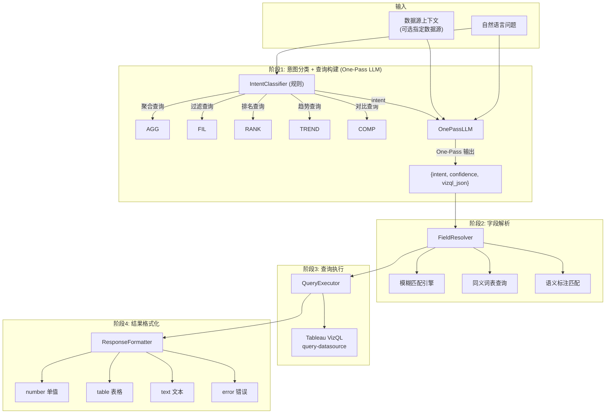
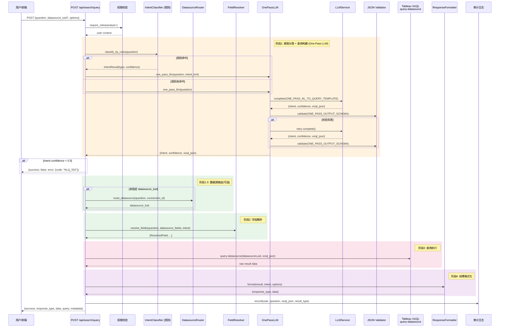
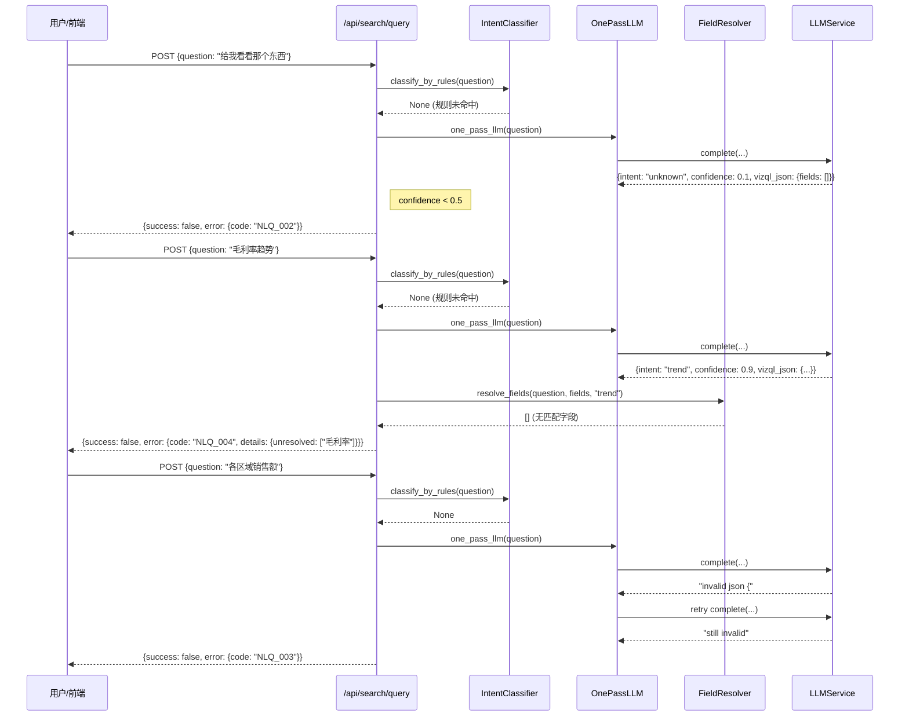

# NL-to-Query 流水线技术规格书

| 属性 | 值 |
|------|-----|
| 版本 | v1.2 |
| 日期 | 2026-04-16 |
| 状态 | 草稿 |
| 作者 | Mulan BI Platform Team |
| 模块路径 | `backend/services/llm/`, `backend/app/api/search.py`(规划) |
| API 前缀 | `/api/search` |

---

## 目录

1. [概述](#1-概述)
2. [流水线架构](#2-流水线架构)
3. [意图分类](#3-意图分类)
4. [字段解析](#4-字段解析)
5. [查询构建](#5-查询构建)
5.5 [查询执行层（Stage 3）](#55-查询执行层stage-3)
6. [API 设计](#6-api-设计)
7. [多数据源路由](#7-多数据源路由)
8. [响应类型](#8-响应类型)
9. [错误码](#9-错误码)
10. [安全](#10-安全)
11. [时序图](#11-时序图)
12. [测试策略](#12-测试策略)
13. [开放问题](#13-开放问题)

---

## 1. 概述

### 1.1 目的

NL-to-Query 流水线将用户的自然语言问题（如"上个月各区域销售额是多少"）转换为结构化的 Tableau VizQL 查询 JSON，并通过 Tableau VizQL Data Service 的 `query-datasource` 接口执行查询，返回格式化的数据结果。

该流水线是 Mulan BI Platform 的核心交互入口，使业务用户无需了解数据模型即可通过自然语言获取数据洞察。

### 1.2 范围

- **包含**：自然语言解析、意图分类、字段映射、VizQL JSON 构建、查询执行、结果格式化、多数据源路由
- **不包含**：可视化图表渲染（由前端负责）、数据源元数据同步（由 Tableau MCP 模块负责）、LLM 基础设施管理（由 08-llm-layer-spec 覆盖）

### 1.3 关联文档

| 文档 | 路径 | 关系 |
|------|------|------|
| 架构规范 | `docs/ARCHITECTURE.md` 6.3 | NL-to-Query 输出契约定义 |
| LLM 能力层规格书 | `docs/specs/08-llm-layer-spec.md` | LLM 调用基础设施 |
| Tableau MCP 规格书 | `docs/specs/07-tableau-mcp-v1-spec.md` | 数据源元数据来源 |
| 语义维护规格书 | `docs/specs/09-semantic-maintenance-spec.md` | 语义标注/术语映射 |
| 数据模型总览 | `docs/specs/03-data-model-overview.md` | 表结构定义 |
| 错误码标准 | `docs/specs/01-error-codes-standard.md` | 错误码命名规范 |

---

## 2. 流水线架构

NL-to-Query 流水线分为 4 个阶段，各阶段串行执行，前序失败时提前终止并返回错误响应。

### 2.1 四阶段流水线（One-Pass LLM）

NL-to-Query 流水线分为 4 个阶段（原五阶段中的「意图分类」与「查询构建」合并为 One-Pass LLM 调用）。前序失败时提前终止并返回错误响应。


**性能优化说明**：原设计意图分类（Stage 1，LLM 兜底）与查询构建（Stage 3，LLM）串行执行，两次 LLM 调用导致响应时间动辄 5-8 秒。One-Pass 方案将两者合并为单次 LLM 调用，大模型在一次响应中同时输出 `intent`（意图类型）、`confidence`（置信度）和 `vizql_json`（查询 JSON），典型场景延迟降低 40-60%。

### 2.2 阶段职责总览

| 阶段 | 名称 | 输入 | 输出 | 执行者 |
|------|------|------|------|--------|
| 1 | 意图分类 + 查询构建 | 用户自然语言 + 数据源字段列表 + 业务术语映射 | 意图类型 + 置信度 + VizQL JSON（One-Pass） | LLM（`ONE_PASS_NL_TO_QUERY_TEMPLATE`） |
| 2 | 字段解析 | 用户问题 + 数据源字段列表 + 阶段1输出的 intent | 匹配的 fieldCaption 列表（供校验/补全用） | 模糊匹配 + 同义词表 |
| 3 | 查询执行 | VizQL JSON + datasourceLuid | 原始查询结果 | Tableau VizQL Data Service |
| 4 | 结果格式化 | 原始数据 + 意图类型 | 结构化响应（number/table/text/error） | 格式化引擎 |

> **阶段1说明**：意图分类不再作为独立阶段，而是内嵌于 One-Pass LLM 调用中。大模型同时输出 intent、confidence 和 vizql_json。规则引擎仍作为快速路径（关键词匹配直接返回意图，跳过 LLM 调用）。

### 2.3 数据流详细



---

## 3. 意图分类 + 查询构建（One-Pass LLM）

### 3.1 查询意图类型

| 意图类型 | 标识符 | 描述 | 典型问句 |
|---------|--------|------|---------|
| 聚合查询 | `aggregate` | 对度量字段进行聚合计算 | "总销售额是多少" |
| 过滤查询 | `filter` | 按条件过滤后查看数据 | "华东区的订单有哪些" |
| 排名查询 | `ranking` | 排序并取前/后 N 条 | "销售额前10的产品" |
| 趋势查询 | `trend` | 按时间维度分析变化趋势 | "过去6个月销售额趋势" |
| 对比查询 | `comparison` | 多维度/多指标对比 | "各区域本月vs上月销售额" |

### 3.2 One-Pass LLM 调用

意图分类与 VizQL JSON 生成合并为单次 LLM 调用，大模型在一次响应中同时输出意图类型、置信度和完整查询结构。

**输出格式**：

```json
{
  "intent": "trend",
  "confidence": 0.95,
  "vizql_json": {
    "fields": [
      {"fieldCaption": "Order Date", "function": "MONTH"},
      {"fieldCaption": "Sales", "function": "SUM"}
    ],
    "filters": [
      {
        "field": {"fieldCaption": "Order Date"},
        "filterType": "DATE",
        "periodType": "MONTHS",
        "dateRangeType": "LASTN",
        "rangeN": 6
      }
    ]
  }
}
```

**置信度与兜底逻辑**：

- `confidence >= 0.5`：接受 `intent` 和 `vizql_json`，进入阶段2
- `confidence < 0.5`：返回 `NLQ_002` 错误，无需进入阶段2/3

> **性能收益**：单次 LLM 调用（~1.5-2s）替代原两次串行调用（~3-5s），P50 延迟降低 50%+

### 3.3 规则快速路径

意图分类仍保留**规则优先**策略，用于在规则匹配度高时完全跳过 LLM 调用：

```python
def classify_intent(question: str) -> IntentResult | None:
    """返回 None 表示需走 One-Pass LLM；返回 IntentResult 表示规则命中"""
    if matches_ranking_keywords(question):
        return IntentResult(type="ranking", confidence=0.95, source="rule")
    if matches_trend_keywords(question):
        return IntentResult(type="trend", confidence=0.90, source="rule")
    if matches_comparison_keywords(question):
        return IntentResult(type="comparison", confidence=0.85, source="rule")
    return None  # 触发 One-Pass LLM
```

**意图关键词映射表**：

| 意图 | 中文关键词 | 英文关键词 |
|------|----------|-----------|
| `ranking` | 前N、排名、最高、最低、最多、最少、排行 | top, bottom, rank, highest, lowest |
| `trend` | 趋势、走势、变化、同比、环比、月度、季度 | trend, over time, monthly, quarterly |
| `comparison` | 对比、vs、比较、各...的、分别 | compare, versus, each, by |
| `filter` | ...的、哪些、筛选、包含、不包含 | where, which, filter, include |
| `aggregate` | 总、合计、总共、一共、平均、数量 | total, sum, average, count, how many |

---

## 4. 字段解析

### 4.1 字段来源

字段解析的基础数据来自 `tableau_datasource_fields` 表（由 Tableau 同步流水线维护）。

#### 表结构引用

| 列名 | 说明 | 解析用途 |
|------|------|---------|
| `field_name` | Tableau 内部字段名 | 精确匹配 |
| `field_caption` | 字段显示名（中/英文） | 模糊匹配主要目标 |
| `data_type` | 数据类型（string/integer/real/date/datetime/boolean） | 类型推断 |
| `role` | 维度/度量（dimension/measure） | 聚合函数判断 |
| `description` | 字段描述 | 语义匹配辅助 |
| `formula` | 计算字段公式 | 计算字段识别 |

### 4.2 自然语言字段名 -> fieldCaption 映射

映射流程按优先级执行，匹配成功即返回：

```
1. 精确匹配  →  用户词 == field_caption（不区分大小写）
2. 同义词匹配 →  用户词 ∈ synonym_table[field_caption]
3. 语义标注匹配 → 用户词 ∈ tableau_field_semantics.semantic_name_zh
4. 模糊匹配  →  编辑距离(用户词, field_caption) <= 阈值
5. LLM 兜底  →  将字段列表交给 LLM，由 LLM 完成映射
```

### 4.3 模糊匹配策略

| 策略 | 算法 | 阈值 | 适用场景 |
|------|------|------|---------|
| 编辑距离 | Levenshtein | 距离 <= 2 且长度比 >= 0.6 | 拼写接近（"销售额" vs "销售金额"） |
| 包含匹配 | substring | 子串长度 >= 2 | "销售" 匹配 "销售额" |
| 拼音匹配 | pypinyin | 拼音完全相同 | "xiaoshoue" 匹配 "销售额" |

### 4.4 同义词表

同义词表存储在 `nlq_synonym_mappings` 表中（规划），初始版本硬编码在配置中：

```python
DEFAULT_SYNONYMS = {
    # 常见财务指标
    "销售额": ["sales", "营业额", "销售金额", "收入", "营收"],
    "利润": ["profit", "净利润", "毛利", "利润额"],
    "成本": ["cost", "费用", "支出"],
    "订单数": ["order count", "订单量", "订单总数"],
    "折扣": ["discount", "折扣率", "优惠"],

    # 常见维度
    "区域": ["region", "地区", "大区"],
    "产品": ["product", "商品", "产品名称", "货品"],
    "类别": ["category", "分类", "品类", "产品类别"],
    "客户": ["customer", "顾客", "客户名称"],
    "日期": ["date", "时间", "订单日期", "下单时间"],

    # 时间表达
    "上个月": ["last month", "上月"],
    "本月": ["this month", "当月"],
    "今年": ["this year", "本年度"],
    "去年": ["last year", "上年"],
}
```

### 4.5 字段解析输出

```python
@dataclass
class ResolvedField:
    field_caption: str        # 匹配到的 Tableau 字段显示名
    field_name: str           # Tableau 内部字段名
    role: str                 # "dimension" | "measure"
    data_type: str            # 数据类型
    match_source: str         # "exact" | "synonym" | "semantic" | "fuzzy" | "llm"
    match_confidence: float   # 0.0 ~ 1.0
    user_term: str            # 用户原始表达
```

---

## 5. 查询构建（One-Pass）

### 5.1 VizQL JSON 生成（One-Pass LLM）

查询构建与意图分类合并为 `ONE_PASS_NL_TO_QUERY_TEMPLATE` 模板，单次 LLM 调用同时输出意图分类结果和 VizQL JSON。

#### Prompt 上下文组装

```
┌──────────────────────────────────────────┐
│ System: "你是一个 Tableau 数据查询专家"      │
├──────────────────────────────────────────┤
│ 数据源信息:                                │
│   · datasource_luid                       │
│   · datasource_name                       │
├──────────────────────────────────────────┤
│ 可用字段 (fields_with_types):              │
│   · field_caption + data_type + role      │
│   · 原始数据源字段表（非阶段2输出）          │
│   · 超出 Token 预算时按 P0-P5 优先级截断     │
├──────────────────────────────────────────┤
│ 业务术语映射 (term_mappings):               │
│   · 同义词表 + 语义标注                     │
├──────────────────────────────────────────┤
│ 用户问题 (question)                        │
├──────────────────────────────────────────┤
│ 输出格式约束 + 规则                         │
└──────────────────────────────────────────┘
```

#### One-Pass Prompt 模板

```
你是一个 Tableau 数据查询专家。请分析以下用户问题，同时完成意图分类和 VizQL JSON 生成。

数据源信息：
- datasource_luid: {datasource_luid}
- datasource_name: {datasource_name}

可用字段：
{fields_with_types}

业务术语映射：
{term_mappings}

用户问题：{question}

请以以下 JSON 格式输出（直接输出 JSON，不要包含任何解释文字）：
{{
  "intent": "<aggregate|filter|ranking|trend|comparison>",
  "confidence": <0.0-1.0>,
  "vizql_json": {{
    "fields": [...],
    "filters": [...]
  }}
}}

注意：
- intent 必须为 aggregate/filter/ranking/trend/comparison 之一
- confidence 表示你对整个解析结果的置信度（综合意图判断 + 字段映射 + 过滤条件）
- 如果用户问题无法解析为有效查询，confidence 设为 0.1
- fields 至少包含一个字段，function 可选（维度字段无需 function）
- filters 用于时间过滤、分类过滤、数值范围过滤等
```

**LLM 参数约束**：为了保证输出结构化 JSON 的绝对稳定性，防止格式错乱或产生幻觉，此处的 LLM API 调用必须硬编码配置 `temperature = 0.1`，不允许继承系统的全局配置（0.7）。

**[P1 新增] LLM purpose 路由**：`one_pass_llm()` 调用 `llm_service.complete_for_semantic(..., purpose="nlq")`，系统优先使用 `purpose=nlq` 的 LLM 配置（参见 `08-llm-layer-spec.md` §2.1.1 Purpose 枚举）。若无 `nlq` 专属配置，自动 fallback 到 `purpose=default`。这允许管理员为 NL-to-Query 场景单独配置模型/endpoint，与通用配置隔离。

**Token 预算管理（强制）**：`{fields_with_types}` 注入时必须遵守 Token 预算上限：

| 预算项 | 上限 | 说明 |
|--------|------|------|
| System Prompt 预留 | 200 tokens | "你是一个 Tableau 数据查询专家。" |
| User Instruction 预留 | 300 tokens | 数据源信息 + 术语映射 + 问题文本 |
| **字段上下文可用预算** | **2500 tokens** | `MAX_NL2Q_CONTEXT_TOKENS - 200 - 300` |
| 单次调用总上限 | 3000 tokens | 与 Spec 12 §3.2 保持一致 |

**字段优先级截断策略**（与 Spec 12 §3.4 对齐）：

| 优先级 | 类型 | 截断规则 |
|--------|------|---------|
| P0 | 核心度量字段（`is_core_field=True` 且 `role=measure`） | 优先保留，公式完整保留 |
| P1 | 核心维度字段（`is_core_field=True` 且 `role=dimension`） | 其次保留 |
| P2 | 普通度量字段（`role=measure`） | 公式截断为"[公式已截断]" |
| P3 | 普通维度字段（`role=dimension`） | 截断公式 |
| P4 | 计算字段（有 formula） | 截断公式 |
| P5 | 其他字段 | 超预算时优先丢弃 |

**敏感字段过滤（强制）**：`sensitivity_level` 为 `HIGH` / `CONFIDENTIAL` 的字段不得进入 `{fields_with_types}` 上下文（与 Spec 12 §9.2 对齐）。过滤在截断前执行。

### 5.2 One-Pass 输出格式

输出为两层结构：`intent` + `confidence` 来自意图分类，`vizql_json` 直接匹配 Tableau VizQL Data Service `query-datasource` 工具参数格式：

```json
{
  "intent": "trend",
  "confidence": 0.95,
  "vizql_json": {
    "fields": [
      {"fieldCaption": "Sales", "function": "SUM", "fieldAlias": "总销售额"},
      {"fieldCaption": "Region"}
    ],
    "filters": [
      {
        "field": {"fieldCaption": "Order Date"},
        "filterType": "DATE",
        "periodType": "MONTHS",
        "dateRangeType": "LAST"
      }
    ]
  }
}
```

### 5.3 操作符映射表

LLM 生成的抽象操作符需映射为 VizQL 过滤器类型：

#### 过滤器类型映射

| 用户意图表达 | VizQL filterType | 附加参数 | 示例 |
|------------|-----------------|---------|------|
| "等于X" / "是X" | `SET` | `values: [X]` | 区域是华东 |
| "包含X和Y" | `SET` | `values: [X, Y]` | 类别包含家具和办公用品 |
| "不包含X" | `SET` | `values: [X], exclude: true` | 不包含退货订单 |
| "大于X" | `QUANTITATIVE_NUMERICAL` | `quantitativeFilterType: "MIN", min: X` | 销售额大于1000 |
| "小于X" | `QUANTITATIVE_NUMERICAL` | `quantitativeFilterType: "MAX", max: X` | 折扣小于0.5 |
| "在X到Y之间" | `QUANTITATIVE_NUMERICAL` | `quantitativeFilterType: "RANGE", min: X, max: Y` | 利润在100到500之间 |
| "上个月" | `DATE` | `periodType: "MONTHS", dateRangeType: "LAST"` | 上个月的销售额 |
| "本月" | `DATE` | `periodType: "MONTHS", dateRangeType: "CURRENT"` | 本月订单 |
| "最近N天" | `DATE` | `periodType: "DAYS", dateRangeType: "LASTN", rangeN: N` | 最近7天 |
| "今年至今" | `DATE` | `periodType: "YEARS", dateRangeType: "TODATE"` | 今年累计销售额 |
| "前N名" | `TOP` | `direction: "TOP", howMany: N` | 销售额前10的产品 |
| "后N名" | `TOP` | `direction: "BOTTOM", howMany: N` | 利润最低的5个区域 |
| "包含关键词" | `MATCH` | `contains: "keyword"` | 产品名包含"桌" |

#### 聚合函数映射

| 用户表达 | VizQL function |
|---------|----------------|
| 总/合计/总共 | `SUM` |
| 平均/均值/平均值 | `AVG` |
| 数量/个数/多少个 | `COUNT` |
| 去重数量/有多少种 | `COUNTD` |
| 最大/最高 | `MAX` |
| 最小/最低 | `MIN` |
| 中位数 | `MEDIAN` |

#### 时间粒度映射

| 用户表达 | VizQL function |
|---------|----------------|
| 按年/年度 | `YEAR` |
| 按季度 | `QUARTER` |
| 按月/月度 | `MONTH` |
| 按周 | `WEEK` |
| 按天/每日 | `DAY` |

### 5.4 One-Pass JSON Schema 校验

One-Pass LLM 输出的 JSON 必须通过以下校验：

```python
ONE_PASS_OUTPUT_SCHEMA = {
    "type": "object",
    "required": ["intent", "confidence", "vizql_json"],
    "properties": {
        "intent": {
            "type": "string",
            "enum": ["aggregate", "filter", "ranking", "trend", "comparison"]
        },
        "confidence": {
            "type": "number",
            "minimum": 0.0,
            "maximum": 1.0
        },
        "vizql_json": {
            "type": "object",
            "required": ["fields"],
            "properties": {
                "fields": {
                    "type": "array",
                    "minItems": 1,
                    "items": {
                        "type": "object",
                        "required": ["fieldCaption"],
                        "properties": {
                            "fieldCaption": {"type": "string"},
                            "function": {
                                "type": "string",
                                "enum": ["SUM", "AVG", "MEDIAN", "COUNT", "COUNTD",
                                         "MIN", "MAX", "STDEV", "VAR",
                                         "YEAR", "QUARTER", "MONTH", "WEEK", "DAY",
                                         "TRUNC_YEAR", "TRUNC_QUARTER", "TRUNC_MONTH",
                                         "TRUNC_WEEK", "TRUNC_DAY"]
                            },
                            "fieldAlias": {"type": "string"},
                            "sortDirection": {"type": "string", "enum": ["ASC", "DESC"]},
                            "sortPriority": {"type": "integer", "minimum": 1},
                            "maxDecimalPlaces": {"type": "integer", "minimum": 0}
                        }
                    }
                },
                "filters": {
                    "type": "array",
                    "items": {"type": "object"}
                }
            }
        }
    }
}
```

校验失败处理：
1. 首次校验失败：触发带反馈重试（最多重试 1 次）。必须将 JSON Schema 的具体解析报错信息追加到原 Prompt 末尾（例如："你上次生成的 JSON 存在以下错误：{error_details}，请严格按照 Schema 格式重新生成"），再重新调用 LLM。
2. 重试仍失败：终止调用，返回 `NLQ_003` 错误。

---

## 5.5 查询执行层（Stage 3）

> **背景**：阶段3将 One-Pass LLM 生成的 VizQL JSON 通过 Tableau MCP 的 `query-datasource` 工具执行查询，返回原始数据。本节定义 MCP 工具调用方式、请求/响应格式、认证契约和错误处理策略。

### 5.5.1 MCP 工具调用契约

**工具名**: `query-datasource`
**MCP Server**: `tableau-bi-ksyun`（已配置的 Tableau Server/Site 连接）
**调用方式**: MCP tool call（通过 `mcp__tableau-bi-ksyun__query-datasource` 工具）

阶段3接收到 One-Pass LLM 输出的 `vizql_json` 后，执行以下步骤：

1. 从 `TableauAsset.datasource_luid` 查找对应 `TableauConnection.id`，复用已存储的 PAT 认证上下文
2. 调用 MCP tool `query-datasource`，传入 `datasourceLuid` 和 `query`（VizQL JSON）
3. 解析返回的 `fields` + `rows`，若超时或失败则按 §5.5.3 处理

### 5.5.2 请求格式

**MCP 工具请求参数**:

| 参数 | 类型 | 必填 | 默认值 | 说明 |
|------|------|------|--------|------|
| `datasourceLuid` | `string` | ✅ | - | Tableau 数据源 LUID（来自阶段1路由结果） |
| `query.fields` | `array` | ✅ | - | 字段列表，每个元素见下表 |
| `query.filters` | `array` | ❌ | `[]` | 过滤器列表 |
| `query.parameters` | `array` | ❌ | `[]` | 参数化查询值（如有参数化字段） |
| `limit` | `integer` | ❌ | `1000` | 最大返回行数（1~1000） |

**`query.fields` 元素结构**:

| 字段 | 类型 | 说明 |
|------|------|------|
| `fieldCaption` | `string` | 字段显示名（与数据源元数据精确匹配） |
| `function` | `string` | 聚合函数：`SUM`/`AVG`/`COUNT`/`COUNTD`/`MIN`/`MAX`/`MEDIAN`，或时间粒度：`YEAR`/`QUARTER`/`MONTH`/`WEEK`/`DAY`（维度字段无需填写） |
| `fieldAlias` | `string` | 结果集中使用的列别名（可选） |

**`query.filters` 元素内层 `field` 结构**（注意双层嵌套）:

```json
"field": {"fieldCaption": "Order Date"}
```

> ⚠️ 注意：此处的 `field` 是对象 `{"fieldCaption": "..."}`，不是字符串 `"field": "Order Date"`。这是与 Tableau VizQL API 交互的确定性格式。

**完整请求示例**:

```json
{
  "datasourceLuid": "ABC-123-XYZ",
  "query": {
    "fields": [
      {"fieldCaption": "Region", "fieldAlias": "区域"},
      {"fieldCaption": "Sales", "function": "SUM", "fieldAlias": "总销售额"}
    ],
    "filters": [
      {
        "field": {"fieldCaption": "Order Date"},
        "filterType": "DATE",
        "periodType": "MONTHS",
        "dateRangeType": "LAST",
        "rangeN": 1
      }
    ],
    "parameters": []
  },
  "limit": 100
}
```

### 5.5.3 响应格式

**MCP 工具响应格式**:

```json
{
  "fields": [
    {"fieldCaption": "Region", "dataType": "string"},
    {"fieldCaption": "Sales", "dataType": "number"}
  ],
  "rows": [
    ["华东", 100000],
    ["华南", 85000]
  ]
}
```

| 字段 | 类型 | 说明 |
|------|------|------|
| `fields[].fieldCaption` | `string` | 列名（与请求中的 `fieldCaption` 对应） |
| `fields[].dataType` | `string` | 数据类型：`string`/`number`/`boolean`/`date` |
| `rows` | `array[array]` | 二维数据数组，每行顺序与 `fields` 对应 |

**空结果集**:

```json
{
  "fields": [...],
  "rows": []
}
```

### 5.5.4 认证与连接复用

MCP query 使用 `tableau_connections` 中已存储的 Personal Access Token (PAT) 认证信息，每次查询按以下流程：

1. 根据 `TableauAsset.datasource_luid` 查找对应的 `TableauConnection.id`
2. 解密该连接的 `token_encrypted` 字段获取 PAT 凭据
3. 携带 PAT 向 Tableau VizQL Data Service 发起 `query-datasource` 请求
4. **无需每次重新认证**；MCP server 内部维护连接复用

> 注意：若 `TableauConnection.is_active = false` 或 `last_test_success = false`，查询直接返回 NLQ_009，不尝试调用 MCP。

### 5.5.5 错误处理策略

| 错误场景 | 错误码 | HTTP 状态 | 处理策略 |
|---------|--------|----------|---------|
| MCP tool 调用失败（网络超时、连接拒绝） | `NLQ_006` | 502 | 重试 1 次（间隔 1s），仍失败返回 NLQ_006 |
| VizQL 语法错误（字段名不存在、聚合函数不合法） | `NLQ_006` | 400 | 直接返回，不重试（问题在 LLM 生成阶段） |
| 查询超时（> `options.timeout` 秒） | `NLQ_007` | 504 | 返回超时错误，附上 `options.timeout` 值 |
| 数据源不存在 / 已删除 | `NLQ_009` | 404 | 明确提示"数据源不可用" |
| 数据源无权限（PAT 无权访问该 datasource） | `NLQ_009` | 403 | 提示权限不足，建议联系管理员 |
| MCP server 不可用（未配置或启动失败） | `NLQ_006` | 502 | 返回"MCP 服务不可用"，不重试 |

### 5.5.6 与相关 Spec 的边界说明

| 模块 | 边界 | 关联 |
|------|------|------|
| Spec 07 (Tableau MCP V1) | 仅定义资产同步（Workbook/View/Datasource 同步），**不包含** query-datasource | Stage 3 依赖 Spec 07 的资产元数据（`TableauAsset.datasource_luid`），但不调用其同步接口 |
| Spec 13 (MCP V2 直连) | 规划 MCP 直连模式（跳过 REST），与 Stage 3 无关 | 未来可迁移至 Spec 13 的直连方案以降低延迟 |
| Spec 09 (语义维护) | 提供字段语义标注（`TableauFieldSemantics`），供阶段2字段解析使用 | Stage 3 的查询执行不直接依赖语义标注 |

### 5.5.7 工程实现注意事项（Stage 3 接入时必须满足）

> 以下三条为线上性能强制约束，违反任意一条不得合入。

#### 约束 A：动态凭据传递（安全 + 并发）

MCP Server (`tableau-bi-ksyun`) 启动时依赖以下环境变量，必须在进程启动前完成注入：

| 环境变量 | 来源 | 说明 |
|---------|------|------|
| `TABLEAU_SERVER_URL` | `TableauConnection.server_url` | Tableau Server 地址 |
| `TABLEAU_SITE` | `TableauConnection.site` | Site 名称 |
| `TABLEAU_PAT_NAME` | `TableauConnection.token_name` | Personal Access Token Name |
| `TABLEAU_PAT_VALUE` | 解密 `TableauConnection.token_encrypted` | PAT Secret（Fernet 解密后） |

**注入时机**：每次查询执行前，从 DB 读取对应 `TableauConnection` 记录，解密 token，**通过 `contextvars` 或函数传参将 PAT 凭据传递到 MCP ClientSession**。严禁写入 `os.environ`（见下方 P0 警告）。

**P0 多租户安全警告**：在 FastAPI 等异步 Web 框架中，`os.environ` 是进程全局共享的。若向 `os.environ` 写入动态凭据，用户 A 和用户 B 的并发请求会产生竞态条件——用户 A 的查询可能使用用户 B 的 Tableau PAT 凭据，导致跨租户数据泄露。**禁止使用 `os.environ` 传递动态凭据**。正确做法：

```python
# ❌ 禁止：os.environ 全局污染，并发竞态
os.environ["TABLEAU_PAT_VALUE"] = decrypted_token

# ✅ 正确：使用 contextvars 限定在当前请求生命周期内
from contextvars import copy_context, ContextVar
_tableau_creds: ContextVar[dict] = ContextVar("tableau_creds")

async def query_with_creds(connection_id: int, vizql_json: dict):
    creds = await load_and_decrypt_connection_creds(connection_id)
    token = _tableau_creds.set(creds)  # 仅当前协程可见
    try:
        return await mcp_client.query_datasource(vizql_json)
    finally:
        _tableau_creds.reset(token)
```

#### 约束 B：MCP ClientSession 长连接复用

Stage 3 查询调用链路为：

```
FastAPI 请求
  → search.py（阶段1~2）
  → tableau_mcp_client.query_datasource()   ← 禁止每次请求 new Session
  → MCP Server（npx tableau-mcp ...）
```

**复用策略**：
- MCP ClientSession 应作为**单例**（` tableau_mcp_client = MCPClientSingleton()`）持有，不可在 `query_datasource()` 内部每次 `async with ClientSession()` 新建
- 若 MCP Server 支持 `npx` 常驻进程模式（而非每次 spawn），连接握手延迟可从 ~500ms 降至 ~10ms
- 若使用 `mcp__tableau-bi-ksyun__query-datasource` MCP 工具，工具内部已维护 Session 生命周期；直接调用即可，无需在外层额外包装 Session
- **禁止**：在 FastAPI 路由处理器内直接 `subprocess.run(["npx", "tableau-mcp"])` — 每次调用会拉起新进程，300 个 Golden Case 测试将从秒级跳至分钟级

#### 约束 C：字段一致性校验（Stage 2 强化）

Stage 2 `resolve_fields()` 的输出必须与 Stage 1 生成的 VizQL JSON 保持字段一致：

```
用户问题 → Stage 1（One-Pass LLM）→ VizQL JSON（fieldCaption = ?）
        → Stage 2（FieldResolver）→ ResolvedField[]（field_caption = ?）
                                     ↑
                              模糊匹配："营收" → "Sales"
```

**一致性规则**：
- Stage 2 为 Stage 1 提供字段映射校验：`ResolvedField.user_term`（用户表述）→ `ResolvedField.field_caption`（数据源实际字段）
- 若 Stage 1 生成的 VizQL 中 `fieldCaption` 与 Stage 2 返回的 `field_caption` 不一致，应以 Stage 2 为准（Stage 2 有语义标注、同义词表等更多上下文）
- 模糊匹配场景示例（Golden Case #21）：用户说"营收"，同义词表映射到 `Sales`，则 VizQL JSON 中必须是 `"fieldCaption": "Sales"`，不能是 `"fieldCaption": "营收"`

---

## 6. API 设计

### 6.1 端点总览

| 方法 | 路径 | 权限 | 说明 |
|------|------|------|------|
| `POST` | `/api/search/query` | analyst+ | 自然语言查询 |
| `GET` | `/api/search/suggestions` | analyst+ | 查询建议（自动补全） |
| `GET` | `/api/search/history` | analyst+ | 查询历史 |

### 6.2 POST /api/search/query

将用户自然语言问题转换为数据查询并返回结果。

#### 请求体

```json
{
  "question": "上个月各区域的销售额是多少",
  "datasource_luid": "optional-datasource-luid",
  "connection_id": 1,
  "conversation_id": "uuid-of-conversation",
  "use_conversation_context": false,
  "options": {
    "limit": 100,
    "timeout": 30,
    "response_type": "auto"
  }
}
```

| 字段 | 类型 | 必填 | 默认值 | 说明 |
|------|------|------|--------|------|
| `question` | `string` | 是 | - | 自然语言问题，长度 1~500 字符 |
| `datasource_luid` | `string` | 否 | - | 指定数据源 LUID，不指定则自动路由 |
| `connection_id` | `integer` | 否 | - | 指定 Tableau 连接 ID（限定数据源范围） |
| `conversation_id` | `string` | 否 | `null` | **[P1 新增]** 对话 ID（UUID），关联对话历史；存在时查询成功后写入消息 |
| `use_conversation_context` | `bool` | 否 | `false` | **[P2 新增]** 追问上下文继承开关，`true` 时从上轮对话自动填充 `datasource_luid`/`connection_id` |
| `options.limit` | `integer` | 否 | `100` | 返回结果最大行数（1~1000） |
| `options.timeout` | `integer` | 否 | `30` | 查询超时秒数（5~60） |
| `options.response_type` | `string` | 否 | `"auto"` | 期望响应类型：`auto` / `number` / `table` / `text` |

#### 响应 200（成功 - number 类型）

```json
{
  "success": true,
  "response_type": "number",
  "data": {
    "value": 1523456.78,
    "label": "总销售额",
    "unit": "",
    "formatted": "1,523,456.78"
  },
  "query": {
    "datasource_luid": "abc-123",
    "datasource_name": "Superstore",
    "vizql_json": {
      "fields": [
        {"fieldCaption": "Sales", "function": "SUM", "fieldAlias": "总销售额"}
      ],
      "filters": []
    }
  },
  "metadata": {
    "intent": "aggregate",
    "intent_confidence": 0.95,
    "field_mappings": [
      {"user_term": "销售额", "field_caption": "Sales", "match_source": "synonym"}
    ],
    "execution_time_ms": 1250,
    "cached": false
  }
}
```

#### 响应 200（成功 - table 类型）

```json
{
  "success": true,
  "response_type": "table",
  "data": {
    "columns": [
      {"name": "Region", "label": "区域", "type": "string"},
      {"name": "SUM(Sales)", "label": "总销售额", "type": "number"}
    ],
    "rows": [
      {"Region": "华东", "SUM(Sales)": 523456.78},
      {"Region": "华北", "SUM(Sales)": 412345.67}
    ],
    "total_rows": 4,
    "truncated": false
  },
  "query": { "..." : "..." },
  "metadata": { "..." : "..." }
}
```

#### 响应 200（失败）

```json
{
  "success": false,
  "response_type": "error",
  "error": {
    "code": "NLQ_004",
    "message": "未找到与问题匹配的字段",
    "details": {
      "unresolved_terms": ["毛利率"],
      "available_measures": ["Sales", "Profit", "Discount"]
    }
  }
}
```

---

## 7. 多数据源路由

当用户未指定 `datasource_luid` 时，系统自动选择最合适的数据源。

### 7.1 路由算法

> **[P1/C4 新增]** `connection_id=None` 时，`route_datasource()` 先自动查找第一个 `is_active=True` 的 `TableauConnection`，将其 `id` 作为 `connection_id` 使用，然后再执行评分路由。无活跃连接时跳过 `connection_id` 过滤，对所有数据源评分。

```python
def route_datasource(question: str, connection_id: int = None) -> DatasourceCandidate:
    """
    数据源路由算法
    输入: 用户问题 + 可选连接限定
    输出: 最优数据源候选
    C4：connection_id=None 时自动路由到第一个 is_active=True 的 TableauConnection
    """
    # C4: 自动连接路由
    if connection_id is None:
        active_conn = get_first_active_tableau_connection()
        if active_conn:
            connection_id = active_conn.id

    # 1. 获取候选数据源池
    candidates = get_candidate_datasources(connection_id)

    # 2. 提取用户问题中的字段候选词
    user_terms = extract_terms(question)

    # 3. 对每个数据源评分
    scored = []
    for ds in candidates:
        fields = get_datasource_fields(ds.datasource_luid)
        score = calculate_routing_score(user_terms, fields, ds)
        scored.append((ds, score))

    # 4. 按得分排序，返回最高分
    scored.sort(key=lambda x: x[1], reverse=True)
    if scored[0][1] < MIN_ROUTING_SCORE:
        raise NLQError("NLQ_005", "无法匹配到合适的数据源")
    return scored[0][0]
```

**⚡ 性能防抖约束（强制）**：
路由算法的步骤 3 会循环遍历所有数据源并调用 `get_datasource_fields`。为了防止 N+1 数据库查询风暴导致服务卡顿，此处的 `get_datasource_fields` 必须命中 Redis 缓存（仅缓存数据源的 `field_caption` 列表，有效期建议设为 1 小时）。禁止在路由打分阶段直接对数据库发起高频全表查询。

### 7.2 评分维度

| 维度 | 权重 | 说明 |
|------|------|------|
| 字段完备度 | 0.50 | 用户问题中提及的字段在该数据源中的覆盖率 |
| 同步新鲜度 | 0.25 | 数据源最近一次同步时间距现在的间隔（越新越好） |
| 字段总数 | 0.10 | 字段数量适中优先（避免超大宽表干扰匹配） |
| 使用频次 | 0.15 | 该数据源被查询的历史频次（冷启动阶段权重降低） |

### 7.3 评分公式

```
routing_score = 0.50 * field_coverage_ratio
             + 0.25 * freshness_score(last_sync_at)
             + 0.10 * field_count_score(field_count)
             + 0.15 * usage_frequency_score(query_count)
```

其中：
- `field_coverage_ratio` = 匹配字段数 / 用户提及字段数（0.0~1.0）
- `freshness_score` = max(0, 1 - hours_since_sync / 24)，24 小时内线性衰减
- `field_count_score` = 1.0 if 10 <= count <= 100 else 0.8（惩罚过大/过小数据源）
- `usage_frequency_score` = min(1.0, query_count / 100)，按百次查询归一化

### 7.4 最低得分阈值

`MIN_ROUTING_SCORE = 0.3`。低于该阈值时返回 `NLQ_005` 错误，提示用户指定数据源。

---

## 8. 响应类型

### 8.1 四种响应类型

| 类型 | 标识符 | 触发条件 | 典型场景 |
|------|--------|---------|---------|
| 单值 | `number` | 查询结果为单行单列 | "总销售额是多少" |
| 表格 | `table` | 查询结果为多行或多列 | "各区域销售额" |
| 文本 | `text` | 需要自然语言解释的复杂结果 | "销售额变化原因分析" |
| 错误 | `error` | 流水线任意阶段失败 | 字段匹配失败、查询超时 |

### 8.2 自动类型推断规则

当 `response_type = "auto"` 时，按以下规则推断：

```python
def infer_response_type(intent: str, result_shape: tuple) -> str:
    rows, cols = result_shape

    # 单值场景
    if rows == 1 and cols == 1:
        return "number"

    # 空结果
    if rows == 0:
        return "text"  # 返回"无匹配数据"的文本说明

    # 多行/多列
    return "table"
```

### 8.3 number 响应格式

```json
{
  "value": 1523456.78,
  "label": "总销售额",
  "unit": "",
  "formatted": "1,523,456.78"
}
```

### 8.4 table 响应格式

```json
{
  "columns": [
    {"name": "Region", "label": "区域", "type": "string"},
    {"name": "SUM(Sales)", "label": "总销售额", "type": "number"}
  ],
  "rows": [...],
  "total_rows": 100,
  "truncated": false
}
```

- `total_rows`：实际结果总行数
- `truncated`：若 `total_rows > options.limit`，则为 `true`，`rows` 仅包含 `limit` 条

### 8.5 text 响应格式

```json
{
  "content": "查询未返回数据。可能原因：所选时间范围内没有符合条件的记录。",
  "suggestions": [
    "尝试扩大时间范围",
    "检查筛选条件是否过于严格"
  ]
}
```

---

## 9. 错误码

所有 NL-to-Query 模块的错误码以 `NLQ_` 为前缀，遵循 [01-error-codes-standard.md](01-error-codes-standard.md) 规范。

| 错误码 | HTTP 状态码 | 触发条件 | 错误消息 |
|--------|------------|----------|----------|
| `NLQ_001` | 400 | 用户问题为空或超出长度限制 | 查询问题不合法 |
| `NLQ_002` | 400 | 意图分类失败（置信度低于阈值） | 无法理解查询意图 |
| `NLQ_003` | 502 | LLM 生成的 JSON 不合法（含重试后仍失败） | 查询构建失败 |
| `NLQ_004` | 400 | 用户问题中的字段术语无法匹配到数据源字段 | 未找到匹配字段 |
| `NLQ_005` | 400 | 多数据源路由得分低于阈值 | 无法匹配数据源 |
| `NLQ_006` | 502 | Tableau VizQL 查询执行失败 | 数据查询执行失败 |
| `NLQ_007` | 504 | 查询执行超时 | 查询超时 |
| `NLQ_008` | 502 | LLM 服务不可用（继承 LLM_001~LLM_005） | LLM 服务不可用 |
| `NLQ_009` | 403 | 用户无权访问目标数据源 | 数据源访问被拒绝 |
| `NLQ_010` | 429 | 查询频率超出限制 | 查询过于频繁 |

### 错误响应统一格式

```json
{
  "success": false,
  "response_type": "error",
  "error": {
    "code": "NLQ_004",
    "message": "未找到匹配字段",
    "details": {}
  }
}
```

---

## 10. 安全

### 10.1 查询审计

所有 NL-to-Query 请求记录审计日志，存储于 `nlq_query_logs` 表（规划）：

| 列名 | 类型 | 说明 |
|------|------|------|
| `id` | INTEGER | 主键 |
| `user_id` | INTEGER | 查询用户 ID |
| `question` | TEXT | 原始自然语言问题 |
| `intent` | VARCHAR(32) | 分类后的意图类型 |
| `datasource_luid` | VARCHAR(256) | 目标数据源 |
| `vizql_json` | JSONB | 生成的 VizQL 查询 JSON |
| `response_type` | VARCHAR(16) | 响应类型 |
| `execution_time_ms` | INTEGER | 执行耗时（毫秒） |
| `error_code` | VARCHAR(16) | 错误码（成功时为 NULL） |
| `created_at` | TIMESTAMP | 查询时间 |

### 10.1.1 对话历史写入（P1 新增）

当请求携带 `conversation_id` 时，查询成功后调用 `_append_messages_to_conversation()` 将本次交互写入 `conversation_messages` 表：

- **user 消息**：写入原始自然语言问题（`role=user`）
- **assistant 消息**：写入格式化响应 JSON（`role=assistant`），并附带 `query_context` 字段

`query_context` 字段（`JSONB`）存储本次查询上下文，供追问时继承：

```json
{
  "connection_id": 1,
  "datasource_luid": "abc-123",
  "datasource_name": "Superstore",
  "field_names": ["Sales", "Region", "Order Date"]
}
```

**安全保护**：写入前校验 `conversation_id` 属于当前用户（`conversations.user_id == user.id`），防止跨用户写入。写入失败仅 warning 级日志，不阻塞主流程。

### 10.1.2 追问上下文继承（P2 新增）

当 `use_conversation_context=true` 且未显式指定 `datasource_luid`/`connection_id` 时：

1. 从 `conversation_messages` 中查找该 `conversation_id` 最近一条 `role=assistant` 且 `query_context IS NOT NULL` 的消息
2. 从 `query_context` 中提取 `datasource_luid` 和 `connection_id` 填充当前请求
3. 若读取失败，静默降级（不影响主流程，退回到正常路由逻辑）

此机制使用户无需在每轮追问中重复指定数据源，实现对话式连续查询。

### 10.2 数据量限制

| 限制项 | 默认值 | 说明 |
|--------|--------|------|
| 单次查询最大返回行数 | 1000 | 超出则截断，`truncated=true` |
| 用户问题最大长度 | 500 字符 | 超出返回 `NLQ_001` |
| 单用户每分钟查询数 | 20 | 超出返回 `NLQ_010` |
| LLM 调用超时 | 15 秒 | 继承 `LLMService.complete()` 默认值 |
| VizQL 查询超时 | 30 秒 | 可由 `options.timeout` 调整（5~60） |

### 10.3 敏感数据源过滤

遵循架构规范 9.4 数据敏感度分级：

- `HIGH` / `CONFIDENTIAL` 级别的数据源**不参与**多数据源路由
- `HIGH` / `CONFIDENTIAL` 级别的数据源**不允许**通过 NL-to-Query 查询
- 用户指定 `datasource_luid` 时仍需校验敏感度级别

```python
BLOCKED_SENSITIVITY = {"HIGH", "CONFIDENTIAL"}

def is_datasource_queryable(datasource) -> bool:
    if datasource.sensitivity_level in BLOCKED_SENSITIVITY:
        return False
    return True
```

### 10.4 数据隔离

- LLM 调用仅发送**字段元数据**（字段名、类型、描述），不发送实际数据值
- VizQL 查询结果不经过 LLM，直接返回给用户
- 查询审计日志中记录 VizQL JSON 但不记录查询结果数据

### 10.5 访问控制

| 操作 | 最低角色 | 校验方式 |
|------|---------|---------|
| 自然语言查询 | `analyst` | `require_roles(["admin", "data_admin", "analyst"])` |
| 查询历史查看 | `analyst` | 仅可查看自己的历史 |
| 查询建议 | `analyst` | 基于用户可访问的数据源生成 |

---

## 11. 时序图

### 11.1 完整 NL-to-Query 流程（One-Pass）



### 11.2 错误场景流程



---

## 12. 测试策略

### 12.1 示例查询与预期输出

#### 聚合查询

| 自然语言 | 预期意图 | 预期 VizQL JSON |
|---------|---------|-----------------|
| "总销售额是多少" | `aggregate` | `{"fields": [{"fieldCaption": "Sales", "function": "SUM"}]}` |
| "有多少个客户" | `aggregate` | `{"fields": [{"fieldCaption": "Customer Name", "function": "COUNTD"}]}` |
| "平均利润" | `aggregate` | `{"fields": [{"fieldCaption": "Profit", "function": "AVG"}]}` |

#### 过滤查询

| 自然语言 | 预期意图 | 预期 VizQL JSON |
|---------|---------|-----------------|
| "华东区的销售额" | `filter` | `{"fields": [{"fieldCaption": "Sales", "function": "SUM"}], "filters": [{"field": {"fieldCaption": "Region"}, "filterType": "SET", "values": ["华东"]}]}` |

#### 排名查询

| 自然语言 | 预期意图 | 预期 VizQL JSON |
|---------|---------|-----------------|
| "销售额前5的产品" | `ranking` | `{"fields": [{"fieldCaption": "Product Name"}, {"fieldCaption": "Sales", "function": "SUM", "sortDirection": "DESC", "sortPriority": 1}], "filters": [{"field": {"fieldCaption": "Product Name"}, "filterType": "TOP", "howMany": 5, "fieldToMeasure": {"fieldCaption": "Sales", "function": "SUM"}}]}` |

#### 趋势查询

| 自然语言 | 预期意图 | 预期 VizQL JSON |
|---------|---------|-----------------|
| "最近6个月的月度销售额" | `trend` | `{"fields": [{"fieldCaption": "Order Date", "function": "MONTH"}, {"fieldCaption": "Sales", "function": "SUM"}], "filters": [{"field": {"fieldCaption": "Order Date"}, "filterType": "DATE", "periodType": "MONTHS", "dateRangeType": "LASTN", "rangeN": 6}]}` |

#### 对比查询

| 自然语言 | 预期意图 | 预期 VizQL JSON |
|---------|---------|-----------------|
| "各区域的销售额和利润" | `comparison` | `{"fields": [{"fieldCaption": "Region"}, {"fieldCaption": "Sales", "function": "SUM"}, {"fieldCaption": "Profit", "function": "SUM"}]}` |

### 12.2 单元测试

| 测试模块 | 测试项 | 说明 |
|---------|--------|------|
| IntentClassifier | 关键词规则匹配 | 验证各类关键词触发正确意图 |
| IntentClassifier | LLM 兜底分类 | Mock LLM 验证复杂问句分类 |
| FieldResolver | 精确匹配 | field_caption 完全匹配 |
| FieldResolver | 同义词匹配 | "销售额" -> "Sales" |
| FieldResolver | 模糊匹配 | "销售金额" -> "Sales" (编辑距离) |
| FieldResolver | 无匹配场景 | 返回空列表 |
| OnePassLLM | JSON 生成 | Mock LLM 验证 One-Pass 输出格式正确（intent + confidence + vizql_json） |
| OnePassLLM | Schema 校验 | 非法 JSON 触发重试逻辑 |
| OnePassLLM | 重试耗尽 | 两次失败返回 NLQ_003 |
| OnePassLLM | 置信度阈值 | confidence < 0.5 正确触发 NLQ_002 |
| IntentClassifier | 规则快速路径 | 关键词命中时返回 IntentResult，跳过 LLM |
| DatasourceRouter | 单数据源 | 唯一候选直接返回 |
| DatasourceRouter | 多数据源评分 | 验证评分排序逻辑 |
| DatasourceRouter | 低分拒绝 | 低于阈值返回 NLQ_005 |
| ResponseFormatter | number 推断 | 1x1 结果 -> number |
| ResponseFormatter | table 推断 | 多行结果 -> table |
| ResponseFormatter | 空结果 | 0 行 -> text 说明 |

### 12.3 集成测试

| 测试项 | 说明 |
|--------|------|
| 端到端查询 | 从自然语言到最终响应的完整流水线 |
| 权限校验 | user 角色无法调用查询接口（403） |
| 敏感数据源拦截 | HIGH 级别数据源返回 NLQ_009 |
| 超时处理 | VizQL 查询超时返回 NLQ_007 |
| 限流 | 超出频率限制返回 NLQ_010 |
| LLM 不可用降级 | LLM 服务不可用时返回 NLQ_008 |

### 12.4 Prompt 回归测试

维护一组固定的 `(question, datasource_fields) -> expected_vizql_json` 测试用例，每次 Prompt 模板变更后跑回归测试，确保核心查询场景不被破坏。

### 12.5 验收标准

- [ ] 自然语言问题经 One-Pass LLM 返回正确 VizQL JSON，执行成功后返回 `response_type=number` 或 `table`
- [ ] 意图分类规则路径（汇总/明细/时间序列/META）命中时不调用 LLM
- [ ] META 查询（数据源列表/看板数量/语义配置质量）毫秒级返回，不进入 VizQL 流水线
- [ ] 字段映射按优先级命中：精确 > 同义词 > 语义标注 > 模糊 > LLM 兜底
- [ ] `connection_id=None` 时自动选第一个活跃连接（C4 共识）
- [ ] `conversation_id` 传入时，查询成功后写入 `conversation_messages`（user + assistant）
- [ ] `use_conversation_context=True` 时继承上轮 `datasource_luid` / `connection_id`
- [ ] NLQ_001~NLQ_010 错误码正确触发并返回标准信封
- [ ] analyst 及以上角色可查询，user 角色返回 403
- [ ] LLM prompt 不含实际数据值，仅字段元数据

### 12.6 Mock 与测试约束

- **LLMService 单元测试必须 mock**：`one_pass_llm()` 返回固定 VizQL JSON，验证解析和字段校验逻辑
- **MCP query-datasource 单元测试可 mock**：mock `ClientSession.call_tool()` 返回固定查询结果；集成测试须使用真实 MCP 连接
- **字段解析不可 mock**：`FieldResolver` 必须使用真实匹配逻辑（编辑距离、拼音匹配等），传入固定字段列表
- **Redis 字段缓存测试**：单元测试 mock Redis `get/set`；集成测试使用真实 Redis
- **Playwright mock**：`page.route('**/api/search/query')` 返回 mock SSE 响应时，`answer` / `top_sources` 中的唯一值必须出现在 DOM 断言中
- **Prompt 回归**：每次 `NL_TO_QUERY_TEMPLATE` 变更后必须通过 `tests/unit/nlq/test_prompt_regression.py`

---

## 12.7 数据模型

### nlq_query_logs（查询审计日志）

| 列名 | 类型 | 约束 | 说明 |
|------|------|------|------|
| `id` | INTEGER | PK, autoincrement | 主键 |
| `user_id` | INTEGER | FK → auth_users.id, NOT NULL | 查询用户 |
| `question` | TEXT | NOT NULL | 原始自然语言问题 |
| `intent` | VARCHAR(32) | | 分类后的意图类型 |
| `datasource_luid` | VARCHAR(256) | | 目标数据源 LUID |
| `vizql_json` | JSONB | | 生成的 VizQL 查询 JSON |
| `response_type` | VARCHAR(16) | | 响应类型（number/table/text/error） |
| `execution_time_ms` | INTEGER | | 执行耗时（毫秒） |
| `error_code` | VARCHAR(16) | | 错误码（成功时 NULL） |
| `created_at` | TIMESTAMP | server_default=now() | 查询时间 |

**索引**：
- `ix_nlq_query_logs_user_id` — `(user_id)`
- `ix_nlq_query_logs_created_at` — `(created_at DESC)`

> 迁移文件：`backend/alembic/versions/add_nlq_query_logs.py`（已存在）。表前缀不使用 `bi_`，因为该表为审计日志类独立表。

### nlq_synonym_mappings（同义词表，规划中）

初始版本使用硬编码 `DEFAULT_SYNONYMS`（见 Section 4.4）。后续迁移到数据库时，表结构在 OI-01 解决时定义。

---

## 12.8 集成点

### 上游依赖

| 模块 | 接口 | 说明 |
|------|------|------|
| Spec 08（LLM 层） | `LLMService.complete()` | One-Pass LLM 调用（intent + VizQL JSON 单次生成） |
| Spec 07（Tableau MCP） | `query-datasource` MCP tool | VizQL JSON 查询执行，通过 `ClientSession` 单例调用 |
| Spec 09（语义维护） | `tableau_field_semantics` 表 | 字段语义标注用于字段解析优先级匹配 |
| Spec 17（知识库） | `RAGService.build_rag_context()` | RAG 上下文注入（术语匹配 + 向量检索） |
| Redis | 字段缓存 | `fields:{connection_id}:{datasource_luid}` 缓存字段列表，防冷启动 |

### 下游消费

| 模块 | 消费方式 | 说明 |
|------|---------|------|
| 前端首页 AskBar | SSE 流式响应 | `POST /api/search/query` 返回 SSE 事件 |
| Spec 20（运维工作台） | 首页问数入口 | 复用 `/api/search/query` 端点 |
| `conversation_messages` 表 | 对话历史写入 | 携带 `conversation_id` 时写入 user + assistant 消息 |

### 事件

本模块不发布事件。查询审计通过 `nlq_query_logs` 表记录。

---

## 12.9 角色权限矩阵

| 操作 | admin | data_admin | analyst | user |
|------|:-----:|:----------:|:-------:|:----:|
| 自然语言查询 | Y | Y | Y | N |
| 查看自己的查询历史 | Y | Y | Y | N |
| 查看所有用户查询历史 | Y | N | N | N |
| META 查询（数据源列表等） | Y | Y | Y | N |

---

## 13. 开放问题

| 编号 | 问题 | 优先级 | 状态 |
|------|------|--------|------|
| OI-01 | 同义词表当前为硬编码，后续是否需要支持管理员通过 UI 维护？需设计 `nlq_synonym_mappings` 表结构。 | P2 | 待设计 |
| OI-02 | ~~多轮对话支持：用户追问"那华北呢"时如何继承上下文（数据源、度量字段、时间范围）？~~ | P1 | **已解决（P1/P2：conversation_id + use_conversation_context，见 §10.1.1/10.1.2）** |
| OI-03 | 查询缓存策略：相同问题+相同数据源的查询结果是否缓存？缓存有效期如何与数据源同步周期对齐？ | P2 | 待讨论 |
| OI-04 | ~~意图分类 LLM 兜底路径的延迟开销~~：One-Pass LLM 方案（意图+查询合并单次调用）已将两次串行 LLM 调用优化为一次，P50 延迟降低 50%+。规则快速路径在规则命中时完全跳过 LLM。 | P2 | **已解决（One-Pass LLM）** |
| OI-05 | VizQL 查询结果的可视化推荐：基于意图类型和数据形态自动推荐图表类型（柱状图/折线图/饼图）。 | P3 | 待规划 |
| OI-06 | `NL_TO_QUERY_TEMPLATE` 的 Prompt 工程优化：当前为单次生成，是否需要 Chain-of-Thought 或分步骤生成以提高复杂查询准确率？ | P1 | 待验证 |
| OI-07 | 拼音匹配依赖 `pypinyin` 库，是否纳入依赖？或在初始版本中省略拼音匹配？ | P3 | 待决定 |
| OI-08 | 查询审计日志表 `nlq_query_logs` 的数据保留策略：是否需要定期清理？保留期限多久？ | P3 | 待讨论 |
| OI-09 | 计算字段（formula 非空）是否允许出现在 NL-to-Query 的字段候选列表中？Tableau VizQL 是否支持直接查询计算字段？ | P2 | 待验证 |

---

## 14. META 查询扩展（v1.3）

### 14.1 概述

v1.3 在 VizQL 流水线之前新增一条规则快速路径，支持 3 种首页「元查询」场景。这类查询不需要 LLM 介入，直接查本地 `tableau_assets` / `tableau_field_semantics` 表，毫秒级返回。

**执行路径**：`query()` 入口 → `classify_meta_intent()` → `handle_meta_query()` → 直接返回，**不进入 VizQL 流水线**。

### 14.2 业务口径（Q1-Q3 已确认）

| 编号 | 问题 | 业务口径 |
|------|------|---------|
| Q1 | 查询范围 | 仅限用户在 ScopePicker 选中的 `connection_id`，不自动 fallback 到其他连接。若 `connection_id` 为空，返回"请先选择 Tableau 连接"提示 |
| Q2 | 「看板」定义 | `dashboard` + `workbook` 两种 `asset_type` 都计入总数 |
| Q3 | 数据源列出 | 按 Site（connection）分组展示 |

### 14.3 支持的 3 种 META 意图

#### meta_datasource_list — 数据源列表

- **触发词**：`你有哪些数据源`、`有哪些数据源`、`数据源列表`、`list datasource`、`哪些数据源`、`数据源有哪些`
- **Handler**：`_handle_meta_datasource_list(connection_id, db)`
- **DB 查询**：`tableau_assets WHERE connection_id=? AND asset_type='datasource' AND is_deleted=False`
- **分组展示**：用 `TableauConnection.name + site` 作为分组标签
- **响应格式**：`response_type=text`，Markdown 格式列表

#### meta_asset_count — 看板数量

- **触发词**：`你有几个看板`、`有几个看板`、`看板数量`、`有多少看板`、`多少个看板`、`看板总数`、`几个dashboard`、`几个workbook`
- **Handler**：`_handle_meta_asset_count(connection_id, db)`
- **DB 查询**：分别统计 `asset_type='dashboard'` 和 `asset_type='workbook'` 后相加
- **响应格式**：`response_type=number`，附 `value`（总数）、`content`（详细说明文本）

#### meta_semantic_quality — 语义配置质量

- **触发词**：`语义配置有哪些不完善`、`语义配置不完善`、`语义缺失`、`哪些语义没配置`、`语义配置问题`、`语义不完善`、`语义配置哪些问题`
- **Handler**：`_handle_meta_semantic_quality(connection_id, db)`
- **DB 查询**：`tableau_field_semantics WHERE connection_id=? AND (semantic_definition IS NULL OR semantic_definition='' OR status IN ('draft', 'ai_generated'))`
- **展示逻辑**：最多展示 10 条，超出追加"... 等共 N 处"；字段名优先用 `semantic_name_zh`，其次 `semantic_name`，最后 `tableau_field_id`
- **响应格式**：`response_type=text`，Markdown 格式列表

### 14.4 实现文件

| 文件 | 变更内容 |
|------|---------|
| `backend/services/llm/nlq_service.py` | 新增 `META_INTENT_KEYWORDS` 字典和 `classify_meta_intent()` 函数 |
| `backend/app/api/search.py` | 新增 `handle_meta_query()`、`_handle_meta_datasource_list()`、`_handle_meta_asset_count()`、`_handle_meta_semantic_quality()` 四个函数；在 `query()` 入口 `try` 块最开始插入 META 意图优先检测逻辑 |

### 14.5 约束

- 不修改任何现有 VizQL 流水线代码（One-Pass LLM、字段校验、MCP query-datasource）
- 所有 DB query 使用 `query()` 函数注入的同一 `db: Session`，不新建连接
- `connection_id is None` 时，返回引导提示，不报错、不 fallback
- 响应体追加 `"meta": True` 字段，便于前端区分 META 回答与 VizQL 查询结果

---

## 变更记录

| 日期 | 版本 | 变更内容 |
|------|------|---------|
| 2026-04-18 | v1.3 | META 查询扩展：新增 3 种元查询意图（meta_datasource_list / meta_asset_count / meta_semantic_quality），规则快速路径优先于 VizQL 流水线执行，支持 Q1-Q3 业务口径。 |
| 2026-04-16 | v1.2 | P0/P1/P2 改造：(1) `QueryRequest` 新增 `conversation_id`、`use_conversation_context` 字段；(2) `route_datasource()` C4 共识：`connection_id=None` 时自动选第一个活跃连接；(3) 查询成功后携带 `conversation_id` 时写入 `conversation_messages`（user+assistant 两条，assistant 附 `query_context JSONB`）；(4) `use_conversation_context=True` 时从上轮 `query_context` 继承 `datasource_luid`/`connection_id`；(5) `one_pass_llm()` 传 `purpose="nlq"` 使用 nlq 专用 LLM 配置。 |
| 2026-04-06 | v1.1 | One-Pass LLM 方案，意图分类与查询构建合并为单次 LLM 调用 |
| 2026-04-04 | v1.0 | 初始版本 |

---

## 15. 开发交付约束

> 通用约束见 `.claude/rules/dev-constraints.md`（自动加载），以下为本模块特有约束。

### 15.0 架构红线（违反 = PR 拒绝）

1. **services/llm/ 层无 Web 框架依赖** — `nlq_service.py` 不得 import FastAPI/Request/Response
2. **LLM prompt 不含行级数据** — 仅发送字段元数据（名称、类型、描述），不发送实际数据值
3. **One-Pass LLM 单次调用** — intent + VizQL JSON 合并为一次 LLM 调用，禁止先分类后生成两次调用
4. **MCP ClientSession 单例** — 禁止 `subprocess.run` 调用 Tableau MCP，必须使用 ClientSession 连接池
5. **META 查询不进入 VizQL 流水线** — `classify_meta_intent()` 命中后直接返回，不调用 LLM
6. **所有用户可见文案为中文**

### 15.1 强制检查清单

- [ ] **contextvars 凭证隔离**：Stage 3 MCP 查询必须使用 contextvars 传递数据源凭证
- [ ] **MCP ClientSession 单例**：禁止 `subprocess.run`，必须用 ClientSession 池
- [ ] **Redis field cache**：首次查询前检查缓存，防止冷启动打满 PG
- [ ] **tiktoken token 计数**：使用 cl100k_base，context 组装前强制截断
- [ ] **RAG 预算**：P0 答案不消耗 800-token RAG 预算；data_context 单独计算
- [ ] **One-Pass LLM**：intent + VizQL JSON 单次调用，禁止先 intent 后 query 两次调用

### 15.2 正确/错误示范

```python
# ✗ 错误 — 凭证直接传递
def query_datasource(datasource_id: str, credentials: dict):
    ...

# ✓ 正确 — 使用 contextvars 隔离
from contextvars import ContextVar
_tenant_credentials: ContextVar[dict] = ContextVar("tenant_credentials")

@app.post("/nl-query")
def nl_query(req: QueryRequest):
    _tenant_credentials.set(get_datasource_credentials(req.datasource_id))
    creds = _tenant_credentials.get()
```

### 15.3 验证命令

```bash
grep -r "os.environ" backend/services/llm/ && echo "FAIL: os.environ in services/" || echo "PASS"
ruff check backend/services/llm/ backend/app/api/llm* --output-format=github
```
