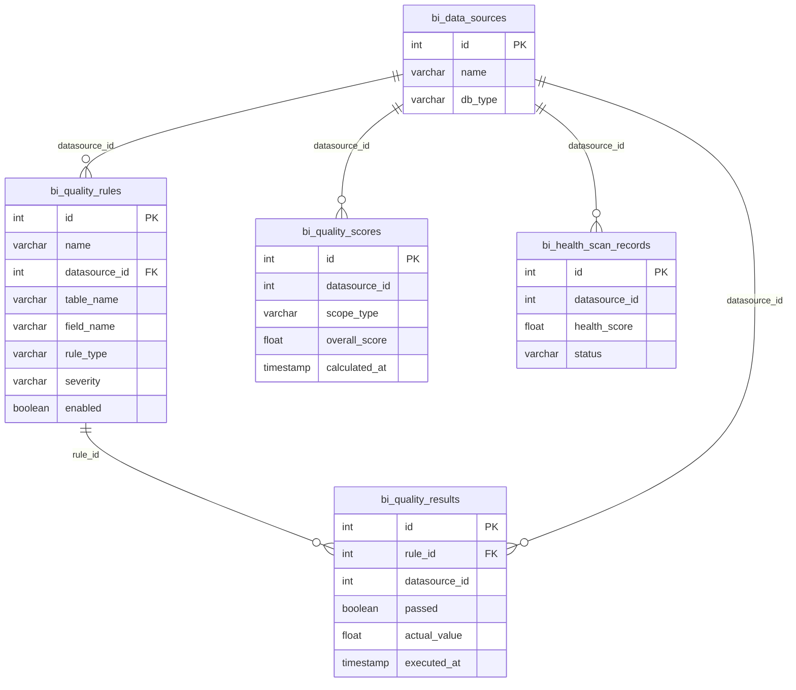
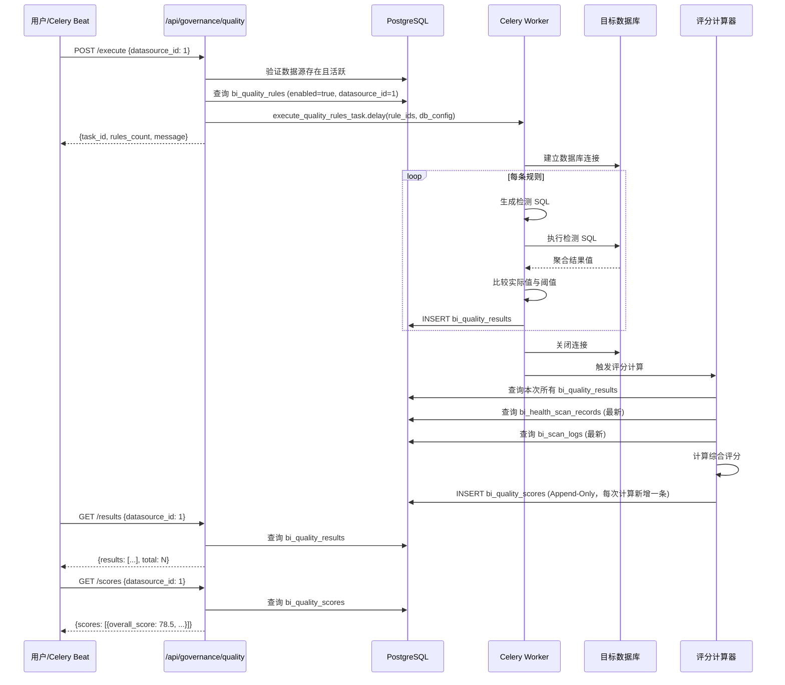
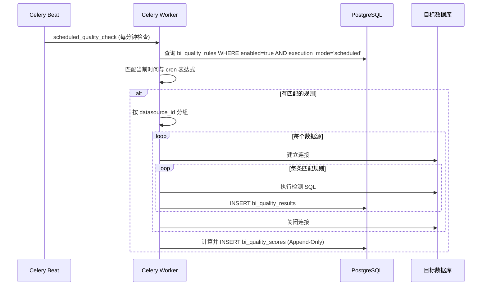

# 数据治理与质量监控技术规格书

> 版本：v1.1 | 状态：Draft | 日期：2026-04-05
>
> 变更记录：v1.1 修复 P0 级阻塞：评分趋势 Append-Only 重构、SQL 方言抽象约束、强制只读连接、大表熔断参数、数据生命周期策略

---

## 目录

1. [概述](#1-概述)
2. [数据模型](#2-数据模型)
3. [质量规则引擎](#3-质量规则引擎)
4. [API 设计](#4-api-设计)
5. [质量评分模型](#5-质量评分模型)
6. [质量看板](#6-质量看板)
7. [错误码](#7-错误码)
8. [安全](#8-安全)
9. [集成点](#9-集成点)
10. [时序图](#10-时序图)
11. [测试策略](#11-测试策略)
12. [开放问题](#12-开放问题)

---

## 1. 概述

### 1.1 目的

定义 Mulan BI 平台统一数据质量监控框架的完整技术规格。该框架提供可配置的质量规则引擎、自动化检测执行、统一评分体系和质量看板，整合平台已有的健康扫描（Spec 11）和 DDL 合规检查（Spec 06）能力，形成端到端的数据治理闭环。

### 1.2 范围

| 包含 | 不包含 |
|------|--------|
| 质量规则定义与 CRUD 管理 | 数据自动修复/清洗 |
| 规则引擎执行与调度 | 实时流式数据质量监控 |
| 检测结果存储与查询 | 跨平台数据血缘追踪 |
| 统一质量评分体系 | 数据脱敏/加密处理 |
| 质量看板（数据源/表/字段级） | 数据分类分级管理（独立模块） |
| 整合健康扫描 + DDL 合规结果 | CI/CD Pipeline 集成 |

> **与 Spec 11（数仓健康扫描）的边界说明**
>
> | 维度 | 本模块（Spec 15） | 数仓健康扫描（Spec 11） |
> |------|-----------------|----------------------|
> | 定位 | 治理聚合层：消费 Spec 11 / Spec 06 结果，叠加可配置业务规则，输出统一评分 | 独立扫描器：直连目标数据库，执行结构化健康检查 |
> | 规则管理 | 用户可在 UI 中定义/启停规则，支持权重调整 | 固定检查项（表结构、主键、统计信息等），不可配置 |
> | 执行方式 | 定时聚合 + 按需触发（Celery） | 异步 Celery 任务，独立 Worker |
> | 存储 | `bi_quality_rules` / `bi_quality_results` / `bi_quality_scores` | `bi_health_scan_records` / `bi_health_scan_issues` |
> | 调用关系 | 本模块**读取** Spec 11 的扫描结果作为输入之一；Spec 11 不调用本模块 | 独立运行，输出供 Spec 15 聚合 |

### 1.3 关联文档

| 文档 | 关联说明 |
|------|---------|
| [11-health-scan-spec.md](11-health-scan-spec.md) | 数仓健康扫描，质量评分输入源之一 |
| [06-ddl-compliance-spec.md](06-ddl-compliance-spec.md) | DDL 合规检查，质量评分输入源之一 |
| [03-data-model-overview.md](03-data-model-overview.md) | 规划表 bi_quality_rules / bi_quality_results 定义 |
| [05-datasource-management-spec.md](05-datasource-management-spec.md) | 数据源连接信息 |
| [01-error-codes-standard.md](01-error-codes-standard.md) | GOV 模块错误码注册 |
| [ARCHITECTURE.md](../ARCHITECTURE.md) | 整体架构与模块依赖 |

---

## 2. 数据模型

### 2.1 核心数据表

#### bi_quality_rules（质量规则定义）

| 列名 | 类型 | 约束 | 默认值 | 说明 |
|------|------|------|--------|------|
| id | INTEGER | PK, AUTO | - | 主键 |
| name | VARCHAR(256) | NOT NULL | - | 规则名称 |
| description | TEXT | NULLABLE | - | 规则描述 |
| datasource_id | INTEGER | NOT NULL, FK→bi_data_sources.id, INDEX | - | 关联数据源 |
| table_name | VARCHAR(128) | NOT NULL | - | 目标表名 |
| field_name | VARCHAR(128) | NULLABLE | - | 目标字段（NULL 表示表级规则） |
| rule_type | VARCHAR(32) | NOT NULL | - | 规则类型（见 3.1） |
| operator | VARCHAR(16) | NOT NULL | `'lte'` | 比较运算符：eq/ne/gt/gte/lt/lte/between |
| threshold | JSONB | NOT NULL | `'{}'` | 阈值配置 |
| severity | VARCHAR(16) | NOT NULL | `'MEDIUM'` | HIGH/MEDIUM/LOW |
| execution_mode | VARCHAR(16) | NOT NULL | `'scheduled'` | realtime/scheduled/manual |
| cron | VARCHAR(64) | NULLABLE | - | Cron 表达式（scheduled 模式） |
| custom_sql | TEXT | NULLABLE | - | 自定义 SQL（rule_type=custom_sql 时） |
| enabled | BOOLEAN | NOT NULL | `true` | 是否启用 |
| tags_json | JSONB | NULLABLE | - | 标签数组 |
| created_by | INTEGER | NOT NULL | - | 创建人 |
| updated_by | INTEGER | NULLABLE | - | 更新人 |
| created_at | TIMESTAMP | NOT NULL | `now()` | 创建时间 |
| updated_at | TIMESTAMP | NOT NULL | `now()` | 更新时间 |

#### bi_quality_results（质量检测结果）

> ⚠️ **数据生命周期与分区设计**
>
> 按以下场景估算：100 条规则 × 每小时执行 × 10 个数据源 × 365 天 ≈ 876 万行/年。
> **必须通过分区和清理策略控制数据量：**
> - **保留周期**：默认仅保留最近 **90 天**的明细数据（与趋势查询窗口匹配）。
> - **分区策略**：PostgreSQL 表按 `executed_at` DATE 进行月分区（`PARTITION BY RANGE (executed_at)`）。
> - **清理机制**：Celery 定时任务在每月 1 日凌晨执行 `DETACH` 并 `DROP` 超过 90 天的历史分区。
> - **分区命名**：`bi_quality_results_2026_04`、`bi_quality_results_2026_03` ...
> - **注意**：DROP 分区是 Metadata 操作，不走 B-Tree 删除，性能影响极小；但需在 DROP 前确认趋势 API 查询窗口不超过保留期。

| 列名 | 类型 | 约束 | 默认值 | 说明 |
|------|------|------|--------|------|
| id | INTEGER | PK, AUTO | - | 主键 |
| rule_id | INTEGER | NOT NULL, FK→bi_quality_rules.id, INDEX | - | 关联规则 |
| datasource_id | INTEGER | NOT NULL, INDEX | - | 数据源 ID（冗余） |
| table_name | VARCHAR(128) | NOT NULL | - | 表名（冗余） |
| field_name | VARCHAR(128) | NULLABLE | - | 字段名（冗余） |
| executed_at | TIMESTAMP | NOT NULL | `now()` | 执行时间（分区键） |
| passed | BOOLEAN | NOT NULL | - | 是否通过 |
| actual_value | FLOAT | NULLABLE | - | 实际检测值 |
| expected_value | VARCHAR(256) | NULLABLE | - | 期望值/阈值描述 |
| detail_json | JSONB | NULLABLE | - | 详细结果（采样数据、分布等） |
| execution_time_ms | INTEGER | NULLABLE | - | 执行耗时（毫秒） |
| error_message | TEXT | NULLABLE | - | 执行错误信息 |
| created_at | TIMESTAMP | NOT NULL | `now()` | 创建时间 |

#### bi_quality_scores（质量评分快照）

> ⚠️ **重要：Append-Only 设计**。每次评分计算后必须 INSERT 插入新记录，禁止 UPSERT 覆盖。
> 原因：§4.6 /scores/trend 和 §6.1 看板需要近 30 天历史趋势，覆盖更新会导致历史数据丢失。
> PostgreSQL 部署建议：表按 `calculated_at` DATE 或 TIMESTAMP 进行范围分区（PARTITION BY RANGE），
> 由 Celery 定时任务在月末 Drop 过期分区（默认保留 90 天）。

| 列名 | 类型 | 约束 | 默认值 | 说明 |
|------|------|------|--------|------|
| id | INTEGER | PK, AUTO | - | 主键 |
| datasource_id | INTEGER | NOT NULL, INDEX | - | 数据源 ID |
| scope_type | VARCHAR(16) | NOT NULL | - | datasource/table/field |
| scope_name | VARCHAR(256) | NOT NULL | - | 对象名称 |
| overall_score | FLOAT | NOT NULL | - | 综合评分 (0-100) |
| completeness_score | FLOAT | NULLABLE | - | 完整性维度评分 |
| consistency_score | FLOAT | NULLABLE | - | 一致性维度评分 |
| uniqueness_score | FLOAT | NULLABLE | - | 唯一性维度评分 |
| timeliness_score | FLOAT | NULLABLE | - | 时效性维度评分 |
| conformity_score | FLOAT | NULLABLE | - | 格式规范维度评分 |
| health_scan_score | FLOAT | NULLABLE | - | 健康扫描评分（来自 Spec 11） |
| ddl_compliance_score | FLOAT | NULLABLE | - | DDL 合规评分（来自 Spec 06） |
| detail_json | JSONB | NULLABLE | - | 评分明细 |
| calculated_at | TIMESTAMP | NOT NULL | `now()` | 计算时间（分区键） |

### 2.2 索引策略

| 表 | 索引名 | 列 | 类型 | 说明 |
|----|--------|-----|------|------|
| bi_quality_rules | ix_qr_ds_table | (datasource_id, table_name) | BTREE | 按数据源+表查询 |
| bi_quality_rules | ix_qr_enabled | enabled | BTREE | 启用规则过滤 |
| bi_quality_results | ix_qres_rule_exec | (rule_id, executed_at DESC) | BTREE | 按规则查历史 |
| bi_quality_results | ix_qres_ds_exec | (datasource_id, executed_at DESC) | BTREE | 按数据源查历史 |
| bi_quality_results | ix_qres_passed | passed | BTREE | 失败结果过滤 |
| bi_quality_scores | ix_qs_ds_scope | (datasource_id, scope_type, scope_name, calculated_at DESC) | BTREE | 评分查询（含时间排序） |
| bi_quality_scores | ix_qs_calc_at | calculated_at | BTREE | 时间范围查询 |
| bi_quality_scores | — | `calculated_at` DATE RANGE | PARTITION | 按月分区，用于历史数据清理 |

### 2.3 ER 关系图



---

## 3. 质量规则引擎

### 3.1 规则类型

| 类型标识 | 名称 | 说明 | 示例 |
|---------|------|------|------|
| `null_rate` | 完整性 - 空值率 | 检测字段空值比例是否超过阈值 | 字段 email 空值率 <= 5% |
| `not_null` | 完整性 - 非空检查 | 检测字段是否存在空值 | 字段 id 不允许为空 |
| `row_count` | 完整性 - 行数检查 | 检测表行数是否在预期范围内 | 表 orders 行数 >= 1000 |
| `duplicate_rate` | 唯一性 - 重复率 | 检测字段重复值比例 | 字段 order_no 重复率 <= 0% |
| `unique_count` | 唯一性 - 唯一值数 | 检测字段唯一值数量 | 字段 status 唯一值数 between 3-10 |
| `referential` | 一致性 - 引用完整性 | 检测外键字段值是否在参照表中存在 | orders.user_id 均存在于 users.id |
| `cross_field` | 一致性 - 跨字段一致性 | 检测字段间逻辑关系 | end_date >= start_date |
| `value_range` | 一致性 - 值域检查 | 检测字段值是否在合法范围 | age between 0-150 |
| `freshness` | 时效性 - 数据新鲜度 | 检测数据最近更新时间是否超过阈值 | 最新 update_time 不超过 24 小时 |
| `latency` | 时效性 - 延迟检查 | 检测数据到达延迟 | ETL 数据延迟 <= 2 小时 |
| `format_regex` | 格式规范 - 正则匹配 | 检测字段值是否匹配指定格式 | email 匹配 `^[\w.]+@[\w.]+$` |
| `enum_check` | 格式规范 - 枚举检查 | 检测字段值是否在允许的枚举范围内 | status in ('active', 'inactive', 'deleted') |
| `custom_sql` | 自定义 SQL | 用户自定义检测 SQL | 任意 SQL 返回通过/失败 |

### 3.2 规则定义 Schema

每种规则类型的 `threshold` 字段 JSON Schema：

> ⚠️ **大表熔断约束（强制）**
>
> 以下规则类型涉及全表扫描：`null_rate`、`duplicate_rate`、`unique_count`、`row_count`、`referential`。
> 必须在 `threshold` 中指定 `max_scan_rows`，当预估扫描行数超过该值时，检测任务记录警告日志（GOV_007 降级为警告）并跳过执行，不阻塞下游。
> `max_scan_rows` 默认值为 **1,000,000**（100 万行），管理员可按数据源容量在创建规则时调整。

```json
{
  "null_rate": {
    "max_rate": 0.05,
    "max_scan_rows": 1000000,
    "description": "超过 max_scan_rows 时记录警告，不执行检测"
  },
  "not_null": {
    "max_scan_rows": 1000000
  },
  "row_count": {
    "min": 1000,
    "max": null,
    "max_scan_rows": 1000000
  },
  "duplicate_rate": {
    "max_rate": 0.0,
    "max_scan_rows": 1000000
  },
  "unique_count": {
    "min": 3,
    "max": 10,
    "max_scan_rows": 1000000
  },
  "referential": {
    "ref_table": "users",
    "ref_field": "id",
    "max_scan_rows": 500000
  },
  "cross_field": {
    "expression": "end_date >= start_date",
    "related_fields": ["end_date", "start_date"]
  },
  "value_range": {
    "min": 0,
    "max": 150,
    "allow_null": true
  },
  "freshness": {
    "time_field": "update_time",
    "max_delay_hours": 24
  },
  "latency": {
    "time_field": "etl_load_time",
    "max_delay_hours": 2
  },
  "format_regex": {
    "pattern": "^[\\w.]+@[\\w.]+$",
    "allow_null": true
  },
  "enum_check": {
    "allowed_values": ["active", "inactive", "deleted"],
    "allow_null": false
  },
  "custom_sql": {
    "description": "SQL 须返回单行单列，值为 0(通过) 或非 0(失败)"
  }
}
```

### 3.3 执行调度

#### 调度模式

| 模式 | 说明 | 实现方式 |
|------|------|---------|
| `manual` | 手动触发 | 用户通过 API 手动执行 |
| `scheduled` | 定时调度 | Celery Beat + Cron 表达式 |
| `realtime` | 规划中 | 预留，v1.0 不实现 |

#### 执行流程

1. Celery Beat 按 Cron 表达式触发 `execute_quality_rules_task`
2. Worker 加载当前调度周期内所有 enabled=true 的规则
3. 按 datasource_id 分组，复用数据库连接
4. 逐条执行检测 SQL，写入 bi_quality_results
5. 全部规则执行完毕后，触发评分计算任务

#### 执行 SQL 生成规范

> ⚠️ **强制约束：禁止硬编码原生 SQL 字符串**
>
> 平台须支持 MySQL / SQL Server / PostgreSQL / ClickHouse / Oracle / 达梦 等多种数据库方言。
> 所有检测 SQL 必须通过 SQL Builder（如 SQLAlchemy Core 或 PyPika）生成，动态适配目标数据库方言。
> **严禁在代码中硬拼接原生 SQL 字符串**，否则 MySQL/SQL Server 等非 PostgreSQL 数据库将直接崩溃。

**SQL Builder 实现要求：**

| 规则类型 | 必须使用的 SQLAlchemy Core 原语 | 跨方言兼容说明 |
|---------|-------------------------------|-------------|
| null_rate | `func.count().filter(col.is_(None)) / func.count()` | ✅ 全方言 |
| duplicate_rate | `1.0 - func.count(func.distinct(col)) / func.count()` | ✅ 全方言 |
| freshness | `func.now() - func.max(col)` | ⚠️ PostgreSQL `EXTRACT(EPOCH FROM ...)` 仅 PG 支持，需用 dialect-specific 函数 |
| row_count | `func.count()` | ✅ 全方言 |
| referential | `NOT EXISTS (SELECT 1 FROM ref_table WHERE ...)` | ✅ 全方言 |
| value_range | `func.max(col), func.min(col)` | ✅ 全方言 |
| custom_sql | **禁止直接执行用户输入的原生 SQL** | 见 §8.2 安全约束 |

**freshness 规则跨方言时间差计算（示例伪代码）：**

```python
from sqlalchemy import text
from sqlalchemy.dialects import postgresql, mysql, mssql

# PostgreSQL
pg_expr = func.extract('EPOCH', func.now() - col) / 3600.0

# MySQL（TIMESTAMPDIFF）
mysql_expr = func.timestampdiff(text('HOUR'), col, func.now())

# SQL Server（DATEDIFF）
mssql_expr = func.datediff(text('HOUR'), col, func.now())

# 实际执行时根据 bi_data_sources.db_type 动态选择方言
dialect = get_dialect(ds.db_type)
sql = select([dialect_expr]).select_from(table)
```

**custom_sql 规则：**
直接执行用户定义的 SQL，读取第一行第一列结果，0 表示通过，非 0 表示失败。
**custom_sql 规则仅在强制只读连接下执行（见 §8.2），且须通过 §8.2 的黑名单 + 权限双重约束。**

---

## 4. API 设计

### 4.1 端点总览 (`/api/governance/quality`)

| Method | Path | Auth | 说明 |
|--------|------|------|------|
| POST | `/rules` | admin/data_admin | 创建质量规则 |
| GET | `/rules` | 已认证 | 规则列表（支持筛选） |
| GET | `/rules/{id}` | 已认证 | 规则详情 |
| PUT | `/rules/{id}` | admin/data_admin | 更新规则 |
| DELETE | `/rules/{id}` | admin/data_admin | 删除规则 |
| PUT | `/rules/{id}/toggle` | admin/data_admin | 启用/禁用规则 |
| POST | `/execute` | admin/data_admin | 手动执行检测 |
| POST | `/execute/rule/{id}` | admin/data_admin | 执行单条规则 |
| GET | `/results` | 已认证 | 检测结果列表 |
| GET | `/results/latest` | 已认证 | 各规则最新结果 |
| GET | `/scores` | 已认证 | 质量评分查询 |
| GET | `/scores/trend` | 已认证 | 评分趋势 |
| GET | `/dashboard` | 已认证 | 质量看板数据 |

### 4.2 POST /rules -- 创建质量规则

**请求体：**
```json
{
  "name": "订单表邮箱空值率检查",
  "description": "检测 orders 表 email 字段空值率不超过 5%",
  "datasource_id": 1,
  "table_name": "orders",
  "field_name": "email",
  "rule_type": "null_rate",
  "operator": "lte",
  "threshold": {
    "max_rate": 0.05
  },
  "severity": "HIGH",
  "execution_mode": "scheduled",
  "cron": "0 6 * * *",
  "tags_json": ["核心表", "邮箱质量"]
}
```

**响应 (201)：**
```json
{
  "rule": {
    "id": 1,
    "name": "订单表邮箱空值率检查",
    "datasource_id": 1,
    "table_name": "orders",
    "field_name": "email",
    "rule_type": "null_rate",
    "operator": "lte",
    "threshold": {"max_rate": 0.05},
    "severity": "HIGH",
    "execution_mode": "scheduled",
    "cron": "0 6 * * *",
    "enabled": true,
    "tags_json": ["核心表", "邮箱质量"],
    "created_by": 1,
    "created_at": "2026-04-04T10:00:00"
  },
  "message": "质量规则创建成功"
}
```

### 4.3 POST /execute -- 手动执行检测

**请求体：**
```json
{
  "datasource_id": 1,
  "table_name": "orders",
  "rule_ids": [1, 2, 3]
}
```

所有参数均为可选。不指定时执行所有启用的规则。`rule_ids` 可用于执行指定规则子集。

**响应 (200)：**
```json
{
  "task_id": "celery-task-uuid",
  "rules_count": 3,
  "message": "质量检测已启动"
}
```

### 4.4 GET /results -- 检测结果列表

**Query Params：** `datasource_id`(可选), `rule_id`(可选), `passed`(可选, true/false), `start_date`(可选), `end_date`(可选), `page`(默认1), `page_size`(默认20)

**响应：**
```json
{
  "results": [
    {
      "id": 101,
      "rule_id": 1,
      "rule_name": "订单表邮箱空值率检查",
      "datasource_id": 1,
      "table_name": "orders",
      "field_name": "email",
      "executed_at": "2026-04-04T06:00:00",
      "passed": false,
      "actual_value": 0.082,
      "expected_value": "<= 0.05",
      "severity": "HIGH",
      "execution_time_ms": 1250,
      "detail_json": {
        "total_rows": 100000,
        "null_count": 8200,
        "sample_nulls": ["row_id: 1023", "row_id: 5678"]
      }
    }
  ],
  "total": 1,
  "page": 1,
  "page_size": 20
}
```

### 4.5 GET /scores -- 质量评分查询

**Query Params：** `datasource_id`(必选), `scope_type`(可选, datasource/table/field), `scope_name`(可选)

**响应：**
```json
{
  "scores": [
    {
      "datasource_id": 1,
      "scope_type": "datasource",
      "scope_name": "生产数据库",
      "overall_score": 78.5,
      "completeness_score": 82.0,
      "consistency_score": 75.0,
      "uniqueness_score": 95.0,
      "timeliness_score": 70.0,
      "conformity_score": 80.0,
      "health_scan_score": 72.0,
      "ddl_compliance_score": 85.0,
      "calculated_at": "2026-04-04T06:30:00"
    }
  ]
}
```

### 4.6 GET /scores/trend -- 评分趋势

**Query Params：** `datasource_id`(必选), `scope_type`(可选), `scope_name`(可选), `days`(默认30)

**响应：**
```json
{
  "trend": [
    {"date": "2026-03-05", "overall_score": 72.0},
    {"date": "2026-03-06", "overall_score": 74.5},
    {"date": "2026-04-04", "overall_score": 78.5}
  ],
  "datasource_id": 1,
  "scope_type": "datasource",
  "days": 30
}
```

---

## 5. 质量评分模型

### 5.1 评分体系概述

统一评分体系整合三大评分输入源，计算 0-100 分的综合质量评分：

| 输入源 | 来源模块 | 权重 | 说明 |
|--------|---------|------|------|
| 质量规则检测 | 本模块 | 50% | 基于规则通过率 |
| 健康扫描 | Spec 11 | 30% | bi_health_scan_records.health_score |
| DDL 合规 | Spec 06 | 20% | bi_scan_logs 最近一次扫描评分 |

### 5.2 质量规则维度权重

质量规则检测评分按 5 个维度分别计算后加权汇总：

| 维度 | 权重 | 对应规则类型 |
|------|------|-------------|
| 完整性 (Completeness) | 30% | null_rate, not_null, row_count |
| 一致性 (Consistency) | 25% | referential, cross_field, value_range |
| 唯一性 (Uniqueness) | 20% | duplicate_rate, unique_count |
| 时效性 (Timeliness) | 15% | freshness, latency |
| 格式规范 (Conformity) | 10% | format_regex, enum_check |

### 5.3 评分计算算法

```python
def calculate_dimension_score(results: List[QualityResult], rule_type_group: List[str]) -> float:
    """计算单个维度评分"""
    dimension_results = [r for r in results if r.rule_type in rule_type_group]
    if not dimension_results:
        return 100.0  # 无规则时默认满分

    # 按严重级别加权
    severity_weights = {"HIGH": 3.0, "MEDIUM": 2.0, "LOW": 1.0}
    total_weight = 0.0
    weighted_pass = 0.0

    for r in dimension_results:
        w = severity_weights.get(r.severity, 1.0)
        total_weight += w
        if r.passed:
            weighted_pass += w

    return (weighted_pass / total_weight) * 100.0


def calculate_quality_score(
    rule_results: List[QualityResult],
    health_scan_score: Optional[float],
    ddl_compliance_score: Optional[float],
) -> dict:
    """计算综合质量评分"""
    # 维度评分
    completeness = calculate_dimension_score(rule_results, ["null_rate", "not_null", "row_count"])
    consistency = calculate_dimension_score(rule_results, ["referential", "cross_field", "value_range"])
    uniqueness = calculate_dimension_score(rule_results, ["duplicate_rate", "unique_count"])
    timeliness = calculate_dimension_score(rule_results, ["freshness", "latency"])
    conformity = calculate_dimension_score(rule_results, ["format_regex", "enum_check"])

    # 规则维度加权
    rule_score = (
        completeness * 0.30
        + consistency * 0.25
        + uniqueness * 0.20
        + timeliness * 0.15
        + conformity * 0.10
    )

    # 综合评分（整合健康扫描 + DDL 合规）
    components = [(rule_score, 0.50)]
    remaining_weight = 0.50

    if health_scan_score is not None:
        components.append((health_scan_score, 0.30))
        remaining_weight -= 0.30

    if ddl_compliance_score is not None:
        components.append((ddl_compliance_score, 0.20))
        remaining_weight -= 0.20

    # 未集成的输入源权重回归到规则评分
    if remaining_weight > 0:
        components[0] = (rule_score, 0.50 + remaining_weight)

    overall = sum(score * weight for score, weight in components)
    overall = max(0.0, min(100.0, overall))

    return {
        "overall_score": round(overall, 1),
        "completeness_score": round(completeness, 1),
        "consistency_score": round(consistency, 1),
        "uniqueness_score": round(uniqueness, 1),
        "timeliness_score": round(timeliness, 1),
        "conformity_score": round(conformity, 1),
        "health_scan_score": health_scan_score,
        "ddl_compliance_score": ddl_compliance_score,
    }
```

### 5.4 评分等级

| 等级 | 分数范围 | 颜色 | 说明 |
|------|---------|------|------|
| 优秀 | >= 90 | 绿色 | 数据质量优秀 |
| 良好 | >= 75 | 蓝色 | 数据质量良好，有改进空间 |
| 一般 | >= 60 | 黄色 | 数据质量一般，需要关注 |
| 较差 | < 60 | 红色 | 数据质量较差，需要立即处理 |

---

## 6. 质量看板

### 6.1 数据源级概览

**GET /api/governance/quality/dashboard**

展示内容：
- 所有数据源的综合质量评分排名
- 每个数据源的五维雷达图（完整性/一致性/唯一性/时效性/格式规范）
- 质量趋势折线图（近 30 天）
- 失败规则 TOP 10 列表

**响应结构：**
```json
{
  "summary": {
    "total_datasources": 5,
    "avg_score": 78.5,
    "rules_total": 120,
    "rules_passed": 98,
    "rules_failed": 22
  },
  "datasource_scores": [
    {
      "datasource_id": 1,
      "datasource_name": "生产数据库",
      "overall_score": 82.0,
      "trend": "up",
      "failed_rules_count": 3
    }
  ],
  "top_failures": [
    {
      "rule_id": 5,
      "rule_name": "用户表手机号格式检查",
      "datasource_name": "生产数据库",
      "table_name": "users",
      "consecutive_failures": 7,
      "severity": "HIGH"
    }
  ]
}
```

### 6.2 表级质量概览

通过 `scope_type=table` 查询 bi_quality_scores，展示：
- 表级综合评分
- 该表下所有字段规则的通过/失败统计
- 最近 N 次检测结果时间线

### 6.3 字段级质量概览

通过 `scope_type=field` 查询 bi_quality_scores，展示：
- 字段级各维度评分
- 历史检测值趋势（如空值率随时间变化）
- 关联规则列表及最新检测状态

---

## 7. 错误码

| 错误码 | HTTP | 描述 |
|--------|------|------|
| GOV_001 | 404 | 质量规则不存在 |
| GOV_002 | 400 | 规则定义无效（参数校验失败） |
| GOV_003 | 400 | 不支持的规则类型 |
| GOV_004 | 400 | Cron 表达式格式无效 |
| GOV_005 | 400 | 自定义 SQL 语法错误 |
| GOV_006 | 409 | 同一数据源+表+字段+规则类型已存在相同规则 |
| GOV_007 | 502 | 目标数据库执行检测 SQL 超时 |
| GOV_008 | 502 | 目标数据库连接失败 |
| GOV_009 | 404 | 检测结果不存在 |
| GOV_010 | 400 | 数据源不存在或未激活 |
| GOV_011 | 409 | 检测任务正在执行中 |

---

## 8. 安全

### 8.1 认证与授权

| 接口 | 最低权限 |
|------|----------|
| POST /api/governance/quality/rules | admin 或 data_admin |
| PUT /api/governance/quality/rules/{id} | admin 或 data_admin |
| DELETE /api/governance/quality/rules/{id} | admin 或 data_admin |
| PUT /api/governance/quality/rules/{id}/toggle | admin 或 data_admin |
| POST /api/governance/quality/execute | admin 或 data_admin |
| POST /api/governance/quality/execute/rule/{id} | admin 或 data_admin |
| GET /api/governance/quality/rules | 已认证（analyst 及以上） |
| GET /api/governance/quality/results | 已认证（analyst 及以上） |
| GET /api/governance/quality/scores | 已认证（analyst 及以上） |
| GET /api/governance/quality/dashboard | 已认证（analyst 及以上） |

### 8.2 自定义 SQL 安全

> ⚠️ **黑名单只是辅助防护线，不能依赖黑名单作为唯一安全手段。**

- **强制只读连接（第一防护线）**：检测任务执行时，必须从 `bi_data_sources` 获取的数据库连接凭证中，**强制要求目标数据库账号具备 Read-Only 权限**。连接字符串须在目标数据库中显式验证 `pg_roles.rolreplication = false`（PostgreSQL）或对应 DB 的只读角色。**"如可用"改为"必须"，这是强制要求。**
- **黑名单关键字检测（第二防护线）**：即使有只读账号，自定义 SQL 仍须通过白名单关键字检测，仅允许 `SELECT` 语句。
  - **禁止关键字**：`INSERT`, `UPDATE`, `DELETE`, `DROP`, `ALTER`, `CREATE`, `TRUNCATE`, `EXEC`, `EXECUTE`, `GRANT`, `REVOKE`, `COPY`, `pg_read_file`, `pg_execute_server_program`。
  - 正则检测可被 `/**/INSERT`（注释插入）、`se Lect`（大小写混淆）等变形绕过，禁止作为唯一防护。
- **执行超时**：单条 SQL 执行超时限制为 60 秒（GOV_007）。
- **参数化查询**：表名/字段名通过 SQL Builder 程序构造，不拼接用户输入。
- **连接隔离**：检测使用独立只读数据库连接；禁止在检测连接中执行事务（`BEGIN`/`COMMIT`）。
- **PostgreSQL 额外约束**：在只读账号上执行 `ALTER USER xxx SET default_transaction_read_only = ON;`，并在连接参数中传递 `default_transaction_read_only=true`，防止 `COPY` 或 Server-side Program Execution 泄露数据。

### 8.3 数据安全

- 检测 SQL 不返回原始数据行，仅返回聚合统计值
- `detail_json` 中的采样数据最多保留 10 条记录
- 检测不修改目标数据库（只读操作）
- 数据源密码解密仅在 Celery Worker 进程内存中

### 8.4 IDOR 保护

- 创建规则时验证 `datasource_id` 对应数据源存在且 `is_active=true`
- 非 admin 用户仅能为 `owner_id == user.id` 的数据源创建规则
- 查看结果：analyst 及以上角色可查看所有数据源的质量数据

---

## 9. 集成点

### 9.1 内部集成

| 方向 | 对象 | 方式 | 说明 |
|------|------|------|------|
| 依赖 | bi_data_sources | FK + SQLAlchemy | 获取数据源连接凭证和元数据 |
| 依赖 | Celery + Redis | 异步任务 | 规则调度执行 |
| 依赖 | DATASOURCE_ENCRYPTION_KEY | 环境变量 | 解密数据源密码 |
| 消费 | bi_health_scan_records | SQL 查询 | 读取最新健康扫描评分（Spec 11） |
| 消费 | bi_scan_logs | SQL 查询 | 读取最新 DDL 合规扫描评分（Spec 06） |
| 被消费 | 前端质量看板 | REST API | 展示质量评分、趋势和问题 |
| 被消费 | bi_events（规划中） | 内部事件 | 检测失败时发送通知事件 |

### 9.2 健康扫描集成（Spec 11）

从 bi_health_scan_records 读取最新扫描结果：

```sql
SELECT health_score
FROM bi_health_scan_records
WHERE datasource_id = :ds_id
  AND status = 'success'
ORDER BY id DESC
LIMIT 1
```

将 `health_score` 作为健康扫描维度输入综合评分（权重 30%）。

### 9.3 DDL 合规集成（Spec 06）

从 bi_scan_logs 读取最新扫描结果：

```sql
SELECT
  100 - (error_count * 20 + warning_count * 5 + info_count * 1) AS ddl_score
FROM bi_scan_logs
WHERE database_name = :db_name
  AND status = 'completed'
ORDER BY id DESC
LIMIT 1
```

将计算得到的 DDL 合规评分作为 DDL 维度输入综合评分（权重 20%）。

### 9.4 Tableau 资产完整性

规划中的集成，用于检查 Tableau 资产与底层数据源的一致性：

| 检查项 | 说明 |
|--------|------|
| 数据源字段覆盖度 | Tableau 字段是否均有语义标注 |
| 资产健康评分 | tableau_assets.health_score |
| 发布状态完整性 | 语义是否均已发布到 Tableau |

---

## 10. 时序图

### 10.1 质量检测执行流程



### 10.2 定时调度流程



---

## 11. 测试策略

### 11.1 单元测试

| 测试范围 | 测试目标 | 关键用例 |
|----------|----------|----------|
| SQL 生成器 | 各规则类型 SQL 正确性 | null_rate/duplicate_rate/freshness 等 13 种规则类型的 SQL 生成 |
| 阈值比较 | operator 逻辑正确性 | eq/ne/gt/gte/lt/lte/between 所有运算符 |
| 评分计算 | 维度评分与综合评分 | 全部通过(100分)、全部失败(0分)、混合场景、无规则时默认满分 |
| 评分整合 | 健康扫描/DDL 合规整合 | 三输入源均有值、部分缺失时权重回归 |
| 自定义 SQL 校验 | SQL 安全检查 | SELECT 通过、INSERT/DELETE/DROP 拦截 |
| Cron 解析 | 表达式有效性 | 合法 cron、非法 cron、边界值 |

### 11.2 集成测试

| 测试范围 | 测试目标 |
|----------|----------|
| POST /rules | 创建规则端到端，参数校验、重复检测 |
| PUT /rules/{id} | 更新规则，不可变字段保护 |
| DELETE /rules/{id} | 删除规则及级联删除结果 |
| POST /execute | 手动触发检测，结果正确写入 |
| GET /results | 按条件过滤结果，分页正确 |
| GET /scores | 评分查询，维度评分齐全 |
| GET /dashboard | 看板数据完整性 |
| 权限测试 | analyst 不能创建/删除规则，user 角色无法访问 |
| IDOR 测试 | 非所有者不能为他人数据源创建规则 |

### 11.3 性能测试

| 场景 | 预期 |
|------|------|
| 100 条规则并发执行 | 总耗时 < 5 分钟 |
| 大表（1000 万行）空值率检测 | 单规则 < 30 秒 |
| 评分计算（100 条规则结果） | < 2 秒 |
| 看板查询（50 个数据源） | < 3 秒 |

### 11.4 测试数据

**合规数据源场景：** 所有规则通过，综合评分 100 分。

**问题数据源场景：**
- email 空值率 15%（HIGH 级 null_rate 规则失败）
- order_no 重复率 2%（MEDIUM 级 duplicate_rate 规则失败）
- 数据延迟 48 小时（HIGH 级 freshness 规则失败）
- 预期综合评分 < 60 分

---

## 12. 开放问题

| # | 问题 | 影响范围 | 优先级 | 状态 |
|---|------|---------|--------|------|
| 1 | custom_sql 规则是否需要沙箱隔离执行（防止资源耗尽） | 安全 | P1 | 待讨论 |
| 2 | 评分维度权重是否支持管理员自定义配置 | 灵活性 | P2 | 规划中 |
| 3 | 检测失败是否需要触发告警通知（邮件/Webhook） | 运维 | P1 | 规划中 |
| ~~4~~ | ~~大表检测是否支持采样模式~~ | ~~性能~~ | ~~P2~~ | **已解决**：§3.2 threshold 新增 `max_scan_rows` 强制熔断参数，§3.2 JSON Schema 已更新 |
| 5 | realtime 模式的实现方案（CDC / 触发器 / 定时轮询） | 架构 | P3 | 待讨论 |
| 6 | 质量规则是否支持模板化（一键为新表创建标准规则集） | 易用性 | P2 | 规划中 |
| ~~7~~ | ~~bi_quality_results 历史数据的保留策略和归档机制~~ | ~~存储~~ | ~~P2~~ | **已解决**：§2.1 明确默认保留 90 天，PostgreSQL 按月分区，Celery 定时 Drop 过期分区 |
| 8 | Tableau 资产完整性检查的具体实现方案和集成时间点 | 集成 | P3 | 规划中 |
| 9 | 是否需要支持跨数据源的关联质量规则（如 A 库与 B 库数据一致性） | 功能覆盖 | P3 | 待讨论 |
| ~~10~~ | ~~评分快照 bi_quality_scores 是否需要保留历史记录~~ | ~~趋势分析~~ | ~~P2~~ | **已解决**：§2.1 明确 Append-Only 写入，每次评分计算新增一条，趋势 API 按 calculated_at 聚合 |
