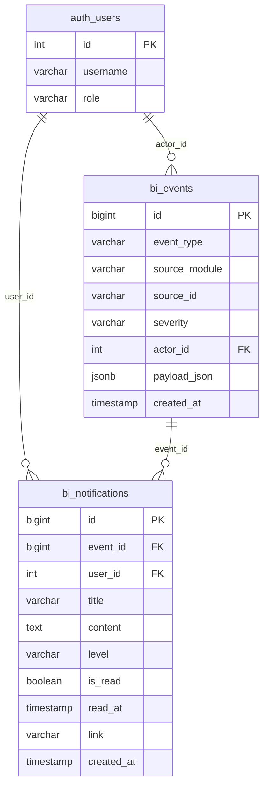
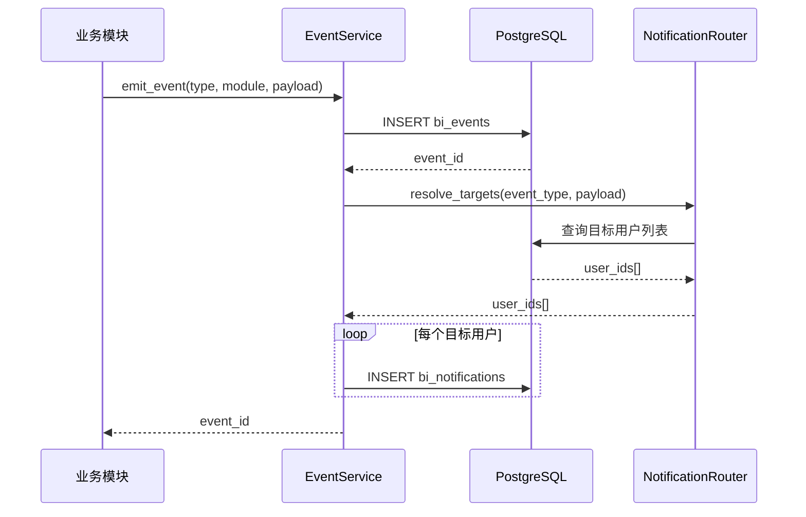
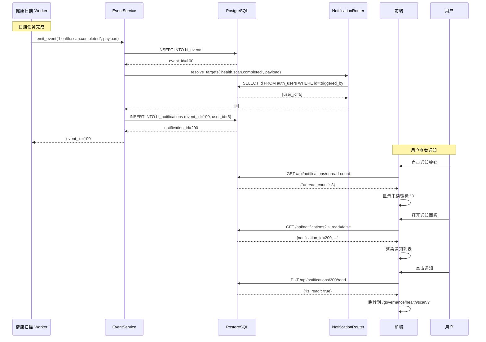
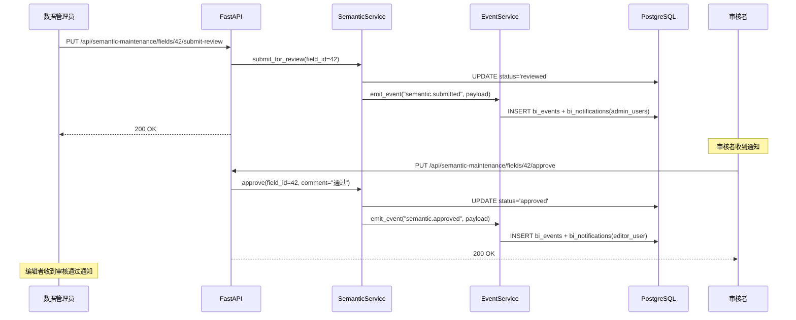

# 事件与通知系统规格书

> **Version:** v1.0
> **Date:** 2026-04-04
> **Status:** Draft
> **Owner:** Mulan BI Platform Team

---

## 1. 概述

### 1.1 目的

Mulan BI Platform 当前各模块（Tableau 同步、语义治理、健康扫描等）的关键状态变更缺乏统一的事件通知机制。用户无法在第一时间感知异步任务完成、审批流转、系统异常等重要事件。

本规格书定义一套**统一事件总线 + 通知系统**，解决以下问题：

- 各模块事件分散，缺乏统一采集和分发机制
- 用户需要主动轮询才能获知异步任务结果
- 跨模块联动（如"扫描完成后触发通知"）依赖硬编码

### 1.2 范围

| 包含 | 不包含 |
|------|--------|
| 事件数据模型与存储 | 实时推送（WebSocket，规划中） |
| 事件发布/订阅总线 | 第三方集成（钉钉/企微/Slack） |
| 站内通知 CRUD API | 通知模板管理 UI |
| 邮件通知（规划中） | 短信通知 |
| Webhook 出站（规划中） | 事件溯源（Event Sourcing） |

### 1.3 关联文档

| 文档 | 关联点 |
|------|--------|
| [01-error-codes-standard.md](01-error-codes-standard.md) | EVT 前缀错误码 |
| [03-data-model-overview.md](03-data-model-overview.md) | `bi_events` 规划表 |
| [07-tableau-mcp-v1-spec.md](07-tableau-mcp-v1-spec.md) | Tableau 同步事件源 |
| [09-semantic-maintenance-spec.md](09-semantic-maintenance-spec.md) | 语义审批事件源 |
| [11-health-scan-spec.md](11-health-scan-spec.md) | 健康扫描事件源 |
| [ARCHITECTURE.md](../ARCHITECTURE.md) | Celery/Redis 基础设施 |

---

## 2. 数据模型

### 2.1 `bi_events` — 事件存储表

基于 [03-data-model-overview.md](03-data-model-overview.md) 第 7 节规划表扩展设计。

| 列 | 类型 | 约束 | 默认值 | 说明 |
|----|------|------|--------|------|
| id | BIGINT | PK, AUTO | - | 主键（使用 BIGINT 支持高频写入） |
| event_type | VARCHAR(64) | NOT NULL, INDEX | - | 事件类型（见 §3） |
| source_module | VARCHAR(32) | NOT NULL | - | 来源模块：`tableau`, `semantic`, `health`, `auth`, `system` |
| source_id | VARCHAR(128) | NULLABLE | - | 来源对象标识（支持字符串 ID） |
| severity | VARCHAR(16) | NOT NULL | `'info'` | `info` / `warning` / `error` |
| actor_id | INTEGER | NULLABLE, FK→auth_users.id | - | 触发者用户 ID（系统事件为 NULL） |
| payload_json | JSONB | NOT NULL | `'{}'` | 事件载荷数据 |
| created_at | TIMESTAMP | NOT NULL, INDEX | `now()` | 事件发生时间 |

**索引策略：**

| 索引名 | 列 | 类型 | 说明 |
|--------|-----|------|------|
| ix_events_type_created | (event_type, created_at DESC) | BTREE | 按类型查询最近事件 |
| ix_events_source | (source_module, source_id) | BTREE | 按来源对象查询 |
| ix_events_created | created_at | BTREE | 时间范围查询、过期清理 |

### 2.2 `bi_notifications` — 用户通知表

| 列 | 类型 | 约束 | 默认值 | 说明 |
|----|------|------|--------|------|
| id | BIGINT | PK, AUTO | - | 主键 |
| event_id | BIGINT | NOT NULL, FK→bi_events.id | - | 关联事件 |
| user_id | INTEGER | NOT NULL, FK→auth_users.id, INDEX | - | 目标用户 |
| title | VARCHAR(256) | NOT NULL | - | 通知标题 |
| content | TEXT | NOT NULL | - | 通知内容（纯文本） |
| level | VARCHAR(16) | NOT NULL | `'info'` | `info` / `warning` / `error` / `success` |
| is_read | BOOLEAN | NOT NULL | `false` | 是否已读 |
| read_at | TIMESTAMP | NULLABLE | - | 阅读时间 |
| link | VARCHAR(512) | NULLABLE | - | 跳转链接（前端路由路径） |
| created_at | TIMESTAMP | NOT NULL, INDEX | `now()` | 创建时间 |

**索引策略：**

| 索引名 | 列 | 类型 | 说明 |
|--------|-----|------|------|
| ix_notif_user_read_created | (user_id, is_read, created_at DESC) | BTREE | 用户通知列表查询（核心索引） |
| ix_notif_event | event_id | BTREE | 按事件反查通知 |

### 2.3 ER 关系图



---

## 3. 事件定义

### 3.1 事件类型枚举

事件类型采用 `{module}.{object}.{action}` 命名约定。

| 事件类型 | 来源模块 | 严重级别 | 说明 |
|----------|----------|----------|------|
| `tableau.sync.completed` | tableau | info | Tableau 资产同步成功完成 |
| `tableau.sync.failed` | tableau | error | Tableau 资产同步失败 |
| `tableau.connection.tested` | tableau | info | Tableau 连接测试完成 |
| `semantic.submitted` | semantic | info | 语义标注提交审核 |
| `semantic.approved` | semantic | info | 语义标注审核通过 |
| `semantic.rejected` | semantic | warning | 语义标注审核驳回 |
| `semantic.published` | semantic | info | 语义标注发布到 Tableau |
| `semantic.publish_failed` | semantic | error | 语义发布失败 |
| `semantic.rollback` | semantic | warning | 语义版本回滚 |
| `semantic.ai_generated` | semantic | info | AI 语义生成完成 |
| `health.scan.completed` | health | info | 健康扫描完成 |
| `health.scan.failed` | health | error | 健康扫描失败 |
| `health.score.dropped` | health | warning | 健康分下降超过阈值 |
| `auth.user.login` | auth | info | 用户登录 |
| `auth.user.created` | auth | info | 新用户创建 |
| `auth.user.role_changed` | auth | warning | 用户角色变更 |
| `system.maintenance` | system | warning | 系统维护通知 |
| `system.error` | system | error | 系统级错误 |

### 3.2 事件 Payload Schema

每种事件类型的 `payload_json` 遵循以下结构约定：

#### `tableau.sync.completed`

```json
{
  "connection_id": 1,
  "connection_name": "Production Tableau",
  "duration_sec": 45,
  "workbooks_synced": 12,
  "views_synced": 38,
  "datasources_synced": 5,
  "assets_deleted": 2
}
```

#### `tableau.sync.failed`

```json
{
  "connection_id": 1,
  "connection_name": "Production Tableau",
  "error_message": "PAT 认证失败",
  "error_code": "TAB_003"
}
```

#### `semantic.approved` / `semantic.rejected`

```json
{
  "object_type": "field",
  "object_id": 42,
  "object_name": "sales_amount",
  "connection_id": 1,
  "reviewer_id": 3,
  "reviewer_name": "admin",
  "comment": "审批意见"
}
```

#### `semantic.published`

```json
{
  "object_type": "datasource",
  "object_id": 10,
  "object_name": "Superstore",
  "connection_id": 1,
  "publish_log_id": 55,
  "fields_published": 8
}
```

#### `health.scan.completed`

```json
{
  "scan_id": 7,
  "datasource_id": 3,
  "datasource_name": "DW Production",
  "health_score": 72.5,
  "total_issues": 15,
  "high_count": 3,
  "medium_count": 7,
  "low_count": 5
}
```

#### `health.score.dropped`

```json
{
  "scan_id": 7,
  "datasource_id": 3,
  "datasource_name": "DW Production",
  "previous_score": 85.0,
  "current_score": 72.5,
  "drop_amount": 12.5
}
```

#### `auth.user.role_changed`

```json
{
  "target_user_id": 5,
  "target_username": "zhangsan",
  "old_role": "user",
  "new_role": "analyst"
}
```

---

## 4. 事件总线

### 4.1 架构选型

基于现有基础设施（Redis 7 + Celery），采用 **Celery Signal + 内部发布函数** 模式：

- **Phase 1（当前）**：同步写入 `bi_events` 表 + 同步创建通知记录
- **Phase 2（规划）**：通过 Redis PubSub 异步分发，解耦事件生产与消费

选择理由：
- 项目已使用 Redis + Celery，无需引入额外中间件
- Phase 1 的同步模式足够满足当前并发需求（<100 QPS）
- 升级到 Phase 2 时仅需替换 `emit_event` 内部实现，调用方无感

### 4.2 事件发射接口

```python
# backend/services/events/event_service.py

from typing import Optional
from datetime import datetime
from sqlalchemy.orm import Session


def emit_event(
    db: Session,
    event_type: str,
    source_module: str,
    payload: dict,
    *,
    source_id: Optional[str] = None,
    severity: str = "info",
    actor_id: Optional[int] = None,
) -> int:
    """
    发射一个事件。

    1. 写入 bi_events 表
    2. 根据事件类型和路由规则，创建 bi_notifications 记录
    3. 返回事件 ID

    Args:
        db: SQLAlchemy Session
        event_type: 事件类型，如 "tableau.sync.completed"
        source_module: 来源模块，如 "tableau"
        payload: 事件载荷 dict
        source_id: 来源对象标识
        severity: 严重级别 info/warning/error
        actor_id: 触发者用户 ID

    Returns:
        新创建的事件 ID
    """
    ...
```

### 4.3 通知路由规则

事件创建后，由通知路由器决定通知哪些用户：

| 事件类型 | 通知目标 | 通知级别 |
|----------|----------|----------|
| `tableau.sync.completed` | 连接所有者 | info |
| `tableau.sync.failed` | 连接所有者 + 所有 admin | error |
| `semantic.submitted` | 所有 admin + data_admin(reviewer) | info |
| `semantic.approved` | 语义创建者 | success |
| `semantic.rejected` | 语义创建者 | warning |
| `semantic.published` | 语义创建者 + 所有 admin | success |
| `semantic.publish_failed` | 语义创建者 + 所有 admin | error |
| `health.scan.completed` | 扫描触发者 | info |
| `health.scan.failed` | 扫描触发者 + 所有 admin | error |
| `health.score.dropped` | 扫描触发者 + 所有 admin | warning |
| `auth.user.role_changed` | 目标用户 | warning |
| `system.maintenance` | 所有活跃用户（广播） | warning |
| `system.error` | 所有 admin | error |

路由规则在 `backend/services/events/notification_router.py` 中以注册表模式实现：

```python
# backend/services/events/notification_router.py

from typing import Callable

# 路由注册表：event_type -> 返回目标用户 ID 列表的函数
NOTIFICATION_ROUTES: dict[str, Callable] = {}


def register_route(event_type: str):
    """装饰器：注册事件类型对应的通知路由函数"""
    def decorator(fn: Callable):
        NOTIFICATION_ROUTES[event_type] = fn
        return fn
    return decorator


@register_route("tableau.sync.failed")
def route_sync_failed(db, event, payload) -> list[int]:
    """同步失败：通知连接所有者 + 全部 admin"""
    owner_id = _get_connection_owner(db, payload["connection_id"])
    admin_ids = _get_users_by_role(db, "admin")
    return list(set([owner_id] + admin_ids))
```

### 4.4 事件发布流程



---

## 5. 通知渠道

### 5.1 站内通知（v1.0 必选）

- 存储在 `bi_notifications` 表
- 通过 REST API 查询、标记已读
- 前端通过轮询或未来 WebSocket 获取未读数
- 通知保留策略：90 天后自动归档/删除（v1.0 暂不实现，规划于 Phase 2/v2.0 引入定时清理任务）

### 5.2 邮件通知（规划中）

- 仅针对 `severity = error` 的事件
- 依赖 SMTP 配置（`SMTP_HOST`, `SMTP_PORT`, `SMTP_USER`, `SMTP_PASSWORD`）
- 用户可在个人设置中开启/关闭邮件通知
- 实现路径：在 `emit_event` 中增加邮件渠道分发

### 5.3 Webhook 出站（规划中）

- 允许管理员配置 Webhook URL
- 事件发生时 POST 事件 payload 到外部系统
- 支持签名验证（HMAC-SHA256）
- 失败重试：最多 3 次，间隔 30s / 120s / 300s

---

## 6. API 设计

### 6.1 获取通知列表

```
GET /api/notifications
```

**查询参数：**

| 参数 | 类型 | 必填 | 默认值 | 说明 |
|------|------|------|--------|------|
| page | int | 否 | 1 | 页码 |
| page_size | int | 否 | 20 | 每页条数（max: 100） |
| is_read | bool | 否 | - | 过滤已读/未读 |
| level | string | 否 | - | 过滤级别：info/warning/error/success |

**响应：**

```json
{
  "items": [
    {
      "id": 1,
      "event_id": 100,
      "title": "Tableau 同步完成",
      "content": "连接「Production Tableau」同步成功，共同步 12 个工作簿、38 个视图",
      "level": "info",
      "is_read": false,
      "link": "/tableau/sync-logs/100",
      "created_at": "2026-04-04T10:30:00Z"
    }
  ],
  "total": 42,
  "page": 1,
  "page_size": 20
}
```

**权限：** 所有已认证用户（仅返回当前用户的通知）

### 6.2 标记通知已读

```
PUT /api/notifications/{id}/read
```

**响应：**

```json
{
  "id": 1,
  "is_read": true,
  "read_at": "2026-04-04T10:35:00Z"
}
```

**权限：** 仅通知所有者

### 6.3 批量标记已读

```
PUT /api/notifications/batch-read
```

**请求体：**

```json
{
  "ids": [1, 2, 3]
}
```

或标记全部已读：

```json
{
  "all": true
}
```

**响应：**

```json
{
  "updated_count": 3
}
```

**权限：** 仅通知所有者

### 6.4 获取未读数量

```
GET /api/notifications/unread-count
```

**响应：**

```json
{
  "unread_count": 5
}
```

**权限：** 所有已认证用户

### 6.5 获取事件列表（管理员）

```
GET /api/events
```

**查询参数：**

| 参数 | 类型 | 必填 | 默认值 | 说明 |
|------|------|------|--------|------|
| page | int | 否 | 1 | 页码 |
| page_size | int | 否 | 20 | 每页条数（max: 100） |
| event_type | string | 否 | - | 事件类型过滤 |
| source_module | string | 否 | - | 来源模块过滤 |
| severity | string | 否 | - | 严重级别过滤 |
| start_time | datetime | 否 | - | 时间范围起始 |
| end_time | datetime | 否 | - | 时间范围结束 |

**权限：** 仅 admin

---

## 7. 错误码

遵循 [01-error-codes-standard.md](01-error-codes-standard.md) 规范，使用 `EVT` 前缀。

| 错误码 | HTTP | 描述 | 触发场景 |
|--------|------|------|----------|
| `EVT_001` | 404 | 通知不存在 | 按 ID 查询通知未找到 |
| `EVT_002` | 403 | 非通知所有者 | 尝试操作他人的通知 |
| `EVT_003` | 400 | 无效的事件类型 | 发射事件时使用了未注册的事件类型 |
| `EVT_004` | 400 | 事件载荷校验失败 | payload 不符合该事件类型的 Schema |
| `EVT_005` | 500 | 通知创建失败 | 数据库写入异常 |
| `EVT_006` | 403 | 需要管理员角色 | 非 admin 用户访问事件列表 |

---

## 8. 安全

### 8.1 数据隔离

- **用户通知隔离**：所有通知 API 强制通过 `get_current_user` 注入当前用户 ID，查询条件 `WHERE user_id = :current_user_id` 不可绕过
- **API 层面**：`/api/notifications` 端点仅返回当前用户的通知，无法通过参数查看他人通知
- **管理员广播**：`system.maintenance` 等系统级事件由 admin 触发，通知所有活跃用户

### 8.2 Payload 安全

- 事件 payload 中**禁止**包含密码、API Key、Token 等敏感信息
- 通知 content 在前端渲染前需做 HTML 转义（XSS 防护）
- Webhook 出站 payload 需脱敏处理

### 8.3 权限矩阵

| 操作 | admin | data_admin | analyst | user |
|------|:-----:|:----------:|:-------:|:----:|
| 查看自己的通知 | Y | Y | Y | Y |
| 标记自己的通知已读 | Y | Y | Y | Y |
| 查看事件列表 | Y | - | - | - |
| 发布系统广播 | Y | - | - | - |

---

## 9. 集成点

### 9.1 各模块事件发射点

| 模块 | 代码位置 | 事件类型 | 触发时机 |
|------|----------|----------|----------|
| Tableau 同步 | `services/tableau/sync_service.py` | `tableau.sync.completed` | `sync_all_assets()` 成功完成 |
| Tableau 同步 | `services/tableau/sync_service.py` | `tableau.sync.failed` | `sync_all_assets()` 捕获异常 |
| Tableau 连接 | `services/tableau/connection_service.py` | `tableau.connection.tested` | 连接测试完成 |
| 语义维护 | `services/semantic_maintenance/review_service.py` | `semantic.submitted` | 语义标注提交审核 |
| 语义维护 | `services/semantic_maintenance/review_service.py` | `semantic.approved` | 审核通过 |
| 语义维护 | `services/semantic_maintenance/review_service.py` | `semantic.rejected` | 审核驳回 |
| 语义发布 | `services/semantic_maintenance/publish_service.py` | `semantic.published` | 发布成功 |
| 语义发布 | `services/semantic_maintenance/publish_service.py` | `semantic.publish_failed` | 发布失败 |
| 语义 AI | `services/semantic_maintenance/ai_service.py` | `semantic.ai_generated` | AI 生成完成 |
| 语义回滚 | `services/semantic_maintenance/version_service.py` | `semantic.rollback` | 版本回滚 |
| 健康扫描 | `services/health_scan/scan_service.py` | `health.scan.completed` | 扫描任务成功 |
| 健康扫描 | `services/health_scan/scan_service.py` | `health.scan.failed` | 扫描任务失败 |
| 健康扫描 | `services/health_scan/scan_service.py` | `health.score.dropped` | 扫描完成且分数下降 > 10 分 |
| 用户认证 | `services/auth/auth_service.py` | `auth.user.login` | 登录成功 |
| 用户管理 | `services/auth/user_service.py` | `auth.user.created` | 新用户创建 |
| 用户管理 | `services/auth/user_service.py` | `auth.user.role_changed` | 角色变更 |

### 9.2 调用示例

```python
# services/health_scan/scan_service.py 中扫描完成后

from services.events.event_service import emit_event

# 扫描成功
emit_event(
    db=db,
    event_type="health.scan.completed",
    source_module="health",
    source_id=str(scan_record.id),
    actor_id=triggered_by,
    payload={
        "scan_id": scan_record.id,
        "datasource_id": scan_record.datasource_id,
        "datasource_name": scan_record.datasource_name,
        "health_score": scan_record.health_score,
        "total_issues": scan_record.total_issues,
        "high_count": scan_record.high_count,
        "medium_count": scan_record.medium_count,
        "low_count": scan_record.low_count,
    },
)

# 如果分数下降超过阈值
if previous_score and (previous_score - current_score) > 10:
    emit_event(
        db=db,
        event_type="health.score.dropped",
        source_module="health",
        source_id=str(scan_record.id),
        severity="warning",
        actor_id=triggered_by,
        payload={
            "scan_id": scan_record.id,
            "datasource_id": scan_record.datasource_id,
            "datasource_name": scan_record.datasource_name,
            "previous_score": previous_score,
            "current_score": current_score,
            "drop_amount": previous_score - current_score,
        },
    )
```

---

## 10. 时序图

### 10.1 事件发布 → 通知创建 → 用户查看



### 10.2 语义审批事件流



---

## 11. 测试策略

### 11.1 单元测试

| 测试目标 | 测试内容 | 文件位置 |
|----------|----------|----------|
| `emit_event` | 事件写入 + 返回正确 event_id | `tests/unit/events/test_event_service.py` |
| NotificationRouter | 各事件类型路由到正确的用户列表 | `tests/unit/events/test_notification_router.py` |
| 通知内容生成 | 标题/内容模板渲染正确 | `tests/unit/events/test_notification_content.py` |
| payload 校验 | 缺少必要字段时抛出 EVT_004 | `tests/unit/events/test_payload_validation.py` |

### 11.2 集成测试

| 测试目标 | 测试内容 | 文件位置 |
|----------|----------|----------|
| API 端点 | GET/PUT 通知接口 CRUD 完整流程 | `tests/integration/test_notifications_api.py` |
| 数据隔离 | 用户 A 无法查看/操作用户 B 的通知 | `tests/integration/test_notification_isolation.py` |
| 端到端 | 触发扫描 → 事件写入 → 通知生成 → API 查询 | `tests/integration/test_event_e2e.py` |

### 11.3 性能测试

- **写入吞吐**：单次 `emit_event` 含通知创建 < 50ms（5 个目标用户）
- **查询性能**：`GET /api/notifications` 在 10,000 条通知下 < 100ms
- **未读计数**：`GET /api/notifications/unread-count` < 20ms

---

## 12. 开放问题

| 编号 | 问题 | 影响 | 当前倾向 | 状态 |
|------|------|------|----------|------|
| Q1 | 是否需要 WebSocket 实时推送 | 用户体验（无需手动刷新） | Phase 2 引入，v1.0 使用前端 30s 轮询 | 待定 |
| Q2 | 事件保留策略 | 存储空间 | v2.0 引入定时清理任务，90 天后归档到 `bi_events_archive`，180 天后删除 | **推迟至 v2.0** |
| Q3 | 通知模板是否需要可配置 | 灵活性 | v1.0 硬编码模板，v2.0 数据库配置化 | 待定 |
| Q4 | 是否需要通知偏好设置 | 用户可选择关闭某类通知 | v2.0 引入 `bi_notification_preferences` 表 | 待定 |
| Q5 | 广播通知的性能 | 用户量大时批量写入 | 使用 `bulk_insert_mappings` 批量写入 | 待定 |
| Q6 | 事件 payload 是否需要 JSON Schema 校验 | 数据质量 | v1.0 宽松模式（仅日志警告），v2.0 严格校验 | 待定 |
| Q7 | 是否需要通知聚合（同类事件合并） | 避免通知轰炸 | v2.0 考虑时间窗口聚合 | 待定 |

---

## 附录 A：文件结构

```
backend/services/events/
├── __init__.py
├── event_service.py          # emit_event 核心函数
├── notification_router.py    # 通知路由注册表
├── notification_content.py   # 通知标题/内容模板
├── models.py                 # SQLAlchemy 模型 (BiEvent, BiNotification)
└── constants.py              # 事件类型枚举常量

backend/app/api/
├── notifications.py          # 通知 API 路由
└── events.py                 # 事件 API 路由（admin）
```

## 附录 B：数据库迁移

```bash
cd backend && alembic revision --autogenerate -m "add_events_notifications_tables"
cd backend && alembic upgrade head
```

迁移脚本需包含：
1. 创建 `bi_events` 表 + 索引
2. 创建 `bi_notifications` 表 + 索引
3. `downgrade()` 中 DROP 两张表
