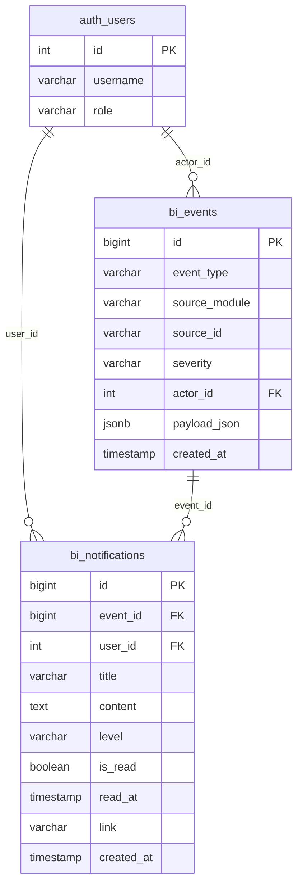
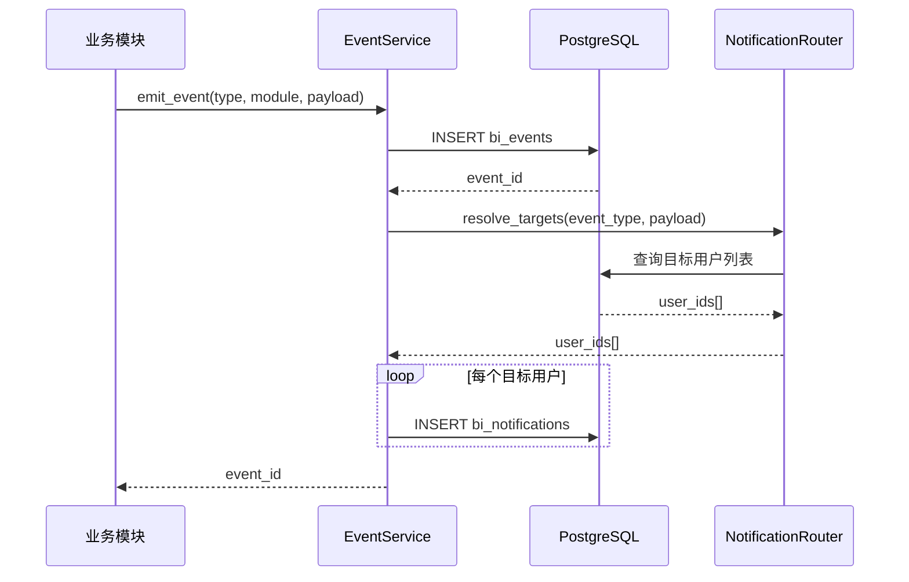
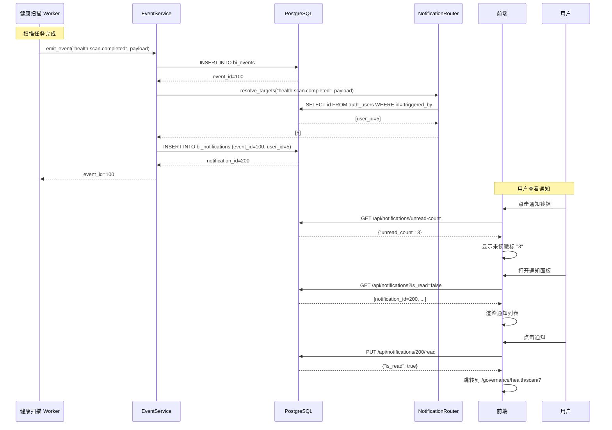
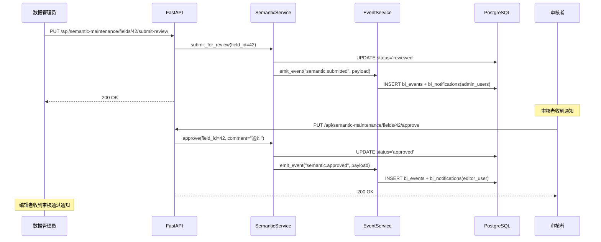

# 事件与通知系统规格书

> **Version:** v1.1
> **Date:** 2026-04-28
> **Status:** Draft
> **Owner:** Mulan BI Platform Team

**变更记录：**

- v1.1（2026-04-28）补齐邮件 / Webhook 出站工程细节（渠道适配器接口、重试 / 退避 / 死信、签名校验、出站错误码、开发交付约束）
- v1.0（2026-04-04）初版

---

## 1. 概述

### 1.1 目的

Mulan BI Platform 当前各模块（Tableau 同步、语义治理、健康扫描等）的关键状态变更缺乏统一的事件通知机制。用户无法在第一时间感知异步任务完成、审批流转、系统异常等重要事件。

本规格书定义一套**统一事件总线 + 通知系统**，解决以下问题：

- 各模块事件分散，缺乏统一采集和分发机制
- 用户需要主动轮询才能获知异步任务结果
- 跨模块联动（如"扫描完成后触发通知"）依赖硬编码

### 1.2 范围

| 包含 | 不包含 |
|------|--------|
| 事件数据模型与存储 | 实时推送（WebSocket，规划中） |
| 事件发布/订阅总线 | 第三方集成（钉钉/企微/Slack） |
| 站内通知 CRUD API | 通知模板管理 UI |
| 邮件通知（规划中） | 短信通知 |
| Webhook 出站（规划中） | 事件溯源（Event Sourcing） |

### 1.3 关联文档

| 文档 | 关联点 |
|------|--------|
| [01-error-codes-standard.md](01-error-codes-standard.md) | EVT 前缀错误码 |
| [03-data-model-overview.md](03-data-model-overview.md) | `bi_events` 规划表 |
| [07-tableau-mcp-v1-spec.md](07-tableau-mcp-v1-spec.md) | Tableau 同步事件源 |
| [09-semantic-maintenance-spec.md](09-semantic-maintenance-spec.md) | 语义审批事件源 |
| [11-health-scan-spec.md](11-health-scan-spec.md) | 健康扫描事件源 |
| [ARCHITECTURE.md](../ARCHITECTURE.md) | Celery/Redis 基础设施 |

---

## 2. 数据模型

### 2.1 `bi_events` — 事件存储表

基于 [03-data-model-overview.md](03-data-model-overview.md) 第 7 节规划表扩展设计。

**高频表治理策略**：

> `bi_events` 为 Append-Only 的高频写入表，必须采用 PostgreSQL `PARTITION BY RANGE (created_at)` **按月分区**机制。严禁使用直接的 `DELETE` 语句清理历史数据，否则会触发全表锁导致写入阻塞。
>
> 依赖 Celery Beat 调度，增加每月自动 `DROP` 90天+历史分区的任务，实现分区级清理而非行级删除。

| 列 | 类型 | 约束 | 默认值 | 说明 |
|----|------|------|--------|------|
| id | BIGINT | PK, AUTO | - | 主键（使用 BIGINT 支持高频写入） |
| event_type | VARCHAR(64) | NOT NULL, INDEX | - | 事件类型（见 §3） |
| source_module | VARCHAR(32) | NOT NULL | - | 来源模块：`tableau`, `semantic`, `health`, `auth`, `system` |
| source_id | VARCHAR(128) | NULLABLE | - | 来源对象标识（支持字符串 ID） |
| severity | VARCHAR(16) | NOT NULL | `'info'` | `info` / `warning` / `error` |
| actor_id | INTEGER | NULLABLE, FK→auth_users.id | - | 触发者用户 ID（系统事件为 NULL） |
| payload_json | JSONB | NOT NULL | `'{}'` | 事件载荷数据 |
| created_at | TIMESTAMP | NOT NULL, INDEX | `now()` | 事件发生时间 |

**分区策略**：
- 按 `created_at` 月分区（如 `bi_events_2026_01`、`bi_events_2026_02`）
- Alembic 迁移中创建初始分区，Celery Beat 每月自动创建新分区并 `DROP` 90天+历史分区

**索引策略：**

| 索引名 | 列 | 类型 | 说明 |
|--------|-----|------|------|
| ix_events_type_created | (event_type, created_at DESC) | BTREE | 按类型查询最近事件 |
| ix_events_source | (source_module, source_id) | BTREE | 按来源对象查询 |
| ix_events_created | created_at | BTREE | 时间范围查询、过期清理 |

### 2.2 `bi_notifications` — 用户通知表

| 列 | 类型 | 约束 | 默认值 | 说明 |
|----|------|------|--------|------|
| id | BIGINT | PK, AUTO | - | 主键 |
| event_id | BIGINT | NOT NULL, FK→bi_events.id | - | 关联事件 |
| user_id | INTEGER | NOT NULL, FK→auth_users.id, INDEX | - | 目标用户 |
| title | VARCHAR(256) | NOT NULL | - | 通知标题 |
| content | TEXT | NOT NULL | - | 通知内容（纯文本） |
| level | VARCHAR(16) | NOT NULL | `'info'` | `info` / `warning` / `error` / `success` |
| is_read | BOOLEAN | NOT NULL | `false` | 是否已读 |
| read_at | TIMESTAMP | NULLABLE | - | 阅读时间 |
| link | VARCHAR(512) | NULLABLE | - | 跳转链接（前端路由路径） |
| created_at | TIMESTAMP | NOT NULL, INDEX | `now()` | 创建时间 |

**索引策略：**

| 索引名 | 列 | 类型 | 说明 |
|--------|-----|------|------|
| ix_notif_user_read_created | (user_id, is_read, created_at DESC) | BTREE | 用户通知列表查询（核心索引） |
| ix_notif_event | event_id | BTREE | 按事件反查通知 |

### 2.3 出站相关表（v1.1 新增）

#### `bi_webhook_endpoints`

管理员配置的 Webhook 接收端点。

| 列 | 类型 | 约束 | 默认值 | 说明 |
|----|------|------|--------|------|
| id | BIGINT | PK, AUTO | - | 主键 |
| name | VARCHAR(128) | NOT NULL | - | 端点名称（管理用） |
| url | VARCHAR(1024) | NOT NULL | - | 接收端 URL（必须经 `url_validator` 校验） |
| secret_encrypted | TEXT | NOT NULL | - | HMAC 签名密钥，**Fernet 加密存储**，禁止明文 |
| event_type_pattern | VARCHAR(128) | NOT NULL | - | 订阅模式，如 `health.*` / `tableau.sync.failed` / `*` |
| is_active | BOOLEAN | NOT NULL | `true` | 是否启用 |
| owner_id | INTEGER | NOT NULL, FK→auth_users.id | - | 创建者（admin） |
| created_at | TIMESTAMP | NOT NULL | `now()` | 创建时间 |
| updated_at | TIMESTAMP | NOT NULL | `now()` | 更新时间 |

**索引：**

| 索引名 | 列 | 类型 | 说明 |
|--------|-----|------|------|
| ix_webhook_active_pattern | (is_active, event_type_pattern) | BTREE | 路由匹配查询 |

#### `bi_notification_outbox`

出站请求队列。所有邮件 / Webhook 投递必须通过该表中转，禁止业务代码直发。

| 列 | 类型 | 约束 | 默认值 | 说明 |
|----|------|------|--------|------|
| id | BIGINT | PK, AUTO | - | 主键 |
| notification_id | BIGINT | NULLABLE, FK→bi_notifications.id | - | 关联站内通知（webhook 可为空） |
| channel | VARCHAR(16) | NOT NULL | - | `email` / `webhook` |
| target | VARCHAR(512) | NOT NULL | - | 邮箱地址或 Webhook URL |
| status | VARCHAR(16) | NOT NULL | `'pending'` | `pending` / `sent` / `dead` |
| attempt_count | INT | NOT NULL | `0` | 已尝试次数 |
| next_attempt_at | TIMESTAMP | NOT NULL | `now()` | 下次调度时间（驱动重试调度） |
| last_error | TEXT | NULLABLE | - | 最近一次失败原因 |
| signature_payload_hash | VARCHAR(64) | NULLABLE | - | 出站 payload SHA-256 摘要（审计用，不存原文） |
| created_at | TIMESTAMP | NOT NULL | `now()` | 入队时间 |
| updated_at | TIMESTAMP | NOT NULL | `now()` | 更新时间 |

**索引：**

| 索引名 | 列 | 类型 | 说明 |
|--------|-----|------|------|
| ix_outbox_status_next | (status, next_attempt_at) | BTREE | 重试调度核心索引 |
| ix_outbox_notification | notification_id | BTREE | 按通知反查 |

#### `bi_notification_dead_letters`

死信表。重试用尽后写入，保留 90 天，按月分区。

| 列 | 类型 | 约束 | 默认值 | 说明 |
|----|------|------|--------|------|
| id | BIGINT | PK, AUTO | - | 主键 |
| outbox_id | BIGINT | NOT NULL, FK→bi_notification_outbox.id | - | 关联 outbox 记录 |
| channel | VARCHAR(16) | NOT NULL | - | `email` / `webhook` |
| target | VARCHAR(512) | NOT NULL | - | 邮箱或 Webhook URL |
| event_type | VARCHAR(64) | NOT NULL | - | 事件类型 |
| payload_json | JSONB | NOT NULL | `'{}'` | 原始 payload（已脱敏） |
| failure_reason | TEXT | NOT NULL | - | 失败汇总原因 |
| attempts | INT | NOT NULL | - | 累计尝试次数 |
| first_failed_at | TIMESTAMP | NOT NULL | - | 首次失败时间 |
| last_failed_at | TIMESTAMP | NOT NULL | - | 末次失败时间 |

**分区与保留：** 按 `last_failed_at` 月分区（`bi_notification_dead_letters_YYYY_MM`），保留 90 天后 `DROP` 历史分区。

### 2.4 ER 关系图



---

## 3. 事件定义

### 3.1 事件类型枚举

事件类型采用 `{module}.{object}.{action}` 命名约定。

| 事件类型 | 来源模块 | 严重级别 | 说明 |
|----------|----------|----------|------|
| `tableau.sync.completed` | tableau | info | Tableau 资产同步成功完成 |
| `tableau.sync.failed` | tableau | error | Tableau 资产同步失败 |
| `tableau.connection.tested` | tableau | info | Tableau 连接测试完成 |
| `semantic.submitted` | semantic | info | 语义标注提交审核 |
| `semantic.approved` | semantic | info | 语义标注审核通过 |
| `semantic.rejected` | semantic | warning | 语义标注审核驳回 |
| `semantic.published` | semantic | info | 语义标注发布到 Tableau |
| `semantic.publish_failed` | semantic | error | 语义发布失败 |
| `semantic.rollback` | semantic | warning | 语义版本回滚 |
| `semantic.ai_generated` | semantic | info | AI 语义生成完成 |
| `health.scan.completed` | health | info | 健康扫描完成 |
| `health.scan.failed` | health | error | 健康扫描失败 |
| `health.score.dropped` | health | warning | 健康分下降超过阈值 |
| `auth.user.login` | auth | info | 用户登录 |
| `auth.user.created` | auth | info | 新用户创建 |
| `auth.user.role_changed` | auth | warning | 用户角色变更 |
| `system.maintenance` | system | warning | 系统维护通知 |
| `system.error` | system | error | 系统级错误 |

### 3.2 事件 Payload Schema

每种事件类型的 `payload_json` 遵循以下结构约定：

#### `tableau.sync.completed`

```json
{
  "connection_id": 1,
  "connection_name": "Production Tableau",
  "duration_sec": 45,
  "workbooks_synced": 12,
  "views_synced": 38,
  "datasources_synced": 5,
  "assets_deleted": 2
}
```

#### `tableau.sync.failed`

```json
{
  "connection_id": 1,
  "connection_name": "Production Tableau",
  "error_message": "PAT 认证失败",
  "error_code": "TAB_003"
}
```

#### `semantic.approved` / `semantic.rejected`

```json
{
  "object_type": "field",
  "object_id": 42,
  "object_name": "sales_amount",
  "connection_id": 1,
  "reviewer_id": 3,
  "reviewer_name": "admin",
  "comment": "审批意见"
}
```

#### `semantic.published`

```json
{
  "object_type": "datasource",
  "object_id": 10,
  "object_name": "Superstore",
  "connection_id": 1,
  "publish_log_id": 55,
  "fields_published": 8
}
```

#### `health.scan.completed`

```json
{
  "scan_id": 7,
  "datasource_id": 3,
  "datasource_name": "DW Production",
  "health_score": 72.5,
  "total_issues": 15,
  "high_count": 3,
  "medium_count": 7,
  "low_count": 5
}
```

#### `health.score.dropped`

```json
{
  "scan_id": 7,
  "datasource_id": 3,
  "datasource_name": "DW Production",
  "previous_score": 85.0,
  "current_score": 72.5,
  "drop_amount": 12.5
}
```

#### `auth.user.role_changed`

```json
{
  "target_user_id": 5,
  "target_username": "zhangsan",
  "old_role": "user",
  "new_role": "analyst"
}
```

---

## 4. 事件总线

### 4.1 架构选型

基于现有基础设施（Redis 7 + Celery），采用 **Celery Signal + 内部发布函数** 模式：

- **Phase 1（当前）**：同步写入 `bi_events` 表 + 同步创建通知记录
- **Phase 2（规划）**：通过 Redis PubSub 异步分发，解耦事件生产与消费

选择理由：
- 项目已使用 Redis + Celery，无需引入额外中间件
- Phase 1 的同步模式足够满足当前并发需求（<100 QPS）
- 升级到 Phase 2 时仅需替换 `emit_event` 内部实现，调用方无感

### 4.2 事件发射接口

```python
# backend/services/events/event_service.py

from typing import Optional
from datetime import datetime
from sqlalchemy.orm import Session


def emit_event(
    db: Session,
    event_type: str,
    source_module: str,
    payload: dict,
    *,
    source_id: Optional[str] = None,
    severity: str = "info",
    actor_id: Optional[int] = None,
) -> int:
    """
    发射一个事件。

    1. 写入 bi_events 表
    2. 根据事件类型和路由规则，创建 bi_notifications 记录
    3. 返回事件 ID

    Args:
        db: SQLAlchemy Session
        event_type: 事件类型，如 "tableau.sync.completed"
        source_module: 来源模块，如 "tableau"
        payload: 事件载荷 dict
        source_id: 来源对象标识
        severity: 严重级别 info/warning/error
        actor_id: 触发者用户 ID

    Returns:
        新创建的事件 ID
    """
    ...
```

### 4.3 通知路由规则

事件创建后，由通知路由器决定通知哪些用户：

| 事件类型 | 通知目标 | 通知级别 |
|----------|----------|----------|
| `tableau.sync.completed` | 连接所有者 | info |
| `tableau.sync.failed` | 连接所有者 + 所有 admin | error |
| `semantic.submitted` | 所有 admin + data_admin(reviewer) | info |
| `semantic.approved` | 语义创建者 | success |
| `semantic.rejected` | 语义创建者 | warning |
| `semantic.published` | 语义创建者 + 所有 admin | success |
| `semantic.publish_failed` | 语义创建者 + 所有 admin | error |
| `health.scan.completed` | 扫描触发者 | info |
| `health.scan.failed` | 扫描触发者 + 所有 admin | error |
| `health.score.dropped` | 扫描触发者 + 所有 admin | warning |
| `auth.user.role_changed` | 目标用户 | warning |
| `system.maintenance` | 所有活跃用户（广播） | warning |
| `system.error` | 所有 admin | error |

路由规则在 `backend/services/events/notification_router.py` 中以注册表模式实现：

```python
# backend/services/events/notification_router.py

from typing import Callable

# 路由注册表：event_type -> 返回目标用户 ID 列表的函数
NOTIFICATION_ROUTES: dict[str, Callable] = {}


def register_route(event_type: str):
    """装饰器：注册事件类型对应的通知路由函数"""
    def decorator(fn: Callable):
        NOTIFICATION_ROUTES[event_type] = fn
        return fn
    return decorator


@register_route("tableau.sync.failed")
def route_sync_failed(db, event, payload) -> list[int]:
    """同步失败：通知连接所有者 + 全部 admin"""
    owner_id = _get_connection_owner(db, payload["connection_id"])
    admin_ids = _get_users_by_role(db, "admin")
    return list(set([owner_id] + admin_ids))
```

### 4.4 事件发布流程



---

## 5. 通知渠道

### 5.1 站内通知（v1.0 必选）

- 存储在 `bi_notifications` 表
- 通过 REST API 查询、标记已读
- 前端通过轮询或未来 WebSocket 获取未读数
- 通知保留策略：90 天后自动归档/删除
  - **Sprint 3 实现**：`services.tasks.event_tasks.purge_old_events` Celery Beat 每日执行
  - ⚠️ **禁止直接 DELETE**：`bi_events` 已启用按月分区，`purge_old_events` 必须通过 `DROP TABLE IF EXISTS bi_events_YYYY_MM` 分区级清理，**严禁使用行级 DELETE**
  - `bi_notifications` 孤儿记录（event_id 无对应事件）→ DELETE
  - 每次执行记录归档数量日志

### 5.2 邮件通知（v1.1 工程态）

**触发条件：** 仅对 `severity = error` 的事件触发邮件投递。用户级通知偏好（按事件类型订阅 / 退订）留 v2.0（见开放问题 Q4），v1.1 硬编码该规则。

#### 5.2.1 渠道适配器接口

所有出站渠道继承 `BaseChannel` 抽象类，统一三态返回值。

```python
# backend/services/events/channels/base.py

from abc import ABC, abstractmethod
from dataclasses import dataclass
from typing import Literal


DeliveryStatus = Literal["delivered", "retryable_failed", "permanent_failed"]


@dataclass
class ChannelDeliveryResult:
    status: DeliveryStatus
    detail: str               # 失败原因 / 投递返回信息
    error_code: str | None    # 关联 EVT_xxx 错误码（失败时填）


class BaseChannel(ABC):
    @abstractmethod
    def send(
        self,
        notification,           # BiNotification 实例
        recipient: str,         # 邮箱地址 or webhook URL
        *,
        trace_id: str,
    ) -> ChannelDeliveryResult: ...
```

`EmailChannel(BaseChannel)` 实现位于 `backend/services/events/channels/email_channel.py`。
- `delivered`：SMTP 250 OK
- `retryable_failed`：SMTP 4xx、连接超时、DNS 故障
- `permanent_failed`：SMTP 5xx（地址不存在、用户被拒）、模板渲染异常

#### 5.2.2 SMTP 配置项

从 `.env` 读取，缺失或不可达时通道直接返回 `permanent_failed` 并写 EVT_010。

| 变量 | 必填 | 示例 | 说明 |
|------|:----:|------|------|
| `SMTP_HOST` | Y | `smtp.qiye.aliyun.com` | SMTP 主机 |
| `SMTP_PORT` | Y | `465` | 端口 |
| `SMTP_USER` | Y | `noreply@example.com` | 登录用户 |
| `SMTP_PASSWORD` | Y | - | 登录密码（不入日志） |
| `SMTP_USE_TLS` | N | `true` | 是否启用 TLS（默认 true） |
| `SMTP_FROM_ADDR` | Y | `Mulan BI <noreply@example.com>` | 发件人地址 |

启动时校验：缺任一必填项 → 渠道整体禁用，启动日志 WARN，相关 outbox 记录入队后立即标记 `permanent_failed` + EVT_010。

#### 5.2.3 模板

模板按事件类型分文件，HTML / 纯文本双版本：

```
backend/services/events/email_templates/
├── default.html.j2
├── default.txt.j2
├── tableau.sync.failed.html.j2
├── tableau.sync.failed.txt.j2
├── semantic.publish_failed.html.j2
├── semantic.publish_failed.txt.j2
├── health.scan.failed.html.j2
└── health.scan.failed.txt.j2
```

模板查找顺序：`{event_type}.html.j2` → `default.html.j2`。未找到 default 抛 EVT_015。模板上下文注入 `notification`、`event`、`payload`、`base_url`。

#### 5.2.4 重试与退避

| 尝试次数 | 距上次间隔 |
|----------|-----------|
| 1 | 立即 |
| 2 | 30s |
| 3 | 120s |
| 4 | 300s |
| 5 | 900s |
| 6（用尽）| 1800s 后判死信 |

仅 `retryable_failed` 进入下一轮；`permanent_failed` 直接转 §5.2.5 死信。调度由 Celery Beat 每 30s 扫描 `bi_notification_outbox WHERE status='pending' AND next_attempt_at <= now()`。

#### 5.2.5 死信

第 5 次仍失败 → outbox `status='dead'` → 同步写入 `bi_notification_dead_letters`（payload 已脱敏）。运维通过 §6.6 出站管理 API 查询与重投。

#### 5.2.6 用户偏好

v1.1 硬编码"`severity=error` 才发邮件"，不区分用户。
v2.0 引入 `bi_notification_preferences`（见开放问题 Q4），支持按事件类型 / 渠道 / 频次配置。

### 5.3 Webhook 出站（v1.1 工程态）

#### 5.3.1 数据模型

`bi_webhook_endpoints`（见 §2.3）。新增端点必须经 §5.3.8 安全校验。订阅匹配规则：
- 精确匹配：`tableau.sync.failed` 仅匹配该类型
- 通配符：`health.*` 匹配 `health.scan.completed` / `health.scan.failed` / `health.score.dropped`
- 全订阅：`*` 匹配所有事件

#### 5.3.2 渠道适配器接口

`WebhookChannel(BaseChannel)` 位于 `backend/services/events/channels/webhook_channel.py`，三态返回同 §5.2.1。
- `delivered`：HTTP 2xx
- `retryable_failed`：HTTP 5xx、连接超时、DNS 故障、读超时
- `permanent_failed`：HTTP 4xx（接收端拒绝）、URL 校验失败、Fernet 解密失败

#### 5.3.3 签名

请求头 `X-Mulan-Signature: sha256=<hex>`，签名算法：

```
hmac.new(
    key=fernet.decrypt(secret_encrypted),
    msg=canonical_json_bytes,
    digestmod=hashlib.sha256
).hexdigest()
```

`canonical_json_bytes`：对 payload dict 调用 `json.dumps(payload, sort_keys=True, separators=(',', ':'), ensure_ascii=False).encode('utf-8')`，确保字段排序、UTF-8、紧凑分隔。

接收端验签必须使用 `hmac.compare_digest`（见 §13.2、§13.4）。

#### 5.3.4 请求格式

| 项 | 值 |
|----|-----|
| Method | `POST` |
| Content-Type | `application/json; charset=utf-8` |
| Header `X-Mulan-Event-Type` | 事件类型，如 `tableau.sync.failed` |
| Header `X-Mulan-Event-Id` | `bi_events.id` |
| Header `X-Mulan-Trace-Id` | 调用链 trace_id |
| Header `X-Mulan-Signature` | `sha256=<hex>`（见 §5.3.3） |
| Header `User-Agent` | `Mulan-Webhook/1.1` |
| Body | canonical JSON（见 §5.3.3） |
| Connect Timeout | 5s |
| Read Timeout | 10s |

Payload > 64KB 自动截断 + 顶层增加 `_truncated: true`（见 §11.4 P1）。

#### 5.3.5 重试与退避

| 尝试次数 | 距上次间隔 |
|----------|-----------|
| 1 | 立即 |
| 2 | 30s |
| 3 | 120s |
| 4（用尽）| 300s 后判死信 |

5xx / 网络错 → `retryable_failed`；4xx → `permanent_failed`。

#### 5.3.6 死信

同 §5.2.5，写入 `bi_notification_dead_letters`。

#### 5.3.7 接收端验签示例

**Python（FastAPI）：**

```python
import hmac, hashlib, json
from fastapi import Request, HTTPException

SECRET = b"<your-shared-secret>"

@app.post("/webhook/mulan")
async def receive(req: Request):
    raw = await req.body()
    sig_header = req.headers.get("X-Mulan-Signature", "")
    if not sig_header.startswith("sha256="):
        raise HTTPException(400, "bad signature header")
    expected = hmac.new(SECRET, raw, hashlib.sha256).hexdigest()
    received = sig_header.split("=", 1)[1]
    if not hmac.compare_digest(expected, received):
        raise HTTPException(401, "signature mismatch")
    payload = json.loads(raw)
    return {"ok": True, "event_id": payload.get("event_id")}
```

**Node.js（Express）：**

```js
const crypto = require('crypto');
const SECRET = process.env.MULAN_WEBHOOK_SECRET;

app.post('/webhook/mulan', express.raw({ type: 'application/json' }), (req, res) => {
  const sig = (req.header('X-Mulan-Signature') || '').replace(/^sha256=/, '');
  const expected = crypto.createHmac('sha256', SECRET).update(req.body).digest('hex');
  const a = Buffer.from(sig, 'hex');
  const b = Buffer.from(expected, 'hex');
  if (a.length !== b.length || !crypto.timingSafeEqual(a, b)) {
    return res.status(401).json({ error: 'signature mismatch' });
  }
  res.json({ ok: true });
});
```

#### 5.3.8 安全

URL 校验在 `backend/services/events/channels/url_validator.py` **唯一实现**：

- 协议必须为 `https://`（开发环境允许 `http://localhost`，生产强制 https）
- 解析 hostname → DNS 解析后所有 IP 都不得命中私网段：
  - `127.0.0.0/8`、`10.0.0.0/8`、`172.16.0.0/12`、`192.168.0.0/16`
  - `169.254.0.0/16`（link-local / metadata）、`::1`、`fc00::/7`
- 拒绝命中 → 抛 EVT_011（创建端点 / 测试 / 投递三处都校验）

Secret 处理：
- 写入 `bi_webhook_endpoints.secret_encrypted` 必须经 `cryptography.fernet.Fernet`
- Fernet 主密钥从 `FERNET_MASTER_KEY` 环境变量读取，缺失抛 EVT_016
- 所有日志、`outbox.last_error`、`dead_letters.failure_reason` 禁止包含明文 secret 或签名值

---

## 6. API 设计

### 6.1 获取通知列表

```
GET /api/notifications
```

**查询参数：**

| 参数 | 类型 | 必填 | 默认值 | 说明 |
|------|------|------|--------|------|
| page | int | 否 | 1 | 页码 |
| page_size | int | 否 | 20 | 每页条数（max: 100） |
| is_read | bool | 否 | - | 过滤已读/未读 |
| level | string | 否 | - | 过滤级别：info/warning/error/success |

**响应：**

```json
{
  "items": [
    {
      "id": 1,
      "event_id": 100,
      "title": "Tableau 同步完成",
      "content": "连接「Production Tableau」同步成功，共同步 12 个工作簿、38 个视图",
      "level": "info",
      "is_read": false,
      "link": "/tableau/sync-logs/100",
      "created_at": "2026-04-04T10:30:00Z"
    }
  ],
  "total": 42,
  "page": 1,
  "page_size": 20
}
```

**权限：** 所有已认证用户（仅返回当前用户的通知）

### 6.2 标记通知已读

```
PUT /api/notifications/{id}/read
```

**响应：**

```json
{
  "id": 1,
  "is_read": true,
  "read_at": "2026-04-04T10:35:00Z"
}
```

**权限：** 仅通知所有者

### 6.3 批量标记已读

```
PUT /api/notifications/batch-read
```

**请求体：**

```json
{
  "ids": [1, 2, 3]
}
```

或标记全部已读：

```json
{
  "all": true
}
```

**响应：**

```json
{
  "updated_count": 3
}
```

**权限：** 仅通知所有者

### 6.4 获取未读数量

```
GET /api/notifications/unread-count
```

**响应：**

```json
{
  "unread_count": 5
}
```

**权限：** 所有已认证用户

### 6.5 获取事件列表（管理员）

```
GET /api/events
```

**查询参数：**

| 参数 | 类型 | 必填 | 默认值 | 说明 |
|------|------|------|--------|------|
| page | int | 否 | 1 | 页码 |
| page_size | int | 否 | 20 | 每页条数（max: 100） |
| event_type | string | 否 | - | 事件类型过滤 |
| source_module | string | 否 | - | 来源模块过滤 |
| severity | string | 否 | - | 严重级别过滤 |
| start_time | datetime | 否 | - | 时间范围起始 |
| end_time | datetime | 否 | - | 时间范围结束 |

**权限：** 仅 admin

### 6.6 出站管理 API（v1.1 新增）

所有端点权限：**仅 admin**。

#### `GET /api/webhook-endpoints`

列出已配置端点。

| 入参 | 类型 | 说明 |
|------|------|------|
| is_active | bool | 可选，过滤启用状态 |
| event_type_pattern | string | 可选，模式匹配 |

**出参字段：** `id` / `name` / `url` / `event_type_pattern` / `is_active` / `owner_id` / `created_at` / `updated_at`（**不返回 secret**）

#### `POST /api/webhook-endpoints`

创建端点。

**入参字段：** `name` / `url` / `secret`（明文输入，落库前 Fernet 加密）/ `event_type_pattern` / `is_active`
**出参字段：** 同 GET 单条
**校验：** 调用 `url_validator.validate(url)`，失败抛 EVT_011

#### `PATCH /api/webhook-endpoints/{id}`

更新端点。

**入参字段（全部可选）：** `name` / `url` / `secret` / `event_type_pattern` / `is_active`
**出参字段：** 同 GET 单条
**说明：** secret 仅当显式传入时更新

#### `DELETE /api/webhook-endpoints/{id}`

软删除（`is_active=false` + 保留记录用于审计）。

**出参字段：** `id` / `is_active`

#### `POST /api/webhook-endpoints/{id}/test`

发送一条测试事件（`event_type=system.webhook_test`）到该端点，**不写 outbox**，直接同步调用并返回结果。

**出参字段：** `status`（`delivered` / `retryable_failed` / `permanent_failed`）/ `http_status` / `latency_ms` / `error_code` / `detail`

#### `GET /api/notifications/outbox`

查询出站队列。

**入参字段：** `status`（`pending` / `sent` / `dead`，可选）/ `channel`（`email` / `webhook`，可选）/ `page` / `page_size`
**出参字段：** `id` / `notification_id` / `channel` / `target` / `status` / `attempt_count` / `next_attempt_at` / `last_error` / `created_at` / `updated_at`

#### `POST /api/notifications/outbox/{id}/retry`

把 `dead` 状态的 outbox 重排队。

**入参字段：** 无
**出参字段：** `id` / `status`（=`pending`）/ `attempt_count`（=0）/ `next_attempt_at`（=now）
**约束：** 仅允许 `status='dead'` 的记录调用，否则 400

---

## 7. 错误码

遵循 [01-error-codes-standard.md](01-error-codes-standard.md) 规范，使用 `EVT` 前缀。

| 错误码 | HTTP | 描述 | 触发场景 |
|--------|------|------|----------|
| `EVT_001` | 404 | 通知不存在 | 按 ID 查询通知未找到 |
| `EVT_002` | 403 | 非通知所有者 | 尝试操作他人的通知 |
| `EVT_003` | 400 | 无效的事件类型 | 发射事件时使用了未注册的事件类型 |
| `EVT_004` | 400 | 事件载荷校验失败 | payload 不符合该事件类型的 Schema |
| `EVT_005` | 500 | 通知创建失败 | 数据库写入异常 |
| `EVT_006` | 403 | 需要管理员角色 | 非 admin 用户访问事件列表 |
| `EVT_010` | 503 | 邮件 SMTP 配置缺失或不可达 | SMTP_HOST/USER/PASSWORD 缺失，或连接 / 认证失败 |
| `EVT_011` | 422 | Webhook URL 不合法 | 协议非 https、命中 SSRF 私网黑名单、DNS 不可解析 |
| `EVT_012` | 504 | Webhook 接收端超时 | 连接 / 读超时（5s / 10s） |
| `EVT_013` | 502 | Webhook 接收端返回 5xx | 接收端服务异常，进入 retry |
| `EVT_014` | 400 | Webhook 接收端返回 4xx | 接收端拒绝请求，permanent_failed 直接进死信 |
| `EVT_015` | 500 | 模板渲染失败 | Jinja2 渲染抛错且 default 模板亦缺失 |
| `EVT_016` | 403 | Webhook secret 不可解密 | `FERNET_MASTER_KEY` 缺失或密文损坏 |

---

## 8. 安全

### 8.1 数据隔离

- **用户通知隔离**：所有通知 API 强制通过 `get_current_user` 注入当前用户 ID，查询条件 `WHERE user_id = :current_user_id` 不可绕过
- **API 层面**：`/api/notifications` 端点仅返回当前用户的通知，无法通过参数查看他人通知
- **管理员广播**：`system.maintenance` 等系统级事件由 admin 触发，通知所有活跃用户

### 8.2 Payload 安全

- 事件 payload 中**禁止**包含密码、API Key、Token 等敏感信息
- 通知 content 在前端渲染前需做 HTML 转义（XSS 防护）
- Webhook 出站 payload 需脱敏处理

### 8.3 权限矩阵

| 操作 | admin | data_admin | analyst | user |
|------|:-----:|:----------:|:-------:|:----:|
| 查看自己的通知 | Y | Y | Y | Y |
| 标记自己的通知已读 | Y | Y | Y | Y |
| 查看事件列表 | Y | - | - | - |
| 发布系统广播 | Y | - | - | - |
| 配置 Webhook | Y | - | - | - |
| 查看 / 重投死信 | Y | - | - | - |

---

## 9. 集成点

### 9.1 各模块事件发射点

| 模块 | 代码位置 | 事件类型 | 触发时机 |
|------|----------|----------|----------|
| Tableau 同步 | `services/tableau/sync_service.py` | `tableau.sync.completed` | `sync_all_assets()` 成功完成 |
| Tableau 同步 | `services/tableau/sync_service.py` | `tableau.sync.failed` | `sync_all_assets()` 捕获异常 |
| Tableau 连接 | `services/tableau/connection_service.py` | `tableau.connection.tested` | 连接测试完成 |
| 语义维护 | `services/semantic_maintenance/review_service.py` | `semantic.submitted` | 语义标注提交审核 |
| 语义维护 | `services/semantic_maintenance/review_service.py` | `semantic.approved` | 审核通过 |
| 语义维护 | `services/semantic_maintenance/review_service.py` | `semantic.rejected` | 审核驳回 |
| 语义发布 | `services/semantic_maintenance/publish_service.py` | `semantic.published` | 发布成功 |
| 语义发布 | `services/semantic_maintenance/publish_service.py` | `semantic.publish_failed` | 发布失败 |
| 语义 AI | `services/semantic_maintenance/ai_service.py` | `semantic.ai_generated` | AI 生成完成 |
| 语义回滚 | `services/semantic_maintenance/version_service.py` | `semantic.rollback` | 版本回滚 |
| 健康扫描 | `services/health_scan/scan_service.py` | `health.scan.completed` | 扫描任务成功 |
| 健康扫描 | `services/health_scan/scan_service.py` | `health.scan.failed` | 扫描任务失败 |
| 健康扫描 | `services/health_scan/scan_service.py` | `health.score.dropped` | 扫描完成且分数下降 > 10 分 |
| 用户认证 | `services/auth/auth_service.py` | `auth.user.login` | 登录成功 |
| 用户管理 | `services/auth/user_service.py` | `auth.user.created` | 新用户创建 |
| 用户管理 | `services/auth/user_service.py` | `auth.user.role_changed` | 角色变更 |

### 9.2 调用示例

```python
# services/health_scan/scan_service.py 中扫描完成后

from services.events.event_service import emit_event

# 扫描成功
emit_event(
    db=db,
    event_type="health.scan.completed",
    source_module="health",
    source_id=str(scan_record.id),
    actor_id=triggered_by,
    payload={
        "scan_id": scan_record.id,
        "datasource_id": scan_record.datasource_id,
        "datasource_name": scan_record.datasource_name,
        "health_score": scan_record.health_score,
        "total_issues": scan_record.total_issues,
        "high_count": scan_record.high_count,
        "medium_count": scan_record.medium_count,
        "low_count": scan_record.low_count,
    },
)

# 如果分数下降超过阈值
if previous_score and (previous_score - current_score) > 10:
    emit_event(
        db=db,
        event_type="health.score.dropped",
        source_module="health",
        source_id=str(scan_record.id),
        severity="warning",
        actor_id=triggered_by,
        payload={
            "scan_id": scan_record.id,
            "datasource_id": scan_record.datasource_id,
            "datasource_name": scan_record.datasource_name,
            "previous_score": previous_score,
            "current_score": current_score,
            "drop_amount": previous_score - current_score,
        },
    )
```

---

## 10. 时序图

### 10.1 事件发布 → 通知创建 → 用户查看



### 10.2 语义审批事件流



---

## 11. 测试策略

### 11.1 单元测试

| 测试目标 | 测试内容 | 文件位置 |
|----------|----------|----------|
| `emit_event` | 事件写入 + 返回正确 event_id | `tests/unit/events/test_event_service.py` |
| NotificationRouter | 各事件类型路由到正确的用户列表 | `tests/unit/events/test_notification_router.py` |
| 通知内容生成 | 标题/内容模板渲染正确 | `tests/unit/events/test_notification_content.py` |
| payload 校验 | 缺少必要字段时抛出 EVT_004 | `tests/unit/events/test_payload_validation.py` |

### 11.2 集成测试

| 测试目标 | 测试内容 | 文件位置 |
|----------|----------|----------|
| API 端点 | GET/PUT 通知接口 CRUD 完整流程 | `tests/integration/test_notifications_api.py` |
| 数据隔离 | 用户 A 无法查看/操作用户 B 的通知 | `tests/integration/test_notification_isolation.py` |
| 端到端 | 触发扫描 → 事件写入 → 通知生成 → API 查询 | `tests/integration/test_event_e2e.py` |

### 11.3 性能测试

- **写入吞吐**：单次 `emit_event` 含通知创建 < 50ms（5 个目标用户）
- **查询性能**：`GET /api/notifications` 在 10,000 条通知下 < 100ms
- **未读计数**：`GET /api/notifications/unread-count` < 20ms

### 11.4 出站测试（v1.1 新增）

测试统一 mock 在 `BaseChannel.send`，禁止直接 mock `smtplib` / `httpx`（见 §13.2）。

| 优先级 | 用例 | 预期 | 文件位置建议 |
|:------:|------|------|-------------|
| P0 | 邮件：SMTP 不可达 | retry 5 次后进死信 + 写 EVT_010 日志 | `tests/services/test_event_channels.py::test_email_smtp_unreachable_dead_letter` |
| P0 | 邮件：模板缺失 | 走 `default.html.j2`，不报错，正常 delivered | `tests/services/test_event_channels.py::test_email_fallback_default_template` |
| P0 | Webhook：HMAC 签名稳定 | 同 payload + 同 secret 多次签名结果一致 | `tests/services/test_event_channels.py::test_webhook_signature_deterministic` |
| P0 | Webhook：SSRF URL（127.0.0.1 / 10.x / 192.168.x）| 创建端点时 EVT_011 拦截，不入库 | `tests/api/test_webhook_endpoints.py::test_create_endpoint_ssrf_rejected` |
| P0 | Webhook：接收端 5xx | retry 3 次 → 死信 + EVT_013 | `tests/services/test_event_channels.py::test_webhook_5xx_retry_then_dead` |
| P0 | Webhook：接收端 4xx | 不重试，立即死信 + EVT_014 | `tests/services/test_event_channels.py::test_webhook_4xx_immediate_dead` |
| P0 | outbox 重试调度 | `next_attempt_at` 未到期不取出，到期后取出 | `tests/services/test_outbox_scheduler.py::test_scheduler_respects_next_attempt_at` |
| P1 | 死信重投 API | `status: dead → pending`，`attempt_count` 重置为 0 | `tests/api/test_webhook_endpoints.py::test_outbox_retry_dead_letter` |
| P1 | payload 截断 | > 64KB 自动截断 + 顶层 `_truncated: true` | `tests/services/test_event_channels.py::test_webhook_payload_truncation` |
| P1 | 接收端验签示例 | §5.3.7 示例代码可跑通（Python / Node 各一） | `tests/services/test_webhook_signature_consumer.py` |

---

## 12. 开放问题

| 编号 | 问题 | 影响 | 当前倾向 | 状态 |
|------|------|------|----------|------|
| Q1 | 是否需要 WebSocket 实时推送 | 用户体验（无需手动刷新） | Phase 2 引入，v1.0 使用前端 30s 轮询 | 待定 |
| Q2 | 事件保留策略 | 存储空间 | Sprint 3 实现：90 天直接 DELETE + 级联清理孤儿通知，不再归档到中间表 | **✅ 已实现（Sprint 3）** |
| Q3 | 通知模板是否需要可配置 | 灵活性 | v1.0 硬编码模板，v2.0 数据库配置化 | 待定 |
| Q4 | 是否需要通知偏好设置 | 用户可选择关闭某类通知 | v2.0 引入 `bi_notification_preferences` 表 | 待定 |
| Q5 | 广播通知的性能 | 用户量大时批量写入 | 使用 `bulk_insert_mappings` 批量写入 | 待定 |
| Q6 | 事件 payload 是否需要 JSON Schema 校验 | 数据质量 | v1.0 宽松模式（仅日志警告），v2.0 严格校验 | 待定 |
| Q7 | 是否需要通知聚合（同类事件合并） | 避免通知轰炸 | v2.0 考虑时间窗口聚合 | 待定 |

---

## 13. 开发交付约束（v1.1 新增）

### 13.1 架构红线

- `backend/services/events/channels/` 内部模块**不得 import `app/api`**（保持渠道层与 HTTP 层解耦）
- 所有出站投递必须经 `bi_notification_outbox` + Celery worker 调度，**禁止业务代码 `await smtp.send(...)` / `await httpx.post(webhook_url, ...)` 直发**
- Webhook secret 写入 `bi_webhook_endpoints.secret_encrypted` 必须经 Fernet 加密，**`bi_webhook_endpoints` 周边不得出现明文 secret 字段**（如 `secret_plaintext` / `secret_raw`）
- 出站 payload 必须经 redactor 脱敏，PII / token 不得落入 outbox 可见字段（仅允许保留 `signature_payload_hash` 摘要）
- URL 校验在 `backend/services/events/channels/url_validator.py` **唯一实现**，业务代码 / API 层不得自行做 hostname / IP 段判断

### 13.2 强制检查清单（PR 拒绝条件）

- [ ] 新增 / 修改 channel 必须实现 `BaseChannel.send`，返回 `ChannelDeliveryResult` 三态
- [ ] 出站新增事件类型必须在 §3.1 注册 + `email_templates/` 给出对应模板，或显式接受 `default.html.j2` 回退
- [ ] HMAC 签名比对使用 `hmac.compare_digest`，**禁止使用 `==`**
- [ ] outbox 重试调度走 `next_attempt_at` + Celery Beat，**禁止 `time.sleep` / busy loop**
- [ ] 测试 mock 位置在 `BaseChannel.send`，**禁止直接 mock `smtplib` / `aiosmtplib` / `httpx`**

### 13.3 验证命令

```bash
# 单元 + 集成测试
cd backend && pytest tests/services/test_event_channels.py -x
cd backend && pytest tests/services/test_outbox_scheduler.py -x
cd backend && pytest tests/api/test_webhook_endpoints.py -x

# 红线 grep（CI 中作为 fail-fast 步骤）
! grep -rE "smtplib\.|aiosmtplib\." backend/app backend/services --exclude-dir=channels
! grep -rE "httpx\..*post.*webhook" backend/app backend/services --exclude-dir=channels
! grep -rE "secret_plaintext|secret_raw" backend/services/events
```

### 13.4 正确 / 错误示范

**示范 1：直发 vs outbox**

- 错：业务代码直接 `await smtp.send_message(msg)` —— 绕过 outbox / 重试 / 死信，故障不可观测
- 对：业务代码 `emit_event(...)` → 路由 → `outbox` 入队 → worker 拉 outbox → `channel.send(...)`

**示范 2：HMAC 比对**

- 错：

  ```python
  if signature == expected_signature:
      ...
  ```

- 对：

  ```python
  if hmac.compare_digest(signature, expected_signature):
      ...
  ```

**示范 3：URL 校验**

- 错：业务代码直接 `httpx.post(url, ...)` 或自行 `urlparse(url).hostname not in BLACKLIST`
- 对：

  ```python
  from services.events.channels.url_validator import validate
  validate(url)  # 不合法时抛 EVT_011（SSRF / 协议非 https / DNS 不可解析）
  ```

---

## 附录 A：文件结构

```
backend/services/events/
├── __init__.py
├── event_service.py          # emit_event 核心函数
├── notification_router.py    # 通知路由注册表
├── notification_content.py   # 通知标题/内容模板
├── models.py                 # SQLAlchemy 模型 (BiEvent, BiNotification, BiWebhookEndpoint, BiNotificationOutbox, BiNotificationDeadLetter)
├── constants.py              # 事件类型枚举常量
├── outbox_service.py         # outbox 入队 / 状态机 / 死信迁移（v1.1）
├── redactor.py               # payload 脱敏（v1.1）
├── channels/
│   ├── __init__.py
│   ├── base.py               # BaseChannel + ChannelDeliveryResult（v1.1）
│   ├── email_channel.py      # EmailChannel(BaseChannel)（v1.1）
│   ├── webhook_channel.py    # WebhookChannel(BaseChannel)（v1.1）
│   └── url_validator.py      # SSRF / 协议 / 黑名单校验（v1.1）
└── email_templates/          # Jinja2 双版本模板（v1.1）
    ├── default.html.j2
    ├── default.txt.j2
    └── {event_type}.{html,txt}.j2

backend/services/tasks/
└── outbox_tasks.py           # Celery Beat 重试调度（v1.1）

backend/app/api/
├── notifications.py          # 通知 API 路由
├── events.py                 # 事件 API 路由（admin）
├── webhook_endpoints.py      # Webhook 端点 CRUD + test（admin，v1.1）
└── outbox.py                 # outbox 查询 + 死信重投（admin，v1.1）
```

## 附录 B：数据库迁移

```bash
cd backend && alembic revision --autogenerate -m "add_events_notifications_tables"
cd backend && alembic upgrade head
```

迁移脚本需包含：
1. 创建 `bi_events` 表 + 索引（含按月分区）
2. 创建 `bi_notifications` 表 + 索引
3. 创建 `bi_webhook_endpoints` 表 + 索引（v1.1）
4. 创建 `bi_notification_outbox` 表 + 索引（v1.1）
5. 创建 `bi_notification_dead_letters` 表 + 索引 + 月分区（v1.1）
6. `downgrade()` 中 DROP 上述五张表
