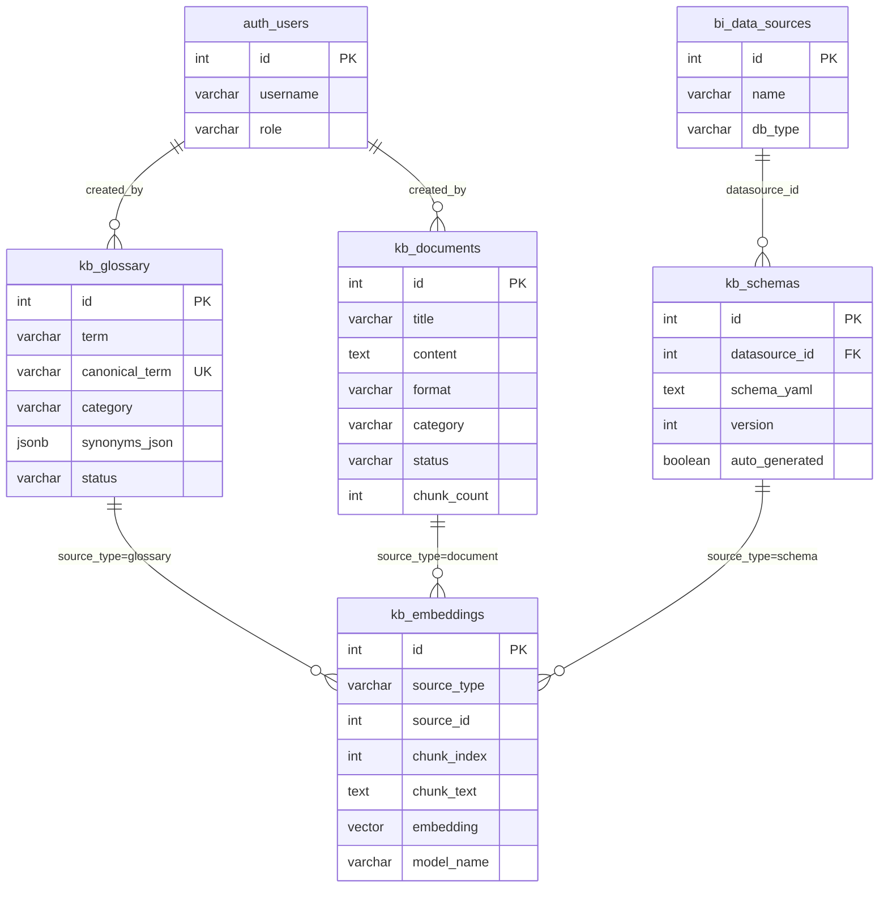
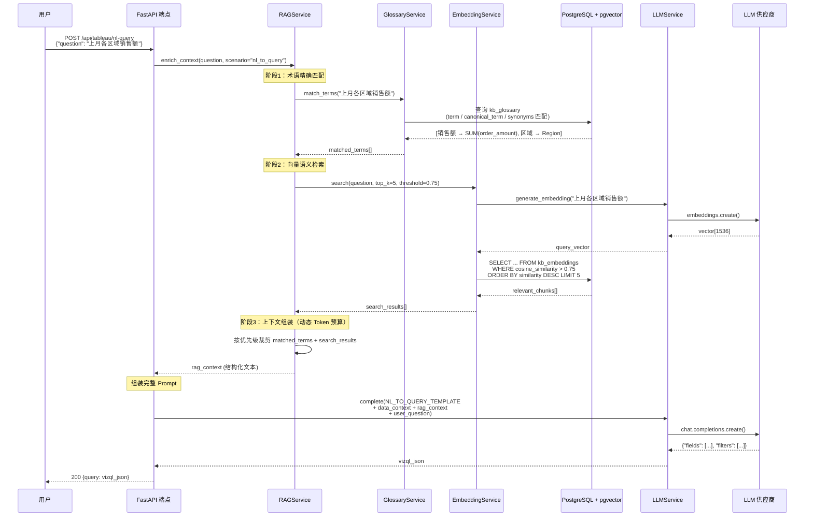
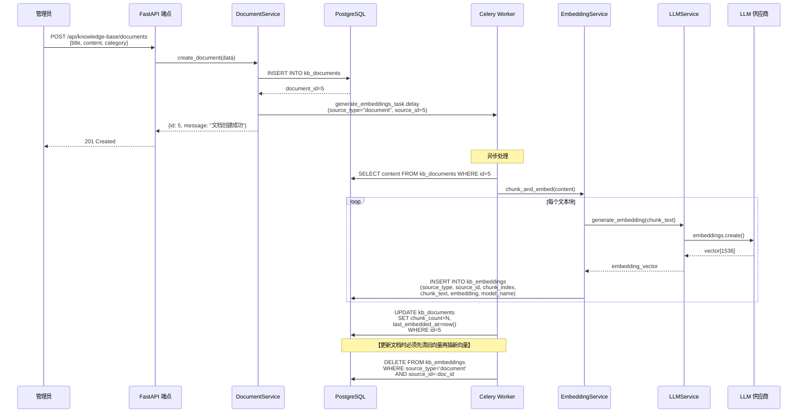
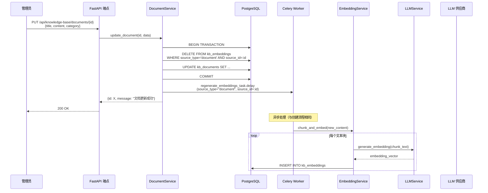

# 知识库与 RAG 增强技术规格书

| 属性 | 值 |
|------|-----|
| 版本 | v1.0 |
| 日期 | 2026-04-04 |
| 状态 | 草稿 |
| 作者 | Mulan BI Platform Team |
| 模块路径 | `backend/services/knowledge_base/` |
| API 前缀 | `/api/knowledge-base` |
| 关联规格 | [03-data-model-overview](03-data-model-overview.md), [08-llm-layer-spec](08-llm-layer-spec.md), [09-semantic-maintenance-spec](09-semantic-maintenance-spec.md) |

---

## 目录

1. [概述](#1-概述)
2. [数据模型](#2-数据模型)
3. [业务术语管理](#3-业务术语管理)
4. [知识文档管理](#4-知识文档管理)
5. [向量检索](#5-向量检索)
6. [RAG 集成](#6-rag-集成)
7. [API 设计](#7-api-设计)
8. [错误码](#8-错误码)
9. [安全](#9-安全)
10. [时序图](#10-时序图)
11. [测试策略](#11-测试策略)
12. [开放问题](#12-开放问题)

---

## 1. 概述

### 1.1 目的

知识库与 RAG（Retrieval-Augmented Generation）增强系统为 Mulan BI Platform 提供业务知识管理和 LLM 上下文增强能力。核心职责包括：

- **业务术语管理**：统一管理企业级业务术语表，建立术语到数据字段的映射关系，消除团队间的术语歧义
- **知识文档管理**：集中存储和管理业务规则、数据口径说明、分析方法论等知识文档
- **向量检索**：基于 Embedding 向量实现知识语义检索，超越关键词匹配的局限
- **RAG 增强 LLM**：在 NL-to-Query、语义生成、报表解读等 LLM 调用场景中，自动注入相关业务知识上下文，提升生成质量和业务准确性

### 1.2 范围

本规格书覆盖：
- 知识库相关数据模型（4 张新表）
- 业务术语 CRUD 与同义词映射
- 知识文档上传、编辑、分类
- Embedding 生成与 pgvector 向量检索
- RAG 流程：知识检索 → 上下文组装 → LLM 调用

本规格书不覆盖：
- LLM 供应商管理（见 [08-llm-layer-spec](08-llm-layer-spec.md)）
- 语义治理生命周期（见 [09-semantic-maintenance-spec](09-semantic-maintenance-spec.md)）
- 前端页面设计（由 PRD 定义）

### 1.3 架构定位

```
┌─────────────────────────────────────────────────────────┐
│                    前端 (React)                           │
├─────────────────────────────────────────────────────────┤
│              API 路由层 (FastAPI)                         │
│   app/api/knowledge_base.py                              │
├─────────────────────────────────────────────────────────┤
│          知识库服务层 (本规格书)                            │
│   services/knowledge_base/                               │
│     glossary_service.py    — 术语管理                     │
│     document_service.py    — 文档管理                     │
│     embedding_service.py   — Embedding 生成 + 向量检索     │
│     rag_service.py         — RAG 上下文组装                │
├─────────────────────────────────────────────────────────┤
│              依赖层                                       │
│   LLMService (08-llm)   │   PostgreSQL 16 + pgvector     │
│   SemanticService (09)   │   CryptoHelper                 │
└─────────────────────────────────────────────────────────┘
```

### 1.4 关联文档

| 文档 | 关联内容 |
|------|---------|
| [03-data-model-overview](03-data-model-overview.md) | `semantic_glossary`、`semantic_schemas` 规划表定义 |
| [08-llm-layer-spec](08-llm-layer-spec.md) | LLM `complete()` 调用接口、Prompt 模板、Token 预算 |
| [09-semantic-maintenance-spec](09-semantic-maintenance-spec.md) | 语义治理上下文，`tableau_field_semantics.synonyms_json` |
| [ARCHITECTURE.md](../ARCHITECTURE.md) | 整体架构约束、RBAC 角色体系 |

---

## 2. 数据模型

### 2.1 表清单

| 表名 | 前缀 | 说明 | 状态 |
|------|------|------|------|
| `kb_glossary` | `kb_` | 业务术语表（扩展自规划表 `semantic_glossary`） | 新建 |
| `kb_schemas` | `kb_` | 数据模型语义描述（扩展自规划表 `semantic_schemas`） | 新建 |
| `kb_documents` | `kb_` | 知识文档 | 新建 |
| `kb_embeddings` | `kb_` | 向量索引 | 新建 |

> **命名变更说明**：原规划表 `semantic_glossary` 和 `semantic_schemas`（见 [03-data-model-overview](03-data-model-overview.md) 第 7 节）重命名为 `kb_` 前缀以统一知识库模块命名空间，同时扩展字段以支持 RAG 检索。

### 2.2 `kb_glossary` — 业务术语表

| 列 | 类型 | 约束 | 默认值 | 说明 |
|----|------|------|--------|------|
| `id` | INTEGER | PK, AUTO | — | 主键 |
| `term` | VARCHAR(128) | NOT NULL, INDEX | — | 术语原文 |
| `canonical_term` | VARCHAR(128) | NOT NULL | — | 标准术语（规范化形式） |
| `synonyms_json` | JSONB | NULLABLE | `'[]'` | 同义词数组，如 `["收入", "营收", "revenue"]` |
| `definition` | TEXT | NOT NULL | — | 术语定义（业务含义） |
| `formula` | TEXT | NULLABLE | — | 计算公式（仅指标类术语） |
| `category` | VARCHAR(64) | NOT NULL | `'concept'` | 分类：`dimension` / `measure` / `concept` |
| `related_fields_json` | JSONB | NULLABLE | `'[]'` | 关联字段引用，如 `[{"datasource_id": 1, "field_name": "sales_amount"}]` |
| `source` | VARCHAR(16) | NOT NULL | `'manual'` | 来源：`manual` / `imported` / `ai_suggested` |
| `status` | VARCHAR(16) | NOT NULL | `'active'` | 状态：`active` / `deprecated` / `pending_review` |
| `created_by` | INTEGER | NULLABLE | — | 创建者 (FK → auth_users.id) |
| `updated_by` | INTEGER | NULLABLE | — | 更新者 (FK → auth_users.id) |
| `created_at` | TIMESTAMP | NOT NULL | `now()` | 创建时间 |
| `updated_at` | TIMESTAMP | NOT NULL | `now()` | 更新时间 (onupdate) |

**索引**：

| 索引名 | 列 | 类型 | 说明 |
|--------|-----|------|------|
| `uq_glossary_canonical` | `canonical_term` | UNIQUE | 标准术语唯一 |
| `ix_glossary_category` | `category` | BTREE | 按分类筛选 |
| `ix_glossary_status` | `status` | BTREE | 按状态筛选 |

> **SSOT 原则**：`kb_glossary` 是业务术语的唯一入口。即使 MVP 阶段不做与 `tableau_field_semantics.synonyms_json` 的自动同步，也强制要求团队所有术语录入必须通过 `kb_glossary` 入口，不允许直接写入下游 `synonyms_json` 字段，以避免历史脏数据。

### 2.3 `kb_schemas` — 数据模型语义描述

| 列 | 类型 | 约束 | 默认值 | 说明 |
|----|------|------|--------|------|
| `id` | INTEGER | PK, AUTO | — | 主键 |
| `datasource_id` | INTEGER | NOT NULL, INDEX | — | 关联数据源 (FK → bi_data_sources.id) |
| `schema_yaml` | TEXT | NOT NULL | — | YAML 格式 Schema 描述 |
| `description` | TEXT | NULLABLE | — | 人工摘要描述 |
| `version` | INTEGER | NOT NULL | `1` | 版本号 |
| `auto_generated` | BOOLEAN | NOT NULL | `false` | 是否由 LLM 自动生成 |
| `created_by` | INTEGER | NULLABLE | — | 创建者 |
| `created_at` | TIMESTAMP | NOT NULL | `now()` | 创建时间 |
| `updated_at` | TIMESTAMP | NOT NULL | `now()` | 更新时间 (onupdate) |

**索引**：

| 索引名 | 列 | 类型 | 说明 |
|--------|-----|------|------|
| `uq_schema_ds_version` | `(datasource_id, version)` | UNIQUE | 同一数据源版本唯一 |

**`schema_yaml` YAML Schema 规范（v1 版本）**：

`schema_yaml` 采用以下固定结构契约，不得自行扩展未列出的顶级字段：

```yaml
version: "1.0"                    # 固定为 "1.0"，供未来格式版本演进
datasource_name: "Superstore"    # 数据源显示名，供 Embedding 文本构造使用

tables:
  - name: "orders"                # 表物理名称（必填）
    description: "销售订单事实表"  # 表级业务描述（必填）
    alias: "订单"                 # 业务别名（可选）
    columns:
      - name: "order_id"          # 列物理名称（必填）
        type: "string"           # 数据类型（必填）
        description: "订单唯一主键" # 列级业务描述（必填）
        is_primary_key: true      # 是否为主键（可选，默认 false）
        is_foreign_key: false    # 是否为外键（可选，默认 false）
        referenced_table: null    # 若为外键，填写目标表名（可选）
        enum_values:             # 枚举值约束（可选，无约束则不填）
          - "pending"
          - "shipped"
          - "completed"
  - name: "users"
    description: "用户维度表"
    alias: "用户"
    columns:
      - name: "user_id"
        type: "string"
        description: "用户唯一标识"
        is_primary_key: true

relationships:
  - type: "many_to_one"          # 关系类型：many_to_one / one_to_many / one_to_one
    from_table: "orders"
    from_column: "user_id"
    to_table: "users"
    to_column: "user_id"
    description: "订单归属用户"    # 关系业务含义（可选）
```

**Embedding 文本构造格式**（`source_type=schema`）：

```
{datasource_name} 数据模型:
- 表: {table.name}（{table.alias}）：{table.description}
  字段: {col.name}({col.type}): {col.description}
- 关系: {relationship.description}
```

**解析约束**：
- `schema_yaml` 内容在写入前必须通过 YAML 语法校验，校验失败返回 `KB_010`
- `tables[].columns[].name` 和 `tables[].name` 为必填字段，缺失则视为脏数据，不生成 Embedding
- 版本升级时（`version` 字段递增），旧版本 `schema_yaml` 保留用于历史溯源

### 2.4 `kb_documents` — 知识文档

| 列 | 类型 | 约束 | 默认值 | 说明 |
|----|------|------|--------|------|
| `id` | INTEGER | PK, AUTO | — | 主键 |
| `title` | VARCHAR(256) | NOT NULL | — | 文档标题 |
| `content` | TEXT | NOT NULL | — | 文档内容（Markdown 或纯文本） |
| `format` | VARCHAR(16) | NOT NULL | `'markdown'` | 格式：`markdown` / `text` |
| `category` | VARCHAR(64) | NOT NULL | `'general'` | 分类：`business_rule` / `data_dictionary` / `methodology` / `faq` / `general` |
| `tags_json` | JSONB | NULLABLE | `'[]'` | 标签数组 |
| `status` | VARCHAR(16) | NOT NULL | `'active'` | 状态：`active` / `archived` |
| `chunk_count` | INTEGER | NOT NULL | `0` | 已生成的文本块数（关联 kb_embeddings） |
| `last_embedded_at` | TIMESTAMP | NULLABLE | — | 最后 Embedding 生成时间 |
| `created_by` | INTEGER | NULLABLE | — | 创建者 |
| `updated_by` | INTEGER | NULLABLE | — | 更新者 |
| `created_at` | TIMESTAMP | NOT NULL | `now()` | 创建时间 |
| `updated_at` | TIMESTAMP | NOT NULL | `now()` | 更新时间 (onupdate) |

**索引**：

| 索引名 | 列 | 类型 | 说明 |
|--------|-----|------|------|
| `ix_doc_category` | `category` | BTREE | 按分类筛选 |
| `ix_doc_status` | `status` | BTREE | 按状态筛选 |

### 2.5 `kb_embeddings` — 向量索引

| 列 | 类型 | 约束 | 默认值 | 说明 |
|----|------|------|--------|------|
| `id` | INTEGER | PK, AUTO | — | 主键 |
| `source_type` | VARCHAR(32) | NOT NULL | — | 来源类型：`glossary` / `document` / `schema` / `field_semantic` |
| `source_id` | INTEGER | NOT NULL | — | 来源记录 ID |
| `chunk_index` | INTEGER | NOT NULL | `0` | 文本块序号（文档拆分场景） |
| `chunk_text` | TEXT | NOT NULL | — | 原始文本块 |
| `embedding` | VECTOR | NOT NULL | — | 向量（pgvector，维度由 model_name 指定） |
| `model_name` | VARCHAR(128) | NOT NULL | — | 生成 Embedding 的模型名，如 `text-embedding-3-small` |
| `token_count` | INTEGER | NULLABLE | — | 文本块 Token 数 |
| `created_at` | TIMESTAMP | NOT NULL | `now()` | 创建时间 |

**索引**：

| 索引名 | 列 | 类型 | 说明 |
|--------|-----|------|------|
| `ix_emb_source` | `(source_type, source_id)` | BTREE | 按来源查询 |
| `ix_emb_vector` | `embedding` | HNSW (m=16, ef_construction=200) | 向量近似最近邻检索 |

> **pgvector 说明**：采用 HNSW 索引，相比 IVFFlat 在数据量小（<万条）时无精度缺失、无冷启动问题，且整体检索性能更优。`VECTOR` 类型不硬编码维度上限（PG 16 + pgvector 0.5+ 支持动态维度），由 `model_name` 字段追踪实际模型，按需切换 Embedding 模型时无需修改表结构。

### 2.6 ER 关系图



---

## 3. 业务术语管理

### 3.1 术语 CRUD

| 操作 | 说明 | 副作用 |
|------|------|--------|
| 创建术语 | 填写 term、canonical_term、definition、category，可选 synonyms、formula、related_fields | 自动触发 Embedding 生成（异步） |
| 更新术语 | 修改任意字段，version 不单独维护（通过 `updated_at` 追踪） | **在同一数据库事务中，先 `DELETE FROM kb_embeddings WHERE source_type = 'glossary' AND source_id = :id`，再重新生成 Embedding（异步）** |
| 删除术语（软删除） | `data_admin`：`status → deprecated` | 仅更新状态，**保留** `kb_embeddings` 记录（历史可查） |
| 删除术语（硬删除） | `admin`：物理删除 | **在同一事务中，先 `DELETE FROM kb_embeddings WHERE source_type = 'glossary' AND source_id = :id`，再删除术语记录** |
| 查询术语 | 支持按 category、status 筛选，支持关键词搜索 term + synonyms | — |

### 3.2 同义词映射

同义词存储在 `synonyms_json` 字段中，为 JSON 字符串数组：

```json
["收入", "营收", "Revenue", "Sales Revenue", "销售额"]
```

**同义词解析流程**：

1. NL-to-Query 场景中，用户输入经过术语匹配
2. 匹配逻辑：`term` 精确匹配 → `canonical_term` 精确匹配 → `synonyms_json` 包含匹配
3. 匹配成功后，返回 `canonical_term` 和 `related_fields_json` 用于字段定位
4. 匹配结果注入 LLM Prompt 的 `{term_mappings}` 变量（参见 [08-llm-layer-spec](08-llm-layer-spec.md) 5.3 节）

### 3.3 术语分类

| 分类 | 代码 | 说明 | 示例 |
|------|------|------|------|
| 维度 | `dimension` | 用于分组和筛选的分类字段 | "区域"、"产品线"、"客户等级" |
| 指标 | `measure` | 可聚合的数值字段 | "销售额"、"毛利率"、"DAU" |
| 业务概念 | `concept` | 非直接对应字段的业务概念 | "活跃用户"、"复购率"、"LTV" |

`concept` 类术语通常带有 `formula` 字段，描述其计算逻辑（如 `"复购率 = 复购用户数 / 总购买用户数"`），供 LLM 理解业务语义。

---

## 4. 知识文档管理

### 4.1 文档生命周期

```
创建 → active → (编辑/更新) → active → 归档(archived)
                                        ↓
                                   恢复(active)
```

### 4.2 支持格式

| 格式 | 代码 | 说明 |
|------|------|------|
| Markdown | `markdown` | 默认格式，支持标题、列表、代码块、表格 |
| 纯文本 | `text` | 无格式纯文本 |

> **V1 限制**：不支持文件上传（PDF、Word 等），仅支持文本内容直接输入。文件上传功能列为后续迭代。

### 4.3 文档分类

| 分类 | 代码 | 典型内容 |
|------|------|---------|
| 业务规则 | `business_rule` | 指标口径定义、业务逻辑说明 |
| 数据字典 | `data_dictionary` | 表/字段含义、枚举值说明 |
| 分析方法论 | `methodology` | 分析框架、常见分析思路 |
| 常见问题 | `faq` | 数据异常排查、常见问答 |
| 通用 | `general` | 其他知识内容 |

### 4.4 文本分块策略

文档内容在生成 Embedding 前需要分块（Chunking），策略如下：

| 参数 | 值 | 说明 |
|------|-----|------|
| 分块大小 | 512 tokens | 单块最大 Token 数 |
| 重叠大小 | 64 tokens | 相邻块重叠 Token 数 |
| 分割优先级 | 段落 → 句子 → 固定长度 | 优先按自然语义边界分割 |
| **Token 计数工具** | **tiktoken（cl100k_base 编码）** | **严禁使用字符数估算** |

- Markdown 格式按 `## ` 标题分段，每段独立分块
- 短文档（< 512 tokens）不分块，整体生成单条 Embedding
- 分块结果写入 `kb_embeddings`，`chunk_index` 从 0 递增
- **Token 截断算法**：`tiktoken.encoding_for_model("gpt-4")` 获取 `cl100k_base` 编码，对文本直接编码后按 token 偏移量切分。中文字符约合 1-2 tokens（取决于具体字符），严禁使用 `len(text) * 1.5` 等字符估算方式，否则不同内容密度差异会导致实际 Token 数严重偏离 512 上限
- 重叠块边界：以 `tiktoken.encode()` 获得的 token 偏移量为准，确保相邻两块有 64 tokens 重叠

---

## 5. 向量检索

### 5.1 Embedding 生成

Embedding 生成通过 LLM Layer 的扩展接口实现，复用现有 LLMService 的供应商管理和密钥加密基础设施。

**生成流程**：

1. 知识内容变更时（术语创建/更新、文档保存），触发异步 Embedding 生成任务
2. 调用 LLMService 扩展方法 `generate_embedding(text) -> List[float]`
3. 内部路由到 OpenAI `embeddings.create()` 接口（模型：`text-embedding-3-small`）
4. 向量结果写入 `kb_embeddings` 表

**Embedding 文本构造**：

| 来源类型 | 文本格式 |
|---------|---------|
| `glossary` | `"{canonical_term}: {definition}。同义词: {synonyms}。公式: {formula}"` |
| `document` | 分块后的原始文本 |
| `schema` | `"{datasource_name} 数据模型: {description}。{schema_yaml 摘要}"` |
| `field_semantic` | `"{semantic_name_zh}({semantic_name}): {semantic_definition}"` |

### 5.2 PostgreSQL pgvector 扩展

**安装要求**：

```sql
-- 启用扩展（需要 superuser 权限，在 Alembic 迁移中执行）
CREATE EXTENSION IF NOT EXISTS vector;
```

**Docker 配置更新**（`docker-compose.yml`）：

```yaml
services:
  postgres:
    image: pgvector/pgvector:pg16  # 替换原 postgres:16-alpine
```

### 5.3 相似度检索

使用余弦相似度（cosine similarity）进行向量检索：

```sql
SELECT
    source_type,
    source_id,
    chunk_text,
    1 - (embedding <=> :query_embedding) AS similarity
FROM kb_embeddings
WHERE 1 - (embedding <=> :query_embedding) > :threshold
ORDER BY embedding <=> :query_embedding
LIMIT :top_k;
```

**检索参数**：

| 参数 | 默认值 | 说明 |
|------|--------|------|
| `top_k` | 5 | 返回最相似的 K 条结果 |
| `threshold` | 0.7 | 最低相似度阈值（低于此值不返回） |
| `source_type_filter` | `null` | 可选，按来源类型筛选 |

---

## 6. RAG 集成

### 6.1 知识库 → LLM 上下文注入流程

RAG 增强发生在所有 LLM 调用场景中，通过 `RAGService` 在调用 `LLMService.complete()` 之前组装上下文：

```
用户问题 / 业务场景
       │
       ▼
┌─────────────────┐
│  1. 术语匹配     │  ← 精确匹配 term / canonical_term / synonyms
│     (同步)       │
└────────┬────────┘
         │
         ▼
┌─────────────────┐
│  2. 向量检索     │  ← Embedding 相似度检索 kb_embeddings
│     (同步)       │
└────────┬────────┘
         │
         ▼
┌─────────────────┐
│  3. 上下文组装   │  ← 按优先级裁剪，控制 Token 预算
└────────┬────────┘
         │
         ▼
┌─────────────────┐
│  4. LLM 调用    │  ← LLMService.complete(prompt + rag_context)
└─────────────────┘
```

### 6.2 Token 预算分配

在 [ARCHITECTURE.md](../ARCHITECTURE.md) §6.1 中定义的单次调用上下文 <= 3000 tokens 预算基础上，RAG 上下文的 Token 分配如下：

| 预算段 | Token 上限 | 内容 |
|--------|-----------|------|
| System Prompt | 200 | 角色定义 + 输出格式约束 |
| 数据上下文 | 1200 | 字段元数据、计算字段公式（原有） |
| **RAG 知识上下文** | **动态**（见下方公式） | 术语定义 + 知识文档片段（新增） |
| 用户指令 | 800 | 用户问题 + 操作要求 |
| **合计** | **<= 3000** | — |

**动态 Token 预算公式**：

```
RAG可用预算 = 3000 - System Prompt(200) - 数据上下文实际占用 - 用户指令(800)
```

其中「数据上下文实际占用」按 `{字段数 × 平均字段描述 Token}` 动态计算（经验值：单字段约 30 Token）。RAG 预算最小不低于 200 Token。

### 6.3 RAG 上下文优先级

当检索结果超出动态计算的 RAG Token 预算时，按以下优先级裁剪：

| 优先级 | 来源 | 说明 |
|--------|------|------|
| P0 | 术语精确匹配结果 | 始终保留，包含 canonical_term + definition + formula |
| P1 | 向量检索 — glossary 类型 | 与问题高度相关的术语解释 |
| P2 | 向量检索 — document 类型 | 相关知识文档片段 |
| P3 | 向量检索 — schema 类型 | 数据模型描述 |
| P4 | 向量检索 — field_semantic 类型 | 字段语义补充信息 |

裁剪规则：
1. P0 始终保留（通常 < 200 tokens）
2. P1-P4 按优先级依次填充，直到达到动态计算的 RAG Token 上限
3. 同优先级内按 similarity 降序排列，取前 N 条

### 6.4 上下文注入格式

RAG 上下文以结构化文本块注入 Prompt：

```
【业务知识参考】
[术语] 销售额: 指已确认收入的订单金额，不含退货和折扣。计算公式: SUM(order_amount) WHERE status='completed'。
[术语] 活跃用户: 过去30天内至少登录1次的用户。同义词: DAU(日活), MAU(月活)。
[知识] 收入确认规则：订单状态为"已完成"且发货超过7天视为收入确认...
[模型] Superstore 数据源包含 Orders、Returns、People 三张主表，通过 Order ID 关联...
```

### 6.5 相关性阈值

| 场景 | 阈值 | 说明 |
|------|------|------|
| NL-to-Query | 0.75 | 高阈值，避免无关知识干扰查询生成 |
| 资产解读 | 0.65 | 中阈值，允许更广泛的背景知识 |
| 语义生成 | 0.70 | 标准阈值 |
| 知识搜索 API | 0.50 | 低阈值，用户主动搜索场景，宁多勿漏 |

---

## 7. API 设计

### 7.1 端点总览

| 方法 | 路径 | 权限 | 说明 |
|------|------|------|------|
| `GET` | `/api/knowledge-base/glossary` | analyst+ | 查询术语列表 |
| `POST` | `/api/knowledge-base/glossary` | data_admin+ | 创建术语 |
| `GET` | `/api/knowledge-base/glossary/{id}` | analyst+ | 获取术语详情 |
| `PUT` | `/api/knowledge-base/glossary/{id}` | data_admin+ | 更新术语 |
| `DELETE` | `/api/knowledge-base/glossary/{id}` | admin | 删除术语 |
| `GET` | `/api/knowledge-base/documents` | analyst+ | 查询文档列表 |
| `POST` | `/api/knowledge-base/documents` | data_admin+ | 创建文档 |
| `GET` | `/api/knowledge-base/documents/{id}` | analyst+ | 获取文档详情 |
| `PUT` | `/api/knowledge-base/documents/{id}` | data_admin+ | 更新文档 |
| `DELETE` | `/api/knowledge-base/documents/{id}` | admin | 删除文档 |
| `POST` | `/api/knowledge-base/search` | analyst+ | 知识语义搜索 |

### 7.2 GET /api/knowledge-base/glossary

查询术语列表，支持分页和筛选。

**查询参数**：

| 参数 | 类型 | 必填 | 默认值 | 说明 |
|------|------|------|--------|------|
| `page` | int | 否 | `1` | 页码 |
| `page_size` | int | 否 | `20` | 每页条数（上限 100） |
| `category` | string | 否 | — | 按分类筛选 |
| `status` | string | 否 | `active` | 按状态筛选 |
| `keyword` | string | 否 | — | 关键词搜索（匹配 term、canonical_term、synonyms） |

**响应 200**：

```json
{
  "total": 42,
  "page": 1,
  "page_size": 20,
  "items": [
    {
      "id": 1,
      "term": "销售额",
      "canonical_term": "销售额",
      "synonyms": ["收入", "营收", "Sales Revenue"],
      "definition": "指已确认收入的订单金额，不含退货和折扣",
      "formula": "SUM(order_amount) WHERE status='completed'",
      "category": "measure",
      "related_fields": [
        {"datasource_id": 1, "field_name": "sales_amount"}
      ],
      "source": "manual",
      "status": "active",
      "created_at": "2026-04-01T10:00:00",
      "updated_at": "2026-04-01T10:00:00"
    }
  ]
}
```

### 7.3 POST /api/knowledge-base/glossary

创建业务术语。

**请求体**：

| 字段 | 类型 | 必填 | 说明 |
|------|------|------|------|
| `term` | string | 是 | 术语原文 |
| `canonical_term` | string | 是 | 标准术语 |
| `definition` | string | 是 | 定义 |
| `synonyms` | string[] | 否 | 同义词 |
| `formula` | string | 否 | 计算公式 |
| `category` | string | 否 | 分类（默认 `concept`） |
| `related_fields` | object[] | 否 | 关联字段 |

**响应 201**：

```json
{
  "id": 1,
  "message": "术语创建成功"
}
```

**响应 409**：`canonical_term` 已存在

### 7.4 PUT /api/knowledge-base/glossary/{id}

更新术语，请求体字段同创建（均可选），返回更新后的完整术语对象。

### 7.5 DELETE /api/knowledge-base/glossary/{id}

- `data_admin`：软删除（`status → deprecated`）
- `admin`：硬删除（同时清理 `kb_embeddings` 关联记录）

### 7.6 POST /api/knowledge-base/documents

创建知识文档。

**请求体**：

| 字段 | 类型 | 必填 | 说明 |
|------|------|------|------|
| `title` | string | 是 | 标题 |
| `content` | string | 是 | 内容 |
| `format` | string | 否 | 格式（默认 `markdown`） |
| `category` | string | 否 | 分类（默认 `general`） |
| `tags` | string[] | 否 | 标签 |

**响应 201**：

```json
{
  "id": 1,
  "message": "文档创建成功",
  "chunk_count": 3
}
```

**副作用**：异步触发 Embedding 生成，完成后更新 `chunk_count` 和 `last_embedded_at`。

### 7.7 POST /api/knowledge-base/search

知识库语义搜索，结合关键词匹配和向量检索。

**请求体**：

| 字段 | 类型 | 必填 | 默认值 | 说明 |
|------|------|------|--------|------|
| `query` | string | 是 | — | 搜索文本 |
| `top_k` | int | 否 | `10` | 返回条数上限 |
| `source_types` | string[] | 否 | 全部 | 限定来源类型 |
| `threshold` | float | 否 | `0.50` | 最低相似度 |

**响应 200**：

```json
{
  "results": [
    {
      "source_type": "glossary",
      "source_id": 1,
      "title": "销售额",
      "content": "指已确认收入的订单金额，不含退货和折扣",
      "similarity": 0.92
    },
    {
      "source_type": "document",
      "source_id": 5,
      "title": "收入确认规则",
      "content": "订单状态为已完成且发货超过7天视为收入确认...",
      "similarity": 0.81
    }
  ]
}
```

---

## 8. 错误码

| 错误码 | HTTP 状态码 | 触发条件 | 错误消息 |
|--------|------------|----------|----------|
| `KB_001` | 404 | 术语不存在或已删除 | 术语不存在 |
| `KB_002` | 409 | `canonical_term` 重复 | 标准术语已存在 |
| `KB_003` | 400 | 术语必填字段缺失 | 术语定义不能为空 |
| `KB_004` | 404 | 文档不存在或已归档 | 文档不存在 |
| `KB_005` | 400 | 文档内容为空 | 文档内容不能为空 |
| `KB_006` | 400 | 不支持的文档格式 | 不支持的格式: {format} |
| `KB_007` | 502 | Embedding 生成失败（LLM 不可用或超时） | Embedding 生成失败 |
| `KB_008` | 500 | pgvector 扩展未安装或查询异常 | 向量检索服务不可用 |
| `KB_009` | 400 | 搜索 query 为空 | 搜索内容不能为空 |
| `KB_010` | 400 | 不支持的 source_type | 不支持的知识来源类型: {type} |

---

## 9. 安全

### 9.1 权限矩阵

| 操作 | admin | data_admin | analyst | user |
|------|:-----:|:----------:|:-------:|:----:|
| 术语查询/搜索 | Y | Y | Y | - |
| 术语创建/更新 | Y | Y | - | - |
| 术语删除（硬删除） | Y | - | - | - |
| 术语软删除 | Y | Y | - | - |
| 文档查询 | Y | Y | Y | - |
| 文档创建/更新 | Y | Y | - | - |
| 文档删除 | Y | - | - | - |
| 知识搜索 | Y | Y | Y | - |
| Schema 管理 | Y | Y | - | - |

### 9.2 数据安全

- **LLM 隔离**：Embedding 生成仅发送术语定义和文档内容，不发送实际业务数据值
- **敏感度继承**：`kb_schemas` 关联的数据源若敏感度为 `HIGH` 或 `CONFIDENTIAL`，则该 Schema 不参与 RAG 检索
- **内容审核**：`ai_suggested` 来源的术语默认 `status = pending_review`，需人工审核后才进入 RAG 知识库

### 9.3 操作日志

所有知识库写操作记录到 `bi_operation_logs`：

| 操作类型 | `operation_type` 值 |
|---------|---------------------|
| 术语创建 | `kb_glossary_create` |
| 术语更新 | `kb_glossary_update` |
| 术语删除 | `kb_glossary_delete` |
| 文档创建 | `kb_document_create` |
| 文档更新 | `kb_document_update` |
| 文档删除 | `kb_document_delete` |

---

## 10. 时序图

### 10.1 RAG 增强查询流程（NL-to-Query 场景）



### 10.2 知识文档 Embedding 生成流程





---

## 11. 测试策略

### 11.1 单元测试

| 测试项 | 测试内容 | Mock 对象 |
|--------|---------|-----------|
| 术语 CRUD | 创建/查询/更新/删除术语，唯一约束验证 | 测试数据库 |
| 同义词匹配 | 精确匹配 term → canonical_term → synonyms 的优先级 | 无 |
| 文本分块 | 按 512 Token 分块，重叠 64 Token，Markdown 标题边界 | 无 |
| Embedding 文本构造 | 各 source_type 的文本格式拼接正确性 | 无 |
| Token 预算裁剪 | 超出 800 Token 时按优先级正确裁剪 | 无 |
| RAG 上下文组装 | 术语匹配 + 向量检索结果合并、去重、排序 | `EmbeddingService` |

### 11.2 集成测试

| 测试项 | 说明 |
|--------|------|
| pgvector 可用性 | 验证 `CREATE EXTENSION vector` 成功，`VECTOR` 类型可用 |
| 向量检索精度 | 已知文档对应已知查询，验证 top-1 结果正确 |
| Embedding 异步生成 | 创建文档后，Celery Worker 正确生成 Embedding 并写入 |
| RAG 端到端 | NL-to-Query 注入 RAG 上下文后，生成查询比无 RAG 时更准确 |
| API 权限校验 | analyst 只读、data_admin 可写、user 无权限 |

### 11.3 性能测试

| 测试项 | 目标 |
|--------|------|
| 向量检索延迟 | 10 万条 Embedding 下，top-5 检索 < 100ms |
| Embedding 生成吞吐 | 单文档（5000 字）Embedding 生成 < 10s |
| RAG 上下文组装 | 含术语匹配 + 向量检索的完整 RAG 流程 < 500ms（不含 LLM 调用） |

### 11.4 安全测试

| 测试项 | 说明 |
|--------|------|
| 权限隔离 | user 角色无法访问知识库 API |
| 敏感数据隔离 | HIGH/CONFIDENTIAL 数据源的 Schema 不出现在 RAG 结果中 |
| AI 建议审核 | `ai_suggested` 术语在 `pending_review` 状态时不参与 RAG |

---

## 12. 开放问题

| 编号 | 问题 | 优先级 | 状态 |
|------|------|--------|------|
| OI-01 | Embedding 维度不再硬编码，VECTOR 类型支持动态维度，切换 Embedding 模型时通过 `model_name` 追踪，无需迁移表结构。是否需要支持多模型 Embedding 共存？ | P1 | 已解决（动态维度） |
| OI-02 | HNSW 索引参数（m=16, ef_construction=200）在不同数据量级下的最优配置是否需要调优？ | P2 | 已采用 HNSW，参数按需调优 |
| OI-03 | 文档分块参数（512 tokens / 64 overlap）为初始值，是否需要提供管理员可配置化能力？ | P3 | 待讨论 |
| OI-04 | RAG 上下文 800 Token 预算是否充足？复杂业务场景可能需要更多知识上下文，但会压缩数据上下文和用户指令空间。 | P1 | 待验证 |
| OI-05 | `kb_glossary` 与 `tableau_field_semantics.synonyms_json` 存在数据重叠，是否需要建立同步机制？ | P2 | 待设计 |
| OI-06 | V1 不支持文件上传（PDF/Word），后续迭代是否需要集成文档解析引擎（如 Apache Tika）？ | P3 | 待规划 |
| OI-07 | Embedding 生成依赖 LLM 供应商在线服务，离线场景是否需要支持本地 Embedding 模型（如 sentence-transformers）？ | P2 | 待讨论 |
| OI-08 | `kb_schemas` 的 `schema_yaml` 格式尚未标准化，需要定义 YAML Schema 规范（字段定义、关系描述等）。 | P1 | ✅ 已解决（见 §2.3 YAML Schema 规范 v1.0） |
| OI-09 | RAG 检索结果的相关性阈值是否需要按场景动态调整，还是固定配置即可？ | P3 | 待讨论 |
