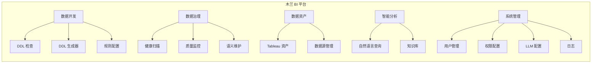
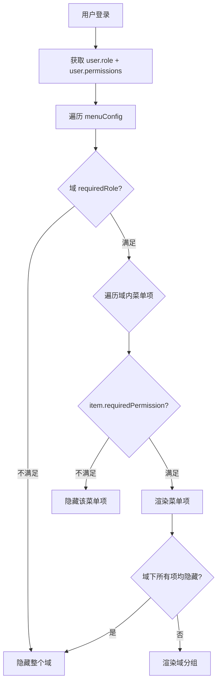
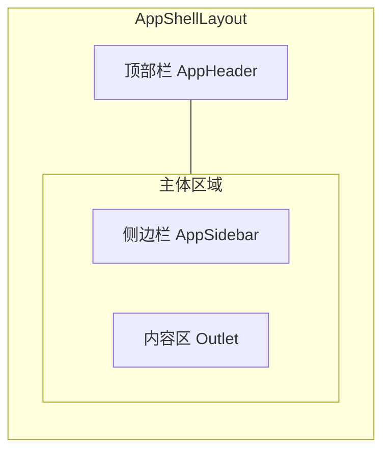
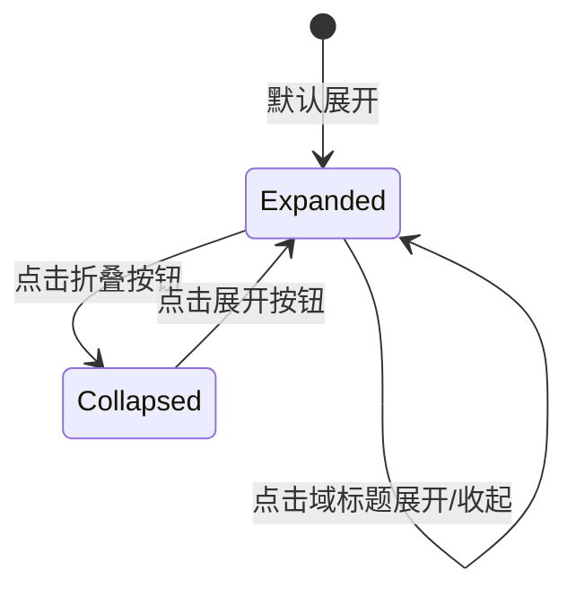

# 5 域菜单重构技术规格书

> 版本：v0.1 | 状态：草稿 | 日期：2026-04-04 | 关联 PRD：待补充

---

## 1. 概述

### 1.1 目的

当前 Mulan BI Platform 的导航结构为扁平的顶部导航栏（`Navbar.tsx` 中 5 个硬编码条目）+ 管理后台侧边栏（`AdminSidebarLayout.tsx` 中 6 个条目），随着功能模块增长已出现以下问题：

- 顶部导航无分组，用户需记忆每个入口的位置
- 管理后台与业务页面使用不同布局组件（`MainLayout` vs `AdminSidebarLayout`），切换时体验割裂
- 新增页面时缺乏归属域指引，导致路由路径命名不一致

本规格书将现有扁平菜单重构为 **5 个业务域**的分组侧边栏导航，统一布局体验。

### 1.2 范围

- **包含**：菜单域定义、路由重构、侧边栏组件设计、权限可见性控制、代码分割策略
- **不包含**：新功能页面开发、后端 API 变更、移动端适配

### 1.3 关联文档

| 文档 | 路径 | 关系 |
|------|------|------|
| 架构规范 | `docs/ARCHITECTURE.md` | 路由与权限约定 |
| API 约定 | `docs/specs/02-api-conventions.md` | RBAC 权限矩阵 |
| Auth Spec | `docs/specs/04-auth-rbac-spec.md` | 角色定义 |
| 语义维护 Spec | `docs/specs/09-semantic-maintenance-spec.md` | 语义维护路由 |

---

## 2. 菜单域定义

### 2.1 5 域总览



### 2.2 域详细定义

#### 域 1：数据开发（Data Development）

| 菜单项 | 路由路径 | 现有页面 | 图标 | 说明 |
|--------|---------|---------|------|------|
| DDL 检查 | `/dev/ddl-validator` | `ddl-validator/page.tsx` | `ri-code-s-slash-line` | DDL 合规性检查 |
| DDL 生成器 | `/dev/ddl-generator` | 待开发 | `ri-file-code-line` | AI 辅助生成 DDL |
| 规则配置 | `/dev/rule-config` | `rule-config/page.tsx` | `ri-settings-3-line` | DDL 检查规则管理 |

**域图标**：`ri-terminal-box-line`
**域描述**：数据库开发工具与规范管理

---

#### 域 2：数据治理（Data Governance）

| 菜单项 | 路由路径 | 现有页面 | 图标 | 说明 |
|--------|---------|---------|------|------|
| 健康扫描 | `/governance/health` | `data-governance/health/page.tsx` | `ri-heart-pulse-line` | 数仓健康扫描 |
| 质量监控 | `/governance/quality` | `data-governance/quality/page.tsx` | `ri-shield-check-line` | 数据质量规则监控 |
| 语义维护 — 数据源 | `/governance/semantic/datasources` | `semantic-maintenance/datasource-list/page.tsx` | `ri-database-2-line` | 数据源语义管理 |
| 语义维护 — 字段 | `/governance/semantic/fields` | `semantic-maintenance/field-list/page.tsx` | `ri-list-settings-line` | 字段语义管理 |
| 发布日志 | `/governance/semantic/publish-logs` | 待开发（Spec 19） | `ri-file-list-3-line` | 语义发布记录 |

**域图标**：`ri-shield-star-line`
**域描述**：数据质量、语义治理与合规管理

---

#### 域 3：数据资产（Data Assets）

| 菜单项 | 路由路径 | 现有页面 | 图标 | 说明 |
|--------|---------|---------|------|------|
| Tableau 资产 | `/assets/tableau` | `tableau/assets/page.tsx` | `ri-bar-chart-box-line` | Tableau 工作簿/视图/数据源浏览 |
| Tableau 资产详情 | `/assets/tableau/:id` | `tableau/asset-detail/page.tsx` | — | 动态路由，不在菜单显示 |
| Tableau 健康 | `/assets/tableau-health` | `tableau/health/page.tsx` | `ri-pulse-line` | Tableau 资产健康概览 |
| 数据源管理 | `/assets/datasources` | `admin/datasources/page.tsx` | `ri-database-2-line` | 数据库连接管理 |
| Tableau 连接 | `/assets/tableau-connections` | `tableau/connections/page.tsx` | `ri-links-line` | Tableau Server 连接管理 |
| 同步日志 | `/assets/tableau-connections/:connId/sync-logs` | `tableau/sync-logs/page.tsx` | — | 动态路由，不在菜单显示 |

**域图标**：`ri-stack-line`
**域描述**：BI 资产浏览与数据源连接管理

---

#### 域 4：智能分析（Intelligent Analytics）

| 菜单项 | 路由路径 | 现有页面 | 图标 | 说明 |
|--------|---------|---------|------|------|
| 自然语言查询 | `/analytics/nl-query` | 待开发 | `ri-chat-search-line` | NL-to-Query 对话式查询 |
| 知识库 | `/analytics/knowledge` | `knowledge/page.tsx` | `ri-book-open-line` | 业务知识库管理 |

**域图标**：`ri-brain-line`
**域描述**：AI 驱动的数据分析与知识管理

---

#### 域 5：系统管理（System Admin）

| 菜单项 | 路由路径 | 现有页面 | 图标 | 说明 |
|--------|---------|---------|------|------|
| 用户管理 | `/system/users` | `admin/user-management/page.tsx` | `ri-user-settings-line` | 用户账号管理 |
| 用户组 | `/system/groups` | `admin/groups/page.tsx` | `ri-team-line` | 用户组管理 |
| 权限配置 | `/system/permissions` | `admin/permissions/page.tsx` | `ri-shield-keyhole-line` | 角色权限矩阵 |
| LLM 配置 | `/system/llm` | `admin/llm/page.tsx` | `ri-robot-line` | AI 模型配置 |
| 任务管理 | `/system/tasks` | `admin/tasks/page.tsx` | `ri-task-line` | Celery 任务监控 |
| 操作日志 | `/system/activity` | `admin/activity/page.tsx` | `ri-history-line` | 用户操作审计日志 |

**域图标**：`ri-settings-2-line`
**域描述**：平台配置、用户管理与系统监控

---

## 3. 权限与菜单可见性

### 3.1 角色-域可见性矩阵

| 菜单域 | admin | data_admin | analyst | user |
|--------|:-----:|:----------:|:-------:|:----:|
| 数据开发 | 全部 | 全部 | DDL 检查 | DDL 检查 |
| 数据治理 | 全部 | 全部 | 健康扫描(只读) + 语义(只读) | 不可见 |
| 数据资产 | 全部 | 全部 | Tableau 资产(只读) | 不可见 |
| 智能分析 | 全部 | 全部 | 全部 | 知识库(只读) |
| 系统管理 | 全部 | 不可见 | 不可见 | 不可见 |

### 3.2 菜单项级权限控制



### 3.3 权限数据结构

```typescript
interface MenuPermission {
  /** 需要的最低角色等级 */
  requiredRole?: 'admin' | 'data_admin' | 'analyst' | 'user';
  /** 需要的具体权限标识（与 ProtectedRoute requiredPermission 一致） */
  requiredPermission?: string;
  /** admin 专属（等价于 requiredRole: 'admin'） */
  adminOnly?: boolean;
}
```

---

## 4. 路由结构

### 4.1 新旧路由映射

| 现有路由 | 新路由 | 重定向 |
|---------|--------|--------|
| `/ddl-validator` | `/dev/ddl-validator` | 301 |
| `/rule-config` | `/dev/rule-config` | 301 |
| `/data-governance/health` | `/governance/health` | 301 |
| `/data-governance/quality` | `/governance/quality` | 301 |
| `/semantic-maintenance/datasources` | `/governance/semantic/datasources` | 301 |
| `/semantic-maintenance/datasources/:id` | `/governance/semantic/datasources/:id` | 301 |
| `/semantic-maintenance/fields` | `/governance/semantic/fields` | 301 |
| `/tableau/assets` | `/assets/tableau` | 301 |
| `/tableau/assets/:id` | `/assets/tableau/:id` | 301 |
| `/tableau/health` | `/assets/tableau-health` | 301 |
| `/tableau/connections` | `/assets/tableau-connections` | 301 |
| `/admin/users` | `/system/users` | 301 |
| `/admin/groups` | `/system/groups` | 301 |
| `/admin/permissions` | `/system/permissions` | 301 |
| `/admin/llm` | `/system/llm` | 301 |
| `/admin/activity` | `/system/activity` | 301 |
| `/admin/tasks` | `/system/tasks` | 301 |
| `/admin/datasources` | `/assets/datasources` | 301 |
| `/admin/tableau/connections` | `/assets/tableau-connections` | 301 |
| `/knowledge/:sub` | `/analytics/knowledge` | 301 |

> ### ⚠️ 强制约束：前后端路由解耦
>
> **本次重构仅限于前端视图路由（React Router 路径），绝对禁止修改后端 API 路径。**
>
> 前端 `src/api/` 目录下所有通过 Axios / Fetch 调用的后端接口 URL（如 `/api/admin/datasources`、`/api/governance/quality/rules` 等）必须**保持原样**，不得因批量 Search & Replace 路由路径而被错误替换。
>
> 判断规则：
> - 路径以 `/api/` 开头 → **不动**
> - 路径以 `/dev/`、`/governance/`、`/assets/`、`/analytics/`、`/system/` 开头 → **是前端视图路由，可以迁移**
>
> 违规后果：批量替换后端 API 路径将导致所有数据接口 404，是 P0 级生产故障。

### 4.2 React Router v7 路由定义

```typescript
// frontend/src/router/config.tsx（重构后）

const routes: RouteObject[] = [
  // 公开路由
  { path: '/', element: <Home /> },
  { path: '/login', element: <LoginPage /> },
  { path: '/register', element: <RegisterPage /> },

  // 统一侧边栏布局
  {
    element: <AppShellLayout />,  // 新统一布局
    children: [
      // 域 1：数据开发
      {
        path: '/dev',
        children: [
          { path: 'ddl-validator', element: <DDLValidatorPage /> },
          { path: 'ddl-generator', element: <DDLGeneratorPage /> },
          { path: 'rule-config', element: <RuleConfigPage /> },
        ],
      },
      // 域 2：数据治理
      {
        path: '/governance',
        children: [
          { path: 'health', element: <DataHealthPage /> },
          { path: 'quality', element: <DataQualityPage /> },
          { path: 'semantic/datasources', element: <SemanticDatasourceListPage /> },
          { path: 'semantic/datasources/:id', element: <SemanticDatasourceDetailPage /> },
          { path: 'semantic/fields', element: <SemanticFieldListPage /> },
          { path: 'semantic/publish-logs', element: <PublishLogsPage /> },
        ],
      },
      // 域 3：数据资产
      {
        path: '/assets',
        children: [
          { path: 'tableau', element: <TableauAssetBrowserPage /> },
          { path: 'tableau/:id', element: <TableauAssetDetailPage /> },
          { path: 'tableau-health', element: <TableauHealthPage /> },
          { path: 'datasources', element: <AdminDatasourcesPage /> },
          { path: 'tableau-connections', element: <TableauConnectionsPage /> },
          { path: 'tableau-connections/:connId/sync-logs', element: <SyncLogsPage /> },
        ],
      },
      // 域 4：智能分析
      {
        path: '/analytics',
        children: [
          { path: 'nl-query', element: <NLQueryPage /> },
          { path: 'knowledge', element: <KnowledgePage /> },
        ],
      },
      // 域 5：系统管理
      {
        path: '/system',
        children: [
          { path: 'users', element: <UsersAdminPage /> },
          { path: 'groups', element: <GroupsAdminPage /> },
          { path: 'permissions', element: <PermissionsAdminPage /> },
          { path: 'llm', element: <LLMAdminPage /> },
          { path: 'tasks', element: <AdminTasksPage /> },
          { path: 'activity', element: <ActivityAdminPage /> },
        ],
      },
    ],
  },

  // 旧路由重定向（兼容期 3 个月后移除）
  { path: '/ddl-validator', element: <Navigate to="/dev/ddl-validator" replace /> },
  { path: '/rule-config', element: <Navigate to="/dev/rule-config" replace /> },
  { path: '/data-governance/*', element: <Navigate to="/governance/health" replace /> },
  { path: '/semantic-maintenance/*', element: <Navigate to="/governance/semantic/datasources" replace /> },
  { path: '/tableau/assets', element: <Navigate to="/assets/tableau" replace /> },
  { path: '/tableau/assets/:id', element: <Navigate to="/assets/tableau/:id" replace /> },
  { path: '/admin/*', element: <Navigate to="/system/users" replace /> },
  { path: '/knowledge/*', element: <Navigate to="/analytics/knowledge" replace /> },

  // 404
  { path: '*', element: <NotFound /> },
];
```

### 4.3 代码分割策略

使用 `React.lazy` + `Suspense` 按域进行代码分割：

```typescript
// 每个域独立 chunk
const DDLValidatorPage = lazy(() => import('../pages/ddl-validator/page'));
const RuleConfigPage = lazy(() => import('../pages/rule-config/page'));
// ...

// Suspense 边界在 AppShellLayout 层统一提供
<Suspense fallback={<PageSkeleton />}>
  <Outlet />
</Suspense>
```

**chunk 命名约定**：

| 域 | chunk 名 | 预估大小 |
|-----|---------|---------|
| 数据开发 | `chunk-dev` | ~80KB |
| 数据治理 | `chunk-governance` | ~120KB |
| 数据资产 | `chunk-assets` | ~100KB |
| 智能分析 | `chunk-analytics` | ~60KB |
| 系统管理 | `chunk-system` | ~90KB |

---

## 5. 前端实现

### 5.1 统一布局组件 `AppShellLayout`

替代现有的 `MainLayout` + `AdminSidebarLayout` 双布局方案：



**结构说明**：

| 组件 | 职责 | 替代对象 |
|------|------|---------|
| `AppShellLayout` | 统一页面骨架（Header + Sidebar + Content） | `MainLayout` + `AdminSidebarLayout` |
| `AppHeader` | Logo、全局搜索、用户信息、通知 | `Navbar.tsx` |
| `AppSidebar` | 5 域菜单树、折叠状态、权限过滤 | `AdminSidebarLayout` 的侧边栏 |

### 5.2 菜单项数据结构

```typescript
// frontend/src/config/menu.ts

interface MenuItem {
  /** 菜单项唯一标识 */
  key: string;
  /** 显示文本 */
  label: string;
  /** Remix Icon 类名 */
  icon?: string;
  /** 路由路径 */
  path?: string;
  /** 权限控制 */
  permission?: MenuPermission;
  /** 子菜单（域分组的第一级使用） */
  children?: MenuItem[];
  /** 是否在菜单中隐藏（详情页等动态路由） */
  hidden?: boolean;
  /** 是否置灰禁用（待开发功能，hover 显示 tooltip 提示"功能开发中，敬请期待"） */
  disabled?: boolean;
  /** 角标数字（如待审核数量） */
  badge?: number;
}

interface MenuDomain {
  /** 域标识 */
  key: string;
  /** 域显示名称 */
  label: string;
  /** 域图标 */
  icon: string;
  /** 域描述（折叠时 tooltip） */
  description: string;
  /** 域下菜单项 */
  items: MenuItem[];
  /** 域级权限控制 */
  permission?: MenuPermission;
  /** 默认展开 */
  defaultOpen?: boolean;
}

// 完整菜单配置
const menuConfig: MenuDomain[] = [
  {
    key: 'dev',
    label: '数据开发',
    icon: 'ri-terminal-box-line',
    description: '数据库开发工具与规范管理',
    defaultOpen: false,
    items: [
      { key: 'ddl-validator', label: 'DDL 检查', icon: 'ri-code-s-slash-line', path: '/dev/ddl-validator' },
      { key: 'ddl-generator', label: 'DDL 生成器', icon: 'ri-file-code-line', path: '/dev/ddl-generator', permission: { requiredRole: 'analyst' }, disabled: true },
      { key: 'rule-config', label: '规则配置', icon: 'ri-settings-3-line', path: '/dev/rule-config',
        permission: { requiredRole: 'data_admin' } },
    ],
  },
  {
    key: 'governance',
    label: '数据治理',
    icon: 'ri-shield-star-line',
    description: '数据质量、语义治理与合规管理',
    defaultOpen: true,
    permission: { requiredRole: 'analyst' },
    items: [
      { key: 'health', label: '健康扫描', icon: 'ri-heart-pulse-line', path: '/governance/health' },
      { key: 'quality', label: '质量监控', icon: 'ri-shield-check-line', path: '/governance/quality' },
      { key: 'semantic-ds', label: '语义 - 数据源', icon: 'ri-database-2-line', path: '/governance/semantic/datasources' },
      { key: 'semantic-fields', label: '语义 - 字段', icon: 'ri-list-settings-line', path: '/governance/semantic/fields' },
      { key: 'publish-logs', label: '发布日志', icon: 'ri-file-list-3-line', path: '/governance/semantic/publish-logs', disabled: true },
    ],
  },
  {
    key: 'assets',
    label: '数据资产',
    icon: 'ri-stack-line',
    description: 'BI 资产浏览与数据源连接管理',
    defaultOpen: false,
    permission: { requiredRole: 'analyst' },
    items: [
      { key: 'tableau-assets', label: 'Tableau 资产', icon: 'ri-bar-chart-box-line', path: '/assets/tableau' },
      { key: 'tableau-health', label: 'Tableau 健康', icon: 'ri-pulse-line', path: '/assets/tableau-health' },
      { key: 'datasources', label: '数据源管理', icon: 'ri-database-2-line', path: '/assets/datasources',
        permission: { requiredRole: 'data_admin' } },
      { key: 'tableau-conn', label: 'Tableau 连接', icon: 'ri-links-line', path: '/assets/tableau-connections',
        permission: { requiredRole: 'data_admin' } },
    ],
  },
  {
    key: 'analytics',
    label: '智能分析',
    icon: 'ri-brain-line',
    description: 'AI 驱动的数据分析与知识管理',
    defaultOpen: false,
    items: [
      { key: 'nl-query', label: '自然语言查询', icon: 'ri-chat-search-line', path: '/analytics/nl-query', permission: { requiredRole: 'analyst' }, disabled: true },
      { key: 'knowledge', label: '知识库', icon: 'ri-book-open-line', path: '/analytics/knowledge' },
    ],
  },
  {
    key: 'system',
    label: '系统管理',
    icon: 'ri-settings-2-line',
    description: '平台配置、用户管理与系统监控',
    defaultOpen: false,
    permission: { requiredRole: 'admin' },
    items: [
      { key: 'users', label: '用户管理', icon: 'ri-user-settings-line', path: '/system/users' },
      { key: 'groups', label: '用户组', icon: 'ri-team-line', path: '/system/groups' },
      { key: 'permissions', label: '权限配置', icon: 'ri-shield-keyhole-line', path: '/system/permissions' },
      { key: 'llm', label: 'LLM 配置', icon: 'ri-robot-line', path: '/system/llm' },
      { key: 'tasks', label: '任务管理', icon: 'ri-task-line', path: '/system/tasks' },
      { key: 'activity', label: '操作日志', icon: 'ri-history-line', path: '/system/activity' },
    ],
  },
];
```

### 5.3 `AppSidebar` 组件设计



**关键行为**：

| 特性 | 说明 |
|------|------|
| 宽度 | 展开态 240px，折叠态 56px |
| 域标题 | 可点击展开/收起域下菜单项 |
| 当前激活 | 自动展开所属域，高亮当前菜单项 |
| 折叠态 | 仅显示域图标，hover 显示 tooltip |
| 折叠状态持久化 | `localStorage('mulan-sidebar-collapsed')` |
| 域展开状态持久化 | `localStorage('mulan-sidebar-domains')` |

### 5.4 图标方案

沿用项目已有的 **Remix Icon**（`ri-*` 前缀），通过 CDN 引入，无需额外依赖。

### 5.5 响应式策略

| 断点 | 行为 |
|------|------|
| >= 1280px | 侧边栏展开，固定左侧 |
| 768px ~ 1279px | 侧边栏折叠态，可手动展开 |
| < 768px | 侧边栏隐藏，通过 hamburger 菜单触发 overlay |

---

## 6. 测试策略

### 6.1 关键场景

| # | 场景 | 预期 | 优先级 |
|---|------|------|--------|
| 1 | admin 登录后侧边栏显示全部 5 个域 | 全部域可见 | P0 |
| 2 | analyst 登录后不显示"系统管理"域 | 系统管理不可见 | P0 |
| 3 | user 登录后仅看到"数据开发"(DDL 检查) 和"智能分析"(知识库) | 其他域不可见 | P0 |
| 4 | 访问旧路由 `/admin/users` 自动重定向到 `/system/users` | 301 重定向成功 | P0 |
| 5 | 侧边栏折叠后刷新页面，保持折叠状态 | localStorage 恢复 | P1 |
| 6 | 点击域标题展开/收起菜单项 | 动画平滑，无闪烁 | P1 |
| 7 | 直接访问 `/governance/semantic/datasources`，侧边栏自动展开"数据治理"域并高亮 | 正确激活 | P0 |
| 8 | 代码分割后首次访问新域，显示加载骨架屏 | Suspense fallback 正确展示 | P1 |

### 6.2 Playwright 冒烟测试补充

```
tests/smoke/
├── menu-visibility.spec.ts    # 各角色菜单可见性
├── menu-redirect.spec.ts      # 旧路由重定向
└── menu-sidebar.spec.ts       # 折叠/展开/激活状态
```

### 6.3 验收标准

- [ ] 5 个域分组全部渲染，域图标、标题、描述正确
- [ ] 4 种角色的菜单可见性与权限矩阵一致
- [ ] 全部旧路由重定向到新路径且页面可正常加载
- [ ] 侧边栏折叠/展开切换正常，持久化生效
- [ ] `MainLayout` 和 `AdminSidebarLayout` 废弃后无残留引用
- [ ] 代码分割按域拆分，Vite build 输出 5 个独立 chunk
- [ ] Lighthouse 性能分数不低于重构前

---

## 7. 开放问题

| # | 问题 | 负责人 | 状态 |
|---|------|--------|------|
| 1 | "数据源管理"从系统管理移至"数据资产"域，是否需要同步调整 RBAC 权限标识？ | 待定 | 待讨论 |
| 2 | 旧路由兼容重定向的保留期限（建议 3 个月），到期后是否自动移除？ | 前端负责人 | 待定 |
| 3 | 折叠态侧边栏是否需要二级 popover 菜单（类似 VS Code）？ | UX 设计 | 待定 |
| 4 | DDL 生成器、自然语言查询等"待开发"页面，是否在菜单中显示为 disabled 占位？ | 产品经理 | ✅ 已解决（见 §5.2 MenuItem.disabled=true + tooltip 提示） |
| 5 | 是否需要支持用户自定义域展开顺序（拖拽排序）？ | 产品经理 | 暂不考虑 |
| 6 | `Tableau 连接`同时出现在"数据资产"和原"系统管理"中，去重后是否影响现有运维习惯？ | 运维团队 | 待定 |
