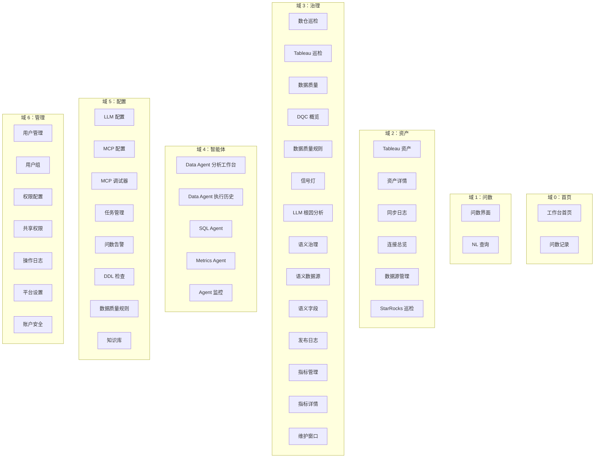
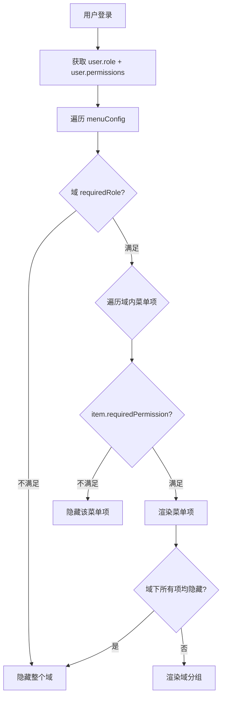
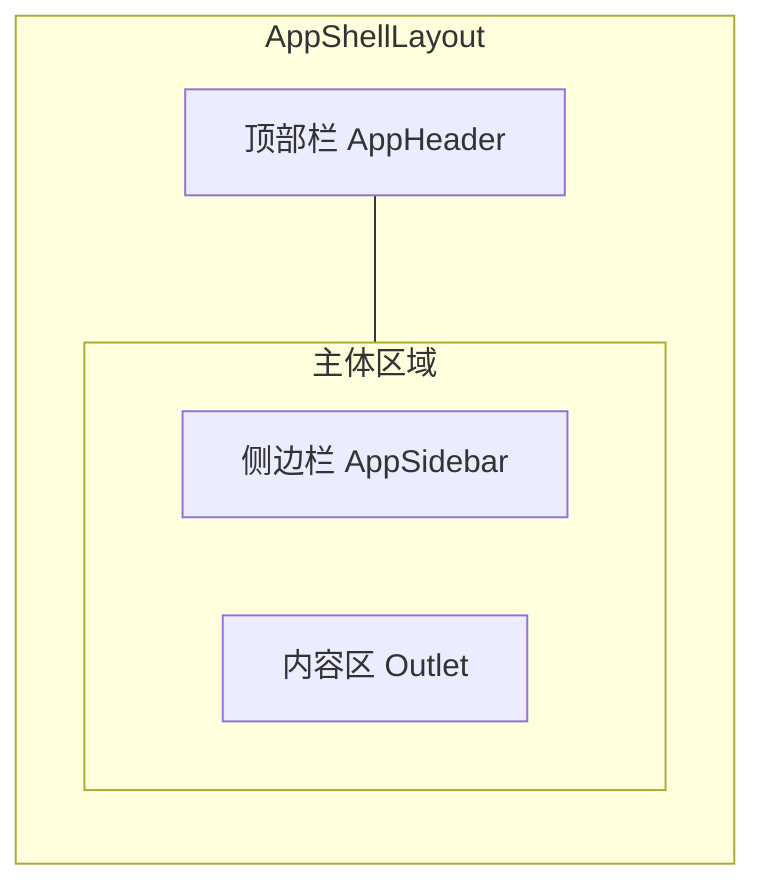

# 菜单重构技术规格书

> 版本：**v0.3** | 状态：已完成 | 日期：2026-04-30
>
> 更新说明（v0.2 → v0.3）：
> - 新增域 1"问数"（Query）：问数界面（Spec 38）、NL 查询（Spec 14）
> - 删除域"实验室"，其内容归入配置域
> - 删除域"运维"，其功能已合并到首页工作台
> - 平台 → 配置（Config）
> - 系统/设置 → 管理（Admin）
> - 新增域 4"智能体"（Agents）：Data Agent（Spec 28）、SQL Agent（Spec 29）、Metrics Agent（Spec 30）
> - 治理域新增 DQC 模块（Spec 31）：DQC 概览、监控配置、信号灯、LLM 根因分析
> - 资产域新增 StarRocks 巡检（Spec 35）
> - 知识库从实验室 hidden 迁入配置域（正式功能）
> - 标签修正："Logo" → "平台设置"

---

## 1. 概述

### 1.1 目的

当前 Mulan BI Platform 的导航结构为扁平的顶部导航栏（`Navbar.tsx` 中 5 个硬编码条目）+ 管理后台侧边栏（`AdminSidebarLayout.tsx` 中 6 个条目），随着功能模块增长已出现以下问题：

- 顶部导航无分组，用户需记忆每个入口的位置
- 管理后台与业务页面使用不同布局组件（`MainLayout` vs `AdminSidebarLayout`），切换时体验割裂
- 新增页面时缺乏归属域指引，导致路由路径命名不一致
- Agent 体系（Data/SQL/Metrics Agent）无独立域，能力分散
- DQC（Spec 31）被降级为健康中心 Tab，未体现其独立地位

本规格书将现有扁平菜单重构为 **7 个业务域**的分组侧边栏导航，统一布局体验。

### 1.2 范围

- **包含**：菜单域定义、路由重构、侧边栏组件设计、权限可见性控制、代码分割策略
- **不包含**：新功能页面开发、后端 API 变更、移动端适配

### 1.3 关联文档

| 文档 | 路径 | 关系 |
|------|------|------|
| 架构规范 | `docs/ARCHITECTURE.md` | 路由与权限约定 |
| API 约定 | `docs/specs/02-api-conventions.md` | RBAC 权限矩阵 |
| Auth Spec | `docs/specs/04-auth-rbac-spec.md` | 角色定义 |
| 语义维护 Spec | `docs/specs/09-semantic-maintenance-spec.md` | 语义维护路由 |
| Spec 34 | `docs/specs/34-connection-management-spec.md` | 连接管理菜单整合 |
| Spec 38 | `docs/specs/38-query-interface-spec.md` | 问数界面路由 |
| Spec 31 | `docs/specs/31-governance-dqc-pipeline-spec.md` | DQC 模块 |

---

## 2. 菜单域定义

### 2.1 七域总览



### 2.0 约束：域顺序锁定

一级菜单（域）的排列顺序为固定约定，**禁止通过修改代码调整**，如需变更必须先更新本规格书。

| 顺序 | 域 key | 域标签 | 英文 |
|:----:|--------|--------|------|
|  0   | `home`       | 首页    | Home    |
|  1   | `query`      | 问数    | Query   |
|  2   | `assets`     | 资产    | Assets  |
|  3   | `governance`  | 治理    | Governance |
|  4   | `agents`      | 智能体  | Agents  |
|  5   | `config`     | 配置    | Config  |
|  6   | `admin`      | 管理    | Admin   |

**约束**：配置（config）和管理（admin）是一级目录的最后两位，且配置必须在管理之前（配置在左，管理在右）。

### 2.2 域详细定义

#### 域 1：资产（Assets）

| 菜单项 | 路由路径 | 现有页面 | 图标 | 权限 |
|--------|---------|---------|------|------|
| Tableau 资产 | `/assets/tableau` | `pages/tableau/assets/page.tsx` | `ri-bar-chart-box-line` | 任意已认证 |
| 连接总览 | `/assets/connections` | `pages/assets/connection-center/page.tsx` | `ri-links-line` | 任意已认证 |
| 数据源管理 | `/assets/datasources` | `pages/assets/datasources/page.tsx` | `ri-database-2-line` | data_admin+ |

**域图标**：`ri-stack-line`
**域描述**：BI 资产浏览、数据源连接管理与 Tableau 资产管理
**默认展开**：否

> 连接总览为只读仪表盘，数据源管理与 Tableau 连接为完整 CRUD 页面（Spec 34）。

---

#### 域 2：治理（Governance）

| 菜单项 | 路由路径 | 现有页面 | 图标 | 权限 |
|--------|---------|---------|------|------|
| 数仓巡检 | `/governance/dw-audit` | `pages/data-governance/dw-audit/page.tsx` | `ri-heart-pulse-line` | analyst+ |
| Tableau 巡检 | `/governance/tableau-health` | `pages/tableau/health/page.tsx` | `ri-pulse-line` | analyst+ |
| 数据质量 | `/governance/dqc` | `pages/data-governance/dqc/overview/page.tsx` | `ri-dashboard-line` | analyst+ |
| 语义治理 | `/governance/semantic/datasources` | `pages/semantic-maintenance/datasource-list/page.tsx` | `ri-database-2-line` | analyst+ |
| 指标管理 | `/governance/metrics` | `pages/data-governance/metrics/page.tsx` | `ri-bar-chart-grouped-line` | 任意已认证 |

**域图标**：`ri-shield-star-line`
**域描述**：数据质量、语义治理与合规管理
**默认展开**：是

> - "数据质量"为单一入口，内部通过 Tab 切换 DQC 概览 / 数据质量规则 / 信号灯 / LLM 根因分析（路由: `/governance/dqc`, `/governance/dqc/monitor`, `/governance/dqc/signals`, `/governance/dqc/analyses`）
> - "发布日志"并入语义治理，作为其子路由 `/governance/semantic/publish-logs`，不再独立占据菜单位

---

#### 域 3：平台（Platform）

| 菜单项 | 路由路径 | 现有页面 | 图标 | 权限 |
|--------|---------|---------|------|------|
| 数据源与连接 | `/assets/connections` | `pages/assets/connection-center/page.tsx` | `ri-links-line` | data_admin+ |
| Tableau 连接 | `/assets/tableau-connections` | `pages/tableau/connections/page.tsx` | `ri-plug-line` | tableau 权限 |
| LLM 配置 | `/system/llm-configs` | `pages/admin/llm-configs/page.tsx` | `ri-robot-line` | admin |
| MCP 配置 | `/system/mcp-configs` | `pages/admin/mcp-configs/page.tsx` | `ri-plug-line` | admin |
| MCP 调试器 | `/system/mcp-debugger` | `pages/system/mcp-debugger/page.tsx` | `ri-bug-line` | admin |
| 任务管理 | `/system/tasks` | `pages/admin/tasks/page.tsx` | `ri-task-line` | admin |
| 问数告警 | `/system/query-alerts` | `pages/admin/query-alerts/page.tsx` | `ri-alarm-warning-line` | admin |

**域图标**：`ri-server-line`
**域描述**：数据源连接、LLM/MCP 配置、任务调度与告警
**默认展开**：否

---

#### 域 4：实验室（Lab）

| 菜单项 | 路由路径 | 现有页面 | 图标 | 权限 | 状态 |
|--------|---------|---------|------|------|------|
| DDL 检查 | `/dev/ddl-validator` | `pages/ddl-validator/page.tsx` | `ri-code-s-slash-line` | analyst+ | 正常 |
| 规则配置 | `/dev/rule-config` | `pages/rule-config/page.tsx` | `ri-settings-3-line` | data_admin+ | 正常 |
| 知识库 | `/analytics/knowledge` | `pages/knowledge/page.tsx` | `ri-book-open-line` | user+ | hidden（待迁出） |
| DDL 生成器 | — | 待开发 | `ri-file-code-line` | analyst+ | hidden |
| 自然语言查询 | — | 待开发 | `ri-chat-search-line` | analyst+ | hidden |

**域图标**：`ri-flask-line`
**域描述**：数据库开发工具、规范管理与 AI 分析
**默认展开**：否

---

#### 域 5：设置（System）

| 菜单项 | 路由路径 | 现有页面 | 图标 | 权限 |
|--------|---------|---------|------|------|
| 用户管理 | `/system/users` | `pages/admin/user-management/page.tsx` | `ri-user-settings-line` | admin |
| 用户组 | `/system/groups` | `pages/admin/groups/page.tsx` | `ri-team-line` | admin |
| 权限配置 | `/system/permissions` | `pages/admin/permissions/page.tsx` | `ri-shield-keyhole-line` | admin |
| 操作日志 | `/system/activity` | `pages/admin/activity/page.tsx` | `ri-history-line` | admin |

**域图标**：`ri-settings-2-line`
**域描述**：用户管理、权限配置与操作审计
**默认展开**：否

---

## 3. 权限与菜单可见性

### 3.1 角色-域可见性矩阵

| 菜单域 | admin | data_admin | analyst | user |
|--------|:-----:|:----------:|:-------:|:----:|
| 资产 | 全部 | 全部 | 全部（CRUD 除外） | 全部（只读） |
| 治理 | 全部 | 全部 | 健康中心 + 语义（只读） | 不可见 |
| 平台 | 全部 | 全部 | 不可见 | 不可见 |
| 实验室 | 全部 | DDL 检查 + 规则配置 | DDL 检查 | DDL 检查 |
| 设置 | 全部 | 不可见 | 不可见 | 不可见 |

### 3.2 菜单项级权限控制



### 3.3 权限数据结构

```typescript
interface MenuPermission {
  /** 需要的最低角色等级 */
  requiredRole?: 'admin' | 'data_admin' | 'analyst' | 'user';
  /** 需要的具体权限标识（与 ProtectedRoute requiredPermission 一致） */
  requiredPermission?: string;
  /** admin 专属（等价于 requiredRole: 'admin'） */
  adminOnly?: boolean;
}
```

---

## 4. 路由结构

### 4.1 路由总表

| 路由路径 | 页面组件 | 所在域 | 菜单入口 | 备注 |
|---------|---------|--------|---------|------|
| `/` | `pages/home/page.tsx` | 首页 | — | 首页（AI 工作台） |
| `/login` | `pages/login/page.tsx` | — | — | 公开 |
| `/query` | `pages/query/page.tsx` | 问数 | ✅ | Spec 38 |
| `/query/nl` | `pages/query/nl/page.tsx` | 问数 | ✅ | Spec 14 |
| `/chat/:id` | `pages/chat/[id]/page.tsx` | 首页 | ❌ | 问数记录（动态路由） |
| `/assets/tableau` | `pages/tableau/assets/page.tsx` | 资产 | ✅ | |
| `/assets/connections` | `pages/assets/connection-center/page.tsx` | 资产 | ✅ | 只读仪表盘 |
| `/assets/datasources` | `pages/assets/datasources/page.tsx` | 资产 | ✅ | CRUD（data_admin+） |
| `/assets/tableau/:id` | `pages/tableau/asset-detail/page.tsx` | 资产 | ❌ | 动态路由 |
| `/assets/tableau-connections/:connId/sync-logs` | `pages/tableau/sync-logs/page.tsx` | 资产 | ❌ | 动态路由 |
| `/assets/starrocks-inspection` | `pages/assets/starrocks-inspection/page.tsx` | 资产 | ✅ | Spec 35 |
| `/governance/dw-audit` | `pages/data-governance/dw-audit/page.tsx` | 治理 | ✅ | Tabbed 页面 |
| `/governance/dqc` | `pages/data-governance/dqc/overview/page.tsx` | 治理 | ✅ | Spec 31 |
| `/governance/dqc/monitor` | `pages/data-governance/dqc/monitor/page.tsx` | 治理 | ✅ | Spec 31 |
| `/governance/dqc/signals` | `pages/data-governance/dqc/signals/page.tsx` | 治理 | ✅ | Spec 31 |
| `/governance/dqc/analyses` | `pages/data-governance/dqc/analyses/page.tsx` | 治理 | ✅ | Spec 31 |
| `/governance/semantic/datasources` | `pages/semantic-maintenance/datasource-list/page.tsx` | 治理 | ✅ | |
| `/governance/semantic/datasources/:id` | `pages/semantic-maintenance/datasource-detail/page.tsx` | 治理 | ❌ | 动态路由 |
| `/governance/semantic/fields` | `pages/semantic-maintenance/field-list/page.tsx` | 治理 | ✅ | |
| `/governance/semantic/publish-logs` | `pages/empty/publish-logs/page.tsx` | 治理 | ✅ | |
| `/governance/metrics` | `pages/data-governance/metrics/page.tsx` | 治理 | ✅ | |
| `/governance/metrics/:id` | `pages/data-governance/metrics/detail/page.tsx` | 治理 | ❌ | 动态路由 |
| `/governance/metrics/maintenance-windows` | `pages/data-governance/metrics/maintenance/page.tsx` | 治理 | ✅ | |
| `/agents/data` | `pages/agents/data-workbench/page.tsx` | 智能体 | ✅ | Spec 28 |
| `/agents/data/history` | `pages/agents/data-workbench/history/page.tsx` | 智能体 | ✅ | Spec 28 |
| `/agents/sql` | `pages/agents/sql-agent/page.tsx` | 智能体 | ✅ | Spec 29 |
| `/agents/metrics` | `pages/agents/metrics-agent/page.tsx` | 智能体 | ✅ | Spec 30 |
| `/agents/agent-monitor` | `pages/agents/monitor/page.tsx` | 智能体 | ✅ | |
| `/system/llm-configs` | `pages/admin/llm-configs/page.tsx` | 配置 | ✅ | admin |
| `/system/mcp-configs` | `pages/admin/mcp-configs/page.tsx` | 配置 | ✅ | admin |
| `/system/mcp-debugger` | `pages/system/mcp-debugger/page.tsx` | 配置 | ✅ | admin |
| `/system/tasks` | `pages/admin/tasks/page.tsx` | 配置 | ✅ | admin |
| `/system/query-alerts` | `pages/admin/query-alerts/page.tsx` | 配置 | ✅ | admin |
| `/dev/ddl-validator` | `pages/ddl-validator/page.tsx` | 配置 | ✅ | |
| `/dev/rule-config` | `pages/rule-config/page.tsx` | 配置 | ✅ | data_admin+ |
| `/analytics/knowledge` | `pages/knowledge/page.tsx` | 配置 | ✅ | Spec 17 |
| `/system/users` | `pages/admin/user-management/page.tsx` | 管理 | ✅ | admin |
| `/system/groups` | `pages/admin/groups/page.tsx` | 管理 | ✅ | admin |
| `/system/permissions` | `pages/admin/permissions/page.tsx` | 管理 | ✅ | admin |
| `/system/shared-permissions` | `pages/admin/shared-permissions/page.tsx` | 管理 | ✅ | |
| `/system/activity` | `pages/admin/activity/page.tsx` | 管理 | ✅ | admin |
| `/system/platform-settings` | `pages/admin/platform-settings/page.tsx` | 管理 | ✅ | |
| `/account/security` | `pages/account/security/page.tsx` | 管理 | ✅ | |

### 4.2 React Router v7 路由定义

> 路由配置完整源码：`frontend/src/router/config.tsx`

**代码分割约定**（按域独立 chunk）：

| 域 | chunk 名 | 主要页面 |
|----|---------|---------|
| 首页 | `chunk-home` | 工作台首页、问数记录 |
| 问数 | `chunk-query` | 问数界面、NL 查询 |
| 资产 | `chunk-assets` | Tableau 资产、连接总览、数据源、StarRocks 巡检 |
| 治理 | `chunk-governance` | 健康中心、DQC、语义治理、指标管理 |
| 智能体 | `chunk-agents` | Data Agent、SQL Agent、Metrics Agent、Agent 监控 |
| 配置 | `chunk-config` | LLM/MCP 配置、MCP 调试器、任务管理、问数告警、规则配置、知识库 |
| 管理 | `chunk-admin` | 用户管理、用户组、权限配置、操作日志、平台设置 |

---

## 5. 前端实现

### 5.1 统一布局组件 `AppShellLayout`



| 组件 | 职责 | 替代对象 |
|------|------|---------|
| `AppShellLayout` | 统一页面骨架（Header + Sidebar + Content） | `MainLayout` + `AdminSidebarLayout` |
| `AppHeader` | Logo、全局搜索、用户信息 | `Navbar.tsx` |
| `AppSidebar` | 7 域菜单树、折叠状态、权限过滤 | `AdminSidebarLayout` 的侧边栏 |

### 5.2 菜单配置数据结构

> 完整配置：`frontend/src/config/menu.ts`

```typescript
interface MenuItem {
  key: string;
  label: string;
  icon?: string;
  path?: string;
  permission?: MenuPermission;
  children?: MenuItem[];
  hidden?: boolean;       // 不在菜单显示（详情页等动态路由）
  disabled?: boolean;    // 置灰禁用，hover 显示"功能开发中"
  badge?: number;
}

interface MenuDomain {
  key: string;
  label: string;
  icon: string;
  description: string;
  permission?: MenuPermission;
  defaultOpen?: boolean;
  items: MenuItem[];
}
```

### 5.3 `AppSidebar` 组件行为

| 特性 | 说明 |
|------|------|
| 宽度 | 展开态 240px，折叠态 56px |
| 域标题 | 可点击展开/收起域下菜单项 |
| 当前激活 | 自动展开所属域，高亮当前菜单项 |
| 折叠态 | 仅显示域图标，hover 显示 tooltip（域标签 + 描述） |
| 折叠状态持久化 | `localStorage('mulan-sidebar-collapsed')` |
| 域展开状态持久化 | `localStorage('mulan-sidebar-domains')` |
| 待开发菜单项 | `disabled: true`，hover 显示"功能开发中，敬请期待" |
| 隐藏菜单项 | `hidden: true`，完全不在 DOM 渲染 |

---

## 6. 变更记录

### v0.1 → v0.2（2026-04-24）

| # | 变更内容 | 原因 |
|---|---------|------|
| 1 | 域 1 由"数据开发"(dev) 改为"实验室"(lab)，图标改为 `ri-flask-line` | 知识库、DDL 生成器等 AI 特性合并为实验性域 |
| 2 | 新增域 3"平台"(platform)，整合 LLM/MCP/任务/告警等基础设施类菜单 | 原 system 域下基础设施配置与系统设置混杂，职责不清 |
| 3 | 资产域新增：连接总览、数据源管理、Tableau 连接（Spec 34） | 连接管理与资产浏览职责分离 |
| 4 | 治理域：健康扫描→健康中心（Tabbed 统一入口），新增指标管理 | 健康与质量入口合并，指标独立模块 |
| 5 | 知识库暂时隐藏在实验室域，待功能完成后再迁入 analytics 域 | analytics 域尚未启用 |
| 6 | Spec 34 实施后，资产域与平台域均有"连接"相关菜单（路由相同，标签不同） | 资产域侧重查看/治理，平台域侧重配置/管理，视角不同但共用同一底层路由 |

### v0.2 → v0.3（2026-04-30）

| # | 变更内容 | 原因 |
|---|---------|------|
| 1 | 新增域 1"问数"（Query）：问数界面（Spec 38）、NL 查询（Spec 14） | Spec 38 已完成但无菜单入口 |
| 2 | 删除域"运维"，其内容归入首页工作台 | Spec 20 construction，功能已合并 |
| 3 | 删除域"实验室"，其内容归入配置域 | MECE 原则：实验室为混合分类，不符合互斥原则 |
| 4 | 域 5"平台" → "配置"（Config） | 语义更准确：平台是产品整体，配置是功能模块 |
| 5 | 域 6"系统/设置" → "管理"（Admin） | 与配置分离，职责更清晰 |
| 6 | 新增域 4"智能体"（Agents）：Data Agent（Spec 28）、SQL Agent（Spec 29）、Metrics Agent（Spec 30） | Agent 体系需要统一域 |
| 7 | 治理域新增 DQC 模块（Spec 31）：DQC 概览、监控配置、信号灯、LLM 根因分析 | Spec 31 需要独立地位，不再降级为健康中心 Tab |
| 8 | 资产域新增 StarRocks 巡检（Spec 35） | Spec 35 已完成，需有菜单入口 |
| 9 | 知识库从实验室 hidden 迁入配置域（正式功能） | 功能已完成，解除 hidden 状态 |
| 10 | 标签修正："Logo" → "平台设置" | 原标签无法传达功能含义 |

### v0.3 → v0.4（2026-05-05）

| # | 变更内容 | 原因 |
|---|---------|------|
| 1 | 治理域从 9 项精简为 5 项 | 同一层级混杂大模块入口和子页面，用户认知负担高 |
| 2 | DQC 4 个菜单项合并为单一"数据质量"入口 | DQC 概览/规则/信号灯/根因分析是同一模块的子视图，应内部 Tab 切换 |
| 3 | "发布日志"从独立菜单项并入"语义治理" | 发布日志是语义治理的审计子功能，脱离上下文无意义 |
| 4 | "健康中心"更名为"数仓巡检"（与实际功能对齐） | 用户看到"健康中心"不知要做什么，"数仓巡检"直击场景 |
| 5 | Tableau 巡检独立为二级菜单项 | v0.3 已拆出独立路由，但菜单配置未同步 |
