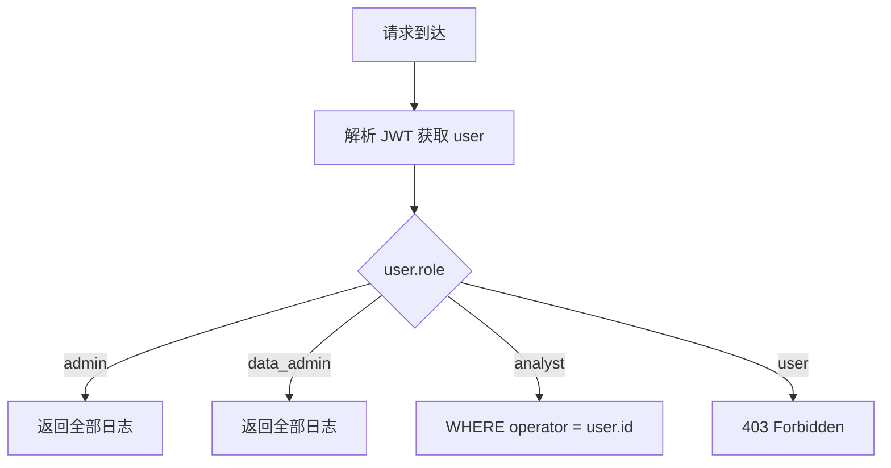
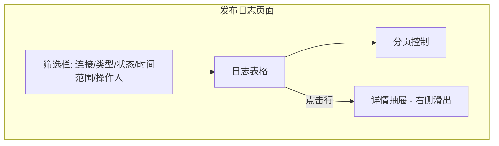
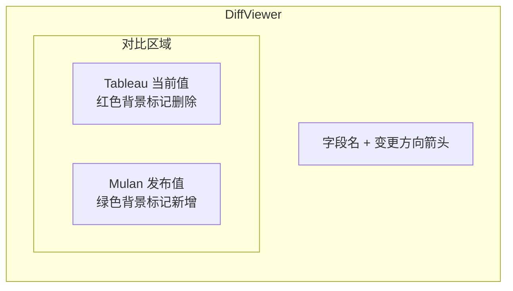
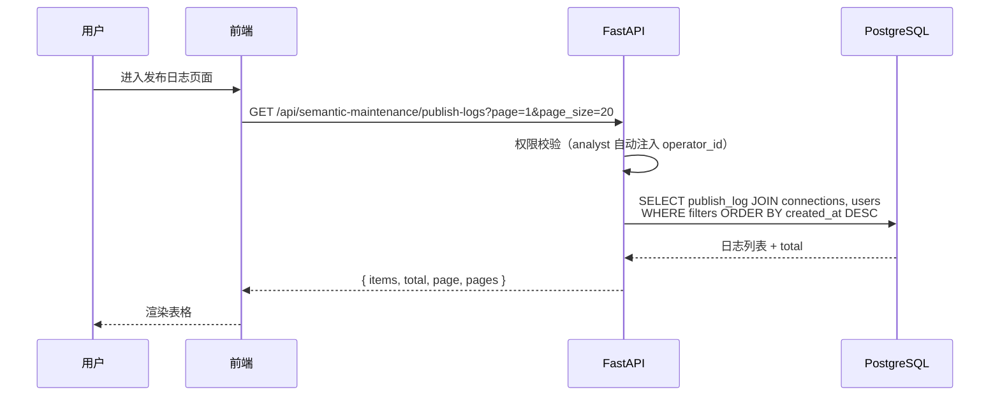
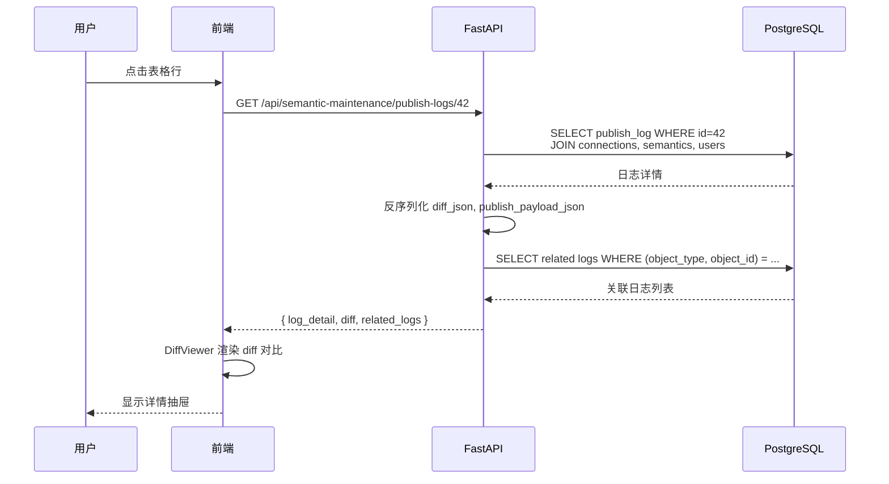

# 语义发布日志 UI 技术规格书

> 版本：v0.1 | 状态：草稿 | 日期：2026-04-04 | 关联 PRD：待补充

---

## 1. 概述

### 1.1 目的

语义维护模块（Spec 09）已实现将 Mulan 平台中标注的字段/数据源语义回写（发布）到 Tableau Server 的功能，发布操作在 `tableau_publish_log` 表中记录了完整日志，包括发布 payload、diff、状态和操作人等信息。

当前缺少面向用户的发布日志查看界面，运维和管理人员无法：
- 查看历史发布记录及成功/失败状态
- 审计发布操作人和发布内容
- 可视化对比发布前后的字段变更

本规格书定义发布日志列表页和 diff 可视化组件的实现方案。

### 1.2 范围

- **包含**：发布日志 API（列表 + 详情）、前端列表页、diff 可视化、状态过滤、时间范围查询
- **不包含**：发布操作本身（已在 Spec 09 定义）、回滚操作的 UI 触发（作为列表页 action 按钮预留）

### 1.3 关联文档

| 文档 | 路径 | 关系 |
|------|------|------|
| 语义维护 Spec | `docs/specs/09-semantic-maintenance-spec.md` | 数据模型来源 |
| API 约定 | `docs/specs/02-api-conventions.md` | 错误码、分页规范 |
| 错误码标准 | `docs/specs/01-error-codes-standard.md` | SM 前缀错误码 |
| 架构规范 | `docs/ARCHITECTURE.md` | 分层约束 |
| 菜单重构 Spec | `docs/specs/18-menu-restructure-spec.md` | 菜单入口路径 |

---

## 2. 数据模型

### 2.1 现有表：`tableau_publish_log`

该表已在 Spec 09 中定义并由 `publish_service.py` 写入，本 Spec **不新增表**，仅消费现有数据。

| 字段 | 类型 | 说明 |
|------|------|------|
| id | Integer, PK | 主键 |
| connection_id | Integer, FK | 关联 TableauConnection |
| object_type | String(32) | `datasource` / `field` |
| object_id | Integer | 语义记录 ID（`tableau_datasource_semantics.id` 或 `tableau_field_semantics.id`） |
| tableau_object_id | String(256) | Tableau 侧对象 ID |
| target_system | String(32) | 目标系统（当前固定 `tableau`） |
| publish_payload_json | Text | 发布的完整 payload JSON |
| diff_json | Text | 变更差异 JSON（见 2.2） |
| status | String(16) | `pending` / `success` / `failed` / `rolled_back` / `not_supported` |
| response_summary | Text | 发布响应摘要或错误信息 |
| operator | Integer, FK | 操作人用户 ID（关联 `auth_users.id`） |
| created_at | DateTime | 创建时间（即发布时间） |

### 2.2 `diff_json` 结构

由 `PublishService._build_diff()` 生成，结构如下：

```json
{
  "description": {
    "tableau": "原始描述文本",
    "mulan": "Mulan 平台语义描述"
  },
  "caption": {
    "tableau": "原始 caption",
    "mulan": "中文语义名"
  }
}
```

回滚操作的 diff_json 格式：

```json
{
  "rollback": {
    "description": "恢复的原始值",
    "caption": "恢复的原始 caption"
  }
}
```

### 2.3 现有索引

| 索引名 | 列 | 用途 |
|--------|-----|------|
| `ix_publish_log_conn_status` | `(connection_id, status)` | 按连接+状态查询 |
| `ix_publish_log_object` | `(object_type, object_id)` | 按对象查询发布历史 |

### 2.4 建议新增索引

| 索引名 | 列 | 用途 |
|--------|-----|------|
| `ix_publish_log_operator` | `(operator)` | 按操作人过滤 |
| `ix_publish_log_created_at` | `(created_at DESC)` | 时间范围查询排序 |

迁移脚本：

```python
# alembic revision: add_publish_log_indexes
def upgrade():
    op.create_index('ix_publish_log_operator', 'tableau_publish_log', ['operator'])
    op.create_index('ix_publish_log_created_at', 'tableau_publish_log', ['created_at'])

def downgrade():
    op.drop_index('ix_publish_log_created_at', 'tableau_publish_log')
    op.drop_index('ix_publish_log_operator', 'tableau_publish_log')
```

---

## 3. API 设计

### 3.1 端点总览

| 方法 | 路径 | 说明 | 认证 | 角色 |
|------|------|------|------|------|
| GET | `/api/semantic-maintenance/publish-logs` | 发布日志列表（分页+过滤） | 需要 | admin / data_admin / analyst(仅自己) |
| GET | `/api/semantic-maintenance/publish-logs/{id}` | 发布日志详情（含完整 diff） | 需要 | admin / data_admin / analyst(仅自己) |

### 3.2 `GET /api/semantic-maintenance/publish-logs`

**请求参数（Query）：**

| 参数 | 类型 | 必填 | 默认值 | 说明 |
|------|------|------|--------|------|
| `page` | int | 否 | 1 | 页码 |
| `page_size` | int | 否 | 20 | 每页条数（max=100） |
| `connection_id` | int | 否 | — | 按 Tableau 连接过滤 |
| `object_type` | string | 否 | — | `datasource` / `field` |
| `status` | string | 否 | — | `pending` / `success` / `failed` / `rolled_back` / `not_supported` |
| `operator_id` | int | 否 | — | 按操作人过滤 |
| `start_date` | string(ISO8601) | 否 | — | 起始时间 |
| `end_date` | string(ISO8601) | 否 | — | 结束时间 |
| `sort_by` | string | 否 | `created_at` | 排序字段 |
| `sort_order` | string | 否 | `desc` | `asc` / `desc` |

**响应 (200)：**

```json
{
  "items": [
    {
      "id": 42,
      "connection_id": 1,
      "connection_name": "Tableau Production",
      "object_type": "datasource",
      "object_id": 15,
      "object_name": "Superstore Sales",
      "tableau_object_id": "abc-123-def",
      "status": "success",
      "response_summary": "回写成功",
      "operator": {
        "id": 3,
        "username": "data_admin_01",
        "display_name": "数据管理员"
      },
      "diff_summary": {
        "changed_fields": ["description"],
        "total_changes": 1
      },
      "created_at": "2026-04-03T14:30:00Z"
    }
  ],
  "total": 128,
  "page": 1,
  "page_size": 20,
  "pages": 7
}
```

**说明**：
- `connection_name` 通过 JOIN `tableau_connections` 获取
- `object_name` 通过 JOIN `tableau_datasource_semantics.semantic_name_zh` 或 `tableau_field_semantics.semantic_name_zh` 获取
- `operator` 对象通过 JOIN `auth_users` 获取
- `diff_summary` 从 `diff_json` 解析生成，列表页仅展示摘要

### 3.3 `GET /api/semantic-maintenance/publish-logs/{id}`

**响应 (200)：**

```json
{
  "id": 42,
  "connection_id": 1,
  "connection_name": "Tableau Production",
  "object_type": "datasource",
  "object_id": 15,
  "object_name": "Superstore Sales",
  "tableau_object_id": "abc-123-def",
  "target_system": "tableau",
  "status": "success",
  "response_summary": "回写成功",
  "operator": {
    "id": 3,
    "username": "data_admin_01",
    "display_name": "数据管理员"
  },
  "publish_payload": {
    "datasource": {
      "id": "abc-123-def",
      "description": "超级商店销售分析数据源，包含订单、产品、客户维度"
    }
  },
  "diff": {
    "description": {
      "tableau": "Sample - Superstore Sales",
      "mulan": "超级商店销售分析数据源，包含订单、产品、客户维度"
    }
  },
  "created_at": "2026-04-03T14:30:00Z",
  "can_rollback": true,
  "related_logs": [
    {
      "id": 43,
      "status": "rolled_back",
      "created_at": "2026-04-03T15:00:00Z"
    }
  ]
}
```

**说明**：
- `publish_payload` 从 `publish_payload_json` 反序列化
- `diff` 从 `diff_json` 反序列化
- `can_rollback` = `status == 'success'`（仅 success 状态可回滚）
- `related_logs` = 同一 `(object_type, object_id)` 的其他发布记录

---

## 4. 业务逻辑

### 4.1 diff 展示逻辑

```mermaid
flowchart TD
    A[获取 publish_log] --> B{diff_json 存在?}
    B -->|否| C[显示"无差异记录"]
    B -->|是| D[解析 diff_json]
    D --> E{是否 rollback 类型?}
    E -->|是| F[展示回滚信息面板]
    E -->|否| G[遍历 diff 字段]
    G --> H[逐字段展示 Tableau vs Mulan 对比]
    H --> I{值为长文本?}
    I -->|是| J[使用 inline-diff 高亮变更部分]
    I -->|否| K[使用左右对比展示]
```

### 4.2 状态过滤规则

| 状态 | 含义 | 颜色标签 | 可执行操作 |
|------|------|---------|-----------|
| `pending` | 发布中 | 黄色 | 无 |
| `success` | 发布成功 | 绿色 | 回滚 |
| `failed` | 发布失败 | 红色 | 重试 |
| `rolled_back` | 已回滚 | 灰色 | 无 |
| `not_supported` | API 暂不支持 | 紫色 | 无 |

### 4.3 时间范围查询

- 默认展示最近 30 天的发布记录
- 支持自定义时间范围：起始时间 ~ 结束时间
- 时间筛选条件对 `created_at` 字段生效
- 使用数据库索引 `ix_publish_log_created_at` 优化查询

### 4.4 数据权限过滤



### 4.5 后端服务层实现

新增方法位于 `backend/services/semantic_maintenance/database.py`：

```python
class SemanticMaintenanceDatabase:
    # 已有方法（Spec 09）：
    # - create_publish_log()
    # - update_publish_log_status()
    # - list_publish_logs()

    # 新增方法：
    def get_publish_log_detail(self, log_id: int) -> Optional[dict]:
        """获取发布日志详情，JOIN 连接名、对象名、操作人信息"""
        ...

    def list_publish_logs_with_filters(
        self,
        connection_id: Optional[int] = None,
        object_type: Optional[str] = None,
        status: Optional[str] = None,
        operator_id: Optional[int] = None,
        start_date: Optional[datetime] = None,
        end_date: Optional[datetime] = None,
        page: int = 1,
        page_size: int = 20,
        sort_by: str = 'created_at',
        sort_order: str = 'desc',
    ) -> Tuple[List[dict], int]:
        """带多条件过滤的发布日志列表查询"""
        ...
```

新增路由位于 `backend/app/api/semantic_maintenance/publish.py`（扩展已有文件）。

---

## 5. 前端页面

### 5.1 页面位置

```
frontend/src/pages/
└── semantic-maintenance/
    └── publish-logs/
        ├── page.tsx              # 发布日志列表页
        └── components/
            ├── PublishLogTable.tsx     # 日志表格
            ├── PublishLogFilter.tsx    # 筛选栏
            ├── PublishLogDetail.tsx    # 日志详情抽屉
            ├── DiffViewer.tsx         # diff 可视化组件
            └── StatusBadge.tsx        # 状态标签
```

**路由路径**：`/governance/semantic/publish-logs`（Spec 18 定义）

### 5.2 列表页设计



**表格列定义**：

| 列名 | 字段 | 宽度 | 排序 | 说明 |
|------|------|------|------|------|
| ID | `id` | 60px | 是 | 日志编号 |
| 连接 | `connection_name` | 140px | 否 | Tableau 连接名 |
| 对象类型 | `object_type` | 80px | 否 | Badge: 数据源/字段 |
| 对象名称 | `object_name` | 200px | 否 | 语义中文名 |
| 状态 | `status` | 100px | 否 | 颜色状态标签 |
| 变更摘要 | `diff_summary` | 180px | 否 | "修改了 description 等 N 个字段" |
| 操作人 | `operator.display_name` | 100px | 否 | 操作用户 |
| 发布时间 | `created_at` | 160px | 是 | 相对时间 + tooltip 绝对时间 |
| 操作 | — | 80px | — | 查看详情 / 重试 / 回滚 |

### 5.3 筛选栏设计

| 筛选条件 | 组件类型 | 选项来源 |
|---------|---------|---------|
| Tableau 连接 | Select | `/api/tableau/connections` |
| 对象类型 | Select | 固定: 全部/数据源/字段 |
| 状态 | 多选 Tag | 固定: pending/success/failed/rolled_back/not_supported |
| 时间范围 | DateRangePicker | 默认最近 30 天 |
| 操作人 | Select（admin 可见） | `/api/users` |

### 5.4 diff 可视化组件 `DiffViewer`



**组件 Props**：

```typescript
interface DiffViewerProps {
  /** diff 数据，key=字段名，value={tableau, mulan} */
  diff: Record<string, { tableau: string | null; mulan: string | null }>;
  /** 显示模式：并排 | 内联 */
  mode?: 'side-by-side' | 'inline';
  /** 是否为回滚类型 diff */
  isRollback?: boolean;
}
```

**展示规则**：

| 场景 | 左侧（Tableau） | 右侧（Mulan） | 视觉样式 |
|------|----------------|---------------|---------|
| 新增字段值 | 空（灰色占位） | 绿色背景 | 绿色边框 |
| 修改字段值 | 红色删除线 | 绿色高亮 | 左红右绿 |
| 值未变化 | 灰色文字 | 灰色文字 | 无高亮 |
| 回滚操作 | 被回滚的值（红色） | 恢复的原始值（蓝色） | 蓝色边框 |

**长文本 diff**：当字段值超过 100 个字符时，使用字符级 diff 算法（`diff-match-patch` 库）标记具体变更位置。

### 5.5 详情抽屉

点击表格行时从右侧滑出详情抽屉，包含：

1. **基本信息卡片** — 日志 ID、连接名、对象类型/名称、状态、时间、操作人
2. **diff 可视化区域** — 使用 `DiffViewer` 组件
3. **发布 Payload** — 可折叠 JSON 查看器
4. **响应摘要** — 成功/失败信息
5. **操作按钮** — 回滚（success 状态）/ 重试（failed 状态）
6. **关联日志** — 同一对象的历史发布记录时间线

### 5.6 前端 API 调用层

```typescript
// frontend/src/api/publish-logs.ts

export interface PublishLogListParams {
  page?: number;
  page_size?: number;
  connection_id?: number;
  object_type?: 'datasource' | 'field';
  status?: string;
  operator_id?: number;
  start_date?: string;
  end_date?: string;
  sort_by?: string;
  sort_order?: 'asc' | 'desc';
}

export const publishLogsApi = {
  list: (params: PublishLogListParams) =>
    fetch(`/api/semantic-maintenance/publish-logs?${new URLSearchParams(params)}`),

  detail: (id: number) =>
    fetch(`/api/semantic-maintenance/publish-logs/${id}`),

  retry: (logId: number) =>
    fetch(`/api/semantic-maintenance/publish/retry/${logId}`, { method: 'POST' }),

  rollback: (logId: number) =>
    fetch(`/api/semantic-maintenance/publish/rollback/${logId}`, { method: 'POST' }),
};
```

---

## 6. 错误码

复用 `SM`（Semantic Maintenance）前缀，扩展以下错误码：

| 错误码 | HTTP | 说明 | 触发条件 |
|--------|------|------|---------|
| `SM_020` | 404 | 发布日志不存在 | `GET /publish-logs/{id}` 找不到记录 |
| `SM_021` | 403 | 无权查看此发布日志 | analyst 查看非自己操作的日志 |
| `SM_022` | 400 | 无效的时间范围 | `start_date > end_date` |
| `SM_023` | 400 | 无效的状态过滤值 | status 值不在允许列表中 |
| `SM_024` | 400 | 无效的排序字段 | sort_by 值不在允许列表中 |

---

## 7. 安全

### 7.1 角色权限矩阵

| 操作 | admin | data_admin | analyst | user |
|------|:-----:|:----------:|:-------:|:----:|
| 查看发布日志列表 | Y（全部） | Y（全部） | Y（仅自己操作） | N |
| 查看发布日志详情 | Y | Y | Y（仅自己操作） | N |
| 触发重试 | Y | Y | N | N |
| 触发回滚 | Y | N | N | N |

### 7.2 数据过滤实现

```python
# backend/app/api/semantic_maintenance/publish.py

@router.get("/publish-logs")
async def list_publish_logs(
    params: PublishLogListParams = Depends(),
    current_user: dict = Depends(get_current_user),
):
    # analyst 强制只能查看自己的操作日志
    if current_user["role"] == "analyst":
        params.operator_id = current_user["id"]

    # user 角色禁止访问
    if current_user["role"] == "user":
        raise HTTPException(403, detail={"error_code": "SM_021"})

    return db.list_publish_logs_with_filters(**params.dict())
```

### 7.3 敏感信息保护

- `publish_payload_json` 中不包含密码、Token 等敏感信息（发布服务已确保仅发送 description/caption）
- `diff_json` 仅包含语义类文本字段，无敏感数据泄露风险
- 日志中的 `operator` 字段仅返回 `id` / `username` / `display_name`，不返回密码哈希

---

## 8. 时序图

### 8.1 查看发布日志列表



### 8.2 查看日志详情 + diff



---

## 9. 测试策略

### 9.1 关键场景

| # | 场景 | 预期 | 优先级 |
|---|------|------|--------|
| 1 | admin 查看全部发布日志列表 | 返回全部记录，分页正确 | P0 |
| 2 | analyst 查看日志列表 | 仅返回 `operator = 自己` 的记录 | P0 |
| 3 | user 角色访问发布日志 | 返回 403 | P0 |
| 4 | 按状态过滤 `status=failed` | 仅返回失败记录 | P0 |
| 5 | 按时间范围过滤最近 7 天 | 仅返回 7 天内记录 | P1 |
| 6 | 查看 datasource 类型日志详情 | diff 正确展示 description 变更 | P0 |
| 7 | 查看 field 类型日志详情，status=not_supported | 展示"API 暂不支持"提示 | P1 |
| 8 | DiffViewer 长文本 diff | 字符级 diff 高亮正确 | P1 |
| 9 | 点击"重试"按钮（failed 日志） | 调用 retry API，刷新列表 | P1 |
| 10 | 点击"回滚"按钮（success 日志，admin） | 调用 rollback API，状态变为 rolled_back | P1 |
| 11 | data_admin 点击回滚按钮 | 按钮不可见或禁用 | P0 |
| 12 | `start_date > end_date` | 返回 SM_022 错误 | P2 |

### 9.2 验收标准

- [ ] 发布日志列表页正确展示全部字段，分页功能正常
- [ ] 5 种状态的颜色标签正确展示
- [ ] 筛选条件（连接/类型/状态/时间/操作人）组合过滤功能正常
- [ ] 日志详情抽屉正确展示 diff 对比
- [ ] DiffViewer 组件支持并排和内联两种模式
- [ ] 长文本 diff 使用字符级差异高亮
- [ ] 回滚操作 diff 使用蓝色样式区分
- [ ] analyst 角色仅可见自己的操作日志
- [ ] user 角色无法访问发布日志页面
- [ ] 重试/回滚按钮根据状态和角色正确控制可见性

---

## 10. 开放问题

| # | 问题 | 负责人 | 状态 |
|---|------|--------|------|
| 1 | 发布日志是否需要支持导出（CSV/Excel）功能？ | 产品经理 | 待定 |
| 2 | `not_supported` 状态的日志是否需要定期自动重试（当 Tableau API 更新支持字段级回写后）？ | 后端负责人 | 待定 |
| 3 | diff 可视化是否需要支持 JSON 格式的 diff（未来可能扩展 payload 结构）？ | 前端负责人 | 待定 |
| 4 | 发布日志的数据保留策略：是否设置自动清理（如保留 1 年）？ | 运维团队 | 待定 |
| 5 | 回滚操作是否需要二次确认弹窗（当前 `publish_service.py` 直接执行）？ | UX 设计 | 建议是 |
| 6 | 列表页是否需要实时刷新（WebSocket / 轮询）以显示 pending 状态变化？ | 前端负责人 | 暂不考虑 |
