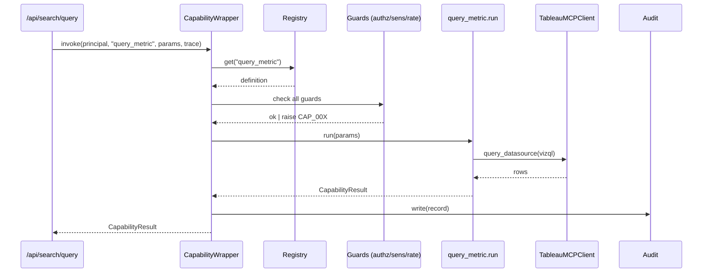

# SPEC 20 — Capability Wrapper 能力封装层

> 版本:v0.2(minimax 工程可开发)
> 日期:2026-04-28
> 状态:Engineering Spec — Phase 1 已落地([[tech-capability-audit-v1]]),Phase 1.5 本版本可直接交付开发
> 类别:Tier 2 · 集成层
> 依赖:SPEC 04(Auth)· SPEC 07(Tableau v1)· SPEC 08(LLM)· SPEC 13(Tableau MCP v2)· SPEC 14(NL-to-Query)· SPEC 16(Events)· SPEC 24(Task Runtime)
>
> **v0.2 变更**(2026-04-28):补齐 §4.2 LLM/MCP 入口改造点清单、§5.7 默认阈值参数表、§10 测试用例 P0/P1 分级、§13 开发交付约束(架构红线 / 强制检查清单 / 验证命令 / 正错示范)。原 v0.1 章节内容保留。

---

## §1 Overview

### 1.1 背景

当前首页问数链路是 LLM → MCP Client → Tableau 直通,缺失一层**企业级能力封装**。裸用 MCP 带来 5 个问题:

1. MCP 不感知 Mulan 用户,无法做 `user × datasource × field` 三元授权
2. 高敏/机密字段在查询路径无门禁(只在发布路径被拦)
3. 供应商锁定 —— Tableau MCP schema 变更穿透到 LLM Prompt
4. 可观测性割裂,无统一 `trace_id`、成本计量、限流维度
5. LLM 直接输出 VizQL JSON 稳定性差(OI-07)

### 1.2 目标

在 LLM 与 MCP/Tableau 之间插入 **Capability Wrapper** 层,统一提供:
- 业务语义工具注册表(LLM 看到的是 `query_metric`,不是 VizQL)
- 授权策略引擎(声明式 YAML 驱动)
- 敏感度门禁
- 限流 / 熔断 / 缓存
- 审计与 `trace_id` 贯穿
- 可插拔后端(Tableau MCP / 未来 Power BI MCP / 直连 SQL Engine)

### 1.3 非目标

- ❌ 完整 Agent 框架(规划、反思、多轮),属 SPEC 21+
- ❌ 多租户 MCP server 进程管理,属 [[tech-mcp-client-rewrite]] 延伸(T-R6)
- ❌ 替代现有 `services/tableau/`、`services/llm/` 核心服务,本层仅编排与治理

---

## §2 Scope / 分期实施

| 阶段 | 内容 | 状态 | 落地 spec |
|---|---|---|---|
| **Phase 1** | 审计 + trace_id + 敏感度门禁(复用 `nlq_service.is_datasource_sensitivity_blocked`)| ✅ Ready | [[tech-capability-audit-v1]] |
| **Phase 1.5** | Capability Registry + YAML 策略 + RateLimiter + ResultCache | 📋 设计中 | 本 spec §3~§7 |
| **Phase 2** | CircuitBreaker + CostMeter + Multi-capability(5 个业务工具) | 📋 规划 | 本 spec §8 |
| **Phase 3** | 多后端适配(Power BI MCP / SQL Engine)| 🗓 未来 | 独立 spec |

---

## §3 Data Model

### 3.1 已有(Phase 1)

`bi_capability_invocations`(Append-Only 审计表),定义见 [[tech-capability-audit-v1]] §T1。

### 3.2 新增(Phase 1.5)

#### 3.2.1 `bi_capability_rate_limits`(Redis 首选,PG 兜底)
用于按 `principal × capability` 维度限流。Redis key:`cap:rl:{capability}:{user_id}`,滑动窗口。

#### 3.2.2 `bi_capability_cache`(Redis)
结果缓存。Key:`cap:cache:{capability}:{hash(params + principal_role)}`,TTL 按 YAML 配置。

#### 3.2.3 `bi_capability_circuit_state`(内存 + 定期落 PG 快照)
熔断状态:`{capability: {state, failure_count, last_failure_at, opened_at}}`。

---

## §4 API / 模块结构

```
services/capability/
├── __init__.py
├── wrapper.py           # 统一入口 CapabilityWrapper.invoke(...)
├── registry.py          # YAML 加载 + get(name)
├── authz.py             # 策略引擎
├── sensitivity.py       # 敏感度门禁(Phase 1 已实现,迁移至此)
├── rate_limiter.py      # Phase 1.5
├── circuit_breaker.py   # Phase 2
├── result_cache.py      # Phase 1.5
├── audit.py             # Phase 1 已实现
├── cost_meter.py        # Phase 2
├── errors.py            # CAP_001~CAP_010 错误类
└── capabilities/
    ├── __init__.py
    ├── query_metric.py      # 业务参数 → VizQL 构造 → 调 MCP
    ├── search_asset.py      # Phase 2
    ├── list_datasources.py  # Phase 2
    ├── describe_datasource.py  # Phase 2
    └── explain_asset.py     # Phase 2

config/
└── capabilities.yaml        # 声明式策略
```

### 4.1 统一入口

```python
# services/capability/wrapper.py
from dataclasses import dataclass
from typing import Any

@dataclass
class CapabilityResult:
    data: Any
    meta: dict   # {audit_id, latency_ms, cost_tokens, cached, trace_id, ...}

class CapabilityWrapper:
    async def invoke(
        self,
        principal: dict,      # {id, role}
        capability: str,      # "query_metric" ...
        params: dict,
        trace_id: str | None = None,
    ) -> CapabilityResult:
        """
        执行顺序:
          1. trace_id 生成/继承
          2. Registry.get(capability) 找能力定义
          3. Authz.check(principal, capability)
          4. Params JSON Schema 校验(能力定义里的 schema)
          5. Sensitivity.check(principal, capability, params)
          6. RateLimiter.acquire(principal, capability)
          7. CircuitBreaker.allow(capability)
          8. ResultCache.get(key) → hit return
          9. capabilities.{name}.run(params) → downstream(MCP / SQL / ...)
         10. ResultCache.set(key, result)
         11. CostMeter.record(...)
         12. Audit.write(...)  ← Phase 1 已实现
        """
```

### 4.2 LLM / MCP 入口改造点清单（Phase 1.5 必改）

> 这一节是 v0.2 新增。开发拿到这份清单可以直接动工，不需要再问 PM"哪些 LLM 调用要走 wrapper"。grep 路径以现有代码（截至 2026-04-28）为准；如重构发生位移，以"语义入口"为准而非具体路径。

#### 4.2.1 必改入口（P0，wrapper 不接通这些位置就视为 Phase 1.5 未完成）

| # | 文件 | 当前调用 | 改造后 | 阻塞下游 |
|---|------|---------|---------|----------|
| 1 | `backend/services/llm/nlq_service.py` | `llm_service.complete(...)` 直调 | `wrapper.invoke(principal, "llm_complete", ...)` | Spec 14 NL→VizQL |
| 2 | `backend/services/tableau/mcp_client.py` 调用方 | `mcp_client.query_datasource(...)` 直调 | `wrapper.invoke(principal, "query_metric", ...)` | Spec 13 / 14 |
| 3 | `backend/app/api/search.py` `/api/search/query` | `nlq_service.run(...)` 直调 | 入口先 `wrapper.invoke(...)` 再委派 | 首页问数 |
| 4 | `backend/services/agent/engine.py` (Spec 36) | Agent 工具直调 LLM / MCP | 全部经 `wrapper.invoke` | Spec 28 / 36 |
| 5 | `backend/services/data_agent/tools/*.py` (Spec 28 14 工具) | 内部 LLM/SQL 直调 | 工具实现内部统一走 wrapper | Spec 28 |
| 6 | `backend/services/llm/service.py::complete` | 多供应商分发 | wrapper 调用 → 此函数变成 capability `llm_complete` 的 backend，对外只暴露 wrapper | Spec 8 |

#### 4.2.2 暂不改造（P2，灰度后再切）

| 入口 | 原因 |
|------|------|
| `backend/services/sql_agent/executor.py` (Spec 29) | Spec 29 已上线且自带审计/限流，纳入 wrapper 属重构非阻塞 |
| `backend/services/health_scan/*` (Spec 11) | 内部任务非用户交互链路，纳入 wrapper 收益小 |
| `backend/services/embedding/*` (Spec 17) | 嵌入异步刷新走 Celery，单独一条限流路径 |

#### 4.2.3 禁止绕过（红线）

- ❌ 任何**用户交互**触发的 LLM 调用绕过 wrapper（含首页 / Agent / NLQ）
- ❌ 任何**用户交互**触发的 MCP `query_datasource` 绕过 wrapper
- ❌ Capability 实现内部再起一次 wrapper 嵌套（防递归与重复审计）
- ❌ 测试 mock 时直接 mock `llm_service.complete`（应 mock wrapper.invoke 或下游 backend）

#### 4.2.4 接通验收

```bash
# 这两条 grep 在 Phase 1.5 完成后必须为空（除 capabilities/ 目录内部）
! grep -rE "llm_service\.complete\(" backend/app backend/services \
    --exclude-dir=capability --exclude-dir=tests
! grep -rE "mcp_client\.query_datasource\(" backend/app backend/services \
    --exclude-dir=capability --exclude-dir=tests
```

---

## §5 Business Logic

### 5.1 Capability Registry(YAML 驱动)

```yaml
# config/capabilities.yaml
version: 1
capabilities:
  - name: query_metric
    description: "按业务字段 + 过滤 + 聚合查询指标"
    roles: [analyst, data_admin, admin]
    params_schema:
      $schema: http://json-schema.org/draft-07/schema#
      type: object
      required: [datasource_id, metric]
      properties:
        datasource_id: { type: integer }
        metric: { type: string }
        dims: { type: array, items: { type: string }, default: [] }
        filters: { type: array, default: [] }
        aggregation: { type: string, enum: [SUM, AVG, COUNT, MIN, MAX], default: SUM }
        limit: { type: integer, minimum: 1, maximum: 10000, default: 1000 }
    guards:
      sensitivity_block: [high, confidential]
      max_rows: 10000
      forbid_raw_pii: true
    rate_limit: "30/min/user"
    timeout_seconds: 30
    cache:
      ttl_seconds: 300
      key_fields: [principal_role, datasource_id, metric, dims, filters, aggregation]
    circuit_breaker:
      failure_threshold: 5
      recovery_seconds: 60
    audit: always
    backend: tableau_mcp

  # Phase 2 追加 ...
```

### 5.2 授权策略

粗粒度:`roles` 字段。细粒度(按资源 owner_id)由 capability 内部实现查 DB 决定。

### 5.3 敏感度门禁

迁移 `services/llm/nlq_service.is_datasource_sensitivity_blocked` 到 `services/capability/sensitivity.py`,保留接口:
```python
def check(principal: dict, capability: str, params: dict) -> None:
    """违规 raise CapabilityDenied(code='CAP_003')"""
```

### 5.4 限流

- 后端:Redis `INCR + EXPIRE` 滑动窗口
- 粒度:`{capability, user_id}` 组合
- 配置:YAML `rate_limit: "30/min/user"` 解析为 `{rate: 30, window: 60, scope: user}`

### 5.5 熔断

经典三态机:`closed → open → half_open`。
- `closed`:正常放行;失败计数
- 达到 `failure_threshold` → `open`:拒所有请求,返回 `CAP_006`
- `recovery_seconds` 后 → `half_open`:放 1 个请求试探
- 成功 → `closed`;失败 → `open` 重置计时

### 5.6 结果缓存

key 计算:`sha256(f"{capability}:{canonical_json(cache_key_fields)}")`。
命中:响应 `meta.cached = true`,跳过下游调用。
失效:写入时 `SETEX(ttl)`;手动清除走 admin API。

### 5.7 默认阈值参数表（Phase 1.5 启用初始值）

> 这一节是 v0.2 新增。所有阈值**保守起步**，可在 admin 后台热更（除 `params_schema`，热更见 §7 红线）；首次上线时不做生产数据基线，按下列默认值发布，灰度 1 周后据 metrics 调整。

#### 5.7.1 限流默认（按 capability × principal）

| capability | rate_limit | scope | 备注 |
|-----------|------------|-------|------|
| llm_complete | 60/min/user | 用户级 | LLM 单次成本高，user 维度足够 |
| query_metric | 30/min/user | 用户级 | 含 MCP 调用，与 Tableau 抖动相关 |
| search_asset | 120/min/user | 用户级 | 只读检索 |
| list_datasources | 120/min/user | 用户级 | |
| describe_datasource | 60/min/user | 用户级 | |
| explain_asset | 30/min/user | 用户级 | LLM 加 MCP，最贵 |
| **默认（兜底）** | 30/min/user | 用户级 | 未声明 capability 触发兜底 + 告警 |

#### 5.7.2 熔断默认

| 维度 | 默认值 | 说明 |
|------|--------|------|
| failure_threshold | 5 | 连续失败次数 |
| failure_window_seconds | 60 | 窗口期内统计 |
| recovery_seconds | 60 | open → half_open 等待 |
| half_open_probe_count | 1 | half_open 放几个试探请求 |

例外：`llm_complete` 的 `failure_threshold` 提高到 8（多供应商容错）。

#### 5.7.3 缓存 TTL 默认

| capability | ttl_seconds | 说明 |
|-----------|------------|------|
| query_metric | 300 | 5 分钟，与 Tableau 资产变更窗口相称 |
| search_asset | 60 | 检索类，短缓存 |
| list_datasources | 600 | 数据源变更频率低 |
| describe_datasource | 300 | |
| llm_complete | 0 | LLM 默认不缓存（除非 prompt 显式标记 idempotent） |
| explain_asset | 600 | LLM 解释结果稳定，长缓存 |

#### 5.7.4 超时默认

| capability | timeout_seconds | 说明 |
|-----------|----------------|------|
| llm_complete | 30 | 与现有 LLM service 一致 |
| query_metric | 30 | MCP 直连有内部超时 |
| 其他 | 15 | 非 LLM 默认 |

#### 5.7.5 阈值热更协议

- 阈值通过 `admin/capabilities` 后台修改 → 写入 `bi_capability_thresholds`(新增) → wrapper 监听并热更（最终一致 ≤ 30 秒）
- `params_schema` / `roles` / `guards.sensitivity_block` **不允许热更**（必须走 PR 改 YAML）
- 热更操作走 audit append-only

---

## §6 Error Codes(加入 SPEC 01)

| 代码 | HTTP | 含义 |
|---|---|---|
| CAP_001 | 403 | Authz 拒绝(角色/身份不够) |
| CAP_002 | 400 | params 不符 Schema |
| CAP_003 | 403 | 敏感度门禁拒绝 |
| CAP_004 | 429 | 限流触发 |
| CAP_005 | 502 | 下游调用失败(Tableau/LLM) |
| CAP_006 | 503 | 熔断打开 |
| CAP_007 | 504 | 超时 |
| CAP_008 | 400 | Capability 不存在 |
| CAP_009 | 500 | Capability 实现内部错误 |
| CAP_010 | 500 | Registry 加载失败(启动时) |

---

## §7 Security

- Phase 1 已落:审计 Append-Only,参数脱敏存 JSONB
- Phase 1.5 要做:
  - Rate limit 防滥用(与 DDoS 场景隔离,跨用户限流留给网关)
  - Sensitivity block 不得被 capability 内部逻辑绕过(统一在 wrapper 调用)
  - Cache key 必须含 `principal_role`,避免低权用户命中高权用户缓存
- Phase 2:
  - Cost meter 接入 LLM token 计费,防止恶意 prompt 刷 token
  - Circuit breaker 在 Tableau 抖动时保护下游
- 红线:
  - ❌ Capability 实现 **禁止**直接访问 `os.environ`
  - ❌ Capability 结果**禁止**携带原始 PII(需在 ResultShaper 内脱敏)
  - ❌ YAML 里的 `params_schema` 变更必须通过 PR,禁止运行时热改

---

## §8 Integration

### 8.1 现有模块对接

| 现有模块 | 本 spec 对接方式 |
|---|---|
| `app/api/search.py` | 入口改为调 `CapabilityWrapper.invoke("query_metric", ...)`(Phase 1.5) |
| `services/llm/nlq_service.py` | 敏感度/限流逻辑迁到 Wrapper,本模块聚焦 NL 编排 |
| `services/tableau/mcp_client.py` | Wrapper 的 `query_metric` capability 作为其 downstream |
| `services/llm/service.py` | LLM 调用成本接入 `CostMeter` |
| SPEC 16(Events) | Wrapper 可发 `capability.invoked` / `capability.denied` 事件到事件总线 |

### 8.2 LLM Prompt 契约变更(Phase 1.5)

LLM 不再输出 VizQL JSON,改为输出 capability 调用:
```json
{
  "capability": "query_metric",
  "params": {
    "datasource_id": 17,
    "metric": "sales_amount",
    "dims": ["region"],
    "filters": [{"field":"order_date","op":"QUARTER","value":"Q1"}],
    "aggregation": "SUM"
  },
  "reasoning": "用户问 Q1 各区域销售额,选 sales_amount 聚合,region 分组"
}
```

**收益**:LLM 输出 schema 收窄 80%,OI-07 JSON 稳定性问题自然消解。

---

## §9 Diagrams

### 9.1 分层图

```
┌─ LLM (NL 理解) ────────────────────────────┐
│ 仅看到业务 capability 定义,不接触 VizQL      │
└──────────────────┬─────────────────────────┘
                   ▼
┌─ Capability Wrapper ───────────────────────┐
│  Registry │ Authz │ Sensitivity │ RateLim   │
│  Cache    │ CircuitBreaker │ CostMeter     │
│  Audit(trace_id)                           │
└──────────────────┬─────────────────────────┘
                   ▼
┌─ capability 实现(business params → VizQL) ┐
│  query_metric / search_asset / ...         │
└──────────────────┬─────────────────────────┘
                   ▼
┌─ MCP Client / SQL Engine / REST Adapter ──┐
│  per-connection 隔离                        │
└────────────────────────────────────────────┘
```

### 9.2 调用时序



---

## §10 Tests

### 10.1 单元（**P0** 必须通过才能 ship Phase 1.5）

- [ ] **P0** Registry 加载不合法 YAML → 启动失败 + CAP_010
- [ ] **P0** Authz 不足 → CAP_001,审计记 `status=denied`
- [ ] **P0** params 不符 Schema → CAP_002
- [ ] **P0** 敏感度拦截 → CAP_003,审计 `redacted_fields` 非空
- [ ] **P0** 限流触发 → CAP_004,响应头含 `Retry-After`
- [ ] **P0** 缓存命中 → 下游不调用,`meta.cached=true`
- [ ] **P0** 熔断 open → CAP_006;half_open 放 1 试探
- [ ] **P0** Capability 实现抛异常 → CAP_009,审计含堆栈摘要
- [ ] **P0** 关 wrapper 总开关后所有 LLM 调用立即失败（防退化测试，对应 §13 验收）
- [ ] **P1** 阈值热更后 30 秒内生效，且 audit 写入
- [ ] **P1** wrapper 内嵌套调用 wrapper（递归）→ 立即拒绝 + CAP_009

### 10.2 集成（**P0** = Phase 1.5 GA 必通过；**P1** = GA 后 1 周内补齐）

- [ ] **P0** LLM 输出 `{capability, params}` → Wrapper 跑通 E2E（首页问数）
- [ ] **P0** 并发 30 req/user 触发限流
- [ ] **P0** Tableau 连续 5 失败触发熔断,自动 open
- [ ] **P0** Cache 跨用户角色不串(analyst/admin 不共享 key)
- [ ] **P0** §4.2.4 grep 验收（无 wrapper 旁路）通过
- [ ] **P1** Spec 36 Agent 工具全部经 wrapper 调用，trace_id 贯穿
- [ ] **P1** Spec 24 TaskRun StepRun output_ref 与 wrapper meta.audit_id 互查可回溯
- [ ] **P1** Multi-LLM provider 主备切换时 wrapper 视图统一（CAP_005 不抖动）
- [ ] **P1** Redis 故障下限流 fallback 行为（拒绝 vs 放行）符合 §11 OI-B 决策

---

## §11 Open Issues

| # | 问题 | 级别 | 候选方案 |
|---|---|---|---|
| OI-A | Capability YAML 热加载 vs. 重启加载 | P2 | 重启为主,admin API 支持软 reload |
| OI-B | Rate limit 跨实例一致性 | P1 | Redis Lua 原子脚本 |
| OI-C | Circuit breaker 状态跨实例同步 | P2 | 单实例本地即可,或 Redis pub/sub |
| OI-D | LLM token 成本归因(多租户) | P2 | CostMeter 存 `bi_capability_invocations.llm_tokens_*` |
| OI-E | Capability 版本化(schema 演进) | P3 | YAML 加 `version` 字段,兼容性矩阵 |
| OI-F | 多后端(Power BI)时 capability 是否统一 | P3 | capability 抽象,backend 可选 |

---

## §12 References

- [[tech-capability-audit-v1]] — Phase 1 审计骨架(已 ready)
- [[tech-mcp-client-rewrite]] — 下游 MCP 接入层
- [[tech-embedding-retrieval]] — 召回层(与本 spec 平行)
- [[tech-homepage-askbar]] — 前端入口
- SPEC 14 NL-to-Query Pipeline — LLM 输出 schema 变更的上游
- SPEC 24 Task Runtime — StepRun 调用 wrapper 的上游编排者
- `.claude/rules/dev-constraints.md` 通用约束（自动加载）

---

## §13 开发交付约束（v0.2 新增）

> 对应模板 §11。Phase 1.5 ship 前必须全部满足。

### 13.1 架构约束（红线）

- `services/capability/` **不得** import `app/api` 层任何模块
- `services/capability/wrapper.py` 是**唯一**对外入口；调用方禁止直接 import `services.capability.authz / sensitivity / rate_limiter / circuit_breaker / result_cache` 等子模块
- Capability 实现（`services/capability/capabilities/*.py`）**禁止**：
  - 直接读 `os.environ`（凭据走依赖注入）
  - 直接连数据库（应通过 service 层）
  - 内部嵌套调 `wrapper.invoke`（防递归 / 重复审计 / 双重计费）
  - 返回原始 PII（必须经 ResultShaper 脱敏）
- `wrapper.invoke` 调用链中 `trace_id` **不可断裂**（如调用方未传，wrapper 自动生成；下游必须沿用）
- `bi_capability_invocations` 写入 **append-only**，禁 UPDATE / DELETE
- `params_schema`、`roles`、`guards.sensitivity_block` 三类字段**禁止**运行时热更，必须走 PR 改 YAML（防权限/敏感度被旁路）

### 13.2 强制检查清单（PR 拒绝条件）

- [ ] §4.2.4 两条 grep 验收命令为空（无 wrapper 旁路）
- [ ] 新增 capability 时 `config/capabilities.yaml` + `services/capability/capabilities/*.py` + 单元测试三处同步
- [ ] 所有错误码（CAP_001~CAP_010）抛出位置都写了对应 audit 记录
- [ ] `result_cache` 的 cache key 计算包含 `principal_role`（防越权命中）
- [ ] capability 实现 grep 不到 `os.environ.get` / `os.getenv`
- [ ] 测试中 mock 位置统一在 wrapper 边界，不直接 mock 下游 `llm_service.complete` / `mcp_client.query_datasource`

### 13.3 验证命令

```bash
# 后端
cd backend && python3 -m py_compile services/capability/*.py services/capability/capabilities/*.py
cd backend && pytest tests/services/test_capability_*.py -x -q
cd backend && pytest tests/api/test_search_via_capability.py -x -q

# 红线 grep
! grep -rE "llm_service\.complete\(" backend/app backend/services \
    --exclude-dir=capability --exclude-dir=tests
! grep -rE "mcp_client\.query_datasource\(" backend/app backend/services \
    --exclude-dir=capability --exclude-dir=tests
! grep -rE "os\.(environ|getenv)" backend/services/capability/capabilities

# YAML 校验
cd backend && python3 -m services.capability.registry --validate config/capabilities.yaml

# 阈值热更端到端
cd backend && pytest tests/admin/test_capability_threshold_hotreload.py -x
```

### 13.4 正确 / 错误示范

```python
# ✗ 错误 — 直接调 LLM，绕过 wrapper
from services.llm.service import complete
async def handle_query(req):
    answer = await complete(prompt=req.prompt)
    return answer

# ✓ 正确 — 经 wrapper
async def handle_query(req, principal):
    result = await wrapper.invoke(
        principal=principal,
        capability="llm_complete",
        params={"prompt": req.prompt},
        trace_id=req.trace_id,
    )
    return result.data
```

```python
# ✗ 错误 — Capability 内部再起 wrapper（递归 + 重复审计）
class QueryMetric:
    async def run(self, principal, params):
        llm_result = await wrapper.invoke(principal, "llm_complete", ...)
        return await mcp.query(...)

# ✓ 正确 — Capability 直接调下游 backend，不起 wrapper
class QueryMetric:
    async def run(self, principal, params, *, llm_backend, mcp_backend):
        plan = await llm_backend.complete(...)   # 内部 backend，由 wrapper 注入
        return await mcp_backend.query(plan)
```

```python
# ✗ 错误 — Cache key 不含 principal_role，admin 缓存被 analyst 命中
key = sha256(f"query_metric:{json.dumps(params)}".encode()).hexdigest()

# ✓ 正确 — 含 principal_role
key = sha256(
    f"query_metric:{principal['role']}:{canonical_json(params)}".encode()
).hexdigest()
```

```python
# ✗ 错误 — Capability 实现读环境变量
api_key = os.environ["OPENAI_API_KEY"]

# ✓ 正确 — 凭据由 wrapper 通过 backend 依赖注入
class LLMComplete:
    def __init__(self, llm_backend):  # backend 由 registry 装配
        self.llm_backend = llm_backend
```
