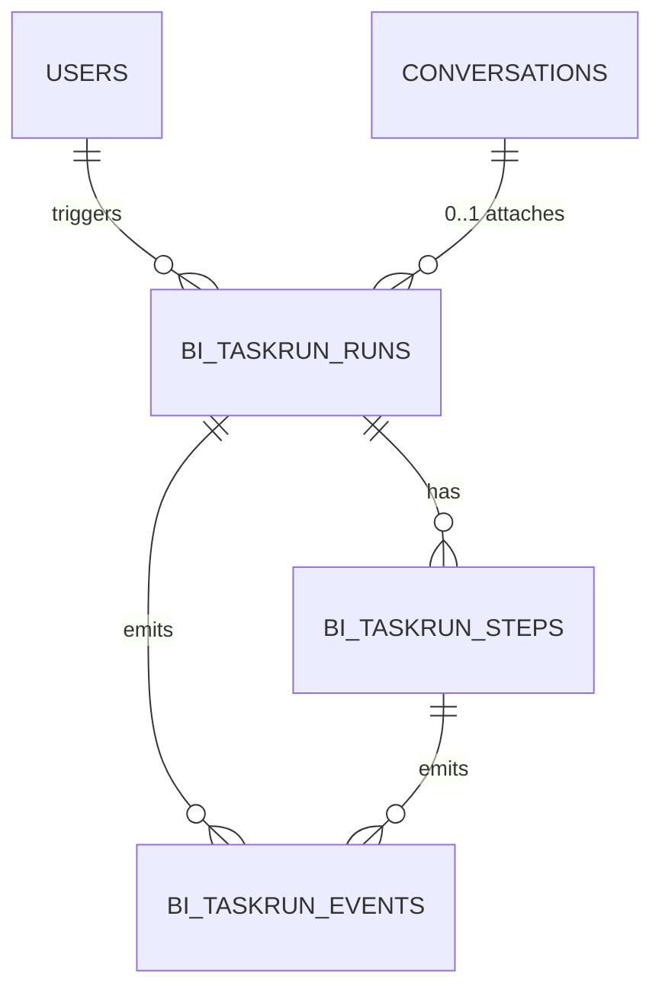
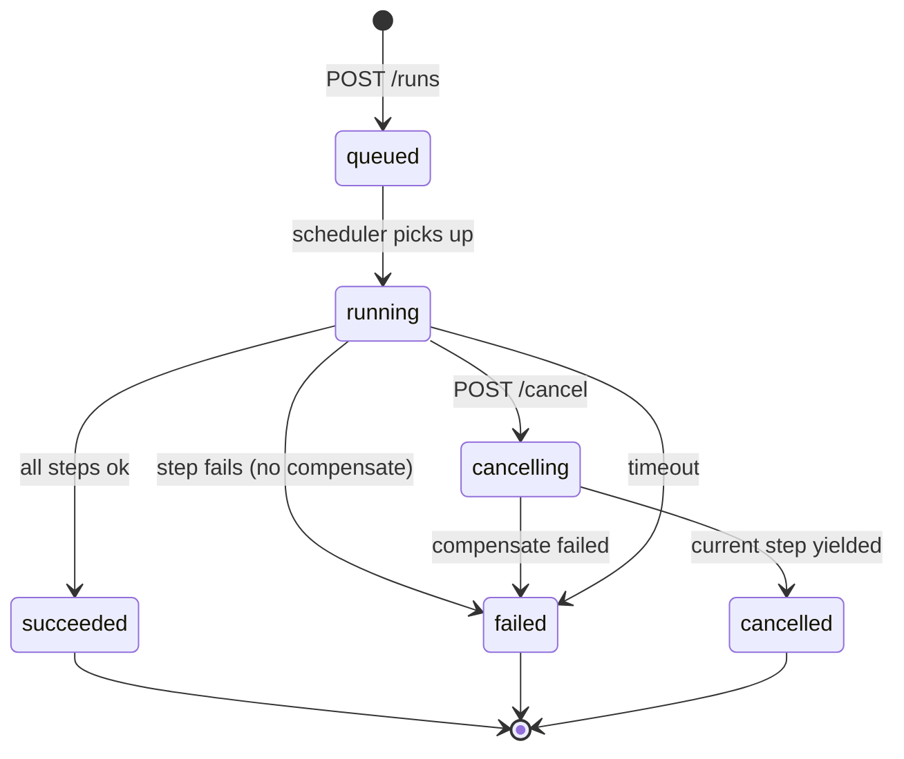
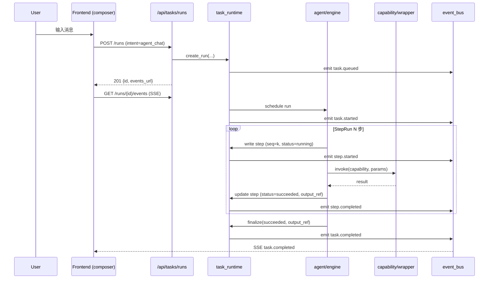

# Spec 24: Task Runtime 状态机与执行壳（前 OpenAI WebUI 借鉴方案 v0.2 重写）

> 版本：v0.2 | 状态：Engineering Spec（minimax 可开发） | 日期：2026-04-28 | 关联 PRD：内部路线图 P1
>
> **v0.2 变更**：v0.1（2026-04-16）为构想稿，覆盖 Task Runtime + Connection Hub + Governance Runtime + UI 设计四大主题，无错误码/安全矩阵/集成契约。本次重写按 `00-spec-template.md` 11 章工程模板重组，**范围收敛到 Task Runtime 状态机与执行壳**——这是批次 1 (T1.5) 的直接阻塞项。Connection Hub、Governance Runtime、视觉 Token 系统三块从本 spec 剥离，去向见 §10 开放问题。
>
> 原 v0.1 全文归档于 `docs/specs/_archive/24-openai-webui-inspired-architecture-ui-spec.v0.1.md`（如未归档，重写前可由 git 历史检索）。

---

## 1. 概述

### 1.1 目的

为 Mulan BI Platform 提供**任务驱动**的统一执行壳：用户输入（首页 ConversationBar / Agent / 后台批量动作）经由 `task_runtime` 转换为可观察、可取消、可审计的 **TaskRun**，每个 TaskRun 由若干 **StepRun** 组成，状态流转通过事件总线推送到前端 SSE。这是首页 Agent 化（Spec 36）、Conversation v2（Spec 21/25）、批量任务（Spec 33）共同依赖的底座。

### 1.2 范围

**包含**：
- TaskRun / StepRun / TaskEvent 数据模型
- TaskRun 状态机（含取消、超时、补偿）
- `/api/tasks/runs` REST + SSE 端点
- 与 `services/agent/`（Spec 36）和 `services/capability/`（Spec 20）的集成契约
- 与 Spec 16 事件总线的对接（事件类型）
- 前端 `features/task-runtime/` 最小骨架（store + composer 通道，不含 UI 视觉规范）

**不包含**（已从 v0.1 剥离）：
- ❌ Connection Hub 统一连接抽象 → 取决于批次 0 T0.5 ADR，单独立 spec
- ❌ Governance Runtime（PolicyDecision / ApprovalTicket）→ 后续 spec
- ❌ 视觉 Design Tokens / 首页布局 / 连接中心 IA → 属设计稿（Spec 21/25/34），不入工程 spec
- ❌ 多 Tableau Server / 多 LLM 选址策略 → Spec 22

### 1.3 关联文档

| 文档 | 路径 | 关系 |
|------|------|------|
| Spec 模板 | `docs/specs/00-spec-template.md` | 本 spec 结构遵循 |
| Spec 16 事件总线 | `docs/specs/16-notification-events-spec.md` | 下游消费 task.* 事件 |
| Spec 20 Capability Wrapper | `docs/specs/20-capability-wrapper-spec.md` | StepRun 调用入口 |
| Spec 21 首页重构 | `docs/specs/21-home-redesign-spec.md` | TaskRun 的 UI 引用方 |
| Spec 33 任务管理 | `docs/specs/33-task-management-spec.md` | Celery 任务侧 vs 本 spec 的 TaskRun 边界见 §1.4 |
| Spec 36 Agent 框架 | `docs/specs/36-data-agent-architecture-spec.md` | Agent 引擎挂在 TaskRun.intent="agent_chat" 之下 |

### 1.4 与 Spec 33 的边界

| 维度 | 本 spec (`bi_task_runs`) | Spec 33 (`bi_task_runs` Celery) |
|------|---------------------|---------------------------|
| 触发源 | 用户交互 / Agent | Celery Beat / 手动调度 |
| 生命周期 | 秒-分钟级 | 分钟-小时级 |
| 推送 | SSE 实时 | 轮询 / 事件 |
| 是否归档 | 30 天滚动 | 90 天清理（Spec 33） |

⚠️ **表名冲突**：Spec 33 已使用 `bi_task_runs`。本 spec 使用 `bi_taskrun_runs`（前缀避让）—— 见 §2.1 命名。

---

## 2. 数据模型

### 2.1 表定义

#### `bi_taskrun_runs`

| 列名 | 类型 | 约束 | 说明 |
|------|------|------|------|
| id | INTEGER | PK, AUTO | 主键 |
| trace_id | VARCHAR(64) | UNIQUE, NOT NULL, INDEX | 全链路追踪 ID（uuid v4 hex） |
| conversation_id | INTEGER | FK conversations(id), NULL | 关联会话（Agent 模式必填） |
| user_id | INTEGER | FK users(id), NOT NULL, INDEX | 触发用户 |
| intent | VARCHAR(64) | NOT NULL | `agent_chat` / `nlq_query` / `bulk_action` / `health_scan` 等 |
| status | VARCHAR(16) | NOT NULL, INDEX | 见 §4.1 状态机 |
| input_payload | JSONB | NOT NULL | 入参快照（含敏感参数脱敏后） |
| output_payload | JSONB | NULL | 终态结果引用（大对象走 object store，存引用键） |
| error_code | VARCHAR(16) | NULL | 终态为 failed / cancelled 时填，见 §5 |
| error_message | TEXT | NULL | 用户可见错误摘要（≤ 500 字符） |
| started_at | TIMESTAMP | NOT NULL, DEFAULT NOW | 创建时间 |
| finished_at | TIMESTAMP | NULL | 终态写入 |
| timeout_seconds | INTEGER | NOT NULL, DEFAULT 120 | 总超时 |
| created_at | TIMESTAMP | NOT NULL, DEFAULT NOW | 同 started_at |
| updated_at | TIMESTAMP | NOT NULL, DEFAULT NOW, ON UPDATE NOW | |

#### `bi_taskrun_steps`

| 列名 | 类型 | 约束 | 说明 |
|------|------|------|------|
| id | INTEGER | PK, AUTO | |
| task_run_id | INTEGER | FK bi_taskrun_runs(id) ON DELETE CASCADE, INDEX | |
| seq | INTEGER | NOT NULL | 步骤序号（从 1 起） |
| step_type | VARCHAR(32) | NOT NULL | `route` / `capability_invoke` / `tool_call` / `aggregate` / `compensate` |
| capability_name | VARCHAR(64) | NULL | 当 step_type=capability_invoke 时，对应 Spec 20 的 capability |
| status | VARCHAR(16) | NOT NULL | `pending` / `running` / `succeeded` / `failed` / `skipped` |
| input_ref | TEXT | NULL | JSONB inline 或 object store 引用 |
| output_ref | TEXT | NULL | 同上 |
| error_code | VARCHAR(16) | NULL | |
| started_at | TIMESTAMP | NULL | |
| finished_at | TIMESTAMP | NULL | |
| latency_ms | INTEGER | NULL | finished_at - started_at |

唯一索引：`(task_run_id, seq)`。

#### `bi_taskrun_events`

| 列名 | 类型 | 约束 | 说明 |
|------|------|------|------|
| id | BIGINT | PK, AUTO | |
| task_run_id | INTEGER | FK bi_taskrun_runs(id), INDEX | |
| step_id | INTEGER | FK bi_taskrun_steps(id), NULL | 步骤级事件填 |
| event_type | VARCHAR(32) | NOT NULL | 见 §7.3 |
| payload | JSONB | NOT NULL | 事件数据（≤ 8KB，超过走 output_ref） |
| emitted_at | TIMESTAMP | NOT NULL, DEFAULT NOW, INDEX | |

事件表 append-only，30 天后归档/截断（与 §1.4 滚动一致）。

### 2.2 ER 关系图



### 2.3 索引策略

| 表 | 索引名 | 列 | 类型 | 用途 |
|----|--------|-----|------|------|
| bi_taskrun_runs | ix_runs_user_status | (user_id, status, started_at DESC) | BTREE | 用户视角列表 |
| bi_taskrun_runs | ux_runs_trace | (trace_id) | UNIQUE | 跨服务关联 |
| bi_taskrun_steps | ix_steps_run | (task_run_id, seq) | UNIQUE BTREE | 步骤回放 |
| bi_taskrun_events | ix_events_run_time | (task_run_id, emitted_at) | BTREE | SSE 重放 |

### 2.4 迁移说明

- 新增三张表，使用 Alembic 增量迁移（参考 `.claude/rules/alembic.md` 表前缀约定 `bi_taskrun_*`）。
- 不与 Spec 33 `bi_task_runs` 冲突；如未来合并需在 ADR 中明确改名。
- 迁移命令：`alembic revision --autogenerate -m "add taskrun core tables"` + 人工审核约束。

---

## 3. API 设计

### 3.1 端点总览

| 方法 | 路径 | 说明 | 认证 | 角色 |
|------|------|------|------|------|
| POST | /api/tasks/runs | 创建 TaskRun | 需要 | user+ |
| GET | /api/tasks/runs/{id} | 查 TaskRun 详情 | 需要 | 创建者 / admin |
| GET | /api/tasks/runs/{id}/events | SSE 事件流 | 需要 | 创建者 / admin |
| POST | /api/tasks/runs/{id}/cancel | 取消 TaskRun | 需要 | 创建者 / admin |
| GET | /api/tasks/runs | 列表（自己） | 需要 | user+ |

不开放：删除 / 更新 payload。终态不可逆。

### 3.2 请求 / 响应 Schema

#### `POST /api/tasks/runs`

**请求**：
```json
{
  "intent": "agent_chat",
  "input": {
    "conversation_id": 42,
    "user_message": "Q1 各区域销售额"
  },
  "timeout_seconds": 60
}
```

**响应 (201)**：
```json
{
  "id": 12345,
  "trace_id": "5f9b...e2",
  "intent": "agent_chat",
  "status": "queued",
  "started_at": "2026-04-28T10:00:00Z",
  "events_url": "/api/tasks/runs/12345/events"
}
```

**错误响应**：见 §5。

#### `GET /api/tasks/runs/{id}/events`（SSE）

事件帧（一行一帧 `data: <json>\n\n`）：
```json
{ "event": "step.started", "step_id": 67, "seq": 1, "step_type": "route", "ts": "..." }
{ "event": "step.completed", "step_id": 67, "latency_ms": 120, "ts": "..." }
{ "event": "run.completed", "status": "succeeded", "output_ref": "obj://...", "ts": "..." }
```

事件类型枚举见 §7.3。客户端可携带 `Last-Event-ID` 头从 `bi_taskrun_events.id` 续流。

#### `POST /api/tasks/runs/{id}/cancel`

**请求**：`{}`

**响应 (200)**：`{ "id": 12345, "status": "cancelling" }`

幂等：重复取消返回当前状态，不报错。

---

## 4. 业务逻辑

### 4.1 状态机



合法转移表（拒绝非法转移返回 `TR_007`）：

| from \ to | queued | running | succeeded | failed | cancelling | cancelled |
|-----------|--------|---------|-----------|--------|-----------|-----------|
| queued    | -      | ✓       | ✗         | ✓ (validate fail) | ✓ | ✗ |
| running   | ✗      | -       | ✓         | ✓      | ✓         | ✗ |
| cancelling| ✗      | ✗       | ✗         | ✓      | -         | ✓ |
| 终态      | 全部 ✗ | | | | | |

### 4.2 校验规则

- `intent` 必须在白名单（`config/taskrun_intents.yaml`），不在则 `TR_001`
- `timeout_seconds` 范围 [5, 600]，超出 `TR_002`
- Agent 模式 `conversation_id` 必填且属于当前用户（`TR_003`）
- 单用户并发运行中 TaskRun ≤ 5（用户级反滥用），超过 `TR_008`

### 4.3 约束

- TaskRun 创建后**入参不可变**；任何参数修改新建 TaskRun
- StepRun 写入按 seq 单调递增，禁止跳号
- 状态写入走 Optimistic Lock（`updated_at` 版本号），并发更新冲突重试 3 次后 `TR_010`

---

## 5. 错误码

| 错误码 | HTTP | 说明 | 触发条件 |
|--------|------|------|---------|
| TR_001 | 400 | intent 不在白名单 | 创建时 |
| TR_002 | 400 | timeout 超出范围 | 创建时 |
| TR_003 | 403 | conversation_id 不属于当前用户 | 创建时 |
| TR_004 | 404 | TaskRun 不存在或无权访问 | 查询/取消时 |
| TR_005 | 409 | 当前状态不允许该操作 | 取消已完成 / 重复创建 |
| TR_006 | 504 | TaskRun 总超时 | running 超过 timeout_seconds |
| TR_007 | 500 | 非法状态转移（内部 bug） | 状态机不一致 |
| TR_008 | 429 | 并发上限 | user 5 个 running |
| TR_009 | 502 | 下游 capability 调用失败 | StepRun 失败 |
| TR_010 | 500 | 状态写入冲突 | OCC 重试耗尽 |

错误码统一在 `app/errors/error_codes.py` 注册（与 SPEC 01 错误码规范一致）。

---

## 6. 安全

### 6.1 RBAC 矩阵

| 操作 | admin | data_admin | analyst | user |
|------|-------|-----------|---------|------|
| 创建 TaskRun（intent=agent_chat / nlq_query） | Y | Y | Y | Y |
| 创建 TaskRun（intent=bulk_action / health_scan） | Y | Y | N | N |
| 查询自己的 TaskRun | Y | Y | Y | Y |
| 查询任意 TaskRun | Y | N | N | N |
| 取消自己的 TaskRun | Y | Y | Y | Y |
| 取消任意 TaskRun | Y | N | N | N |
| 列表（系统级） | Y | N | N | N |

### 6.2 加密

- `input_payload` / `output_payload` 中含敏感字段（密码、token、PII）必须经 `services/security/redactor.py` 脱敏后入库
- `output_ref` 指向的 object store 启用服务端加密（与现有数据源凭据加密同 Fernet 主密钥）

### 6.3 敏感度处理

- StepRun 调用 capability 时由 Spec 20 wrapper 做敏感度门禁，本层不重复检查
- 但 `error_message` 必须经 redactor，避免外抛 SQL 内容含 PII

---

## 7. 集成点

### 7.1 上游依赖

| 模块 | 接口 | 用途 |
|------|------|------|
| `services/agent/engine.py` (Spec 36) | `agent.run(task_run_id, input)` | Agent 模式 TaskRun 的执行体 |
| `services/capability/wrapper.py` (Spec 20) | `wrapper.invoke(...)` | StepRun(step_type=capability_invoke) 的统一调用入口 |
| `app/auth/dependencies.py` | `get_current_user` | 创建/查询时的 principal 注入 |

### 7.2 下游消费者

| 模块 | 消费方式 | 说明 |
|------|---------|------|
| 前端 `features/task-runtime/` | SSE 订阅 + REST 查询 | composer 提交后挂载 |
| `services/notifications/` (Spec 16) | 订阅 task.failed / task.completed 事件 | 邮件/站内通知触发 |
| Spec 36 Agent 引擎 | 写 step 与 emit 事件 | 推理过程外显化 |
| 审计中心 | 读 bi_taskrun_events | 全链路追踪查询 |

### 7.3 事件发射

| 事件名 | 触发时机 | Payload 关键字段 |
|--------|---------|---------|
| `task.queued` | 创建后 | `{run_id, intent, user_id, trace_id}` |
| `task.started` | 状态机进入 running | `{run_id, started_at}` |
| `task.completed` | succeeded | `{run_id, output_ref, latency_ms}` |
| `task.failed` | failed | `{run_id, error_code, error_message}` |
| `task.cancelled` | cancelled | `{run_id, cancelled_at}` |
| `step.started` | StepRun running | `{run_id, step_id, seq, step_type, capability_name}` |
| `step.completed` | StepRun succeeded/skipped | `{run_id, step_id, latency_ms}` |
| `step.failed` | StepRun failed | `{run_id, step_id, error_code}` |

事件同时写 `bi_taskrun_events` 与发布到 Spec 16 总线（双写，本地表为源数据，总线为消费通道）。

---

## 8. 时序图



取消路径：`POST /cancel` → TR 写 `cancelling` → Agent 在下一个 step 边界检查 → 优雅退出 → TR 写 `cancelled`。

---

## 9. 测试策略

### 9.1 关键场景

| # | 场景 | 预期 | 优先级 |
|---|------|------|--------|
| 1 | 创建 agent_chat TaskRun，Agent 跑 3 步成功 | 状态 succeeded，3 个 step.completed 事件 | P0 |
| 2 | 状态机非法转移（external 写 succeeded 时再写 running） | TR_007 + 事件不发出 | P0 |
| 3 | TaskRun 超时 | 状态 failed + TR_006 + step 当前状态保留 | P0 |
| 4 | 取消 running 中的 TaskRun | 状态 cancelled + 当前 step 标 skipped | P0 |
| 5 | analyst 创建 bulk_action | 403 RBAC 拒绝 | P0 |
| 6 | SSE 重连携带 Last-Event-ID | 从断点续流，无重复无丢失 | P1 |
| 7 | 单用户 6 个并发 running 创建第 7 个 | TR_008 | P1 |
| 8 | StepRun output > 8KB | 自动转 object store，event payload 仅含 ref | P1 |
| 9 | Agent 抛未捕获异常 | 状态 failed + TR_009 + error_message 已脱敏 | P0 |
| 10 | redactor 失败 | event 不发出，错误日志，不外抛敏感数据 | P0 |

### 9.2 验收标准

- [ ] 状态机所有合法转移有单元测试覆盖
- [ ] 状态机所有非法转移返回 TR_007 且不写库
- [ ] SSE 端点支持断线重连
- [ ] 与 Spec 16 总线双写一致性测试（事件表与总线消息计数对齐）
- [ ] RBAC 矩阵每行至少一个集成测试
- [ ] 超时取消的边界（5 秒、600 秒）正确

### 9.3 Mock 与测试约束

- **`task_runtime.scheduler`**：使用同步任务循环（不是 Celery 任务），单元测试用 `pytest-asyncio` + 模拟 `asyncio.sleep` 推进；不要 mock 整个 scheduler，而是 mock Agent.run 的返回。
- **SSE 端点**：FastAPI `StreamingResponse` 测试用 `httpx.AsyncClient.stream()`，断言 `data:` 帧序列；禁止用 `.post()` 直接读 body。
- **事件双写**：测试时禁止 mock `bi_taskrun_events` 写入（这是源数据），只 mock 总线发布。
- **OCC 冲突重试**：用 `pytest.MonkeyPatch` 注入两次写冲突，第三次成功；不要 mock 整个 SQLAlchemy session。
- **Object store**：使用本地临时目录后端（`MINIO_ENDPOINT=memory://`），不连真实 S3。

---

## 10. 开放问题

| # | 问题 | 负责人 | 状态 |
|---|------|--------|------|
| 1 | 与 Spec 33 `bi_task_runs` 是否合并到统一表 | architect | 待 ADR（批次 0 T0.5） |
| 2 | Connection Hub（v0.1 §3.C / §7）独立 spec 编号 | pm | 待立项（建议 Spec 38） |
| 3 | Governance Runtime（v0.1 §3.D）独立 spec | pm | 后续阶段，不在本次 minimax 内 |
| 4 | TaskRun 跨实例调度（多 worker） | architect | 暂用单 scheduler + DB 抢占；多实例方案 P2 |
| 5 | output_ref 默认对象存储后端选型（MinIO vs PG LO vs FS） | architect | 待批次 0 ADR |
| 6 | SSE 与 WebSocket 的取舍（移动端 SSE 兼容） | designer | 本期 SSE，移动端验证后再评估 |

---

## 11. 开发交付约束

### 11.1 架构约束

- `services/task_runtime/` **不得** import `app/api` 层任何模块
- 状态写入唯一入口：`task_runtime.state_machine.transition(run_id, target, *, expected_from)`，禁止业务代码直接 `UPDATE bi_taskrun_runs SET status=...`
- 事件发射唯一入口：`task_runtime.event_bus.emit(event_type, payload)`，内部双写本地表 + Spec 16 总线
- StepRun 调用下游必须经 `services/capability/wrapper.invoke`（Spec 20 wrapper），禁止 Agent 直接 import `services/tableau` 或 `services/llm`
- `bi_taskrun_events.payload` 写入前必须经 redactor，零例外

### 11.2 强制检查清单

- [ ] 所有状态转移走 `state_machine.transition`，grep 不到 `UPDATE bi_taskrun_runs SET status` 直接 SQL
- [ ] 所有事件发射走 `event_bus.emit`，grep 不到 `bi_taskrun_events.insert` 直接调用
- [ ] `error_message` 字段写入前调用 `redactor.redact_for_user_display`
- [ ] 新增 intent 时 `config/taskrun_intents.yaml` + 单元测试同步更新
- [ ] SSE 端点支持 `Last-Event-ID` 头
- [ ] 终态字段（`finished_at` / `error_code` / `output_payload`）只在状态机终态写入，禁止中间态写

### 11.3 验证命令

```bash
# 后端
cd backend && python3 -m py_compile services/task_runtime/*.py
cd backend && pytest tests/services/test_task_runtime.py -x -q
cd backend && pytest tests/api/test_tasks_runs.py -x -q

# 状态机不变量检查（架构红线 grep）
! grep -rE "UPDATE bi_taskrun_runs.*SET.*status" backend/services backend/app
! grep -rE "INSERT INTO bi_taskrun_events" backend/services backend/app | grep -v event_bus

# Alembic 迁移
cd backend && alembic upgrade head && alembic check
```

### 11.4 正确 / 错误示范

```python
# ✗ 错误 — 直接写状态，绕过状态机校验
session.query(TaskRun).filter_by(id=run_id).update({"status": "running"})

# ✓ 正确 — 走状态机
state_machine.transition(run_id, target="running", expected_from="queued")
```

```python
# ✗ 错误 — Agent 直接调 LLM，跳过 capability wrapper
from services.llm.service import complete
result = await complete(prompt)

# ✓ 正确 — 经 wrapper（Spec 20）
result = await capability_wrapper.invoke(
    principal=principal,
    capability="llm_complete",
    params={"prompt": prompt},
    trace_id=task_run.trace_id,
)
```

```python
# ✗ 错误 — 事件 payload 未脱敏
event_bus.emit("step.failed", {"error_message": str(exc)})

# ✓ 正确 — 经 redactor
event_bus.emit("step.failed", {
    "error_message": redactor.redact_for_user_display(str(exc), context="step_error"),
})
```

---

## 附录 A：v0.1 → v0.2 变更对照

| v0.1 章节 | 处置 | 去向 |
|----------|------|------|
| §1 背景与目标 | 收敛 | 本 v0.2 §1 聚焦 task_runtime |
| §2 WebUI 启发 | 删除 | 设计语境，不入工程 spec |
| §3.A API 层 / §3.B Task Runtime | 保留 | 本 v0.2 §3 + §11 |
| §3.C Connection Hub | 剥离 | OI-2 / 待立项 Spec 38 |
| §3.D Governance Runtime | 剥离 | OI-3 / 后续 spec |
| §3.E Audit / trace_id | 保留 | 本 v0.2 §6 / §7 |
| §3.2 前端结构 | 收敛到骨架 | 本 v0.2 §7.2 仅声明 store + composer 通道 |
| §4 统一对象模型 | 拆分 | TaskRun/StepRun/Event 留下；Connection/Policy/Approval 剥离 |
| §5 API 合约 | 拆分 | /tasks 留下；/connection-hub /governance 剥离 |
| §6 首页优化 / §7 后台连接中心 / §8 视觉 Token | 删除 | 设计稿语境，归 Spec 21/25/34 |
| §9 分阶段落地 | 删除 | 路线图归批次计划 |
| §10 风险护栏 | 保留 | 融入本 v0.2 §6 / §11 |
| §11 React 实现清单 | 删除 | UI 任务，归前端排期 |
| §12 结论 | 删除 | spec 不需要总结 |
