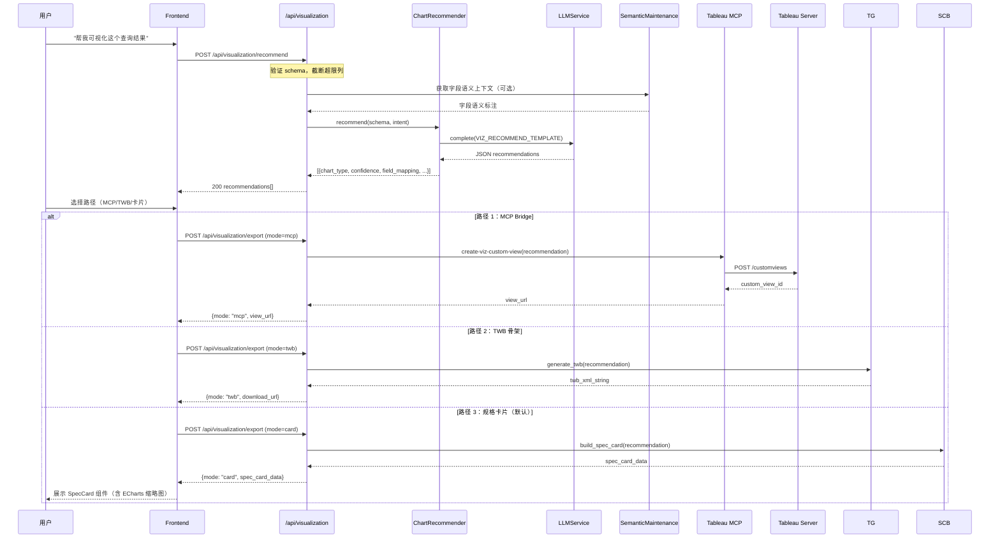

# Viz Agent — 图表推荐与 Tableau 输出引导技术规格书
# （附录 A，合并入 Spec 26：Agentic Tableau MCP）

| 版本 | 日期 | 状态 | Owner |
|------|------|------|-------|
| v0.1 | 2026-04-20 | Draft |  |

> **定位说明**：本文档作为 Spec 26 的附录 A 存在，不单独立项。
> 所有编号以 `VIZ_` 前缀区分；与 Spec 26 共享 Tableau MCP 基础设施。

---

## 目录

1. [概述](#1-概述)
2. [能力边界](#2-能力边界)
3. [技术架构](#3-技术架构)
4. [数据流](#4-数据流)
5. [API 设计](#5-api-设计)
6. [数据模型](#6-数据模型)
7. [安全考虑](#7-安全考虑)
8. [错误码](#8-错误码)
9. [测试策略与验收标准](#9-测试策略与验收标准)
10. [与 Spec 26 的合并方案](#10-与-spec-26-的合并方案)
11. [开放问题](#11-开放问题)

---

## 1. 概述

### 1.1 目的

当前 Mulan BI Platform 的 Agentic 链路（Spec 26）已能完成"查数→字段匹配→语义回写"闭环，但缺乏**将查询结果导向可视化形态**的最后一公里能力：Agent 查出数据后，用户仍需手工判断该用折线图还是柱状图，并在 Tableau 中手工搭建。

Viz Agent 填补这一空白：
- **图表推荐层**：接收 SQL 查询结果 schema + 用户意图，LLM 语义推理输出最优图表类型与推荐理由
- **Tableau 输出层**：通过三条路径将推荐落地到 Tableau（MCP 直调、TWB 骨架、规格卡片）
- **平台内预览**：ECharts 仅用于缩略图预览，不作为主渲染方案

### 1.2 范围

**包含：**
- 图表推荐 LLM 推理链路（输入 schema → 输出类型 + 理由）
- Tableau 输出三路径（MCP Bridge / TWB 骨架 / 规格卡片）
- ECharts 预览缩略图渲染（平台内，仅预览态）
- 新增 3 个 MCP tools（含入 Spec 26 工具集）
- 新增 2 个后端 API 端点
- 前端规格卡片 UI 组件

**不包含：**
- 通用 BI 可视化平台（这是 Tableau 的职责，非 Mulan Non-Goal）
- ECharts 完整交互图表（不支持用户在平台内做图表配置）
- 数据查询本身（查询已由 NL-to-Query / Spec 14 覆盖）
- Tableau Prep / Flow 等 ETL 流程

### 1.3 关联文档

| 文档 | 路径 | 关系 |
|------|------|------|
| Agentic Tableau MCP（主 Spec） | `docs/specs/26-agentic-tableau-mcp-spec.md` | 父 Spec，共享工具集和基础设施 |
| NL-to-Query 流水线 | `docs/specs/14-nl-to-query-pipeline-spec.md` | 上游：提供 SQL 查询结果 schema |
| LLM 能力层 | `docs/specs/08-llm-layer-spec.md` | 依赖：LLMService 单例 |
| Tableau MCP V1 | `docs/specs/07-tableau-mcp-v1-spec.md` | 依赖：MCP tool 框架 + 认证体系 |
| 语义治理 | `docs/specs/09-semantic-maintenance-spec.md` | 依赖：字段语义上下文组装 |

---

## 2. 能力边界

### 2.1 图表推荐层（Chart Recommendation）

**定位**：纯 LLM 语义推理，不做任何客户端渲染。

```
输入 ──────────────────────────────────────────────────
  schema: {
    columns: [{name, dtype, role}],   // 列名、数据类型、语义角色
    row_count_estimate: "~10K",        // 行数量级（不传原始数据）
    sample_values?: [...]              // 可选：各列最多 3 个样本值
  }
  user_intent: "分析各区域销售趋势"    // 自然语言意图

输出 ──────────────────────────────────────────────────
  recommendations: [
    {
      chart_type: "line",
      confidence: 0.92,
      reason: "存在时间维度(Order Date)和连续度量(Sales)，折线图最适合展示趋势",
      field_mapping: {x: "Order Date", y: "Sales", color: "Region"},
      tableau_mark_type: "Line"
    },
    {
      chart_type: "bar",
      confidence: 0.71,
      reason: "也可用柱状图对比各区域绝对值",
      field_mapping: {x: "Region", y: "Sales"},
      tableau_mark_type: "Bar"
    }
  ]
```

**约束：**
- 推理不依赖真实数据值，仅依赖 schema（避免数据泄露给 LLM）
- 输出至多 3 个候选，按 confidence 降序
- 默认推荐第一名，不自动执行——人工确认后才触发 Tableau 输出

### 2.2 支持的图表类型映射

| 图表类型 | 标识 | Tableau Mark Type | 适用条件 |
|---------|------|-------------------|---------|
| 折线图 | `line` | Line | ≥1 时间维度 + ≥1 连续度量 |
| 柱状图 | `bar` | Bar | 离散维度 + ≥1 度量 |
| 散点图 | `scatter` | Circle | ≥2 连续度量 |
| 热力图 | `heatmap` | Square | 2 离散维度 + 1 度量（密度） |
| 面积图 | `area` | Area | 同折线，强调累积或占比 |
| 饼/环图 | `pie` | Pie | ≤7 个离散值 + 1 度量（占比语义） |
| 地图 | `geo` | Map | 含地理字段（Country/State/City 等） |
| 甘特图 | `gantt` | Gantt | ≥2 时间字段（start/end） |

> 当 LLM 无法确定时，退回 `bar`（最通用）并注明原因。

### 2.3 Tableau 输出三路径

```
路径 1 — MCP Bridge（推荐，自动化程度最高）
  适用：已配置 Tableau MCP 连接 + 目标工作簿已存在
  行为：通过 MCP 工具直接在 Tableau 中创建/更新 Custom View
  限制：依赖 Tableau Server 3.18+ 和已激活的 MCP 连接

路径 2 — TWB 骨架生成（半自动，本地 Tableau Desktop 用户）
  适用：无实时 MCP 连接，或需要在 Desktop 环境编辑
  行为：生成最小化 Tableau Workbook XML（.twb 骨架）含字段映射 + 标记类型
  限制：骨架不含数据源连接配置，用户需手动绑定数据源

路径 3 — 规格卡片（最低依赖，100% 兼容）
  适用：任何场景，作为路径 1/2 的降级方案
  行为：在平台内展示可视化规格卡片（图表类型 + 字段角色 + Tableau 操作步骤）
  包含：操作指南文字 + ECharts 预览缩略图（低精度示意，非精确预览）
```

### 2.4 ECharts 定位（严格边界）

ECharts 在本模块的唯一用途是**规格卡片内的预览缩略图**：
- 尺寸：最大 320×200px
- 数据：使用推断的 schema 生成模拟数据（非真实查询数据）
- 交互：只读，无 tooltip/zoom/legend 等交互
- 目的：帮助用户在确认前直观感受图表形态

禁止将 ECharts 作为生产图表、替代 Tableau 展示真实业务数据。

---

## 3. 技术架构

### 3.1 模块位置（方案 B：独立模块 + 共享基础设施）

```
backend/services/
└── visualization/               # 新建独立服务模块
    ├── __init__.py
    ├── chart_recommender.py     # 图表推荐主逻辑（LLM 调用）
    ├── twb_generator.py         # TWB 骨架生成器
    ├── spec_card_builder.py     # 规格卡片数据组装
    └── prompts.py               # 推荐用 Prompt 模板

backend/app/api/
└── visualization.py             # FastAPI 路由层（2 个端点）

backend/services/tableau/
└── tableau_mcp.py               # 新增 3 个 MCP tools（追加到 Spec 26 工具集）

frontend/src/components/
└── SpecCard/                    # 规格卡片 UI 组件
    ├── SpecCard.tsx
    ├── EChartsPreview.tsx       # 缩略图子组件
    └── TableauSteps.tsx         # 操作步骤子组件
```

### 3.2 依赖关系

```mermaid
graph TB
    subgraph 新增模块
        CR[chart_recommender.py]
        TG[twb_generator.py]
        SCB[spec_card_builder.py]
        VIZ_API[visualization.py 路由]
    end

    subgraph 共享基础设施（复用）
        LLM[LLMService 单例]
        MCP[tableau_mcp.py + 3 new tools]
        SM[semantic_maintenance]
        AUTH[Auth/RBAC 守卫]
    end

    subgraph 外部
        Tableau[Tableau Server]
        NLQ[NL-to-Query 结果]
    end

    NLQ -->|query_schema| VIZ_API
    VIZ_API --> CR
    VIZ_API --> TG
    VIZ_API --> SCB
    CR -->|complete()| LLM
    CR -->|字段语义上下文| SM
    TG -->|create-custom-view| MCP
    MCP --> Tableau
    VIZ_API -->|守卫| AUTH
```

### 3.3 图表推荐 Prompt 设计

**System Prompt：**
```
你是 Mulan BI Platform 的图表推荐专家。
根据数据 schema 和用户意图，推荐最合适的 Tableau 图表类型。

规则：
1. 只分析列的名称、数据类型、语义角色，不需要真实数据值
2. 输出严格遵循 JSON schema，不添加任何额外说明
3. 最多推荐 3 个图表类型，按置信度降序
4. chart_type 必须是: line/bar/scatter/heatmap/area/pie/geo/gantt 之一
5. tableau_mark_type 必须是 Tableau 合法 Mark Type
6. reason 字段用中文，≤50 字
```

**User Prompt 模板（`VIZ_RECOMMEND_TEMPLATE`）：**
```
数据 Schema：
{schema_json}

用户意图：{user_intent}

请输出图表推荐（JSON 格式）：
```

**Token 预算**：单次调用 ≤ 1500 tokens（schema 压缩后传入，不传原始行数据）

---

## 4. 数据流

### 4.1 完整请求-响应时序



### 4.2 路径 2 TWB 骨架生成逻辑

```
输入：推荐结果 + 字段映射
输出：最小化 TWB XML

TWB 骨架结构：
  <workbook>
    <datasources/>          ← 空占位，用户手动绑定
    <worksheets>
      <worksheet name="Sheet 1">
        <table>
          <view>
            <datasource/>   ← 数据源引用（占位）
            <rows/>         ← 行字段（来自 field_mapping）
            <cols/>         ← 列字段（来自 field_mapping）
            <marks class="{tableau_mark_type}"/>
          </view>
        </table>
      </worksheet>
    </worksheets>
  </workbook>

字段映射规则：
  x → <cols>（维度字段）
  y → <rows>（度量字段，SUM 聚合）
  color → <marks><encoding channel="color">
```

> TWB 骨架不包含数据源连接凭证，安全风险极低。

---

## 5. API 设计

### 5.1 端点总览

| 方法 | 路径 | 说明 | 认证 | 最低角色 |
|------|------|------|------|---------|
| POST | `/api/visualization/recommend` | 图表推荐 | 需要 | analyst |
| POST | `/api/visualization/export` | 触发输出（三路径） | 需要 | analyst |

### 5.2 新增 MCP Tools（追加入 Spec 26 工具集）

| Tool Name | 功能 | 所属路径 |
|-----------|------|---------|
| `create-viz-custom-view` | 根据推荐结果创建带字段配置的 Custom View | 路径 1 |
| `get-workbook-datasources-for-viz` | 列出可用数据源及其字段摘要（供字段映射确认） | 路径 1 前置 |
| `validate-field-mapping` | 验证推荐的字段映射在目标数据源中是否合法 | 路径 1 前置 |

---

### 5.3 POST `/api/visualization/recommend`

**请求 Body：**
```json
{
  "query_schema": {
    "columns": [
      {"name": "Order Date", "dtype": "DATE", "role": "dimension"},
      {"name": "Sales", "dtype": "FLOAT", "role": "measure"},
      {"name": "Region", "dtype": "STRING", "role": "dimension"}
    ],
    "row_count_estimate": "~50K",
    "sample_values": {
      "Order Date": ["2024-01-01", "2024-06-15"],
      "Region": ["East", "West", "South"]
    }
  },
  "user_intent": "分析各区域的月度销售趋势",
  "datasource_luid": "abc-123",
  "connection_id": 1
}
```

| 字段 | 类型 | 必填 | 说明 |
|------|------|------|------|
| `query_schema.columns` | array | Y | 最多 50 列，超出截断 |
| `query_schema.row_count_estimate` | string | N | 量级描述，不传真实行数 |
| `query_schema.sample_values` | object | N | 各列最多 5 个样本值，用于语义辅助 |
| `user_intent` | string | N | 自然语言意图，缺省时纯靠 schema 推理 |
| `datasource_luid` | string | N | 提供时自动获取语义层字段上下文 |
| `connection_id` | integer | N | Tableau 连接 ID，与 datasource_luid 配合 |

**响应 (200)：**
```json
{
  "recommendations": [
    {
      "rank": 1,
      "chart_type": "line",
      "confidence": 0.92,
      "reason": "时间维度+连续度量，折线图最适合展示月度趋势",
      "field_mapping": {
        "x": "Order Date",
        "y": "Sales",
        "color": "Region",
        "detail": null,
        "size": null,
        "label": null
      },
      "tableau_mark_type": "Line",
      "suggested_title": "各区域月度销售趋势"
    }
  ],
  "meta": {
    "columns_analyzed": 3,
    "columns_truncated": 0,
    "llm_provider": "openai",
    "latency_ms": 850
  }
}
```

**错误响应：**
```json
{
  "error_code": "VIZ_001",
  "message": "query_schema.columns 不能为空",
  "detail": {}
}
```

---

### 5.4 POST `/api/visualization/export`

**请求 Body：**
```json
{
  "recommendation": { /* 来自 /recommend 响应中的单个 recommendation 对象 */ },
  "mode": "card",
  "mcp_config": {
    "connection_id": 1,
    "workbook_luid": "wb-xyz",
    "target_sheet": "Sheet 1"
  }
}
```

| 字段 | 类型 | 必填 | 说明 |
|------|------|------|------|
| `recommendation` | object | Y | 选定的推荐结果 |
| `mode` | enum | Y | `mcp` / `twb` / `card` |
| `mcp_config` | object | N | mode=mcp 时必填 |

**响应 (200) — mode=card：**
```json
{
  "mode": "card",
  "spec_card": {
    "chart_type": "line",
    "title": "各区域月度销售趋势",
    "field_roles": [
      {"field": "Order Date", "role": "Columns（X 轴）", "aggregation": "MONTH"},
      {"field": "Sales", "role": "Rows（Y 轴）", "aggregation": "SUM"},
      {"field": "Region", "role": "Color（颜色）", "aggregation": null}
    ],
    "tableau_steps": [
      "1. 打开 Tableau，连接到目标数据源",
      "2. 拖拽 [Order Date] 到 Columns，右键设为 MONTH(Order Date)",
      "3. 拖拽 [Sales] 到 Rows",
      "4. 拖拽 [Region] 到 Marks → Color",
      "5. 在 Marks 卡中选择 Line 类型"
    ],
    "echarts_preview_config": {
      "type": "line",
      "mock_data": { /* ECharts option 对象，使用模拟数据 */ }
    }
  }
}
```

**响应 (200) — mode=mcp：**
```json
{
  "mode": "mcp",
  "view_url": "https://tableau.example.com/views/...",
  "custom_view_id": "cv-abc123",
  "message": "已在 Tableau 中创建 Custom View"
}
```

**响应 (200) — mode=twb：**
```json
{
  "mode": "twb",
  "download_url": "/api/visualization/export/download/twb_xxxxx.twb",
  "expires_at": "2026-04-20T12:00:00Z",
  "filename": "各区域月度销售趋势.twb"
}
```

---

## 6. 数据模型

### 6.1 `bi_viz_recommendation_logs`（推荐日志表）

本模块不新增状态型持久化表（推荐结果为无状态计算），仅写审计日志：

| 列名 | 类型 | 约束 | 说明 |
|------|------|------|------|
| `id` | BIGSERIAL | PK | 主键 |
| `user_id` | INTEGER | FK → auth_users.id | 请求用户 |
| `connection_id` | INTEGER | FK → tableau_connections.id, NULLABLE | 关联连接 |
| `input_schema_hash` | VARCHAR(64) | NOT NULL | schema 的 SHA-256（不存原始数据）|
| `user_intent` | TEXT | NULLABLE | 用户意图原文 |
| `top_recommendation` | VARCHAR(32) | NOT NULL | 最高置信度图表类型 |
| `export_mode` | VARCHAR(16) | NULLABLE | `mcp` / `twb` / `card` / null |
| `export_success` | BOOLEAN | NULLABLE | 导出是否成功 |
| `llm_latency_ms` | INTEGER | NULLABLE | LLM 响应延迟 |
| `created_at` | TIMESTAMP | NOT NULL, DEFAULT NOW | 创建时间 |

**索引：**

| 索引名 | 列 | 类型 | 用途 |
|--------|-----|------|------|
| `idx_viz_logs_user_created` | (user_id, created_at) | BTREE | 用户历史查询 |
| `idx_viz_logs_connection` | connection_id | BTREE | 连接维度分析 |

**迁移说明：**
- `input_schema_hash` 用于统计重复 schema 分布，不存储原始 schema（隐私保护）
- `export_success` 为 NULL 表示仅推荐未导出

### 6.2 TWB 临时文件存储

TWB 骨架文件存储在后端本地临时目录（`/tmp/mulan_twb/`），通过签名 URL 提供下载，下载链接有效期 1 小时，过期自动清理。

**不写入 PostgreSQL**，不跨进程持久化。

---

## 7. 安全考虑

### 7.1 角色权限矩阵

| 操作 | admin | data_admin | analyst | user |
|------|:-----:|:----------:|:-------:|:----:|
| `/recommend` — 图表推荐 | Y | Y | Y | N |
| `/export?mode=card` — 规格卡片 | Y | Y | Y | N |
| `/export?mode=twb` — TWB 骨架下载 | Y | Y | Y | N |
| `/export?mode=mcp` — MCP Bridge 写入 | Y | Y | N | N |

MCP Bridge（路径 1）的写操作限定为 `data_admin` 以上，与 Spec 26 写操作权限保持一致。

### 7.2 数据安全红线

1. **LLM 不得接收真实数据值**：`/recommend` 端点接收 schema + sample_values，`sample_values` 经后端过滤，每列最多 5 个，且仅发送到 LLM 用于类型推断，不落日志
2. **高敏感字段过滤**：`sensitivity_level = high | confidential` 的字段，系统自动从 schema 中移除后再传给 LLM（复用 `BLOCKED_SENSITIVITY` 逻辑，见 §9.4 ARCHITECTURE.md）
3. **TWB 骨架无凭证**：生成的 TWB 文件不含任何数据库连接字符串、PAT Token 等凭证
4. **LLM 返回内容 HTML 转义**：`reason` 字段渲染前进行 XSS 转义
5. **input_schema_hash 审计**：日志仅存哈希，不存原始 schema，避免 PII 落库

### 7.3 MCP Bridge 写操作安全（继承 Spec 26 规则）

- 路径 1 调用 `create-viz-custom-view` 前，前端必须展示"执行计划确认"弹窗（即 Spec 26 §2.4 的确认模式）
- 写操作失败不自动重试
- 所有 MCP 写操作写入 `mcp_debug_logs` 审计表（Spec 26 Phase 3 基础设施）

---

## 8. 错误码

| 错误码 | HTTP | 说明 | 触发条件 |
|--------|------|------|---------|
| `VIZ_001` | 400 | schema 列为空 | `columns` 数组长度为 0 |
| `VIZ_002` | 400 | 列数超限 | `columns` 超过 50 列（已截断仍超限） |
| `VIZ_003` | 422 | LLM 返回格式无效 | JSON 解析失败，重试 1 次仍失败 |
| `VIZ_004` | 502 | LLM 服务不可用 | LLMService 调用超时或无可用配置 |
| `VIZ_005` | 400 | mode=mcp 但 mcp_config 缺失 | mode=mcp 时 mcp_config 为 null |
| `VIZ_006` | 403 | 权限不足（MCP 写操作） | analyst 调用 mode=mcp |
| `VIZ_007` | 404 | TWB 下载链接已过期 | 1 小时内未下载，文件已清理 |
| `VIZ_008` | 400 | 高敏感字段被全部过滤 | 所有列均为 high/confidential，schema 为空 |
| `VIZ_009` | 503 | Tableau MCP 连接不可用 | mode=mcp 时 MCP 连接断开 |

---

## 9. 测试策略与验收标准

### 9.1 后端单元测试场景

| # | 场景 | 预期 | 优先级 |
|---|------|------|--------|
| 1 | 含时间维度 + 连续度量 → 推荐折线图 | `top_recommendation = "line"`, `confidence ≥ 0.8` | P0 |
| 2 | 仅离散维度 + 度量 → 推荐柱状图 | `top_recommendation = "bar"` | P0 |
| 3 | LLM 返回非法 JSON → 重试 1 次后返回 VIZ_003 | HTTP 422 | P0 |
| 4 | schema 含 high 敏感字段 → 字段被过滤 | LLM 调用 prompt 中不含该字段 | P0 |
| 5 | schema 所有字段均为 confidential → VIZ_008 | HTTP 400 | P1 |
| 6 | mode=twb → 生成合法 XML，包含正确 mark type | XML 可解析，`<marks class="Line">` | P1 |
| 7 | analyst 调用 mode=mcp → 403 | HTTP 403 | P0 |
| 8 | TWB 下载 URL 过期后访问 → VIZ_007 | HTTP 404 | P1 |

### 9.2 前端组件测试场景

| # | 场景 | 预期 | 优先级 |
|---|------|------|--------|
| 1 | SpecCard 渲染 3 个推荐 → 展示 rank 1 为默认选中 | rank=1 card 高亮，其余可选 | P0 |
| 2 | EChartsPreview 仅渲染缩略图尺寸 | 容器 ≤ 320px 宽 | P1 |
| 3 | mode=mcp 点击确认 → 弹出执行计划确认弹窗 | 弹窗含字段映射 diff | P0 |
| 4 | LLM 返回 0 推荐 → 空状态展示 | "暂无推荐，请检查数据 Schema" | P1 |

### 9.3 验收标准（AC）

- [ ] **AC-VIZ-01**：`POST /recommend` 在 mock LLM 下，含时间维度 schema 返回 `line` 为 rank 1
- [ ] **AC-VIZ-02**：高敏感字段不出现在 LLM 调用 prompt 中（测试断言 mock LLM call 的 messages 参数）
- [ ] **AC-VIZ-03**：`mode=twb` 返回合法 TWB XML（Python minidom 解析无异常）
- [ ] **AC-VIZ-04**：`mode=mcp` 在 analyst 角色下返回 HTTP 403
- [ ] **AC-VIZ-05**：`/recommend` 接口 P99 延迟（含 LLM）≤ 3s（性能测试，staging 环境）
- [ ] **AC-VIZ-06**：`bi_viz_recommendation_logs` 成功写入每次推荐记录，且 `input_schema_hash` 不含原始列名
- [ ] **AC-VIZ-07**：SpecCard 组件通过 `npm run type-check` 零错误
- [ ] **AC-VIZ-08**：ECharts 预览容器宽度 ≤ 320px（DOM 测试）

---

## 10. 与 Spec 26 的合并方案

### 10.1 工具集整合

Viz Agent 新增以下 3 个 MCP tools，追加入 Spec 26 §4 工具清单，总计由 32 个升至 **35 个**：

| Tool Name | 功能 | Phase |
|-----------|------|-------|
| `create-viz-custom-view` | 根据推荐字段映射创建可视化 Custom View | Phase 2（与 Spec 26 视图控制同步） |
| `get-workbook-datasources-for-viz` | 列出可用数据源字段摘要（给推荐确认用） | Phase 1 |
| `validate-field-mapping` | 验证字段映射在目标数据源中的合法性 | Phase 1 |

### 10.2 System Prompt 整合

`VIZ_RECOMMEND_TEMPLATE` 合并入 Spec 26 §5（System Prompt 设计框架），作为新的工具调用策略分支：

```
用户指令类型判断新增：
⑤ "帮我可视化/做个图/分析这个结果" → 图表推荐链
   /recommend(schema, intent)
   → 展示推荐卡片（最多 3 个候选）
   → 用户选择路径
   → [MCP] create-viz-custom-view
   → [TWB] 下载骨架
   → [Card] 展示规格卡片
```

### 10.3 路线图对齐

| Viz Agent 阶段 | 对齐 Spec 26 Phase | 说明 |
|------------------------|------------------|------|
| 图表推荐 LLM 推理 + 规格卡片 | Phase 1（与字段智能化并行） | 纯 LLM 推理，不依赖写操作基础设施 |
| MCP Bridge 路径 1 | Phase 2（依赖 create-custom-view） | 复用 Phase 2 的 Custom View 工具 |
| TWB 骨架生成 | Phase 2 | 独立工程，不依赖 Tableau API |
| 审计日志整合 | Phase 3（与 Spec 26 审计体系统一） | 写入同一 `mcp_debug_logs` 聚合查询 |

### 10.4 前端入口整合

Viz Agent 的入口集成在 Spec 14（NL-to-Query）查询结果面板的"可视化"按钮，不新建独立页面。调用链：

```
NLQ 查询结果面板
  → "推荐图表" 按钮
  → POST /api/visualization/recommend（携带当前查询 schema）
  → SpecCard 弹出层（覆盖在结果表格上方）
  → 用户选路径 → 导出
```

---

## 11. 开放问题

| # | 问题 | 负责人 | 状态 | 截止 |
|---|------|--------|------|------|
| 1 | `sample_values` 是否发送给 LLM？当前设计发送，但需确认与隐私政策是否冲突，特别是含 PII 的样本值（如姓名字段样本） | architect / 数据 DPO | 待定 | — |
| 2 | TWB 骨架的数据源绑定：骨架中使用字段名还是 LUID？字段名有利于可读性，LUID 更精确但与版本绑定 | coder | 待定 | — |
| 3 | `create-viz-custom-view` 的 filter 状态是否从推荐中自动填充？还是只配置字段映射？（关联 Spec 26 Custom View API 的能力范围） | architect | 待定 | — |
| 4 | ECharts 缩略图是否可以异步渲染（降低首屏响应时间）？规格卡片主体先展示，缩略图后加载 | designer / coder | 待定 | — |
| 5 | 当 `datasource_luid` 未提供时，图表推荐纯靠列名语义推断，置信度是否足够？是否需要强制要求提供数据源？ | pm / architect | 待定 | — |
| 6 | `bi_viz_recommendation_logs` 中是否需要存储完整 `recommendations` JSON？有利于后续 LLM 调优，但增加存储量 | architect | 待定 | — |

---

## 附录：Spec 变更记录

| 版本 | 日期 | 变更内容 | Author |
|------|------|---------|--------|
| v0.1 | 2026-04-20 | 初始版本：图表推荐层 + 三路径 Tableau 输出 + 合并方案 |  |
