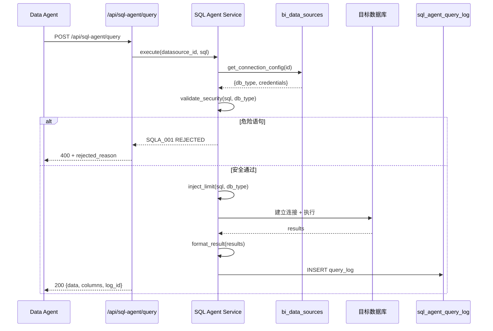

# SQL Agent 技术规格书

> 版本：v0.3 | 状态：已审查（minimax 通过） | 日期：2026-04-28 | 关联 PRD：待创建

> **变更说明（v0.3）**：补齐开发交付约束章节、Spec 20 wrapper 集成、Spec 28 actor 契约对齐、Hive 方言定位、注释 / 多语句 / UNION 注入防护、对应 P0 测试。

---

## 1. 概述

### 1.1 目的

定义 Mulan BI 平台 SQL Agent 的完整技术规格。SQL Agent 是自然语言到 SQL 执行的全链路引擎，负责：接收结构化或自然语言查询请求、路由到目标数据源（StarRocks / MySQL / PostgreSQL）、执行安全校验与方言适配、返回格式化结果。

SQL Agent 是 Data Agent 的下游执行器（HTTP API 模式），也是 NL-to-Query Pipeline（Spec 14）的底层执行依赖。

### 1.2 范围

| 包含 | 不包含 |
|------|--------|
| 多方言 SQL 解析与安全校验（StarRocks / MySQL / PostgreSQL） | NL 意图分类（由 Spec 14 负责） |
| 方言感知的结果集格式适配 | 外部向量存储 / 知识库集成 |
| JSONB 查询日志（`sql_agent_query_log`） | 数据分类 / 敏感字段脱敏（由调用方负责） |
| 强制 LIMIT 注入（防爆内存） | 前端 UI 实现 |
| HTTP API 接口（供 Data Agent / 平台调用） | 嵌套 Tool Calling 模式 |

### 1.3 关联文档

| 文档 | 路径 | 关系 |
|------|------|------|
| Spec 28（Data Agent） | `docs/specs/28-data-agent-spec.md` | 上游调度方，HTTP API 调用本模块 |
| Spec 14（NL-to-Query Pipeline） | `docs/specs/14-nl-to-query-pipeline-spec.md` | **同层协作**：意图分类/字段映射后，SQL 执行依赖本模块 |
| Spec 08（LLM Layer） | `docs/specs/08-llm-layer-spec.md` | LLM 调用规范（如需 AI 辅助改写） |
| Spec 15（数据治理） | `docs/specs/15-data-governance-quality-spec.md` | 查询结果质量校验 |
| 数据模型概览 | `docs/specs/03-data-model-overview.md` | `sql_agent_query_log` 表定义 |
| 错误码标准 | `docs/specs/01-error-codes-standard.md` | 错误码命名规范 |

---

## 2. 系统架构

### 2.1 架构定位

SQL Agent 是**执行层 Agent**——它不负责查询规划或自然语言理解，只负责：接收规范化 SQL（或结构化查询对象）、执行安全校验、执行目标方言、返回结构化结果。

```
┌──────────────────────────────────────────────────────────┐
│                      SQL Agent                           │
│  ┌────────────────────────────────────────────────────┐  │
│  │  Router：根据 datasource_id 加载连接配置 + 方言判定  │  │
│  └────────────────────────────────────────────────────┘  │
│                          │                                │
│  ┌────────────────────────────────────────────────────┐  │
│  │  Security Validator（sqlglot 语法树 + 白名单规则）  │  │
│  │  · 危险语句拦截（DROP/TRUNCATE/DELETE/ALTER）       │  │
│  │  · 强制 LIMIT 注入                                   │  │
│  │  · 结果集上限控制                                    │  │
│  └────────────────────────────────────────────────────┘  │
│                          │                                │
│  ┌────────────────────────────────────────────────────┐  │
│  │  Executor：方言适配执行（StarRocks / MySQL / PGSQL） │  │
│  └────────────────────────────────────────────────────┘  │
│                          │                                │
│  ┌────────────────────────────────────────────────────┐  │
│  │  Result Formatter：标准化返回（JSON 序列化）          │  │
│  └────────────────────────────────────────────────────┘  │
└──────────────────────────────────────────────────────────┘
           │                              ▲
           ▼                              │
┌──────────────────────┐    ┌──────────────────────────┐
│  PostgreSQL（元数据库） │    │  Data Agent（HTTP 调用）  │
│  平台内部表            │    │  NL-to-Query（Spec 14）  │
│  auth_users/          │    └──────────────────────────┘
│  bi_data_sources      │
└──────────────────────┘
           │
           ▼
┌──────────────────────────────────────────────────────────┐
│           用户数据源（外部数据库）                          │
│  StarRocks（OLAP 数仓）  ←────── 主要分析目标              │
│  MySQL（业务库）         ←────── 严格 SELECT only         │
└──────────────────────────────────────────────────────────┘
```

> **注意**：PostgreSQL 在本模块中仅用于访问**平台内部元数据**（`bi_data_sources` 连接配置、`auth_users` 鉴权等），不做用户数据分析目标。连表/子查询限制规则对其适用性最低（平台内部查询通常不超过 3 张表）。

### 2.2 核心设计决策

| 决策点 | 选择 | 理由 |
|--------|------|------|
| 解析库 | `sqlglot` | 原生支持 StarRocks / MySQL / PostgreSQL 三种方言，语法树层面做安全校验，不靠正则 |
| 安全模型 | 方言感知白名单 | 不同数据源风险边界不同（OLAP vs OLTP），分层控制 |
| P0 MySQL 策略 | **SELECT only** | 业务库误写风险极高，P0 阶段不开写权限 |
| StarRocks DML | 允许 SELECT/INSERT（OLAP 场景） | 数仓以写入为主，但 DELETE/TRUNCATE 仍拦截 |
| LIMIT 策略 | 强制注入，上限按方言分层 | 防爆内存；StarRocks 10000 / MySQL 1000 / PostgreSQL 5000 |
| 执行模式 | 同步执行（FastAPI 内部） | 单次查询耗时预计 < 30s，超时由调用方控制 |
| 日志持久化 | JSONB query_log | 审计 + 后续分析重用 |

---

## 3. 多方言安全框架

### 3.1 方言配置矩阵

| 维度 | StarRocks | MySQL | PostgreSQL（平台内部） | Hive |
|------|-----------|-------|----------------------|------|
| **定位** | OLAP 数仓，读写皆可 | OLTP 业务库，严格读保护 | 平台元数据库，只读 | 离线数仓 / 湖仓底座 |
| **允许的 DQL** | SELECT / SHOW / DESCRIBE / EXPLAIN | SELECT / SHOW / DESCRIBE / EXPLAIN | SELECT / SHOW / DESCRIBE / EXPLAIN | — |
| **允许的 DML** | SELECT / INSERT（不禁） | **SELECT only（P0）** | SELECT only | — |
| **危险语句拦截** | DROP / TRUNCATE / DELETE / ALTER / CREATE / GRANT | INSERT / UPDATE / DELETE / DROP / TRUNCATE / ALTER / CREATE / GRANT | 同 MySQL | — |
| **LIMIT 默认上限** | 10,000 行 | 1,000 行 | 5,000 行 | — |
| **超时控制** | 60s | 30s | 30s | — |
| **连表限制** | 最多 10 张表 | 最多 8 张表 | 最多 8 张表（实际平台查询 ≤ 3 张） | — |
| **子查询深度** | 最多 5 层 | 最多 3 层 | 最多 3 层 | — |

> **Hive 方言决策（v1.x out-of-scope）**：v1.x 阶段 SQL Agent 不支持 Hive 作为目标数据源。Hive 列以 `—` 占位，明示不支持，避免下游误以为已就绪。如确有 Hive 离线分析需求，走 StarRocks 外表（External Catalog）方案，由 StarRocks 方言路径承担。**Hive 原生方言纳入 v2 路线图**，届时需补全：sqlglot dialect=`hive` 解析支撑、HiveServer2 / JDBC 驱动适配、Hive 系统表黑名单（如 `sys.*` / `information_schema.*`）、超时与 LIMIT 上限基线、危险语句矩阵（含 `LOAD DATA` / `EXPORT` / `INSERT OVERWRITE`）。

> **连表/子查询差异说明**：StarRocks 的 10 张 / 5 层限制是保守估计，基于 OLAP 场景常见的大宽表 join 模式。如实际业务中 StarRocks 也不会超过 8 张 / 3 层，可统一为更严格的值以保持一致性。

### 3.2 安全校验流程

```
请求 SQL + datasource_id
       │
       ▼
┌──────────────────────────┐
│  Step 1: 方言识别         │
│  根据 datasource_id 加载  │
│  bi_data_sources，确认    │
│  db_type（starrocks/mysql │
│  / postgresql）           │
└──────────────────────────┘
       │
       ▼
┌──────────────────────────┐
│  Step 2: 语法解析         │
│  sqlglot.parse(sql,       │
│  dialect=db_type)         │
│  → 获得语法树（AST）       │
└──────────────────────────┘
       │
       ▼
┌──────────────────────────┐
│  Step 3: 白名单扫描       │
│  遍历 AST 节点：          │
│  · 识别 DDL/DML 类型     │
│  · 识别危险操作符         │
│  · 识别未授权表/列（未来） │
└──────────────────────────┘
       │
       ├── 危险语句 ──→ SQLA_001 拒绝执行
       │
       ▼
┌──────────────────────────┐
│  Step 4: LIMIT 注入       │
│  · 无 LIMIT → 追加 LIMIT  │
│  · 有 LIMIT → 校验上限    │
│  · 超限 → 强制截断        │
│  · ⚠️ 仅在最外层 SELECT   │
│    注入，不破坏内层子查询   │
│    语义（sqlglot 支持）    │
└──────────────────────────┘
       │
       ▼
┌──────────────────────────┐
│  Step 5: 方言转译（可选）  │
│  StarRocks → MySQL 兼容   │
│  场景（如有需要）         │
└──────────────────────────┘
       │
       ▼
    执行 → 返回结果
```

> **已知限制**：LIMIT 注入仅作用于最外层 SELECT 语句。嵌套子查询（如 `SELECT * FROM (SELECT ... LIMIT 100) subq`）的内层 LIMIT 不受影响，这是 sqlglot 的设计行为。如需对内层子查询也施加限制，需在实现阶段评估是否需要扩展校验逻辑。

### 3.3 危险语句拦截规则

| 语句类型 | 关键词 | StarRocks | MySQL | PostgreSQL |
|----------|--------|-----------|-------|------------|
| 数据删除 | `DELETE`, `TRUNCATE`, `DROP TABLE` | ❌ 拦截 | ❌ 拦截 | ❌ 拦截 |
| 数据修改 | `INSERT`, `UPDATE` | ⚠️ 警告/P0 拦截 | ❌ P0 拦截 | ❌ 拦截 |
| 结构变更 | `ALTER`, `CREATE`, `GRANT`, `REVOKE` | ❌ 拦截 | ❌ 拦截 | ❌ 拦截 |
| 敏感函数 | `load_file()`, `into outfile`, `COPY TO` | ❌ 拦截 | ❌ 拦截 | ❌ 拦截 |

**系统表/视图拦截规则（MySQL）：**

| 拦截对象 | 理由 |
|---------|------|
| `information_schema.processlist` | 泄露当前连接/线程状态 |
| `information_schema.security_users` | 泄露用户账号信息 |
| `mysql.user` | 泄露用户密码哈希 |
| `mysql.db` | 泄露数据库级权限 |
| `performance_schema.*` | 泄露内部性能数据（可选，严格模式下拦截） |

**系统表/视图拦截规则（PostgreSQL）：**

| 拦截对象 | 理由 |
|---------|------|
| `pg_roles` | 泄露角色列表 |
| `pg_shadow` | 泄露用户密码哈希（需 superuser） |
| `pg_stat_activity` | 泄露当前查询/连接状态 |
| `pg_tablespace` | 泄露存储路径信息 |
| `pg_file_settings` | 泄露配置文件内容 |

> `information_schema` 中除上述明确拦截的表/视图外，其他只读表（如 `information_schema.tables`、`information_schema.columns`）允许访问——这些是标准元数据查询，是分析工具的合法需求。

### 3.3.1 注释绕过拦截

攻击者常用注释切割关键字绕过黑名单（如 `SELE/* x */CT`、`DR--\nOP TABLE`）。本节定义注释处理规则。

| 项目 | 规则 |
|------|------|
| 块注释 | `/* ... */`（含跨行）一律剥离 |
| 行注释 | `--` 至行尾 / `#` 至行尾（MySQL 兼容）一律剥离 |
| 处理时机 | **解析阶段先剥离注释，再扫描黑名单关键字**（必须先于 §3.3 危险语句扫描） |
| 可疑模式 | 若剥离后仍出现 `/*`、`*/`、`--`、`#` 残留（说明注释嵌套或截断），直接拒绝 |
| 错误码 | `SQLA_008`（HTTP 400 — SQL 含可疑注释模式） |

**实现要点**：注释剥离统一在 `services/sql_agent/security.py::strip_comments(sql)`，禁止在执行器或路由层重复实现。剥离后的 SQL 既用于黑名单扫描，也用于持久化到 `sql_agent_query_log.sql_text`。

### 3.3.2 多语句拼接拦截

| 项目 | 规则 |
|------|------|
| 拦截目标 | 单次请求中包含多条独立语句（如 `SELECT 1; DROP TABLE users`） |
| 判定 | trim 后若分号 `;` 后仍有非空白字符，拒绝 |
| 例外 | 单条语句以 `;` 结尾允许（trim 后视为合法） |
| 错误码 | `SQLA_009`（HTTP 400 — 不允许多语句） |

**实现要点**：使用 `sqlglot.parse(sql, dialect=...)` 后判断返回的 statement list 长度 > 1 即拒绝。不依赖字符串切分（避免字符串字面量内 `;` 误伤）。

### 3.3.3 UNION 系统表 / 提权拦截

攻击者常用 `UNION SELECT ... FROM <系统表>` 提权读取敏感信息。本节定义 UNION 接系统表的硬拦截规则。

**按方言定义系统表黑名单：**

| 方言 | 黑名单表 / 视图 |
|------|----------------|
| MySQL | `mysql.user` / `mysql.db` / `information_schema.user_privileges` / `performance_schema.*`（按需） |
| PostgreSQL | `pg_catalog.pg_user` / `pg_authid` / `pg_shadow` / `information_schema.role_*` |
| StarRocks | `information_schema.user_privileges` / `information_schema.column_privileges` |

**拦截规则：**

- AST 中检测到 `UNION` / `UNION ALL` 节点，且任一分支的 FROM 表命中黑名单 → 拒绝
- 黑名单匹配大小写不敏感、Schema 限定（`mysql.user` 与 `MYSQL.USER` 同视）
- 与 §3.3 已有"系统表/视图拦截规则"互补：本节针对 UNION 提权场景的硬阻断；§3.3 已有规则针对直接 SELECT 的访问控制
- 错误码 `SQLA_010`（HTTP 403 — 系统表访问拒绝）

**实现要点**：在 `services/sql_agent/security.py::scan_union_system_tables(sql_clean, dialect)` 中实现，作为四道闸门的最后一道（详见 §12.1）。

---

## 4. 数据模型

### 4.1 新增表

#### `sql_agent_query_log`

| 列 | 类型 | 约束 | 默认值 | 说明 |
|----|------|------|--------|------|
| id | INTEGER | PK, AUTO | - | 主键 |
| datasource_id | INTEGER | NOT NULL, INDEX | - | 关联 bi_data_sources.id |
| db_type | VARCHAR(32) | NOT NULL | - | starrocks / mysql / postgresql |
| sql_text | TEXT | NOT NULL | - | 执行 SQL（含注入的 LIMIT） |
| sql_hash | VARCHAR(64) | NOT NULL, INDEX | - | SHA256(**校验后 SQL**，即注入 LIMIT 后的文本），用于去重 |
| action_type | VARCHAR(16) | NOT NULL | - | SELECT / INSERT（暂未开放）/ REJECTED |
| rejected_reason | VARCHAR(128) | NULLABLE | - | 若 REJECTED，记录原因 |
| row_count | INTEGER | NULLABLE | - | 返回行数 |
| duration_ms | INTEGER | NOT NULL | - | 执行耗时（毫秒） |
| limit_applied | INTEGER | NULLABLE | - | 注入的 LIMIT 值（如有） |
| user_id | INTEGER | NOT NULL, INDEX | - | 执行人（来自 session） |
| created_at | TIMESTAMP | NOT NULL | `now()` | 执行时间 |

**索引：**
- `idx_datasource_created` on `(datasource_id, created_at)` — 按数据源查历史
- `idx_sql_hash_created` on `(sql_hash, created_at)` — 按 SQL 去重分析

### 4.2 已有表依赖

| 表 | 用途 |
|----|------|
| `bi_data_sources` | 读取连接配置（db_type, host, port, credentials） |
| `auth_users` | 关联 user_id |

### 4.3 Alembic 迁移说明

- 迁移文件名：`add_sql_agent_tables`
- 无需 JSONB 列，纯关系型表
- 可与 Data Agent SPEC §28 的 `analysis_sessions` 表合并讨论（建议分离，职责清晰）

---

## 5. API 设计

### 5.1 端点总览

| 方法 | 路径 | 说明 | 认证 | 角色 |
|------|------|------|------|------|
| POST | `/api/sql-agent/query` | 执行 SQL 查询 | 需要 | analyst+ |
| GET | `/api/sql-agent/query/{log_id}` | 查询历史执行记录（不含结果数据） | 需要 | analyst+ |
| GET | `/api/sql-agent/datasource/{datasource_id}/preview` | 预览数据源表结构 | 需要 | analyst+ |
| GET | `/api/sql-agent/health` | 服务健康检查 | 不需要 | 公开 |

### 5.2 请求/响应 Schema

#### `POST /api/sql-agent/query`

**请求：**
```json
{
  "datasource_id": 1,
  "sql": "SELECT region, SUM(sales) FROM orders WHERE dt >= '2026-01-01' GROUP BY region",
  "timeout_seconds": 30,
  "actor": {
    "user_id": 42,
    "role": "analyst",
    "session_id": "sess_2026_abc123"
  },
  "allowed_metrics": ["sales", "gmv"],
  "session_id": "sess_2026_abc123",
  "task_run_id": 9876
}
```

| 字段 | 类型 | 必填 | 说明 |
|------|------|------|------|
| datasource_id | integer | ✅ | 目标数据源 ID |
| sql | string | ✅ | SQL 语句（自动经过安全校验） |
| timeout_seconds | integer | ❌ | 超时秒数，默认按 db_type 设定 |
| actor | object | ✅ | 调用主体上下文，**与 Spec 28 §4.2 `sql_execute` 入参对齐**：`{user_id: int, role: str, session_id: str \| null}`，用于 RBAC 二次校验 + 审计 |
| allowed_metrics | string[] / null | ❌ | 调用方限定的 metric 白名单（Spec 28 归因引擎传入），SQL 涉及指标超出白名单时拒绝 |
| session_id | string / null | ❌ | Agent 会话上下文 ID，用于跨步骤串联日志 |
| task_run_id | integer / null | ❌ | 关联 Spec 24 `TaskRun.id`，便于离线任务追溯 |

> **actor 校验规则**：
> - 缺失 `actor` 或 `actor.user_id` → `SQLA_011`（HTTP 400 — actor 字段缺失）
> - `actor.role` 与 connection 所有权 / 表权限不符 → `SQLA_012`（HTTP 403 — RBAC 拒绝）
> - `actor` 字段必须在 `services/sql_agent/executor.py` 入口校验，**禁止下沉到 SQL 拼接层**（详见 §12.1 架构红线）

**响应 (200)：**
```json
{
  "log_id": 42,
  "sql_hash": "a3f5c8...",
  "action_type": "SELECT",
  "row_count": 5,
  "duration_ms": 1234,
  "limit_applied": null,
  "data": [
    {"region": "华东", "sum": 1234567},
    {"region": "华北", "sum": 987654}
  ],
  "columns": ["region", "sum"],
  "truncated": false
}
```

| 字段 | 类型 | 说明 |
|------|------|------|
| log_id | integer | 查询日志 ID，可追溯 |
| data | array | 结果集（JSON 序列化） |
| columns | string[] | 列名列表（有序） |
| truncated | boolean | 结果是否被 LIMIT 截断 |
| truncated_reason | string / null | 截断原因：`"limit_applied"` = LIMIT 上限截断；`"network_error"` = 网络中断；`null` = 未截断 |
| error | null / object | 正常时 null |

**错误响应 (4xx/5xx)：**
```json
{
  "error_code": "SQLA_001",
  "message": "危险语句被拦截：DELETE 操作不允许",
  "detail": {
    "rejected_sql": "DELETE FROM orders WHERE ...",
    "reason": "危险语句拦截"
  }
}
```

**响应 (200，带 warning）：**
```json
{
  "log_id": 43,
  "sql_hash": "b7d2e1...",
  "action_type": "SELECT",
  "row_count": 1000,
  "duration_ms": 89,
  "limit_applied": 1000,
  "data": [...],
  "columns": [...],
  "truncated": true,
  "warning": "SQLA_W02"
}
```

#### `GET /api/sql-agent/datasource/{datasource_id}/preview`

**响应 (200)：**
```json
{
  "datasource_id": 1,
  "db_type": "starrocks",
  "tables": [
    {
      "schema": "ods",
      "name": "orders",
      "row_count_estimate": 15000000,
      "columns": [
        {"name": "order_id", "type": "BIGINT", "nullable": false},
        {"name": "region", "type": "VARCHAR(32)", "nullable": true},
        {"name": "sales", "type": "DECIMAL(18,2)", "nullable": false},
        {"name": "dt", "type": "DATE", "nullable": false}
      ]
    }
  ]
}
```

---

## 6. 错误码

| 错误码 | HTTP | 说明 | 触发条件 |
|--------|------|------|---------|
| `SQLA_001` | 400 | 安全策略拒绝 | SQL 违反本模块安全策略（危险操作、敏感对象访问等） |
| `SQLA_002` | 400 | 语法解析失败 | sqlglot 无法解析输入 SQL |
| `SQLA_003` | 400 | 超出连表限制 | JOIN 超过 10/8 张表 |
| `SQLA_004` | 400 | 子查询深度超限 | 超过 5/3 层 |
| `SQLA_005` | 408 | 查询超时 | 超过 timeout_seconds |
| `SQLA_006` | 500 | 目标数据库连接失败 | 连接超时 / 认证失败 |
| `SQLA_007` | 500 | 执行引擎异常 | 非预期 SQL 执行错误 |
| `SQLA_008` | 400 | SQL 含可疑注释模式 | 注释剥离后仍残留 `/*` / `*/` / `--` / `#`，疑似绕过尝试 |
| `SQLA_009` | 400 | 不允许多语句 | trim 后分号 `;` 之后仍有非空白字符 |
| `SQLA_010` | 403 | 系统表访问拒绝 | UNION / UNION ALL 命中方言系统表黑名单（`mysql.user` / `pg_authid` 等） |
| `SQLA_011` | 400 | actor 字段缺失 | 请求缺 `actor` 或 `actor.user_id` |
| `SQLA_012` | 403 | RBAC 拒绝 | `actor.role` 与 connection 所有权 / 表权限不符 |
| `SQLA_W01` | 200 | LIMIT 被替换 | 原有 LIMIT > 方言上限，被强制截断 |
| `SQLA_W02` | 200 | 结果被截断 | 实际行数 == LIMIT 上限，可能还有更多 |

---

## 7. 安全

### 7.1 角色权限矩阵

| 操作 | admin | data_admin | analyst | user |
|------|-------|-----------|---------|------|
| 执行 SELECT 查询 | Y | Y | Y | N |
| 查看执行记录 | Y | Y | Y | N |
| 预览数据源结构 | Y | Y | Y | N |
| 健康检查 | Y | Y | Y | Y |

### 7.2 连接安全

- 数据源凭证（host/port/username/password）从 `bi_data_sources` 读取，加密存储（与其他模块共用 `CryptoHelper`）
- 每次查询建立新连接（不使用连接池复用，防止状态污染）
- 连接超时：5s（网络层）/ 30s（应用层）
- **禁止将查询结果写入外部文件**（无 `INTO OUTFILE` / `COPY TO`）

### 7.3 SQL 注入防护

- 不做字符串拼接，使用参数化查询（sqlglot 支持占位符）
- `sql_text` 日志字段存储的是**校验后**（已注入 LIMIT）的 SQL，而非原始输入

---

## 8. 集成点

### 8.1 上游依赖

| 模块 | 接口 | 用途 |
|------|------|------|
| `services/capability/wrapper.py`（Spec 20） | `wrapper.invoke(principal, "sql_execute", params, trace_id)` | **用户交互链路必须经 wrapper**（限流 / 熔断 / 审计 / 敏感度门禁） |
| Data Agent（Spec 28） | `POST /api/sql-agent/query` | 归因分析 / 报告生成中的 SQL 执行（经 wrapper） |
| NL-to-Query（Spec 14） | `POST /api/sql-agent/query` | **同层协作**：意图分类后执行查询（经 wrapper） |

> **wrapper 强制约束**：Spec 28 Data Agent / Spec 36 Agent 框架调用 SQL Agent 时，必须经 capability wrapper（Spec 20 §4.2 P0 入口清单），不得直接 import `services/sql_agent/executor`。仅内部任务（Beat / 后台 worker / 数据迁移脚本）允许直调 executor，且需在代码注释中说明豁免理由。

### 8.2 下游消费者

| 模块 | 消费方式 | 说明 |
|------|---------|------|
| 前端（数据预览） | `GET /api/sql-agent/datasource/{id}/preview` | 用户手动探数 |

### 8.3 事件发射

| 事件名 | 触发时机 | Payload |
|--------|---------|---------|
| `sql_agent.query.rejected` | 危险语句被拦截 | `{datasource_id, sql_hash, reason, user_id}` |
| `sql_agent.query.slow` | 查询耗时 > 超时阈值 80% | `{datasource_id, duration_ms, sql_hash}` |

---

## 9. 时序图

### 9.1 Data Agent 调用场景



---

## 10. 测试策略

### 10.1 关键场景

| # | 场景 | 预期 | 优先级 |
|---|------|------|--------|
| 1 | 合法 SELECT → 执行成功 | 返回 data + log_id | P0 |
| 2 | DELETE 语句 → SQLA_001 拦截 | 400，rejected_reason 含 "DELETE" | P0 |
| 3 | 无 LIMIT SELECT → 自动注入 LIMIT | limit_applied 非 null | P0 |
| 4 | 超出连表限制 → SQLA_003 | 400，reason 含 "连表限制" | P1 |
| 5 | MySQL 执行 INSERT → SQLA_001 | 400，reason 含 "INSERT" | P0 |
| 6 | StarRocks 执行 INSERT → 成功 | 200，action_type = "INSERT" | P0 |
| 7 | 已有 LIMIT < 上限 → 保持原值 | limit_applied = 原值 | P1 |
| 8 | 已有 LIMIT > 上限 → 强制截断 | limit_applied = 上限，truncated = true，warning = W01 | P1 |
| 9 | 查询超时 → SQLA_005 | 400 | P1 |
| 10 | 未知数据源 → 404 | 数据源不存在 | P0 |
| 11 | `SELECT/* drop */ FROM users` 注释绕过 | SQLA_008 拦截，400 | P0 |
| 12 | `SELECT 1; DROP TABLE users` 多语句 | SQLA_009 拦截，400 | P0 |
| 13 | `SELECT 1 UNION SELECT * FROM mysql.user`（MySQL） | SQLA_010 拦截，403 | P0 |
| 14 | `SELECT 1 UNION SELECT * FROM pg_catalog.pg_user`（PG） | SQLA_010 拦截，403 | P0 |
| 15 | 请求缺 actor 字段 | SQLA_011 拒绝，400 | P0 |
| 16 | `actor.role` 与 connection 所有权 / 表权限不符 | SQLA_012 拒绝，403 | P0 |

### 10.2 验收标准

- [ ] 方言识别：相同 SQL 在不同 db_type 下行为符合配置矩阵
- [ ] 危险语句：全部 5 类危险语句（DROP/TRUNCATE/DELETE/ALTER/GRANT）在对应方言下被正确拦截
- [ ] LIMIT 注入：无 LIMIT 请求被追加，有 LIMIT 请求在超限时正确截断
- [ ] 日志完整性：每次执行（无论成功/拒绝）均生成 log_id
- [ ] 响应时间：简单 SELECT 在 5s 内返回
- [ ] 错误码：所有非预期输入返回对应错误码，无裸异常泄露

---

## 11. 与 Data Agent 的关联设计

### 11.1 表分离原则

`sql_agent_query_log` 与 Data Agent 的 `analysis_sessions`（Spec §28）保持独立，原因：

| 维度 | `sql_agent_query_log` | `analysis_sessions`（§28）|
|------|----------------------|--------------------------|
| 粒度 | 单条 SQL 执行（原子） | 一次分析会话（多步 ReAct 链） |
| 用途 | 审计、SLOW SQL 检测、DBA 分析 | 归因分析进度、报告生成状态 |
| 消费者 | 安全/运维 / DBA | Data Agent 推理链路 |
| 写入频率 | 每 SQL 一次 | 每会话一次 |
| 保留策略 | 短（7-30 天，日志频繁） | 长（分析报告需留存） |

### 11.2 推荐关联方式

在 Data Agent 的 `analysis_steps` 表中通过外键关联：

```python
# analysis_steps（Data Agent SPEC §28 扩展字段）
step_index: INTEGER          # 步骤序号
sql_agent_log_id: INTEGER    # FK → sql_agent_query_log.id, nullable
tool_name: VARCHAR(32)        # sql_execute / dimension_drilldown / ...
reasoning_text: TEXT          # 该步骤的推理描述
```

- `sql_agent_log_id` 为 nullable：Data Agent 的部分步骤不涉及 SQL（如 `report_write`）
- 关联查询时用 `JOIN` 获取原始 SQL：`SELECT ... FROM analysis_steps s JOIN sql_agent_query_log l ON s.sql_agent_log_id = l.id`

---

## 12. 开发交付约束

### 12.1 架构红线

- `services/sql_agent/` **不得 import `app/api`**（防止反向依赖）
- 所有用户交互入口必须经 Spec 20 capability wrapper；只有内部任务（Beat / 后台 worker / 离线脚本）允许直调 `services/sql_agent/executor`
- 危险关键词黑名单 + 注释剥离 + 多语句拦截 + UNION 系统表拦截，**四道闸门顺序不可调换**：
  1. **注释剥离**（`strip_comments` → `SQLA_008`）
  2. **多语句拒绝**（`reject_multistatement` → `SQLA_009`）
  3. **危险关键词扫描**（`scan_blacklist_keywords` → `SQLA_001` / `SQLA_002`）
  4. **UNION 系统表扫描**（`scan_union_system_tables` → `SQLA_010`）
- LIMIT 注入唯一实现：`services/sql_agent/limit_enforcer.py`，业务代码不得自行拼接 LIMIT
- `actor` 字段在 `services/sql_agent/executor.py` 入口校验，**禁止下沉到 SQL 拼接层**
- 错误码统一 `SQLA_*` 前缀，扩展时同步注册到 `app/errors/error_codes.py`

### 12.2 强制检查清单

- [ ] 新增方言必须更新 §3.1 矩阵 + §3.3.3 黑名单表 + 单元测试三处，缺一不收 PR
- [ ] 注释剥离 / 多语句 / UNION 黑名单各自有单元测试 P0
- [ ] `sql_execute` 入口 grep 不到 `params['user_message']` 或绕过 actor 的写法
- [ ] LIMIT 注入测试覆盖每种方言（StarRocks / MySQL / PostgreSQL）
- [ ] 真实危险 SQL 用例集（`tests/fixtures/dangerous_sql.txt`）≥ 50 条，CI 跑全过
- [ ] 四道闸门顺序在代码中以函数调用顺序固化，禁止用 if/else 跳过

### 12.3 验证命令

```bash
# 单元测试
cd backend && pytest tests/services/test_sql_agent_safety.py -x
cd backend && pytest tests/services/test_sql_agent_limit.py -x
cd backend && pytest tests/api/test_sql_agent_query.py -x

# 红线 grep（CI 必跑）
! grep -rE "from app\.api" backend/services/sql_agent
! grep -rE "f\".*LIMIT \{" backend/services/sql_agent --include="*.py" | grep -v limit_enforcer
! grep -rE "execute_sql\(.*user_message" backend/services/sql_agent
```

### 12.4 正确 / 错误示范

**示例 1：调用入口必须经 wrapper**

```python
# ✗ 错误 — 直接调 SQL Agent，未经 wrapper（用户交互链路）
from services.sql_agent.executor import execute_sql
result = await execute_sql(sql, connection_id, user_id=user.id)

# ✓ 正确 — 经 capability wrapper
result = await capability_wrapper.invoke(
    principal={"id": user.id, "role": user.role},
    capability="sql_execute",
    params={
        "sql": sql,
        "connection_id": connection_id,
        "actor": {"user_id": user.id, "role": user.role, "session_id": session_id},
    },
    trace_id=trace_id,
)
```

**示例 2：LIMIT 注入唯一实现**

```python
# ✗ 错误 — 业务代码自行拼接 LIMIT
sql = f"{user_sql} LIMIT {limit}"

# ✓ 正确 — 经 limit_enforcer
sql = limit_enforcer.inject_limit(user_sql, dialect="postgres", max_rows=10000)
```

**示例 3：四道闸门顺序**

```python
# ✗ 错误 — 直接扫黑名单不剥离注释
if "DROP" in sql.upper():
    raise SQLA_002

# ✓ 正确 — 四道闸门顺序
sql_clean = strip_comments(sql)                       # SQLA_008
reject_multistatement(sql_clean)                       # SQLA_009
scan_blacklist_keywords(sql_clean)                     # SQLA_002
scan_union_system_tables(sql_clean, dialect=dialect)   # SQLA_010
```

**示例 4：actor 必填**

```python
# ✗ 错误 — actor 缺失却继续执行
def execute(sql, connection_id, user_id=None):
    return ...

# ✓ 正确 — actor 是必填
def execute(sql: str, connection_id: int, *, actor: Actor) -> SqlResult:
    if not actor or not actor.user_id:
        raise SqlAgentError("SQLA_011", "actor 字段缺失")
    ...
```

---

## 13. 开放问题

| # | 问题 | 负责人 | 状态 |
|---|------|--------|------|
| 1 | ~~P0 阶段之后 MySQL 是否开放写权限？~~ | — | **已确定：不开** |
| 2 | ~~StarRocks 方言转译（StarRocks → MySQL 兼容）是否有需求？~~ | — | **已确定：无需求** |
| 3 | ~~SQL Agent 与 Data Agent 是否共享 `query_log`？~~ | — | **已确定：保持分离，通过 FK 关联** |
| 4 | 查询取消（long-running query cancellation）是否需要支持？ | 待定 | P1 |
| 5 | `sql_agent_query_log` 的数据保留策略（多久清理一次？） | 待定 | P2 |
| 6 | Hive 原生方言纳入 v2 路线图（驱动 / 黑名单 / 危险语句矩阵） | 待定 | v2 |

---

## 14. 目录结构

```
backend/
├── app/api/
│   └── sql_agent.py          # FastAPI 路由层（薄路由）
└── services/
    └── sql_agent/
        ├── __init__.py
        ├── router.py         # 方言识别 + 配置加载
        ├── security.py       # 安全校验（sqlglot AST）
        ├── executor.py       # 各方言执行器
        ├── formatter.py      # 结果格式化
        └── models.py         # SQLAlchemy Model（sql_agent_query_log）
```
