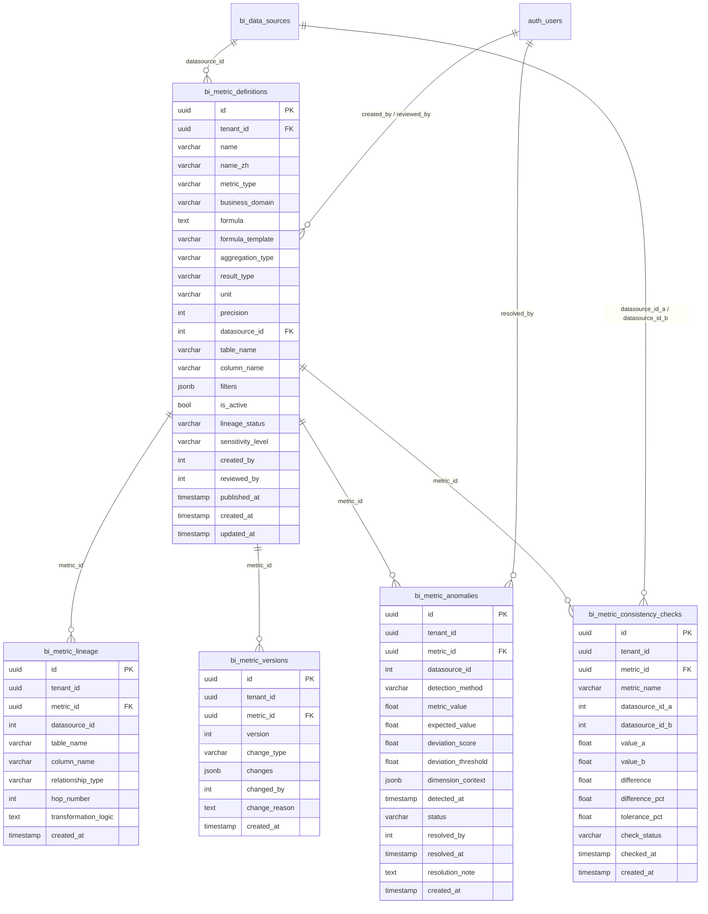
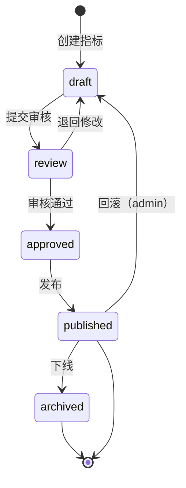
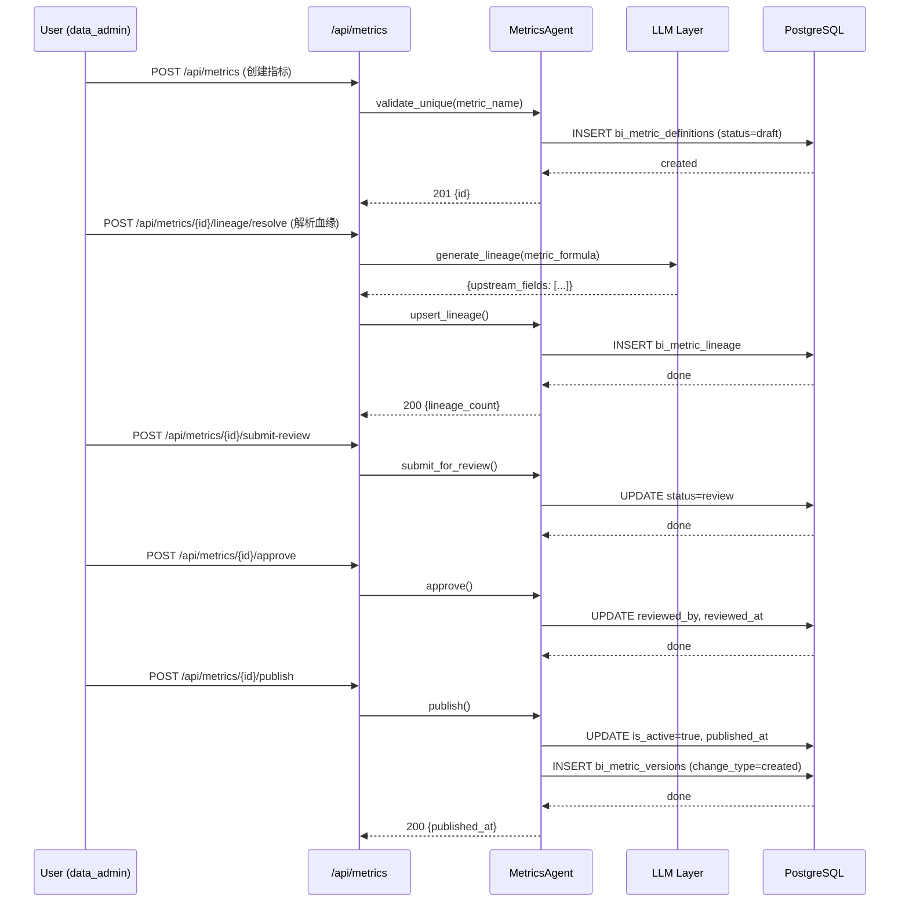
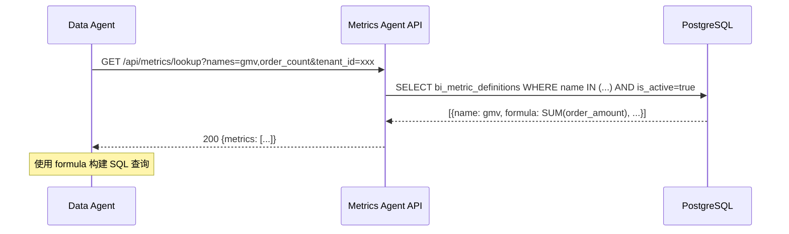

# Metrics Agent 技术规格书

> 版本：v0.2 | 状态：已审查（Gemini review，2 P1 + 3 P2 已修复） | 日期：2026-04-20 | 关联 PRD：待创建

---

## 1. 概述

### 1.1 目的

定义 Mulan BI 平台 Metrics Agent 的完整技术规格。Metrics Agent 是**指标管理层 Agent**，核心能力包括：**指标注册与血缘追踪**（定义 → 审核 → 发布 → 变更追踪）、**指标一致性校验**（跨数据源同名指标的口径对比）、**指标异常检测**（基于统计的指标波动告警）、**指标服务化暴露**（供 NL-to-Query、Data Agent、SQL Agent 消费的标准口径）。

### 1.2 范围

| 包含 | 不包含 |
|------|--------|
| 指标定义注册（metric_definition_lookup 数据源） | 实时流式指标计算 |
| 指标血缘追踪（字段级上游溯源） | 数据修复/清洗（Data Agent 负责） |
| 跨数据源指标一致性校验 | 指标可视化（Visualization Agent 负责） |
| 基于 Z-Score / 分位数 的指标异常检测 | 指标订阅/告警通知渠道（由 Insight Publish 工具承接） |
| 指标版本管理与变更历史 | 指标加工/Pipeline 编排 |
| SQL Agent / NL-to-Query / Data Agent 的指标口径查询 API | |

### 1.3 关联文档

| 文档 | 路径 | 关系 |
|------|------|------|
| PRD（待创建） | docs/prd-metrics-agent.md | 需求来源 |
| Spec 14（NL-to-Query Pipeline） | docs/specs/14-nl-to-query-pipeline-spec.md | NL-to-Query 依赖 Metrics Agent 的指标口径数据 |
| Spec 15（数据治理与质量） | docs/specs/15-data-governance-quality-spec.md | 共享数据分类接口；质量规则可绑定指标 |
| Spec 28（Data Agent） | docs/specs/28-data-agent-spec.md | Data Agent 通过 metric_definition_lookup 工具消费指标口径 |
| Spec 29（SQL Agent） | docs/specs/29-sql-agent-spec.md | SQL Agent 校验时需验证指标字段的引用合法性 |
| Spec 08（LLM Layer） | docs/specs/08-llm-layer-spec.md | LLM 调用规范 |
| 数据模型概览 | docs/specs/03-data-model-overview.md | bi_metric_definitions 等表定义 |

---

## 2. 系统架构

### 2.1 架构定位

Metrics Agent 是**指标语义权威源**（Source of Truth）——所有指标的标准化定义、口径计算公式、血缘关系、版本历史均存储在 Metrics Agent 中，供平台所有消费方查询。

```
┌─────────────────────────────────────────────────────┐
│                  Metrics Agent                       │
│  ┌───────────────────────────────────────────────┐  │
│  │  Metric Registry（指标注册）                    │  │
│  │  · 定义 · 审核 · 发布 · 变更                    │  │
│  └───────────────────────────────────────────────┘  │
│           │                    ▲                    │
│           ▼                    │                    │
│  ┌───────────────────────────────────────────────┐  │
│  │  Metric Lineage（血缘追踪）                      │  │
│  │  · 上游字段溯源 · 影响分析 · 变更影响评估          │  │
│  └───────────────────────────────────────────────┘  │
│           │                    ▲                    │
│           ▼                    │                    │
│  ┌───────────────────────────────────────────────┐  │
│  │  Metric Monitor（异常检测）                      │  │
│  │  · Z-Score · 分位数 · 趋势偏离 · 告警触发        │  │
│  └───────────────────────────────────────────────┘  │
└─────────────────────────────────────────────────────┘
           │                    ▲
           ▼                    │
┌─────────────────────────────────────────────────────┐
│              消费方 / 上游                             │
│  NL-to-Query │ Data Agent │ SQL Agent │ Frontend   │
│  (指标口径查询)  (metric_    (字段合法性  (指标浏览)   │
│                   definition_  校验)                │
│                   lookup)                            │
└─────────────────────────────────────────────────────┘
```

### 2.2 与其他 Agent 的边界

| 关系 | 模块 | 交互方式 |
|------|------|---------|
| 上游数据源 | NL-to-Query | Metrics Agent 提供指标口径约束，NL-to-Query 不得生成与定义矛盾的计算。NL-to-Query 调用 `GET /api/metrics/lookup` 获取 `formula_template`（Jinja2 格式），在查询生成时将模板参数填充后再生成 VizQL。详情见 §7.2 上游依赖 NL-to-Query 条目。 |
| 下游消费者 | Data Agent | Data Agent 通过 `metric_definition_lookup` 工具获取标准口径 |
| 校验依赖 | SQL Agent | SQL Agent 执行查询时，需校验所引用指标字段是否为已注册指标。具体方式：SQL Agent 在生成查询前，调用 `GET /api/metrics/lookup?names=<指标名列表>&tenant_id=<租户>&datasource_id=<数据源>` 验证指标存在且处于 `is_active=true` 状态；未注册指标返回 `SQLA_005` 拒绝执行。SQL Agent 不负责校验 formula 内部逻辑，仅校验指标名是否已注册。 |
| 并行模块 | Visualization Agent | 两者无直接依赖；Visualization Agent 消费 Data Agent 输出的 chart_spec |
| 共享接口 | Data Governance (Spec 15) | 共享 `bi_data_classifications` 字段敏感性标记 |

---

## 3. 数据模型

### 3.1 bi_metric_definitions（指标定义主表）

> ⚠️ **主数据表**：指标的权威定义，所有口径查询的 Source of Truth。

| 列名 | 类型 | 约束 | 说明 |
|------|------|------|------|
| id | UUID | PK | 主键 |
| tenant_id | UUID | NOT NULL | 租户 ID（从 JWT 解析，所有 API 必须带此 predicate） |
| name | VARCHAR(128) | NOT NULL | 指标英文名（唯一约束：tenant_id + name） |
| name_zh | VARCHAR(256) | NULLABLE | 指标中文名 |
| metric_type | VARCHAR(16) | NOT NULL | `atomic`（原子指标）/ `derived`（派生指标）/ `ratio`（比率指标） |
| business_domain | VARCHAR(64) | NULLABLE | 业务域（e.g. `commerce`, `finance`, `user`） |
| description | TEXT | NULLABLE | 业务描述 |
| formula | TEXT | NULLABLE | 计算公式或 SQL 表达式（原子指标为直接引用字段，派生指标为多指标组合） ⚠️ **安全要求**：不得直接拼接用户输入；所有 SQL 生成必须经过参数化查询或白名单校验，禁止 `{{}}` 等模板插值语法直接出现在 SQL 执行层 |
| formula_template | VARCHAR(256) | NULLABLE | Jinja2 模板格式的公式（用于 NL-to-Query 参数化填充） ⚠️ **安全要求**：Jinja2 渲染必须在沙箱环境执行（不允许 `{{` 以外的代码执行）；模板参数名必须先经白名单校验，禁止动态导入模块或执行任意 Python 表达式 |
| aggregation_type | VARCHAR(16) | NULLABLE | `SUM` / `AVG` / `COUNT` / `COUNT_DISTINCT` / `MAX` / `MIN` / `none`（非聚合） |
| result_type | VARCHAR(16) | NULLABLE | `float` / `integer` / `percentage` / `currency` |
| unit | VARCHAR(32) | NULLABLE | 单位（e.g. `元`, `次`, `%`, `人`） |
| precision | INTEGER | NOT NULL DEFAULT 2 | 数值精度（小数位数） |
| datasource_id | INTEGER | NOT NULL | 所属数据源（FK → bi_data_sources.id） |
| table_name | VARCHAR(128) | NOT NULL | 底层物理表名 |
| column_name | VARCHAR(128) | NOT NULL | 底层物理字段名 |
| filters | JSONB | NULLABLE | 默认过滤条件（e.g. `{"status": "completed"}`） |
| is_active | BOOLEAN | NOT NULL DEFAULT TRUE | 是否启用 |
| lineage_status | VARCHAR(16) | NOT NULL DEFAULT `unknown` | `resolved`（血缘已解析）/ `unknown`（无法解析）/ `manual`（手动定义） |
| sensitivity_level | VARCHAR(16) | NOT NULL DEFAULT `public` | `public` / `internal` / `confidential` / `restricted`（从 bi_data_classifications 读取或手动标注） |
| created_by | INTEGER | NOT NULL | 创建人（从认证主体解析） |
| reviewed_by | INTEGER | NULLABLE | 审核人 |
| reviewed_at | TIMESTAMP | NULLABLE | 审核时间 |
| published_at | TIMESTAMP | NULLABLE | 发布时间 |
| created_at | TIMESTAMP | NOT NULL DEFAULT now() | 创建时间 |
| updated_at | TIMESTAMP | NOT NULL DEFAULT now() | 更新时间 |

> ⚠️ **唯一约束**：`UNIQUE (tenant_id, name)`，确保跨租户隔离下指标名唯一。

### 3.2 bi_metric_lineage（血缘关系表）

> ⚠️ **Append-Only**：指标字段级血缘追踪，支持影响分析和变更风险评估。

| 列名 | 类型 | 约束 | 说明 |
|------|------|------|------|
| id | UUID | PK | 主键 |
| tenant_id | UUID | NOT NULL | 租户 ID |
| metric_id | UUID | NOT NULL, FK → bi_metric_definitions.id | 指标 ID |
| datasource_id | INTEGER | NOT NULL | 上游数据源 ID |
| table_name | VARCHAR(128) | NOT NULL | 上游物理表名 |
| column_name | VARCHAR(128) | NOT NULL | 上游物理字段名 |
| column_type | VARCHAR(32) | NULLABLE | 上游字段类型 |
| relationship_type | VARCHAR(16) | NOT NULL | `source`（直接来源）/ `上游_joined` / `上游_calculated` |
| hop_number | INTEGER | NOT NULL DEFAULT 0 | 跳数（0=直接来源，1=一阶上游） |
| transformation_logic | TEXT | NULLABLE | 字段变换说明（如有计算） |
| created_at | TIMESTAMP | NOT NULL DEFAULT now() | 创建时间 |

> ⚠️ **血缘解析时机**：指标创建/修改时自动解析，或由 Metrics Agent 的 Lineage Engine 主动拉取。
> ⚠️ **字段敏感性继承**：上游字段 sensitivity_level 向下传递；取所有上游字段的 max(sensitivity_level)。

### 3.3 bi_metric_versions（指标版本历史）

> ⚠️ **Append-Only**：指标定义变更历史，支持回滚和审计。

| 列名 | 类型 | 约束 | 说明 |
|------|------|------|------|
| id | UUID | PK | 主键 |
| tenant_id | UUID | NOT NULL | 租户 ID |
| metric_id | UUID | NOT NULL, FK → bi_metric_definitions.id | 指标 ID |
| version | INTEGER | NOT NULL | 版本号（自增） |
| change_type | VARCHAR(16) | NOT NULL | `created` / `formula_updated` / `description_updated` / `threshold_updated` / `archived` |
| changes | JSONB | NOT NULL | 变更内容（`{"before": {...}, "after": {...}}`） |
| changed_by | INTEGER | NOT NULL | 变更人 |
| change_reason | TEXT | NULLABLE | 变更原因 |
| created_at | TIMESTAMP | NOT NULL DEFAULT now() | 变更时间 |

### 3.4 bi_metric_anomalies（指标异常记录）

| 列名 | 类型 | 约束 | 说明 |
|------|------|------|------|
| id | UUID | PK | 主键 |
| tenant_id | UUID | NOT NULL | 租户 ID |
| metric_id | UUID | NOT NULL, FK → bi_metric_definitions.id | 指标 ID |
| datasource_id | INTEGER | NOT NULL | 数据源 ID |
| detection_method | VARCHAR(32) | NOT NULL | `zscore` / `quantile` / `trend_deviation` / `threshold_breach` |
| metric_value | FLOAT | NOT NULL | 异常时刻的指标值 |
| expected_value | FLOAT | NOT NULL | 期望值（基于基线） |
| deviation_score | FLOAT | NOT NULL | 偏离度（Z-Score 或分位数偏离值） |
| deviation_threshold | FLOAT | NOT NULL | 触发阈值 |
| dimension_context | JSONB | NULLABLE | 异常上下文字段（维度分组 e.g. `{"region": "华北"}`） |
| detected_at | TIMESTAMP | NOT NULL | 检测时间 |
| status | VARCHAR(16) | NOT NULL DEFAULT `detected` | `detected` / `investigating` / `resolved` / `false_positive` |
| resolved_by | INTEGER | NULLABLE | 标记解决人 |
| resolved_at | TIMESTAMP | NULLABLE | 解决时间 |
| resolution_note | TEXT | NULLABLE | 处理备注 |
| created_at | TIMESTAMP | NOT NULL DEFAULT now() | 创建时间 |

### 3.5 bi_metric_consistency_checks（一致性校验记录）

| 列名 | 类型 | 约束 | 说明 |
|------|------|------|------|
| id | UUID | PK | 主键 |
| tenant_id | UUID | NOT NULL | 租户 ID |
| metric_id | UUID | NOT NULL, FK → bi_metric_definitions.id | 指标 ID（与 tenant_id 组合确保跨租户唯一性；与 metric_name 同时保留用于兼容性查询） |
| metric_name | VARCHAR(128) | NOT NULL | 跨数据源同名的指标名（保留用于展示，可与 metric_id 联查 bi_metric_definitions 获取最新定义） |
| datasource_id_a | INTEGER | NOT NULL | 数据源 A |
| datasource_id_b | INTEGER | NOT NULL | 数据源 B |
| value_a | FLOAT | NULLABLE | 数据源 A 的指标值 |
| value_b | FLOAT | NULLABLE | 数据源 B 的指标值 |
| difference | FLOAT | NULLABLE | 差值（value_a - value_b） |
| difference_pct | FLOAT | NULLABLE | 差值百分比 |
| tolerance_pct | FLOAT | NOT NULL DEFAULT 5.0 | 允许误差百分比（e.g. 5.0 = 5%） |
| check_status | VARCHAR(16) | NOT NULL | `pass` / `warning`（差值在 tolerance 内）/ `fail`（超出 tolerance） |
| checked_at | TIMESTAMP | NOT NULL | 校验时间 |
| created_at | TIMESTAMP | NOT NULL DEFAULT now() | 创建时间 |

### 3.6 索引策略

| 表 | 索引名 | 列 | 类型 | 用途 |
|----|--------|-----|------|------|
| bi_metric_definitions | ix_bmd_tenant | (tenant_id, is_active) | BTREE | 多租户 + 启用状态筛选 |
| bi_metric_definitions | ix_bmd_datasource | datasource_id | BTREE | 按数据源查指标 |
| bi_metric_definitions | ix_bmd_domain | (tenant_id, business_domain) | BTREE | 按业务域筛选 |
| bi_metric_definitions | ix_bmd_name | (tenant_id, name) | BTREE UNIQUE | 唯一约束 |
| bi_metric_definitions | ix_bmd_sensitivity | (tenant_id, sensitivity_level) | BTREE | 敏感性级别筛选 |
| bi_metric_lineage | ix_bml_metric | metric_id | BTREE | 按指标查血缘 |
| bi_metric_lineage | ix_bml_tenant | (tenant_id, metric_id) | BTREE | 多租户隔离 |
| bi_metric_versions | ix_bmv_metric_version | (metric_id, version DESC) | BTREE | 版本历史查询 |
| bi_metric_versions | ix_bmv_tenant | tenant_id | BTREE | 多租户隔离 |
| bi_metric_anomalies | ix_bma_metric | (metric_id, detected_at DESC) | BTREE | 按指标查异常历史 |
| bi_metric_anomalies | ix_bma_status | (tenant_id, status, detected_at DESC) | BTREE | 状态筛选 |
| bi_metric_anomalies | ix_bma_datasource | (datasource_id, detected_at DESC) | BTREE | 按数据源查异常 |
| bi_metric_consistency_checks | ix_bmcc_metric | (metric_id, checked_at DESC) | BTREE | 按指标 ID 查校验历史（metric_id 为 FK） |
| bi_metric_consistency_checks | ix_bmcc_tenant_status | (tenant_id, check_status, checked_at DESC) | BTREE | 状态筛选 |

### 3.7 ER 关系图



---

## 4. 业务逻辑

### 4.1 指标注册流程



### 4.2 异常检测算法

**Z-Score 检测：**
```
z = (current_value - rolling_mean) / rolling_stddev
触发条件：|z| > threshold（默认 3.0）
窗口：过去 30 天数据点
```

**分位数检测：**
```
Q1, Q3 = first/third quartile of rolling window
IQR = Q3 - Q1
触发条件：current_value < Q1 - 1.5*IQR OR current_value > Q3 + 1.5*IQR
```

**趋势偏离检测：**
```
expected = linear_trend(过去 7 天斜率) extrapolated
触发条件：|current - expected| / expected > tolerance_pct（默认 5%）
```

### 4.3 指标口径校验规则

| 规则 | 描述 | 违规处理 |
|------|------|---------|
| MC_001 | 同 tenant 下指标名唯一 | 创建时拒绝，409 Conflict |
| MC_002 | formula 中引用的所有字段必须在 bi_metric_lineage 中有记录 | 发布前强制解析血缘，未解析可手动标注 `lineage_status=manual` |
| MC_003 | 派生指标 formula_template 中参数必须有默认值 | 缺失默认值阻止发布 |
| MC_004 | 指标 sensitivity_level 不得低于上游字段 max sensitivity | 发布时校验，违规降级为上游最高级别 |
| MC_005 | 跨数据源同名指标需执行一致性校验（可选，admin 可跳过） | 差值 > tolerance 时 warn，admin 可强制发布 |

### 4.4 一致性校验流程

```
1. 选定 metric_name + datasource_id_a + datasource_id_b
2. 对齐时间粒度（如果有 time_partition，取同一时间窗口）
3. 执行两侧查询，对比差值
4. 差值百分比 ≤ tolerance_pct → pass
5. 差值百分比 > tolerance_pct → fail（记录 bi_metric_consistency_checks）
```

---

## 5. API 设计

### 5.1 端点总览

| 方法 | 路径 | 说明 | 认证 | 角色 |
|------|------|------|------|------|
| GET | /api/metrics | 指标列表 | 需要 | analyst+ |
| POST | /api/metrics | 创建指标 | 需要 | data_admin+ |
| GET | /api/metrics/{id} | 指标详情（含最新血缘） | 需要 | analyst+ |
| PUT | /api/metrics/{id} | 更新指标 | 需要 | data_admin+ |
| DELETE | /api/metrics/{id} | 下线指标（软删除） | 需要 | admin |
| POST | /api/metrics/{id}/submit-review | 提交审核 | 需要 | data_admin+ |
| POST | /api/metrics/{id}/approve | 审核通过 | 需要 | data_admin+ |
| POST | /api/metrics/{id}/reject | 审核拒绝 | 需要 | data_admin+ |
| POST | /api/metrics/{id}/publish | 发布 | 需要 | data_admin+ |
| GET | /api/metrics/{id}/versions | 版本历史 | 需要 | analyst+ |
| GET | /api/metrics/{id}/lineage | 血缘关系 | 需要 | analyst+ |
| POST | /api/metrics/{id}/lineage/resolve | 解析血缘 | 需要 | data_admin+ |
| GET | /api/metrics/{id}/anomalies | 异常记录 | 需要 | analyst+ |
| PATCH | /api/metrics/anomalies/{anomaly_id} | 更新异常状态 | 需要 | data_admin+ |
| POST | /api/metrics/consistency-check | 执行一致性校验 | 需要 | data_admin+ |
| GET | /api/metrics/consistency-checks | 校验历史 | 需要 | analyst+ |
| GET | /api/metrics/lookup | 指标口径查询（给 NL-to-Query / Data Agent / SQL Agent） | 需要（Service JWT） | 系统服务 |
| GET | /api/metrics/detect-anomalies | 主动触发异常检测 | 需要 | data_admin+ |

### 5.2 请求/响应 Schema

#### `GET /api/metrics`

**请求参数：**

| 参数 | 类型 | 位置 | 说明 |
|------|------|------|------|
| page | integer | query | 页码，默认 1 |
| page_size | integer | query | 每页条数，默认 20 |
| business_domain | string | query | 业务域过滤 |
| metric_type | string | query | 类型过滤 |
| datasource_id | integer | query | 数据源过滤 |
| is_active | boolean | query | 启用状态，默认 true |
| sensitivity_level | string | query | 敏感性级别过滤 |
| search | string | query | 名称/描述模糊搜索 |

**响应 (200)：**
```json
{
  "items": [
    {
      "id": "uuid",
      "name": "gmv",
      "name_zh": "商品交易总额",
      "metric_type": "atomic",
      "business_domain": "commerce",
      "aggregation_type": "SUM",
      "result_type": "float",
      "unit": "元",
      "datasource_id": 1,
      "is_active": true,
      "lineage_status": "resolved",
      "sensitivity_level": "internal",
      "created_by": 123,
      "published_at": "2026-04-20T10:00:00Z",
      "created_at": "2026-04-01T08:00:00Z"
    }
  ],
  "total": 150,
  "page": 1,
  "page_size": 20,
  "pages": 8
}
```

#### `GET /api/metrics/{id}`

**响应 (200)：**
```json
{
  "id": "uuid",
  "tenant_id": "uuid",
  "name": "gmv",
  "name_zh": "商品交易总额",
  "metric_type": "atomic",
  "business_domain": "commerce",
  "description": "统计周期内所有已完成订单的支付金额之和",
  "formula": "SUM(order_amount)",
  "formula_template": "SUM(order_amount) WHERE status = '{{status}}'",
  "aggregation_type": "SUM",
  "result_type": "float",
  "unit": "元",
  "precision": 2,
  "datasource_id": 1,
  "table_name": "orders",
  "column_name": "order_amount",
  "filters": {"status": "completed"},
  "is_active": true,
  "lineage_status": "resolved",
  "sensitivity_level": "internal",
  "created_by": 123,
  "reviewed_by": 456,
  "reviewed_at": "2026-04-15T14:00:00Z",
  "published_at": "2026-04-16T10:00:00Z",
  "created_at": "2026-04-01T08:00:00Z",
  "updated_at": "2026-04-16T10:00:00Z"
}
```

#### `GET /api/metrics/lookup`

> ⚠️ **内部服务 API**：供 NL-to-Query、Data Agent、SQL Agent 调用。必须携带 Service JWT（`X-Scan-Service-JWT` 或内部 mTLS 客户端证书）。

**请求参数：**

| 参数 | 类型 | 位置 | 说明 |
|------|------|------|------|
| names | string | query | 逗号分隔的指标名列表（e.g. `gmv,order_count`） |
| datasource_id | integer | query | 可选，限定数据源 |
| tenant_id | UUID | query | 服务间调用必须指定 tenant |

**响应 (200)：**
```json
{
  "metrics": [
    {
      "name": "gmv",
      "name_zh": "商品交易总额",
      "formula": "SUM(order_amount)",
      "formula_template": "SUM(order_amount) WHERE status = '{{status}}'",
      "aggregation_type": "SUM",
      "result_type": "float",
      "unit": "元",
      "precision": 2,
      "filters": {"status": "completed"},
      "sensitivity_level": "internal",
      "datasource_id": 1,
      "table_name": "orders",
      "column_name": "order_amount",
      "lineage_status": "resolved",
      "description": "统计周期内所有已完成订单的支付金额之和"
    }
  ],
  "not_found": []
}
```

**错误响应 (404)：**
```json
{
  "error_code": "MC_404",
  "message": "指标未找到",
  "detail": {
    "not_found": ["unknown_metric"]
  }
}
```

### 5.3 错误码

| 错误码 | HTTP | 说明 | 触发条件 |
|--------|------|------|---------|
| MC_001 | 409 | 指标名冲突 | 同 tenant 下创建同名指标 |
| MC_002 | 400 | 血缘未解析 | 发布时 lineage_status=unknown 且未手动标注 |
| MC_003 | 400 | 公式模板参数缺失 | formula_template 含未定义默认值的参数 |
| MC_004 | 422 | 敏感性级别违规 | 上游字段 sensitivity_level 高于指标当前标注值 |
| MC_005 | 422 | 一致性校验失败 | 跨数据源指标差值超出 tolerance |
| MC_404 | 404 | 指标不存在 | 查询/更新不存在的指标 |
| MC_403 | 403 | 权限不足 | 非 data_admin+ 尝试创建/修改 |
| MC_429 | 429 | 查询超时 | 血缘解析或一致性校验超时（30s） |

---

## 6. 工具集设计（给 Data Agent 调用）

### 6.1 工具总览

| 工具名 | 用途 | 调用方式 |
|--------|------|---------|
| `metric_definition_lookup` | 查询指标标准口径 | 同步 API 调用 |
| `metric_lineage_retrieve` | 查询指标血缘关系 | 同步 API 调用 |
| `metric_consistency_check` | 跨数据源指标一致性校验 | 同步 API 调用 |
| `metric_anomaly_retrieve` | 查询指标异常历史 | 同步 API 调用 |

### 6.2 metric_definition_lookup

**输入：**
```json
{
  "metric_names": ["gmv", "order_count"],
  "datasource_id": 1,
  "include_inactive": false
}
```

**输出：**
```json
{
  "metrics": [
    {
      "name": "gmv",
      "name_zh": "商品交易总额",
      "formula": "SUM(order_amount)",
      "aggregation_type": "SUM",
      "filters": {"status": "completed"},
      "sensitivity_level": "internal",
      "unit": "元",
      "description": "统计周期内所有已完成订单的支付金额之和"
    }
  ],
  "not_found": []
}
```

---

## 7. 集成点

### 7.1 上游依赖

| 模块 | 接口 | 用途 |
|------|------|------|
| Data Sources (bi_data_sources) | datasource_id FK | 指标归属数据源 |
| Auth (auth_users) | created_by / reviewed_by | 用户追溯 |
| Data Classifications (bi_data_classifications) | 字段敏感性等级查询 | 指标 sensitivity_level 校验 |
| LLM Layer (Spec 08) | 血缘解析服务 API 调用（通过 LLM API 实现字段级上游溯源） | 字段级上游溯源生成 |

### 7.2 下游消费者

| 模块 | 消费方式 | 说明 |
|------|---------|------|
| NL-to-Query | GET /api/metrics/lookup | 查询指标口径，约束查询生成 |
| Data Agent | metric_definition_lookup 工具 | 获取标准口径 |
| SQL Agent | GET /api/metrics/lookup | 校验字段引用的合法性 |
| Frontend | GET /api/metrics | 指标浏览与管理 UI |
| Insight Publish | bi_metric_anomalies（消费事件） | Metrics Agent 发射 `metric.anomaly.detected` 事件（见 §7.3），Insight Publish 订阅该事件并推送告警。Metrics Agent 不负责告警渠道（Email/Slack/企微），仅保证事件 Payload 包含 `metric_id`、`anomaly_id`、`metric_value`、`deviation_score` |

### 7.3 事件发射

| 事件名 | 触发时机 | Payload |
|--------|---------|---------|
| metric.published | 指标发布 | `{metric_id, name, published_by, published_at}` |
| metric.anomaly.detected | 异常检测到 | `{metric_id, anomaly_id, metric_value, deviation_score}` |
| metric.consistency.failed | 一致性校验失败 | `{metric_name, datasource_a, datasource_b, difference_pct}` |

---

## 8. 时序图

### 8.1 指标注册与发布



### 8.2 Data Agent 调用指标口径



---

## 9. 测试策略

### 9.1 关键场景

| # | 场景 | 预期 | 优先级 |
|---|------|------|--------|
| 1 | 创建同名指标（MC_001） | 409 Conflict | P0 |
| 2 | 发布 lineage_status=unknown 的指标 | 400 + MC_002 | P0 |
| 3 | 上游字段 sensitivity_level=restricted，指标标注=public | 422 + MC_004（自动降级为 restricted） | P0 |
| 4 | Z-Score 异常检测（|z|>3） | 写入 bi_metric_anomalies，status=detected | P0 |
| 5 | 跨数据源同名指标差值 3%（tolerance=5%） | consistency_check status=warning | P1 |
| 6 | 跨数据源同名指标差值 10%（tolerance=5%） | consistency_check status=fail | P1 |
| 7 | 指标口径 lookup（内部服务调用） | 200 返回标准口径，404 返回 not_found | P0 |
| 8 | 指标版本历史完整性 | 每次变更新增一条版本记录，change_type 正确 | P1 |

### 9.2 验收标准

- [ ] 指标 CRUD 操作正常，状态机流转正确
- [ ] 指标名唯一性约束生效（MC_001）
- [ ] 血缘解析后 lineage_status=resolved
- [ ] 手动标注 lineage_status=manual 可绕过血缘解析直接发布
- [ ] Z-Score / 分位数异常检测正常触发
- [ ] 异常记录状态变更正常（detected → investigating → resolved/false_positive）
- [ ] 跨数据源一致性校验记录完整
- [ ] Service JWT 认证在 /api/metrics/lookup 上正常生效
- [ ] 指标下线的 is_active=false 状态下不再被 lookup 返回

---

## 10. 开放问题

| # | 问题 | 负责人 | 状态 |
|---|------|--------|------|
| 1 | 一致性校验的时间窗口对齐策略（同环比 vs 绝对值） | 待定 | 待定 |
| 2 | 血缘自动解析是否使用 LLM（成本 vs 准确率权衡） | 待定 | 待定 |
| 3 | 指标异常告警的推送渠道（Email / Slack / 企业微信） | 待定 | 待定 |
| 4 | 派生指标的 formula_template 参数化填充的 NL-to-Query 协作协议 | 待定 | 待定 |
