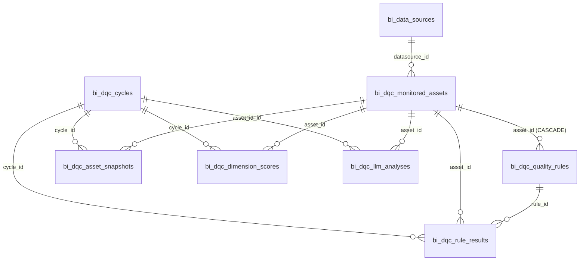
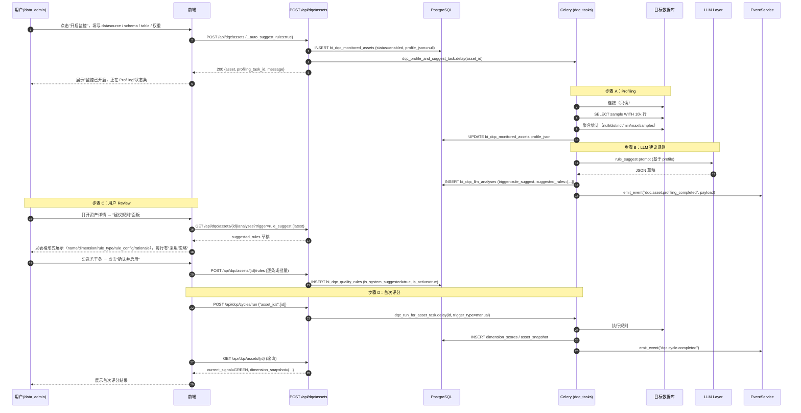

# 数据质量核心（DQC）流水线技术规格书

> **版本**: v1.0
> **日期**: 2026-04-21
> **状态**: Draft
> **Owner**: Mulan BI Platform Team
> **关联 PRD**: DQC Pipeline PRD (Ask Data × Data Governance 方向)

---

## 目录

1. [概述与设计目标](#1-概述与设计目标)
2. [架构设计](#2-架构设计)
3. [数据模型](#3-数据模型)
4. [服务模块设计](#4-服务模块设计)
5. [API 设计](#5-api-设计)
6. [规则引擎详细设计](#6-规则引擎详细设计)
7. [信号灯判定算法](#7-信号灯判定算法)
8. [LLM 集成](#8-llm-集成)
9. [UX 流程：添加监控表](#9-ux-流程添加监控表)
10. [Celery 调度配置](#10-celery-调度配置)
11. [错误码（DQC_ 前缀）](#11-错误码dqc_-前缀)
12. [事件类型](#12-事件类型)
13. [BILineagePort 预留接口](#13-bilineageport-预留接口)
14. [分阶段实施路线图](#14-分阶段实施路线图)
15. [测试策略](#15-测试策略)
16. [开放问题](#16-开放问题)

---

## 1. 概述与设计目标

### 1.1 产品背景

Mulan BI 平台已经拥有：

- **Spec 06 DDL 合规检查**：建表时静态规则校验
- **Spec 11 健康扫描**：数据库结构层的一次性扫描
- **Spec 15 数据质量**：规则级 `bi_quality_rules` + 5 维度评分

但这三者是"**规则驱动 + 工单驱动**"的形态，存在以下痛点：

1. 用户手工建规则负担重，缺少"开箱即用"体验
2. 质量分降了不知道"为什么"，缺少根因与修复建议
3. 无法回答"这张表现在是否可信？"这个最本质的问题
4. 与 Tableau、Ask Data 等消费侧没有打通，质量信号没有反馈闭环

**DQC（Data Quality Core）** 从"可观测性驱动"的角度，把数据资产（表）作为一等公民，以 **Signal → Score → Action** 范式重构治理体验：

- **Signal**：规则结果、Profiling 结果、漂移都作为信号
- **Score**：聚合为 6 个质量维度分 + ConfidenceScore
- **Action**：不再强制产出"工单"，而是优先产出可观测信号 + LLM 根因建议；工单降级为可选输出

### 1.2 设计目标（可验证的 AC）

| 编号 | 目标 | 验收标准 |
|------|------|----------|
| G1 | 表级监控一等公民 | 用户可对任意 `(datasource, schema, table)` 开启监控；数据模型以 `bi_dqc_monitored_assets` 为核心 |
| G2 | 6 维度评分覆盖全场景 | 单张表在一个 cycle 内可同时产出 Completeness / Accuracy / Timeliness / Validity / Uniqueness / Consistency 6 个维度分（0–100，float） |
| G3 | 三档信号灯可量化 | 给定规则执行结果，能自动判定 GREEN / P1 / P0，并通过单测覆盖所有边界 |
| G4 | 漂移检测可用 | 任意维度分相对 7 日均值的 `drift_24h` 可计算、可查询、可触发信号降级 |
| G5 | 系统建议 + 用户确认 | 添加监控表时自动 profiling（采样 10k 行）+ LLM 生成建议规则草稿；用户可以在 UI Review 后一键确认 |
| G6 | LLM 根因分析 | P0 / P1 事件自动触发 LLM，输出 `root_cause + fix_suggestion + fix_sql`，写入 `bi_dqc_llm_analyses` |
| G7 | 事件闭环 | Signal 变更触发 `dqc.*` 事件，通过既有 EventService 发送通知 |
| G8 | 不破坏现有治理 | Spec 15 的 `bi_quality_rules` / `bi_quality_results` 不下线；DQC 与之并行，共享只读连接逻辑 |
| G9 | 可横向扩展到 BI 消费 | 预留 `BILineagePort` Protocol，未来接入 Tableau / PowerBI 不需要改核心评分逻辑 |

### 1.3 非目标（Out of Scope）

- ❌ 不做数据自动修复 / 自动清洗（仅建议 `fix_sql`，不自动执行）
- ❌ 不做实时流式质量监控（CDC / Kafka），v1 仅定时 + 手动触发
- ❌ 不做多租户隔离（沿用项目 owner_id 模型）
- ❌ 不重构 Spec 15 的 `bi_quality_rules` 模型（新模型独立，仅在 LLM 上下文里引用结果）
- ❌ 不实现 Tableau / PowerBI 血缘采集（仅预留 Port 接口）
- ❌ 不实现工单（GovernanceTicket）模型——工单只是 Action Engine 的一个可选输出通道，v1 不建表
- ❌ 不在本 spec 中定义前端页面的完整设计（前端由 designer 单独出稿，本 spec 仅约束 API 契约与 UX 流程）

### 1.4 与现有模块的关系

```
┌────────────────────────────────────────────────────────────────────┐
│                       DQC Pipeline (新增)                           │
│                                                                    │
│  bi_dqc_monitored_assets  ◄── 一等公民，以表为单位监控              │
│  bi_dqc_quality_rules     ◄── DQC 规则（LLM 可生成建议）             │
│  bi_dqc_dimension_scores  ◄── 6 维度分（Append-Only）               │
│  bi_dqc_asset_snapshots   ◄── 资产聚合（Append-Only，用于趋势）      │
│  bi_dqc_rule_results      ◄── 规则执行明细（Append-Only，用于审计）  │
│  bi_dqc_llm_analyses      ◄── LLM 根因 + 修复建议                    │
│  bi_dqc_cycles            ◄── cycle 编排状态                        │
└────────────────────────────────────────────────────────────────────┘
                           │ 共享 │
                           ▼      ▼
    ┌──────────────────────────┐  ┌──────────────────────────┐
    │ Spec 15 data governance  │  │ Spec 11 health scan       │
    │ - bi_quality_rules       │  │ - bi_health_scan_records  │
    │ - bi_quality_results     │  │ (可选输入，不再主导评分)   │
    │ (保留，不下线)           │  │                           │
    └──────────────────────────┘  └──────────────────────────┘
                           │       │
                           ▼       ▼
    ┌──────────────────────────┐  ┌──────────────────────────┐
    │ Spec 16 events/notify    │  │ Spec 08 LLM layer        │
    │ - emit_event()           │  │ - get_llm_client()        │
    │ - notification_router    │  │                           │
    └──────────────────────────┘  └──────────────────────────┘
```

**并行而非替换**：Spec 15 仍然为"单规则 + 单阈值"的低层治理保留；DQC 专注"表级健康评估"，两者可独立使用。长期来看，Spec 15 可能会被折叠进 DQC 的 rule engine，但本版本不做此迁移。

---

## 2. 架构设计

### 2.1 总架构图

```
╔═══════════════════════════════════════════════════════════════════╗
║                       DQC Pipeline 架构                           ║
╚═══════════════════════════════════════════════════════════════════╝

  ┌─────────────────────────────────────────────────────────────┐
  │                  Frontend (React 19)                        │
  │   /governance/dqc/assets | /governance/dqc/assets/:id       │
  └──────────────┬──────────────────────────────┬───────────────┘
                 │                              │
                 ▼                              ▼
  ┌─────────────────────────────────────────────────────────────┐
  │              FastAPI (/api/dqc/*)                           │
  │   backend/app/api/governance/dqc.py                         │
  └──────────────┬──────────────────────────────┬───────────────┘
                 │                              │
                 ▼                              ▼
  ┌─────────────────────────────────────────────────────────────┐
  │             DQC Service Layer                                │
  │   backend/services/dqc/                                      │
  │                                                              │
  │   ┌─────────────────────────────────────────────────────┐   │
  │   │  Layer 3 - Action Engine                            │   │
  │   │  - llm_analyzer.py    (P0/P1 根因)                  │   │
  │   │  - rule_suggester.py  (建议规则)                    │   │
  │   │  - EventEmitter       (emit_event)                  │   │
  │   └─────────────────────────────────────────────────────┘   │
  │                           ▲                                 │
  │   ┌─────────────────────────────────────────────────────┐   │
  │   │  Layer 2 - Quality Dimension Engine                 │   │
  │   │  - scorer.py          (6 维度 + ConfidenceScore)    │   │
  │   │  - drift_detector.py  (相对 7d 均值)                │   │
  │   │  - signal_judge       (GREEN/P1/P0 判定)            │   │
  │   └─────────────────────────────────────────────────────┘   │
  │                           ▲                                 │
  │   ┌─────────────────────────────────────────────────────┐   │
  │   │  Layer 1 - Signal Collection                        │   │
  │   │  - rule_engine.py     (执行 6 类规则)               │   │
  │   │  - profiler.py        (表采样 10k 行)               │   │
  │   │  - (可选) BILineagePort (v2)                        │   │
  │   └─────────────────────────────────────────────────────┘   │
  │                                                              │
  │   orchestrator.py  ◄── Redis 锁 + 编排 Layer 1→2→3          │
  └──────────────────────────┬──────────────────────────────────┘
                             │
      ┌──────────────────────┼──────────────────────────┐
      ▼                      ▼                          ▼
  ┌─────────────┐      ┌─────────────┐          ┌──────────────┐
  │  Celery     │      │ PostgreSQL  │          │ EventService │
  │  + Redis    │      │ (bi_dqc_*)  │          │ (Spec 16)    │
  └─────────────┘      └─────────────┘          └──────────────┘
        │
        ▼
  ┌─────────────────────────────────────────┐
  │  目标数据库（user datasource, 只读连接） │
  │  MySQL / PostgreSQL / StarRocks / Doris  │
  └─────────────────────────────────────────┘
```

### 2.2 三层职责

| 层 | 名称 | 职责 | 幂等 | 关键模块 |
|----|------|------|------|----------|
| Layer 1 | Signal Collection | 采集原始信号：执行规则、采样 profiling、（预留）读 BI 血缘 | 是 | `rule_engine.py`, `profiler.py` |
| Layer 2 | Quality Dimension Engine | 把信号转为 6 个维度分 + 计算 ConfidenceScore + 判定信号灯 + 检测漂移 | 是（同 cycle 重算得相同结果） | `scorer.py`, `drift_detector.py` |
| Layer 3 | Action Engine | 根据信号变化触发动作：LLM 根因、LLM 建议规则、发事件、（v2 可选）写工单 | 否（调 LLM、发通知，有副作用） | `llm_analyzer.py`, `rule_suggester.py`, event 集成 |

### 2.3 与现有 Celery / EventService / 通知系统的集成点

| 目标 | 集成方式 | 落点 |
|------|----------|------|
| Celery | 在 `backend/services/tasks/__init__.py` 的 `beat_schedule` 新增 `dqc-cycle-daily` 与 `dqc-cycle-hourly` | 新增 `backend/services/tasks/dqc_tasks.py` |
| EventService | `services.events.event_service.emit_event()` 在信号变更、cycle 完成、P0/P1 触发时调用 | 在 `backend/services/dqc/orchestrator.py` 内调用 |
| notification_router | 新增 6 个事件类型的路由函数（`dqc.cycle.*` / `dqc.asset.*`） | `backend/services/events/notification_router.py` 末尾追加 |
| 既有只读连接逻辑 | 复用 `backend/services/governance/engine.py` 的 `QualitySQLEngine`（方言适配、60s 超时、`max_scan_rows` 熔断） | DQC `rule_engine.py` 内部委托 |
| LLM 层 | 复用 `backend/services/llm/` 的 client；新建 DQC 专用 prompt 模板文件 | `backend/services/dqc/prompts/*.py` |

---

## 3. 数据模型

### 3.1 建表总览

| 表名 | 用途 | 写入模式 | 分区 |
|------|------|----------|------|
| `bi_dqc_monitored_assets` | 被监控资产注册表 | CRUD | 无 |
| `bi_dqc_quality_rules` | 质量规则定义（关联到资产） | CRUD | 无 |
| `bi_dqc_cycles` | DQC 执行周期 | CRUD | 无（按 started_at 索引清理） |
| `bi_dqc_dimension_scores` | 维度评分时序 | Append-Only | 月分区（`computed_at`） |
| `bi_dqc_asset_snapshots` | 资产聚合快照 | Append-Only | 月分区（`computed_at`） |
| `bi_dqc_rule_results` | 规则执行结果 | Append-Only | 月分区（`executed_at`） |
| `bi_dqc_llm_analyses` | LLM 根因分析 | Append-Only | 无（体积小，90 天后清理） |

### 3.2 SQLAlchemy 模型（完整可运行）

全部落点：`backend/services/dqc/models.py`

```python
"""DQC - Data Quality Core 数据模型

遵循项目规范：
- 表前缀 bi_（核心业务）
- snake_case 字段名
- TIMESTAMP WITHOUT TIME ZONE
- JSONB 用 app.core.database.JSONB（跨方言）
- to_dict() 时间使用 "%Y-%m-%d %H:%M:%S" 格式
- Append-Only 表按月分区（在 Alembic 迁移中建分区 + Beat 定期 DROP 老分区）
"""
from typing import Any, Dict, Optional
from uuid import uuid4

from sqlalchemy import (
    Column, Integer, BigInteger, String, DateTime, Boolean,
    Float, Text, ForeignKey, Index, UniqueConstraint,
)
from sqlalchemy.dialects.postgresql import UUID as PG_UUID

from app.core.database import Base, JSONB, sa_func, sa_text


# ============================================================
# 1. 被监控资产
# ============================================================
class DqcMonitoredAsset(Base):
    """被监控的数据资产（表粒度）"""
    __tablename__ = "bi_dqc_monitored_assets"

    id = Column(Integer, primary_key=True, autoincrement=True)
    datasource_id = Column(
        Integer,
        ForeignKey("bi_data_sources.id", ondelete="CASCADE"),
        nullable=False,
        index=True,
    )
    schema_name = Column(String(128), nullable=False)
    table_name = Column(String(128), nullable=False)
    display_name = Column(String(256), nullable=True)
    description = Column(Text, nullable=True)

    # 6 维度权重 {"completeness":0.167,...}；默认等权（各 1/6 ≈ 0.1667）
    dimension_weights = Column(JSONB, nullable=False, server_default=sa_text(
        "'{\"completeness\":0.1667,\"accuracy\":0.1667,\"timeliness\":0.1667,"
        "\"validity\":0.1667,\"uniqueness\":0.1666,\"consistency\":0.1666}'"
    ))
    # 信号阈值 {"p0_score":60,"p1_score":80,"drift_p0":20,"drift_p1":10}
    signal_thresholds = Column(JSONB, nullable=False, server_default=sa_text(
        "'{\"p0_score\":60,\"p1_score\":80,\"drift_p0\":20,\"drift_p1\":10}'"
    ))
    # profiling 结果缓存：{"row_count":..,"column_stats":[...],"profiled_at":"..."}
    profile_json = Column(JSONB, nullable=True)

    status = Column(String(16), nullable=False, server_default=sa_text("'enabled'"))  # enabled/disabled
    owner_id = Column(Integer, nullable=False, index=True)
    created_by = Column(Integer, nullable=False)
    created_at = Column(DateTime, nullable=False, server_default=sa_func.now())
    updated_at = Column(DateTime, nullable=False, server_default=sa_func.now(), onupdate=sa_func.now())

    __table_args__ = (
        UniqueConstraint("datasource_id", "schema_name", "table_name", name="uq_dqc_asset_ds_sch_tbl"),
        Index("ix_dqc_asset_status", "status"),
        Index("ix_dqc_asset_owner", "owner_id"),
    )

    def to_dict(self) -> Dict[str, Any]:
        return {
            "id": self.id,
            "datasource_id": self.datasource_id,
            "schema_name": self.schema_name,
            "table_name": self.table_name,
            "display_name": self.display_name,
            "description": self.description,
            "dimension_weights": self.dimension_weights,
            "signal_thresholds": self.signal_thresholds,
            "profile_json": self.profile_json,
            "status": self.status,
            "owner_id": self.owner_id,
            "created_by": self.created_by,
            "created_at": self.created_at.strftime("%Y-%m-%d %H:%M:%S") if self.created_at else None,
            "updated_at": self.updated_at.strftime("%Y-%m-%d %H:%M:%S") if self.updated_at else None,
        }


# ============================================================
# 2. 质量规则
# ============================================================
class DqcQualityRule(Base):
    """DQC 质量规则（关联到 monitored_asset，独立于 Spec 15 bi_quality_rules）"""
    __tablename__ = "bi_dqc_quality_rules"

    id = Column(Integer, primary_key=True, autoincrement=True)
    asset_id = Column(
        Integer,
        ForeignKey("bi_dqc_monitored_assets.id", ondelete="CASCADE"),
        nullable=False,
        index=True,
    )
    name = Column(String(256), nullable=False)
    description = Column(Text, nullable=True)
    dimension = Column(String(32), nullable=False)  # completeness/accuracy/...
    rule_type = Column(String(32), nullable=False)  # null_rate/uniqueness/range_check/...
    rule_config = Column(JSONB, nullable=False, server_default=sa_text("'{}'"))

    is_active = Column(Boolean, nullable=False, server_default=sa_text("true"))
    is_system_suggested = Column(Boolean, nullable=False, server_default=sa_text("false"))
    suggested_by_llm_analysis_id = Column(Integer, nullable=True)  # 如果来自 LLM 建议

    created_by = Column(Integer, nullable=False)
    updated_by = Column(Integer, nullable=True)
    created_at = Column(DateTime, nullable=False, server_default=sa_func.now())
    updated_at = Column(DateTime, nullable=False, server_default=sa_func.now(), onupdate=sa_func.now())

    __table_args__ = (
        Index("ix_dqc_rule_asset_dim", "asset_id", "dimension"),
        Index("ix_dqc_rule_asset_active", "asset_id", "is_active"),
    )

    def to_dict(self) -> Dict[str, Any]:
        return {
            "id": self.id,
            "asset_id": self.asset_id,
            "name": self.name,
            "description": self.description,
            "dimension": self.dimension,
            "rule_type": self.rule_type,
            "rule_config": self.rule_config,
            "is_active": self.is_active,
            "is_system_suggested": self.is_system_suggested,
            "suggested_by_llm_analysis_id": self.suggested_by_llm_analysis_id,
            "created_by": self.created_by,
            "updated_by": self.updated_by,
            "created_at": self.created_at.strftime("%Y-%m-%d %H:%M:%S") if self.created_at else None,
            "updated_at": self.updated_at.strftime("%Y-%m-%d %H:%M:%S") if self.updated_at else None,
        }


# ============================================================
# 3. DQC 周期
# ============================================================
class DqcCycle(Base):
    """DQC 执行周期"""
    __tablename__ = "bi_dqc_cycles"

    id = Column(PG_UUID(as_uuid=True), primary_key=True, default=uuid4)
    trigger_type = Column(String(16), nullable=False, server_default=sa_text("'scheduled'"))  # scheduled/manual
    status = Column(String(16), nullable=False, server_default=sa_text("'pending'"))  # pending/running/completed/failed/partial
    scope = Column(String(16), nullable=False, server_default=sa_text("'full'"))  # full/hourly_light
    started_at = Column(DateTime, nullable=True)
    completed_at = Column(DateTime, nullable=True)

    assets_total = Column(Integer, nullable=False, server_default=sa_text("0"))
    assets_processed = Column(Integer, nullable=False, server_default=sa_text("0"))
    assets_failed = Column(Integer, nullable=False, server_default=sa_text("0"))
    rules_executed = Column(Integer, nullable=False, server_default=sa_text("0"))
    p0_count = Column(Integer, nullable=False, server_default=sa_text("0"))
    p1_count = Column(Integer, nullable=False, server_default=sa_text("0"))

    triggered_by = Column(Integer, nullable=True)
    error_message = Column(Text, nullable=True)
    created_at = Column(DateTime, nullable=False, server_default=sa_func.now())

    __table_args__ = (
        Index("ix_dqc_cycle_status_created", "status", "created_at"),
        Index("ix_dqc_cycle_started", "started_at"),
    )

    def to_dict(self) -> Dict[str, Any]:
        return {
            "id": str(self.id) if self.id else None,
            "trigger_type": self.trigger_type,
            "status": self.status,
            "scope": self.scope,
            "started_at": self.started_at.strftime("%Y-%m-%d %H:%M:%S") if self.started_at else None,
            "completed_at": self.completed_at.strftime("%Y-%m-%d %H:%M:%S") if self.completed_at else None,
            "assets_total": self.assets_total,
            "assets_processed": self.assets_processed,
            "assets_failed": self.assets_failed,
            "rules_executed": self.rules_executed,
            "p0_count": self.p0_count,
            "p1_count": self.p1_count,
            "triggered_by": self.triggered_by,
            "error_message": self.error_message,
            "created_at": self.created_at.strftime("%Y-%m-%d %H:%M:%S") if self.created_at else None,
        }


# ============================================================
# 4. 维度评分时序（Append-Only，月分区）
# ============================================================
class DqcDimensionScore(Base):
    """维度评分时序

    Append-Only。PostgreSQL 分区键：computed_at（月分区）。
    Celery Beat 每月清理 90 天以外的分区。
    """
    __tablename__ = "bi_dqc_dimension_scores"

    id = Column(BigInteger, primary_key=True, autoincrement=True)
    cycle_id = Column(PG_UUID(as_uuid=True), nullable=False, index=True)
    asset_id = Column(Integer, nullable=False, index=True)
    dimension = Column(String(32), nullable=False)

    score = Column(Float, nullable=False)  # 0-100
    signal = Column(String(8), nullable=False)  # GREEN / P1 / P0

    prev_score = Column(Float, nullable=True)
    drift_24h = Column(Float, nullable=True)    # 与前一个 cycle 比
    drift_vs_7d_avg = Column(Float, nullable=True)  # 与 7 日均值比

    rules_total = Column(Integer, nullable=False, server_default=sa_text("0"))
    rules_passed = Column(Integer, nullable=False, server_default=sa_text("0"))
    rules_failed = Column(Integer, nullable=False, server_default=sa_text("0"))

    computed_at = Column(DateTime, nullable=False, server_default=sa_func.now())  # 分区键

    __table_args__ = (
        Index("ix_dqc_dim_asset_dim_computed", "asset_id", "dimension", "computed_at"),
        Index("ix_dqc_dim_cycle", "cycle_id"),
        Index("ix_dqc_dim_signal", "signal"),
    )

    def to_dict(self) -> Dict[str, Any]:
        return {
            "id": self.id,
            "cycle_id": str(self.cycle_id) if self.cycle_id else None,
            "asset_id": self.asset_id,
            "dimension": self.dimension,
            "score": self.score,
            "signal": self.signal,
            "prev_score": self.prev_score,
            "drift_24h": self.drift_24h,
            "drift_vs_7d_avg": self.drift_vs_7d_avg,
            "rules_total": self.rules_total,
            "rules_passed": self.rules_passed,
            "rules_failed": self.rules_failed,
            "computed_at": self.computed_at.strftime("%Y-%m-%d %H:%M:%S") if self.computed_at else None,
        }


# ============================================================
# 5. 资产快照（Append-Only，月分区）
# ============================================================
class DqcAssetSnapshot(Base):
    """资产聚合快照，每个 cycle 一条"""
    __tablename__ = "bi_dqc_asset_snapshots"

    id = Column(BigInteger, primary_key=True, autoincrement=True)
    cycle_id = Column(PG_UUID(as_uuid=True), nullable=False, index=True)
    asset_id = Column(Integer, nullable=False, index=True)

    confidence_score = Column(Float, nullable=False)  # 加权聚合后的总分
    signal = Column(String(8), nullable=False)  # 资产最终 Signal（取最差维度）
    prev_signal = Column(String(8), nullable=True)

    # 维度分快照，例如 {"completeness":95.2,"accuracy":88.1,...}
    dimension_scores = Column(JSONB, nullable=False, server_default=sa_text("'{}'"))
    # 维度信号快照 {"completeness":"GREEN","accuracy":"P1",...}
    dimension_signals = Column(JSONB, nullable=False, server_default=sa_text("'{}'"))

    computed_at = Column(DateTime, nullable=False, server_default=sa_func.now())

    __table_args__ = (
        Index("ix_dqc_snap_asset_computed", "asset_id", "computed_at"),
        Index("ix_dqc_snap_cycle", "cycle_id"),
        Index("ix_dqc_snap_signal", "signal"),
    )

    def to_dict(self) -> Dict[str, Any]:
        return {
            "id": self.id,
            "cycle_id": str(self.cycle_id) if self.cycle_id else None,
            "asset_id": self.asset_id,
            "confidence_score": self.confidence_score,
            "signal": self.signal,
            "prev_signal": self.prev_signal,
            "dimension_scores": self.dimension_scores,
            "dimension_signals": self.dimension_signals,
            "computed_at": self.computed_at.strftime("%Y-%m-%d %H:%M:%S") if self.computed_at else None,
        }


# ============================================================
# 6. 规则执行结果（Append-Only，月分区）
# ============================================================
class DqcRuleResult(Base):
    """规则执行明细，用于审计与 LLM 根因输入"""
    __tablename__ = "bi_dqc_rule_results"

    id = Column(BigInteger, primary_key=True, autoincrement=True)
    cycle_id = Column(PG_UUID(as_uuid=True), nullable=False, index=True)
    asset_id = Column(Integer, nullable=False, index=True)
    rule_id = Column(Integer, nullable=False, index=True)
    # 冗余字段便于 LLM 根因拉取，无需 JOIN
    dimension = Column(String(32), nullable=False)
    rule_type = Column(String(32), nullable=False)

    passed = Column(Boolean, nullable=False)
    actual_value = Column(Float, nullable=True)
    expected_config = Column(JSONB, nullable=True)
    error_message = Column(Text, nullable=True)
    execution_time_ms = Column(Integer, nullable=True)

    executed_at = Column(DateTime, nullable=False, server_default=sa_func.now())

    __table_args__ = (
        Index("ix_dqc_rres_cycle_asset", "cycle_id", "asset_id"),
        Index("ix_dqc_rres_asset_rule", "asset_id", "rule_id"),
        Index("ix_dqc_rres_passed_executed", "passed", "executed_at"),
    )

    def to_dict(self) -> Dict[str, Any]:
        return {
            "id": self.id,
            "cycle_id": str(self.cycle_id) if self.cycle_id else None,
            "asset_id": self.asset_id,
            "rule_id": self.rule_id,
            "dimension": self.dimension,
            "rule_type": self.rule_type,
            "passed": self.passed,
            "actual_value": self.actual_value,
            "expected_config": self.expected_config,
            "error_message": self.error_message,
            "execution_time_ms": self.execution_time_ms,
            "executed_at": self.executed_at.strftime("%Y-%m-%d %H:%M:%S") if self.executed_at else None,
        }


# ============================================================
# 7. LLM 根因分析
# ============================================================
class DqcLlmAnalysis(Base):
    """LLM 根因分析结果"""
    __tablename__ = "bi_dqc_llm_analyses"

    id = Column(Integer, primary_key=True, autoincrement=True)
    cycle_id = Column(PG_UUID(as_uuid=True), nullable=False, index=True)
    asset_id = Column(Integer, nullable=False, index=True)
    trigger = Column(String(32), nullable=False)  # p0_triggered / p1_triggered / user_request / rule_suggest
    signal = Column(String(8), nullable=True)  # P0 / P1

    prompt_tokens = Column(Integer, nullable=True)
    completion_tokens = Column(Integer, nullable=True)
    latency_ms = Column(Integer, nullable=True)

    root_cause = Column(Text, nullable=True)
    fix_suggestion = Column(Text, nullable=True)
    fix_sql = Column(Text, nullable=True)
    confidence = Column(String(8), nullable=True)  # high / medium / low

    # 建议规则（只在 rule_suggest 时用），schema 见 §8.2
    suggested_rules = Column(JSONB, nullable=True)

    raw_response = Column(Text, nullable=True)
    status = Column(String(16), nullable=False, server_default=sa_text("'success'"))  # success/failed/partial
    error_message = Column(Text, nullable=True)

    created_at = Column(DateTime, nullable=False, server_default=sa_func.now(), index=True)

    __table_args__ = (
        Index("ix_dqc_llm_asset_created", "asset_id", "created_at"),
    )

    def to_dict(self) -> Dict[str, Any]:
        return {
            "id": self.id,
            "cycle_id": str(self.cycle_id) if self.cycle_id else None,
            "asset_id": self.asset_id,
            "trigger": self.trigger,
            "signal": self.signal,
            "prompt_tokens": self.prompt_tokens,
            "completion_tokens": self.completion_tokens,
            "latency_ms": self.latency_ms,
            "root_cause": self.root_cause,
            "fix_suggestion": self.fix_suggestion,
            "fix_sql": self.fix_sql,
            "confidence": self.confidence,
            "suggested_rules": self.suggested_rules,
            "status": self.status,
            "error_message": self.error_message,
            "created_at": self.created_at.strftime("%Y-%m-%d %H:%M:%S") if self.created_at else None,
        }
```

### 3.3 ER 关系图



### 3.4 分区与保留策略

| 表 | 分区键 | 保留 | 清理机制 |
|----|--------|------|----------|
| `bi_dqc_dimension_scores` | `computed_at` 月分区 | 180 天 | Celery Beat `dqc-partition-maintenance`（每月 1 日 03:00）`DROP` 过期分区 |
| `bi_dqc_asset_snapshots` | `computed_at` 月分区 | 180 天 | 同上 |
| `bi_dqc_rule_results` | `executed_at` 月分区 | 90 天 | 同上 |
| `bi_dqc_llm_analyses` | 无分区 | 90 天 | Celery Beat 按 `created_at` 批量 `DELETE`（体积可控） |
| `bi_dqc_cycles` | 无分区 | 180 天 | Celery Beat 按 `created_at` 批量 `DELETE` |

> 分区建表由 Alembic 迁移脚本创建（`PARTITION BY RANGE (computed_at)`），首批分区建当前月 + 未来 3 个月；Beat 任务负责滚动新增未来分区 + DROP 历史分区。该策略对齐 Spec 15 `bi_quality_results` 的分区实现。

### 3.5 建表 DDL 要点（Alembic 迁移 checklist）

- 所有表名 `bi_dqc_*`，不得省略前缀
- 所有 JSONB 必须写 `server_default`（陷阱 4），Boolean 默认值同理
- 4 张 Append-Only 表必须 `PARTITION BY RANGE`，不得建成普通表
- UUID 主键使用 `postgresql.UUID(as_uuid=True)`，默认值用 `default=uuid.uuid4`（Python 层）而非 `server_default`（Python 端更易测）
- 单一迁移脚本内只做 DQC 建表，禁止混入其他模块改动
- 必须提供 `downgrade()`：按依赖倒序 DROP（先子表再父表）

---

## 4. 服务模块设计

全部落点：`backend/services/dqc/`。

```
backend/services/dqc/
├── __init__.py
├── models.py              # §3.2 SQLAlchemy 模型
├── constants.py           # 枚举：Dimension, SignalLevel, RuleType, CycleStatus, Trigger
├── database.py            # DAO 层
├── rule_engine.py         # 规则执行器
├── scorer.py              # 维度评分 + 信号灯判定
├── drift_detector.py      # 漂移检测
├── profiler.py            # 表 profiling（采样 10k 行）
├── llm_analyzer.py        # LLM 根因分析
├── rule_suggester.py      # LLM 建议规则
├── orchestrator.py        # cycle 编排（Redis 锁 + 触发 Layer 1→2→3）
├── ports.py               # BILineagePort Protocol（§13）
└── prompts/
    ├── __init__.py
    ├── root_cause.py      # 根因分析 prompt 模板（§8.1）
    └── rule_suggest.py    # 规则建议 prompt 模板（§8.2）
```

### 4.1 `constants.py`

```python
"""DQC 枚举常量"""
from enum import Enum


class Dimension(str, Enum):
    COMPLETENESS = "completeness"
    ACCURACY = "accuracy"
    TIMELINESS = "timeliness"
    VALIDITY = "validity"
    UNIQUENESS = "uniqueness"
    CONSISTENCY = "consistency"


class SignalLevel(str, Enum):
    GREEN = "GREEN"
    P1 = "P1"
    P0 = "P0"


class RuleType(str, Enum):
    NULL_RATE = "null_rate"
    UNIQUENESS = "uniqueness"
    RANGE_CHECK = "range_check"
    FRESHNESS = "freshness"
    REGEX = "regex"
    CUSTOM_SQL = "custom_sql"


class CycleStatus(str, Enum):
    PENDING = "pending"
    RUNNING = "running"
    COMPLETED = "completed"
    PARTIAL = "partial"  # 至少一个 asset 失败但未全失败
    FAILED = "failed"


class LlmTrigger(str, Enum):
    P0_TRIGGERED = "p0_triggered"
    P1_TRIGGERED = "p1_triggered"
    USER_REQUEST = "user_request"
    RULE_SUGGEST = "rule_suggest"


# 默认维度权重（等权 1/6）
DEFAULT_DIMENSION_WEIGHTS = {
    Dimension.COMPLETENESS.value: 1 / 6,
    Dimension.ACCURACY.value: 1 / 6,
    Dimension.TIMELINESS.value: 1 / 6,
    Dimension.VALIDITY.value: 1 / 6,
    Dimension.UNIQUENESS.value: 1 / 6,
    Dimension.CONSISTENCY.value: 1 / 6,
}

# 默认信号阈值
DEFAULT_SIGNAL_THRESHOLDS = {
    "p0_score": 60.0,     # 维度分 < 60 为 P0
    "p1_score": 80.0,     # 维度分 < 80 为 P1
    "drift_p0": 20.0,     # 跌幅 > 20pts/24h 为 P0
    "drift_p1": 10.0,     # 跌幅 10-20 pts/24h 为 P1
    "confidence_p0": 60.0,
    "confidence_p1": 80.0,
}

# 规则类型 → 归属维度的默认映射（用户可覆写）
RULE_TYPE_TO_DIMENSION = {
    RuleType.NULL_RATE.value: Dimension.COMPLETENESS.value,
    RuleType.UNIQUENESS.value: Dimension.UNIQUENESS.value,
    RuleType.RANGE_CHECK.value: Dimension.VALIDITY.value,
    RuleType.FRESHNESS.value: Dimension.TIMELINESS.value,
    RuleType.REGEX.value: Dimension.VALIDITY.value,
    # custom_sql 的维度由用户指定
}
```

### 4.2 `rule_engine.py`

```python
"""DQC 规则执行器

职责：
- 接收 (asset, rule) 对，生成方言适配的只读 SQL
- 复用 services.governance.engine.QualitySQLEngine 的方言适配与超时控制
- 返回 RuleExecutionResult，写入 bi_dqc_rule_results
"""
from dataclasses import dataclass
from typing import Any, Dict, Optional

from .models import DqcMonitoredAsset, DqcQualityRule


@dataclass
class RuleExecutionResult:
    rule_id: int
    asset_id: int
    dimension: str
    rule_type: str
    passed: bool
    actual_value: Optional[float]
    expected_config: Dict[str, Any]
    error_message: Optional[str]
    execution_time_ms: int


class DqcRuleEngine:
    """DQC 规则执行器"""

    def __init__(self, db_config: dict):
        """
        Args:
            db_config: 已解密的目标数据库连接配置
                {"db_type", "host", "port", "user", "password", "database", "readonly": True}
        """
        ...

    def execute_rule(
        self,
        asset: DqcMonitoredAsset,
        rule: DqcQualityRule,
    ) -> RuleExecutionResult:
        """执行单条规则，返回 RuleExecutionResult"""
        ...

    # 规则类型分派器 -----------------------------
    def _exec_null_rate(self, asset, rule) -> RuleExecutionResult: ...
    def _exec_uniqueness(self, asset, rule) -> RuleExecutionResult: ...
    def _exec_range_check(self, asset, rule) -> RuleExecutionResult: ...
    def _exec_freshness(self, asset, rule) -> RuleExecutionResult: ...
    def _exec_regex(self, asset, rule) -> RuleExecutionResult: ...
    def _exec_custom_sql(self, asset, rule) -> RuleExecutionResult: ...
```

规则分派逻辑详见 §6。

### 4.3 `scorer.py`

```python
"""DQC 评分器

职责：
- 从 RuleExecutionResult[] 聚合出 6 维度分
- 按 dimension_weights 加权算 ConfidenceScore
- 判定维度信号灯 + 资产最终信号灯（取最差维度）
"""
from dataclasses import dataclass
from typing import Dict, List, Optional

from .constants import Dimension, SignalLevel
from .rule_engine import RuleExecutionResult


@dataclass
class DimensionScoreResult:
    dimension: str
    score: float              # 0-100
    signal: SignalLevel
    rules_total: int
    rules_passed: int
    rules_failed: int
    drift_24h: Optional[float]
    drift_vs_7d_avg: Optional[float]
    prev_score: Optional[float]


@dataclass
class AssetScoreResult:
    confidence_score: float
    signal: SignalLevel
    dimension_scores: Dict[str, DimensionScoreResult]


class DqcScorer:
    """DQC 评分计算 + 信号灯判定"""

    def compute_dimension_score(
        self,
        dimension: str,
        results: List[RuleExecutionResult],
    ) -> float:
        """单维度分：通过规则数 / 总规则数 × 100（无规则 → 100）"""
        ...

    def compute_confidence_score(
        self,
        dimension_scores: Dict[str, float],
        weights: Dict[str, float],
    ) -> float:
        """加权聚合。未配置权重的维度按等权补齐。"""
        ...

    def judge_dimension_signal(
        self,
        score: float,
        drift_24h: Optional[float],
        thresholds: dict,
    ) -> SignalLevel:
        """维度信号灯判定（见 §7）"""
        ...

    def judge_asset_signal(
        self,
        dim_signals: Dict[str, SignalLevel],
        confidence_score: float,
        thresholds: dict,
    ) -> SignalLevel:
        """资产最终 Signal = 所有维度中最高 Priority，再受 confidence_score 约束"""
        ...

    def score_asset(
        self,
        asset_id: int,
        results: List[RuleExecutionResult],
        weights: Dict[str, float],
        thresholds: dict,
        prev_dimension_scores: Dict[str, float],
        d7_avg_dimension_scores: Dict[str, float],
    ) -> AssetScoreResult:
        """端到端：规则结果 → 维度分 → ConfidenceScore → 信号"""
        ...
```

### 4.4 `drift_detector.py`

```python
"""漂移检测

职责：对每个 (asset_id, dimension) 计算：
- drift_24h = current_score - prev_score（prev 为上一 cycle 同维度分）
- drift_vs_7d_avg = current_score - avg(过去 7 天同维度分)
返回方向为"当前 - 历史"，负值代表下降。
"""
from typing import Dict, Optional

from sqlalchemy.orm import Session


class DriftDetector:
    def compute_prev_scores(
        self,
        db: Session,
        asset_id: int,
    ) -> Dict[str, float]:
        """返回 {dimension: prev_score}，取最近一条非本 cycle 的 dimension_score"""
        ...

    def compute_7d_avg(
        self,
        db: Session,
        asset_id: int,
    ) -> Dict[str, float]:
        """返回 {dimension: avg_score}，窗口为 [now-7d, now)"""
        ...

    def compute_drift(
        self,
        current_score: float,
        prev_score: Optional[float],
    ) -> Optional[float]:
        """单点漂移：当前 - 前值。prev 为空返回 None。"""
        ...
```

### 4.5 `profiler.py`

```python
"""表 profiling

职责：
- 采样 10k 行（或全表如果 <= 10k）
- 提取基础统计：row_count, column_stats（type, null_count, distinct_count, min/max 等）
- 提取字段样本值（top N 高频 + N 随机）用于 LLM 建议规则
- 返回可 JSON 序列化的 profile dict，写入 bi_dqc_monitored_assets.profile_json
"""
from dataclasses import dataclass, field
from typing import Any, Dict, List, Optional


SAMPLE_ROWS = 10_000


@dataclass
class ColumnProfile:
    name: str
    data_type: str
    null_count: int
    null_rate: float
    distinct_count: Optional[int]
    min_value: Optional[Any] = None
    max_value: Optional[Any] = None
    sample_values: List[Any] = field(default_factory=list)  # top 20 + 10 random


@dataclass
class TableProfile:
    row_count: int
    sampled_rows: int
    columns: List[ColumnProfile]
    profiled_at: str
    has_timestamp_column: bool
    candidate_timestamp_columns: List[str]
    candidate_id_columns: List[str]


class Profiler:
    def __init__(self, db_config: dict):
        ...

    def profile_table(
        self,
        schema: str,
        table: str,
    ) -> TableProfile:
        """采样 10k 行并返回 TableProfile"""
        ...

    def to_json(self, profile: TableProfile) -> Dict[str, Any]:
        """转为可写入 JSONB 的 dict"""
        ...
```

### 4.6 `llm_analyzer.py`

```python
"""LLM 根因分析

职责：
- 在 P0/P1 触发时调用，输入 asset + 维度分 + 失败规则 + profile
- 返回 root_cause + fix_suggestion + fix_sql + confidence
- 写入 bi_dqc_llm_analyses
- 对 LLM 供应商调用失败做降级：失败写 status='failed'，不影响 cycle 整体完成
"""
from dataclasses import dataclass
from typing import List, Optional

from .models import DqcAssetSnapshot, DqcMonitoredAsset, DqcRuleResult
from .constants import LlmTrigger


@dataclass
class RootCauseResult:
    root_cause: str
    fix_suggestion: str
    fix_sql: Optional[str]
    confidence: str  # high / medium / low
    prompt_tokens: int
    completion_tokens: int
    latency_ms: int
    raw_response: str


class LlmAnalyzer:
    def analyze_root_cause(
        self,
        asset: DqcMonitoredAsset,
        snapshot: DqcAssetSnapshot,
        failed_results: List[DqcRuleResult],
        prev_snapshot: Optional[DqcAssetSnapshot],
    ) -> RootCauseResult:
        """生成 prompt → 调 LLM → 解析 JSON → 返回结构化结果"""
        ...
```

prompt 模板详见 §8.1。

### 4.7 `rule_suggester.py`

```python
"""LLM 建议规则

职责：
- 用户添加监控表后调用一次
- 输入 schema + profiling → 输出 3-8 条建议规则（JSON 数组）
- is_system_suggested=True 写入 bi_dqc_quality_rules，用户确认前 is_active=False
"""
from dataclasses import dataclass
from typing import List

from .models import DqcMonitoredAsset


@dataclass
class SuggestedRule:
    name: str
    description: str
    dimension: str
    rule_type: str
    rule_config: dict
    rationale: str  # LLM 给出的理由，展示在 UI


class RuleSuggester:
    def suggest_rules(
        self,
        asset: DqcMonitoredAsset,
    ) -> List[SuggestedRule]:
        """从 asset.profile_json 生成建议规则；不直接写库"""
        ...
```

prompt 模板详见 §8.2。

### 4.8 `orchestrator.py`

```python
"""DQC cycle 编排器

流程：
  1. Redis 锁 dqc:cycle:lock 防并发（TTL=3600s，超时视为前次异常，可强制释放）
  2. 创建 DqcCycle(status=pending)
  3. 查询 enabled 资产列表
  4. 按 datasource_id 分组，串行/有限并行执行 Layer 1
  5. Layer 1 完成后触发 Layer 2（评分 + 信号判定）
  6. Layer 2 完成后触发 Layer 3（LLM + Event）
  7. 更新 DqcCycle(status=completed/partial/failed)

提供：
  - run_full_cycle(trigger_type, triggered_by) -> cycle_id
  - run_hourly_light_cycle() -> cycle_id  # 只跑 freshness + null_rate
  - run_for_asset(asset_id, trigger_type) -> cycle_id  # 单资产
"""
from typing import Optional
from uuid import UUID


class DqcOrchestrator:

    LOCK_KEY_FULL = "dqc:cycle:lock:full"
    LOCK_KEY_HOURLY = "dqc:cycle:lock:hourly"
    LOCK_TTL_SECONDS = 3600  # 超过视为上次 worker 异常

    def run_full_cycle(
        self,
        trigger_type: str = "scheduled",
        triggered_by: Optional[int] = None,
    ) -> UUID:
        ...

    def run_hourly_light_cycle(self) -> UUID:
        """只执行 freshness + null_rate 两类规则（轻量）"""
        ...

    def run_for_asset(
        self,
        asset_id: int,
        trigger_type: str,
        triggered_by: Optional[int] = None,
    ) -> UUID:
        """针对单个资产执行完整 cycle（用于 profiling 后首次打分）"""
        ...
```

### 4.9 `database.py` — DAO 关键方法签名

```python
"""DQC DAO"""
from datetime import datetime
from typing import Dict, List, Optional
from uuid import UUID

from sqlalchemy.orm import Session

from .models import (
    DqcAssetSnapshot, DqcCycle, DqcDimensionScore,
    DqcLlmAnalysis, DqcMonitoredAsset, DqcQualityRule, DqcRuleResult,
)


class DqcDatabase:

    # -------- MonitoredAsset --------
    def create_asset(self, db: Session, **kwargs) -> DqcMonitoredAsset: ...
    def get_asset(self, db: Session, asset_id: int) -> Optional[DqcMonitoredAsset]: ...
    def list_assets(
        self, db: Session, datasource_id: Optional[int] = None,
        status: Optional[str] = None, signal: Optional[str] = None,
        owner_id: Optional[int] = None, page: int = 1, page_size: int = 20,
    ) -> Dict: ...
    def update_asset(self, db: Session, asset_id: int, owner_id: Optional[int] = None, **fields) -> bool: ...
    def disable_asset(self, db: Session, asset_id: int, owner_id: Optional[int] = None) -> bool: ...

    # -------- QualityRule --------
    def create_rule(self, db: Session, **kwargs) -> DqcQualityRule: ...
    def list_rules_by_asset(self, db: Session, asset_id: int, active_only: bool = False) -> List[DqcQualityRule]: ...
    def update_rule(self, db: Session, rule_id: int, **fields) -> bool: ...
    def delete_rule(self, db: Session, rule_id: int) -> bool: ...
    def bulk_create_rules(self, db: Session, rules: List[dict]) -> List[DqcQualityRule]: ...

    # -------- Cycle --------
    def create_cycle(self, db: Session, **kwargs) -> DqcCycle: ...
    def mark_cycle_running(self, db: Session, cycle_id: UUID, assets_total: int) -> None: ...
    def mark_cycle_completed(
        self, db: Session, cycle_id: UUID, status: str,
        assets_processed: int, assets_failed: int, rules_executed: int,
        p0_count: int, p1_count: int, error_message: Optional[str] = None,
    ) -> None: ...

    # -------- DimensionScore (Append-Only) --------
    def insert_dimension_score(self, db: Session, **kwargs) -> DqcDimensionScore: ...
    def bulk_insert_dimension_scores(self, db: Session, rows: List[dict]) -> None: ...
    def get_latest_dimension_scores(self, db: Session, asset_id: int) -> Dict[str, DqcDimensionScore]: ...
    def get_dimension_trend(
        self, db: Session, asset_id: int, dimension: Optional[str] = None,
        start: Optional[datetime] = None, end: Optional[datetime] = None,
    ) -> List[DqcDimensionScore]: ...

    # -------- Snapshot (Append-Only) --------
    def insert_snapshot(self, db: Session, **kwargs) -> DqcAssetSnapshot: ...
    def get_latest_snapshot(self, db: Session, asset_id: int) -> Optional[DqcAssetSnapshot]: ...
    def list_snapshots(
        self, db: Session, asset_id: int, start: Optional[datetime] = None, end: Optional[datetime] = None,
    ) -> List[DqcAssetSnapshot]: ...

    # -------- RuleResult (Append-Only) --------
    def bulk_insert_rule_results(self, db: Session, rows: List[dict]) -> None: ...
    def get_rule_results_for_cycle(self, db: Session, cycle_id: UUID, asset_id: int) -> List[DqcRuleResult]: ...
    def get_failed_results(self, db: Session, cycle_id: UUID, asset_id: int) -> List[DqcRuleResult]: ...

    # -------- LlmAnalysis --------
    def insert_llm_analysis(self, db: Session, **kwargs) -> DqcLlmAnalysis: ...
    def list_llm_analyses_for_asset(self, db: Session, asset_id: int, limit: int = 20) -> List[DqcLlmAnalysis]: ...

    # -------- Dashboard --------
    def get_dashboard_summary(self, db: Session) -> Dict: ...
    def get_top_failing_assets(self, db: Session, limit: int = 10) -> List[Dict]: ...
```

### 4.10 修改现有文件

| 文件 | 变更 |
|------|------|
| `backend/services/tasks/__init__.py` | 新增 2 个 beat_schedule 条目，见 §10 |
| `backend/services/tasks/dqc_tasks.py` | **新建**：Celery task 封装（§10） |
| `backend/services/events/constants.py` | 追加 6 个事件类型常量 + 加入 `ALL_EVENT_TYPES`，见 §12 |
| `backend/services/events/notification_router.py` | 追加 6 个路由函数，见 §12 |
| `backend/app/main.py` | 注册 `dqc_router`（prefix=`/api/dqc`, tag=`DQC`） |
| `backend/app/api/governance/__init__.py` | import 新文件 `dqc.py` |

> ⚠️ 并发约束：`orchestrator.py`、`scorer.py`、`rule_engine.py`、`drift_detector.py` 属于 DQC 的核心链路，**同一 PR 内若涉及多个文件同时修改应由单个 coder 承担**，避免 coder 之间互相 cover 同一函数；`notification_router.py` 属于跨模块共享文件，修改时需通知其他改动此文件的 agent。

---

## 5. API 设计

### 5.1 端点总览

路由前缀：`/api/dqc`
文件：`backend/app/api/governance/dqc.py`
认证：统一走 `get_current_user`；写操作走 `require_roles(["admin", "data_admin"])`

| Method | Path | 说明 | 权限 |
|--------|------|------|------|
| GET | `/assets` | 监控资产列表 | 已认证 |
| POST | `/assets` | 添加监控资产（触发 profiling + LLM 建议） | admin/data_admin |
| GET | `/assets/{id}` | 资产详情 | 已认证 |
| PATCH | `/assets/{id}` | 更新权重/阈值/描述 | admin/data_admin（owner） |
| DELETE | `/assets/{id}` | 停止监控（软删） | admin/data_admin（owner） |
| GET | `/assets/{id}/rules` | 规则列表 | 已认证 |
| POST | `/assets/{id}/rules` | 添加规则 | admin/data_admin（owner） |
| PATCH | `/assets/{id}/rules/{rule_id}` | 更新规则 | admin/data_admin（owner） |
| DELETE | `/assets/{id}/rules/{rule_id}` | 删除规则 | admin/data_admin（owner） |
| POST | `/assets/{id}/rules/suggest` | 触发 LLM 建议规则 | admin/data_admin（owner） |
| GET | `/assets/{id}/scores` | 维度评分历史 | 已认证 |
| GET | `/assets/{id}/snapshots` | 资产快照历史 | 已认证 |
| GET | `/assets/{id}/analyses` | LLM 分析历史 | 已认证 |
| POST | `/cycles/run` | 手动触发 DQC cycle | admin |
| GET | `/cycles` | cycle 列表 | 已认证 |
| GET | `/cycles/{cycle_id}` | cycle 详情 | 已认证 |
| GET | `/dashboard` | 总览看板数据 | 已认证 |

### 5.2 详细 Schema

#### 5.2.1 `GET /api/dqc/assets`

**Query params**：`datasource_id`(int, 可选), `status`(enabled/disabled, 可选), `signal`(GREEN/P1/P0, 可选), `page`(默认 1), `page_size`(默认 20, 最大 100)

**响应 200**:

```json
{
  "items": [
    {
      "id": 12,
      "datasource_id": 3,
      "datasource_name": "DW Production",
      "schema_name": "dws",
      "table_name": "dws_order_daily",
      "display_name": "订单日汇总表",
      "status": "enabled",
      "current_signal": "P1",
      "current_confidence_score": 76.4,
      "dimension_snapshot": {
        "completeness": {"score": 92.0, "signal": "GREEN"},
        "accuracy": {"score": 70.5, "signal": "P1"},
        "timeliness": {"score": 100.0, "signal": "GREEN"},
        "validity": {"score": 68.0, "signal": "P1"},
        "uniqueness": {"score": 100.0, "signal": "GREEN"},
        "consistency": {"score": 80.0, "signal": "GREEN"}
      },
      "last_computed_at": "2026-04-21 04:03:12",
      "rules_count": 12,
      "active_rules_count": 10
    }
  ],
  "total": 37,
  "page": 1,
  "page_size": 20,
  "pages": 2
}
```

#### 5.2.2 `POST /api/dqc/assets`

**Request**:

```json
{
  "datasource_id": 3,
  "schema_name": "dws",
  "table_name": "dws_order_daily",
  "display_name": "订单日汇总表",
  "description": "订单按天聚合",
  "dimension_weights": {
    "completeness": 0.2,
    "accuracy": 0.2,
    "timeliness": 0.2,
    "validity": 0.15,
    "uniqueness": 0.15,
    "consistency": 0.1
  },
  "signal_thresholds": {
    "p0_score": 60,
    "p1_score": 80,
    "drift_p0": 20,
    "drift_p1": 10
  },
  "auto_suggest_rules": true
}
```

> 若 `dimension_weights` 省略，使用默认等权；`signal_thresholds` 省略使用默认。`auto_suggest_rules=true`（默认）会在异步任务中执行 profiling + LLM 建议。

**响应 200**:

```json
{
  "asset": {
    "id": 42,
    "datasource_id": 3,
    "schema_name": "dws",
    "table_name": "dws_order_daily",
    "status": "enabled",
    "current_signal": null,
    "created_at": "2026-04-21 10:00:00"
  },
  "profiling_task_id": "8f2d9c00-...",
  "message": "监控已开启，正在对表进行 Profiling，完成后会自动生成建议规则"
}
```

**错误**：
- `DQC_002` 409 资产已存在（`(datasource_id, schema, table)` 唯一约束冲突）
- `DQC_003` 400 数据源不存在或未激活
- `DQC_010` 400 维度权重之和不等于 1.0（误差 > 0.01 即拒绝）
- `AUTH_003` 403 非所有者数据源

#### 5.2.3 `GET /api/dqc/assets/{id}`

**响应 200**:

```json
{
  "id": 42,
  "datasource_id": 3,
  "datasource_name": "DW Production",
  "schema_name": "dws",
  "table_name": "dws_order_daily",
  "display_name": "订单日汇总表",
  "description": "订单按天聚合",
  "dimension_weights": {"completeness": 0.2, "accuracy": 0.2, "timeliness": 0.2, "validity": 0.15, "uniqueness": 0.15, "consistency": 0.1},
  "signal_thresholds": {"p0_score": 60, "p1_score": 80, "drift_p0": 20, "drift_p1": 10},
  "status": "enabled",
  "owner_id": 7,
  "created_at": "2026-04-21 10:00:00",
  "updated_at": "2026-04-21 10:05:00",

  "current_snapshot": {
    "cycle_id": "a1b2c3d4-...",
    "confidence_score": 76.4,
    "signal": "P1",
    "dimension_scores": {"completeness": 92.0, "accuracy": 70.5, "timeliness": 100.0, "validity": 68.0, "uniqueness": 100.0, "consistency": 80.0},
    "dimension_signals": {"completeness": "GREEN", "accuracy": "P1", "timeliness": "GREEN", "validity": "P1", "uniqueness": "GREEN", "consistency": "GREEN"},
    "computed_at": "2026-04-21 04:03:12"
  },

  "profile": {
    "row_count": 2_300_512,
    "columns_count": 18,
    "profiled_at": "2026-04-21 10:02:30"
  },

  "recent_trend": [
    {"date": "2026-04-15", "confidence_score": 82.0},
    {"date": "2026-04-16", "confidence_score": 81.5},
    {"date": "2026-04-21", "confidence_score": 76.4}
  ],
  "rules_total": 12,
  "rules_active": 10
}
```

**错误**：`DQC_001` 404 资产不存在

#### 5.2.4 `PATCH /api/dqc/assets/{id}`

**Request**（所有字段均可选）:

```json
{
  "display_name": "订单日汇总表 - 主版本",
  "dimension_weights": {"completeness": 0.25, "accuracy": 0.25, "timeliness": 0.2, "validity": 0.1, "uniqueness": 0.1, "consistency": 0.1},
  "signal_thresholds": {"p0_score": 55},
  "status": "disabled"
}
```

**响应 200**：返回完整 asset（同 5.2.3 shape 的 asset 字段部分）。

**错误**：`DQC_001` 404，`DQC_010` 400 权重和错误，`AUTH_003` 403 非 owner。

#### 5.2.5 `DELETE /api/dqc/assets/{id}`

软删：置 `status='disabled'` 并停止调度；历史评分保留。

**响应 200**: `{"message": "监控已停止", "asset_id": 42}`

#### 5.2.6 `GET /api/dqc/assets/{id}/rules`

**Query params**: `dimension`(可选), `is_active`(可选), `is_system_suggested`(可选)

**响应 200**:

```json
{
  "items": [
    {
      "id": 101,
      "asset_id": 42,
      "name": "user_id 非空率",
      "description": "user_id 空值率必须 ≥ 99.5%",
      "dimension": "completeness",
      "rule_type": "null_rate",
      "rule_config": {"column": "user_id", "threshold": 0.995},
      "is_active": true,
      "is_system_suggested": true,
      "suggested_by_llm_analysis_id": 9,
      "created_at": "2026-04-21 10:05:00"
    }
  ],
  "total": 10
}
```

#### 5.2.7 `POST /api/dqc/assets/{id}/rules`

**Request**:

```json
{
  "name": "金额合法值域",
  "description": "订单金额必须 >= 0 且 <= 1e7",
  "dimension": "validity",
  "rule_type": "range_check",
  "rule_config": {"column": "amount", "min": 0, "max": 10000000},
  "is_active": true
}
```

**响应 200**: 返回新建 rule（同 5.2.6 items schema）

**错误**：
- `DQC_020` 400 rule_type 不支持
- `DQC_021` 400 rule_config 与 rule_type 不匹配（参数校验）
- `DQC_022` 400 dimension 与 rule_type 不兼容（如 null_rate 搭配 timeliness 会被拒）
- `DQC_023` 409 同名规则已存在于该资产

#### 5.2.8 `PATCH /api/dqc/assets/{id}/rules/{rule_id}`

仅允许更新：`name, description, rule_config, is_active`。禁止改 `dimension, rule_type, asset_id`。

#### 5.2.9 `DELETE /api/dqc/assets/{id}/rules/{rule_id}`

硬删；不影响历史 `bi_dqc_rule_results`。

#### 5.2.10 `POST /api/dqc/assets/{id}/rules/suggest`

触发一次 LLM 规则建议（独立于 profiling）。

**Request**（可选 body）:

```json
{
  "dimensions": ["accuracy", "validity"],
  "max_rules": 5
}
```

**响应 200**:

```json
{
  "analysis_id": 15,
  "suggested_rules": [
    {
      "name": "status 枚举值域",
      "description": "status 必须 ∈ {paid, pending, cancelled, refunded}",
      "dimension": "validity",
      "rule_type": "regex",
      "rule_config": {"column": "status", "pattern": "^(paid|pending|cancelled|refunded)$"},
      "rationale": "Profile 显示 status 仅出现 4 个不同值，符合枚举特征"
    }
  ],
  "message": "已生成 3 条建议规则，请 Review 后确认写入"
}
```

> 这些建议**不自动写入** `bi_dqc_quality_rules`，前端用单独调用 `POST /rules` 确认。原因：保持"系统建议，用户确认"的 UX 铁律。

#### 5.2.11 `GET /api/dqc/assets/{id}/scores`

**Query params**: `dimension`(可选), `start`(ISO8601), `end`(ISO8601), `limit`(默认 100, 最大 500)

**响应 200**:

```json
{
  "items": [
    {
      "dimension": "accuracy",
      "score": 70.5,
      "signal": "P1",
      "prev_score": 82.0,
      "drift_24h": -11.5,
      "drift_vs_7d_avg": -9.8,
      "rules_total": 4,
      "rules_passed": 3,
      "rules_failed": 1,
      "computed_at": "2026-04-21 04:03:12",
      "cycle_id": "a1b2c3d4-..."
    }
  ],
  "total": 14
}
```

#### 5.2.12 `GET /api/dqc/assets/{id}/snapshots`

**Query params**: `start`, `end`, `limit`(默认 30)

**响应 200**:

```json
{
  "items": [
    {
      "id": 8800,
      "cycle_id": "a1b2c3d4-...",
      "confidence_score": 76.4,
      "signal": "P1",
      "prev_signal": "GREEN",
      "dimension_scores": {"completeness": 92.0, "accuracy": 70.5, "timeliness": 100.0, "validity": 68.0, "uniqueness": 100.0, "consistency": 80.0},
      "dimension_signals": {"completeness": "GREEN", "accuracy": "P1", "timeliness": "GREEN", "validity": "P1", "uniqueness": "GREEN", "consistency": "GREEN"},
      "computed_at": "2026-04-21 04:03:12"
    }
  ],
  "total": 30
}
```

#### 5.2.13 `GET /api/dqc/assets/{id}/analyses`

**响应 200**:

```json
{
  "items": [
    {
      "id": 92,
      "cycle_id": "a1b2c3d4-...",
      "trigger": "p1_triggered",
      "signal": "P1",
      "root_cause": "accuracy 维度下降由 `amount > 0` 规则失败引起：近 24h 中约 3.2% 订单 amount 为 0...",
      "fix_suggestion": "核查上游 ETL sink_order_amount 的写入逻辑；临时方案是在下游物化视图增加 `WHERE amount > 0` 过滤。",
      "fix_sql": "-- 临时过滤\nCREATE OR REPLACE VIEW dws.v_order_daily_clean AS\nSELECT * FROM dws.dws_order_daily WHERE amount > 0;",
      "confidence": "medium",
      "prompt_tokens": 2130,
      "completion_tokens": 512,
      "created_at": "2026-04-21 04:04:10"
    }
  ],
  "total": 6
}
```

#### 5.2.14 `POST /api/dqc/cycles/run`

**权限**：admin only（通过 `get_current_admin`）

**Request**（所有字段可选）:

```json
{
  "scope": "full",
  "asset_ids": [42, 43]
}
```

- `scope` ∈ `{full, hourly_light}`（默认 `full`）
- `asset_ids` 若存在，则只跑这些资产；否则跑全部 enabled 资产

**响应 200**:

```json
{
  "cycle_id": "e7f6d5c4-...",
  "task_id": "celery-...",
  "message": "DQC cycle 已启动"
}
```

**错误**：`DQC_030` 409 已有 cycle 在运行（Redis 锁命中）

#### 5.2.15 `GET /api/dqc/cycles`

**Query params**: `status`(可选), `scope`(可选), `start`, `end`, `page`, `page_size`

**响应 200**:

```json
{
  "items": [
    {
      "id": "e7f6d5c4-...",
      "trigger_type": "scheduled",
      "status": "completed",
      "scope": "full",
      "started_at": "2026-04-21 04:00:00",
      "completed_at": "2026-04-21 04:04:55",
      "assets_total": 37,
      "assets_processed": 37,
      "assets_failed": 0,
      "rules_executed": 412,
      "p0_count": 1,
      "p1_count": 4,
      "triggered_by": null
    }
  ],
  "total": 183,
  "page": 1,
  "page_size": 20,
  "pages": 10
}
```

#### 5.2.16 `GET /api/dqc/cycles/{cycle_id}`

**响应 200**:

```json
{
  "id": "e7f6d5c4-...",
  "status": "completed",
  "scope": "full",
  "started_at": "2026-04-21 04:00:00",
  "completed_at": "2026-04-21 04:04:55",
  "assets_total": 37,
  "assets_processed": 37,
  "assets_failed": 0,
  "rules_executed": 412,
  "p0_count": 1,
  "p1_count": 4,
  "asset_summaries": [
    {"asset_id": 42, "signal": "P1", "confidence_score": 76.4, "rules_failed": 1},
    {"asset_id": 43, "signal": "GREEN", "confidence_score": 96.2, "rules_failed": 0}
  ]
}
```

#### 5.2.17 `GET /api/dqc/dashboard`

**响应 200**:

```json
{
  "summary": {
    "total_assets": 37,
    "assets_green": 28,
    "assets_p1": 7,
    "assets_p0": 2,
    "avg_confidence_score": 86.3,
    "last_cycle_at": "2026-04-21 04:00:00",
    "last_cycle_id": "e7f6d5c4-..."
  },
  "signal_distribution": {"GREEN": 28, "P1": 7, "P0": 2},
  "dimension_avg": {
    "completeness": 91.0, "accuracy": 84.5, "timeliness": 88.2,
    "validity": 83.7, "uniqueness": 96.3, "consistency": 81.2
  },
  "top_failing_assets": [
    {"asset_id": 19, "display_name": "ods.ods_user_log", "signal": "P0", "confidence_score": 51.2, "top_failed_dimension": "timeliness"},
    {"asset_id": 27, "display_name": "dws.dws_finance_daily", "signal": "P0", "confidence_score": 58.0, "top_failed_dimension": "accuracy"}
  ],
  "recent_signal_changes": [
    {"asset_id": 42, "display_name": "dws.dws_order_daily", "prev_signal": "GREEN", "current_signal": "P1", "changed_at": "2026-04-21 04:03:12"}
  ]
}
```

### 5.3 错误响应包络

全部遵循 Spec 01：

```json
{
  "error_code": "DQC_003",
  "message": "数据源不存在或未激活",
  "detail": {"datasource_id": 99}
}
```

---

## 6. 规则引擎详细设计

### 6.1 rule_type 全量清单

| rule_type | 默认维度 | 执行方式 | rule_config 字段（Required/Optional） | actual_value 定义 | passed 判定 |
|-----------|----------|----------|---------------------------------------|-------------------|-------------|
| `null_rate` | completeness | `COUNT(*) FILTER (WHERE col IS NULL) / COUNT(*)` 跨方言 | `column` (req), `max_rate` (req, 0-1) | 实际空值率（float） | `actual_value <= max_rate` |
| `uniqueness` | uniqueness | `COUNT(*) - COUNT(DISTINCT col)` 对单列；多列组合 `COUNT(*) - COUNT(DISTINCT (c1, c2))` | `columns` (req, list), `max_duplicate_rate` (optional, 默认 0) | 重复率 `dup/total` | `actual_value <= max_duplicate_rate` |
| `range_check` | validity 或 accuracy | `MIN(col), MAX(col), AVG(col) WHERE col IS NOT NULL` | `column` (req), `min` (opt), `max` (opt), `check_mode` ∈ `{avg, min_max_all}` 默认 `min_max_all` | 根据 `check_mode`：`min_max_all` 返回越界行比；`avg` 返回平均值 | `min_max_all`: `actual_value == 0`（无越界） / `avg`: `min <= avg <= max` |
| `freshness` | timeliness | `MAX(timestamp_col)` → 计算 `now() - max` | `column` (req, timestamp), `max_age_hours` (req, number) | `age_hours` float | `actual_value <= max_age_hours` |
| `regex` | validity | 跨方言：PG `col ~ pattern`；MySQL `col REGEXP pattern`；SQL Server `PATINDEX`；ClickHouse `match()`——由 QualitySQLEngine 方言分派 | `column` (req), `pattern` (req), `max_mismatch_rate` (opt, 默认 0) | 不匹配率 | `actual_value <= max_mismatch_rate` |
| `custom_sql` | 任意（由用户指定） | 直接执行用户 SQL，约定返回单行单列 float 或 `{passed: bool, actual_value: float}` 的 CTE | `sql` (req, text), `expected` (opt, 阈值描述, string) | SQL 返回值 | SQL 直接返回 `0` 视为 fail，非 0 视为 pass；或用户 SQL 包装为 `SELECT CASE WHEN ... THEN 1 ELSE 0 END AS passed, x AS actual_value` |

### 6.2 dimension × rule_type 兼容矩阵

| dimension | 允许的 rule_type |
|-----------|------------------|
| completeness | `null_rate`, `custom_sql` |
| accuracy | `range_check` (`check_mode=avg`), `custom_sql` |
| timeliness | `freshness`, `custom_sql` |
| validity | `regex`, `range_check` (`check_mode=min_max_all`), `custom_sql` |
| uniqueness | `uniqueness`, `custom_sql` |
| consistency | `custom_sql`（v1 仅 custom_sql；v2 扩展 referential） |

API 层校验：`dimension` 与 `rule_type` 不在上表内 → `DQC_022`。

### 6.3 SQL 生成约束

1. **复用** `services.governance.engine.QualitySQLEngine` 的方言分派能力（spec 15 已实现）；DQC 不重造轮子
2. **只读连接强制**：`db_config["readonly"] = True`，底层在连接字符串增加 PG `default_transaction_read_only=true`、MySQL `SET SESSION TRANSACTION READ ONLY` 等；custom_sql 执行前黑名单关键字校验（`INSERT/UPDATE/DELETE/DROP/ALTER/TRUNCATE/GRANT/REVOKE/COPY`）
3. **超时**：每条规则 SQL `statement_timeout=60s`（复用 Spec 15 约定）
4. **熔断**：大表扫描在 `rule_config` 中支持 `max_scan_rows`（默认 100 万），超出时 `passed=False, error_message="max_scan_rows_exceeded"`，不影响整体 cycle
5. **参数化**：表/列名通过 SQLAlchemy Core `table()/column()` 绑定，禁止字符串拼接
6. **错误处理**：单条规则异常仅记录到 `rule_results.error_message` 并 `passed=False`，不抛出中断 cycle

### 6.4 RuleExecutionResult 示例

执行 `null_rate` on `dws.dws_order_daily.user_id` 配置 `max_rate=0.005`，实际空值率 0.008：

```python
RuleExecutionResult(
    rule_id=101,
    asset_id=42,
    dimension="completeness",
    rule_type="null_rate",
    passed=False,
    actual_value=0.008,
    expected_config={"column": "user_id", "max_rate": 0.005},
    error_message=None,
    execution_time_ms=230,
)
```

---

## 7. 信号灯判定算法

### 7.1 变量定义

| 符号 | 含义 |
|------|------|
| `R_d` | 维度 d 下所有被执行规则的集合 |
| `pass_d` | 维度 d 内通过规则数 |
| `total_d` | 维度 d 内总规则数 |
| `score_d` | 维度 d 分，0–100 |
| `weight_d` | 维度 d 权重，∑ = 1.0 |
| `prev_score_d` | 上一 cycle 该维度分 |
| `drift_d` | `score_d - prev_score_d`，负表示下降 |
| `CS` | ConfidenceScore，资产总分 |
| `signal_d` | 维度 d 信号灯 |
| `signal_asset` | 资产最终信号灯 |

### 7.2 维度分公式

```
score_d = (pass_d / total_d) × 100       if total_d > 0
score_d = 100                            if total_d == 0  (该维度未配置规则 → 不扣分)
```

> 设计说明：采用"通过率法"而非 Spec 15 的"严重级加权法"。原因：DQC 里 rule 不再区分 HIGH/MEDIUM/LOW 严重级（信号灯本身已分级）；按通过率更直观，且便于用户解释。

### 7.3 ConfidenceScore 公式

```
CS = Σ (score_d × weight_d) for d in 6 dimensions
CS ∈ [0, 100]
```

未配置的维度按等权重补齐，保证权重和 = 1.0。

### 7.4 漂移计算

```
drift_24h_d = score_d - prev_score_d      if prev_score_d exists else None
drift_vs_7d_avg_d = score_d - avg7d_d    if avg7d_d exists else None
```

`avg7d_d` 取 `[now - 7d, now)` 内 `bi_dqc_dimension_scores` 的 `AVG(score)`。

### 7.5 维度信号判定

```python
def judge_dimension_signal(score, drift_24h, thresholds):
    # 绝对值阈值优先
    if score < thresholds["p0_score"]:  # <60
        return "P0"
    # 漂移阈值
    if drift_24h is not None and drift_24h <= -thresholds["drift_p0"]:  # 跌 ≥20pts
        return "P0"
    if score < thresholds["p1_score"]:  # 60-79
        return "P1"
    if drift_24h is not None and -thresholds["drift_p0"] < drift_24h <= -thresholds["drift_p1"]:  # 跌 10-19pts
        return "P1"
    return "GREEN"
```

### 7.6 资产最终信号

```python
PRIORITY = {"GREEN": 0, "P1": 1, "P0": 2}

def judge_asset_signal(dim_signals: dict, confidence_score: float, thresholds: dict) -> str:
    # Step 1: 取所有维度中最高 Priority
    worst_dim_signal = max(dim_signals.values(), key=lambda s: PRIORITY[s])

    # Step 2: 由 ConfidenceScore 独立约束（避免 6 个都刚好 GREEN 但总分偏低的情况）
    cs_signal = "GREEN"
    if confidence_score < thresholds["confidence_p0"]:
        cs_signal = "P0"
    elif confidence_score < thresholds["confidence_p1"]:
        cs_signal = "P1"

    # Step 3: 取 Step1 和 Step2 中更严重的
    return max([worst_dim_signal, cs_signal], key=lambda s: PRIORITY[s])
```

### 7.7 GREEN 的严格定义

GREEN 需 **同时满足**：
- 所有维度 `score_d ≥ 80`
- 所有维度 `drift_24h_d > -10`（跌幅 < 10pts）
- `ConfidenceScore ≥ 80`

其中任一条不满足 → 至少 P1。

### 7.8 端到端伪代码

```python
def score_asset(results, weights, thresholds, prev_scores, d7_avgs):
    # 1. 聚合维度分
    dim_scores = {}
    dim_meta = {}
    for d in ALL_DIMENSIONS:
        rs = [r for r in results if r.dimension == d]
        total, passed = len(rs), sum(1 for r in rs if r.passed)
        dim_scores[d] = (passed / total * 100) if total > 0 else 100.0
        dim_meta[d] = {"rules_total": total, "rules_passed": passed, "rules_failed": total - passed}

    # 2. 漂移
    drift = {d: (dim_scores[d] - prev_scores[d]) if prev_scores.get(d) is not None else None
             for d in ALL_DIMENSIONS}

    # 3. ConfidenceScore
    cs = sum(dim_scores[d] * weights.get(d, 1 / 6) for d in ALL_DIMENSIONS)
    cs = max(0.0, min(100.0, cs))

    # 4. 各维度 signal
    dim_signals = {d: judge_dimension_signal(dim_scores[d], drift[d], thresholds)
                   for d in ALL_DIMENSIONS}

    # 5. 资产 signal
    asset_signal = judge_asset_signal(dim_signals, cs, thresholds)

    return AssetScoreResult(
        confidence_score=round(cs, 2),
        signal=asset_signal,
        dimension_scores={d: DimensionScoreResult(
            dimension=d,
            score=round(dim_scores[d], 2),
            signal=dim_signals[d],
            drift_24h=drift[d],
            drift_vs_7d_avg=(dim_scores[d] - d7_avgs[d]) if d7_avgs.get(d) is not None else None,
            prev_score=prev_scores.get(d),
            **dim_meta[d],
        ) for d in ALL_DIMENSIONS},
    )
```

### 7.9 单测边界清单（tester 验收点）

- 全部维度满分且无规则 → GREEN, CS=100
- 某维度分 = 59.9 → 该维度 P0
- 某维度分 = 60.0 → 该维度 P1（严格小于）
- 某维度分 = 80.0 → 该维度 GREEN（严格小于才 P1）
- 跌幅 20.0（drift=-20.0）→ P0
- 跌幅 19.99 → P1
- 跌幅 10.0 → P1
- 跌幅 9.99 → GREEN
- 所有维度 GREEN 但 CS=59 → 资产 P0
- prev_score=None 时不触发 drift 判定
- dim_signals = {P1, GREEN, GREEN, GREEN, GREEN, GREEN} → 资产 P1
- dim_signals = {GREEN × 5, P0} → 资产 P0

---

## 8. LLM 集成

所有 LLM 调用复用 `backend/services/llm/client.py` 已有的统一客户端；DQC 新增两个 prompt 模板文件。

### 8.1 `llm_analyzer.py` — 根因分析 prompt 模板

文件：`backend/services/dqc/prompts/root_cause.py`

```python
"""DQC 根因分析 prompt 模板"""

SYSTEM_PROMPT = """你是一名资深数据质量工程师。用户会给你一张数据表当前的质量评分、下降了的维度、失败规则明细、表 Profile。

你的任务：
1. 基于证据推断最可能的根本原因（root_cause）
2. 给出具体可执行的修复建议（fix_suggestion）
3. 如果可以用一条 SQL 暂时缓解（例如物化视图、过滤）就给出 fix_sql，否则置为 null
4. 给出你的 confidence（high / medium / low）

严格要求：
- 不得编造表中不存在的列名或规则
- fix_sql 必须是只读或 DDL，禁止 INSERT/UPDATE/DELETE 用户数据
- 输出必须是严格 JSON，不要包含 Markdown 代码块标记
"""

USER_PROMPT_TEMPLATE = """请分析以下数据表的质量问题。

## 表信息
- datasource_type: {db_type}
- schema.table: {schema}.{table}
- display_name: {display_name}
- description: {description}

## 当前评分（本次 cycle）
- ConfidenceScore: {confidence_score}
- Signal: {signal}
- 各维度评分：
{dimension_scores_block}

## 与上一 cycle 对比
{prev_snapshot_block}

## 失败的规则（最多 10 条）
{failed_rules_block}

## 表 Profile 摘要
- 行数：{row_count}
- 列数：{columns_count}
- 可能的时间戳列：{candidate_timestamp_columns}
- 关键列统计（最多 10 列）：
{column_stats_block}

## 输出要求
返回单个 JSON 对象，Schema：

```
{{
  "root_cause": "……（100–300字，具体说明哪个规则、维度、可能的上游链路）",
  "fix_suggestion": "……（具体动作，如检查上游 ETL 名称、核查口径）",
  "fix_sql": "……（可为 null；如非 null 必须是只读 SELECT / CREATE OR REPLACE VIEW / CREATE MATERIALIZED VIEW）",
  "confidence": "high | medium | low"
}}
```
"""


def build_failed_rules_block(failed_results: list) -> str:
    lines = []
    for r in failed_results[:10]:
        lines.append(
            f"- [{r.dimension}] rule_type={r.rule_type}, "
            f"config={r.expected_config}, actual={r.actual_value}, "
            f"error={r.error_message}"
        )
    return "\n".join(lines) if lines else "（无失败规则，可能是 ConfidenceScore 偏低或漂移触发）"


def build_dimension_scores_block(dim_scores: dict) -> str:
    return "\n".join(
        f"  - {d}: score={v['score']:.1f}, signal={v['signal']}, "
        f"drift_24h={v.get('drift_24h')}, drift_vs_7d_avg={v.get('drift_vs_7d_avg')}"
        for d, v in dim_scores.items()
    )


def build_prev_snapshot_block(prev_snapshot) -> str:
    if not prev_snapshot:
        return "（无上一 cycle 数据，首次评分）"
    return (
        f"- 上一 CS: {prev_snapshot.confidence_score}, signal: {prev_snapshot.signal}\n"
        f"- 上一各维度分：{prev_snapshot.dimension_scores}"
    )


def build_column_stats_block(columns: list) -> str:
    lines = []
    for c in columns[:10]:
        lines.append(
            f"  - {c['name']} ({c['data_type']}): "
            f"null_rate={c['null_rate']:.3f}, distinct={c.get('distinct_count')}, "
            f"min={c.get('min_value')}, max={c.get('max_value')}"
        )
    return "\n".join(lines)
```

### 8.1.1 输入 context 构造

```python
context = {
    "db_type": asset.datasource.db_type,
    "schema": asset.schema_name,
    "table": asset.table_name,
    "display_name": asset.display_name or "",
    "description": asset.description or "",
    "confidence_score": snapshot.confidence_score,
    "signal": snapshot.signal,
    "dimension_scores_block": build_dimension_scores_block(snapshot.dimension_scores_with_meta),
    "prev_snapshot_block": build_prev_snapshot_block(prev_snapshot),
    "failed_rules_block": build_failed_rules_block(failed_results),
    "row_count": asset.profile_json["row_count"],
    "columns_count": len(asset.profile_json["columns"]),
    "candidate_timestamp_columns": asset.profile_json.get("candidate_timestamp_columns", []),
    "column_stats_block": build_column_stats_block(asset.profile_json["columns"]),
}
```

### 8.1.2 输出 parsing（容错）

```python
import json
import re

def parse_root_cause_response(raw: str) -> RootCauseResult:
    # 去掉可能的 ```json ... ``` 包裹
    stripped = re.sub(r"^```(?:json)?\s*|\s*```$", "", raw.strip(), flags=re.MULTILINE)
    try:
        data = json.loads(stripped)
    except json.JSONDecodeError:
        # 容错：再尝试抠出第一个 {...}
        m = re.search(r"\{.*\}", stripped, flags=re.DOTALL)
        if not m:
            raise ValueError("LLM response not parseable as JSON")
        data = json.loads(m.group(0))

    return RootCauseResult(
        root_cause=str(data.get("root_cause", "")).strip()[:4000],
        fix_suggestion=str(data.get("fix_suggestion", "")).strip()[:4000],
        fix_sql=(data.get("fix_sql") or None) if data.get("fix_sql") not in ("", "null") else None,
        confidence=data.get("confidence", "low") if data.get("confidence") in {"high", "medium", "low"} else "low",
        prompt_tokens=0,  # 由调用侧填充
        completion_tokens=0,
        latency_ms=0,
        raw_response=raw[:8000],
    )
```

### 8.2 `rule_suggester.py` — 建议规则 prompt 模板

文件：`backend/services/dqc/prompts/rule_suggest.py`

```python
"""DQC 规则建议 prompt 模板"""

SYSTEM_PROMPT = """你是一名数据治理专家。用户会给你一张表的 Schema + Profile，你需要为它建议 3–8 条开箱即用的质量规则草稿。

维度定义：
- completeness（完整性）：用 null_rate 检查关键列非空
- accuracy（准确性）：用 range_check avg 模式检查业务合理区间
- timeliness（时效性）：用 freshness 检查最大时间戳
- validity（合法性）：用 regex 检查枚举/格式，或 range_check min_max_all 检查取值范围
- uniqueness（唯一性）：用 uniqueness 检查主键/业务键
- consistency（一致性）：暂不建议，留空

严格要求：
- 只基于给定的列名和 profile 给建议，不得编造不存在的列
- 每条规则必须配套合适的 dimension + rule_type + rule_config
- 输出严格 JSON 数组，不要 Markdown
"""

USER_PROMPT_TEMPLATE = """请为以下数据表生成建议的质量规则。

## 表信息
- db_type: {db_type}
- schema.table: {schema}.{table}
- display_name: {display_name}
- description: {description}

## Profile
- 行数：{row_count}
- 候选主键列（distinct ≈ row_count）：{candidate_id_columns}
- 候选时间戳列：{candidate_timestamp_columns}

## 列统计
{columns_block}

## 输出
返回 JSON 数组（3–8 条），每条 Schema：

```
{{
  "name": "简短中文名，如 user_id 非空率",
  "description": "一句话说明",
  "dimension": "completeness | accuracy | timeliness | validity | uniqueness",
  "rule_type": "null_rate | uniqueness | range_check | freshness | regex",
  "rule_config": {{...与 rule_type 匹配的字段...}},
  "rationale": "30–80字说明你从 profile 中看到了什么所以给这个规则"
}}
```

rule_config 模板：
- null_rate: {{"column": "xxx", "max_rate": 0.01}}
- uniqueness: {{"columns": ["xxx"], "max_duplicate_rate": 0}}
- range_check avg: {{"column": "xxx", "min": N, "max": M, "check_mode": "avg"}}
- range_check min_max_all: {{"column": "xxx", "min": N, "max": M, "check_mode": "min_max_all"}}
- freshness: {{"column": "xxx", "max_age_hours": 24}}
- regex: {{"column": "xxx", "pattern": "^(a|b|c)$", "max_mismatch_rate": 0}}
"""


def build_columns_block(columns: list) -> str:
    lines = []
    for c in columns:
        sample = c.get("sample_values", [])[:5]
        lines.append(
            f"- {c['name']} ({c['data_type']}): "
            f"null_rate={c['null_rate']:.3f}, distinct={c.get('distinct_count')}, "
            f"min={c.get('min_value')}, max={c.get('max_value')}, "
            f"samples={sample}"
        )
    return "\n".join(lines)
```

### 8.2.1 输出 parsing

```python
def parse_rule_suggest_response(raw: str) -> list[SuggestedRule]:
    stripped = re.sub(r"^```(?:json)?\s*|\s*```$", "", raw.strip(), flags=re.MULTILINE)
    data = json.loads(stripped)
    if not isinstance(data, list):
        raise ValueError("expected JSON array")

    valid_types = {"null_rate", "uniqueness", "range_check", "freshness", "regex"}
    valid_dims = {"completeness", "accuracy", "timeliness", "validity", "uniqueness", "consistency"}

    out = []
    for item in data:
        if not all(k in item for k in ("name", "dimension", "rule_type", "rule_config")):
            continue
        if item["rule_type"] not in valid_types or item["dimension"] not in valid_dims:
            continue
        out.append(SuggestedRule(
            name=item["name"][:256],
            description=item.get("description", "")[:1000],
            dimension=item["dimension"],
            rule_type=item["rule_type"],
            rule_config=item["rule_config"],
            rationale=item.get("rationale", "")[:500],
        ))
    return out[:8]
```

### 8.3 LLM 调用约束

- 调用失败：`llm_analyzer.status="failed"`，`error_message` 记录原因；**不重试 cycle**；P0/P1 事件仍然触发
- Token 上限：完整 prompt 超过 model 上下文 → 截断 profile `columns` 到最关键 10 列
- 温度：根因分析 `temperature=0.2`；建议规则 `temperature=0.3`
- 超时：30s（复用 `LLM_003` 错误码配置）
- 并发：同一 cycle 内 LLM 调用采用 `asyncio.Semaphore(3)` 限流

---

## 9. UX 流程：添加监控表



**关键 UX 铁律**（不可省略）：
- 步骤 1 返回后，前端必须展示"Profiling 进行中"的占位状态，禁止显示假绿色圆点
- 步骤 B 产出的 `suggested_rules` **不得自动写入** `bi_dqc_quality_rules.is_active=true`；必须由用户显式确认
- 步骤 D 首次评分必须触发，否则看板会是"刚加入但无数据"的空态，体验不佳

---

## 10. Celery 调度配置

### 10.1 Beat schedule（追加到 `backend/services/tasks/__init__.py`）

```python
celery_app.conf.beat_schedule.update({
    # DQC 每日完整 cycle（04:00，错开 Tableau 同步与健康扫描）
    "dqc-cycle-daily": {
        "task": "services.tasks.dqc_tasks.run_daily_full_cycle",
        "schedule": crontab(minute=0, hour=4),
        "options": {"expires": 3600},  # 若 1h 内未被 worker 认领则丢弃
    },

    # DQC 每小时轻量 cycle（只跑 freshness + null_rate）
    "dqc-cycle-hourly": {
        "task": "services.tasks.dqc_tasks.run_hourly_light_cycle",
        "schedule": crontab(minute=5),  # 每小时第 5 分钟
        "options": {"expires": 900},
    },

    # DQC 分区维护（每月 1 日 03:10）
    "dqc-partition-maintenance": {
        "task": "services.tasks.dqc_tasks.partition_maintenance",
        "schedule": crontab(minute=10, hour=3, day_of_month=1),
        "options": {"expires": 7200},
    },

    # DQC llm_analyses / cycles 过期清理（每日 03:30）
    "dqc-cleanup-old-analyses": {
        "task": "services.tasks.dqc_tasks.cleanup_old_analyses",
        "schedule": crontab(minute=30, hour=3),
        "options": {"expires": 3600},
    },
})
```

### 10.2 `backend/services/tasks/dqc_tasks.py`（新建）

```python
"""DQC 异步任务"""
import logging
from datetime import datetime, timedelta
from typing import List, Optional

from celery import shared_task

logger = logging.getLogger(__name__)

# ==================== 核心任务 ====================

@shared_task(
    bind=True,
    name="services.tasks.dqc_tasks.run_daily_full_cycle",
    soft_time_limit=3000,   # 50 min
    time_limit=3600,        # 60 min hard
    acks_late=True,
    max_retries=0,          # cycle 失败不自动重试（避免重复评分）
)
def run_daily_full_cycle(self):
    """每日 04:00 完整 cycle"""
    from services.dqc.orchestrator import DqcOrchestrator
    try:
        cycle_id = DqcOrchestrator().run_full_cycle(trigger_type="scheduled")
        return {"cycle_id": str(cycle_id), "status": "ok"}
    except Exception as e:
        logger.exception("dqc full cycle failed")
        raise


@shared_task(
    bind=True,
    name="services.tasks.dqc_tasks.run_hourly_light_cycle",
    soft_time_limit=600,    # 10 min
    time_limit=900,
    acks_late=True,
    max_retries=0,
)
def run_hourly_light_cycle(self):
    """每小时轻量 cycle（只跑 freshness + null_rate）"""
    from services.dqc.orchestrator import DqcOrchestrator
    cycle_id = DqcOrchestrator().run_hourly_light_cycle()
    return {"cycle_id": str(cycle_id), "status": "ok"}


@shared_task(
    bind=True,
    name="services.tasks.dqc_tasks.run_for_asset",
    soft_time_limit=300,
    time_limit=600,
    max_retries=0,
)
def run_for_asset_task(self, asset_id: int, trigger_type: str = "manual", triggered_by: Optional[int] = None):
    """单资产 cycle（用于 API 手动触发 / 首次评分）"""
    from services.dqc.orchestrator import DqcOrchestrator
    cycle_id = DqcOrchestrator().run_for_asset(asset_id, trigger_type=trigger_type, triggered_by=triggered_by)
    return {"cycle_id": str(cycle_id)}


@shared_task(
    bind=True,
    name="services.tasks.dqc_tasks.profile_and_suggest",
    soft_time_limit=600,
    time_limit=900,
    max_retries=2,
    default_retry_delay=60,
)
def profile_and_suggest_task(self, asset_id: int):
    """添加资产后：profiling + LLM 建议规则（不写入，仅存 bi_dqc_llm_analyses）"""
    from services.dqc.profiler import Profiler
    from services.dqc.rule_suggester import RuleSuggester
    # 完整实现见 §4.7 / §9 步骤 A/B
    ...


# ==================== 维护任务 ====================

@shared_task(bind=True, name="services.tasks.dqc_tasks.partition_maintenance")
def partition_maintenance(self):
    """每月 1 日：
    1. 为未来 3 个月新建分区（dimension_scores / asset_snapshots / rule_results）
    2. DROP 超过保留期的旧分区
    """
    ...


@shared_task(bind=True, name="services.tasks.dqc_tasks.cleanup_old_analyses")
def cleanup_old_analyses(self):
    """删除 90 天前的 bi_dqc_llm_analyses 与 180 天前的 bi_dqc_cycles"""
    ...
```

### 10.3 Redis 锁策略

- `orchestrator.run_full_cycle` 取 key `dqc:cycle:lock:full`，TTL 3600s
- `orchestrator.run_hourly_light_cycle` 取 key `dqc:cycle:lock:hourly`，TTL 900s
- 两个锁互不阻塞（可以同时运行）
- 锁采用 `SET key value NX EX ttl`；释放采用 Lua 脚本比对 value 再 DEL，避免误删其他 worker 的锁
- 锁命中时，API `POST /cycles/run` 返回 `DQC_030` 409；scheduled 任务静默返回 `{"status": "skipped", "reason": "locked"}`

### 10.4 Worker 配置建议

| 参数 | 值 | 说明 |
|------|-----|------|
| `CELERY_WORKER_CONCURRENCY` | 4 | DQC 任务 I/O 密集（连接目标库），可与其他任务共享 worker |
| `task_acks_late` | True | 防 worker 宕机丢任务 |
| `task_reject_on_worker_lost` | True | 配合 acks_late |
| `worker_prefetch_multiplier` | 1 | 长任务不抢占 |

---

## 11. 错误码（DQC_ 前缀）

> 需同步更新 `backend/app/core/errors.py` 的 `DQCError` 类，并在 `docs/specs/01-error-codes-standard.md` 第 4 节模块前缀分配表中追加 `DQC` 行；第 5 节追加 5.11 小节。

### 11.1 错误码目录

| 错误码 | HTTP | 描述 | 触发场景 |
|--------|------|------|----------|
| `DQC_001` | 404 | 监控资产不存在 | 按 asset_id 查询未找到或已 disabled |
| `DQC_002` | 409 | 监控资产已存在 | `(datasource_id, schema, table)` 唯一约束冲突 |
| `DQC_003` | 400 | 数据源不存在或未激活 | `datasource_id` 无对应 `bi_data_sources` 或 `is_active=false` |
| `DQC_004` | 403 | 非资产所有者 | 非 owner 的 data_admin 尝试改配置 |
| `DQC_010` | 400 | 维度权重非法 | 权重和 ≠ 1.0（±0.01 误差外）或含负数 |
| `DQC_011` | 400 | 信号阈值非法 | `p0_score ≥ p1_score` 或超出 [0,100] |
| `DQC_020` | 400 | 规则类型不支持 | rule_type 不在 `{null_rate, uniqueness, range_check, freshness, regex, custom_sql}` |
| `DQC_021` | 400 | 规则配置参数无效 | `rule_config` 缺必填字段或字段类型错误 |
| `DQC_022` | 400 | 维度与规则类型不兼容 | `dimension × rule_type` 组合不在 §6.2 矩阵 |
| `DQC_023` | 409 | 规则已存在 | 同 `(asset_id, name)` 重复 |
| `DQC_024` | 404 | 规则不存在 | 按 rule_id 未找到或 asset_id 不匹配 |
| `DQC_025` | 400 | custom_sql 非只读 | 黑名单命中 `INSERT/UPDATE/DELETE/DROP/ALTER/TRUNCATE/GRANT/REVOKE/COPY` |
| `DQC_030` | 409 | cycle 正在运行 | Redis 锁未释放 |
| `DQC_031` | 404 | cycle 不存在 | cycle_id 查询未找到 |
| `DQC_040` | 502 | 目标数据库连接失败 | Profiling / 规则执行时无法连接 |
| `DQC_041` | 504 | 目标数据库查询超时 | 单 SQL 超过 60s |
| `DQC_042` | 422 | 扫描行数超限 | `max_scan_rows` 熔断触发，规则记为失败 |
| `DQC_050` | 502 | LLM 调用失败 | 根因 / 建议规则调用 LLM 报错，已写入 `bi_dqc_llm_analyses` 但 status=failed |
| `DQC_051` | 502 | LLM 响应解析失败 | JSON 解析异常 |

### 11.2 示例错误响应

```json
{
  "error_code": "DQC_010",
  "message": "维度权重和必须等于 1.0",
  "detail": {
    "submitted_weights": {"completeness": 0.3, "accuracy": 0.3, "timeliness": 0.2, "validity": 0.1, "uniqueness": 0.05, "consistency": 0.0},
    "sum": 0.95,
    "expected": 1.0,
    "tolerance": 0.01
  }
}
```

---

## 12. 事件类型

### 12.1 新增常量（`backend/services/events/constants.py` 追加）

```python
# === DQC 模块事件 ===
DQC_CYCLE_STARTED = "dqc.cycle.started"
DQC_CYCLE_COMPLETED = "dqc.cycle.completed"
DQC_ASSET_SIGNAL_CHANGED = "dqc.asset.signal_changed"
DQC_ASSET_P0_TRIGGERED = "dqc.asset.p0_triggered"
DQC_ASSET_P1_TRIGGERED = "dqc.asset.p1_triggered"
DQC_ASSET_RECOVERED = "dqc.asset.recovered"

# 追加到 ALL_EVENT_TYPES
ALL_EVENT_TYPES += [
    DQC_CYCLE_STARTED, DQC_CYCLE_COMPLETED,
    DQC_ASSET_SIGNAL_CHANGED, DQC_ASSET_P0_TRIGGERED,
    DQC_ASSET_P1_TRIGGERED, DQC_ASSET_RECOVERED,
]

# 新增来源模块
SOURCE_MODULE_DQC = "dqc"
```

### 12.2 Payload Schema

#### `dqc.cycle.started`

```json
{
  "cycle_id": "e7f6d5c4-...",
  "trigger_type": "scheduled",
  "scope": "full",
  "assets_total": 37
}
```

#### `dqc.cycle.completed`

```json
{
  "cycle_id": "e7f6d5c4-...",
  "trigger_type": "scheduled",
  "scope": "full",
  "status": "completed",
  "duration_sec": 295,
  "assets_processed": 37,
  "assets_failed": 0,
  "rules_executed": 412,
  "p0_count": 1,
  "p1_count": 4
}
```

#### `dqc.asset.signal_changed`

```json
{
  "asset_id": 42,
  "datasource_id": 3,
  "schema_name": "dws",
  "table_name": "dws_order_daily",
  "display_name": "订单日汇总表",
  "prev_signal": "GREEN",
  "current_signal": "P1",
  "prev_confidence_score": 88.0,
  "current_confidence_score": 76.4,
  "cycle_id": "e7f6d5c4-..."
}
```

#### `dqc.asset.p0_triggered` / `dqc.asset.p1_triggered`

```json
{
  "asset_id": 42,
  "datasource_id": 3,
  "display_name": "订单日汇总表",
  "signal": "P1",
  "confidence_score": 76.4,
  "failing_dimensions": ["accuracy", "validity"],
  "top_failed_rules": [
    {"rule_id": 101, "dimension": "accuracy", "rule_type": "range_check", "actual_value": 0.12}
  ],
  "cycle_id": "e7f6d5c4-...",
  "llm_analysis_id": 92
}
```

#### `dqc.asset.recovered`

```json
{
  "asset_id": 42,
  "display_name": "订单日汇总表",
  "prev_signal": "P1",
  "current_signal": "GREEN",
  "cycle_id": "e7f6d5c4-..."
}
```

### 12.3 通知路由规则

| 事件类型 | 通知目标 | 级别 |
|----------|----------|------|
| `dqc.cycle.started` | **不通知**（仅写 bi_events，不建 bi_notifications） | info |
| `dqc.cycle.completed` | 触发者（manual） / 所有 admin（scheduled） | info（p0/p1=0 时）/ warning（有 p0/p1 时） |
| `dqc.asset.signal_changed` | 资产 owner（owner_id） | 根据方向：恶化 warning / 好转 info |
| `dqc.asset.p0_triggered` | 资产 owner + 所有 admin | error |
| `dqc.asset.p1_triggered` | 资产 owner | warning |
| `dqc.asset.recovered` | 资产 owner | success |

### 12.4 路由函数（`backend/services/events/notification_router.py` 追加）

```python
from .constants import (
    DQC_CYCLE_STARTED, DQC_CYCLE_COMPLETED,
    DQC_ASSET_SIGNAL_CHANGED, DQC_ASSET_P0_TRIGGERED,
    DQC_ASSET_P1_TRIGGERED, DQC_ASSET_RECOVERED,
)


@register_route(DQC_CYCLE_STARTED)
def route_dqc_cycle_started(db, event_type, payload, actor_id=None):
    # 不建 notifications，只写事件
    return []


@register_route(DQC_CYCLE_COMPLETED)
def route_dqc_cycle_completed(db, event_type, payload, actor_id=None):
    trigger = payload.get("trigger_type")
    if trigger == "manual" and actor_id:
        return [int(actor_id)]
    if payload.get("p0_count", 0) > 0 or payload.get("p1_count", 0) > 0:
        return _get_users_by_role(db, "admin")
    return []  # 全绿的 scheduled cycle 不打扰


def _get_asset_owner_id(db, asset_id):
    from services.dqc.models import DqcMonitoredAsset
    asset = db.query(DqcMonitoredAsset).filter(DqcMonitoredAsset.id == asset_id).first()
    return asset.owner_id if asset else None


@register_route(DQC_ASSET_SIGNAL_CHANGED)
def route_dqc_asset_signal_changed(db, event_type, payload, actor_id=None):
    owner = _get_asset_owner_id(db, payload.get("asset_id"))
    return [owner] if owner else []


@register_route(DQC_ASSET_P0_TRIGGERED)
def route_dqc_asset_p0_triggered(db, event_type, payload, actor_id=None):
    owner = _get_asset_owner_id(db, payload.get("asset_id"))
    admin_ids = _get_users_by_role(db, "admin")
    targets = set(admin_ids)
    if owner:
        targets.add(owner)
    return list(targets)


@register_route(DQC_ASSET_P1_TRIGGERED)
def route_dqc_asset_p1_triggered(db, event_type, payload, actor_id=None):
    owner = _get_asset_owner_id(db, payload.get("asset_id"))
    return [owner] if owner else []


@register_route(DQC_ASSET_RECOVERED)
def route_dqc_asset_recovered(db, event_type, payload, actor_id=None):
    owner = _get_asset_owner_id(db, payload.get("asset_id"))
    return [owner] if owner else []
```

### 12.5 事件发射点

| 位置 | 触发时机 | event_type |
|------|----------|------------|
| `orchestrator.run_full_cycle` / `run_hourly_light_cycle` 开始 | 写 `DqcCycle(status=running)` 之后 | `dqc.cycle.started` |
| `orchestrator` 完成 | 最终 commit 前 | `dqc.cycle.completed` |
| `scorer` 发现 `prev_signal != current_signal` | 写 snapshot 之后 | `dqc.asset.signal_changed` |
| `scorer` 判定 `current_signal == "P0"` 且 `prev_signal != "P0"` | 同上 | `dqc.asset.p0_triggered`（附带 `llm_analysis_id`） |
| `scorer` 判定 `current_signal == "P1"` 且 `prev_signal != "P1"` | 同上 | `dqc.asset.p1_triggered` |
| `scorer` 判定 `prev_signal in {P0,P1}` 且 `current_signal == "GREEN"` | 同上 | `dqc.asset.recovered` |

> **关键约束**：`p0_triggered` 和 `signal_changed` 可能同时发射；通知去重由用户侧关注，事件层面两条都要落 `bi_events`（保审计完整性）。

---

## 13. BILineagePort 预留接口

文件：`backend/services/dqc/ports.py`

```python
"""DQC Port 接口（Hexagonal 架构）

v1 只定义 Protocol，不实现。v2 由 TableauAdapter / PowerBIAdapter 实现。
"""
from dataclasses import dataclass
from datetime import datetime
from typing import List, Optional, Protocol, runtime_checkable


@dataclass(frozen=True)
class TableRef:
    """表引用，跨数据源统一标识"""
    datasource_id: int
    schema: str
    table: str

    def qualified(self) -> str:
        return f"{self.schema}.{self.table}"


@dataclass(frozen=True)
class BIAsset:
    """BI 消费侧的资产（workbook / dashboard / report）"""
    adapter: str              # "tableau" / "powerbi"
    external_id: str           # Tableau LUID / PowerBI report GUID
    name: str
    asset_type: str            # workbook / dashboard / view / report
    url: Optional[str]
    owner: Optional[str]


@dataclass(frozen=True)
class BIAssetMetadata:
    """BI 资产详细元数据"""
    asset: BIAsset
    last_refresh_at: Optional[datetime]
    viewer_count_30d: Optional[int]
    referenced_fields: List[str]
    certified: Optional[bool]


@runtime_checkable
class BILineagePort(Protocol):
    """BI 血缘查询接口

    每个下游 BI 平台实现一个 adapter：
      - TableauBILineageAdapter：查询 tableau_assets / tableau_asset_datasources 表
      - PowerBIBILineageAdapter：调用 PowerBI REST API
      - MetabaseBILineageAdapter：...

    DQC orchestrator 在 snapshot 生成后，如果 adapter 可用，则：
      1. find_assets_by_table(table_ref) 列出所有消费方
      2. 如果当前 signal == P0/P1，在 llm_analysis 的 context 里附上消费方列表，增强根因
      3. （v2）signal 变化事件 payload 中附带 impacted BI assets 列表
    """

    def find_assets_by_table(self, table_ref: TableRef) -> List[BIAsset]:
        """查找所有消费此表的 BI 资产"""
        ...

    def get_asset_metadata(self, external_id: str) -> Optional[BIAssetMetadata]:
        """按 external_id 查单个 BI 资产详情"""
        ...


# v2 注册表（本 spec 不实现）
BI_LINEAGE_ADAPTERS: dict[str, BILineagePort] = {}


def register_bi_adapter(adapter_name: str, adapter: BILineagePort) -> None:
    BI_LINEAGE_ADAPTERS[adapter_name] = adapter


def get_bi_adapters() -> List[BILineagePort]:
    return list(BI_LINEAGE_ADAPTERS.values())
```

**v2 接入说明**（不在 MVP 范围）：
- 新增 `backend/services/dqc/adapters/tableau_adapter.py` 实现 `BILineagePort`，复用 Spec 07 的 `tableau_assets` + `tableau_asset_datasources` 表做 join
- 新增 `backend/services/dqc/adapters/powerbi_adapter.py`（待定）
- 在 `orchestrator` 内：`assets = [a for adapter in get_bi_adapters() for a in adapter.find_assets_by_table(ref)]`，注入 `llm_analyzer` context

---

## 14. 分阶段实施路线图

### 14.1 MVP（Sprint 1，2 周）

**范围**：
- 数据模型：全部 7 张表 + Alembic 迁移（含月分区）
- `services/dqc/` 全部模块骨架
- 规则引擎：实现 4 类 `null_rate` / `uniqueness` / `range_check` / `freshness`（`regex` 与 `custom_sql` 留到 V1 与 V2）
- 评分器：全功能（6 维度 + ConfidenceScore + 信号灯判定）
- 漂移检测：24h drift + 7d avg drift
- 编排器：`run_full_cycle` + `run_for_asset`；Redis 锁
- Celery：`dqc-cycle-daily` 调度 + `profile_and_suggest_task`（仅 profiling 部分，**不含 LLM 建议**）
- API：全部 5.1 端点上线，`/rules/suggest` 返回空数组 + `message="MVP 未实现"`
- 事件：6 个 `dqc.*` 事件 + notification_router 路由
- 前端：资产列表 + 资产详情 + 规则 CRUD 页面（设计师另出稿）

**不做**：
- LLM 建议规则 / LLM 根因分析
- `regex` 规则
- `custom_sql` 规则
- BILineagePort 接入
- 高级看板（recent_signal_changes / top_failing_assets 以静态排序返回，不做 BI adapter 注入）
- `dqc-cycle-hourly` 轻量调度

**AC**：
1. 用户能通过 API / UI 添加一张表为监控资产，触发 profiling，profile_json 不为空
2. 每日 04:00 自动跑一次 full cycle，生成 dimension_scores / asset_snapshots / rule_results
3. 4 种规则均能在 MySQL / PostgreSQL 两种方言下正确执行并产出正确的 `actual_value`
4. 信号灯判定符合 §7.9 所有单测边界
5. 资产 signal 从 GREEN 变 P1 时，资产 owner 能在 `/api/notifications` 看到 `dqc.asset.p1_triggered` 通知
6. `POST /api/dqc/cycles/run` 手动触发能返回 cycle_id，并在 `/api/dqc/cycles/{id}` 查到最终 status
7. 单元测试覆盖率 ≥ 70%（scorer、rule_engine、drift_detector、orchestrator 四个模块）

### 14.2 V1（Sprint 2，+1 周）

**范围**：
- `regex` 规则实现（跨方言：PG `~`、MySQL `REGEXP`、SQL Server `PATINDEX`、ClickHouse `match()`、Doris `regexp_like`）
- LLM 根因分析：`llm_analyzer.py` 全实现 + prompt 模板生效
- LLM 建议规则：`rule_suggester.py` 全实现 + `/rules/suggest` API 返回真实建议
- `dqc-cycle-hourly` 轻量 cycle 调度生效（只跑 freshness + null_rate）
- 前端资产详情页：维度雷达图 + 历史趋势折线图

**AC**：
1. 添加监控表后 30 秒内能在 UI 看到 LLM 给出的 3–8 条建议规则
2. 一旦任意资产触发 P0/P1，24 小时内 `bi_dqc_llm_analyses` 有对应 trigger 的成功记录（or status=failed 但不阻断 cycle）
3. Hourly cycle 平均耗时 < 5 分钟（50 张表以内）
4. 雷达图数据来源于 `GET /api/dqc/assets/{id}`，与 `/snapshots` 的最新一条严格一致
5. Regex 规则在 MySQL 与 PostgreSQL 下针对同一数据产出相同 `actual_value`（误差 < 0.1%）

### 14.3 V2（Sprint 3，+1 周）

**范围**：
- `custom_sql` 规则支持（强制只读连接 + 黑名单 + 白名单 SELECT 开头校验）
- `BILineagePort` 实现：`TableauBILineageAdapter`（读 `tableau_assets` + `tableau_asset_datasources`）
- 资产详情页增加"消费此表的 Tableau 工作簿"列表
- LLM 根因 prompt 注入 BI 消费方信息
- 高级看板：`recent_signal_changes` 实时监听、`top_failing_assets` 带 7 天趋势 sparkline

**AC**：
1. 创建 `custom_sql` 规则时，含 `INSERT/UPDATE` 的 SQL 返回 `DQC_025`
2. Tableau adapter 对给定 `(datasource_id=1, schema='dws', table='dws_order_daily')` 能返回所有引用此表的 Tableau workbook 列表
3. LLM 根因结果中若该表被 3 个以上 workbook 消费，`fix_suggestion` 必定提到"优先修复以避免影响下游"
4. 看板 `recent_signal_changes` 能显示最近 24 小时内的所有 signal 变化事件

---

## 15. 测试策略

### 15.1 单元测试（`backend/tests/unit/dqc/`）

| 模块 | 用例 | 覆盖点 |
|------|------|--------|
| `test_scorer.py` | 全部 §7.9 边界值 + 权重非法回退 | 维度分 / CS / signal 判定 |
| `test_drift_detector.py` | prev=None / prev=current / 7d avg 空窗口 / 单调下降 | drift_24h + drift_vs_7d_avg |
| `test_rule_engine_null_rate.py` | MySQL + PG 两方言；全空列（rate=1.0）；全非空列（0.0）；1 亿行熔断 | `_exec_null_rate` |
| `test_rule_engine_uniqueness.py` | 单列、双列组合；0 重复 / 100% 重复 | `_exec_uniqueness` |
| `test_rule_engine_range_check.py` | min_max_all 模式越界率；avg 模式平均值；NULL 忽略 | `_exec_range_check` |
| `test_rule_engine_freshness.py` | 时间列非 UTC；MySQL / PG / ClickHouse 不同方言 | `_exec_freshness` |
| `test_rule_engine_regex.py`（V1） | PG / MySQL 两方言；空匹配率；含正则元字符 | `_exec_regex` |
| `test_profiler.py` | 小表全量（<10k）；大表采样；带 BINARY / JSON 列 | `Profiler.profile_table` |
| `test_llm_analyzer_prompt.py`（V1） | prompt 构造不泄露敏感数据；行数 = 0 时 fallback | prompt 构造 |
| `test_llm_parsing.py`（V1） | JSON 前后 Markdown 标记；confidence 非法值回退 low；fix_sql 含危险关键字被过滤 | `parse_root_cause_response` / `parse_rule_suggest_response` |
| `test_orchestrator_lock.py` | Redis 锁命中时 API 报 `DQC_030`；scheduled 静默跳过 | Redis 锁 |
| `test_signal_events.py` | GREEN→P1 触发 `p1_triggered` + `signal_changed`；P1→GREEN 触发 `recovered` | 事件发射 |

### 15.2 集成测试（`backend/tests/integration/dqc/`）

| 用例 | 描述 |
|------|------|
| `test_full_cycle_happy_path.py` | Seed 1 张表 + 4 条规则 → `POST /cycles/run` → 等待完成 → 验证 `dimension_scores` 有 6 条、`asset_snapshots` 有 1 条、`rule_results` 有 4 条、`bi_events` 有 `dqc.cycle.completed` |
| `test_full_cycle_with_p1.py` | Seed 一张表 + 1 条 `null_rate` 规则使其失败 → 运行 cycle → 验证 snapshot.signal=P1 + 通知创建给 owner |
| `test_add_asset_to_first_score.py` | `POST /assets` → 等待 `profile_and_suggest_task` → `GET /assets/{id}/analyses?trigger=rule_suggest` 非空 → 用户确认写入规则 → `POST /cycles/run` → `GET /assets/{id}` signal 非空 |
| `test_permission_idor.py` | 用户 A 拥有资产 A，尝试 PATCH 用户 B 的资产 B → 403 |
| `test_cycle_concurrent_lock.py` | 两个进程同时 `POST /cycles/run` → 第 2 个返回 `DQC_030` |
| `test_cross_dialect_regex.py`（V1） | 同一数据灌入 MySQL 和 PG → 对相同 regex 规则应得到相同 `actual_value`（误差 < 0.1%） |
| `test_custom_sql_blacklist.py`（V2） | 创建含 `DELETE FROM` 的 custom_sql 规则 → `DQC_025` |

### 15.3 性能基准

| 场景 | 目标 |
|------|------|
| 50 张表（每张 8 条规则）full cycle | < 10 分钟 |
| 单张 5000 万行表 `null_rate` 规则 | < 60 秒（受 DB 能力影响；超时走 `max_scan_rows` 熔断） |
| `scorer.score_asset` 内存计算 | < 10ms |
| LLM 根因 P0 响应（不含网络） | < 30 秒 |

### 15.4 回归清单（不能影响的现有功能）

| 模块 | 回归点 |
|------|--------|
| Spec 15 数据治理质量 | `/api/governance/quality/*` 所有端点保持原行为；`bi_quality_results` 写入不受影响 |
| Spec 11 健康扫描 | `/api/governance/health/scan` 能继续调用；Celery `dqc-cycle-daily` 不占用 health_scan worker 锁 |
| Spec 06 DDL 合规 | 无影响（不共享 DB 连接池） |
| Spec 16 事件通知 | 既有 15 种事件不受影响；`ALL_EVENT_TYPES` 新增 6 个不破坏既有消费者 |
| Celery Beat | 已有 4 个任务（`tableau-auto-sync` / `quality-cleanup-old-results` / `events-purge-old` / `hnsw-reindex` / `hnsw-vacuum-analyze`）执行时间不被 DQC 任务挤占 |

### 15.5 测试数据 seeding

在 `backend/tests/fixtures/dqc/` 提供：
- `assets.json` — 3 张示例监控资产
- `rules.json` — 12 条覆盖 5 种 rule_type 的示例规则
- `results_p0.json` — 触发 P0 的 rule_results 样例
- `profile_sample.json` — `profile_json` 结构样例

---

## 16. 开放问题

| # | 问题 | 影响 | 优先级 | 当前倾向 | 状态 |
|---|------|------|--------|----------|------|
| OI-01 | v1 是否引入"工单"（GovernanceTicket）作为可选输出 | 范围蔓延 | P2 | v1 不建表；v2 评估是否作为 Action Engine 的一个 channel | 待定 |
| OI-02 | `custom_sql` 规则允许在 V1 使用还是推到 V2 | 安全 / 工期 | P1 | **推到 V2**，因为需要同时落地只读账号校验 + 黑名单 + 超时全套 | 已决 → V2 |
| OI-03 | 规则 config_json 的 JSON Schema 校验是在 API 层还是 rule_engine 层 | 可测性 | P1 | **API 层**做 Pydantic 校验（`DQC_021`），engine 只做执行时 defensive check | 已决 |
| OI-04 | 漂移检测窗口是 7 天还是可配置 | 灵活性 | P2 | v1 硬编码 7 天；若有需求再开放成 `signal_thresholds.drift_window_days` | 待定 |
| OI-05 | `dqc.cycle.started` 事件是否建立通知（默认不建） | 噪音 | P2 | **不建**，只落 bi_events 供审计；避免每小时骚扰管理员 | 已决 |
| OI-06 | 所有维度评分全 100 但某维度没配规则，是否应该标记"未监控"而非"GREEN" | UX | P2 | 在 dimension_scores 中加 `rules_total=0` 时前端展示为灰色"未监控"；signal 仍 GREEN 不改逻辑 | 已决 |
| OI-07 | LLM 根因是否需要复用既有 Spec 08 的 prompt manager / caching | 可维护性 | P2 | v1 直接用模板；后续若 prompt 收敛可抽象到 Spec 08 | 待定 |
| OI-08 | 硬编码 4 层维度权重总和校验误差 0.01 是否过严 | 体验 | P3 | 保留 0.01；管理员若需要更细权重可自行校准 | 已决 |
| OI-09 | 每小时 light cycle 是否在大表上仍跑 `max_scan_rows` 熔断 | 性能 | P1 | **是**；同一规则同一 `max_scan_rows`，触发熔断记一条失败 rule_result（不会在 light cycle 里崩溃 worker） | 已决 |
| OI-10 | BILineagePort 是否在 V1 预留到 orchestrator 调用点（即使 adapter 为空） | 可扩展性 | P2 | v1 只定义 Protocol，不在 orchestrator 中 import；V2 再接入，避免 MVP 期代码空转 | 已决 |
| OI-11 | 是否允许用户在同一资产上为同一维度配置相互冲突的规则（如 null_rate 0.99 + null_rate 0.95） | 逻辑清晰度 | P3 | 允许，按"通过率法"平均体现；若用户真有需求让他删 | 已决 |

---

## 附录 A：文件结构总览

```
backend/
├── app/
│   ├── api/
│   │   └── governance/
│   │       ├── dqc.py              # 新增：/api/dqc/* 路由
│   │       ├── quality.py          # 既有
│   │       └── __init__.py         # 修改：import dqc
│   ├── core/
│   │   └── errors.py               # 修改：新增 DQCError
│   └── main.py                     # 修改：register dqc_router
│
├── services/
│   ├── dqc/                        # 新增：DQC 服务层
│   │   ├── __init__.py
│   │   ├── constants.py
│   │   ├── database.py
│   │   ├── drift_detector.py
│   │   ├── llm_analyzer.py
│   │   ├── models.py
│   │   ├── orchestrator.py
│   │   ├── ports.py
│   │   ├── profiler.py
│   │   ├── prompts/
│   │   │   ├── __init__.py
│   │   │   ├── root_cause.py
│   │   │   └── rule_suggest.py
│   │   ├── rule_engine.py
│   │   ├── rule_suggester.py
│   │   └── scorer.py
│   ├── events/
│   │   ├── constants.py            # 修改：+6 event types
│   │   └── notification_router.py  # 修改：+6 route functions
│   └── tasks/
│       ├── __init__.py             # 修改：+4 beat entries
│       └── dqc_tasks.py            # 新增
│
├── alembic/
│   └── versions/
│       └── YYYYMMDD_HHMMSS_add_dqc_tables.py  # 新增
│
└── tests/
    ├── fixtures/
    │   └── dqc/
    │       ├── assets.json
    │       ├── rules.json
    │       ├── results_p0.json
    │       └── profile_sample.json
    ├── unit/
    │   └── dqc/
    │       ├── test_scorer.py
    │       ├── test_drift_detector.py
    │       ├── test_rule_engine_*.py
    │       ├── test_profiler.py
    │       ├── test_llm_analyzer_prompt.py
    │       ├── test_llm_parsing.py
    │       ├── test_orchestrator_lock.py
    │       └── test_signal_events.py
    └── integration/
        └── dqc/
            ├── test_full_cycle_happy_path.py
            ├── test_full_cycle_with_p1.py
            ├── test_add_asset_to_first_score.py
            ├── test_permission_idor.py
            └── test_cycle_concurrent_lock.py
```

---

## 附录 B：并发修改冲突矩阵

> 给 coder / fixer 的明确指引：以下文件属于"**跨模块共享**"或"**DQC 核心链路**"，同一 PR 内若涉及其中两个及以上，必须由同一 coder 负责；不同 coder 并发改同一文件会高概率 merge conflict。

| 文件 | 性质 | 并发建议 |
|------|------|----------|
| `backend/services/events/constants.py` | 跨模块共享 | 改前先 `git pull`，短时间内合并 |
| `backend/services/events/notification_router.py` | 跨模块共享 | 同上 |
| `backend/services/tasks/__init__.py` | 跨模块共享 | 同上 |
| `backend/app/main.py` | 跨模块共享 | 同上 |
| `backend/app/core/errors.py` | 跨模块共享 | 同上 |
| `backend/services/dqc/orchestrator.py` | DQC 核心链路 | 同一 coder |
| `backend/services/dqc/scorer.py` | DQC 核心链路 | 同一 coder |
| `backend/services/dqc/rule_engine.py` | DQC 核心链路 | 同一 coder |
| `backend/services/dqc/drift_detector.py` | DQC 核心链路 | 同一 coder |

`orchestrator.py` + `scorer.py` + `rule_engine.py` + `drift_detector.py` 建议作为一个 coder 包打给同一个人，因为它们之间存在"signature ↔ caller"耦合关系。

---

## §17 volume_anomaly 规则（V1）

> **新增时间**：2026-04-21
> **规则类型**：`VOLUME_ANOMALY`
> **维度归属**：Completeness
> **依赖**：历史 snapshots 已积累足够行数（`row_count_snapshot` 非空）

---

### 17.1 规则概述

#### 业务场景

ODS/DM 层表通常每日有数百万至数千万行稳定入库，当 ETL 管道出现异常（如部分分区漏跑、接口限流、数据回滚）时，表行数会突然下降 80% 以上；反之若出现重复跑任务、数据回流，则行数翻倍。传统的 `freshness` 规则只能发现"最近一次加载没有新数据"，无法发现"数据量已经异常"。

`volume_anomaly` 规则通过对比当日与历史窗口的行数快照，及时发现这两类异常。

#### 与其他规则的关系

| 规则 | 发现的问题 | 数据来源 |
|------|-----------|----------|
| `FRESHNESS` | 最近一次加载没有新数据 | 目标表 `MAX(update_time)` |
| `VOLUME_ANOMALY` | 数据量相对历史基准出现断崖或翻倍 | `bi_dqc_asset_snapshots.row_count_snapshot` |

两者互补：`freshness` 回答"有没有新数据"，`volume_anomaly` 回答"数据量是否可信"。

#### 性能优势

所有规则执行**不扫描目标表**，`VOLUME_ANOMALY` 纯读取 `bi_dqc_asset_snapshots`，避免在 5000 万行大表上执行 COUNT(*) 开销。

---

### 17.2 数据模型变更

#### 17.2.1 models.py — DqcAssetSnapshot 新增字段

定位到 `backend/services/dqc/models.py` 中的 `DqcAssetSnapshot` 类，在现有字段声明之后追加：

```python
class DqcAssetSnapshot(Base):
    __tablename__ = "bi_dqc_asset_snapshots"

    id = Column(BigInteger, primary_key=True, autoincrement=True)
    asset_id = Column(BigInteger, ForeignKey("bi_dqc_monitored_assets.id"), nullable=False, index=True)
    cycle_id = Column(BigInteger, ForeignKey("bi_dqc_cycles.id"), nullable=False, index=True)
    row_count_snapshot = Column(BigInteger, nullable=True)  # Profiler 写入，周期结束时才有值
    # ... 既有字段保持不变 ...
```

`row_count_snapshot` 设置为 `nullable=True`：首次创建 snapshot 时无需回填历史；存量表在首轮 profiling 之前该字段为 NULL，规则引擎直接返回 `passed=False` 并带明确 error，不影响其他维度评分。

#### 17.2.2 Alembic 迁移（在现有迁移文件末尾追加）

定位到 `backend/alembic/versions/` 下最新的迁移文件（如 `20260421_xxxx_add_dqc_tables.py`），在 `upgrade()` 函数末尾追加：

```python
def upgrade():
    op.add_column(
        "bi_dqc_asset_snapshots",
        sa.Column("row_count_snapshot", sa.BigInteger, nullable=True)
    )

def downgrade():
    op.drop_column("bi_dqc_asset_snapshots", "row_count_snapshot")
```

**不新建迁移文件**，沿用 MVP 已创建的迁移文件，在其末尾追加 op.add_column。

#### 17.2.3 profiler.py — cycle 结束时写入 row_count_snapshot

在 `backend/services/dqc/profiler.py` 的 `profile_table` 方法末尾（`profile_json` 生成之后），增加：

```python
def profile_table(session, asset: MonitoredAsset, cycle_id: int) -> DqcAssetSnapshot:
    # ... 现有逻辑（采样、列统计、profile_json 生成）保持不变 ...

    # 获取当次 cycle 的行数（Profiler 已知，不需要额外 COUNT(*)）
    # 若 asset.row_count 可用则写入 snapshot
    row_count = getattr(asset, "row_count", None)  # 由 orchestrator 在调用前注入

    snapshot = DqcAssetSnapshot(
        asset_id=asset.id,
        cycle_id=cycle_id,
        profile_json=profile_json,
        row_count_snapshot=row_count,  # 新增：行数快照
        created_at=datetime.utcnow(),
    )
    session.add(snapshot)
    session.flush()
    return snapshot
```

> **注意**：`row_count` 不是通过 COUNT(*) 获取，而是由 orchestrator 在发起 profiling 之前从 `information_schema` 或元数据缓存中读取，避免大表扫描。若 orchestrator 未注入则传 NULL，规则层会正确处理。

---

### 17.3 规则配置（rule_config Schema）

```json
{
  "direction": "drop",
  "threshold_pct": 0.80,
  "comparison_window": "1d",
  "min_row_count": 1000
}
```

| 字段 | 类型 | 默认值 | 说明 |
|------|------|--------|------|
| `direction` | string | `"drop"` | 检测方向：`drop`（下跌）/ `rise`（上涨）/ `both`（两者都要） |
| `threshold_pct` | float | `0.80` | 阈值（0, 1]；`drop` 时为跌幅，80% 表示今日比基准少 80% 以上触发告警；`rise` 时为涨幅，100% 表示翻倍以上 |
| `comparison_window` | string | `"1d"` | 对比基准窗口：`1d`（昨日）/ `7d`（上周同期）/ `30d`（上月同期） |
| `min_row_count` | int | `1000` | 最小行数阈值；今日行数小于此值时不告警（避免小表统计波动噪音） |

---

### 17.4 算法伪代码

```python
def _exec_volume_anomaly(
    asset: MonitoredAsset,
    rule_config: dict,
    snapshots: list[DqcAssetSnapshot],
    today_cycle_id: int,
) -> RuleExecutionResult:
    """
    snapshots: 当日 snapshot + 历史窗口内所有 snapshot（由 caller 预加载）
    """
    direction = rule_config.get("direction", "drop")
    threshold_pct = rule_config.get("threshold_pct", 0.80)
    comparison_window = rule_config.get("comparison_window", "1d")
    min_row_count = rule_config.get("min_row_count", 1000)

    # Step 1: 取当日 row_count
    today_snapshot = next((s for s in snapshots if s.cycle_id == today_cycle_id), None)
    today_row_count = (
        today_snapshot.row_count_snapshot if today_snapshot else None
    )
    if today_row_count is None:
        return RuleExecutionResult(
            passed=False,
            actual_value=None,
            error="row_count_snapshot not available for today",
        )

    # Step 2: 取历史基准 snapshot
    days_offset = {"1d": 1, "7d": 7, "30d": 30}[comparison_window]
    baseline_snapshot = _find_snapshot_n_days_ago(snapshots, asset.id, days_offset)
    if baseline_snapshot is None or baseline_snapshot.row_count_snapshot is None:
        return RuleExecutionResult(
            passed=False,
            actual_value=None,
            error="insufficient history for comparison_window",
        )
    baseline_row_count = baseline_snapshot.row_count_snapshot

    # Step 3: 小表噪音过滤
    if today_row_count < min_row_count:
        return RuleExecutionResult(passed=True, actual_value=0.0)

    # Step 4: 计算涨跌幅度
    drop_pct = (baseline_row_count - today_row_count) / baseline_row_count
    rise_pct = (today_row_count - baseline_row_count) / baseline_row_count

    # Step 5: 判定
    actual_value = 0.0
    direction_detected = None
    passed = True

    if direction in ("drop", "both") and drop_pct >= threshold_pct:
        passed = False
        actual_value = drop_pct
        direction_detected = "drop"
    elif direction in ("rise", "both") and rise_pct >= threshold_pct:
        passed = False
        actual_value = rise_pct
        direction_detected = "rise"

    # Step 6: 写入 metadata
    metadata = {
        "today_row_count": today_row_count,
        "baseline_row_count": baseline_row_count,
        "baseline_snapshot_cycle_id": baseline_snapshot.cycle_id,
        "drop_pct": round(drop_pct, 4),
        "rise_pct": round(rise_pct, 4),
        "direction_detected": direction_detected,
    }

    return RuleExecutionResult(
        passed=passed,
        actual_value=round(actual_value, 4),
        metadata=metadata,
    )


def _find_snapshot_n_days_ago(
    snapshots: list[DqcAssetSnapshot], asset_id: int, days_ago: int
) -> Optional[DqcAssetSnapshot]:
    """根据 asset 和 days_ago 找到最近的非空 row_count_snapshot"""
    # 由 orchestrator 预加载 asset 在历史窗口内的所有 snapshot，
    # 此处按 cycle.cycle_timestamp 排序，取 >= days_ago 的最近一个
    candidates = [s for s in snapshots if s.row_count_snapshot is not None]
    # 伪代码实现由 coder 完成：取距今天正好 days_ago 的那个 snapshot
    ...
```

---

### 17.5 维度评分映射

`VOLUME_ANOMALY` 归因于 **Completeness** 维度：

```python
# scorer.py 中 dimension_score 聚合时：
if rule_result.passed:
    contribution = 1.0                          # 通过 → 100% 贡献
else:
    contribution = 1 - rule_result.actual_value  # 跌幅 90% → 贡献 0.10
```

与 `null_rate` 规则对 Completeness 的贡献逻辑完全一致，便于 coder 复用现有评分路径。

---

### 17.6 API 变更

#### PATCH /api/dqc/assets/{id}/rules — 新增 rule_type: "VOLUME_ANOMALY"

当 `rule_type` 为 `"VOLUME_ANOMALY"` 时，`rule_config` Pydantic 校验扩展如下：

```python
from pydantic import BaseModel, Field, field_validator

class VolumeAnomalyConfig(BaseModel):
    direction: str = Field(default="drop")
    threshold_pct: float = Field(gt=0.0, le=1.0)
    comparison_window: str
    min_row_count: int = Field(ge=0)

    @field_validator("direction")
    @classmethod
    def direction_must_be_valid(cls, v):
        if v not in {"drop", "rise", "both"}:
            raise ValueError("direction must be drop/rise/both")
        return v

    @field_validator("comparison_window")
    @classmethod
    def window_must_be_valid(cls, v):
        if v not in {"1d", "7d", "30d"}:
            raise ValueError("comparison_window must be 1d/7d/30d")
        return v
```

错误码对应：

| 场景 | 错误码 | HTTP 422 message |
|------|--------|-----------------|
| `direction` 非 drop/rise/both | `DQC_021` | Invalid volume_anomaly direction |
| `threshold_pct` <= 0 或 > 1 | `DQC_021` | Invalid threshold_pct (must be in (0, 1]) |
| `comparison_window` 非 1d/7d/30d | `DQC_021` | Invalid comparison_window |

---

### 17.7 前端 UI

添加规则时的交互草图（供前端设计师参考）：

```
┌─────────────────────────────────────────────────────────────┐
│  添加质量规则                                           [×] │
├─────────────────────────────────────────────────────────────┤
│  规则类型                                                     │
│  [数据量异常 ▼]                                              │
│                                                                 │
│  ┌─────────────────────────────────────────────────────────┐  │
│  │  方向检测                                                   │  │
│  │  ○ 下跌（今日行数比历史基准少 X% 以上）                   │  │
│  │  ○ 上涨（今日行数比历史基准多 X% 以上）                   │  │
│  │  ● 两者都要                                                │  │
│  └─────────────────────────────────────────────────────────┘  │
│                                                                 │
│  阈值（跌幅 / 涨幅百分比）                                      │
│  ━━━━━━━━━━━━●━━━━━  80%                                     │
│  （滑块可拖，范围 5%~500%，默认下跌 80%，上涨 100%）          │
│                                                                 │
│  对比基准窗口                                                 │
│  ○ 昨日（1d）    ● 上周同期（7d）    ○ 上月同期（30d）      │
│                                                                 │
│  最小行数过滤                                                 │
│  [ 1000 ] 行（低于此值不告警，避免小表波动噪音）            │
│                                                                 │
│  [说明]                                                       │
│  下跌：今日行数 ≤ 基准行数 × (1 - 阈值)  → 触发 P0         │
│  上涨：今日行数 ≥ 基准行数 × (1 + 阈值)  → 触发 P0         │
│  基准行数从历史快照获取，无需扫描目标表                   │
│                                                                 │
│                              [取消]  [确认添加]               │
└─────────────────────────────────────────────────────────────┘
```

前端通过 `GET /api/dqc/assets/{id}/snapshots` 查询历史行数趋势，可选渲染折线图供用户预览。

---

### 17.8 实施任务拆分

> 以下任务建议分配给同一 coder（数据模型 + 规则引擎 + API 校验联动），避免跨模块合并冲突。

| Task | 文件 | 描述 | 依赖 |
|------|------|------|------|
| **TASK-V1-01** | `backend/services/dqc/models.py` | 在 `DqcAssetSnapshot` 加 `row_count_snapshot = Column(BigInteger, nullable=True)` | 无 |
| **TASK-V1-02** | `backend/alembic/versions/<latest>.py` | 在 upgrade() 末尾追加 `op.add_column("bi_dqc_asset_snapshots", sa.Column("row_count_snapshot", sa.BigInteger, nullable=True))` | TASK-V1-01 |
| **TASK-V1-03** | `backend/services/dqc/profiler.py` | `profile_table` 返回值增加 `row_count_snapshot` 写入（由 orchestrator 注入） | TASK-V1-01 |
| **TASK-V1-04** | `backend/services/dqc/rule_engine.py` | 新增 `_exec_volume_anomaly` 方法，路由分发 | 无 |
| **TASK-V1-05** | `backend/services/dqc/constants.py` | 加 `VOLUME_ANOMALY = "VOLUME_ANOMALY"`，映射到 `Dimension.COMPLETENESS` | 无 |
| **TASK-V1-06** | `backend/app/api/governance/dqc.py`（或 api schema 文件） | Pydantic `VolumeAnomalyConfig` 校验 + 错误码 DQC_021 | TASK-V1-04 |
| **TASK-V1-07** | `frontend/`（单独前端任务） | 添加规则 UI（含方向/阈值/窗口/最小行数交互） | TASK-V1-06 |
| **TASK-V1-08** | `backend/tests/unit/dqc/test_volume_anomaly.py` | 覆盖 7 个边界用例（见 17.9） | TASK-V1-04 |

**并发风险提示**：`models.py` 和 `constants.py` 通常不在同一 PR 内被多人同时改；若分配给不同 coder，请确保先 `git pull` 再提交。

---

### 17.9 边界用例（单元测试清单）

| # | 场景 | 输入 | 期望 |
|---|------|------|------|
| TC-01 | 正常下跌（在阈值内） | 今日=10500，基准=11000，阈值80%，direction=drop | passed=True（跌幅 4.5%） |
| TC-02 | 跌幅超阈值（触发） | 今日=1000，基准=10000，阈值80%，direction=drop | passed=False, actual≈0.90 |
| TC-03 | 涨幅超阈值（触发） | 今日=10000，基准=1000，阈值100%，direction=rise | passed=False, actual=0.90 |
| TC-04 | 小表噪音过滤 | 今日=100，基准=1000，阈值80%，min_row_count=1000 | passed=True（不告警小表） |
| TC-05 | 历史基准缺失 | 今日=1000，基准=NULL（snapshot 不存在或 row_count_snapshot 为 NULL） | passed=False, error="insufficient history" |
| TC-06 | 今日 row_count_snapshot 缺失 | today_row_count=NULL | passed=False, error="row_count_snapshot not available for today" |
| TC-07 | direction=both + 下跌超阈值 | 今日=1500，基准=10000，阈值80%，direction=both | passed=False, direction_detected="drop" |
| TC-08 | 窗口=7d（上周同期） | 今日=1000，7天前=10000，阈值80%，direction=drop | passed=False, actual=0.90 |
| TC-09 | 窗口=30d（月同比） | 今日=1000，30天前=5000，阈值80%，direction=drop | passed=False, actual=0.80 |
| TC-10 | 涨幅刚好达到阈值（边界） | 今日=2000，基准=1000，阈值100%，direction=rise | passed=False, actual=1.00 |
| TC-11 | 今日行数刚好=min_row_count | 今日=1000，基准=10000，阈值80%，min_row_count=1000 | passed=True（临界值按"不告警"处理，即 `< min_row_count` 才过滤） |
| TC-12 | direction=rise 但实际下跌 | 今日=500，基准=1000，阈值100%，direction=rise | passed=True（不触发上涨检测，但 direction=rise 只测上涨）|

---

> **Review 签字栏**（留白）：
> - PM: __________
> - Architect: __________
> - Coder lead: __________
> - Tester: __________
