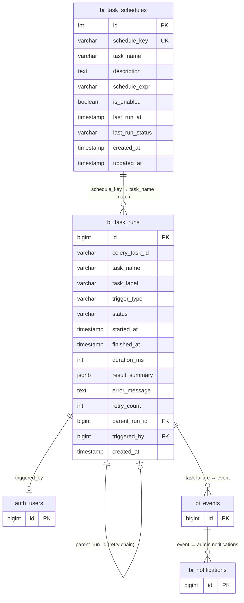
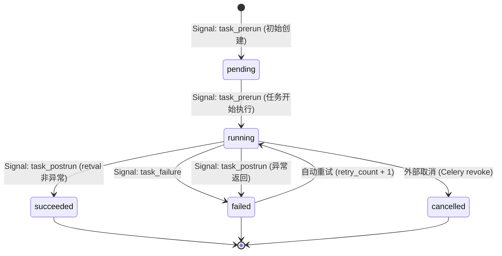
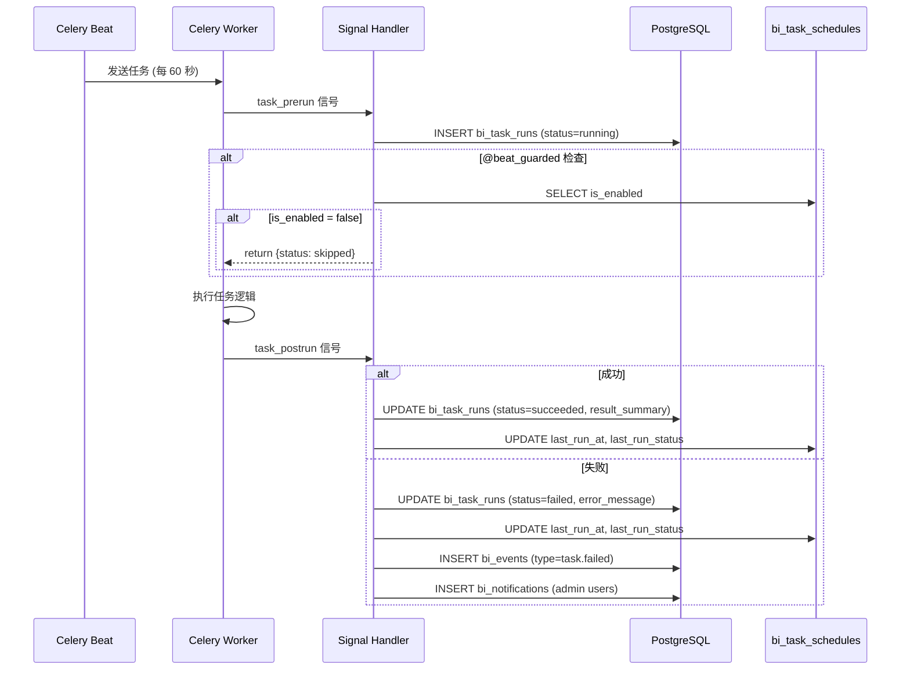
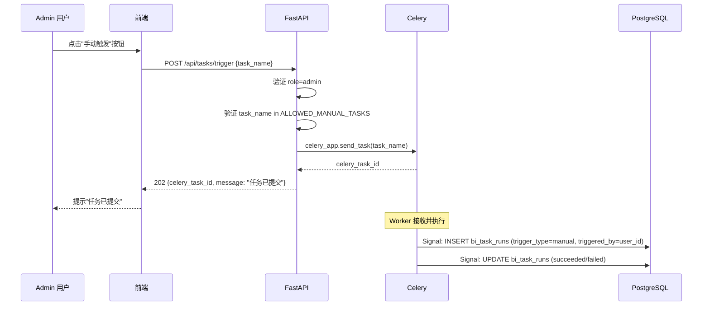
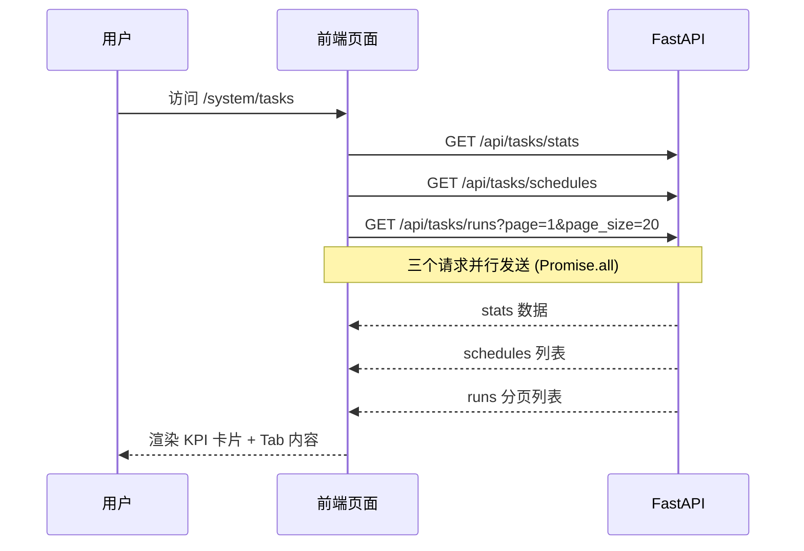

# 任务管理模块 技术规格书

> 版本：v1.0 | 状态：草稿 | 日期：2026-04-24 | 关联 PRD：无（内部基础设施）

---

## 1. 概述

### 1.1 目的

为平台的 Celery 异步任务体系提供完整的可观测性：定时任务总览、执行历史持久化、KPI 统计面板、失败告警。当前平台有 **20 个 Celery 任务**（7 个任务文件）和 **8 个 Beat 定时任务**，但无 UI 可见性，执行历史仅存于 Redis（TTL 1 小时即失），管理员无法掌握任务运行状况。

### 1.2 范围

| 包含 | 不包含 |
|------|--------|
| `bi_task_runs` 执行历史持久化（PostgreSQL） | Celery Worker 集群管理（Flower 等） |
| `bi_task_schedules` Beat 调度配置与启停 | 任务参数动态配置（使用硬编码 beat_schedule） |
| Celery Signal Handlers 零侵入自动记录 | 日志文件采集与全文检索 |
| 6 个 REST API 端点（4 读 + 2 写） | WebSocket 实时推送任务状态 |
| 前端完整管理页面（KPI + 定时任务 + 执行历史） | 多 Worker 负载均衡可视化 |
| 失败任务告警（集成 bi_events/bi_notifications） | 第三方告警渠道（Slack/邮件/PagerDuty） |
| 重试追踪（retry_count + parent_run_id） | 任务依赖编排（DAG） |
| 90 天数据自动清理 | 跨集群任务调度 |

### 1.3 关联文档

| 文档 | 路径 | 关系 |
|------|------|------|
| Celery 任务队列配置 | `backend/services/tasks/__init__.py` | 上游：定义 `beat_schedule` 和 `celery_app` |
| 事件与通知系统 | `docs/specs/16-notification-events-spec.md` | 集成：失败告警写入 `bi_events` + `bi_notifications` |
| 数据模型总览 | `docs/specs/03-data-model-overview.md` | 参考：表命名约定（`bi_` 前缀） |
| API 约定 | `docs/specs/02-api-conventions.md` | 遵循：分页、错误码、响应格式 |
| 认证与 RBAC | `docs/specs/04-auth-rbac-spec.md` | 依赖：角色权限控制 |
| Tableau MCP V1 同步 | `docs/specs/07-tableau-mcp-v1-spec.md` | 参考：Session 管理规范 §7.3 |

---

## 2. 数据模型

### 2.1 表定义

#### `bi_task_runs` — 任务执行历史

| 列名 | 类型 | 约束 | 说明 |
|------|------|------|------|
| `id` | `BIGINT` | PK, AUTO | 主键 |
| `celery_task_id` | `VARCHAR(256)` | NULLABLE, INDEXED | Celery AsyncResult UUID |
| `task_name` | `VARCHAR(256)` | NOT NULL | 任务全路径，如 `services.tasks.tableau_tasks.scheduled_sync_all` |
| `task_label` | `VARCHAR(128)` | NULLABLE | 人类可读名称，如 "Tableau 自动同步" |
| `trigger_type` | `VARCHAR(16)` | NOT NULL, DEFAULT `'beat'` | 触发方式：`beat` / `manual` / `api` |
| `status` | `VARCHAR(16)` | NOT NULL, DEFAULT `'pending'` | 执行状态：`pending` / `running` / `succeeded` / `failed` / `cancelled` |
| `started_at` | `TIMESTAMP` | NULLABLE | 任务开始时间 |
| `finished_at` | `TIMESTAMP` | NULLABLE | 任务完成时间 |
| `duration_ms` | `INTEGER` | NULLABLE | 执行耗时（毫秒） |
| `result_summary` | `JSONB` | NULLABLE | 任务返回值（dict） |
| `error_message` | `TEXT` | NULLABLE | 失败时的错误信息 |
| `retry_count` | `INTEGER` | NOT NULL, DEFAULT `0` | 当前重试次数 |
| `parent_run_id` | `BIGINT` | NULLABLE, FK → `bi_task_runs.id` | 首次执行的 run_id（重试链追踪） |
| `triggered_by` | `BIGINT` | NULLABLE, FK → `auth_users.id` | 手动触发时的操作人 |
| `created_at` | `TIMESTAMP` | NOT NULL, DEFAULT `NOW()` | 记录创建时间 |

**SQLAlchemy 模型定义：**

```python
from sqlalchemy import (
    Column, BigInteger, Integer, String, DateTime,
    Text, ForeignKey, Index
)
from app.core.database import Base, JSONB, sa_func, sa_text


class BiTaskRun(Base):
    __tablename__ = "bi_task_runs"

    id = Column(BigInteger, primary_key=True, autoincrement=True)
    celery_task_id = Column(String(256), nullable=True, index=True)
    task_name = Column(String(256), nullable=False)
    task_label = Column(String(128), nullable=True)
    trigger_type = Column(String(16), nullable=False, server_default=sa_text("'beat'"))
    status = Column(String(16), nullable=False, server_default=sa_text("'pending'"))
    started_at = Column(DateTime, nullable=True)
    finished_at = Column(DateTime, nullable=True)
    duration_ms = Column(Integer, nullable=True)
    result_summary = Column(JSONB, nullable=True)
    error_message = Column(Text, nullable=True)
    retry_count = Column(Integer, nullable=False, server_default=sa_text("0"))
    parent_run_id = Column(
        BigInteger,
        ForeignKey("bi_task_runs.id", ondelete="SET NULL"),
        nullable=True,
    )
    triggered_by = Column(
        BigInteger,
        ForeignKey("auth_users.id", ondelete="SET NULL"),
        nullable=True,
    )
    created_at = Column(DateTime, nullable=False, server_default=sa_func.now())

    __table_args__ = (
        Index("ix_task_runs_task_name_started", "task_name", "started_at"),
        Index("ix_task_runs_status_started", "status", "started_at"),
        Index("ix_task_runs_started_at", "started_at"),
        Index("ix_task_runs_parent", "parent_run_id"),
    )
```

#### `bi_task_schedules` — Beat 调度配置

| 列名 | 类型 | 约束 | 说明 |
|------|------|------|------|
| `id` | `INTEGER` | PK, AUTO | 主键 |
| `schedule_key` | `VARCHAR(128)` | UNIQUE, NOT NULL | 调度键，如 `"tableau-auto-sync"`，与 `beat_schedule` dict key 一致 |
| `task_name` | `VARCHAR(256)` | NOT NULL | 任务全路径 |
| `description` | `TEXT` | NULLABLE | 任务功能描述 |
| `schedule_expr` | `VARCHAR(256)` | NOT NULL | 人类可读调度表达式，如 `"每 60 秒"` |
| `is_enabled` | `BOOLEAN` | NOT NULL, DEFAULT `TRUE` | 是否启用 |
| `last_run_at` | `TIMESTAMP` | NULLABLE | 上次执行时间 |
| `last_run_status` | `VARCHAR(16)` | NULLABLE | 上次执行状态 |
| `created_at` | `TIMESTAMP` | NOT NULL, DEFAULT `NOW()` | 创建时间 |
| `updated_at` | `TIMESTAMP` | NOT NULL, DEFAULT `NOW()` | 更新时间 |

**SQLAlchemy 模型定义：**

```python
class BiTaskSchedule(Base):
    __tablename__ = "bi_task_schedules"

    id = Column(Integer, primary_key=True, autoincrement=True)
    schedule_key = Column(String(128), unique=True, nullable=False)
    task_name = Column(String(256), nullable=False)
    description = Column(Text, nullable=True)
    schedule_expr = Column(String(256), nullable=False)
    is_enabled = Column(Boolean, nullable=False, server_default=sa_text("true"))
    last_run_at = Column(DateTime, nullable=True)
    last_run_status = Column(String(16), nullable=True)
    created_at = Column(DateTime, nullable=False, server_default=sa_func.now())
    updated_at = Column(DateTime, nullable=False, server_default=sa_func.now())
```

### 2.2 ER 关系图



### 2.3 索引策略

| 表 | 索引名 | 列 | 类型 | 用途 |
|----|--------|-----|------|------|
| `bi_task_runs` | `ix_task_runs_celery_task_id` | `celery_task_id` | BTREE | Signal handler 按 Celery task ID 查找 |
| `bi_task_runs` | `ix_task_runs_task_name_started` | `(task_name, started_at)` | BTREE | 按任务名 + 时间范围查询执行历史 |
| `bi_task_runs` | `ix_task_runs_status_started` | `(status, started_at)` | BTREE | 按状态筛选 + 时间排序 |
| `bi_task_runs` | `ix_task_runs_started_at` | `started_at` | BTREE | KPI 统计的时间范围查询（今日/昨日） |
| `bi_task_runs` | `ix_task_runs_parent` | `parent_run_id` | BTREE | 重试链查询 |
| `bi_task_schedules` | `uq_task_schedules_key` | `schedule_key` | UNIQUE | 种子脚本幂等 upsert |

### 2.4 迁移说明

- 迁移脚本文件名：`backend/alembic/versions/YYYYMMDD_HHMMSS_create_bi_task_runs_and_schedules.py`
- 两张表在同一个迁移脚本中创建
- **关键检查点**：
  - 所有 `server_default` 必须正确生成（参见 CLAUDE.md 陷阱 4）
  - `parent_run_id` 自引用外键 `ondelete="SET NULL"`
  - `triggered_by` 外键引用 `auth_users.id`，`ondelete="SET NULL"`
- 必须验证 `upgrade head` → `downgrade -1` → `upgrade head` 三步可逆

---

## 3. API 设计

### 3.1 端点总览

| 方法 | 路径 | 说明 | 认证 | 角色 | 阶段 |
|------|------|------|------|------|------|
| `GET` | `/api/tasks/schedules` | 定时任务列表 | 需要 | `analyst+` | P0 |
| `GET` | `/api/tasks/runs` | 执行历史（分页+筛选） | 需要 | `analyst+` | P0 |
| `GET` | `/api/tasks/runs/{id}` | 单条执行详情 | 需要 | `analyst+` | P0 |
| `GET` | `/api/tasks/stats` | KPI 统计 | 需要 | `analyst+` | P0 |
| `PATCH` | `/api/tasks/schedules/{key}` | 启停定时任务 | 需要 | `admin` | P1 |
| `POST` | `/api/tasks/trigger` | 手动触发任务 | 需要 | `admin` | P1 |

> 路由注册在 `backend/app/api/tasks.py`，Router prefix = `/api/tasks`。

### 3.2 请求/响应 Schema

---

#### `GET /api/tasks/schedules`

获取所有 Beat 定时任务及其状态。

**请求参数：** 无

**响应 (200)：**

```json
{
  "items": [
    {
      "id": 1,
      "schedule_key": "tableau-auto-sync",
      "task_name": "services.tasks.tableau_tasks.scheduled_sync_all",
      "task_label": "Tableau 自动同步",
      "description": "每 60 秒同步一次 Tableau 资产",
      "schedule_expr": "每 60 秒",
      "is_enabled": true,
      "last_run_at": "2026-04-24T10:00:00Z",
      "last_run_status": "succeeded",
      "next_run_at": "2026-04-24T10:01:00Z"
    }
  ],
  "total": 8
}
```

**字段说明：**
- `task_label`：从 `TASK_LABELS` 常量映射获取，不在 DB 中存储
- `next_run_at`：基于 `schedule_expr` 和 `last_run_at` 计算（Python 层），非 DB 列

---

#### `GET /api/tasks/runs`

分页查询任务执行历史，支持多维度筛选。

**请求参数（Query String）：**

```json
{
  "page": 1,
  "page_size": 20,
  "status": "failed",
  "task_name": "services.tasks.tableau_tasks.scheduled_sync_all",
  "trigger_type": "beat",
  "start_time": "2026-04-24T00:00:00Z",
  "end_time": "2026-04-24T23:59:59Z"
}
```

| 参数 | 类型 | 必填 | 说明 |
|------|------|------|------|
| `page` | int | 否 | 页码，默认 `1` |
| `page_size` | int | 否 | 每页条数，默认 `20`，最大 `100` |
| `status` | string | 否 | 状态筛选：`pending` / `running` / `succeeded` / `failed` / `cancelled` |
| `task_name` | string | 否 | 任务全路径精确匹配 |
| `trigger_type` | string | 否 | 触发方式筛选：`beat` / `manual` / `api` |
| `start_time` | datetime | 否 | 开始时间（`started_at >=`） |
| `end_time` | datetime | 否 | 结束时间（`started_at <=`） |

**响应 (200)：**

```json
{
  "items": [
    {
      "id": 48,
      "celery_task_id": "a1b2c3d4-e5f6-7890-abcd-ef1234567890",
      "task_name": "services.tasks.tableau_tasks.scheduled_sync_all",
      "task_label": "Tableau 自动同步",
      "trigger_type": "beat",
      "status": "succeeded",
      "started_at": "2026-04-24T10:00:00Z",
      "finished_at": "2026-04-24T10:00:02Z",
      "duration_ms": 2100,
      "retry_count": 0,
      "parent_run_id": null,
      "triggered_by": null,
      "created_at": "2026-04-24T10:00:00Z"
    }
  ],
  "total": 156,
  "page": 1,
  "page_size": 20,
  "pages": 8
}
```

---

#### `GET /api/tasks/runs/{id}`

获取单条执行记录的完整详情，含 `result_summary` 和 `error_message`。

**路径参数：**

| 参数 | 类型 | 说明 |
|------|------|------|
| `id` | int | `bi_task_runs.id` |

**响应 (200)：**

```json
{
  "id": 47,
  "celery_task_id": "f1e2d3c4-b5a6-7890-abcd-ef0987654321",
  "task_name": "services.tasks.dqc_tasks.run_daily_full_cycle",
  "task_label": "DQC 每日完整检查",
  "trigger_type": "beat",
  "status": "failed",
  "started_at": "2026-04-24T04:00:00Z",
  "finished_at": "2026-04-24T04:00:15Z",
  "duration_ms": 15300,
  "result_summary": null,
  "error_message": "ConnectionError: database connection pool exhausted",
  "retry_count": 2,
  "parent_run_id": 45,
  "triggered_by": null,
  "created_at": "2026-04-24T04:00:00Z"
}
```

**错误响应 (404)：**

```json
{
  "error_code": "TASK_001",
  "message": "执行记录不存在"
}
```

---

#### `GET /api/tasks/stats`

返回今日任务执行 KPI 统计。

**请求参数（Query String）：**

| 参数 | 类型 | 必填 | 说明 |
|------|------|------|------|
| `date` | string | 否 | 统计日期，ISO 格式，默认今日 |

**响应 (200)：**

```json
{
  "date": "2026-04-24",
  "total_runs": 48,
  "succeeded": 45,
  "failed": 2,
  "running": 1,
  "success_rate": 93.75,
  "avg_duration_ms": 12300,
  "comparison": {
    "total_runs_delta": 3,
    "success_rate_delta": -1.25,
    "failed_delta": 1
  }
}
```

**字段说明：**
- `success_rate`：`succeeded / (succeeded + failed) * 100`，排除 `running` 和 `pending`
- `avg_duration_ms`：所有已完成任务（succeeded + failed）的平均耗时
- `comparison`：与前一日对比的差值（`delta = today - yesterday`）

**实现逻辑（SQL 伪代码）：**

```sql
SELECT
  COUNT(*) AS total_runs,
  COUNT(*) FILTER (WHERE status = 'succeeded') AS succeeded,
  COUNT(*) FILTER (WHERE status = 'failed') AS failed,
  COUNT(*) FILTER (WHERE status = 'running') AS running,
  AVG(duration_ms) FILTER (WHERE status IN ('succeeded', 'failed')) AS avg_duration_ms
FROM bi_task_runs
WHERE started_at >= :date_start AND started_at < :date_end;
```

---

#### `PATCH /api/tasks/schedules/{key}`（P1）

启用或禁用指定 Beat 定时任务。

**路径参数：**

| 参数 | 类型 | 说明 |
|------|------|------|
| `key` | string | `bi_task_schedules.schedule_key` |

**请求体：**

```json
{
  "is_enabled": false
}
```

**响应 (200)：**

```json
{
  "schedule_key": "tableau-auto-sync",
  "is_enabled": false,
  "updated_at": "2026-04-24T10:05:00Z"
}
```

**副作用：** 修改 `bi_task_schedules.is_enabled` 后，`@beat_guarded` 装饰器在下次 Beat 触发时读取该字段，若为 `false` 则跳过执行。

**错误响应 (404)：**

```json
{
  "error_code": "TASK_002",
  "message": "调度任务不存在"
}
```

---

#### `POST /api/tasks/trigger`（P1）

手动触发一个任务立即执行。

**请求体：**

```json
{
  "task_name": "services.tasks.tableau_tasks.scheduled_sync_all"
}
```

| 字段 | 类型 | 必填 | 说明 |
|------|------|------|------|
| `task_name` | string | 是 | 必须在 `ALLOWED_MANUAL_TASKS` 白名单中 |

**响应 (202)：**

```json
{
  "celery_task_id": "a1b2c3d4-e5f6-7890-abcd-ef1234567890",
  "task_name": "services.tasks.tableau_tasks.scheduled_sync_all",
  "trigger_type": "manual",
  "message": "任务已提交"
}
```

**安全约束：**
- 仅 `admin` 角色可调用
- `task_name` 必须在硬编码白名单 `ALLOWED_MANUAL_TASKS` 中，防止任意任务注入
- 创建 `bi_task_runs` 记录时写入 `triggered_by = current_user.id`

**`ALLOWED_MANUAL_TASKS` 白名单：**

```python
ALLOWED_MANUAL_TASKS = [
    "services.tasks.tableau_tasks.scheduled_sync_all",
    "services.tasks.dqc_tasks.run_daily_full_cycle",
    "services.tasks.quality_tasks.cleanup_old_quality_results",
    "services.tasks.event_tasks.purge_old_events",
    "services.tasks.knowledge_base_tasks.reindex_hnsw_task",
    "services.tasks.knowledge_base_tasks.vacuum_analyze_embeddings_task",
    "services.tasks.dqc_tasks.partition_maintenance",
    "services.tasks.dqc_tasks.cleanup_old_analyses",
]
```

**错误响应 (400)：**

```json
{
  "error_code": "TASK_003",
  "message": "不允许手动触发该任务",
  "detail": {
    "task_name": "xxx",
    "allowed_tasks": ["..."]
  }
}
```

---

## 4. 业务逻辑

### 4.1 任务状态机



**状态定义：**

| 状态 | 含义 | 进入条件 |
|------|------|---------|
| `pending` | 已创建记录但尚未开始 | `task_prerun` 信号触发时的短暂中间态 |
| `running` | 正在执行 | `task_prerun` 信号，`started_at` 写入当前时间 |
| `succeeded` | 执行成功 | `task_postrun` 信号，`state == SUCCESS` |
| `failed` | 执行失败 | `task_failure` 信号 或 `task_postrun` 信号（`state == FAILURE`） |
| `cancelled` | 被取消 | Celery `revoke()` 后 `task_postrun` 信号（`state == REVOKED`） |

### 4.2 Celery Signal Handlers（零侵入方案）

**设计原则：** 通过 Celery 内置信号机制自动记录执行历史，**无需修改现有 20 个任务函数**。所有信号处理器必须 `try/except` 包裹，DB 写入失败不得影响任务本身的执行。

**信号处理器文件：** `backend/services/tasks/signals.py`

**注册方式：** 在 `backend/services/tasks/__init__.py` 中 import 信号模块：

```python
# __init__.py 末尾追加
from services.tasks import signals  # noqa: F401  注册 Celery 信号处理器
```

#### 信号处理器伪代码

```python
from celery.signals import task_prerun, task_postrun, task_failure
from datetime import datetime
import logging

from app.core.database import get_db_context

logger = logging.getLogger(__name__)

# 任务名 → 人类可读标签映射
TASK_LABELS = {
    "services.tasks.tableau_tasks.scheduled_sync_all": "Tableau 自动同步",
    "services.tasks.tableau_tasks.sync_connection_task": "Tableau 单连接同步",
    "services.tasks.dqc_tasks.run_daily_full_cycle": "DQC 每日完整检查",
    "services.tasks.dqc_tasks.partition_maintenance": "DQC 分区维护",
    "services.tasks.dqc_tasks.cleanup_old_analyses": "DQC 分析清理",
    "services.tasks.quality_tasks.cleanup_old_quality_results": "质量结果清理",
    "services.tasks.event_tasks.purge_old_events": "事件数据清理",
    "services.tasks.knowledge_base_tasks.reindex_hnsw_task": "HNSW 索引重建",
    "services.tasks.knowledge_base_tasks.vacuum_analyze_embeddings_task": "向量表 VACUUM",
}


@task_prerun.connect
def on_task_prerun(sender=None, task_id=None, task=None, **kwargs):
    """任务开始执行时创建 bi_task_runs 记录。"""
    try:
        from services.tasks.models import BiTaskRun

        with get_db_context() as db:
            # 判断触发方式
            delivery_info = task.request.delivery_info or {}
            trigger_type = "manual" if delivery_info.get("is_eager") else "beat"

            # 检测重试：Celery task.request.retries > 0
            retry_count = getattr(task.request, "retries", 0) or 0
            parent_run_id = None
            if retry_count > 0:
                # 查找同一 celery_task_id 的首次记录
                first_run = db.query(BiTaskRun).filter(
                    BiTaskRun.celery_task_id == task_id,
                    BiTaskRun.retry_count == 0,
                ).first()
                parent_run_id = first_run.id if first_run else None

            run = BiTaskRun(
                celery_task_id=task_id,
                task_name=sender.name,
                task_label=TASK_LABELS.get(sender.name),
                trigger_type=trigger_type,
                status="running",
                started_at=datetime.now(),
                retry_count=retry_count,
                parent_run_id=parent_run_id,
            )
            db.add(run)
            db.commit()
    except Exception as e:
        logger.warning("Signal on_task_prerun failed: %s", e, exc_info=True)


@task_postrun.connect
def on_task_postrun(sender=None, task_id=None, state=None, retval=None, **kwargs):
    """任务执行完毕后更新 bi_task_runs 记录。"""
    try:
        from services.tasks.models import BiTaskRun

        with get_db_context() as db:
            run = db.query(BiTaskRun).filter(
                BiTaskRun.celery_task_id == task_id,
            ).order_by(BiTaskRun.id.desc()).first()

            if not run:
                return

            now = datetime.now()
            run.finished_at = now
            if run.started_at:
                run.duration_ms = int((now - run.started_at).total_seconds() * 1000)

            if state == "SUCCESS":
                run.status = "succeeded"
                run.result_summary = retval if isinstance(retval, dict) else None
            elif state == "FAILURE":
                run.status = "failed"
                run.error_message = str(retval) if retval else None
            elif state == "REVOKED":
                run.status = "cancelled"
            else:
                run.status = "failed"

            db.commit()

            # 更新关联 schedule 的 last_run 状态
            _update_schedule_last_run(db, run.task_name, now, run.status)

            # 失败告警
            if run.status == "failed":
                _emit_failure_alert(db, run)

    except Exception as e:
        logger.warning("Signal on_task_postrun failed: %s", e, exc_info=True)


@task_failure.connect
def on_task_failure(sender=None, task_id=None, exception=None, traceback=None, **kwargs):
    """任务异常时更新 bi_task_runs 并写入错误信息。"""
    try:
        from services.tasks.models import BiTaskRun

        with get_db_context() as db:
            run = db.query(BiTaskRun).filter(
                BiTaskRun.celery_task_id == task_id,
            ).order_by(BiTaskRun.id.desc()).first()

            if not run:
                return

            now = datetime.now()
            run.status = "failed"
            run.finished_at = now
            run.error_message = f"{type(exception).__name__}: {exception}"
            if run.started_at:
                run.duration_ms = int((now - run.started_at).total_seconds() * 1000)

            db.commit()

            _update_schedule_last_run(db, run.task_name, now, "failed")
            _emit_failure_alert(db, run)

    except Exception as e:
        logger.warning("Signal on_task_failure failed: %s", e, exc_info=True)
```

#### Schedule 状态回写

```python
def _update_schedule_last_run(db, task_name: str, run_at, status: str):
    """更新 bi_task_schedules 的 last_run_at 和 last_run_status。"""
    from services.tasks.models import BiTaskSchedule

    schedule = db.query(BiTaskSchedule).filter(
        BiTaskSchedule.task_name == task_name,
    ).first()
    if schedule:
        schedule.last_run_at = run_at
        schedule.last_run_status = status
        schedule.updated_at = run_at
        db.commit()
```

### 4.3 `@beat_guarded` 装饰器

**文件：** `backend/services/tasks/decorators.py`

**用途：** 包裹 Beat 定时任务，执行前查询 `bi_task_schedules.is_enabled`，若为 `False` 则跳过执行并返回 `{"status": "skipped", "reason": "disabled"}`。

```python
import functools
import logging

from app.core.database import get_db_context

logger = logging.getLogger(__name__)


def beat_guarded(schedule_key: str):
    """装饰器：Beat 任务执行前检查 is_enabled 状态。

    用法：
        @celery_app.task
        @beat_guarded("tableau-auto-sync")
        def scheduled_sync_all():
            ...
    """
    def decorator(func):
        @functools.wraps(func)
        def wrapper(*args, **kwargs):
            try:
                from services.tasks.models import BiTaskSchedule

                with get_db_context() as db:
                    schedule = db.query(BiTaskSchedule).filter(
                        BiTaskSchedule.schedule_key == schedule_key,
                    ).first()

                    if schedule and not schedule.is_enabled:
                        logger.info(
                            "beat_guarded: '%s' is disabled, skipping",
                            schedule_key,
                        )
                        return {"status": "skipped", "reason": "disabled"}
            except Exception as e:
                logger.warning(
                    "beat_guarded check failed for '%s': %s (proceeding anyway)",
                    schedule_key, e,
                )

            return func(*args, **kwargs)
        return wrapper
    return decorator
```

**装饰器安装位置（P1 阶段修改 8 个 Beat 任务）：**

| 文件 | 任务函数 | `schedule_key` |
|------|---------|---------------|
| `tableau_tasks.py` | `scheduled_sync_all` | `"tableau-auto-sync"` |
| `quality_tasks.py` | `cleanup_old_quality_results` | `"quality-cleanup-old-results"` |
| `event_tasks.py` | `purge_old_events` | `"events-purge-old"` |
| `knowledge_base_tasks.py` | `reindex_hnsw_task` | `"hnsw-reindex"` |
| `knowledge_base_tasks.py` | `vacuum_analyze_embeddings_task` | `"hnsw-vacuum-analyze"` |
| `dqc_tasks.py` | `run_daily_full_cycle` | `"dqc-cycle-daily"` |
| `dqc_tasks.py` | `partition_maintenance` | `"dqc-partition-maintenance"` |
| `dqc_tasks.py` | `cleanup_old_analyses` | `"dqc-cleanup-old-analyses"` |

### 4.4 种子数据脚本

**文件：** `backend/services/tasks/seed.py`

从 `services/tasks/__init__.py` 中的 `beat_schedule` dict 幂等写入 `bi_task_schedules` 表。

**种子数据完整清单（8 条）：**

| `schedule_key` | `task_name` | `description` | `schedule_expr` |
|----------------|-------------|---------------|-----------------|
| `tableau-auto-sync` | `services.tasks.tableau_tasks.scheduled_sync_all` | 同步所有 Tableau 连接的资产数据 | `每 60 秒` |
| `quality-cleanup-old-results` | `services.tasks.quality_tasks.cleanup_old_quality_results` | 清理 90 天前的质量检查结果 | `每 24 小时` |
| `events-purge-old` | `services.tasks.event_tasks.purge_old_events` | 清理过期事件与通知数据 | `每 24 小时` |
| `hnsw-reindex` | `services.tasks.knowledge_base_tasks.reindex_hnsw_task` | 重建 HNSW 向量索引（低峰维护） | `每月第 1 个周日 03:00` |
| `hnsw-vacuum-analyze` | `services.tasks.knowledge_base_tasks.vacuum_analyze_embeddings_task` | 向量表 VACUUM ANALYZE | `每周日 03:00` |
| `dqc-cycle-daily` | `services.tasks.dqc_tasks.run_daily_full_cycle` | DQC 每日全量数据质量检查 | `每日 04:00` |
| `dqc-partition-maintenance` | `services.tasks.dqc_tasks.partition_maintenance` | DQC 分区维护（表分区管理） | `每月 1 日 03:10` |
| `dqc-cleanup-old-analyses` | `services.tasks.dqc_tasks.cleanup_old_analyses` | 清理过期 DQC 分析记录与 Cycle | `每日 03:30` |

**种子脚本伪代码：**

```python
def seed_task_schedules(db_session):
    """从 beat_schedule 幂等写入 bi_task_schedules。"""
    from services.tasks.models import BiTaskSchedule

    SEED_DATA = [
        # (schedule_key, task_name, description, schedule_expr)
        ("tableau-auto-sync", "services.tasks.tableau_tasks.scheduled_sync_all",
         "同步所有 Tableau 连接的资产数据", "每 60 秒"),
        # ... 其余 7 条同上表
    ]

    for key, task, desc, expr in SEED_DATA:
        existing = db_session.query(BiTaskSchedule).filter(
            BiTaskSchedule.schedule_key == key,
        ).first()
        if not existing:
            db_session.add(BiTaskSchedule(
                schedule_key=key,
                task_name=task,
                description=desc,
                schedule_expr=expr,
            ))
    db_session.commit()
```

**调用时机：**
- Alembic 迁移完成后手动执行一次
- 或在 `scheduled_sync_all` 等 Beat 首次执行时自动调用（判空则种子）

### 4.5 失败告警（集成 bi_events + bi_notifications）

任务失败时自动创建事件和管理员通知，复用现有 `services.events.models.EventDatabase` 服务。

```python
def _emit_failure_alert(db, run):
    """任务失败时写入 bi_events + bi_notifications。"""
    from services.events.models import EventDatabase

    try:
        event_db = EventDatabase()

        # 1. 创建事件
        event = event_db.create_event(
            db=db,
            event_type="task.failed",
            source_module="tasks",
            source_id=str(run.id),
            severity="error",
            payload_json={
                "task_name": run.task_name,
                "task_label": run.task_label,
                "error_message": run.error_message,
                "retry_count": run.retry_count,
                "duration_ms": run.duration_ms,
                "celery_task_id": run.celery_task_id,
            },
        )

        # 2. 通知所有 admin 角色用户
        admin_ids = event_db.get_users_by_role(db, "admin")
        if admin_ids:
            label = run.task_label or run.task_name.rsplit(".", 1)[-1]
            event_db.batch_create_notifications(
                db=db,
                event_id=event.id,
                user_ids=admin_ids,
                title=f"任务失败：{label}",
                content=run.error_message or "未知错误",
                level="error",
                link=f"/system/tasks?tab=history&run_id={run.id}",
            )
    except Exception as e:
        logger.warning("Failed to emit task failure alert: %s", e)
```

### 4.6 90 天数据自动清理

在现有 `events-purge-old` 任务或独立 Beat 任务中追加清理逻辑：

```python
def cleanup_old_task_runs(days: int = 90):
    """清理 N 天前的 bi_task_runs 记录。"""
    from services.tasks.models import BiTaskRun
    from app.core.database import get_db_context
    from datetime import datetime, timedelta

    cutoff = datetime.now() - timedelta(days=days)
    with get_db_context() as db:
        deleted = db.query(BiTaskRun).filter(
            BiTaskRun.created_at < cutoff,
        ).delete(synchronize_session=False)
        db.commit()
        logger.info("Cleaned up %d task_runs older than %d days", deleted, days)
```

### 4.7 校验规则

- `page_size` 最大 100，超出返回 `TASK_004`
- `task_name`（手动触发）必须在 `ALLOWED_MANUAL_TASKS` 白名单中
- `schedule_key`（启停）必须已存在于 `bi_task_schedules` 表
- `start_time` / `end_time` 必须为合法 ISO 8601 格式

---

## 5. 错误码

| 错误码 | HTTP | 说明 | 触发条件 |
|--------|------|------|---------|
| `TASK_001` | 404 | 执行记录不存在 | `GET /runs/{id}` 查无记录 |
| `TASK_002` | 404 | 调度任务不存在 | `PATCH /schedules/{key}` 查无记录 |
| `TASK_003` | 400 | 不允许手动触发该任务 | `POST /trigger` 的 `task_name` 不在白名单 |
| `TASK_004` | 400 | 分页参数无效 | `page_size > 100` 或 `page < 1` |
| `TASK_005` | 403 | 权限不足 | 非 admin 角色调用写操作 |
| `TASK_006` | 409 | 任务正在运行中 | 手动触发时同名任务已有 `running` 状态记录 |

---

## 6. 安全

### 6.1 角色权限矩阵

| 操作 | admin | data_admin | analyst | user |
|------|-------|-----------|---------|------|
| 查看定时任务列表 | Y | Y | Y | N |
| 查看执行历史 | Y | Y | Y | N |
| 查看执行详情 | Y | Y | Y | N |
| 查看 KPI 统计 | Y | Y | Y | N |
| 启停定时任务 | Y | N | N | N |
| 手动触发任务 | Y | N | N | N |

### 6.2 安全约束

- 手动触发端点使用硬编码白名单 `ALLOWED_MANUAL_TASKS`，防止任意 Celery 任务注入
- `triggered_by` 字段自动从 Session Cookie 中获取当前用户 ID
- 所有端点需通过 `get_current_user(request)` 认证
- 写操作需额外 role 检查：`if current_user.role != "admin": raise HTTPException(403)`

### 6.3 敏感度处理

- `result_summary` JSONB 中可能包含连接凭据摘要信息，响应前应脱敏（移除含 `token`/`password`/`secret` 的字段）
- `error_message` 可能包含堆栈信息，对非 admin 角色截断至前 500 字符

---

## 7. 集成点

### 7.1 上游依赖

| 模块 | 接口 | 用途 |
|------|------|------|
| Celery 信号系统 | `task_prerun` / `task_postrun` / `task_failure` | 自动捕获任务生命周期 |
| Redis（Celery Broker） | broker URL | Celery 任务调度 |
| `app.core.database` | `get_db_context()` | Signal handler 中的 DB Session 管理 |
| `services.tasks.__init__` | `celery_app`、`beat_schedule` | 任务注册和 Beat 配置 |

### 7.2 下游消费者

| 模块 | 消费方式 | 说明 |
|------|---------|------|
| 前端任务管理页 | REST API (`/api/tasks/*`) | KPI + 定时任务 + 执行历史展示 |
| 事件系统 | `EventDatabase.create_event()` | 失败告警写入 `bi_events` |
| 通知系统 | `EventDatabase.batch_create_notifications()` | 失败告警通知 admin 用户 |

### 7.3 事件发射

| 事件名 | 触发时机 | Payload |
|--------|---------|---------|
| `task.failed` | 任务执行失败（`task_postrun` state=FAILURE 或 `task_failure` 信号） | `{ task_name, task_label, error_message, retry_count, duration_ms, celery_task_id }` |

---

## 8. 时序图

### 8.1 Beat 调度 → 自动记录执行历史



### 8.2 手动触发任务



### 8.3 前端页面数据加载



---

## 9. 前端页面设计

### 9.1 页面结构

**路由：** `/system/tasks`（已在 AdminSidebarLayout 侧边栏注册）

**文件：** `frontend/src/pages/admin/tasks/page.tsx`（替换现有占位页）

**API 客户端：** `frontend/src/api/tasks.ts`（新建）

### 9.2 页面 Wireframe

```
┌─────────────────────────────────────────────────────────────┐
│ 页面标题区                                                    │
│ ┌─────────────────────────────────────────────────────────┐  │
│ │ 任务管理                                    [🔄 手动触发]  │  │
│ │ 管理平台定时任务与执行历史                                 │  │
│ └─────────────────────────────────────────────────────────┘  │
│                                                              │
│ KPI 统计卡片区 (grid grid-cols-4 gap-4)                       │
│ ┌────────────┬────────────┬────────────┬────────────────┐    │
│ │ 📊 今日执行 │ ✅ 成功率   │ ❌ 失败任务 │ ⏱️ 平均耗时     │    │
│ │    48      │   93.8%    │     2      │    12.3s       │    │
│ │  ↑ +3      │  ↓ -1.25%  │  ↑ +1      │               │    │
│ └────────────┴────────────┴────────────┴────────────────┘    │
│                                                              │
│ Tab 切换区 (pill-style 切换)                                   │
│ ┌─────────────────────────────────────────────────────────┐  │
│ │ [定时任务]  [执行历史]                                     │  │
│ └─────────────────────────────────────────────────────────┘  │
│                                                              │
│ Tab 1: 定时任务列表                                           │
│ ┌──────────────────────────────────────────────────────────┐ │
│ │ 任务名称      │ 调度周期       │ 状态  │ 上次执行   │ 下次执行   │ 操作 │ │
│ ├──────────────┼──────────────┼──────┼──────────┼──────────┼────┤ │
│ │ Tableau 同步  │ 每 60 秒      │ 🟢   │ 10:00:00 │ 10:01:00 │ ⏸🔄│ │
│ │ DQC 日检     │ 每日 04:00    │ 🟢   │ 04:00:12 │ 明04:00  │ ⏸🔄│ │
│ │ HNSW 重建    │ 每月首周日 3AM │ 🟡   │ 4月7日    │ 5月4日   │ ⏸🔄│ │
│ │ ...          │ ...          │ ...  │ ...      │ ...      │ ...│ │
│ └──────────────────────────────────────────────────────────┘ │
│                                                              │
│ Tab 2: 执行历史（带分页+筛选）                                 │
│ ┌──────────────────────────────────────────────────────────┐ │
│ │ 筛选区：[全部|运行中|成功|失败] [任务名称▼] [日期范围]        │ │
│ ├──────────────────────────────────────────────────────────┤ │
│ │ ID │ 任务名称      │ 触发  │ 状态    │ 开始时间   │ 耗时    │ │
│ ├────┼──────────────┼──────┼────────┼──────────┼────────┤ │
│ │ 48 │ Tableau 同步  │ beat │ 🟢成功  │ 10:00:00 │ 2.1s   │ │
│ │ 47 │ DQC 日检     │ beat │ 🔴失败  │ 04:00:00 │ 15.3s  │ │
│ │ 46 │ Tableau 同步  │ 手动  │ 🟢成功  │ 09:45:00 │ 1.8s   │ │
│ │ ...                                                      │ │
│ ├──────────────────────────────────────────────────────────┤ │
│ │                分页：‹ 上一页  1/62  下一页 ›               │ │
│ └──────────────────────────────────────────────────────────┘ │
└─────────────────────────────────────────────────────────────┘
```

### 9.3 色彩与状态映射

| 状态 | 色彩 | Badge 样式 |
|------|------|-----------|
| `succeeded` / 已启用 | emerald | `bg-emerald-100 text-emerald-700` |
| `running` | blue | `bg-blue-100 text-blue-700` |
| `failed` | red | `bg-red-100 text-red-700` |
| `pending` / 已禁用 | slate | `bg-slate-100 text-slate-500` |
| `cancelled` | amber | `bg-amber-100 text-amber-700` |

### 9.4 前端 API 客户端接口

**文件：** `frontend/src/api/tasks.ts`

```typescript
import { API_BASE } from '../config';

// ===== 类型定义 =====

export interface TaskSchedule {
  id: number;
  schedule_key: string;
  task_name: string;
  task_label: string;
  description: string;
  schedule_expr: string;
  is_enabled: boolean;
  last_run_at: string | null;
  last_run_status: string | null;
  next_run_at: string | null;
}

export interface TaskRun {
  id: number;
  celery_task_id: string | null;
  task_name: string;
  task_label: string | null;
  trigger_type: 'beat' | 'manual' | 'api';
  status: 'pending' | 'running' | 'succeeded' | 'failed' | 'cancelled';
  started_at: string | null;
  finished_at: string | null;
  duration_ms: number | null;
  result_summary: Record<string, unknown> | null;
  error_message: string | null;
  retry_count: number;
  parent_run_id: number | null;
  triggered_by: number | null;
  created_at: string;
}

export interface TaskStats {
  date: string;
  total_runs: number;
  succeeded: number;
  failed: number;
  running: number;
  success_rate: number;
  avg_duration_ms: number;
  comparison: {
    total_runs_delta: number;
    success_rate_delta: number;
    failed_delta: number;
  };
}

export interface TaskRunsParams {
  page?: number;
  page_size?: number;
  status?: string;
  task_name?: string;
  trigger_type?: string;
  start_time?: string;
  end_time?: string;
}

export interface PaginatedResponse<T> {
  items: T[];
  total: number;
  page: number;
  page_size: number;
  pages: number;
}

// ===== API 函数 =====

export async function fetchTaskSchedules(): Promise<{ items: TaskSchedule[]; total: number }> {
  const res = await fetch(`${API_BASE}/api/tasks/schedules`, { credentials: 'include' });
  if (!res.ok) throw new Error('获取定时任务列表失败');
  return res.json();
}

export async function fetchTaskRuns(params?: TaskRunsParams): Promise<PaginatedResponse<TaskRun>> {
  const sp = new URLSearchParams();
  if (params?.page) sp.set('page', String(params.page));
  if (params?.page_size) sp.set('page_size', String(params.page_size));
  if (params?.status) sp.set('status', params.status);
  if (params?.task_name) sp.set('task_name', params.task_name);
  if (params?.trigger_type) sp.set('trigger_type', params.trigger_type);
  if (params?.start_time) sp.set('start_time', params.start_time);
  if (params?.end_time) sp.set('end_time', params.end_time);

  const res = await fetch(`${API_BASE}/api/tasks/runs?${sp}`, { credentials: 'include' });
  if (!res.ok) throw new Error('获取执行历史失败');
  return res.json();
}

export async function fetchTaskRunDetail(id: number): Promise<TaskRun> {
  const res = await fetch(`${API_BASE}/api/tasks/runs/${id}`, { credentials: 'include' });
  if (!res.ok) throw new Error('获取执行详情失败');
  return res.json();
}

export async function fetchTaskStats(date?: string): Promise<TaskStats> {
  const sp = date ? `?date=${date}` : '';
  const res = await fetch(`${API_BASE}/api/tasks/stats${sp}`, { credentials: 'include' });
  if (!res.ok) throw new Error('获取统计数据失败');
  return res.json();
}

export async function toggleSchedule(key: string, isEnabled: boolean): Promise<void> {
  const res = await fetch(`${API_BASE}/api/tasks/schedules/${key}`, {
    method: 'PATCH',
    headers: { 'Content-Type': 'application/json' },
    credentials: 'include',
    body: JSON.stringify({ is_enabled: isEnabled }),
  });
  if (!res.ok) {
    const err = await res.json();
    throw new Error(err.message || '操作失败');
  }
}

export async function triggerTask(taskName: string): Promise<{ celery_task_id: string }> {
  const res = await fetch(`${API_BASE}/api/tasks/trigger`, {
    method: 'POST',
    headers: { 'Content-Type': 'application/json' },
    credentials: 'include',
    body: JSON.stringify({ task_name: taskName }),
  });
  if (!res.ok) {
    const err = await res.json();
    throw new Error(err.message || '触发失败');
  }
  return res.json();
}
```

### 9.5 前端组件拆分

| 组件 | 位置 | 职责 |
|------|------|------|
| `AdminTasksPage` | `pages/admin/tasks/page.tsx` | 页面主容器：状态管理、数据加载、Tab 切换 |
| KPI 卡片区 | 内联于页面 | 4 列 grid，展示 stats 数据 + comparison delta |
| 定时任务表格 | 内联于页面 | schedules 列表 + 状态 badge + 启停 toggle + 手动触发按钮 |
| 执行历史表格 | 内联于页面 | runs 分页表格 + 筛选栏（状态 pill、任务下拉、日期范围） |
| 分页控件 | 内联于页面 | 上一页/下一页 + 当前页码/总页数 |
| `ConfirmModal` | `components/ConfirmModal.tsx` | 复用现有确认弹窗（启停确认、手动触发确认） |

> 遵循项目约定：所有 UI 内联构建于页面组件中（Tailwind CSS），不抽取独立组件（与 user-management、activity 等页面一致）。

### 9.6 前端交互规范

- **数据加载**：页面 mount 时 `Promise.all` 并行请求 stats + schedules + runs
- **Tab 切换**：本地 state 控制（`activeTab: 'schedules' | 'history'`），不改 URL
- **筛选**：执行历史的状态/任务名/日期筛选为受控组件，变更后重新请求 `fetchTaskRuns`
- **分页**：点击上一页/下一页时调用 `fetchTaskRuns({ page: newPage })`
- **启停 toggle**（P1）：点击后弹 `ConfirmModal`（"确认禁用 XXX？"），确认后调用 `toggleSchedule`
- **手动触发**（P1）：点击后弹 `ConfirmModal`（"确认立即执行 XXX？"），确认后调用 `triggerTask`
- **Loading 态**：`<div className="p-8 text-center text-slate-400">加载中...</div>`
- **空状态**：暂无执行记录时显示居中图标 + 提示文案
- **错误提示**：顶部 inline alert banner（`bg-red-50 text-red-700 border-red-200`）

---

## 10. 分阶段交付

### P0：只读面板（可独立交付、独立部署）

**后端：**
1. 创建 `BiTaskRun` + `BiTaskSchedule` 模型 → Alembic 迁移
2. 实现 3 个 Celery Signal Handlers（`task_prerun` / `task_postrun` / `task_failure`）
3. 在 `__init__.py` 注册 signals 模块 + `TASK_LABELS` 常量
4. 种子脚本填充 8 条 `bi_task_schedules` 记录
5. 实现 4 个 GET 端点（`schedules` / `runs` / `runs/{id}` / `stats`）
6. 实现失败告警（`_emit_failure_alert` → `bi_events` + `bi_notifications`）
7. 实现 90 天清理函数

**前端：**
1. 新建 `frontend/src/api/tasks.ts`（4 个 GET API 函数）
2. 替换 `pages/admin/tasks/page.tsx` 占位页为完整 UI
3. KPI 统计卡片 + 定时任务 Tab + 执行历史 Tab（含分页+筛选）

**P0 验收标准：**
- 定时任务 Tab 展示 8 条 Beat 任务及其最新执行状态
- 执行历史 Tab 展示持久化的 task_run 记录（由 Signal 自动写入）
- KPI 卡片展示今日执行总数、成功率、失败数、平均耗时
- 任务失败时 admin 用户收到通知

### P1：写操作

**后端：**
1. 实现 `@beat_guarded` 装饰器
2. 8 个 Beat 任务函数添加 `@beat_guarded` 装饰器
3. 实现 `PATCH /schedules/{key}`（启停）端点
4. 实现 `POST /trigger`（手动触发）端点 + 白名单校验

**前端：**
1. 定时任务 Tab 添加启停 toggle 开关
2. 页面标题区 / 定时任务行添加"手动触发"按钮
3. 操作前 `ConfirmModal` 确认弹窗

**P1 验收标准：**
- 管理员可禁用/启用任意 Beat 任务，下次 Beat 周期该任务跳过
- 管理员可手动触发白名单内的任务
- 非 admin 角色无法看到操作按钮

---

## 11. 涉及文件清单

### 新建文件

| 文件 | 说明 | 阶段 |
|------|------|------|
| `backend/services/tasks/models.py` | `BiTaskRun` + `BiTaskSchedule` ORM 模型 | P0 |
| `backend/services/tasks/task_manager.py` | 服务层：CRUD、统计查询、种子写入 | P0 |
| `backend/services/tasks/signals.py` | Celery 信号处理器（自动记录执行历史 + 失败告警） | P0 |
| `backend/services/tasks/decorators.py` | `@beat_guarded(schedule_key)` 装饰器 | P1 |
| `backend/services/tasks/seed.py` | Beat schedule 幂等种子脚本 | P0 |
| `backend/alembic/versions/..._create_bi_task_runs_and_schedules.py` | Alembic 迁移脚本 | P0 |
| `frontend/src/api/tasks.ts` | 前端 API 客户端（类型定义 + 6 个 API 函数） | P0 |
| `backend/tests/test_task_manager.py` | 服务层单元测试 | P0 |
| `backend/tests/test_tasks_api.py` | API 集成测试 | P0 |

### 修改文件

| 文件 | 变更内容 | 阶段 |
|------|---------|------|
| `backend/app/api/tasks.py` | 新增 5 个端点（保留现有 legacy 端点） | P0+P1 |
| `backend/services/tasks/__init__.py` | 末尾追加 `from services.tasks import signals`；添加 `TASK_LABELS` dict | P0 |
| `backend/alembic/env.py` | import `BiTaskRun`, `BiTaskSchedule` 以注册到 metadata | P0 |
| `frontend/src/pages/admin/tasks/page.tsx` | 替换 19 行占位页为完整 UI 组件 | P0 |
| `backend/services/tasks/tableau_tasks.py` | `scheduled_sync_all` 添加 `@beat_guarded("tableau-auto-sync")` | P1 |
| `backend/services/tasks/dqc_tasks.py` | 3 个 Beat 任务添加 `@beat_guarded` | P1 |
| `backend/services/tasks/quality_tasks.py` | `cleanup_old_quality_results` 添加 `@beat_guarded` | P1 |
| `backend/services/tasks/event_tasks.py` | `purge_old_events` 添加 `@beat_guarded` | P1 |
| `backend/services/tasks/knowledge_base_tasks.py` | 2 个 Beat 任务添加 `@beat_guarded` | P1 |

---

## 12. 测试策略

### 12.1 关键场景

| # | 场景 | 预期 | 优先级 |
|---|------|------|--------|
| 1 | `task_prerun` 信号触发 | `bi_task_runs` 新增一条 `status=running` 记录 | P0 |
| 2 | `task_postrun` 信号（成功） | 记录更新为 `succeeded`，`result_summary` 有值，`duration_ms` 正确 | P0 |
| 3 | `task_failure` 信号 | 记录更新为 `failed`，`error_message` 包含异常信息 | P0 |
| 4 | Signal handler 内部 DB 异常 | 异常被 try/except 捕获，任务本身正常完成 | P0 |
| 5 | `GET /schedules` 返回 8 条 | 种子数据正确写入，每条含 `task_label` 和 `next_run_at` | P0 |
| 6 | `GET /runs` 分页筛选 | `page=2&page_size=10&status=failed` 返回正确子集 | P0 |
| 7 | `GET /runs/{id}` 存在/不存在 | 存在返回 200 含完整详情，不存在返回 404 `TASK_001` | P0 |
| 8 | `GET /stats` 今日统计 | `success_rate` 计算正确，`comparison` 与昨日对比正确 | P0 |
| 9 | `PATCH /schedules/{key}` 启停 | `is_enabled` 更新，`updated_at` 刷新 | P1 |
| 10 | `@beat_guarded` 禁用后 Beat 触发 | 任务直接返回 `{status: skipped}`，不执行业务逻辑 | P1 |
| 11 | `POST /trigger` 白名单内任务 | 返回 202，Celery 异步执行，`trigger_type=manual` | P1 |
| 12 | `POST /trigger` 非白名单任务 | 返回 400 `TASK_003` | P1 |
| 13 | 非 admin 调用 PATCH/POST | 返回 403 `TASK_005` | P1 |
| 14 | 失败告警 | 任务失败后 `bi_events` 新增 `task.failed` 事件，admin 收到通知 | P0 |
| 15 | 重试追踪 | 重试执行的 `retry_count > 0`，`parent_run_id` 指向首次执行 | P0 |
| 16 | 90 天清理 | 清理函数删除超期记录，保留近期数据 | P0 |

### 12.2 验收标准

- [ ] Alembic 迁移可逆：`upgrade head` → `downgrade -1` → `upgrade head` 三步通过
- [ ] 后端 `py_compile` 零错误
- [ ] `pytest tests/ -x -q` 全部通过
- [ ] 前端 `npm run type-check` 零错误
- [ ] 前端 `npm run lint` 无新增警告
- [ ] 前端 `npm run build` 成功
- [ ] 页面加载无 500 错误，KPI + 两个 Tab 数据正常展示
- [ ] 任务执行后 60 秒内历史 Tab 出现对应记录
- [ ] 任务失败后 admin 用户通知铃铛出现未读通知

---

## 13. 开放问题

| # | 问题 | 负责人 | 状态 |
|---|------|--------|------|
| 1 | 是否需要 WebSocket 实时推送任务状态（当前为页面刷新/轮询） | architect | 待评估 |
| 2 | 90 天清理策略是独立 Beat 任务还是附加到现有 `purge_old_events` 中 | architect | 待决 |
| 3 | `result_summary` JSONB 脱敏规则：是黑名单（含 token/password/secret 的 key）还是白名单 | architect | 待决 |
| 4 | P2 阶段是否需要 Worker 进程健康检查端点（Celery Inspect ping） | architect | 待评估 |
| 5 | 是否需要导出执行历史为 CSV 供审计 | pm | 待评估 |

---

## 14. 技术约束与注意事项

> 来自 CLAUDE.md 的项目级约束，开发时必须遵守。

1. **`server_default` 陷阱**：所有需要数据库级默认值的列必须用 `server_default`，不可用 `default`（CLAUDE.md 陷阱 4）
2. **Session 管理**：Celery 任务层（包括 Signal Handlers）必须使用 `get_db_context()` 上下文管理器，禁止自行 new Session（Spec 07 §7.3）
3. **Signal 安全**：信号处理器必须 `try/except` 包裹全部逻辑，DB 写入失败不得影响原任务执行
4. **前端导航**：页面间跳转使用 `<Link to>` 或 `useNavigate()`，禁止 `<a href>`（CLAUDE.md 陷阱 3）
5. **禁止救急方案**：不做临时 mock、占位实现（CLAUDE.md 规则 6）
6. **API 客户端**：使用 `fetch` + `credentials: 'include'`，import `API_BASE` from `config.ts`
7. **Icons**：使用 Remix Icon `<i className="ri-*" />`
8. **卡片容器**：`bg-white rounded-xl border border-slate-200`
9. **表头**：`bg-slate-50`、`text-xs font-semibold text-slate-500 uppercase`
