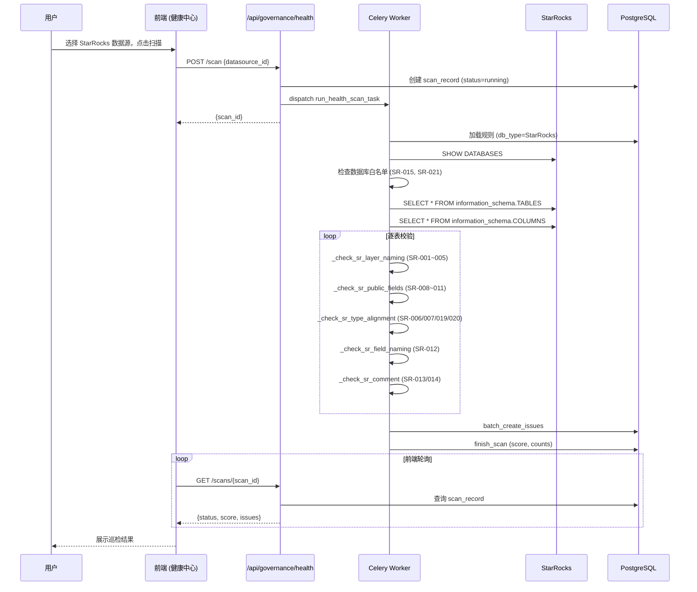

# StarRocks 数仓合规巡检技术规格书

> 版本：v1.0 | 状态：草稿 | 日期：2026-04-24 | 关联 PRD：无（内部治理需求）

---

## 1. 概述

### 1.1 目的

扩展 Mulan 现有健康扫描引擎，使其能连接 StarRocks 数据库，按《StarRocks 湖仓架构设计》规范对元数据进行合规巡检并输出违规报告。定位为**事后巡检 + 只读监控**，不拦截建表流程，不管理元数据，不做审批。

### 1.2 范围

| 包含 | 不包含 |
|------|--------|
| DatabaseConnector 支持 StarRocks 连接 | StarRocks DDL 语法解析（PARTITION BY / DISTRIBUTED BY） |
| 25 条 StarRocks 专属合规规则（种子数据） | 元数据 CRUD / 审批流 |
| DatabaseRulesAdapter 按 db_type 过滤规则 | 旧数仓（MySQL/SQL Server）治理 |
| TableInfo 注入 database 上下文 | 迁移进度追踪 |
| 健康中心增加「数仓合规」Tab | 新建独立巡检模块 |
| 基于 INFORMATION_SCHEMA 的只读检查 | ALTER TABLE 自动修复建议生成 |

### 1.3 关联文档

| 文档 | 路径 | 关系 |
|------|------|------|
| DDL 合规检查 | docs/specs/06-ddl-compliance-spec.md | 上游：规则引擎 + 校验器 |
| 数仓健康扫描 | docs/specs/11-health-scan-spec.md | 上游：扫描流程 + 存储模型 |
| 数据源管理 | docs/specs/05-datasource-management-spec.md | 上游：StarRocks 数据源注册 |
| StarRocks 湖仓架构设计 | 外部文档 | 规则来源 |

---

## 2. 数据模型

### 2.1 无新表

本 Spec 不创建新表。所有数据复用现有模型：

| 表 | 用途 |
|------|------|
| `bi_rule_configs` | 新增 25 条 `db_type='StarRocks'` 规则种子 |
| `bi_health_scan_records` | 扫描记录（已有 `db_type` 列） |
| `bi_health_scan_issues` | 巡检违规项 |

### 2.2 bi_rule_configs 种子数据扩展

新增 25 条规则，`rule_id` 使用 `RULE_SR_001` ~ `RULE_SR_025` 前缀，`db_type = 'StarRocks'`。

#### Tier 1 规则（15 条，HIGH 优先级，INFORMATION_SCHEMA 可查）

| rule_id | name | level | category | scene_type | config_json 要点 |
|---------|------|-------|----------|------------|-----------------|
| RULE_SR_001 | ODS 双下划线命名 | HIGH | sr_layer_naming | ODS | `{"pattern": "^[a-z]+__[a-z0-9_]+__[a-z0-9_]+$", "databases": ["ods_db","ods_api","ods_log"]}` |
| RULE_SR_002 | DWD 业务域+粒度后缀 | HIGH | sr_layer_naming | DWD | `{"pattern": "^(sales|finance|supply|hr|market|risk|ops|product|ai)_.*_(di|df|hi|rt)$", "databases": ["dwd"]}` |
| RULE_SR_003 | DIM 无业务域前缀 | HIGH | sr_layer_naming | ALL | `{"forbidden_prefixes": ["sales_","finance_","supply_","hr_","market_","risk_","ops_","product_","ai_"], "databases": ["dim"]}` |
| RULE_SR_004 | DWS 粒度后缀 | HIGH | sr_layer_naming | ALL | `{"pattern": "_(1d|1h|1m|rt)$", "databases": ["dws"]}` |
| RULE_SR_005 | ADS 场景前缀 | HIGH | sr_layer_naming | ALL | `{"pattern": "^(board|report|api|ai|tag|label)_", "databases": ["ads"]}` |
| RULE_SR_006 | 金额字段必须 DECIMAL | HIGH | sr_type_alignment | ALL | `{"suffixes": ["_amt","_amount"], "required_type": "DECIMAL", "forbidden_types": ["FLOAT","DOUBLE"]}` |
| RULE_SR_007 | 日期字段禁止 VARCHAR | HIGH | sr_type_alignment | ALL | `{"suffixes": ["_time","_at","_dt"], "required_types": ["DATETIME","DATE","TIMESTAMP"], "forbidden_types": ["VARCHAR","CHAR","STRING"]}` |
| RULE_SR_008 | 公共字段 etl_time | HIGH | sr_public_fields | ALL | `{"required_fields": [{"name": "etl_time", "type": "DATETIME"}], "databases": "__all__"}` |
| RULE_SR_009 | 公共字段 dt | HIGH | sr_public_fields | ALL | `{"required_fields": [{"name": "dt", "type": "DATE"}], "databases": ["ods_db","ods_api","ods_log","dwd","dws","dm"]}` |
| RULE_SR_010 | ODS 全套公共字段 | HIGH | sr_public_fields | ODS | `{"required_fields": [{"name":"etl_batch_id","type":"VARCHAR"},{"name":"src_system","type":"VARCHAR"},{"name":"src_table","type":"VARCHAR"},{"name":"is_deleted","type":"TINYINT"}], "databases": ["ods_db","ods_api","ods_log"]}` |
| RULE_SR_011 | ODS_DB CDC 字段 | HIGH | sr_public_fields | ODS | `{"required_fields": [{"name":"src_op","type":"VARCHAR"},{"name":"src_ts","type":"DATETIME"}], "databases": ["ods_db"]}` |
| RULE_SR_012 | 字段 snake_case | HIGH | sr_field_naming | ALL | `{"pattern": "^[a-z][a-z0-9_]*$", "max_length": 40}` |
| RULE_SR_013 | 字段注释覆盖率 | HIGH | sr_comment | ALL | `{"min_coverage": 1.0}` |
| RULE_SR_014 | 表注释存在 | HIGH | sr_comment | ALL | `{}` |
| RULE_SR_015 | 禁止额外数据库 | HIGH | sr_database_whitelist | ALL | `{"allowed": ["ods_db","ods_api","ods_log","dwd","dim","dws","dm","ads","feature","ai","sandbox","tmp","ops","meta","backup","information_schema","_statistics_"]}` |

#### Tier 2 规则（10 条，HIGH/MEDIUM，扩展检查）

| rule_id | name | level | category | scene_type | config_json 要点 |
|---------|------|-------|----------|------------|-----------------|
| RULE_SR_016 | Feature 表命名 | MEDIUM | sr_layer_naming | ALL | `{"pattern": "_features_(1d|1h|rt|[0-9]+[dhm])$", "databases": ["feature"]}` |
| RULE_SR_017 | AI 表前缀 | MEDIUM | sr_layer_naming | ALL | `{"pattern": "^(kb|llm|agent|text2sql)_", "databases": ["ai"]}` |
| RULE_SR_018 | Backup 命名含日期 | MEDIUM | sr_layer_naming | ALL | `{"pattern": "__.*_\\d{8}$", "databases": ["backup"]}` |
| RULE_SR_019 | 数量字段类型 | HIGH | sr_type_alignment | ALL | `{"suffixes": ["_qty","_cnt"], "required_types": ["BIGINT","DECIMAL","INT"], "forbidden_types": ["FLOAT","DOUBLE"]}` |
| RULE_SR_020 | 比率字段类型 | HIGH | sr_type_alignment | ALL | `{"suffixes": ["_rate"], "required_type": "DECIMAL", "forbidden_types": ["FLOAT","DOUBLE"]}` |
| RULE_SR_021 | 无 ods_hive 库 | HIGH | sr_database_whitelist | ALL | `{"forbidden": ["ods_hive"]}` |
| RULE_SR_022 | 表名无中文 | HIGH | sr_table_naming | ALL | `{"pattern_forbidden": "[\\u4e00-\\u9fff]"}` |
| RULE_SR_023 | 表名无版本号 | MEDIUM | sr_table_naming | ALL | `{"pattern_forbidden": "_v\\d+"}` |
| RULE_SR_024 | DM 部门前缀 | MEDIUM | sr_layer_naming | ALL | `{"pattern": "^[a-z][a-z0-9_]+$", "databases": ["dm"]}` |
| RULE_SR_025 | 视图命名 _vw 后缀 | MEDIUM | sr_view_naming | ALL | `{"pattern": "_vw$"}` |

### 2.3 TableInfo 扩展

`backend/services/ddl_checker/parser.py` 中 `TableInfo` dataclass 新增字段：

```python
@dataclass
class TableInfo:
    # ... 现有字段不变
    database: str = ""  # 新增：所属数据库名，巡检时由 DDLScanner 填入
```

---

## 3. API 设计

### 3.1 无新端点

本 Spec 不新增 API 端点。StarRocks 巡检复用现有健康扫描 API：

| 方法 | 路径 | 说明 | 变化 |
|------|------|------|------|
| POST | `/api/governance/health/scan` | 触发扫描 | 无变化；传入 StarRocks 数据源 ID 即触发合规巡检 |
| GET | `/api/governance/health/scans/{id}` | 查看扫描 | 无变化 |
| GET | `/api/governance/health/scans/{id}/issues` | 查看违规 | 无变化；issue_type 含新的 `sr_*` 类型 |
| GET | `/api/governance/health/summary` | 总览 | 无变化；StarRocks 数据源自动出现 |
| GET | `/api/ddl/rules` | 规则列表 | 返回含 StarRocks 规则 |

### 3.2 issue_type 新增值

`bi_health_scan_issues.issue_type` 新增以下值（与 `bi_rule_configs.category` 对应）：

| issue_type | 说明 |
|------------|------|
| `sr_layer_naming` | 分层命名不合规 |
| `sr_type_alignment` | 字段类型与后缀不匹配 |
| `sr_public_fields` | 公共字段缺失 |
| `sr_field_naming` | 字段命名不合规 |
| `sr_comment` | 注释缺失 |
| `sr_database_whitelist` | 非法数据库 |
| `sr_table_naming` | 表名含中文/版本号 |
| `sr_view_naming` | 视图命名不合规 |

---

## 4. 业务逻辑

### 4.1 巡检触发流程

与现有健康扫描完全相同。用户在前端选择 StarRocks 数据源 → 触发扫描 → Celery 异步执行 → 结果写入 DB → 前端轮询展示。

唯一差异：`DDLValidator` 根据 `db_type='StarRocks'` 加载 StarRocks 专属规则。

### 4.2 规则加载（修复 db_type 过滤）

**当前 Bug**：`DatabaseRulesAdapter._load_rules()` 调用 `db.get_all()` 加载全部已启用规则，不按 `db_type` 过滤。

**修复**：在过滤 `enabled=True` 之后，追加 `db_type` 过滤：

```python
# validator.py _load_rules() 内
rules_list = [r for r in rules_list
              if r.db_type.lower() in (self.db_type.lower(), "all")]
```

### 4.3 数据库上下文注入

**问题**：现有 `TableValidator.validate(table)` 不知道表属于哪个数据库，无法按分层选择命名 regex。

**方案**：
1. `DDLScanner.scan_all_tables()` 从 `self.connector.config["database"]` 获取数据库名
2. `DDLScanner._read_table_info()` 将其赋值给 `TableInfo.database`
3. StarRocks 检查方法通过 `table.database` 判断当前分层

### 4.4 StarRocks 检查方法设计

在 `TableValidator` 中新增 8 个方法，仅当 `db_type='StarRocks'` 时启用：

#### `_check_sr_layer_naming(table: TableInfo) -> List[Violation]`

```
输入：table.name, table.database
逻辑：
  1. 从 config_json 中获取当前 database 对应的 regex pattern
  2. 匹配 SR-001~005, SR-016~018, SR-024 中适用的规则
  3. 不匹配 → 产生 Violation(level=rule.level, message=描述+建议)
输出：violations 列表
```

#### `_check_sr_public_fields(table: TableInfo) -> List[Violation]`

```
输入：table.columns (名称列表), table.database
逻辑：
  1. 根据 database 确定必需公共字段集合（SR-008~011）
  2. 对比 table.columns 检查是否存在
  3. 缺失 → Violation(HIGH, "缺少公共字段 {field}")
输出：violations 列表
```

#### `_check_sr_table_naming(table: TableInfo) -> List[Violation]`

```
输入：table.name
逻辑：
  1. 匹配 SR-022：表名含中文 → Violation(HIGH)
  2. 匹配 SR-023：表名含版本号 _v\d+ → Violation(MEDIUM)
输出：violations 列表
```

#### `_check_sr_comment(table: TableInfo) -> List[Violation]`

```
输入：table.comment, table.columns[*].comment
逻辑：
  1. 匹配 SR-014：表注释为空 → Violation(HIGH)
  2. 匹配 SR-013：字段注释覆盖率 < min_coverage → Violation(HIGH)
输出：violations 列表
```

#### `_check_sr_field_naming(table: TableInfo) -> List[Violation]`

```
输入：table.columns[*].name
逻辑：
  1. 匹配 SR-012：字段名不符合 ^[a-z][a-z0-9_]*$，或长度 > 40 → Violation(HIGH)
输出：violations 列表
```

#### `_check_sr_database_whitelist(databases: List[str]) -> List[Violation]`

```
输入：当前 StarRocks 实例的全部数据库名列表
逻辑：
  1. 比对 SR-015 允许列表（13 业务库 + 系统库）
  2. 检查 SR-021 禁止的 ods_hive
  3. 不在白名单 → Violation(HIGH)
输出：violations 列表
特殊：此方法在 scan 级别执行一次，非逐表执行
```

#### ColumnValidator: `_check_sr_type_alignment(column, table) -> List[Violation]`

```
输入：column.name, column.type, table.database_name
逻辑：
  1. 按后缀匹配规则（SR-006/007/019/020）
  2. _amt → 必须 DECIMAL，禁止 FLOAT/DOUBLE
  3. _time/_at → 必须 DATETIME/DATE，禁止 VARCHAR
  4. _qty/_cnt → 必须 BIGINT/DECIMAL，禁止 FLOAT
  5. _rate → 必须 DECIMAL，禁止 FLOAT
输出：violations 列表
```

#### `_check_sr_view_naming(table: TableInfo) -> List[Violation]`

```
输入：table.name, table.table_type
逻辑：
  1. 仅对 table_type='VIEW' 的对象执行
  2. 匹配 SR-025：视图名不以 _vw 结尾 → Violation(MEDIUM)
输出：violations 列表
```

### 4.5 RULE_CATEGORY_MAP 重构

**当前问题**：`RULE_CATEGORY_MAP` 是 `{category: rule_id}` 的 1:1 静态字典，不支持同 category 多 db_type。

**方案**：StarRocks 规则使用独立的 `sr_*` category 前缀，不与现有 MySQL category 冲突。检查方法直接按 `sr_*` category 查找规则，不经过 `RULE_CATEGORY_MAP`。

新增规则查找方式：

```python
def _find_sr_rules_by_category(self, category: str) -> List[dict]:
    """查找指定 category 的所有 StarRocks 规则"""
    return [r for r in self.rules if r["category"] == category]
```

### 4.6 评分

复用现有 `HealthScanEngine` 评分公式：`health_score = max(0, 100 - high*5 - medium*2 - low*0.5)`。

StarRocks 规则产生的 violations 与 MySQL 规则使用相同的 severity 映射：
- `ViolationLevel.ERROR` → `high`
- `ViolationLevel.WARNING` → `medium`
- `ViolationLevel.INFO` → `low`

### 4.7 DatabaseConnector StarRocks 支持

`_build_connection_string()` 新增 `"starrocks"` 分支：

```python
elif db_type == "starrocks":
    port = self.config.get("port", 9030)
    return f"mysql+pymysql://{user}:{password}@{host}:{port}/{database}"
```

`connect()` 中 `connect_timeout` 适用于 StarRocks：

```python
if db_type in ("mysql", "postgresql", "starrocks"):
    connect_args["connect_timeout"] = 10
```

`get_table_comment()` / `get_column_comment()` 需同时匹配 `"starrocks"`：

```python
if self.config.get("db_type") in ("mysql", "starrocks"):
```

---

## 5. 错误码

| 错误码 | HTTP | 说明 | 触发条件 |
|--------|------|------|---------|
| HS_001 | 404 | 数据源不存在 | 已有 |
| HS_002 | 500 | 扫描执行失败 | 已有 |
| DDL_010 | 400 | 不支持的数据库类型 | `db_type` 不在支持列表 — 本次加入 `starrocks` 后不再触发 |

不新增错误码。

---

## 6. 安全

### 6.1 角色权限矩阵

| 操作 | admin | data_admin | analyst | user |
|------|-------|-----------|---------|------|
| 触发 StarRocks 扫描 | Y | Y | N | N |
| 查看扫描结果 | Y | Y | Y | N |
| 查看/管理规则 | Y | Y | N | N |
| 导出报告 | Y | Y | Y | N |

与现有健康扫描权限完全一致，无变化。

### 6.2 安全约束

- StarRocks 连接凭证使用 Fernet 加密存储（复用 `bi_data_sources.password_encrypted`）
- 扫描为只读操作，仅执行 `SELECT` 查询 INFORMATION_SCHEMA
- 连接超时 10 秒，防止黑洞 IP

---

## 7. 集成点

### 7.1 上游依赖

| 模块 | 接口 | 用途 |
|------|------|------|
| 数据源管理 (Spec 05) | `DataSourceDatabase.get()` | 获取 StarRocks 连接信息 |
| DDL 合规检查 (Spec 06) | `DDLValidator`, `DatabaseRulesAdapter`, `DDLScanner` | 校验引擎核心 |
| 健康扫描 (Spec 11) | `HealthScanEngine`, `HealthScanDatabase` | 扫描编排 + 结果存储 |

### 7.2 下游消费者

| 模块 | 消费方式 | 说明 |
|------|---------|------|
| 前端健康中心 | REST API 轮询 | 展示巡检结果 |

### 7.3 无事件发射

---

## 8. 时序图



---

## 9. 测试策略

### 9.1 关键场景

| # | 场景 | 预期 | 优先级 |
|---|------|------|--------|
| 1 | StarRocks 数据源扫描触发 | scan_record 创建，Celery 任务 dispatch 成功 | P0 |
| 2 | ODS 表名不含双下划线 | SR-001 HIGH 违规 | P0 |
| 3 | DWD 表名无粒度后缀 | SR-002 HIGH 违规 | P0 |
| 4 | 金额字段用 FLOAT | SR-006 HIGH 违规 | P0 |
| 5 | 日期字段用 VARCHAR | SR-007 HIGH 违规 | P0 |
| 6 | ODS 表缺少 etl_time | SR-008 HIGH 违规 | P0 |
| 7 | 存在 ods_hive 数据库 | SR-021 HIGH 违规 | P0 |
| 8 | MySQL 数据源扫描不触发 SR 规则 | db_type 过滤生效，zero SR violations | P0 |
| 9 | 全合规 StarRocks 表 | 0 violations, score=100 | P1 |
| 10 | 字段注释全为空 | SR-013 批量 HIGH 违规 | P1 |
| 11 | DIM 表名含业务域前缀 | SR-003 HIGH 违规 | P1 |
| 12 | ADS 表名无场景前缀 | SR-005 HIGH 违规 | P1 |
| 13 | 前端健康中心「数仓合规」Tab | Tab 可见，选择 StarRocks 数据源，触发扫描 | P1 |
| 14 | 表名含中文 | SR-022 HIGH 违规 | P2 |
| 15 | 表名含版本号 _v2 | SR-023 MEDIUM 违规 | P2 |

### 9.2 验收标准

- [ ] `DatabaseConnector` 支持 `db_type='starrocks'`，使用 `mysql+pymysql://` 协议连接
- [ ] `DatabaseRulesAdapter._load_rules()` 按 `db_type` 过滤规则，MySQL 扫描不加载 StarRocks 规则
- [ ] `TableInfo` 含 `database` 字段，`DDLScanner` 在扫描时正确填入
- [ ] 25 条 StarRocks 规则种子数据通过 `seed_defaults()` 幂等写入
- [ ] `_check_sr_layer_naming` 能根据 database 选择正确的命名 regex
- [ ] `_check_sr_public_fields` 能根据 database 确定必需字段集合
- [ ] `_check_sr_type_alignment` 检测 `_amt` 用 FLOAT 和 `_time` 用 VARCHAR 的违规
- [ ] `_check_sr_database_whitelist` 检测非法数据库
- [ ] 健康中心第 4 Tab「数仓合规」可见，预选 StarRocks 数据源
- [ ] `cd backend && pytest tests/ -x -q` 全通过
- [ ] `cd frontend && npm run type-check && npm run lint && npm test -- --run` 全通过

### 9.3 Mock 与测试约束

- **`DatabaseConnector.connect()`**：单元测试中 `patch('services.ddl_checker.connector.create_engine')` 返回 mock engine，避免真实 StarRocks 连接。集成测试可用 MySQL 容器替代（StarRocks 兼容 MySQL 协议）
- **`DatabaseRulesAdapter._load_rules()`**：mock `RuleCache.get_all()` 返回预构造的 StarRocks 规则列表，测试 db_type 过滤逻辑时必须同时包含 MySQL 和 StarRocks 规则
- **`TableInfo.database`**：测试用例中显式构造 `TableInfo(database="ods_db", ...)` 而非依赖 scanner 填入，确保 check 方法可独立测试
- **`_check_sr_database_whitelist`**：此方法为 scan 级别（非逐表），测试时直接传入 `["ods_db", "ods_hive"]` 等数据库名列表

---

## 10. 开放问题

| # | 问题 | 负责人 | 状态 |
|---|------|--------|------|
| 1 | StarRocks INFORMATION_SCHEMA 是否完全兼容 MySQL（特别是 COLUMN_COMMENT） | 待验证 | 待定 |
| 2 | 连接 StarRocks 多个数据库时是否需要逐库扫描（一个数据源=一个库） | architect | **已决议：一个数据源=一个库。** 遵循 Spec 05 数据源模型，每条 `bi_data_sources` 记录对应一个 `database` 字段。如需扫描多库，用户须注册多个数据源。`_check_sr_database_whitelist` 仅在首次 SHOW DATABASES 时对整个实例做一次校验。 |
| 3 | 视图/MV 巡检（SR-025）是否通过 `get_view_names()` 实现 | architect | 待定 |

---

## Change Budget

### 可修改文件

| 文件 | 允许改动 |
|------|---------|
| `backend/services/ddl_checker/connector.py` | 新增 starrocks 连接分支 |
| `backend/services/ddl_checker/validator.py` | 修复 db_type 过滤 + 新增 8 个 sr_* 检查方法 |
| `backend/services/ddl_checker/parser.py` | TableInfo 加 database_name 字段 |
| `backend/services/ddl_checker/scanner.py` | _read_table_info 填入 database_name |
| `backend/app/api/rules.py` | DEFAULT_RULES_SEED 追加 25 条 |
| `frontend/src/pages/data-governance/health-center/page.tsx` | 新增第 4 Tab |

### 禁止触碰

| 模块 | 原因 |
|------|------|
| `backend/services/health_scan/engine.py` | 扫描引擎不改，通过上游 validator 扩展能力 |
| `backend/services/health_scan/models.py` | 不新增列/表 |
| `backend/app/api/health_scan.py` | API 层不改 |
| `modules/ddl_check_engine/` | 独立模块，不参与 |
| 任何 Alembic 迁移 | 不涉及 schema 变更 |

---

## 开发交付约束

### 架构红线（违反 = PR 拒绝）

1. **services/ 层无 Web 框架依赖** — validator.py 不得 import FastAPI/Request
2. **SQL 安全性** — INFORMATION_SCHEMA 查询必须使用 `text()` + 参数绑定
3. **禁止 `os.environ`** — 配置通过 `get_settings` 获取
4. **前端 lazy 加载** — 新 Tab 页面组件必须 React.lazy

### SPEC 35 强制检查清单

- [ ] `connector.py` 中 StarRocks 使用 `mysql+pymysql://`，端口默认 9030
- [ ] `connector.py` 中 `get_table_comment` / `get_column_comment` 对 starrocks 生效
- [ ] `validator.py` 中 `_load_rules()` 追加 db_type 过滤（不破坏现有 MySQL 行为）
- [ ] StarRocks 规则 category 使用 `sr_*` 前缀，不污染现有 RULE_CATEGORY_MAP
- [ ] 种子数据 rule_id 使用 `RULE_SR_*` 前缀
- [ ] `config_json` 中的 regex 用架构设计文档正例/反例验证
- [ ] 前端文案全中文（"数仓合规"不是"Compliance"）

### 正确 / 错误示范

```python
# ❌ 错误：db_type 过滤忘记 lower()，导致 "StarRocks" != "starrocks"
rules_list = [r for r in rules_list if r.db_type == self.db_type]

# ✅ 正确：大小写不敏感匹配 + 支持 "all" 通配
rules_list = [r for r in rules_list
              if r.db_type.lower() in (self.db_type.lower(), "all")]

# ❌ 错误：使用 spec 旧字段名 database_name
table.database_name

# ✅ 正确：使用代码实际字段名 database
table.database

# ❌ 错误：在 validator.py 中 import FastAPI
from fastapi import Request

# ✅ 正确：services/ 层纯 Python，无 Web 框架依赖
from services.ddl_checker.parser import TableInfo
```

### 验证命令

```bash
# 后端
cd backend && python3 -m py_compile services/ddl_checker/connector.py
cd backend && python3 -m py_compile services/ddl_checker/validator.py
cd backend && pytest tests/ -x -q

# 前端
cd frontend && npm run type-check
cd frontend && npm run lint
cd frontend && npm test -- --run
```
