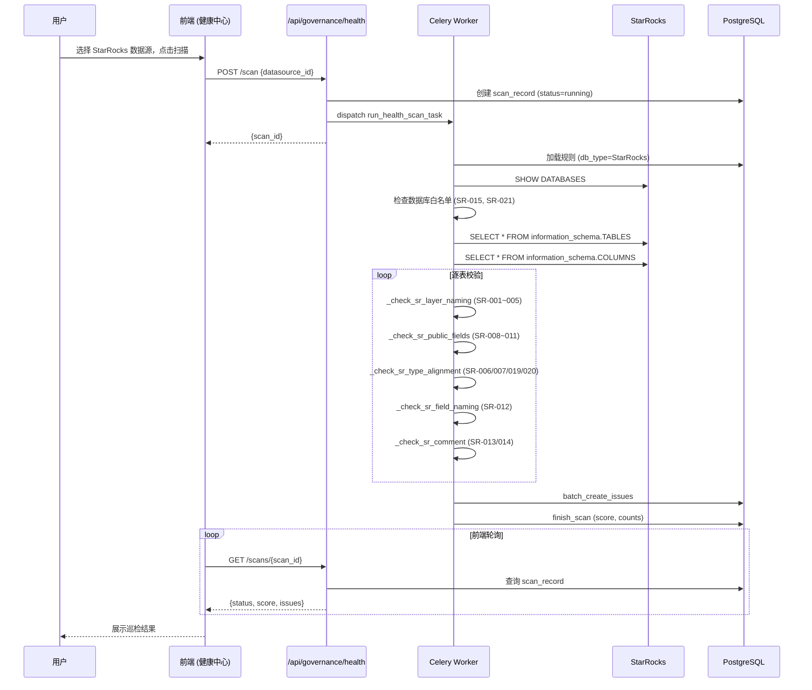

# StarRocks 数仓合规巡检技术规格书

> 版本：v1.0 | 状态：草稿 | 日期：2026-04-24 | 关联 PRD：无（内部治理需求）

---

## 1. 概述

### 1.1 目的

扩展 Mulan 现有健康扫描引擎，使其能连接 StarRocks 数据库，按《StarRocks 湖仓架构设计》规范对元数据进行合规巡检并输出违规报告。定位为**事后巡检 + 只读监控**，不拦截建表流程，不管理元数据，不做审批。

### 1.2 范围

| 包含 | 不包含 |
|------|--------|
| DatabaseConnector 支持 StarRocks 连接 | StarRocks DDL 语法解析（PARTITION BY / DISTRIBUTED BY） |
| 25 条 StarRocks 专属合规规则（种子数据） | 元数据 CRUD / 审批流 |
| DatabaseRulesAdapter 按 db_type 过滤规则 | 旧数仓（MySQL/SQL Server）治理 |
| TableInfo 注入 database 上下文 | 迁移进度追踪 |
| 健康中心增加「数仓合规」Tab | 新建独立巡检模块 |
| 基于 INFORMATION_SCHEMA 的只读检查 | ALTER TABLE 自动修复建议生成 |

### 1.3 关联文档

| 文档 | 路径 | 关系 |
|------|------|------|
| DDL 合规检查 | docs/specs/06-ddl-compliance-spec.md | 上游：规则引擎 + 校验器 |
| 数仓健康扫描 | docs/specs/11-health-scan-spec.md | 上游：扫描流程 + 存储模型 |
| 数据源管理 | docs/specs/05-datasource-management-spec.md | 上游：StarRocks 数据源注册 |
| StarRocks 湖仓架构设计 | 外部文档 | 规则来源 |

---

## 2. 数据模型

### 2.1 无新表

本 Spec 不创建新表。所有数据复用现有模型：

| 表 | 用途 |
|------|------|
| `bi_rule_configs` | 新增 25 条 `db_type='StarRocks'` 规则种子 |
| `bi_health_scan_records` | 扫描记录（已有 `db_type` 列） |
| `bi_health_scan_issues` | 巡检违规项 |

### 2.2 bi_rule_configs 种子数据扩展

新增 25 条规则，`rule_id` 使用 `RULE_SR_001` ~ `RULE_SR_025` 前缀，`db_type = 'StarRocks'`。

#### Tier 1 规则（15 条，HIGH 优先级，INFORMATION_SCHEMA 可查）

| rule_id | name | level | category | scene_type | config_json 要点 |
|---------|------|-------|----------|------------|-----------------|
| RULE_SR_001 | ODS 双下划线命名 | HIGH | sr_layer_naming | ODS | `{"pattern": "^[a-z]+__[a-z0-9_]+__[a-z0-9_]+$", "databases": ["ods_db","ods_api","ods_log"]}` |
| RULE_SR_002 | DWD 业务域+粒度后缀 | HIGH | sr_layer_naming | DWD | `{"pattern": "^(sales|finance|supply|hr|market|risk|ops|product|ai)_.*_(di|df|hi|rt)$", "databases": ["dwd"]}` |
| RULE_SR_003 | DIM 无业务域前缀 | HIGH | sr_layer_naming | ALL | `{"forbidden_prefixes": ["sales_","finance_","supply_","hr_","market_","risk_","ops_","product_","ai_"], "databases": ["dim"]}` |
| RULE_SR_004 | DWS 粒度后缀 | HIGH | sr_layer_naming | ALL | `{"pattern": "_(1d|1h|1m|rt)$", "databases": ["dws"]}` |
| RULE_SR_005 | ADS 场景前缀 | HIGH | sr_layer_naming | ALL | `{"pattern": "^(board|report|api|ai|tag|label)_", "databases": ["ads"]}` |
| RULE_SR_006 | 金额字段必须 DECIMAL | HIGH | sr_type_alignment | ALL | `{"suffixes": ["_amt","_amount"], "required_type": "DECIMAL", "forbidden_types": ["FLOAT","DOUBLE"]}` |
| RULE_SR_007 | 日期字段禁止 VARCHAR | HIGH | sr_type_alignment | ALL | `{"suffixes": ["_time","_at","_dt"], "required_types": ["DATETIME","DATE","TIMESTAMP"], "forbidden_types": ["VARCHAR","CHAR","STRING"]}` |
| RULE_SR_008 | 公共字段 etl_time | HIGH | sr_public_fields | ALL | `{"required_fields": [{"name": "etl_time", "type": "DATETIME"}], "databases": "__all__"}` |
| RULE_SR_009 | 公共字段 dt | HIGH | sr_public_fields | ALL | `{"required_fields": [{"name": "dt", "type": "DATE"}], "databases": ["ods_db","ods_api","ods_log","dwd","dws","dm"]}` |
| RULE_SR_010 | ODS 全套公共字段 | HIGH | sr_public_fields | ODS | `{"required_fields": [{"name":"etl_batch_id","type":"VARCHAR"},{"name":"src_system","type":"VARCHAR"},{"name":"src_table","type":"VARCHAR"},{"name":"is_deleted","type":"TINYINT"}], "databases": ["ods_db","ods_api","ods_log"]}` |
| RULE_SR_011 | ODS_DB CDC 字段 | HIGH | sr_public_fields | ODS | `{"required_fields": [{"name":"src_op","type":"VARCHAR"},{"name":"src_ts","type":"DATETIME"}], "databases": ["ods_db"]}` |
| RULE_SR_012 | 字段 snake_case | HIGH | sr_field_naming | ALL | `{"pattern": "^[a-z][a-z0-9_]*$", "max_length": 40}` |
| RULE_SR_013 | 字段注释覆盖率 | HIGH | sr_comment | ALL | `{"min_coverage": 1.0}` |
| RULE_SR_014 | 表注释存在 | HIGH | sr_comment | ALL | `{}` |
| RULE_SR_015 | 禁止额外数据库 | HIGH | sr_database_whitelist | ALL | `{"allowed": ["ods_db","ods_api","ods_log","dwd","dim","dws","dm","ads","feature","ai","sandbox","tmp","ops","meta","backup","information_schema","_statistics_"]}` |

#### Tier 2 规则（10 条，HIGH/MEDIUM，扩展检查）

| rule_id | name | level | category | scene_type | config_json 要点 |
|---------|------|-------|----------|------------|-----------------|
| RULE_SR_016 | Feature 表命名 | MEDIUM | sr_layer_naming | ALL | `{"pattern": "_features_(1d|1h|rt|[0-9]+[dhm])$", "databases": ["feature"]}` |
| RULE_SR_017 | AI 表前缀 | MEDIUM | sr_layer_naming | ALL | `{"pattern": "^(kb|llm|agent|text2sql)_", "databases": ["ai"]}` |
| RULE_SR_018 | Backup 命名含日期 | MEDIUM | sr_layer_naming | ALL | `{"pattern": "__.*_\\d{8}$", "databases": ["backup"]}` |
| RULE_SR_019 | 数量字段类型 | HIGH | sr_type_alignment | ALL | `{"suffixes": ["_qty","_cnt"], "required_types": ["BIGINT","DECIMAL","INT"], "forbidden_types": ["FLOAT","DOUBLE"]}` |
| RULE_SR_020 | 比率字段类型 | HIGH | sr_type_alignment | ALL | `{"suffixes": ["_rate"], "required_type": "DECIMAL", "forbidden_types": ["FLOAT","DOUBLE"]}` |
| RULE_SR_021 | 无 ods_hive 库 | HIGH | sr_database_whitelist | ALL | `{"forbidden": ["ods_hive"]}` |
| RULE_SR_022 | 表名无中文 | HIGH | sr_table_naming | ALL | `{"pattern_forbidden": "[\\u4e00-\\u9fff]"}` |
| RULE_SR_023 | 表名无版本号 | MEDIUM | sr_table_naming | ALL | `{"pattern_forbidden": "_v\\d+"}` |
| RULE_SR_024 | DM 部门前缀 | MEDIUM | sr_layer_naming | ALL | `{"pattern": "^[a-z][a-z0-9_]+$", "databases": ["dm"]}` |
| RULE_SR_025 | 视图命名 _vw 后缀 | MEDIUM | sr_view_naming | ALL | `{"pattern": "_vw$"}` |

### 2.4 SR 25 条合规规则清单（引擎级合规视图）

> 本节将 §2.2 的 25 条规则按"StarRocks 引擎合规维度"重新映射并定型，给出工程化清单。规则编号统一使用 `SR-<类别>-<序号>` 形式（与 §2.2 `RULE_SR_*` 一一对应，由种子数据 `meta_json.engine_rule_id` 字段维护映射）。**总数严格 25 条**：Schema 8 + 分区分桶 6 + 副本与一致性 4 + 性能 4 + 元数据 3 = 25。

#### 2.4.1 Schema 类（8 条）

| rule_id | 名称 | 严重级别 | 触发条件（一句话） | 默认阈值 | 修复指引（≤ 30 字） |
|---------|------|---------|-------------------|---------|--------------------|
| SR-SCH-001 | 主键表必须显式声明 PRIMARY KEY | critical | 表 KEYS_TYPE='PRIMARY_KEYS' 但 DDL 无 PRIMARY KEY 子句 | N/A | ALTER TABLE 重建并显式声明 PRIMARY KEY |
| SR-SCH-002 | 大宽表必须使用列存模型 | high | 列数 ≥ 200 且非列存（DUP/UNI/PRI/AGG 之外） | 列数 ≥ 200 | 重建为 DUPLICATE/PRIMARY KEY 列存表 |
| SR-SCH-003 | 时间字段必须使用 DATETIME 而非 VARCHAR | high | 列名后缀 _time/_at/_dt 但类型为 VARCHAR/CHAR/STRING | 后缀正则 `_(time|at|dt)$` | 改为 DATETIME，迁移期双写 |
| SR-SCH-004 | 分区列必须为 DATE/DATETIME/INT | critical | PARTITION 列类型不在 {DATE, DATETIME, INT, BIGINT} | 白名单 4 类 | 用合法类型重建分区 |
| SR-SCH-005 | 主键长度 ≤ 128 字节 | high | PRIMARY KEY 列 SUM(byte_length) > 128 | 128 byte | 缩短主键或改用代理键 |
| SR-SCH-006 | 表名 / 列名长度 ≤ 64 | medium | length(name) > 64 | 64 char | 改名遵循 snake_case 缩写 |
| SR-SCH-007 | 字符集统一为 utf8mb4 | medium | session/table charset != utf8mb4 | utf8mb4 | 通过 ADMIN SET CONFIG 调整 |
| SR-SCH-008 | 禁止 BLOB 字段 | high | 任意列类型 in {BLOB, MEDIUMBLOB, LONGBLOB} | 黑名单 | 改用对象存储 + url 列 |

#### 2.4.2 分区分桶类（6 条）

| rule_id | 名称 | 严重级别 | 触发条件 | 默认阈值 | 修复指引 |
|---------|------|---------|---------|---------|---------|
| SR-PART-001 | 单表分区数 ≤ 1000 | high | COUNT(partitions) > 1000 | 1000 | 启用动态分区 TTL，归档冷分区 |
| SR-PART-002 | 单分区数据量 1-10GB | medium | DataSize < 1GB 或 > 10GB | [1GB, 10GB] | 调粒度（日→月）或拆分桶 |
| SR-PART-003 | 分桶数 = 分区数据 / 1GB | high | bucket_num 不在 [1, 256] 或与 DataSize/1GB 偏差 > 50% | 1-256 | ALTER 重设 BUCKETS |
| SR-PART-004 | 分桶列必须为高基数列 | high | DISTINCT(bucket_col)/COUNT(*) < 0.1 | 基数比 ≥ 0.1 | 换更高基数列重建 |
| SR-BUCK-005 | 分桶列禁止为可空列 | critical | 分桶列 IS_NULLABLE='YES' | NOT NULL | 改为 NOT NULL 重建 |
| SR-PART-006 | 大表必须按时间分区 | high | DataSize > 100GB 且无 PARTITION BY | 100GB | 加 PARTITION BY date_trunc('day', dt) |

#### 2.4.3 副本与一致性（4 条）

| rule_id | 名称 | 严重级别 | 触发条件 | 默认阈值 | 修复指引 |
|---------|------|---------|---------|---------|---------|
| SR-REP-001 | 生产环境副本数 = 3 | critical | env=prod 且 ReplicationNum != 3 | 3 | ALTER TABLE SET("default.replication_num"="3") |
| SR-REP-002 | 测试环境副本数 ≥ 2 | high | env in {test,staging} 且 ReplicationNum < 2 | ≥ 2 | ALTER 调整 |
| SR-REP-003 | 副本均衡度 (max-min)/avg ≤ 0.1 | medium | (max-min)/avg > 0.1 | 0.1 | 触发 ADMIN REPAIR / 均衡 |
| SR-REP-004 | colocate group 内表副本布局一致 | high | 同一 colocate group 各表 bucket→BE 映射不一致 | 完全一致 | ADMIN SET 重新均衡 colocate group |

#### 2.4.4 性能类（4 条）

| rule_id | 名称 | 严重级别 | 触发条件 | 默认阈值 | 修复指引 |
|---------|------|---------|---------|---------|---------|
| SR-PERF-001 | 单表 Tablet 数 ≤ 30000 | high | COUNT(tablets) > 30000 | 30000 | 减少分区/分桶或合并冷分区 |
| SR-PERF-002 | 单 Tablet 大小 ≤ 5GB | high | MAX(tablet_size) > 5GB | 5GB | 增加 BUCKETS 拆 tablet |
| SR-PERF-003 | Compaction 累计待合并 < 100 | high | SUM(compaction_score) ≥ 100 | 100 | 排查导入频率，调 BE compaction 线程 |
| SR-PERF-004 | 慢查询比例 < 5%（rolling 24h） | medium | slow_query / total_query > 0.05（24h 滚动） | 5% | 排查热点 SQL，加物化视图/索引 |

#### 2.4.5 元数据类（3 条）

| rule_id | 名称 | 严重级别 | 触发条件 | 默认阈值 | 修复指引 |
|---------|------|---------|---------|---------|---------|
| SR-META-001 | 表必须有 COMMENT | high | table_comment IS NULL OR length=0 | 非空 | ALTER TABLE COMMENT '...' |
| SR-META-002 | 关键列必须有 COMMENT | high | 主键 / 分区列 / 分桶列 column_comment 为空 | 非空 | ALTER TABLE MODIFY COLUMN ... COMMENT '...' |
| SR-META-003 | 表 owner 必须设置 | medium | table_properties 缺少 owner / owner='' | 非空 | ALTER TABLE SET("owner"="<team>") |

> **规则总数校验：8 + 6 + 4 + 4 + 3 = 25**。新增 SR 规则必须同时更新本表与 §2.2 种子数据，并由 §11 强制清单第 8 项把关。

### 2.5 TableInfo 扩展（原 2.3）

`backend/services/ddl_checker/parser.py` 中 `TableInfo` dataclass 新增字段：

```python
@dataclass
class TableInfo:
    # ... 现有字段不变
    database: str = ""  # 新增：所属数据库名，巡检时由 DDLScanner 填入
```

---

## 3. API 设计

### 3.1 无新端点

本 Spec 不新增 API 端点。StarRocks 巡检复用现有健康扫描 API：

| 方法 | 路径 | 说明 | 变化 |
|------|------|------|------|
| POST | `/api/governance/health/scan` | 触发扫描 | 无变化；传入 StarRocks 数据源 ID 即触发合规巡检 |
| GET | `/api/governance/health/scans/{id}` | 查看扫描 | 无变化 |
| GET | `/api/governance/health/scans/{id}/issues` | 查看违规 | 无变化；issue_type 含新的 `sr_*` 类型 |
| GET | `/api/governance/health/summary` | 总览 | 无变化；StarRocks 数据源自动出现 |
| GET | `/api/ddl/rules` | 规则列表 | 返回含 StarRocks 规则 |

### 3.2 issue_type 新增值

`bi_health_scan_issues.issue_type` 新增以下值（与 `bi_rule_configs.category` 对应）：

| issue_type | 说明 |
|------------|------|
| `sr_layer_naming` | 分层命名不合规 |
| `sr_type_alignment` | 字段类型与后缀不匹配 |
| `sr_public_fields` | 公共字段缺失 |
| `sr_field_naming` | 字段命名不合规 |
| `sr_comment` | 注释缺失 |
| `sr_database_whitelist` | 非法数据库 |
| `sr_table_naming` | 表名含中文/版本号 |
| `sr_view_naming` | 视图命名不合规 |

---

## 4. 业务逻辑

### 4.1 巡检触发流程

与现有健康扫描完全相同。用户在前端选择 StarRocks 数据源 → 触发扫描 → Celery 异步执行 → 结果写入 DB → 前端轮询展示。

唯一差异：`DDLValidator` 根据 `db_type='StarRocks'` 加载 StarRocks 专属规则。

### 4.2 规则加载（修复 db_type 过滤）

**当前 Bug**：`DatabaseRulesAdapter._load_rules()` 调用 `db.get_all()` 加载全部已启用规则，不按 `db_type` 过滤。

**修复**：在过滤 `enabled=True` 之后，追加 `db_type` 过滤：

```python
# validator.py _load_rules() 内
rules_list = [r for r in rules_list
              if r.db_type.lower() in (self.db_type.lower(), "all")]
```

### 4.3 数据库上下文注入

**问题**：现有 `TableValidator.validate(table)` 不知道表属于哪个数据库，无法按分层选择命名 regex。

**方案**：
1. `DDLScanner.scan_all_tables()` 从 `self.connector.config["database"]` 获取数据库名
2. `DDLScanner._read_table_info()` 将其赋值给 `TableInfo.database`
3. StarRocks 检查方法通过 `table.database` 判断当前分层

### 4.4 StarRocks 检查方法设计

在 `TableValidator` 中新增 8 个方法，仅当 `db_type='StarRocks'` 时启用：

#### `_check_sr_layer_naming(table: TableInfo) -> List[Violation]`

```
输入：table.name, table.database
逻辑：
  1. 从 config_json 中获取当前 database 对应的 regex pattern
  2. 匹配 SR-001~005, SR-016~018, SR-024 中适用的规则
  3. 不匹配 → 产生 Violation(level=rule.level, message=描述+建议)
输出：violations 列表
```

#### `_check_sr_public_fields(table: TableInfo) -> List[Violation]`

```
输入：table.columns (名称列表), table.database
逻辑：
  1. 根据 database 确定必需公共字段集合（SR-008~011）
  2. 对比 table.columns 检查是否存在
  3. 缺失 → Violation(HIGH, "缺少公共字段 {field}")
输出：violations 列表
```

#### `_check_sr_table_naming(table: TableInfo) -> List[Violation]`

```
输入：table.name
逻辑：
  1. 匹配 SR-022：表名含中文 → Violation(HIGH)
  2. 匹配 SR-023：表名含版本号 _v\d+ → Violation(MEDIUM)
输出：violations 列表
```

#### `_check_sr_comment(table: TableInfo) -> List[Violation]`

```
输入：table.comment, table.columns[*].comment
逻辑：
  1. 匹配 SR-014：表注释为空 → Violation(HIGH)
  2. 匹配 SR-013：字段注释覆盖率 < min_coverage → Violation(HIGH)
输出：violations 列表
```

#### `_check_sr_field_naming(table: TableInfo) -> List[Violation]`

```
输入：table.columns[*].name
逻辑：
  1. 匹配 SR-012：字段名不符合 ^[a-z][a-z0-9_]*$，或长度 > 40 → Violation(HIGH)
输出：violations 列表
```

#### `_check_sr_database_whitelist(databases: List[str]) -> List[Violation]`

```
输入：当前 StarRocks 实例的全部数据库名列表
逻辑：
  1. 比对 SR-015 允许列表（13 业务库 + 系统库）
  2. 检查 SR-021 禁止的 ods_hive
  3. 不在白名单 → Violation(HIGH)
输出：violations 列表
特殊：此方法在 scan 级别执行一次，非逐表执行
```

#### ColumnValidator: `_check_sr_type_alignment(column, table) -> List[Violation]`

```
输入：column.name, column.type, table.database_name
逻辑：
  1. 按后缀匹配规则（SR-006/007/019/020）
  2. _amt → 必须 DECIMAL，禁止 FLOAT/DOUBLE
  3. _time/_at → 必须 DATETIME/DATE，禁止 VARCHAR
  4. _qty/_cnt → 必须 BIGINT/DECIMAL，禁止 FLOAT
  5. _rate → 必须 DECIMAL，禁止 FLOAT
输出：violations 列表
```

#### `_check_sr_view_naming(table: TableInfo) -> List[Violation]`

```
输入：table.name, table.table_type
逻辑：
  1. 仅对 table_type='VIEW' 的对象执行
  2. 匹配 SR-025：视图名不以 _vw 结尾 → Violation(MEDIUM)
输出：violations 列表
```

### 4.5 RULE_CATEGORY_MAP 重构

**当前问题**：`RULE_CATEGORY_MAP` 是 `{category: rule_id}` 的 1:1 静态字典，不支持同 category 多 db_type。

**方案**：StarRocks 规则使用独立的 `sr_*` category 前缀，不与现有 MySQL category 冲突。检查方法直接按 `sr_*` category 查找规则，不经过 `RULE_CATEGORY_MAP`。

新增规则查找方式：

```python
def _find_sr_rules_by_category(self, category: str) -> List[dict]:
    """查找指定 category 的所有 StarRocks 规则"""
    return [r for r in self.rules if r["category"] == category]
```

### 4.6 评分

复用现有 `HealthScanEngine` 评分公式：`health_score = max(0, 100 - high*5 - medium*2 - low*0.5)`。

StarRocks 规则产生的 violations 与 MySQL 规则使用相同的 severity 映射：
- `ViolationLevel.ERROR` → `high`
- `ViolationLevel.WARNING` → `medium`
- `ViolationLevel.INFO` → `low`

### 4.7 DatabaseConnector StarRocks 支持

`_build_connection_string()` 新增 `"starrocks"` 分支：

```python
elif db_type == "starrocks":
    port = self.config.get("port", 9030)
    return f"mysql+pymysql://{user}:{password}@{host}:{port}/{database}"
```

`connect()` 中 `connect_timeout` 适用于 StarRocks：

```python
if db_type in ("mysql", "postgresql", "starrocks"):
    connect_args["connect_timeout"] = 10
```

`get_table_comment()` / `get_column_comment()` 需同时匹配 `"starrocks"`：

```python
if self.config.get("db_type") in ("mysql", "starrocks"):
```

### 4.8 规则检查 SQL 模板

> 占位符约定：`{database}` = StarRocks 库名，`{table}` = 表名，`{bucket_col}` = 分桶列名。所有模板必须经 `text()` + 参数绑定执行（不允许字符串拼接）。每条返回结构统一为 `{passed: bool, actual: any, expected: any, message: str}`，由 validator 在 Python 侧组装。

#### SR-PART-001 单表分区数

```sql
SELECT COUNT(*) AS partition_cnt
FROM information_schema.partitions
WHERE table_schema = :database AND table_name = :table;
```
- **期望返回**：`{passed: partition_cnt <= 1000, actual: partition_cnt, expected: "<= 1000", message: "分区数 {actual} 超阈值 1000"}`
- **性能注意**：`information_schema.partitions` 全实例聚合，单次扫描 O(全部表)。**必须按 `(database, table)` 维度缓存 5 分钟**，scan run 内复用。

#### SR-PART-002 单分区大小

```sql
SHOW PARTITIONS FROM `{database}`.`{table}`;
```
- **解析字段**：`DataSize`（字符串如 `"3.2 GB"`，需 Python 端归一为字节）
- **期望返回**：`{passed: 1GB <= max_size <= 10GB, actual: max_size_bytes, expected: "[1GB, 10GB]", message: "存在分区 size={actual} 越界"}`
- **性能注意**：`SHOW PARTITIONS` 无法用 `text()` 参数化，必须用白名单校验 `{database}/{table}` 后再拼接（防 SQL 注入）。

#### SR-REP-001 副本数

```sql
SHOW PARTITIONS FROM `{database}`.`{table}`;
```
- **解析字段**：`ReplicationNum`（int）
- **期望返回**：`{passed: all(rep == 3), actual: distinct_rep_set, expected: 3, message: "存在分区副本数 {actual}"}`
- **性能注意**：与 SR-PART-002 共用一次 `SHOW PARTITIONS` 输出，validator 一次解析多规则。

#### SR-PERF-001 Tablet 数

```sql
SELECT COUNT(*) AS tablet_cnt
FROM information_schema.tablets
WHERE database_name = :database AND table_name = :table;
```
- **期望返回**：`{passed: tablet_cnt <= 30000, actual: tablet_cnt, expected: "<= 30000", message: "Tablet 数 {actual} 超阈值"}`
- **性能注意**：`information_schema.tablets` 行级开销大，巡检建议批量 `WHERE database_name = :database GROUP BY table_name`，per-database 一次拉齐全表。

#### SR-PERF-003 Compaction 累计

```sql
-- Step 1：拿到所有 BE
SHOW PROC '/backends';
-- Step 2：对目标表查 tablet compaction score（StarRocks 3.x）
SHOW PROC '/dbs/{db_id}/{table_id}/partitions/{partition_id}/{index_id}';
```
- **解析字段**：每行 `CompactionScore`，求和与 max
- **期望返回**：`{passed: sum_score < 100, actual: sum_score, expected: "< 100", message: "Compaction 待合并 {actual}"}`
- **性能注意**：需要先拿 db_id/table_id（来自 `information_schema.tables_config`），整个流程为多次 RPC，**每个 scan run 限频 1 次/分钟**，结果落 `bi_health_scan_records.metrics_json`。

#### SR-META-001 表注释

```sql
SELECT table_comment
FROM information_schema.tables
WHERE table_schema = :database AND table_name = :table;
```
- **期望返回**：`{passed: table_comment IS NOT NULL AND length > 0, actual: table_comment, expected: "non-empty", message: "表 {database}.{table} 缺少 COMMENT"}`
- **性能注意**：可与扫表流程的 `SELECT * FROM information_schema.tables WHERE table_schema = :database` 合并（一次拉全部表）。

#### SR-SCH-001 主键

```sql
SHOW CREATE TABLE `{database}`.`{table}`;
```
- **解析**：取返回的 DDL 文本，正则 `PRIMARY\s+KEY\s*\(([^)]+)\)`；同时从 `information_schema.tables_config.TABLE_MODEL` 判断是否 `PRIMARY_KEYS`。
- **期望返回**：`{passed: model != PRIMARY_KEYS OR has_pk_clause, actual: {model, has_pk_clause}, expected: "PRIMARY_KEYS ⇒ has_pk_clause=true", message: "主键模型表缺少 PRIMARY KEY 子句"}`
- **性能注意**：`SHOW CREATE TABLE` 不能 `WHERE` 过滤，必须逐表执行，**强制走表名白名单校验后拼接**。

#### SR-SCH-004 分区列类型

```sql
SELECT c.column_name, c.data_type
FROM information_schema.columns c
JOIN information_schema.partitions p
  ON c.table_schema = p.table_schema AND c.table_name = p.table_name
WHERE c.table_schema = :database
  AND c.table_name = :table
  AND FIND_IN_SET(c.column_name, p.partition_key) > 0;
```
- **期望返回**：`{passed: all(data_type in ['DATE','DATETIME','INT','BIGINT']), actual: [(col, type), ...], expected: "DATE/DATETIME/INT/BIGINT", message: "分区列 {col} 类型 {type} 非法"}`
- **性能注意**：单表 JOIN 廉价；批量巡检时按 `:database` 一次性拉所有表的分区列（去掉 `:table` 条件）后在 Python 端分组。

> **缓存策略**：在 `validator.py` 中以 `(scan_id, database, query_kind)` 为 key 维护内存缓存（TTL=scan run 生命周期），避免同一规则集对同一表重复发起 `information_schema.*` 查询。

### 4.9 DatabaseRulesAdapter 过滤契约

#### 接口签名

```python
class DatabaseRulesAdapter:
    def get_rules_for(self, db_type: str) -> list[Rule]: ...
```

#### 输入

| 字段 | 类型 | 说明 |
|------|------|------|
| `db_type` | `str` | 取自 connection 配置，规范化为小写；`'starrocks'` 触发 SR 规则集 |
| `connection_id` | `int`（构造期） | adapter 实例化时绑定，用于错误信息回填 |

#### 输出

- `db_type='starrocks'` ⇒ 仅返回 `rule_id LIKE 'SR-%'`（即 §2.4 全部 25 条）+ `db_type='all'` 的通用规则
- `db_type='postgresql'` ⇒ 仅返回 `rule_id LIKE 'PG-%'` + `'all'`
- `db_type='mysql'` ⇒ 仅返回 `rule_id LIKE 'RULE_%'`（兼容存量）+ `'all'`
- 输出顺序：`level=critical → high → medium → low`，同级按 `rule_id` 字典序

#### 错误

| 错误码 | 触发 | HTTP | 说明 |
|--------|------|------|------|
| `SR_ADAPT_001` | connection.db_type 不在已支持列表，但调用方仍传入了 `'starrocks'` | 400 | "connection #{id} 类型不是 starrocks，无法加载 SR 规则" |

#### 实现红线

- **不在 adapter 内做 SQL 调用**——规则来自 `RuleCache`/`bi_rule_configs`，纯内存过滤。
- 过滤后 `len(rules) == 0` 不算错误（说明该 db_type 暂无启用规则），返回空列表 + WARN 日志。
- 同一 adapter 实例必须可对不同 `db_type` 多次调用并返回稳定结果（无副作用）。

### 4.10 TableInfo.database 注入契约

#### 契约

巡检引擎 `DDLScanner.scan_all_tables()` 在构造每个 `TableInfo` 时**必须**填充 `database` 字段，来源优先级：

1. `connection.config["database"]`（数据源注册时的库名，单数据源=单库，见 §10 #2 决议）
2. `information_schema.tables.table_schema`（兜底，确保多库扫描场景仍能拿到正确 schema）
3. 上述两者均缺失 ⇒ 抛 `SR_ADAPT_002`

#### 错误

| 错误码 | 触发 | HTTP | 说明 |
|--------|------|------|------|
| `SR_ADAPT_002` | `TableInfo.database` 为空字符串或 None，但本次 scan db_type='starrocks' | 500 | "TableInfo.database 注入缺失，scan abort（避免误判）" |

#### 失败优先策略

- **缺失即失败，不允许降级**：SR 规则中 SR-001/008/009/010/011/015/021 等都依赖 `database` 判定分层。注入缺失时若继续运行 → 误判全表（误报或漏报）危险性高于直接失败。
- 失败动作：`HealthScanEngine` 捕获 `SR_ADAPT_002` 后将 `scan_record.status='failed'`，写入 `error_message`，**不写任何 issues**。

#### 测试 P0

- 构造 `TableInfo(name='ods_db__crm__user', database='')`，调用 `_check_sr_layer_naming` ⇒ 必须抛 `SR_ADAPT_002`，**不得**被静默吞掉而误判。

---

## 5. 错误码

| 错误码 | HTTP | 说明 | 触发条件 |
|--------|------|------|---------|
| HS_001 | 404 | 数据源不存在 | 已有 |
| HS_002 | 500 | 扫描执行失败 | 已有 |
| DDL_010 | 400 | 不支持的数据库类型 | `db_type` 不在支持列表 — 本次加入 `starrocks` 后不再触发 |
| SR_ADAPT_001 | 400 | connection 类型与请求 db_type 不匹配 | DatabaseRulesAdapter 收到 `'starrocks'` 但 connection 实际非 SR（见 §4.9） |
| SR_ADAPT_002 | 500 | TableInfo.database 注入缺失 | StarRocks 巡检遍历表时未注入 database 字段（见 §4.10） |

新增 2 个 SR 适配层错误码（`SR_ADAPT_001/002`），用于隔离 adapter 与 scanner 的契约违规，不与现有 `HS_*` / `DDL_*` 冲突。

---

## 6. 安全

### 6.1 角色权限矩阵

| 操作 | admin | data_admin | analyst | user |
|------|-------|-----------|---------|------|
| 触发 StarRocks 扫描 | Y | Y | N | N |
| 查看扫描结果 | Y | Y | Y | N |
| 查看/管理规则 | Y | Y | N | N |
| 导出报告 | Y | Y | Y | N |

与现有健康扫描权限完全一致，无变化。

### 6.2 安全约束

- StarRocks 连接凭证使用 Fernet 加密存储（复用 `bi_data_sources.password_encrypted`）
- 扫描为只读操作，仅执行 `SELECT` 查询 INFORMATION_SCHEMA
- 连接超时 10 秒，防止黑洞 IP

---

## 7. 集成点

### 7.1 上游依赖

| 模块 | 接口 | 用途 |
|------|------|------|
| 数据源管理 (Spec 05) | `DataSourceDatabase.get()` | 获取 StarRocks 连接信息 |
| DDL 合规检查 (Spec 06) | `DDLValidator`, `DatabaseRulesAdapter`, `DDLScanner` | 校验引擎核心 |
| 健康扫描 (Spec 11) | `HealthScanEngine`, `HealthScanDatabase` | 扫描编排 + 结果存储 |

### 7.2 下游消费者

| 模块 | 消费方式 | 说明 |
|------|---------|------|
| 前端健康中心 | REST API 轮询 | 展示巡检结果 |

### 7.3 无事件发射

---

## 8. 时序图



---

## 9. 测试策略

### 9.1 关键场景

| # | 场景 | 预期 | 优先级 |
|---|------|------|--------|
| 1 | StarRocks 数据源扫描触发 | scan_record 创建，Celery 任务 dispatch 成功 | P0 |
| 2 | ODS 表名不含双下划线 | SR-001 HIGH 违规 | P0 |
| 3 | DWD 表名无粒度后缀 | SR-002 HIGH 违规 | P0 |
| 4 | 金额字段用 FLOAT | SR-006 HIGH 违规 | P0 |
| 5 | 日期字段用 VARCHAR | SR-007 HIGH 违规 | P0 |
| 6 | ODS 表缺少 etl_time | SR-008 HIGH 违规 | P0 |
| 7 | 存在 ods_hive 数据库 | SR-021 HIGH 违规 | P0 |
| 8 | MySQL 数据源扫描不触发 SR 规则 | db_type 过滤生效，zero SR violations | P0 |
| 9 | 全合规 StarRocks 表 | 0 violations, score=100 | P1 |
| 10 | 字段注释全为空 | SR-013 批量 HIGH 违规 | P1 |
| 11 | DIM 表名含业务域前缀 | SR-003 HIGH 违规 | P1 |
| 12 | ADS 表名无场景前缀 | SR-005 HIGH 违规 | P1 |
| 13 | 前端健康中心「数仓合规」Tab | Tab 可见，选择 StarRocks 数据源，触发扫描 | P1 |
| 14 | 表名含中文 | SR-022 HIGH 违规 | P2 |
| 15 | 表名含版本号 _v2 | SR-023 MEDIUM 违规 | P2 |
| 16 | §2.4 25 条 SR 规则全部就位 | 启动时种子加载，缺一即 `seed_defaults()` 抛异常使 worker 启动失败 | P0 |
| 17 | PG 数据源扫描不会执行 SR 规则 | DatabaseRulesAdapter 过滤后 SR 规则数 = 0；扫描结果零 SR-* violations | P0 |
| 18 | SR 数据源扫描不会执行 PG 规则 | 同上反向；扫描结果零 PG-* violations | P0 |
| 19 | 至少 5 条核心 SQL 模板在真实 SR 测试库跑通 | SR-PART-001/002、SR-REP-001、SR-PERF-001、SR-META-001 均返回预期结构 | P0 |
| 20 | TableInfo.database 缺失时巡检直接抛 SR_ADAPT_002 | scan_record.status='failed'，无 issues 写入，error_message 含错误码 | P0 |

### 9.2 验收标准

- [ ] `DatabaseConnector` 支持 `db_type='starrocks'`，使用 `mysql+pymysql://` 协议连接
- [ ] `DatabaseRulesAdapter._load_rules()` 按 `db_type` 过滤规则，MySQL 扫描不加载 StarRocks 规则
- [ ] `TableInfo` 含 `database` 字段，`DDLScanner` 在扫描时正确填入
- [ ] 25 条 StarRocks 规则种子数据通过 `seed_defaults()` 幂等写入
- [ ] `_check_sr_layer_naming` 能根据 database 选择正确的命名 regex
- [ ] `_check_sr_public_fields` 能根据 database 确定必需字段集合
- [ ] `_check_sr_type_alignment` 检测 `_amt` 用 FLOAT 和 `_time` 用 VARCHAR 的违规
- [ ] `_check_sr_database_whitelist` 检测非法数据库
- [ ] 健康中心第 4 Tab「数仓合规」可见，预选 StarRocks 数据源
- [ ] `cd backend && pytest tests/ -x -q` 全通过
- [ ] `cd frontend && npm run type-check && npm run lint && npm test -- --run` 全通过

### 9.3 Mock 与测试约束

- **`DatabaseConnector.connect()`**：单元测试中 `patch('services.ddl_checker.connector.create_engine')` 返回 mock engine，避免真实 StarRocks 连接。集成测试可用 MySQL 容器替代（StarRocks 兼容 MySQL 协议）
- **`DatabaseRulesAdapter._load_rules()`**：mock `RuleCache.get_all()` 返回预构造的 StarRocks 规则列表，测试 db_type 过滤逻辑时必须同时包含 MySQL 和 StarRocks 规则
- **`TableInfo.database`**：测试用例中显式构造 `TableInfo(database="ods_db", ...)` 而非依赖 scanner 填入，确保 check 方法可独立测试
- **`_check_sr_database_whitelist`**：此方法为 scan 级别（非逐表），测试时直接传入 `["ods_db", "ods_hive"]` 等数据库名列表

---

## 10. 开放问题

| # | 问题 | 负责人 | 状态 |
|---|------|--------|------|
| 1 | StarRocks INFORMATION_SCHEMA 是否完全兼容 MySQL（特别是 COLUMN_COMMENT） | 待验证 | 待定 |
| 2 | 连接 StarRocks 多个数据库时是否需要逐库扫描（一个数据源=一个库） | architect | **已决议：一个数据源=一个库。** 遵循 Spec 05 数据源模型，每条 `bi_data_sources` 记录对应一个 `database` 字段。如需扫描多库，用户须注册多个数据源。`_check_sr_database_whitelist` 仅在首次 SHOW DATABASES 时对整个实例做一次校验。 |
| 3 | 视图/MV 巡检（SR-025）是否通过 `get_view_names()` 实现 | architect | 待定 |

---

## Change Budget

### 可修改文件

| 文件 | 允许改动 |
|------|---------|
| `backend/services/ddl_checker/connector.py` | 新增 starrocks 连接分支 |
| `backend/services/ddl_checker/validator.py` | 修复 db_type 过滤 + 新增 8 个 sr_* 检查方法 |
| `backend/services/ddl_checker/parser.py` | TableInfo 加 database_name 字段 |
| `backend/services/ddl_checker/scanner.py` | _read_table_info 填入 database_name |
| `backend/app/api/rules.py` | DEFAULT_RULES_SEED 追加 25 条 |
| `frontend/src/pages/data-governance/health-center/page.tsx` | 新增第 4 Tab |

### 禁止触碰

| 模块 | 原因 |
|------|------|
| `backend/services/health_scan/engine.py` | 扫描引擎不改，通过上游 validator 扩展能力 |
| `backend/services/health_scan/models.py` | 不新增列/表 |
| `backend/app/api/health_scan.py` | API 层不改 |
| `modules/ddl_check_engine/` | 独立模块，不参与 |
| 任何 Alembic 迁移 | 不涉及 schema 变更 |

---

## 开发交付约束

### 架构红线（违反 = PR 拒绝）

1. **services/ 层无 Web 框架依赖** — validator.py 不得 import FastAPI/Request
2. **SQL 安全性** — INFORMATION_SCHEMA 查询必须使用 `text()` + 参数绑定
3. **禁止 `os.environ`** — 配置通过 `get_settings` 获取
4. **前端 lazy 加载** — 新 Tab 页面组件必须 React.lazy

### SPEC 35 强制检查清单

- [ ] `connector.py` 中 StarRocks 使用 `mysql+pymysql://`，端口默认 9030
- [ ] `connector.py` 中 `get_table_comment` / `get_column_comment` 对 starrocks 生效
- [ ] `validator.py` 中 `_load_rules()` 追加 db_type 过滤（不破坏现有 MySQL 行为）
- [ ] StarRocks 规则 category 使用 `sr_*` 前缀，不污染现有 RULE_CATEGORY_MAP
- [ ] 种子数据 rule_id 使用 `RULE_SR_*` 前缀
- [ ] `config_json` 中的 regex 用架构设计文档正例/反例验证
- [ ] 前端文案全中文（"数仓合规"不是"Compliance"）
- [ ] 新增 SR 规则必须同步：种子数据（§2.2）+ 引擎清单（§2.4）+ SQL 模板（§4.8）+ 修复指引；缺一不可合并
- [ ] DatabaseRulesAdapter 单元测试必须覆盖每种 db_type 的过滤分支（mysql / postgresql / starrocks / 未知类型 → SR_ADAPT_001）

### 正确 / 错误示范

```python
# ❌ 错误：db_type 过滤忘记 lower()，导致 "StarRocks" != "starrocks"
rules_list = [r for r in rules_list if r.db_type == self.db_type]

# ✅ 正确：大小写不敏感匹配 + 支持 "all" 通配
rules_list = [r for r in rules_list
              if r.db_type.lower() in (self.db_type.lower(), "all")]

# ❌ 错误：使用 spec 旧字段名 database_name
table.database_name

# ✅ 正确：使用代码实际字段名 database
table.database

# ❌ 错误：在 validator.py 中 import FastAPI
from fastapi import Request

# ✅ 正确：services/ 层纯 Python，无 Web 框架依赖
from services.ddl_checker.parser import TableInfo
```

### 验证命令

```bash
# 后端
cd backend && python3 -m py_compile services/ddl_checker/connector.py
cd backend && python3 -m py_compile services/ddl_checker/validator.py
cd backend && pytest tests/ -x -q

# 前端
cd frontend && npm run type-check
cd frontend && npm run lint
cd frontend && npm test -- --run
```
