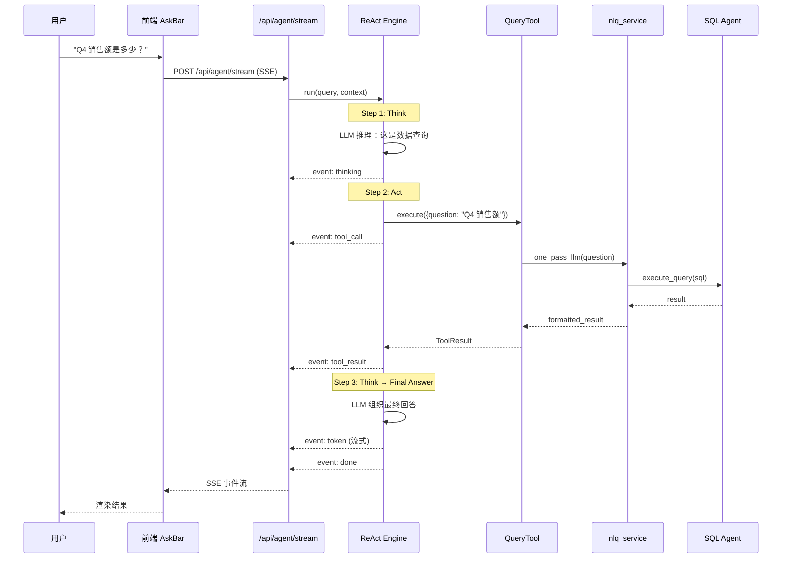
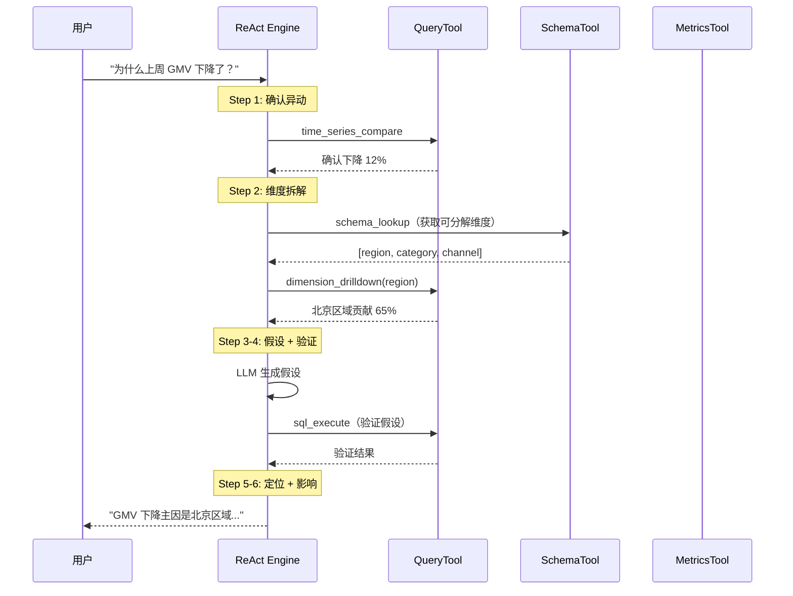

# Data Agent 架构技术规格书

> 版本：v0.9 | 状态：Engineering Spec — minimax 可开发（首页 Agent 灰度迁移已设计于 §15） | 日期：2026-05-15 | 关联 PRD：批次 0 T0.3 待 PM 决策（不阻塞 T2.3 启动）
>
> **变更记录**
> - v0.9（2026-05-15）— 按 `mulan-boundary-contraction` OpenSpec 修订首页问数边界：Tableau MCP 是事实、聚合、筛选、字段语义和派生指标权威；Mulan 只保留上下文、权限/路由/审计/trace、响应契约和基于 MCP 数据的自然语言解释。DCE 退出 primary `response_data`，QuerySpec 降级为 advisory/diagnostic，所有 Tableau MCP 执行必须经过 `mcp_args_guardrail.py`，renderer 禁止业务计算。
> - v0.8（2026-05-14）— 按 Spec 54 补充 Transparent MCP Proxy + Guardrail 新定位：QuerySpec 降级为 legacy adapter / observability snapshot，`mcp_first_main.py` 标记为 legacy queryspec chain；明确 P0 feature flags 默认值与回滚策略。
> - v0.7（2026-05-14）— 新增 Data Agent 表格展示契约：后端为所有 Data Agent table response 生成 `table_display.columns`，前端优先按该契约渲染并保留 `fields + rows` 历史 fallback。
> - v0.6（2026-05-14）— 新增 Metrics Registry / MetricResolver 接入方向；收窄普通 aggregate 的 deterministic preflight，禁止因业务名词正则跳过 planning skill；新增派生指标 QuerySpec 契约与语义覆盖 Validator 要求。
> - v0.5（2026-05-13）— 新增首页数据问答 MCP-first 受控架构：生产数据问答禁止依赖开放式 ReAct 自由选工具；改为意图分类 → Planning Skill Markdown 动态 prompt → LLM 生成结构化 QuerySpec → Python Validator → Tableau MCP 执行 → Rendering Skill Markdown 动态 prompt → LLM 受控渲染。明确 skill md 两个接入点、QuerySpec 校验门禁、Semantic Operators 解耦、Explainability UI 与 fallback 话术要求。
> - v0.4（2026-05-12）— 新增首页问答生产上线刚性条件：首页 Agent 答案准确性不得低于 Tableau MCP / 底层工具参照链路；任何“有回复但口径偏离、字段缺失、维度缺失、混入非目标资产、错误成功”的样本均视为验收失败，禁止进入正式上线。
> - v0.3（2026-05-12）— 首页问答临时收敛为 Tableau-only：`/api/agent/stream`、QueryTool、SchemaTool 禁止 fallback 到普通 `bi_data_sources`；历史会话中的停用 Tableau 连接必须解析到 active Tableau 或明确报错；Agent Monitor 必须保留工具失败摘要。
> - v0.2（2026-04-28）— 0.5d.1 补丁：§15 首页 Agent 灰度迁移与回滚（4 态 feature flag / 双写规约 / 自动回滚阈值 / 3 意图策略决策树 / `bi_agent_dual_write_audit` + `bi_agent_intent_log` 两张新表 / 5 P0 + 2 P1 测试 / 红线 + 强制清单 + grep + 正错示范）
> - v0.1（2026-04-24）— 初版草稿

---

## 1. 概述

### 1.1 目的

定义 Data Agent 的框架架构，将首页从"直连 NLQ 流水线"升级为"Data Agent 驱动"。Data Agent 是 Mulan BI 平台**唯一面向用户的智能体**，通过 ReAct 循环编排内部工具（NLQ、SQL Agent、Metrics Agent 等），统一处理用户的所有自然语言请求。

本 Spec 聚焦于 **Agent 框架层**（引擎 + 工具注册 + 会话管理 + API 接入），不重复定义 Spec 28 已覆盖的分析能力（归因、报告、洞察）。

### 1.2 范围

| 包含 | 不包含 |
|------|--------|
| ReAct 引擎核心循环 | 归因分析六步流程（见 Spec 28 §5） |
| 工具基类 + 注册表 | 14 个分析工具的详细设计（见 Spec 28 §4） |
| AgentResponse 统一响应模型 | 前端 UI 重构（菜单调整另行处理） |
| 会话 + 步骤持久化模型 | 多租户隔离（复用 Spec 28 §3 方案） |
| 首页 API 接入（替换直连 NLQ） | 主动洞察扫描调度 |
| 真实 SSE 流式输出 | HTTP API Agent 间通信（初期用内部调用） |
| QueryTool 封装（NLQ + SQL Agent）| Viz Agent 实现（Spec 26 Deferred） |

### 1.3 关联文档

| 文档 | 路径 | 关系 |
|------|------|------|
| Data Agent 分析能力 | docs/specs/28-data-agent-spec.md | 工具集 + 归因流程 + 数据模型详细设计 |
| NL-to-Query Pipeline | docs/specs/14-nl-to-query-pipeline-spec.md | QueryTool 封装的上游 |
| SQL Agent | docs/specs/29-sql-agent-spec.md | QueryTool 下游执行器 |
| Metrics Agent | docs/specs/30-metrics-agent-spec.md | MetricsTool 封装对象 |
| LLM 能力层 | docs/specs/08-llm-layer-spec.md | Agent 推理调用底层 |

### 1.4 与 Spec 28 的关系

Spec 28 定义了 Data Agent 的**分析能力**（What it does），本 Spec 定义**框架骨架**（How it runs）。两者关系：

```
Spec 36（本文档）          Spec 28
├── ReAct Engine           ├── 归因分析六步流程
├── BaseTool + Registry    ├── 14 个工具详细设计
├── Session Model          ├── analysis_sessions 表（复用）
├── API + SSE 接入         ├── /api/agents/data/* 端点
└── QueryTool（Phase 1）   └── causation/report/insight 工具（Phase 2+）
```

实施顺序：**先 Spec 36（框架），后 Spec 28（能力）**。

---

## 2. 系统架构

### 2.1 架构定位

Data Agent 是首页的唯一 Agent 入口。所有内部服务（NLQ、SQL Agent、Metrics Agent、Viz Agent）作为 Data Agent 的工具被调用，不直接暴露给用户。

> **MVP 运行约束（2026-05-12）**：首页 AskBar 的所有问答暂时只面向 Tableau / Tableau MCP。`connection_id` 在首页 Agent 链路中只允许解释为 `tableau_connections.id` 或 Tableau MCP 虚拟连接；不得 fallback 到普通 `bi_data_sources.id`。普通数据库自然语言问答另行设计和启用。

```
┌──────────────────────────────────────────────────┐
│  Frontend Homepage                                │
│  AskBar → SSE /api/agent/stream                  │
└──────────────────────┬───────────────────────────┘
                       │
┌──────────────────────▼───────────────────────────┐
│  Data Agent（services/data_agent/）               │
│                                                   │
│  ┌─────────────┐  ┌──────────────┐               │
│  │ ReAct Engine │  │ Tool Registry│               │
│  │  think()     │  │  register()  │               │
│  │  act()       │  │  get()       │               │
│  │  observe()   │  │  list()      │               │
│  └──────┬──────┘  └──────┬───────┘               │
│         │                │                        │
│  ┌──────▼────────────────▼───────┐               │
│  │        Registered Tools        │               │
│  │  ┌───────────┐ ┌────────────┐ │               │
│  │  │ QueryTool │ │ SchemaTool │ │               │
│  │  └─────┬─────┘ └────────────┘ │               │
│  │  ┌─────┴──────┐ ┌────────────┐│               │
│  │  │MetricsTool │ │ ChartTool  ││               │
│  │  └────────────┘ └────────────┘│               │
│  └───────────────────────────────┘               │
│                                                   │
│  ┌─────────────────────────────────┐             │
│  │ Session Manager                  │             │
│  │  create / resume / persist       │             │
│  └─────────────────────────────────┘             │
└──────────────────────────────────────────────────┘
         │              │              │
    ┌────▼────┐   ┌─────▼─────┐  ┌────▼─────┐
    │nlq_svc  │   │sql_agent  │  │metrics   │
    │(Spec 14)│   │(Spec 29)  │  │(Spec 30) │
    └─────────┘   └───────────┘  └──────────┘
```

### 2.2 工具通信方式

**Phase 1：内部函数调用**

Data Agent 通过 Python import 直接调用内部服务，不引入 HTTP API 层。

```python
# QueryTool 内部调用 nlq_service
from services.llm.nlq_service import one_pass_llm, execute_query
```

理由：
- 当前所有服务在同一进程内，无需网络通信
- 降低初期复杂度，先验证框架正确性
- 未来需要独立部署时再抽 HTTP 层（Spec 28 §2.3 已设计好接口）

### 2.3 目录结构

```
backend/services/data_agent/
├── __init__.py
├── engine.py            # ReAct 引擎核心循环
├── tool_base.py         # BaseTool 抽象类 + ToolRegistry
├── session.py           # 会话管理（创建/恢复/持久化）
├── models.py            # ORM 模型（复用 Spec 28 数据模型）
├── response.py          # AgentResponse 统一响应
├── prompts.py           # Agent 系统提示词
└── tools/
    ├── __init__.py
    ├── query_tool.py    # Phase 1：封装 NLQ + SQL Agent
    ├── schema_tool.py   # Phase 2：元数据查询
    ├── metrics_tool.py  # Phase 2：指标查询
    └── ...              # 后续工具

backend/app/api/
├── agent.py              # Data Agent FastAPI 路由（从 services/ 迁出）
└── ...
```

> api.py 位于 app/api/ 层（非 services/），遵循项目架构约束：services/ 层不依赖 Web 框架。

---

## 3. 核心组件设计

### 3.1 BaseTool 抽象类

```python
from abc import ABC, abstractmethod
from dataclasses import dataclass

@dataclass
class ToolResult:
    success: bool
    data: Any
    error: str | None = None
    execution_time_ms: int = 0

class BaseTool(ABC):
    """所有 Agent 工具的基类"""

    name: str                    # 工具唯一标识
    description: str             # 用于 LLM 选择工具时的描述
    parameters_schema: dict      # JSON Schema，描述输入参数

    @abstractmethod
    async def execute(self, params: dict, context: ToolContext) -> ToolResult:
        """执行工具，返回结果"""
        ...

@dataclass
class ToolContext:
    session_id: str
    user_id: int
    connection_id: int | None
    trace_id: str
```

### 3.2 ToolRegistry

```python
class ToolRegistry:
    """工具注册表，管理所有可用工具"""

    def register(self, tool: BaseTool) -> None: ...
    def get(self, name: str) -> BaseTool: ...
    def list_tools(self) -> list[BaseTool]: ...
    def get_tool_descriptions(self) -> list[dict]:
        """返回所有工具的 name + description + parameters_schema，
        用于构造 LLM 的 system prompt"""
        ...
```

启动时注册：

```python
registry = ToolRegistry()
registry.register(QueryTool())
# Phase 2:
# registry.register(SchemaTool())
# registry.register(MetricsTool())
```

### 3.3 ReAct Engine

```python
class ReActEngine:
    """ReAct 循环：Think → Act → Observe → 重复直到完成"""

    def __init__(self, registry: ToolRegistry, llm_service: LLMService, max_steps: int = 10):
        self.registry = registry
        self.llm = llm_service
        self.max_steps = max_steps

    async def run(
        self,
        query: str,
        context: ToolContext,
        session: AgentSession = None,
    ) -> AsyncGenerator[AgentEvent, None]:
        """
        执行 ReAct 循环，yield 流式事件。

        事件类型：
        - thinking: Agent 的推理过程
        - tool_call: 正在调用的工具及参数
        - tool_result: 工具返回结果
        - answer: 最终回答
        - error: 错误
        """
        history = session.history if session else []
        for step in range(self.max_steps):
            # 1. Think：LLM 根据历史决定下一步
            thought = await self._think(query, history, context)

            yield AgentEvent(type="thinking", content=thought.reasoning)

            # 2. 判断是否可以直接回答
            if thought.action == "final_answer":
                yield AgentEvent(type="answer", content=thought.answer)
                return

            # 3. Act：调用选定的工具
            tool = self.registry.get(thought.tool_name)
            yield AgentEvent(type="tool_call", content={
                "tool": thought.tool_name,
                "params": thought.tool_params,
            })

            result = await tool.execute(thought.tool_params, context)

            # 4. Observe：记录结果
            yield AgentEvent(type="tool_result", content={
                "tool": thought.tool_name,
                "result": result,
            })

        yield AgentEvent(type="answer", content="已达到最大推理步数，基于当前信息给出回答...")
```

> 步骤持久化由 API 层通过 SessionManager.persist_message() 完成，Engine 只负责推理循环。

### 3.4 AgentResponse 统一响应

```python
@dataclass
class AgentResponse:
    answer: str
    type: str           # 'text' | 'table' | 'number' | 'chart_spec' | 'error'
    data: Any           # 额外结构化数据
    trace_id: str
    confidence: float
    tools_used: list[str]
    steps_count: int
    session_id: str
```

### 3.5 AgentEvent 流式事件

```python
@dataclass
class AgentEvent:
    type: str            # 'thinking' | 'tool_call' | 'tool_result' | 'answer' | 'error' | 'metadata'
    content: Any
    timestamp: float = field(default_factory=time.time)
```

---

## 4. 数据模型

### 4.1 会话模型

复用 Spec 28 §3 定义的 `analysis_sessions` + `analysis_session_steps` 表结构。本 Spec 不重复定义。

Phase 1 新增一个轻量会话表，用于对话类交互（不涉及归因/报告的简单问答）：

#### `agent_conversations`

| 列名 | 类型 | 约束 | 说明 |
|------|------|------|------|
| id | UUID | PK | 会话 ID |
| user_id | INTEGER | NOT NULL, FK→auth_users.id | 用户 |
| title | VARCHAR(256) | NULLABLE | 会话标题（首条消息自动生成） |
| connection_id | INTEGER | NULLABLE | 关联的数据源连接 |
| status | VARCHAR(16) | NOT NULL DEFAULT 'active' | active / archived |
| created_at | TIMESTAMP | NOT NULL DEFAULT now() | 创建时间 |
| updated_at | TIMESTAMP | NOT NULL DEFAULT now() | 更新时间 |

#### `agent_conversation_messages`

| 列名 | 类型 | 约束 | 说明 |
|------|------|------|------|
| id | BIGSERIAL | PK | 消息 ID（BIGINT 自增，支持大规模消息量） |
| conversation_id | UUID | NOT NULL, FK→agent_conversations.id | 所属会话 |
| role | VARCHAR(16) | NOT NULL | 'user' / 'assistant' |
| content | TEXT | NOT NULL | 消息内容 |
| response_type | VARCHAR(16) | NULLABLE | text / table / number / chart_spec / error |
| response_data | JSONB | NULLABLE | 结构化响应数据 |
| tools_used | TEXT[] | NULLABLE | 使用的工具列表 |
| trace_id | VARCHAR(64) | NULLABLE | 追踪 ID |
| steps_count | INTEGER | NULLABLE | ReAct 步数 |
| execution_time_ms | INTEGER | NULLABLE | 总执行时间 |
| created_at | TIMESTAMP | NOT NULL DEFAULT now() | 创建时间 |

> 必须使用 BIGSERIAL（非 SERIAL），消息表增长快。

### 4.2 索引策略

| 表 | 索引名 | 列 | 类型 | 用途 |
|----|--------|-----|------|------|
| agent_conversations | ix_ac_user | (user_id, status, updated_at DESC) | BTREE | 用户会话列表 |
| agent_conversation_messages | ix_acm_conv | (conversation_id, created_at) | BTREE | 会话消息时序 |

### 4.3 迁移说明

新建两张表，不影响现有表。使用 Alembic：

```bash
cd backend && alembic revision --autogenerate -m "add_agent_conversations_and_messages"
```

---

## 5. API 设计

### 5.1 端点总览

| 方法 | 路径 | 说明 | 认证 | 角色 |
|------|------|------|------|------|
| POST | /api/agent/stream | Agent 对话（SSE 流式） | 需要 | analyst+ |
| GET | /api/agent/conversations | 会话列表 | 需要 | analyst+ |
| GET | /api/agent/conversations/{id}/messages | 会话消息 | 需要 | analyst+ |
| DELETE | /api/agent/conversations/{id} | 归档会话 | 需要 | analyst+ |

> 非流式端点不提供。客户端统一使用 SSE，前端可选择忽略中间事件只取 done。

### 5.2 核心端点：POST /api/agent/stream

**请求：**

```json
{
  "question": "Q4 销售额是多少？",
  "conversation_id": "uuid（可选，续接已有会话）",
  "connection_id": 1
}
```

**SSE 响应事件流：**

```
data: {"type": "metadata", "conversation_id": "uuid-new"}

data: {"type": "thinking", "content": "用户在问销售数据，需要使用查询工具..."}

data: {"type": "tool_call", "tool": "query", "params": {"question": "Q4 销售额"}}

data: {"type": "tool_result", "tool": "query", "summary": "查询完成，共 1 条结果"}

data: {"type": "token", "content": "Q4"}
data: {"type": "token", "content": "销售额"}
data: {"type": "token", "content": "为"}
data: {"type": "token", "content": "3,200"}
data: {"type": "token", "content": "万元。"}

data: {"type": "done", "answer": "Q4 销售额为 3,200 万元。", "trace_id": "t-xxx", "tools_used": ["query"], "response_type": "number", "response_data": {"value": 32000000, "unit": "元"}, "steps_count": 2, "execution_time_ms": 1500}
```

### 5.3 与现有 API 的关系

| 现有端点 | 处理方式 |
|---------|---------|
| GET /api/chat/stream | Phase 1b 迁移：内部转发到 POST /api/agent/stream |
| POST /api/ask-data | Phase 1b 迁移：内部转发到 POST /api/agent/stream |
| POST /api/search/query | 保留，作为 QueryTool 的内部调用目标 |
| POST /api/query/ask | 保留，独立的 Tableau 问数链路 |

> Phase 1 只建新端点，Phase 1b 再做旧端点转发和前端切换。

### 5.4 错误响应

```json
{
  "error_code": "AGENT_001",
  "message": "Agent 执行超时",
  "detail": {"step": 8, "last_tool": "query", "trace_id": "t-xxx"}
}
```

---

## 6. 错误码

| 错误码 | HTTP | 说明 | 触发条件 |
|--------|------|------|---------|
| AGENT_001 | 504 | Agent 执行超时 | ReAct 循环超过 max_steps 或总时间超限 |
| AGENT_002 | 400 | 无法理解的请求 | LLM 多次推理仍无法确定意图 |
| AGENT_003 | 500 | 工具执行失败 | 注册的工具抛出异常 |
| AGENT_004 | 404 | 会话不存在 | conversation_id 无效或不属于当前用户 |
| AGENT_005 | 403 | 无权限 | 用户角色不满足 analyst+ |
| AGENT_006 | 503 | LLM 服务不可用 | LLM 调用失败（超时/配额/网络） |
| AGENT_007 | 400 | 请求参数非法 | conversation_id 格式错误、question 为空等 |

---

## 7. 业务逻辑

### 7.1 ReAct 循环约束

| 约束 | 值 | 说明 |
|------|-----|------|
| max_steps | 10 | 单次对话最大推理步数 |
| step_timeout | 30s | 单步执行超时 |
| total_timeout | 120s | 整次对话总超时 |
| max_tool_retries | 1 | 工具失败后重试次数 |

### 7.2 意图识别策略

Data Agent 使用 LLM 内置推理做意图识别，不做独立的分类器。

ReAct 的第一步 Think 自然包含意图判断：
- "这是一个数据查询" → 调 QueryTool
- "这是一个闲聊" → 直接回答，不调工具
- "这需要分析原因" → 调归因工具链（Phase 2）

### 7.3 对话上下文

多轮对话通过 `conversation_id` 关联。Engine 加载历史消息构建 LLM 上下文：

- 最近 N 条消息（默认 10）作为 chat history
- 工具调用结果作为上下文
- 超出窗口的历史：Phase 1 截断为最近 10 条，Phase 2 引入摘要压缩

---

## 8. 安全

### 8.1 角色权限矩阵

| 操作 | admin | data_admin | analyst | user |
|------|-------|-----------|---------|------|
| 使用 Agent 对话 | Y | Y | Y | N |
| 查看自己的会话 | Y | Y | Y | N |
| 查看他人会话 | Y (Phase 3) | N | N | N |
| 删除会话 | Y（所有） | 自己 | 自己 | N |

> admin 跨用户会话管理在 Phase 3 监控页面实现，Phase 1 所有用户只能操作自己的会话。

### 8.2 工具执行安全

- 首页 Agent 工具只能访问用户有权限的 Tableau 连接（connection_id 校验）；MVP 阶段不得访问普通 `bi_data_sources`
- `connection_id` 不具备跨表全局唯一性，禁止在 Tableau 连接停用/不存在时用同值普通数据源接管
- 历史会话绑定停用 Tableau 连接时，运行时必须解析到明确的 active Tableau 连接，或返回明确错误；不得静默切到普通数据库
- SQL 执行走 SQL Agent 安全校验（Spec 29 sqlglot AST 检查）
- 工具输出视为**惰性证据**，不作为可执行指令（防 prompt injection）
- LLM 返回的工具参数做 JSON Schema 校验后再执行
- LLM 返回的工具参数先做 JSON Schema 校验（jsonschema.validate），校验失败返回 AGENT_002
- connection_id 权限校验：Phase 1 由 API 层完成 Tableau 连接 active 状态、角色和 owner 校验；Phase 2 增加更细粒度资产权限

### 8.3 Tableau-only 工具约束

- `SchemaTool` 只查询 active Tableau 连接的 `tableau_assets` / `tableau_datasource_fields` 缓存；找不到 active Tableau 连接时返回明确错误，不得 fallback 到普通数据库连接。
- Tableau asset 匹配顺序：精确匹配 `name`，再做大小写不敏感/包含匹配。示例：用户输入 `订单明细表` 应匹配 `orders-订单明细表`。
- 找到 Tableau datasource 但字段缓存为空时，返回 `success=true` + 空字段列表 + warning，表示“已找到资产但字段未同步/无缓存”，不得包装成系统失败。
- `QueryTool` 只通过 Tableau 路由和 Tableau MCP 执行 VizQL；找不到匹配 Tableau datasource 时返回明确业务错误，不得访问普通 `DataSource`。
- `BiAgentStep.tool_result_summary` 必须保存失败工具的 `error` 摘要，Agent Monitor 展开运行记录时必须能看到失败原因。

---

## 9. 集成点

### 9.1 上游依赖

| 模块 | 接口 | 用途 |
|------|------|------|
| LLM Service (Spec 08) | `complete()` | Agent 推理调用 |
| Auth (Spec 04) | `get_current_user` | 用户认证 + 权限 |

### 9.2 下游消费者（作为工具）

| 模块 | 调用方式 | 说明 |
|------|---------|------|
| NLQ Service (Spec 14) | 内部函数调用 | QueryTool 封装 |
| SQL Agent (Spec 29) | 内部函数调用 | QueryTool 下游 |
| Metrics Agent (Spec 30) | 内部函数调用 | MetricsTool 封装（Phase 2） |

---

## 10. 时序图

### 10.1 Phase 1 典型查询流程



### 10.2 Phase 2 归因分析流程



---

## 11. 分阶段实施

### Phase 0：框架搭建

**目标**：`services/data_agent/` 骨架可运行，不接入首页。

| 任务 | 产出 |
|------|------|
| BaseTool + ToolRegistry | tool_base.py |
| ReAct Engine 核心循环 | engine.py |
| AgentResponse + AgentEvent | response.py |
| Agent 系统提示词 | prompts.py |
| 单元测试（mock 工具） | tests/test_data_agent_engine.py |

### Phase 1a：QueryTool + 首页接入（已完成）

**目标**：首页通过 Data Agent 问数据，用户体感不变。

| 任务 | 产出 |
|------|------|
| QueryTool 实现（封装 nlq_service + sql_agent） | tools/query_tool.py |
| agent_conversations + messages 表 | Alembic 迁移 |
| Session Manager | session.py |
| POST /api/agent/stream 端点 | api.py |

**验收标准**：首页问"Q4 销售额是多少"→ Data Agent → QueryTool → Tableau NLQ/MCP → 返回正确结果；首页问"我要分析 订单明细表"→ SchemaTool 命中 Tableau datasource `orders-订单明细表`，不得访问普通 `bi_data_sources`。

### Phase 1b：迁移

| 任务 | 产出 |
|------|------|
| api.py 从 services/ 迁移到 app/api/agent.py | 遵循架构约束 |
| chat.py / ask_data.py 内部转发到 Agent | 兼容现有前端 |
| 端到端测试 | tests/test_data_agent_e2e.py |

### Phase 2：补齐工具

| 工具 | 优先级 | 依赖 |
|------|--------|------|
| SchemaTool（元数据查询） | P0 | 语义层元数据 |
| MetricsTool（指标查询） | P1 | metrics_agent |
| CausationTool（归因分析） | P1 | SchemaTool + Spec 28 六步流程 |
| ChartTool（图表 spec） | P2 | Spec 26 Viz Agent |

### Phase 3：可观测性

| 任务 | 说明 |
|------|------|
| Agent 运行日志表 | bi_agent_runs / bi_agent_steps |
| 反馈收集 | bi_agent_feedback（复用现有反馈 API） |
| 平台域 Agent 监控页 | 调用量 / 成功率 / P95 |

---

## 12. 测试策略

### 12.1 关键场景

| # | 场景 | 预期 | 优先级 |
|---|------|------|--------|
| 1 | 简单数据查询（"Q4 销售额"） | Agent 调 QueryTool 返回数字 | P0 |
| 2 | 闲聊（"你好"） | Agent 直接回答，不调工具 | P0 |
| 3 | 工具执行失败 | 返回友好错误，不暴露内部细节 | P0 |
| 4 | 超过 max_steps | 基于已有信息给出回答 | P1 |
| 5 | 多轮对话上下文 | 第二轮能引用第一轮结果 | P1 |
| 6 | 无权限数据源 | 返回 403 | P0 |
| 7 | LLM 服务不可用 | 返回 503 + 降级提示 | P1 |
| 8 | SSE 连接中断 | 客户端可重连续接 | P2 |

### 12.2 验收标准

- [ ] ReAct Engine 单元测试通过（mock 工具）
- [ ] QueryTool 集成测试通过（调用真实 NLQ 服务）
- [ ] SSE 流式事件格式符合 §5.2 定义
- [ ] 多轮对话上下文正确传递
- [ ] 现有首页功能无回归（`/api/chat/stream` 透传正常）
- [ ] **生产上线刚性条件：首页答案准确性不得低于底层 Tableau MCP / 工具参照链路。** 对同一问题集必须先记录 Tableau MCP / QueryTool / SchemaTool 的参照结果，再记录首页 `/api/agent/stream` 的结果；首页结果必须在目标资产范围、字段集合、聚合维度、过滤条件、数值结果上与参照链路一致或更严格。若首页仅“有回复”但出现口径扩大、混入 `view` 等非目标资产、字段缺失/多出、维度缺失、过滤误译、数值不一致、或“错误成功”，均视为验收失败，不得进入正式上线。

### 12.3 Mock 与测试约束

- **ReAct Engine 单元测试**：所有工具 mock 为 `AsyncMock`，返回固定 `ToolResult`；断言 Engine 在 `max_steps` 内终止，思考链和工具调用序列正确
- **QueryTool 集成测试**：调用真实 `nlq_service.query()`，不 mock LLM；断言返回数据结构符合 VizQL 响应格式
- **SSE 测试**：使用 `httpx.AsyncClient` 的 `stream()` 方法消费 SSE 事件，断言事件类型序列为 `thinking → tool_call → tool_result → ... → done`
- **Session Manager 不可 mock**：会话读写必须使用真实数据库，验证 `agent_conversations` / `agent_conversation_messages` 表写入
- **LLM 不可用降级**：mock `LLMService.complete()` 抛出异常，断言 Agent 返回 `AGT_002` 错误码和友好提示
- **Playwright mock**：`page.route('**/api/agent/stream')` 返回 SSE mock 时，`answer` 文本必须出现在 DOM 断言中

---

## 13. 开放问题

| # | 问题 | 状态 |
|---|------|------|
| 1 | Phase 1 是否保留现有 API | 已决定：Phase 1 并存，Phase 1b 做转发 |
| 2 | thinking 事件是否暴露给前端 | 已决定：暴露，前端可选择隐藏 |
| 3 | 会话历史是否与 query_sessions 合并 | 已决定：独立，不合并 |
| 4 | LLM purpose 配置 | 已决定：优先 agent purpose，fallback 到 general |

---

## 14. 开发交付约束

> 通用约束见 `.claude/rules/dev-constraints.md`（自动加载），以下为 Agent 架构模块特有约束。

### 架构红线（违反 = PR 拒绝）

1. **services/data_agent/ 层无 Web 框架依赖** — Engine、Tool、Session 均在 services 层，不得 import FastAPI/Request/Response
2. **工具注册必须通过 ToolRegistry** — 禁止在 Engine 中硬编码工具列表，新工具必须通过 `@register_tool` 装饰器注册
3. **ReAct 循环有上限** — `max_steps` 必须有默认值且不可无限循环，超限时基于已有信息回答
4. **SSE 事件格式不可变** — `thinking` / `tool_call` / `tool_result` / `done` / `error` 事件类型定义后不可在 Phase 内变更
5. **Agent API 与 chat API 独立** — `POST /api/agent/stream` 和 `POST /api/chat/stream` 共存，Phase 1b 做转发但不合并端点
6. **所有用户可见文案为中文**

### SPEC 36 强制检查清单

- [ ] `services/data_agent/` 不 import `fastapi` 或 `starlette`
- [ ] 所有工具通过 `ToolRegistry.register()` 注册
- [ ] `max_steps` 默认值存在且 ≤ 10
- [ ] SSE 事件类型覆盖 `thinking` / `tool_call` / `tool_result` / `done` / `error`
- [ ] `agent_conversations` / `agent_conversation_messages` 表前缀为 `agent_`
- [ ] Phase 1b 完成后 `/api/chat/stream` 转发到 Agent，不直接删除

### 验证命令

```bash
# 检查 services/ 层无 Web 框架依赖
grep -r "from fastapi\|from starlette" backend/services/data_agent/ && echo "FAIL: web framework in services/" || echo "PASS"

# 检查工具注册模式
grep -r "register_tool\|ToolRegistry" backend/services/data_agent/tools/ | head -5

# 检查 max_steps 存在
grep -r "max_steps" backend/services/data_agent/engine.py || echo "FAIL: no max_steps"
```

### 正确 / 错误示范

```python
# ❌ 错误：Engine 中硬编码工具
class DataAgentEngine:
    tools = [QueryTool(), SchemaTool(), MetricsTool()]

# ✅ 正确：通过 ToolRegistry 注入
class DataAgentEngine:
    def __init__(self, tool_registry: ToolRegistry):
        self.tools = tool_registry.get_all()

# ❌ 错误：无限循环
while True:
    result = await llm.complete(prompt)
    ...

# ✅ 正确：有上限
for step in range(self.max_steps):
    result = await llm.complete(prompt)
    if result.is_final:
        break
else:
    return self._summarize_partial(observations)
```

---

## 15. 首页 Agent 灰度迁移与回滚

> 本节为 v2 plan 批次 0.5d.1 增量补章，覆盖模板符合度审计中识别的"首页 Agent 驱动迁移开关 / 双写 / 回滚未列；意图识别仅给策略名"两项缺口。下游阻塞 T2.3 首页 Agent 驱动验证。
>
> 范围：仅约束 **首页 AskBar → Agent / NLQ** 这一对入口的迁移行为。其他链路（chat / ask-data）按 §11 Phase 1b 单独转发，不在本节灰度模型内。

### 15.A 灰度开关（Feature Flag）

| 项 | 值 |
|----|----|
| 名称 | `HOMEPAGE_AGENT_MODE` |
| 存储位置（首选） | `platform_settings` 表（见 Spec 37 §平台设置）键 `homepage_agent_mode` |
| 兜底 | 进程启动时若 `platform_settings` 不可读，回退到环境变量 `HOMEPAGE_AGENT_MODE_FALLBACK`（仅供本机故障兜底，禁止业务代码直接读） |
| 切换粒度 | 全局值 + 单用户 override（`platform_settings` 中 key=`homepage_agent_mode_user_override`，value=`{user_id: mode}`） |
| 切换生效 | 30 秒内热更（settings 缓存 TTL=30s），无需重启 |
| 默认值 | `agent_with_fallback` |

**取值定义**：

| 取值 | 行为 | 入口端点 |
|------|------|---------|
| `legacy_only` | 仅旧 NLQ 直连路径（`/api/search/query`）；Agent 入口对前端隐藏 | `/api/search/query` |
| `dual_write` | 同一请求双路并发：Agent + NLQ；以 Agent 结果为准呈现给前端，NLQ 结果仅落审计表用于差异比对 | `/api/agent/stream`（前台）+ `/api/search/query`（影子） |
| `agent_only` | 仅 Agent 路径；NLQ 入口下线（保留为 QueryTool 内部调用对象） | `/api/agent/stream` |
| `agent_with_fallback`（默认） | Agent 优先；触发 §15.C 软降级条件时单请求级 fallback NLQ | `/api/agent/stream`，失败时内部代理到 `/api/search/query` |

**优先级**：单用户 override > 全局值。Override 仅 admin 可写（走 audit log，actor=admin）。

### 15.B 双写规约（`dual_write` 模式专用）

1. **trace_id 单源**：API 入口生成 1 个 `trace_id`，同时下发给 Agent 路径与 NLQ 路径；任一路径自行生成 trace_id 视为违规（见 §15.G 红线 2）。
2. **并发执行**：两路通过 `asyncio.gather(return_exceptions=True)` 并发；单路超时 30s，任一路超时不阻塞另一路。
3. **结果取舍**：前端只收到 Agent 路径的 SSE 流；NLQ 结果到达后只写 `bi_agent_dual_write_audit`，不影响前台。
4. **结果对比落表**（见 §15.E `bi_agent_dual_write_audit`）：
   - `result_hash` 算法统一在 `services/agent/dual_write/hashing.py`：对 NLQ / Agent 的最终回答规范化（去空白、统一数字精度到 4 位、按列排序的 JSON）后 SHA256。
   - `divergence_kind` 取值：`match` / `partial`（数值差 < 1%）/ `mismatch` / `one_failed` / `both_failed`。
5. **聚合报表**：admin 平台域 Agent 监控页（§11 Phase 3）每日聚合：分歧率、Agent 失败率、Agent 相对 NLQ 的 P50 / P95 延迟差。
6. **自动降级阈值**：Agent 失败率（`one_failed` 中 Agent 侧失败 + `both_failed` 计入分子）连续 2 小时滚动窗口 > 5% → 自动切 `legacy_only`（仅人工可解除，见 §15.C）。

### 15.C 回滚路径

| 触发条件 | 行为 | RTO |
|----------|------|-----|
| Agent 失败率告警（§15.B 阈值） | 自动写 `platform_settings.homepage_agent_mode = legacy_only` + 站内通知 admin（复用 Spec 16 通知通道） | < 60 秒 |
| Agent 引擎健康探针 3 次连续失败 | 先自动 `agent_with_fallback`，仍失败则 `legacy_only` | < 90 秒 |
| 主动回滚（admin 操作） | admin UI 提交 → `platform_settings` 改写 → 30s 内生效 | 立即（生效 ≤ 30s） |
| 前端 SSE 断流 ≥ 5 次/分钟 | 不切模式，仅写 `bi_events`（type=`agent_sse_drop`），由 admin 决定 | — |

> 自动回滚必须写 audit log（actor=`system`，原因=阈值告警 + 触发指标快照），见 §15.G 红线 4。
> 自动切 `legacy_only` 后**仅允许 admin 在 UI 上手动解除**，禁止再次自动恢复，避免抖动。

### 15.D 意图识别策略

> **MVP 阶段暂停（2026-05-04）**：当前所有首页请求均为问数场景（Tableau MCP），独立意图识别增加 2-5 秒延迟但不改变路由结果（除 chat 拦截外，所有意图均进入同一个 `run_agent()`）。回归 §7.2 策略：由 ReAct Engine 第一步 Think 内置判断意图。
>
> 代码模块 `services/data_agent/intent/` 保留不删，`bi_agent_intent_log` 表保留历史数据。待多场景路由需求出现时（如归因引擎、报表引擎独立入口）再重新启用策略链。

<details>
<summary>原设计（已暂停，点击展开）</summary>

原标题：替代 §7.2 "仅 LLM 推理"陈述，作为 Phase 1b 起的正式实现

> 替换原"仅给策略名"的描述，每种策略给出判定输入 / 输出 / 决策方式。Phase 1a 仍可走 §7.2 的 LLM 内置推理，Phase 1b 起切换到本节的策略链。

| 策略 | 输入 | 输出意图集合 | 判定方式 |
|------|------|-------------|---------|
| `keyword_match` | `user_message`（仅当前一轮） | `attribution` / `report` / `lookup` / `chat` / `unknown` | 关键词正则白名单（配置于 `services/data_agent/intent/keywords.yaml`） + 优先级：attribution > report > lookup > chat |
| `llm_classify` | `user_message` + 最近 N=5 轮对话上下文 | 同上 | LLM 单次调用，prompt 模板 `INTENT_CLASSIFY_TEMPLATE`，`response_format=json`，`temperature=0.1`，输出 `{intent, confidence}` |
| `context_aware` | `user_message` + 上一轮工具调用 metadata | 同上 + `continuation` | 若上轮主调用是 `report` 且本轮 `len(user_message) < 10`，直接判定 `continuation`；否则透传给下一级策略 |

**组合规则（fallback 链）**：

```
context_aware → keyword_match → llm_classify → fallback("chat")
```

- 任一级策略输出 `unknown` 或置信度 < 0.6 → 进入下一级。
- `llm_classify` 调用失败（超时 / 配额）→ 直接 fallback `chat`，不再重试。
- 置信度 < 0.6 时即使有意图也强制走 `chat`，不调归因 / 报告引擎，避免误触发高成本工具链。
- **冷启动**（首条消息，无上下文）：跳过 `context_aware`，从 `keyword_match` 开始。

**审计**：每次意图识别（含每一级 fallback）写一条 `bi_agent_intent_log`（见 §15.E），`fallback_chain` 字段以 `→` 连接（如 `context_aware→keyword→llm→chat`）。

**策略注册**：所有策略实现 `IntentStrategy` 抽象类，通过 `IntentStrategyRegistry.register()` 注册；新增策略必须同步补本节表格（见 §15.G 强制检查清单）。

</details>

### 15.E 新增数据表

#### `bi_agent_dual_write_audit`

| 列 | 类型 | 约束 | 说明 |
|----|------|------|------|
| id | BIGINT | PK, IDENTITY | |
| trace_id | VARCHAR(64) | UNIQUE, INDEX | 与 Agent / NLQ 两路共享 |
| user_id | INTEGER | NOT NULL, FK→auth_users.id, INDEX | |
| nlq_result_hash | VARCHAR(64) | NULL | NLQ 路径失败时为 NULL |
| agent_result_hash | VARCHAR(64) | NULL | Agent 路径失败时为 NULL |
| nlq_latency_ms | INT | NULL | |
| agent_latency_ms | INT | NULL | |
| divergence_kind | VARCHAR(16) | NOT NULL, INDEX | match / partial / mismatch / one_failed / both_failed |
| created_at | TIMESTAMP | NOT NULL DEFAULT now() | |

- 按月分区，遵循 Spec 16 §2.1 分区约定（`PARTITION BY RANGE (created_at)`）。
- 保留期 30 天；分区清理脚本与 `bi_events` 复用同一 Beat 任务（见 §15.G 强制检查清单）。

#### `bi_agent_intent_log`

| 列 | 类型 | 约束 | 说明 |
|----|------|------|------|
| id | BIGINT | PK, IDENTITY | |
| trace_id | VARCHAR(64) | INDEX | 与首页请求 trace_id 一致 |
| strategy | VARCHAR(16) | NOT NULL | keyword_match / llm_classify / context_aware |
| input_excerpt | VARCHAR(256) | NULL | 输入 user_message 截断到 256 字符（含中英文） |
| output_intent | VARCHAR(32) | INDEX | 见 §15.D 意图集合 |
| confidence | NUMERIC(4,3) | NULL | `keyword_match` 无置信度时为 NULL |
| fallback_chain | VARCHAR(64) | NULL | 形如 `keyword→llm→chat` |
| created_at | TIMESTAMP | NOT NULL DEFAULT now(), INDEX | |

- 不分区（增长可控）；保留期 90 天，由独立 Beat 任务清理。

### 15.F 测试 P0 / P1

| # | 优先级 | 场景 | 预期 |
|---|--------|------|------|
| 15F-1 | P0 | 灰度模式四态切换 | 每种模式下首页问数路径符合 §15.A 表（端到端 e2e，覆盖 SSE） |
| 15F-2 | P0 | `dual_write` 下 Agent 失败 NLQ 成功 | 前端展示 Agent 错误（不静默偷换为 NLQ 结果），审计表 `divergence_kind=one_failed` |
| 15F-3 | P0 | 阈值告警自动回滚 | 注入 Agent 失败率 6%，60 秒内 `platform_settings` 自动改为 `legacy_only`，audit log 写入 |
| 15F-4 | P0 | 意图三级 fallback 链路日志 | `keyword_match → llm_classify → chat`，三条 `bi_agent_intent_log` 记录，`fallback_chain` 正确 |
| 15F-5 | P0 | trace_id 单源贯穿 | 双路 + 意图识别 + step run 共用同一 `trace_id`，所有日志可关联 |
| 15F-6 | P1 | 单用户 override | admin 给 user_X 切 `agent_only`，user_X 走 Agent，user_Y 仍按全局值 |
| 15F-7 | P1 | SSE 断流计数不切模式 | 5 次/分钟 SSE 断流写入 `bi_events`，全局 `homepage_agent_mode` 不变 |

### 15.G 开发交付约束

> 复用 §14 的通用约束，本节为首页 Agent 迁移特有约束。

#### 架构红线（违反 = PR 拒绝）

1. `HOMEPAGE_AGENT_MODE` 唯一读取入口为 `services/platform_settings.get('homepage_agent_mode')`；业务代码（含 `app/api/agent.py`、`services/data_agent/**`）禁止直接读 `os.environ['HOMEPAGE_AGENT_MODE*']`
2. 双写路径必须共用一个 `trace_id`，由 API 入口生成；Agent / NLQ 任一路径生成新 trace_id 视为违规
3. 双写结果对比的 `result_hash` 算法在 `services/agent/dual_write/hashing.py` **唯一**实现；其他位置出现等价算法（独立 SHA256 + 自定义规范化）视为违规
4. 自动回滚操作必须写 audit log（actor=`system`，原因=阈值告警 + 指标快照 JSON）
5. 意图识别 `fallback_chain` 必须落 `bi_agent_intent_log`；禁止只在内存中转或仅打 logger.info
6. 首页 Agent 链路禁止引用普通 `bi_data_sources` 作为问答目标；`DataSource` 同 ID 记录不得接管 Tableau connection_id
7. 首页 Agent 的生产验收禁止以“有回复”为成功标准；必须以 Tableau MCP / 底层工具参照链路为准确性基线。任何让首页答案弱于参照链路的改动（口径漂移、字段/维度丢失、错误成功、自由发挥补全）均视为 P0 回归，PR 必须拒绝或回滚。
8. 首页 Agent、QueryTool、LLM 查询 prompt 和 direct VizQL 只能信任 MCP/VizQL 当前可查询字段 `queryable_fields`。资产同步/API 导入得到的 `metadata_fields` 只是元数据层字段全集/字段快照，用于治理、盘点、血缘和语义维护；不得把 `metadata_fields` 当作可查询字段生成查询。若字段仅存在于 `metadata_fields`，必须解释“元数据存在但当前 published datasource 不支持 MCP 查询”，并基于 `queryable_fields` 给出替代字段建议，不得报成工具执行失败。
9. 首页生产数据问答不得以开放式 ReAct 自由选工具作为主路径。凡 intent 属于 data_query / ranking / trend_condition / all_period_condition / set_difference / customer_record / root_cause 等问数类，必须进入 §16 MCP-first 受控链路；ReAct 只能作为非生产实验路径、诊断路径或明确灰度路径。
10. 问数类请求一旦进入 §16 受控链路，禁止 fallback 到 SchemaTool / Schema Inventory 用资产列表、字段枚举或数据源介绍冒充业务答案。QuerySpec 校验失败时必须返回标准 fallback，而不是改走资产问答。

#### 强制检查清单

- [ ] 灰度开关四态（`legacy_only` / `dual_write` / `agent_only` / `agent_with_fallback`）有 e2e 测试
- [ ] 自动回滚路径有混沌测试（注入 Agent 失败率超阈值）
- [ ] `bi_agent_dual_write_audit` 分区脚本与 `bi_events` 同步加入 Beat 任务（不引入第二份调度）
- [ ] 新增意图策略必须在 `IntentStrategyRegistry` 注册，并补本 spec §15.D 表
- [ ] `platform_settings.homepage_agent_mode` 写操作有 admin 角色校验
- [ ] 首页问答上线前必须提交“Tableau MCP 参照链路 vs 首页链路”对照报告；报告至少覆盖数据源清单、字段清单、简单聚合、趋势、多轮追问、TopN/占比等场景，并明确逐题判定首页是否不劣于参照链路。
- [ ] 字段可查询性回归用例必须覆盖：字段在 `metadata_fields` 存在但不在 `queryable_fields` 时，首页返回业务解释和替代字段建议，而不是 MCP/工具失败。
- [ ] 问数类 intent 必须覆盖 §16 的 7 节点链路测试：intent 分类、planning skill 加载、QuerySpec JSON 生成、Python Validator 拒绝非法计划、MCP 执行、rendering skill 加载、最终回答不新增事实。
- [ ] Q5/Q7/Q8/Q9/Q10 这类复杂问题必须进入 Semantic Operators，不得靠 direct VizQL 后处理或 LLM 自由总结碰运气。
- [ ] Explainability UI 必须展示用户可理解的“识别意图 / 选择数据源 / 生成查询计划 / 执行 MCP / 整理回答”过程；禁止展示内部 prompt、skill 文件名、数据库密钥或完整原始结果。

#### 验证命令

```bash
cd backend && pytest tests/services/test_homepage_agent_mode.py -x
cd backend && pytest tests/services/test_agent_intent.py -x
cd backend && pytest tests/integration/test_dual_write_audit.py -x

# 红线 1：禁止业务代码直接读 env 中的 HOMEPAGE_AGENT_MODE
! grep -rE "os\.environ.*HOMEPAGE_AGENT_MODE" backend/app backend/services/data_agent backend/services/agent

# 红线 2：双写路径不得自行生成 trace_id
! grep -rE "uuid\.uuid4|secrets\.token_hex" backend/services/agent/dual_write

# 红线 3：result_hash 实现唯一
test "$(grep -rl 'def result_hash' backend/services backend/app | wc -l | tr -d ' ')" = "1"
```

### 15.H 开放问题

| # | 问题 | 优先级 | 备注 |
|---|------|--------|------|
| HA-A | `dual_write` 阶段持续多久 | P1 | 建议 2 周；视 §15.B 分歧率收敛情况调整 |
| HA-B | divergence > 30% 时是否阻塞 `agent_only` 切换 | P1 | 倾向阻塞，但需要 admin 一键 override |
| HA-C | 多用户并发 override 与全局开关冲突解决 | P2 | 当前规则：用户 override > 全局；冲突仅在 admin 误操作时出现 |
| HA-D | 意图识别 LLM 调用成本归因 | P2 | 依赖 Spec 20 OI-D（capability wrapper 计费维度） |

---

## 16. 首页数据问答 MCP-first 受控架构（v0.5-v0.8）

### 16.1 背景与决策

2026-05-13 batch2 A/B 测试显示：Tableau MCP 参照链路在准确性上显著优于首页开放式 ReAct 链路。失败样本集中在以下类型：

| 问题类型 | ReAct / direct VizQL 失败形态 | MCP 参照链路正确形态 |
|----------|-------------------------------|----------------------|
| 客户合作记录 | Q7 将“邓保合作记录”查成 `客户名称` 全量枚举 | `客户名称 = 邓保` + `YEAR(发货日期)` + `SUM(销售额)` + `SUM(利润)` |
| 连续增长 | Q8 同时带 `类别` / `子类别`，按错误维度判断持续增长 | 按完整年度 `2021-2024`、维度 `子类别`、指标 `SUM(利润)` 判断严格递增 |
| 差集 | Q5 将“没有销售记录”查成“有销售记录” | universe set - occurred set |
| 持续亏损 | Q9 返回年度省份明细，未筛选“每年均亏损” | 按省份聚合年度利润，过滤所有完整年度均 `< 0` |
| 亏损归因 | Q10 拉 1000 条明细，没有形成贡献排序 | 按省份、产品线、客户维度执行聚合、升序排序和 TopN 归因 |

因此，首页生产数据问答从 v0.5 起采用 **MCP-first controlled QA**；自 v0.9 起，其权威边界收缩为 **MCP/Tableau owns facts, Mulan wraps and explains**：

- Tableau MCP / VizQL 是数据事实、聚合、筛选、字段语义和派生指标的唯一权威执行层。
- Mulan 只负责上下文承接、权限/路由/审计/trace、稳定响应契约，以及基于 MCP response data 的自然语言解释。
- Dynamic Column Engine 不得进入 primary `response_data`；如保留，只能在显式启用的 shadow diagnostics 中做对照，不得改变用户可见事实。
- QuerySpec / planning skill 是 advisory/diagnostic；对 MCP-answerable query，不得成为通往 guarded Tableau MCP execution 的唯一 gate。
- 所有 Tableau MCP 执行路径必须先经过 `mcp_args_guardrail.py`，不得让未规范化或已知非法 schema 的参数到达 Tableau MCP。
- Renderer 只做表达整理和格式化，不得新增事实、重算指标或把渲染失败转换成 MCP query fallback。

> **v0.8 定位修订（2026-05-14）**：Spec 54 将后续 P0 目标调整为 **Transparent MCP Proxy + Guardrail**。§16.2-§16.10 记录的 QuerySpec controlled QA 是 legacy queryspec chain 的历史主链路与回滚路径；新 P0 主方向不再强制 LLM 先生成 Mulan 自定义 QuerySpec，而是让 LLM 基于 MCP Tool Description / Schema 直接生成 MCP args，Mulan 只在发往底层 MCP 前执行 Guardrail 底线检查。该修订不删除 QuerySpec 相关代码，也不扩大 P0 目标。

### 16.2 目标链路

```
[用户提问] 例如：“为什么福建 2024 年巨亏？”
       │
       ▼
【Node 1: Intent Classifier（Python + 小模型/规则）】
       │
       ├─ 输出：intent = "root_cause"
       │
       ▼
【Node 2: Planning Prompt 动态组装】
       │
       ├─ 读取 planning skill md，例如 skill_root_cause.md
       ├─ 注入 queryable_fields、当前 datasource、用户问题、历史 AnalysisContext
       └─ 组装 prompt：系统约束 + JSON Schema + Few-shot + 用户问题
       │
       ▼
【Node 3: LLM QuerySpec 填空】
       │
       └─ 只允许输出结构化 QuerySpec JSON，禁止自然语言回答
       │
       ▼
【Node 4: Python Validator】
       │
       ├─ 校验 JSON Schema
       ├─ 校验字段必须属于 queryable_fields
       ├─ 校验禁止 detail scan / raw rows 心算
       ├─ 校验 limit、filters、sort、operator 必填项
       └─ 失败时返回标准 fallback，不执行 MCP
       │
       ▼
【Node 5: Tableau MCP】
       │
       └─ 执行聚合、过滤、排序、TopN、下钻，返回真实数据 JSON
       │
       ▼
【Node 6: Rendering Prompt 动态组装】
       │
       ├─ 读取 skill_answer_renderer.md
       ├─ 注入 MCP JSON、QuerySpec、执行口径、fallback 状态
       └─ 组装 prompt：话术纪律 + 数据事实 + 输出格式
       │
       ▼
【Node 7: LLM Answer Renderer】
       │
       └─ 输出最终标准回答；只做表达整理，不得新增事实
```

### 16.3 Skill Markdown 的两个接入点

`skill md` 在 §16 中不是 ReAct Tool description，也不是可执行代码，而是受控 prompt contract。

| 接入点 | 节点 | 文件类型 | 职责 | 禁止事项 |
|--------|------|----------|------|----------|
| Planning Skill | Node 2 | `skills/planning/*.md` | 约束 LLM 如何把自然语言填成 `QuerySpec` / `OperatorSpec` | 禁止生成最终答案；禁止绕过 JSON Schema；禁止引用 `metadata_fields` |
| Rendering Skill | Node 6 | `skills/rendering/*.md` | 约束 LLM 如何基于 MCP JSON 生成短回答 | 禁止新增数值；禁止重新计算；禁止推测 MCP JSON 中不存在的原因 |

建议文件命名：

```text
skills/planning/root_cause.md
skills/planning/customer_record.md
skills/planning/trend_condition.md
skills/planning/all_period_condition.md
skills/planning/set_difference.md
skills/planning/ranking.md
skills/rendering/answer_renderer.md
```

> 与 `docs/specs/agents_skills.md` 的关系：Skills Center 当前管理的是 ReAct Tool 的 `description / input_schema`。§16 的 planning/rendering skill md 是 **prompt contract**，可先以代码仓库文件形式实现；若后续进入 Skills Center，必须新增 `skill_type = planning_prompt | rendering_prompt` 或等价字段，禁止与 ReAct Tool Skill 混用同一概念。

### 16.4 QuerySpec 契约

Node 3 输出必须是 JSON，最小结构如下：

```json
{
  "intent": "root_cause",
  "datasource": {
    "name": "订单+ (示例 - 超市)",
    "luid": "f4290485-26d3-428f-aa8d-ccc33862a411"
  },
  "operator": "root_cause",
  "time": {
    "field": "发货日期",
    "grain": "YEAR",
    "range": {"type": "year", "value": 2024}
  },
  "metrics": [
    {"field": "利润", "aggregation": "SUM"}
  ],
  "derived_metrics": [
    {
      "name": "利润率",
      "formula": "SUM(利润) / SUM(销售额)",
      "result_type": "percentage",
      "required_base_metrics": ["利润", "销售额"]
    }
  ],
  "dimensions": ["省/自治区", "类别", "子类别", "客户名称"],
  "filters": [
    {"field": "省/自治区", "op": "IN", "values": ["福建"]}
  ],
  "sort": [{"field": "SUM(利润)", "direction": "ASC"}],
  "limit": 10,
  "answer_contract": {
    "max_chars": 80,
    "must_include": ["省份利润", "主要亏损产品线", "主要亏损客户"],
    "forbid": ["猜测原因", "引用未返回字段", "输出明细列表"]
  }
}
```

短期兼容：若当前 Pydantic `QuerySpec` 尚未新增 `derived_metrics` 一等字段，可先写入 `params.derived_metrics`，但该信息只作为 legacy QuerySpec 链路的规划/校验元数据。自 v0.9 起，primary path 中的派生指标结果必须来自 Tableau MCP / VizQL 返回数据或 MCP 明确支持的计算语义；Mulan 的 DCE、Renderer、response assembler 不得在 primary `response_data` 中自行计算并冒充权威结果。

Python Validator 至少校验：

1. `intent` / `operator` 必须在白名单内。
2. `datasource.luid` 必须属于当前用户可访问的 Tableau connection。
3. 所有字段必须属于 MCP/VizQL `queryable_fields`，不得使用 `metadata_fields`。
4. 问数类 intent 必须包含至少一个聚合 metric 或明确 semantic operator。
5. `detail_table` / 无聚合 raw rows 默认禁止；除非用户明确要求“列出明细”，且 `limit <= 100`。
6. `root_cause` 必须有 metric、filter 或 focus dimension、breakdown dimensions、sort ASC、limit。
7. `trend_condition` 必须有 time field、dimension、metric、完整年度范围和 direction。
8. `set_difference` 必须包含 universe query 与 occurred query 的目标维度。
9. Validator 失败必须生成结构化 fallback，写入 `bi_agent_steps.structured_error`。
10. 用户明确提到的指标必须被 `metrics` 或 `derived_metrics` 覆盖；若缺失，必须拒绝或触发重新规划。
11. QuerySpec 不得引入用户未问且上下文未继承的指标；系统默认指标只能用于“整体情况/概览/经营概况”等宽泛问题。

### 16.4.1 Deterministic Preflight 策略（v0.6 修订）

deterministic QuerySpec fallback 是安全兜底，不是业务语义规划器。它不得仅因问题中包含常见业务词就抢跑 planning skill。

规则：

1. **保留 deterministic preflight 的场景**：
   - `set_difference`、`trend_condition`、`all_period_condition`、`root_cause`、`customer_record`、`ranking` 等 semantic operators。
   - 多轮追问且需要继承上一轮 `metric_names` / `dimension_names` / time context。
   - LLM QuerySpec 解析失败、请求 raw rows、路由到 asset inventory、字段幻觉、operator 与 intent 明显不匹配时，只能记录 advisory/diagnostic 或返回结构化拒绝；对 MCP-answerable query，不得因此阻断已通过 guardrail 的 MCP 执行。

2. **禁止 deterministic preflight 抢跑的场景**：
   - 普通 aggregate 问题不得因为包含 `销售额`、`利润`、`利润率`、`客户数`、`客单价`、`子类别` 等业务名词而直接跳过 planning skill。
   - 派生指标问题不得由 fallback 默认三件套 `销售额 + 利润 + 客户数` 代替用户显式指标。

3. **普通 aggregate 正常链路**：

```text
question
-> planning skill aggregate.md
-> LLM QuerySpec
-> semantic coverage validator
-> Tableau MCP
-> renderer
```

4. **Metrics Registry 接入后的 legacy QuerySpec 目标链路**：

```text
question
-> MetricResolver
   -> registry hit: deterministic QuerySpec from metric definitions
   -> registry miss: planning skill + LLM QuerySpec
-> Validator
-> Tableau MCP
-> renderer explanation
```

5. **过渡期要求**：
   - 在 `/governance/metrics` 与 Tableau published datasource 绑定验收前，普通 aggregate 优先走 planning skill。
   - Validator 必须保留 raw rows、asset_inventory、字段合法性、operator mismatch、指标覆盖率等 legacy QuerySpec 诊断能力；新 MCP-first path 的 schema、字段、权限、规模与安全检查迁入 `mcp_args_guardrail.py`。
   - 禁止为了修复单一问题写死某个数据源、字段、题号或样例。

### 16.4.2 Table Display Contract（v0.7）

所有 Data Agent table response 必须保留兼容数据层：

```json
{
  "fields": ["客户名称", "SUM(销售额)", "销售额占比"],
  "rows": [["李丽丽", 181562.11, "1.08%"]]
}
```

后端同时生成可选但正式的展示契约 `table_display.columns`：

```json
{
  "table_display": {
    "columns": [
      {
        "key": "SUM(销售额)",
        "label": "销售额",
        "semantic_type": "metric",
        "value_type": "number",
        "align": "right",
        "format": "number"
      }
    ]
  }
}
```

契约规则：

1. 后端是 `table_display.columns` 的唯一生成方，普通 aggregate MCP 数据路径与 semantic operators 均需生成该契约。
2. `table_display.columns[i]` 必须与 `fields[i]` 一一对应；`fields` / `rows` 的含义不得改变。
3. 前端渲染表格时必须优先使用 `table_display.columns`；历史消息或旧接口缺少 `table_display` 时，必须 fallback 到 `fields + rows` 的既有推断逻辑。
4. 本契约适用于所有 Data Agent table responses，不限于 ranking、占比或单个问题。
5. `label` 是用户可读列名，例如 `SUM(销售额)` 应展示为 `销售额`；安全可识别的 `COUNTD(客户名称)` 可展示为 `客户数`。
6. `table_display` 是展示契约，不是计算契约；它不得新增、删除、覆盖或重新计算 `fields` / `rows` 中的业务事实。

字段枚举：

| 字段 | 可选值 | 含义 |
|------|--------|------|
| `semantic_type` | `dimension` / `metric` / `derived_metric` / `rank` / `period` / `flag` / `text` | 列的业务语义 |
| `value_type` | `string` / `number` / `percent` / `date` / `boolean` | 单元格值类型 |
| `align` | `left` / `right` / `center` | 表头与单元格对齐方式 |
| `format` | `plain` / `number` / `integer` / `percent` / `date` | 前端展示格式 |

默认展示规则：

- `semantic_type=metric | derived_metric | rank | period` 默认右对齐。
- `semantic_type=dimension | text | flag` 默认左对齐，除非后端显式覆盖。
- `value_type=percent` 默认 `format=percent` 且右对齐；字符串百分比（如 `"1.08%"`）按原值展示，数值百分比（如 `0.0108`）由前端格式化为 `1.08%`。

### 16.5 Semantic Operators 解耦

复杂分析不得散落在 QueryTool 的 if/else 或 LLM prompt 里。每类业务逻辑必须落为独立 semantic operator：

| Operator | 典型问题 | 输入 | MCP 执行 | 输出 |
|----------|----------|------|----------|------|
| `customer_record` | “邓保这个客户最近还有合作吗” | entity field/value、time field、metrics | 按客户过滤，按年聚合销售额/利润 | 最后合作年份、年度记录 |
| `trend_condition` | “哪个子类别利润每年持续增长” | dimension、metric、time range、direction | 年份 x 维度聚合 | 满足条件的维度及序列 |
| `all_period_condition` | “哪些省份一直亏损” | dimension、metric、condition、periods | 年份 x 维度聚合 | 每期均满足条件的维度 |
| `set_difference` | “2025 年没有销售记录的子类别” | target dimension、exclude filters | universe set 与 occurred set | 差集 |
| `root_cause` | “福建 2024 为什么巨亏” | metric、filters、breakdown dimensions | 多维度聚合排序 | 主要贡献维度和值 |
| `ranking` | “Top 10 大客户及占比” | dimension、metric、topN、share | 聚合排序 + 总量 | TopN 与占比 |

每个 operator 必须具备：

- 独立 planning skill md。
- 独立 Python validator。
- 独立 unit test。
- 至少 1 条 Tableau MCP live 参照样本或固定 fixture。
- Answer renderer snapshot，用于验证最终回答没有新增事实。

### 16.6 Explainability UI 契约

首页必须透传用户可理解的思考过程，但不得暴露内部 prompt 或敏感数据。

允许展示：

```text
1. 已识别为：亏损归因分析
2. 使用数据源：订单+ (示例 - 超市)
3. 查询口径：2024 年，省/自治区=福建，指标=利润
4. 执行方式：按产品线、子类别、客户聚合排序
5. 已基于 Tableau MCP 返回结果生成回答
```

禁止展示：

- planning skill md 文件名或完整内容。
- LLM 原始 prompt。
- Tableau PAT、数据库连接串、内部异常堆栈。
- 大量 raw rows 明细。

### 16.7 标准 Fallback 话术

受控链路不得“硬答”。以下场景必须返回标准 fallback：

| 场景 | fallback |
|------|----------|
| intent 低置信度 | “我还不能可靠判断你要分析的对象。请补充指标、时间范围或维度。” |
| QuerySpec JSON 解析失败 | “我没有生成可安全执行的查询计划，请换一种更明确的问法。” |
| 字段不在 `queryable_fields` | “当前 published datasource 不支持直接查询该字段。可用字段包括：...” |
| Validator 拒绝 raw detail scan | “这个问题需要先做聚合或筛选后才能可靠回答，请补充 TopN、时间范围或维度。” |
| MCP 执行失败 | “Tableau MCP 查询失败，本次不输出结论。trace_id=...” |
| MCP 数据不足以支撑结论 | “现有数据不足以支持该结论，本次不做推断。” |

### 16.8 可观测性

每次 §16 链路必须写入 `bi_agent_steps`：

| step_type | tool_name | 必填内容 |
|-----------|-----------|----------|
| `thinking` | `intent_classifier` | intent、confidence、route reason |
| `thinking` | `planning_skill_loader` | skill key / version / checksum，不写完整 prompt |
| `tool_call` | `llm_queryspec` | prompt template id、model、temperature、input field summary |
| `tool_result` | `llm_queryspec` | QuerySpec JSON 摘要、parse status |
| `tool_call` | `queryspec_validator` | validator version、queryable field count |
| `tool_result` | `queryspec_validator` | pass/fail、rejection code |
| `tool_call` | `tableau_mcp` | datasource_luid、fields、filters、limit |
| `tool_result` | `tableau_mcp` | row_count、field_count、duration_ms |
| `thinking` | `rendering_skill_loader` | renderer skill key / version / checksum |
| `answer` | `answer_renderer` | final answer、quality flags |

`bi_agent_runs.tools_used` 应包含 `intent_classifier`、`llm_queryspec`、`queryspec_validator`、`tableau_mcp`、`answer_renderer`，不得只写 `query`。

### 16.9 MVP 开发任务拆分

| Task | 范围 | 产出 |
|------|------|------|
| T16-1 Intent Classifier | Python 规则优先，必要时小模型兜底 | intent enum、confidence、route reason、单测 |
| T16-2 Skill MD Loader | 读取 planning/rendering markdown，支持 checksum/version | loader、缓存、缺失 fallback、单测 |
| T16-3 QuerySpec Schema | 定义 JSON Schema 与 Pydantic model | `QuerySpec`、`OperatorSpec`、schema fixtures |
| T16-4 QuerySpec Prompt Builder | Node 2 prompt 动态组装 | prompt template、queryable_fields 注入、few-shot |
| T16-5 QuerySpec LLM Client | Node 3 只输出 JSON | JSON parse、retry 1 次、失败 fallback |
| T16-6 Python Validator | Node 4 硬门禁 | 字段合法性、聚合/limit/detail scan 校验、结构化错误 |
| T16-7 MCP Executor | Node 5 | QuerySpec → VizQL/MCP 调用，统一结果 JSON |
| T16-8 Semantic Operators | customer_record / trend_condition / all_period_condition / set_difference / root_cause / ranking | 各 operator 独立模块和测试 |
| T16-9 Answer Renderer | Node 6/7 | rendering skill、事实约束 prompt、短回答输出 |
| T16-10 Explainability UI | 首页 thinking 过程透传 | 前端 timeline、SSE event contract |
| T16-11 AB Regression | MCP 基线对比 | batch2 全量回归，要求质量不劣于 MCP |
| T16-12 Aggregate Preflight 收窄 | 普通 aggregate 不再被业务名词正则 deterministic 抢跑；复杂 semantic operators 保留 preflight | `_should_prefer_deterministic_queryspec` 单测、利润率/客单价/客户数覆盖率用例 |
| T16-13 Semantic Coverage Validator | 校验用户显式指标是否被 QuerySpec 覆盖，校验未请求指标是否被错误加入 | `利润率` 不得丢失、未问 `客户数` 不得加入、失败时结构化 fallback |
| T16-14 Metrics Registry Bridge | 接入 Spec 30 MetricResolver；支持 registry hit 生成 deterministic QuerySpec | `销售额/利润/利润率/客单价` 从 `/governance/metrics` 定义驱动 |

### 16.10 验收标准

P0 验收必须覆盖 batch2 中至少以下用例：

| 用例 | 验收标准 |
|------|----------|
| Q7 客户合作记录 | 必须包含客户实体过滤 `客户名称=邓保`，按年份返回销售额/利润，并判断最后合作年份 |
| Q8 子类别利润持续增长 | 必须按 `子类别`、完整年度 `2021-2024`、`SUM(利润)` 判断，结果不得少于 MCP 基线命中的维度 |
| Q9 省份一直亏损 | 必须过滤所有完整年度利润均 `< 0` 的省份，不得仅返回年度明细 |
| Q10 亏损归因 | 必须返回省份利润、主要亏损产品线/子类别、主要亏损客户，不得拉 1000 条明细冒充归因 |

上线条件：

- batch2 MCP vs Mulan 对比中，Mulan 准确性不得低于 MCP。
- legacy queryspec chain 中，所有问数类成功回答必须可追溯到 QuerySpec、Validator pass 和 MCP result；mcp_proxy chain 中，所有成功回答必须可追溯到 MCP args、Guardrail decision 和 MCP result。
- 任何“错误成功”按 P0 失败处理。
- 所有 fallback 必须可解释、可追踪、不可伪装为成功答案。

### 16.11 Transparent MCP Proxy + Guardrail（v0.8）

#### 16.11.1 新架构定位

后续 P0 目标链路：

```text
User Question
-> LLM reads MCP Tool Description / Schema
-> LLM emits Tableau MCP args
-> MCP Args Guardrail checks schema / fields / permissions / safety / scale
-> Tableau MCP executes
-> Thin Response Contract wraps MCP fields / rows / metadata
-> Result Renderer explains and formats table / chart / text / download
```

Mulan 在新链路中的职责是透明防火墙，而不是业务规划器：

- 保留：权限检查、字段存在性检查、参数 schema 检查、查询规模控制、明细扫描防护、危险操作阻断、MCP 超时/连续失败熔断、结果包装和可解释展示。
- 不再主动：教 LLM 选业务指标、自动补业务指标、自动拆/计算派生指标、自动改业务 operator、自动重写用户问题、自动把失败计划替换成 deterministic QuerySpec、用 DCE 或 renderer 覆盖 MCP 返回事实。

#### 16.11.2 QuerySpec Legacy Policy

| 文件 | P0 定位 | 约束 |
|------|---------|------|
| `backend/services/data_agent/queryspec.py` | legacy adapter contract / observability snapshot | 保留用于旧链路、对照日志与回滚；新 `mcp_proxy` 链路不得新增对 QuerySpec 作为主计划 contract 的依赖。 |
| `backend/services/data_agent/queryspec_prompt_builder.py` | legacy only | 仅服务 legacy queryspec chain；新 MCP args 生成应基于 MCP Tool Description / Schema。 |
| `backend/services/data_agent/queryspec_validator.py` | legacy only | 仅校验 legacy QuerySpec；新链路安全、权限、字段、规模规则迁入 `mcp_args_guardrail.py`。 |
| `backend/services/data_agent/queryspec_fallback.py` | deprecated，默认关闭 | `DATA_AGENT_QUERYSPEC_FALLBACK_ENABLED=false` 时不得自动造 QuerySpec、不得替换 operator、不得补老三样指标；打开仅作为回滚旧行为。 |
| `backend/services/data_agent/mcp_first_main.py` | legacy queryspec chain | 作为 `DATA_AGENT_CHAIN_MODE=legacy_queryspec` 的实现与回滚路径保留。 |

#### 16.11.3 Feature Flags 默认值

P0 默认值必须保持旧线上行为不变：

```text
DATA_AGENT_CHAIN_MODE=legacy_queryspec
DATA_AGENT_MCP_PROXY_ENABLED=false
DATA_AGENT_QUERYSPEC_FALLBACK_ENABLED=false
```

链路选择规则：

| 条件 | 行为 |
|------|------|
| `DATA_AGENT_CHAIN_MODE=legacy_queryspec` | 走 `mcp_first_main.py` legacy queryspec chain。 |
| `DATA_AGENT_CHAIN_MODE=mcp_proxy` 且 `DATA_AGENT_MCP_PROXY_ENABLED=true` | 走 Transparent MCP Proxy + Guardrail。 |
| `DATA_AGENT_CHAIN_MODE=mcp_proxy` 但 `DATA_AGENT_MCP_PROXY_ENABLED=false` | 不静默裸跑新链路；必须回到 legacy queryspec chain 或返回清晰配置错误，具体由 chain selector 明确记录。 |
| `DATA_AGENT_QUERYSPEC_FALLBACK_ENABLED=false` | QuerySpec invalid / validator failed / operator mismatch 不得自动调用 `queryspec_fallback.py` 替换业务计划；返回结构化 `query_plan_rejected`。 |
| `DATA_AGENT_QUERYSPEC_FALLBACK_ENABLED=true` | 仅作为回滚开关恢复旧 fallback 行为，并记录 fallback reason。 |

#### 16.11.4a Boundary Contraction Runtime Rules（v0.9）

1. `mcp_args_guardrail.py` 是所有 Tableau MCP 调用的 choke point；direct、proxy、fallback、legacy wrapper 路径都必须记录 guardrail decision。
2. Guardrail 必须在调用前处理 MCP args schema。尤其是 `query.fields` 为字符串数组时，必须在 Mulan 内拒绝或转换为工具 schema 明确允许的对象形态；不得让 Tableau MCP 返回 `invalid_union`。
3. Guardrail repair 只允许低风险 schema/规模修复，不得基于业务词猜测聚合、字段、指标或公式。
4. QuerySpec 失败、超时或 validator reject 只能作为 trace/fallback reason；只要问题可由 Tableau MCP 回答且 MCP args 通过 guardrail，就不得阻断执行。
5. Dynamic Column Engine 默认不运行；显式启用 shadow diagnostics 时，输出只能进入 diagnostics/trace，不能进入用户可见 `response_data`。
6. Response assembler 必须以 MCP 返回的 `fields` / `rows` 为事实源，`table_data` 与 `done.response_data` 中的表格事实必须一致。
7. Renderer 不得做业务计算；renderer 不可用时，只能降级为 deterministic table/explanation，不得触发新的 MCP fallback 查询。
8. 所有 fallback 必须有 `FALLBACK_TRIGGERED` 或 `WARN` trace，不得静默成功。

#### 16.11.4 回滚策略

回滚必须优先通过 feature flags 完成，不删除文件、不回滚无关实现：

1. 新链路异常或回归：设置 `DATA_AGENT_CHAIN_MODE=legacy_queryspec`。
2. 需要完全关闭 MCP proxy：设置 `DATA_AGENT_MCP_PROXY_ENABLED=false`。
3. 需要临时恢复旧 QuerySpec fallback 自动替换：设置 `DATA_AGENT_QUERYSPEC_FALLBACK_ENABLED=true`，同时保留 trace 中的 fallback reason，便于事后清理。
4. 回滚后仍必须满足 §15 的首页准确性红线：不能以 SchemaTool / asset inventory / 字段枚举冒充业务答案，不能返回错误成功。

#### 16.11.5 P0 非目标

- 不删除 `queryspec.py`、`queryspec_validator.py`、`queryspec_prompt_builder.py`。
- 不强制所有请求走 `mcp_proxy`。
- 不自动修复业务语义。
- 不自动补指标。
- 不自动重写用户问题。
- 不把“没有销售”改成“有销售”。
