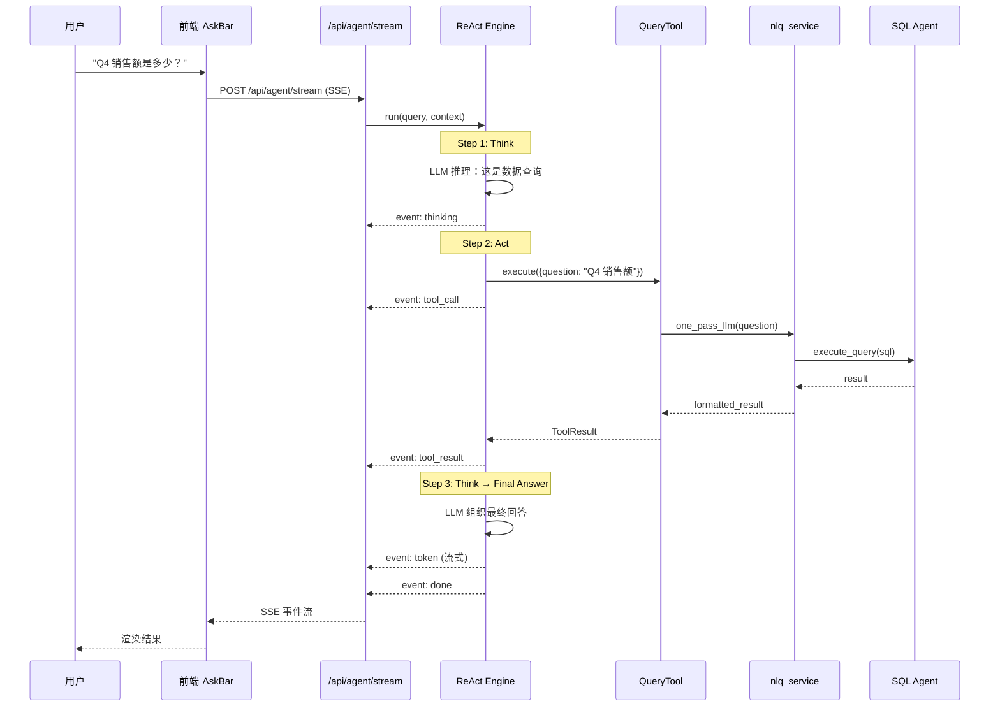
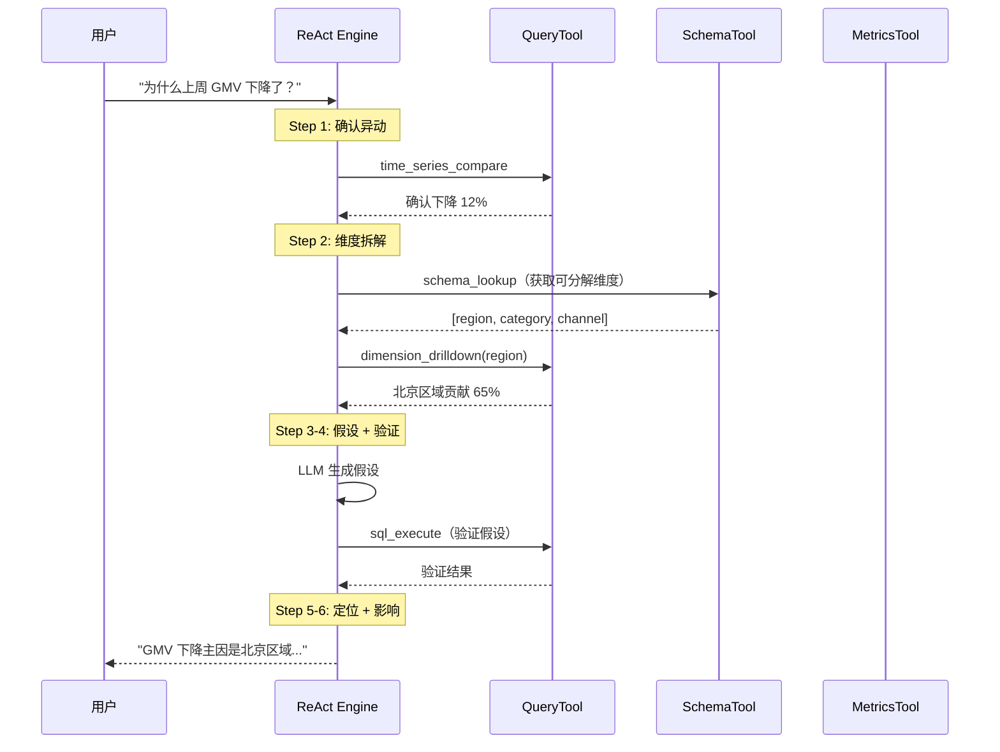

# Data Agent 架构技术规格书

> 版本：v0.2 | 状态：Engineering Spec — minimax 可开发（首页 Agent 灰度迁移已设计于 §15） | 日期：2026-04-28 | 关联 PRD：批次 0 T0.3 待 PM 决策（不阻塞 T2.3 启动）
>
> **变更记录**
> - v0.2（2026-04-28）— 0.5d.1 补丁：§15 首页 Agent 灰度迁移与回滚（4 态 feature flag / 双写规约 / 自动回滚阈值 / 3 意图策略决策树 / `bi_agent_dual_write_audit` + `bi_agent_intent_log` 两张新表 / 5 P0 + 2 P1 测试 / 红线 + 强制清单 + grep + 正错示范）
> - v0.1（2026-04-24）— 初版草稿

---

## 1. 概述

### 1.1 目的

定义 Data Agent 的框架架构，将首页从"直连 NLQ 流水线"升级为"Data Agent 驱动"。Data Agent 是 Mulan BI 平台**唯一面向用户的智能体**，通过 ReAct 循环编排内部工具（NLQ、SQL Agent、Metrics Agent 等），统一处理用户的所有自然语言请求。

本 Spec 聚焦于 **Agent 框架层**（引擎 + 工具注册 + 会话管理 + API 接入），不重复定义 Spec 28 已覆盖的分析能力（归因、报告、洞察）。

### 1.2 范围

| 包含 | 不包含 |
|------|--------|
| ReAct 引擎核心循环 | 归因分析六步流程（见 Spec 28 §5） |
| 工具基类 + 注册表 | 14 个分析工具的详细设计（见 Spec 28 §4） |
| AgentResponse 统一响应模型 | 前端 UI 重构（菜单调整另行处理） |
| 会话 + 步骤持久化模型 | 多租户隔离（复用 Spec 28 §3 方案） |
| 首页 API 接入（替换直连 NLQ） | 主动洞察扫描调度 |
| 真实 SSE 流式输出 | HTTP API Agent 间通信（初期用内部调用） |
| QueryTool 封装（NLQ + SQL Agent）| Viz Agent 实现（Spec 26 Deferred） |

### 1.3 关联文档

| 文档 | 路径 | 关系 |
|------|------|------|
| Data Agent 分析能力 | docs/specs/28-data-agent-spec.md | 工具集 + 归因流程 + 数据模型详细设计 |
| NL-to-Query Pipeline | docs/specs/14-nl-to-query-pipeline-spec.md | QueryTool 封装的上游 |
| SQL Agent | docs/specs/29-sql-agent-spec.md | QueryTool 下游执行器 |
| Metrics Agent | docs/specs/30-metrics-agent-spec.md | MetricsTool 封装对象 |
| LLM 能力层 | docs/specs/08-llm-layer-spec.md | Agent 推理调用底层 |

### 1.4 与 Spec 28 的关系

Spec 28 定义了 Data Agent 的**分析能力**（What it does），本 Spec 定义**框架骨架**（How it runs）。两者关系：

```
Spec 36（本文档）          Spec 28
├── ReAct Engine           ├── 归因分析六步流程
├── BaseTool + Registry    ├── 14 个工具详细设计
├── Session Model          ├── analysis_sessions 表（复用）
├── API + SSE 接入         ├── /api/agents/data/* 端点
└── QueryTool（Phase 1）   └── causation/report/insight 工具（Phase 2+）
```

实施顺序：**先 Spec 36（框架），后 Spec 28（能力）**。

---

## 2. 系统架构

### 2.1 架构定位

Data Agent 是首页的唯一 Agent 入口。所有内部服务（NLQ、SQL Agent、Metrics Agent、Viz Agent）作为 Data Agent 的工具被调用，不直接暴露给用户。

```
┌──────────────────────────────────────────────────┐
│  Frontend Homepage                                │
│  AskBar → SSE /api/agent/stream                  │
└──────────────────────┬───────────────────────────┘
                       │
┌──────────────────────▼───────────────────────────┐
│  Data Agent（services/data_agent/）               │
│                                                   │
│  ┌─────────────┐  ┌──────────────┐               │
│  │ ReAct Engine │  │ Tool Registry│               │
│  │  think()     │  │  register()  │               │
│  │  act()       │  │  get()       │               │
│  │  observe()   │  │  list()      │               │
│  └──────┬──────┘  └──────┬───────┘               │
│         │                │                        │
│  ┌──────▼────────────────▼───────┐               │
│  │        Registered Tools        │               │
│  │  ┌───────────┐ ┌────────────┐ │               │
│  │  │ QueryTool │ │ SchemaTool │ │               │
│  │  └─────┬─────┘ └────────────┘ │               │
│  │  ┌─────┴──────┐ ┌────────────┐│               │
│  │  │MetricsTool │ │ ChartTool  ││               │
│  │  └────────────┘ └────────────┘│               │
│  └───────────────────────────────┘               │
│                                                   │
│  ┌─────────────────────────────────┐             │
│  │ Session Manager                  │             │
│  │  create / resume / persist       │             │
│  └─────────────────────────────────┘             │
└──────────────────────────────────────────────────┘
         │              │              │
    ┌────▼────┐   ┌─────▼─────┐  ┌────▼─────┐
    │nlq_svc  │   │sql_agent  │  │metrics   │
    │(Spec 14)│   │(Spec 29)  │  │(Spec 30) │
    └─────────┘   └───────────┘  └──────────┘
```

### 2.2 工具通信方式

**Phase 1：内部函数调用**

Data Agent 通过 Python import 直接调用内部服务，不引入 HTTP API 层。

```python
# QueryTool 内部调用 nlq_service
from services.llm.nlq_service import one_pass_llm, execute_query
```

理由：
- 当前所有服务在同一进程内，无需网络通信
- 降低初期复杂度，先验证框架正确性
- 未来需要独立部署时再抽 HTTP 层（Spec 28 §2.3 已设计好接口）

### 2.3 目录结构

```
backend/services/data_agent/
├── __init__.py
├── engine.py            # ReAct 引擎核心循环
├── tool_base.py         # BaseTool 抽象类 + ToolRegistry
├── session.py           # 会话管理（创建/恢复/持久化）
├── models.py            # ORM 模型（复用 Spec 28 数据模型）
├── response.py          # AgentResponse 统一响应
├── prompts.py           # Agent 系统提示词
└── tools/
    ├── __init__.py
    ├── query_tool.py    # Phase 1：封装 NLQ + SQL Agent
    ├── schema_tool.py   # Phase 2：元数据查询
    ├── metrics_tool.py  # Phase 2：指标查询
    └── ...              # 后续工具

backend/app/api/
├── agent.py              # Data Agent FastAPI 路由（从 services/ 迁出）
└── ...
```

> api.py 位于 app/api/ 层（非 services/），遵循项目架构约束：services/ 层不依赖 Web 框架。

---

## 3. 核心组件设计

### 3.1 BaseTool 抽象类

```python
from abc import ABC, abstractmethod
from dataclasses import dataclass

@dataclass
class ToolResult:
    success: bool
    data: Any
    error: str | None = None
    execution_time_ms: int = 0

class BaseTool(ABC):
    """所有 Agent 工具的基类"""

    name: str                    # 工具唯一标识
    description: str             # 用于 LLM 选择工具时的描述
    parameters_schema: dict      # JSON Schema，描述输入参数

    @abstractmethod
    async def execute(self, params: dict, context: ToolContext) -> ToolResult:
        """执行工具，返回结果"""
        ...

@dataclass
class ToolContext:
    session_id: str
    user_id: int
    connection_id: int | None
    trace_id: str
```

### 3.2 ToolRegistry

```python
class ToolRegistry:
    """工具注册表，管理所有可用工具"""

    def register(self, tool: BaseTool) -> None: ...
    def get(self, name: str) -> BaseTool: ...
    def list_tools(self) -> list[BaseTool]: ...
    def get_tool_descriptions(self) -> list[dict]:
        """返回所有工具的 name + description + parameters_schema，
        用于构造 LLM 的 system prompt"""
        ...
```

启动时注册：

```python
registry = ToolRegistry()
registry.register(QueryTool())
# Phase 2:
# registry.register(SchemaTool())
# registry.register(MetricsTool())
```

### 3.3 ReAct Engine

```python
class ReActEngine:
    """ReAct 循环：Think → Act → Observe → 重复直到完成"""

    def __init__(self, registry: ToolRegistry, llm_service: LLMService, max_steps: int = 10):
        self.registry = registry
        self.llm = llm_service
        self.max_steps = max_steps

    async def run(
        self,
        query: str,
        context: ToolContext,
        session: AgentSession = None,
    ) -> AsyncGenerator[AgentEvent, None]:
        """
        执行 ReAct 循环，yield 流式事件。

        事件类型：
        - thinking: Agent 的推理过程
        - tool_call: 正在调用的工具及参数
        - tool_result: 工具返回结果
        - answer: 最终回答
        - error: 错误
        """
        history = session.history if session else []
        for step in range(self.max_steps):
            # 1. Think：LLM 根据历史决定下一步
            thought = await self._think(query, history, context)

            yield AgentEvent(type="thinking", content=thought.reasoning)

            # 2. 判断是否可以直接回答
            if thought.action == "final_answer":
                yield AgentEvent(type="answer", content=thought.answer)
                return

            # 3. Act：调用选定的工具
            tool = self.registry.get(thought.tool_name)
            yield AgentEvent(type="tool_call", content={
                "tool": thought.tool_name,
                "params": thought.tool_params,
            })

            result = await tool.execute(thought.tool_params, context)

            # 4. Observe：记录结果
            yield AgentEvent(type="tool_result", content={
                "tool": thought.tool_name,
                "result": result,
            })

        yield AgentEvent(type="answer", content="已达到最大推理步数，基于当前信息给出回答...")
```

> 步骤持久化由 API 层通过 SessionManager.persist_message() 完成，Engine 只负责推理循环。

### 3.4 AgentResponse 统一响应

```python
@dataclass
class AgentResponse:
    answer: str
    type: str           # 'text' | 'table' | 'number' | 'chart_spec' | 'error'
    data: Any           # 额外结构化数据
    trace_id: str
    confidence: float
    tools_used: list[str]
    steps_count: int
    session_id: str
```

### 3.5 AgentEvent 流式事件

```python
@dataclass
class AgentEvent:
    type: str            # 'thinking' | 'tool_call' | 'tool_result' | 'answer' | 'error' | 'metadata'
    content: Any
    timestamp: float = field(default_factory=time.time)
```

---

## 4. 数据模型

### 4.1 会话模型

复用 Spec 28 §3 定义的 `analysis_sessions` + `analysis_session_steps` 表结构。本 Spec 不重复定义。

Phase 1 新增一个轻量会话表，用于对话类交互（不涉及归因/报告的简单问答）：

#### `agent_conversations`

| 列名 | 类型 | 约束 | 说明 |
|------|------|------|------|
| id | UUID | PK | 会话 ID |
| user_id | INTEGER | NOT NULL, FK→auth_users.id | 用户 |
| title | VARCHAR(256) | NULLABLE | 会话标题（首条消息自动生成） |
| connection_id | INTEGER | NULLABLE | 关联的数据源连接 |
| status | VARCHAR(16) | NOT NULL DEFAULT 'active' | active / archived |
| created_at | TIMESTAMP | NOT NULL DEFAULT now() | 创建时间 |
| updated_at | TIMESTAMP | NOT NULL DEFAULT now() | 更新时间 |

#### `agent_conversation_messages`

| 列名 | 类型 | 约束 | 说明 |
|------|------|------|------|
| id | BIGSERIAL | PK | 消息 ID（BIGINT 自增，支持大规模消息量） |
| conversation_id | UUID | NOT NULL, FK→agent_conversations.id | 所属会话 |
| role | VARCHAR(16) | NOT NULL | 'user' / 'assistant' |
| content | TEXT | NOT NULL | 消息内容 |
| response_type | VARCHAR(16) | NULLABLE | text / table / number / chart_spec / error |
| response_data | JSONB | NULLABLE | 结构化响应数据 |
| tools_used | TEXT[] | NULLABLE | 使用的工具列表 |
| trace_id | VARCHAR(64) | NULLABLE | 追踪 ID |
| steps_count | INTEGER | NULLABLE | ReAct 步数 |
| execution_time_ms | INTEGER | NULLABLE | 总执行时间 |
| created_at | TIMESTAMP | NOT NULL DEFAULT now() | 创建时间 |

> 必须使用 BIGSERIAL（非 SERIAL），消息表增长快。

### 4.2 索引策略

| 表 | 索引名 | 列 | 类型 | 用途 |
|----|--------|-----|------|------|
| agent_conversations | ix_ac_user | (user_id, status, updated_at DESC) | BTREE | 用户会话列表 |
| agent_conversation_messages | ix_acm_conv | (conversation_id, created_at) | BTREE | 会话消息时序 |

### 4.3 迁移说明

新建两张表，不影响现有表。使用 Alembic：

```bash
cd backend && alembic revision --autogenerate -m "add_agent_conversations_and_messages"
```

---

## 5. API 设计

### 5.1 端点总览

| 方法 | 路径 | 说明 | 认证 | 角色 |
|------|------|------|------|------|
| POST | /api/agent/stream | Agent 对话（SSE 流式） | 需要 | analyst+ |
| GET | /api/agent/conversations | 会话列表 | 需要 | analyst+ |
| GET | /api/agent/conversations/{id}/messages | 会话消息 | 需要 | analyst+ |
| DELETE | /api/agent/conversations/{id} | 归档会话 | 需要 | analyst+ |

> 非流式端点不提供。客户端统一使用 SSE，前端可选择忽略中间事件只取 done。

### 5.2 核心端点：POST /api/agent/stream

**请求：**

```json
{
  "question": "Q4 销售额是多少？",
  "conversation_id": "uuid（可选，续接已有会话）",
  "connection_id": 1
}
```

**SSE 响应事件流：**

```
data: {"type": "metadata", "conversation_id": "uuid-new"}

data: {"type": "thinking", "content": "用户在问销售数据，需要使用查询工具..."}

data: {"type": "tool_call", "tool": "query", "params": {"question": "Q4 销售额"}}

data: {"type": "tool_result", "tool": "query", "summary": "查询完成，共 1 条结果"}

data: {"type": "token", "content": "Q4"}
data: {"type": "token", "content": "销售额"}
data: {"type": "token", "content": "为"}
data: {"type": "token", "content": "3,200"}
data: {"type": "token", "content": "万元。"}

data: {"type": "done", "answer": "Q4 销售额为 3,200 万元。", "trace_id": "t-xxx", "tools_used": ["query"], "response_type": "number", "response_data": {"value": 32000000, "unit": "元"}, "steps_count": 2, "execution_time_ms": 1500}
```

### 5.3 与现有 API 的关系

| 现有端点 | 处理方式 |
|---------|---------|
| GET /api/chat/stream | Phase 1b 迁移：内部转发到 POST /api/agent/stream |
| POST /api/ask-data | Phase 1b 迁移：内部转发到 POST /api/agent/stream |
| POST /api/search/query | 保留，作为 QueryTool 的内部调用目标 |
| POST /api/query/ask | 保留，独立的 Tableau 问数链路 |

> Phase 1 只建新端点，Phase 1b 再做旧端点转发和前端切换。

### 5.4 错误响应

```json
{
  "error_code": "AGENT_001",
  "message": "Agent 执行超时",
  "detail": {"step": 8, "last_tool": "query", "trace_id": "t-xxx"}
}
```

---

## 6. 错误码

| 错误码 | HTTP | 说明 | 触发条件 |
|--------|------|------|---------|
| AGENT_001 | 504 | Agent 执行超时 | ReAct 循环超过 max_steps 或总时间超限 |
| AGENT_002 | 400 | 无法理解的请求 | LLM 多次推理仍无法确定意图 |
| AGENT_003 | 500 | 工具执行失败 | 注册的工具抛出异常 |
| AGENT_004 | 404 | 会话不存在 | conversation_id 无效或不属于当前用户 |
| AGENT_005 | 403 | 无权限 | 用户角色不满足 analyst+ |
| AGENT_006 | 503 | LLM 服务不可用 | LLM 调用失败（超时/配额/网络） |
| AGENT_007 | 400 | 请求参数非法 | conversation_id 格式错误、question 为空等 |

---

## 7. 业务逻辑

### 7.1 ReAct 循环约束

| 约束 | 值 | 说明 |
|------|-----|------|
| max_steps | 10 | 单次对话最大推理步数 |
| step_timeout | 30s | 单步执行超时 |
| total_timeout | 120s | 整次对话总超时 |
| max_tool_retries | 1 | 工具失败后重试次数 |

### 7.2 意图识别策略

Data Agent 使用 LLM 内置推理做意图识别，不做独立的分类器。

ReAct 的第一步 Think 自然包含意图判断：
- "这是一个数据查询" → 调 QueryTool
- "这是一个闲聊" → 直接回答，不调工具
- "这需要分析原因" → 调归因工具链（Phase 2）

### 7.3 对话上下文

多轮对话通过 `conversation_id` 关联。Engine 加载历史消息构建 LLM 上下文：

- 最近 N 条消息（默认 10）作为 chat history
- 工具调用结果作为上下文
- 超出窗口的历史：Phase 1 截断为最近 10 条，Phase 2 引入摘要压缩

---

## 8. 安全

### 8.1 角色权限矩阵

| 操作 | admin | data_admin | analyst | user |
|------|-------|-----------|---------|------|
| 使用 Agent 对话 | Y | Y | Y | N |
| 查看自己的会话 | Y | Y | Y | N |
| 查看他人会话 | Y (Phase 3) | N | N | N |
| 删除会话 | Y（所有） | 自己 | 自己 | N |

> admin 跨用户会话管理在 Phase 3 监控页面实现，Phase 1 所有用户只能操作自己的会话。

### 8.2 工具执行安全

- 工具只能访问用户有权限的数据源（connection_id 校验）
- SQL 执行走 SQL Agent 安全校验（Spec 29 sqlglot AST 检查）
- 工具输出视为**惰性证据**，不作为可执行指令（防 prompt injection）
- LLM 返回的工具参数做 JSON Schema 校验后再执行
- LLM 返回的工具参数先做 JSON Schema 校验（jsonschema.validate），校验失败返回 AGENT_002
- connection_id 权限校验：Phase 1 信任 API 层传入的 connection_id（已通过角色检查），Phase 2 增加数据源归属校验

---

## 9. 集成点

### 9.1 上游依赖

| 模块 | 接口 | 用途 |
|------|------|------|
| LLM Service (Spec 08) | `complete()` | Agent 推理调用 |
| Auth (Spec 04) | `get_current_user` | 用户认证 + 权限 |

### 9.2 下游消费者（作为工具）

| 模块 | 调用方式 | 说明 |
|------|---------|------|
| NLQ Service (Spec 14) | 内部函数调用 | QueryTool 封装 |
| SQL Agent (Spec 29) | 内部函数调用 | QueryTool 下游 |
| Metrics Agent (Spec 30) | 内部函数调用 | MetricsTool 封装（Phase 2） |

---

## 10. 时序图

### 10.1 Phase 1 典型查询流程



### 10.2 Phase 2 归因分析流程



---

## 11. 分阶段实施

### Phase 0：框架搭建

**目标**：`services/data_agent/` 骨架可运行，不接入首页。

| 任务 | 产出 |
|------|------|
| BaseTool + ToolRegistry | tool_base.py |
| ReAct Engine 核心循环 | engine.py |
| AgentResponse + AgentEvent | response.py |
| Agent 系统提示词 | prompts.py |
| 单元测试（mock 工具） | tests/test_data_agent_engine.py |

### Phase 1a：QueryTool + 首页接入（已完成）

**目标**：首页通过 Data Agent 问数据，用户体感不变。

| 任务 | 产出 |
|------|------|
| QueryTool 实现（封装 nlq_service + sql_agent） | tools/query_tool.py |
| agent_conversations + messages 表 | Alembic 迁移 |
| Session Manager | session.py |
| POST /api/agent/stream 端点 | api.py |

**验收标准**：首页问"Q4 销售额是多少"→ Data Agent → QueryTool → NLQ → 返回正确结果。

### Phase 1b：迁移

| 任务 | 产出 |
|------|------|
| api.py 从 services/ 迁移到 app/api/agent.py | 遵循架构约束 |
| chat.py / ask_data.py 内部转发到 Agent | 兼容现有前端 |
| 端到端测试 | tests/test_data_agent_e2e.py |

### Phase 2：补齐工具

| 工具 | 优先级 | 依赖 |
|------|--------|------|
| SchemaTool（元数据查询） | P0 | 语义层元数据 |
| MetricsTool（指标查询） | P1 | metrics_agent |
| CausationTool（归因分析） | P1 | SchemaTool + Spec 28 六步流程 |
| ChartTool（图表 spec） | P2 | Spec 26 Viz Agent |

### Phase 3：可观测性

| 任务 | 说明 |
|------|------|
| Agent 运行日志表 | bi_agent_runs / bi_agent_steps |
| 反馈收集 | bi_agent_feedback（复用现有反馈 API） |
| 平台域 Agent 监控页 | 调用量 / 成功率 / P95 |

---

## 12. 测试策略

### 12.1 关键场景

| # | 场景 | 预期 | 优先级 |
|---|------|------|--------|
| 1 | 简单数据查询（"Q4 销售额"） | Agent 调 QueryTool 返回数字 | P0 |
| 2 | 闲聊（"你好"） | Agent 直接回答，不调工具 | P0 |
| 3 | 工具执行失败 | 返回友好错误，不暴露内部细节 | P0 |
| 4 | 超过 max_steps | 基于已有信息给出回答 | P1 |
| 5 | 多轮对话上下文 | 第二轮能引用第一轮结果 | P1 |
| 6 | 无权限数据源 | 返回 403 | P0 |
| 7 | LLM 服务不可用 | 返回 503 + 降级提示 | P1 |
| 8 | SSE 连接中断 | 客户端可重连续接 | P2 |

### 12.2 验收标准

- [ ] ReAct Engine 单元测试通过（mock 工具）
- [ ] QueryTool 集成测试通过（调用真实 NLQ 服务）
- [ ] SSE 流式事件格式符合 §5.2 定义
- [ ] 多轮对话上下文正确传递
- [ ] 现有首页功能无回归（`/api/chat/stream` 透传正常）

### 12.3 Mock 与测试约束

- **ReAct Engine 单元测试**：所有工具 mock 为 `AsyncMock`，返回固定 `ToolResult`；断言 Engine 在 `max_steps` 内终止，思考链和工具调用序列正确
- **QueryTool 集成测试**：调用真实 `nlq_service.query()`，不 mock LLM；断言返回数据结构符合 VizQL 响应格式
- **SSE 测试**：使用 `httpx.AsyncClient` 的 `stream()` 方法消费 SSE 事件，断言事件类型序列为 `thinking → tool_call → tool_result → ... → done`
- **Session Manager 不可 mock**：会话读写必须使用真实数据库，验证 `agent_conversations` / `agent_conversation_messages` 表写入
- **LLM 不可用降级**：mock `LLMService.complete()` 抛出异常，断言 Agent 返回 `AGT_002` 错误码和友好提示
- **Playwright mock**：`page.route('**/api/agent/stream')` 返回 SSE mock 时，`answer` 文本必须出现在 DOM 断言中

---

## 13. 开放问题

| # | 问题 | 状态 |
|---|------|------|
| 1 | Phase 1 是否保留现有 API | 已决定：Phase 1 并存，Phase 1b 做转发 |
| 2 | thinking 事件是否暴露给前端 | 已决定：暴露，前端可选择隐藏 |
| 3 | 会话历史是否与 query_sessions 合并 | 已决定：独立，不合并 |
| 4 | LLM purpose 配置 | 已决定：优先 agent purpose，fallback 到 general |

---

## 14. 开发交付约束

> 通用约束见 `.claude/rules/dev-constraints.md`（自动加载），以下为 Agent 架构模块特有约束。

### 架构红线（违反 = PR 拒绝）

1. **services/data_agent/ 层无 Web 框架依赖** — Engine、Tool、Session 均在 services 层，不得 import FastAPI/Request/Response
2. **工具注册必须通过 ToolRegistry** — 禁止在 Engine 中硬编码工具列表，新工具必须通过 `@register_tool` 装饰器注册
3. **ReAct 循环有上限** — `max_steps` 必须有默认值且不可无限循环，超限时基于已有信息回答
4. **SSE 事件格式不可变** — `thinking` / `tool_call` / `tool_result` / `done` / `error` 事件类型定义后不可在 Phase 内变更
5. **Agent API 与 chat API 独立** — `POST /api/agent/stream` 和 `POST /api/chat/stream` 共存，Phase 1b 做转发但不合并端点
6. **所有用户可见文案为中文**

### SPEC 36 强制检查清单

- [ ] `services/data_agent/` 不 import `fastapi` 或 `starlette`
- [ ] 所有工具通过 `ToolRegistry.register()` 注册
- [ ] `max_steps` 默认值存在且 ≤ 10
- [ ] SSE 事件类型覆盖 `thinking` / `tool_call` / `tool_result` / `done` / `error`
- [ ] `agent_conversations` / `agent_conversation_messages` 表前缀为 `agent_`
- [ ] Phase 1b 完成后 `/api/chat/stream` 转发到 Agent，不直接删除

### 验证命令

```bash
# 检查 services/ 层无 Web 框架依赖
grep -r "from fastapi\|from starlette" backend/services/data_agent/ && echo "FAIL: web framework in services/" || echo "PASS"

# 检查工具注册模式
grep -r "register_tool\|ToolRegistry" backend/services/data_agent/tools/ | head -5

# 检查 max_steps 存在
grep -r "max_steps" backend/services/data_agent/engine.py || echo "FAIL: no max_steps"
```

### 正确 / 错误示范

```python
# ❌ 错误：Engine 中硬编码工具
class DataAgentEngine:
    tools = [QueryTool(), SchemaTool(), MetricsTool()]

# ✅ 正确：通过 ToolRegistry 注入
class DataAgentEngine:
    def __init__(self, tool_registry: ToolRegistry):
        self.tools = tool_registry.get_all()

# ❌ 错误：无限循环
while True:
    result = await llm.complete(prompt)
    ...

# ✅ 正确：有上限
for step in range(self.max_steps):
    result = await llm.complete(prompt)
    if result.is_final:
        break
else:
    return self._summarize_partial(observations)
```

---

## 15. 首页 Agent 灰度迁移与回滚

> 本节为 v2 plan 批次 0.5d.1 增量补章，覆盖模板符合度审计中识别的"首页 Agent 驱动迁移开关 / 双写 / 回滚未列；意图识别仅给策略名"两项缺口。下游阻塞 T2.3 首页 Agent 驱动验证。
>
> 范围：仅约束 **首页 AskBar → Agent / NLQ** 这一对入口的迁移行为。其他链路（chat / ask-data）按 §11 Phase 1b 单独转发，不在本节灰度模型内。

### 15.A 灰度开关（Feature Flag）

| 项 | 值 |
|----|----|
| 名称 | `HOMEPAGE_AGENT_MODE` |
| 存储位置（首选） | `platform_settings` 表（见 Spec 37 §平台设置）键 `homepage_agent_mode` |
| 兜底 | 进程启动时若 `platform_settings` 不可读，回退到环境变量 `HOMEPAGE_AGENT_MODE_FALLBACK`（仅供本机故障兜底，禁止业务代码直接读） |
| 切换粒度 | 全局值 + 单用户 override（`platform_settings` 中 key=`homepage_agent_mode_user_override`，value=`{user_id: mode}`） |
| 切换生效 | 30 秒内热更（settings 缓存 TTL=30s），无需重启 |
| 默认值 | `agent_with_fallback` |

**取值定义**：

| 取值 | 行为 | 入口端点 |
|------|------|---------|
| `legacy_only` | 仅旧 NLQ 直连路径（`/api/search/query`）；Agent 入口对前端隐藏 | `/api/search/query` |
| `dual_write` | 同一请求双路并发：Agent + NLQ；以 Agent 结果为准呈现给前端，NLQ 结果仅落审计表用于差异比对 | `/api/agent/stream`（前台）+ `/api/search/query`（影子） |
| `agent_only` | 仅 Agent 路径；NLQ 入口下线（保留为 QueryTool 内部调用对象） | `/api/agent/stream` |
| `agent_with_fallback`（默认） | Agent 优先；触发 §15.C 软降级条件时单请求级 fallback NLQ | `/api/agent/stream`，失败时内部代理到 `/api/search/query` |

**优先级**：单用户 override > 全局值。Override 仅 admin 可写（走 audit log，actor=admin）。

### 15.B 双写规约（`dual_write` 模式专用）

1. **trace_id 单源**：API 入口生成 1 个 `trace_id`，同时下发给 Agent 路径与 NLQ 路径；任一路径自行生成 trace_id 视为违规（见 §15.G 红线 2）。
2. **并发执行**：两路通过 `asyncio.gather(return_exceptions=True)` 并发；单路超时 30s，任一路超时不阻塞另一路。
3. **结果取舍**：前端只收到 Agent 路径的 SSE 流；NLQ 结果到达后只写 `bi_agent_dual_write_audit`，不影响前台。
4. **结果对比落表**（见 §15.E `bi_agent_dual_write_audit`）：
   - `result_hash` 算法统一在 `services/agent/dual_write/hashing.py`：对 NLQ / Agent 的最终回答规范化（去空白、统一数字精度到 4 位、按列排序的 JSON）后 SHA256。
   - `divergence_kind` 取值：`match` / `partial`（数值差 < 1%）/ `mismatch` / `one_failed` / `both_failed`。
5. **聚合报表**：admin 平台域 Agent 监控页（§11 Phase 3）每日聚合：分歧率、Agent 失败率、Agent 相对 NLQ 的 P50 / P95 延迟差。
6. **自动降级阈值**：Agent 失败率（`one_failed` 中 Agent 侧失败 + `both_failed` 计入分子）连续 2 小时滚动窗口 > 5% → 自动切 `legacy_only`（仅人工可解除，见 §15.C）。

### 15.C 回滚路径

| 触发条件 | 行为 | RTO |
|----------|------|-----|
| Agent 失败率告警（§15.B 阈值） | 自动写 `platform_settings.homepage_agent_mode = legacy_only` + 站内通知 admin（复用 Spec 16 通知通道） | < 60 秒 |
| Agent 引擎健康探针 3 次连续失败 | 先自动 `agent_with_fallback`，仍失败则 `legacy_only` | < 90 秒 |
| 主动回滚（admin 操作） | admin UI 提交 → `platform_settings` 改写 → 30s 内生效 | 立即（生效 ≤ 30s） |
| 前端 SSE 断流 ≥ 5 次/分钟 | 不切模式，仅写 `bi_events`（type=`agent_sse_drop`），由 admin 决定 | — |

> 自动回滚必须写 audit log（actor=`system`，原因=阈值告警 + 触发指标快照），见 §15.G 红线 4。
> 自动切 `legacy_only` 后**仅允许 admin 在 UI 上手动解除**，禁止再次自动恢复，避免抖动。

### 15.D 意图识别策略（替代 §7.2 "仅 LLM 推理"陈述，作为 Phase 1b 起的正式实现）

> 替换原"仅给策略名"的描述，每种策略给出判定输入 / 输出 / 决策方式。Phase 1a 仍可走 §7.2 的 LLM 内置推理，Phase 1b 起切换到本节的策略链。

| 策略 | 输入 | 输出意图集合 | 判定方式 |
|------|------|-------------|---------|
| `keyword_match` | `user_message`（仅当前一轮） | `attribution` / `report` / `lookup` / `chat` / `unknown` | 关键词正则白名单（配置于 `services/data_agent/intent/keywords.yaml`） + 优先级：attribution > report > lookup > chat |
| `llm_classify` | `user_message` + 最近 N=5 轮对话上下文 | 同上 | LLM 单次调用，prompt 模板 `INTENT_CLASSIFY_TEMPLATE`，`response_format=json`，`temperature=0.1`，输出 `{intent, confidence}` |
| `context_aware` | `user_message` + 上一轮工具调用 metadata | 同上 + `continuation` | 若上轮主调用是 `report` 且本轮 `len(user_message) < 10`，直接判定 `continuation`；否则透传给下一级策略 |

**组合规则（fallback 链）**：

```
context_aware → keyword_match → llm_classify → fallback("chat")
```

- 任一级策略输出 `unknown` 或置信度 < 0.6 → 进入下一级。
- `llm_classify` 调用失败（超时 / 配额）→ 直接 fallback `chat`，不再重试。
- 置信度 < 0.6 时即使有意图也强制走 `chat`，不调归因 / 报告引擎，避免误触发高成本工具链。
- **冷启动**（首条消息，无上下文）：跳过 `context_aware`，从 `keyword_match` 开始。

**审计**：每次意图识别（含每一级 fallback）写一条 `bi_agent_intent_log`（见 §15.E），`fallback_chain` 字段以 `→` 连接（如 `context_aware→keyword→llm→chat`）。

**策略注册**：所有策略实现 `IntentStrategy` 抽象类，通过 `IntentStrategyRegistry.register()` 注册；新增策略必须同步补本节表格（见 §15.G 强制检查清单）。

### 15.E 新增数据表

#### `bi_agent_dual_write_audit`

| 列 | 类型 | 约束 | 说明 |
|----|------|------|------|
| id | BIGINT | PK, IDENTITY | |
| trace_id | VARCHAR(64) | UNIQUE, INDEX | 与 Agent / NLQ 两路共享 |
| user_id | INTEGER | NOT NULL, FK→auth_users.id, INDEX | |
| nlq_result_hash | VARCHAR(64) | NULL | NLQ 路径失败时为 NULL |
| agent_result_hash | VARCHAR(64) | NULL | Agent 路径失败时为 NULL |
| nlq_latency_ms | INT | NULL | |
| agent_latency_ms | INT | NULL | |
| divergence_kind | VARCHAR(16) | NOT NULL, INDEX | match / partial / mismatch / one_failed / both_failed |
| created_at | TIMESTAMP | NOT NULL DEFAULT now() | |

- 按月分区，遵循 Spec 16 §2.1 分区约定（`PARTITION BY RANGE (created_at)`）。
- 保留期 30 天；分区清理脚本与 `bi_events` 复用同一 Beat 任务（见 §15.G 强制检查清单）。

#### `bi_agent_intent_log`

| 列 | 类型 | 约束 | 说明 |
|----|------|------|------|
| id | BIGINT | PK, IDENTITY | |
| trace_id | VARCHAR(64) | INDEX | 与首页请求 trace_id 一致 |
| strategy | VARCHAR(16) | NOT NULL | keyword_match / llm_classify / context_aware |
| input_excerpt | VARCHAR(256) | NULL | 输入 user_message 截断到 256 字符（含中英文） |
| output_intent | VARCHAR(32) | INDEX | 见 §15.D 意图集合 |
| confidence | NUMERIC(4,3) | NULL | `keyword_match` 无置信度时为 NULL |
| fallback_chain | VARCHAR(64) | NULL | 形如 `keyword→llm→chat` |
| created_at | TIMESTAMP | NOT NULL DEFAULT now(), INDEX | |

- 不分区（增长可控）；保留期 90 天，由独立 Beat 任务清理。

### 15.F 测试 P0 / P1

| # | 优先级 | 场景 | 预期 |
|---|--------|------|------|
| 15F-1 | P0 | 灰度模式四态切换 | 每种模式下首页问数路径符合 §15.A 表（端到端 e2e，覆盖 SSE） |
| 15F-2 | P0 | `dual_write` 下 Agent 失败 NLQ 成功 | 前端展示 Agent 错误（不静默偷换为 NLQ 结果），审计表 `divergence_kind=one_failed` |
| 15F-3 | P0 | 阈值告警自动回滚 | 注入 Agent 失败率 6%，60 秒内 `platform_settings` 自动改为 `legacy_only`，audit log 写入 |
| 15F-4 | P0 | 意图三级 fallback 链路日志 | `keyword_match → llm_classify → chat`，三条 `bi_agent_intent_log` 记录，`fallback_chain` 正确 |
| 15F-5 | P0 | trace_id 单源贯穿 | 双路 + 意图识别 + step run 共用同一 `trace_id`，所有日志可关联 |
| 15F-6 | P1 | 单用户 override | admin 给 user_X 切 `agent_only`，user_X 走 Agent，user_Y 仍按全局值 |
| 15F-7 | P1 | SSE 断流计数不切模式 | 5 次/分钟 SSE 断流写入 `bi_events`，全局 `homepage_agent_mode` 不变 |

### 15.G 开发交付约束

> 复用 §14 的通用约束，本节为首页 Agent 迁移特有约束。

#### 架构红线（违反 = PR 拒绝）

1. `HOMEPAGE_AGENT_MODE` 唯一读取入口为 `services/platform_settings.get('homepage_agent_mode')`；业务代码（含 `app/api/agent.py`、`services/data_agent/**`）禁止直接读 `os.environ['HOMEPAGE_AGENT_MODE*']`
2. 双写路径必须共用一个 `trace_id`，由 API 入口生成；Agent / NLQ 任一路径生成新 trace_id 视为违规
3. 双写结果对比的 `result_hash` 算法在 `services/agent/dual_write/hashing.py` **唯一**实现；其他位置出现等价算法（独立 SHA256 + 自定义规范化）视为违规
4. 自动回滚操作必须写 audit log（actor=`system`，原因=阈值告警 + 指标快照 JSON）
5. 意图识别 `fallback_chain` 必须落 `bi_agent_intent_log`；禁止只在内存中转或仅打 logger.info

#### 强制检查清单

- [ ] 灰度开关四态（`legacy_only` / `dual_write` / `agent_only` / `agent_with_fallback`）有 e2e 测试
- [ ] 自动回滚路径有混沌测试（注入 Agent 失败率超阈值）
- [ ] `bi_agent_dual_write_audit` 分区脚本与 `bi_events` 同步加入 Beat 任务（不引入第二份调度）
- [ ] 新增意图策略必须在 `IntentStrategyRegistry` 注册，并补本 spec §15.D 表
- [ ] `platform_settings.homepage_agent_mode` 写操作有 admin 角色校验

#### 验证命令

```bash
cd backend && pytest tests/services/test_homepage_agent_mode.py -x
cd backend && pytest tests/services/test_agent_intent.py -x
cd backend && pytest tests/integration/test_dual_write_audit.py -x

# 红线 1：禁止业务代码直接读 env 中的 HOMEPAGE_AGENT_MODE
! grep -rE "os\.environ.*HOMEPAGE_AGENT_MODE" backend/app backend/services/data_agent backend/services/agent

# 红线 2：双写路径不得自行生成 trace_id
! grep -rE "uuid\.uuid4|secrets\.token_hex" backend/services/agent/dual_write

# 红线 3：result_hash 实现唯一
test "$(grep -rl 'def result_hash' backend/services backend/app | wc -l | tr -d ' ')" = "1"
```

### 15.H 开放问题

| # | 问题 | 优先级 | 备注 |
|---|------|--------|------|
| HA-A | `dual_write` 阶段持续多久 | P1 | 建议 2 周；视 §15.B 分歧率收敛情况调整 |
| HA-B | divergence > 30% 时是否阻塞 `agent_only` 切换 | P1 | 倾向阻塞，但需要 admin 一键 override |
| HA-C | 多用户并发 override 与全局开关冲突解决 | P2 | 当前规则：用户 override > 全局；冲突仅在 admin 误操作时出现 |
| HA-D | 意图识别 LLM 调用成本归因 | P2 | 依赖 Spec 20 OI-D（capability wrapper 计费维度） |

