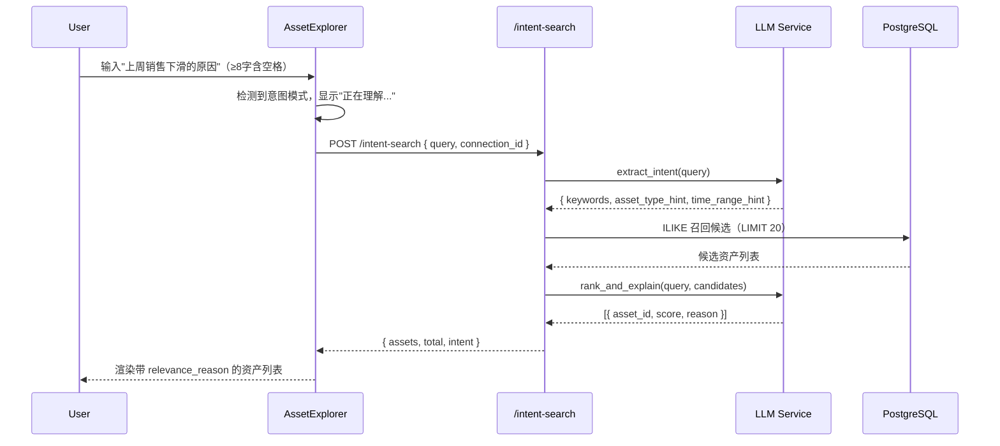

# Tableau 资产意图搜索 技术规格书

> 版本：v0.1 | 状态：草稿 | 日期：2026-05-08 | 关联提案：docs/DEV_PROGRESS.md（Agentic Tableau 三向升级）

---

## 1. 概述

### 1.1 目的

将 Tableau 资产列表页的关键词搜索升级为自然语言意图查询，使用户可以输入"上周销售下滑的原因"等业务语言直接找到语义相关资产，而不依赖记忆资产名称。

### 1.2 范围

- **包含**：后端意图提取 + 语义搜索服务；前端搜索框意图模式；结果相关原因展示
- **不包含**：对现有关键词搜索路径（`/assets/search`）的任何修改；AI 摘要的生成逻辑；分页

### 1.3 关联文档

| 文档 | 路径 | 关系 |
|------|------|------|
| 现有资产 SPEC | docs/specs/07-tableau-mcp-v1-spec.md | 上游，提供 `tableau_assets` 数据模型 |
| NLQ Pipeline SPEC | docs/specs/14-nl-to-query-pipeline-spec.md | LLM 调用模式参考 |
| LLM Layer SPEC | docs/specs/08-llm-layer-spec.md | `llm_service` 调用规范 |

---

## 2. 数据模型

无新增表。复用 `tableau_assets` 中已有字段：

| 字段 | 用途 |
|------|------|
| `name` | 资产名称匹配 |
| `project_name` | 项目名称匹配 |
| `ai_summary` | 主要语义匹配字段，NULL 则跳过该资产 |
| `ai_explain` | 补充语义匹配字段 |
| `asset_type` | LLM 提取类型偏好后作为过滤条件 |
| `connection_id` | 租户隔离，必须传入 |

---

## 3. API 设计

### 3.1 端点总览

| 方法 | 路径 | 说明 | 认证 | 角色 |
|------|------|------|------|------|
| POST | `/api/tableau/assets/intent-search` | 自然语言意图搜索 | 需要 | analyst+ |

### 3.2 请求/响应 Schema

#### `POST /api/tableau/assets/intent-search`

**请求体：**
```json
{
  "query": "上周销售下滑的原因",
  "connection_id": "uuid-string"
}
```

**响应 (200)：**
```json
{
  "assets": [
    {
      "id": "uuid",
      "name": "Sales Performance Dashboard",
      "asset_type": "dashboard",
      "project_name": "Revenue Analytics",
      "health_score": 72,
      "ai_summary": "...",
      "relevance_reason": "该仪表板包含销售趋势分析和周环比指标，与销售下滑分析直接相关",
      "view_count": 340
    }
  ],
  "total": 5,
  "intent": {
    "keywords": ["销售", "下滑", "原因"],
    "asset_type_hint": "dashboard",
    "time_range_hint": "上周"
  }
}
```

**错误响应：**
```json
{ "error_code": "TAB_IS_001", "message": "意图解析失败，请重试", "detail": {} }
{ "error_code": "TAB_IS_002", "message": "connection_id 无效或无权访问", "detail": {} }
```

---

## 4. 业务逻辑

### 4.1 处理流程

```
POST /api/tableau/assets/intent-search
  │
  ├─ 1. 权限校验：当前用户有访问 connection_id 的权限
  │
  ├─ 2. LLM 意图提取（intent_search_service.extract_intent）
  │     输入：query
  │     输出：{ keywords: [...], asset_type_hint: str|None, time_range_hint: str|None }
  │     Prompt 策略：zero-shot，要求 JSON 输出，失败 fallback 到将 query 直接作为关键词列表
  │
  ├─ 3. 语义候选召回（intent_search_service.recall_candidates）
  │     - 用 keywords 对 name、project_name、ai_summary、ai_explain 做 ILIKE 联合查询
  │     - WHERE ai_summary IS NOT NULL（跳过无摘要资产）
  │     - 若 asset_type_hint 非空，作为 AND 条件
  │     - LIMIT 20（召回上限，后续 LLM 排序）
  │
  ├─ 4. LLM 相关性排序 + 原因生成（intent_search_service.rank_and_explain）
  │     输入：query + 候选资产列表（id + name + ai_summary 前 200 字）
  │     输出：[{ asset_id, relevance_score, relevance_reason }]，取 top_k=8
  │     Prompt 策略：一次调用完成排序 + 原因，输出 JSON array
  │
  └─ 5. 组装响应：按 relevance_score 降序，合并完整资产数据
```

### 4.2 约束

- 全流程最大耗时预算：8 秒（超时返回 TAB_IS_001）
- LLM 意图提取失败不阻断：fallback 到 `keywords = [query]`，直接进入召回
- 候选资产数为 0 时：跳过步骤 4，直接返回空列表，不调用 LLM
- `connection_id` 必须传入，不支持跨连接搜索

---

## 5. 错误码

| 错误码 | HTTP | 触发条件 |
|--------|------|---------|
| TAB_IS_001 | 500 | LLM 排序调用超时或全部失败 |
| TAB_IS_002 | 403 | connection_id 无效或用户无权限 |

---

## 6. 安全

### 6.1 角色权限矩阵

| 操作 | admin | data_admin | analyst | user |
|------|-------|-----------|---------|------|
| 意图搜索 | Y | Y | Y | N |

### 6.2 输入校验

- `query` 最大长度 200 字符，超出截断
- `connection_id` 必须为合法 UUID 且属于当前 tenant

---

## 7. 集成点

### 7.1 上游依赖

| 模块 | 接口 | 用途 |
|------|------|------|
| LLM Layer | `llm_service.complete_for_semantic()` | 意图提取 + 排序 |
| `tableau_assets` 表 | SQLAlchemy ORM | 候选召回 |
| Auth | `get_current_user` | 权限校验 |

### 7.2 前端交互

搜索框触发条件：用户输入长度 ≥ 8 且包含空格（自动切换意图模式），或手动按 `⌘/` 切换。结果列表每行在资产名下方新增一行淡色 `relevance_reason` 文字（单行截断，字体 12px）。

---

## 8. 时序图



---

## 9. 测试策略

### 9.1 关键场景

| # | 场景 | 预期 | 优先级 |
|---|------|------|--------|
| 1 | 正常意图查询，命中 ai_summary 包含相关词的资产 | 返回 ≥1 资产，含 relevance_reason | P0 |
| 2 | 查询无任何 ai_summary 资产的连接 | 返回空列表，不报错 | P0 |
| 3 | LLM 意图提取超时 | fallback 到关键词召回，返回结果 | P1 |
| 4 | connection_id 无效 | 返回 TAB_IS_002 | P0 |
| 5 | query 超过 200 字符 | 截断后正常处理 | P1 |
| 6 | 前端：输入 5 个字符，不触发意图模式 | 走原有关键词搜索 | P0 |
| 7 | 前端：输入 ≥8 字含空格，切换意图模式，显示 relevance_reason | 渲染正确 | P0 |

### 9.2 验收标准

- [ ] `POST /api/tableau/assets/intent-search` 正常返回 `assets` + `intent` 字段
- [ ] `relevance_reason` 每个资产均有非空字符串
- [ ] 无 `ai_summary` 的资产不出现在结果中
- [ ] LLM 失败时 fallback 路径有效（不 500）
- [ ] 前端意图模式触发条件正确（≥8 字含空格）
- [ ] 前端结果行展示 `relevance_reason`，截断 overflow

### 9.3 Mock 与测试约束

- **`intent_search_service.extract_intent`**：调用 `llm_service.complete_for_semantic()`，测试时用 `unittest.mock.patch` 替换整个 `complete_for_semantic` 方法，返回预设 JSON 字符串
- **`intent_search_service.rank_and_explain`**：同上，patch LLM 调用
- **SQLAlchemy Session**：使用同步 Session，mock `db.execute` 返回 `MagicMock` 即可，不需要 AsyncMock
- **前端测试**：用 Vitest + `vi.fn()` mock `intentSearchAssets` API 函数，断言 `relevance_reason` 文本出现在 DOM

---

## 10. 开放问题

| # | 问题 | 状态 |
|---|------|------|
| 1 | rank_and_explain 的 LLM prompt 是否需要注入 `time_range_hint`（模型不能真正查询历史数据） | 确认：注入提示词但不执行时间过滤，让模型在 reason 中说明 |

---

## 11. 开发交付约束

### 11.1 架构约束

- `intent_search_service.py` 放在 `backend/services/tableau/` 下，不得 import `app.api` 层
- LLM 调用必须使用 `from services.llm.llm_service import get_llm_service`，不得直接初始化 LLM 客户端
- 召回 SQL 必须使用 SQLAlchemy `text()` + 绑定参数，禁止 f-string 拼接

### 11.2 强制检查清单

- [ ] 新 endpoint 已注册到 `app/api/tableau.py` 的 `router`
- [ ] LLM fallback 路径有 pytest 测试覆盖
- [ ] 前端 `intentSearchAssets` 函数在 `src/api/tableau.ts` 中声明（类型安全）
- [ ] 前端无硬编码 `localhost:8000`

### 11.3 验证命令

```bash
cd backend && python3 -m py_compile services/tableau/intent_search_service.py
cd backend && pytest tests/test_intent_search.py -x -q
cd frontend && npm run type-check
cd frontend && npm run lint
```
