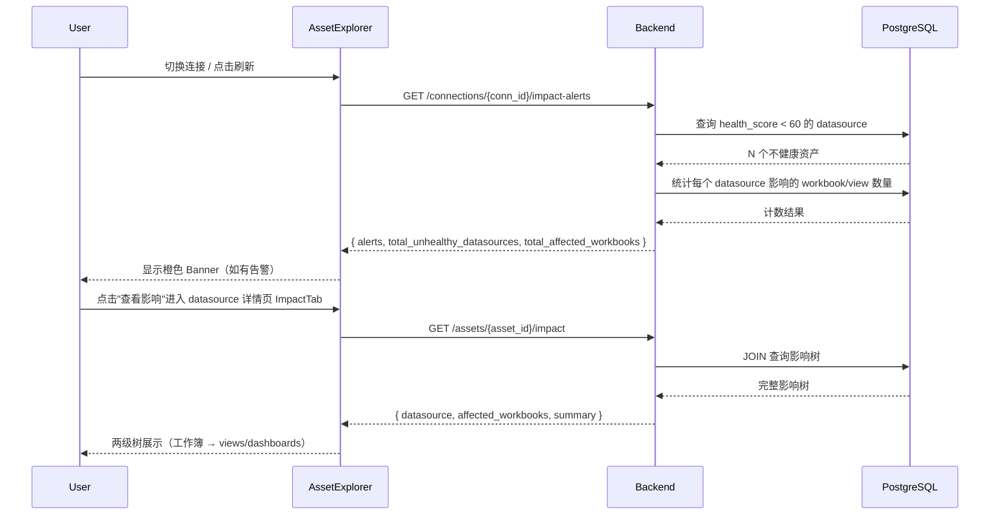

# Tableau 资产影响分析 技术规格书

> 版本：v0.1 | 状态：草稿 | 日期：2026-05-08 | 关联提案：docs/DEV_PROGRESS.md（Agentic Tableau 三向升级）

---

## 1. 概述

### 1.1 目的

建立 Tableau 资产之间的依赖关系视图，使用户在数据源健康分下降时，无需等待下游仪表板报错，即可主动了解影响范围（哪些工作簿、视图、仪表板会受影响）。

### 1.2 范围

- **包含**：影响树 API；连接级健康预警 API；列表页 banner；资产详情页新增"影响分析"Tab（仅 datasource 类型）
- **不包含**：新建 lineage 表（复用现有 `tableau_asset_datasources`）；自动通知/告警推送；跨连接影响分析

### 1.3 关联文档

| 文档 | 路径 | 关系 |
|------|------|------|
| Tableau MCP SPEC | docs/specs/07-tableau-mcp-v1-spec.md | `tableau_assets`、`tableau_asset_datasources` 数据模型 |
| Health Scoring SPEC | docs/specs/10-tableau-health-scoring-spec.md | 健康分定义与字段 |

---

## 2. 数据模型

### 2.1 复用现有表（无迁移）

**`tableau_asset_datasources`**（已有，workbook → datasource_name 映射）：

| 列名 | 类型 | 说明 |
|------|------|------|
| `asset_id` | UUID FK | → `tableau_assets.id`，工作簿 ID |
| `datasource_name` | VARCHAR | 数据源名称（字符串，非 FK） |
| `datasource_type` | VARCHAR | 数据源类型（可为空） |

**`tableau_assets`**（已有，需用到的字段）：

| 列名 | 说明 |
|------|------|
| `id` | 资产 UUID |
| `name` | 资产名称 |
| `asset_type` | `'workbook'`、`'view'`、`'dashboard'`、`'datasource'` |
| `parent_workbook_name` | view/dashboard 的父工作簿名（字符串） |
| `connection_id` | 连接 ID |
| `health_score` | 健康分（0-100），datasource 类型必须有此字段 |

### 2.2 影响链推导

```
datasource 资产 (name = X)
  ↓ JOIN tableau_asset_datasources ON datasource_name = X
workbook 资产列表
  ↓ JOIN tableau_assets ON parent_workbook_name = workbook.name
        AND asset_type IN ('view', 'dashboard')
view / dashboard 列表
```

**注意**：`datasource_name` 是字符串 JOIN，不是 FK。需在查询中同时限定 `connection_id` 防止跨连接污染。

---

## 3. API 设计

### 3.1 端点总览

| 方法 | 路径 | 说明 | 认证 | 角色 |
|------|------|------|------|------|
| GET | `/api/tableau/assets/{asset_id}/impact` | 单资产影响树（datasource 类型） | 需要 | analyst+ |
| GET | `/api/tableau/connections/{conn_id}/impact-alerts` | 连接级健康预警汇总 | 需要 | analyst+ |

### 3.2 请求/响应 Schema

#### `GET /api/tableau/assets/{asset_id}/impact`

**响应 (200)：**
```json
{
  "datasource": {
    "id": "uuid",
    "name": "Sales DB",
    "health_score": 42,
    "asset_type": "datasource"
  },
  "affected_workbooks": [
    {
      "id": "uuid",
      "name": "Executive Dashboard Workbook",
      "asset_type": "workbook",
      "affected_views": [
        { "id": "uuid", "name": "Sales Overview", "asset_type": "view" },
        { "id": "uuid", "name": "Revenue Breakdown", "asset_type": "dashboard" }
      ]
    }
  ],
  "summary": {
    "workbook_count": 3,
    "view_dashboard_count": 7
  }
}
```

**错误响应：**
```json
{ "error_code": "TAB_IA_001", "message": "资产不存在或类型不是 datasource", "detail": {} }
{ "error_code": "TAB_IA_002", "message": "无权访问该资产", "detail": {} }
```

#### `GET /api/tableau/connections/{conn_id}/impact-alerts`

**响应 (200)：**
```json
{
  "alerts": [
    {
      "datasource_id": "uuid",
      "datasource_name": "Sales DB",
      "health_score": 42,
      "affected_workbook_count": 3,
      "affected_view_dashboard_count": 7
    }
  ],
  "total_unhealthy_datasources": 2,
  "total_affected_workbooks": 5
}
```

阈值：`health_score < 60` 的 datasource 资产触发告警。

---

## 4. 业务逻辑

### 4.1 影响树查询（`impact_service.get_asset_impact`）

```python
def get_asset_impact(db, asset_id: str) -> ImpactResult:
    # 1. 获取 datasource 资产，校验 asset_type == 'datasource'
    # 2. 通过 datasource.name JOIN tableau_asset_datasources
    #    → 得到 affected workbook id 列表
    # 3. 通过 workbook.name JOIN tableau_assets
    #    WHERE asset_type IN ('view', 'dashboard')
    #    AND parent_workbook_name IN workbook_names
    #    AND connection_id = datasource.connection_id
    # 4. 组装返回结构
```

### 4.2 预警汇总查询（`impact_service.get_impact_alerts`）

```python
def get_impact_alerts(db, connection_id: str) -> AlertsResult:
    # 1. 查询 tableau_assets WHERE asset_type = 'datasource'
    #    AND connection_id = X AND health_score < 60
    # 2. 对每个不健康 datasource 调用简化版影响计数
    #    （只返回 count，不展开 workbook/view 树）
    # 3. 按 health_score ASC 排序（最危险的排前面）
```

### 4.3 前端 Banner 逻辑

- 连接切换时或手动点击刷新按钮时，调用 `impact-alerts` API
- `total_unhealthy_datasources > 0` → 显示橙色 banner：`⚠ N 个数据源健康异常，影响 M 个工作簿`
- 点击 banner → 展开数据源列表（inline 展开，非跳转）
- Banner 展开项每行显示：数据源名称 + 健康分 + 影响 workbook 数量 + `查看影响 →`（跳资产详情）

### 4.4 资产详情 ImpactTab

- 仅在 `asset_type === 'datasource'` 时显示此 Tab
- 调用 `GET /api/tableau/assets/{asset_id}/impact`
- 展示两级树：工作簿 → views/dashboards（可折叠）

---

## 5. 错误码

| 错误码 | HTTP | 触发条件 |
|--------|------|---------|
| TAB_IA_001 | 400 | `asset_id` 对应资产不存在或 `asset_type` ≠ `datasource` |
| TAB_IA_002 | 403 | 用户无权访问该资产所属连接 |
| TAB_IA_003 | 403 | 用户无权访问该连接 |

---

## 6. 安全

### 6.1 角色权限矩阵

| 操作 | admin | data_admin | analyst | user |
|------|-------|-----------|---------|------|
| 影响树查询 | Y | Y | Y | N |
| 预警汇总查询 | Y | Y | Y | N |

### 6.2 隔离约束

所有查询必须限定 `connection_id`，禁止跨连接关联数据。

---

## 7. 集成点

### 7.1 上游依赖

| 模块 | 接口 | 用途 |
|------|------|------|
| `tableau_assets` 表 | SQLAlchemy ORM | 资产查询 |
| `tableau_asset_datasources` 表 | SQLAlchemy ORM | workbook → datasource 关联 |

### 7.2 下游消费者

| 模块 | 用途 |
|------|------|
| SPEC 41（资产对话） | `impact_service.get_asset_impact()` 作为 chat tool 直接调用 |

---

## 8. 时序图



---

## 9. 测试策略

### 9.1 关键场景

| # | 场景 | 预期 | 优先级 |
|---|------|------|--------|
| 1 | datasource 被 3 个 workbook 使用，每个 workbook 下有 2 个 view | 返回 3 workbook，6 view | P0 |
| 2 | datasource 未被任何 workbook 使用 | `affected_workbooks = []` | P0 |
| 3 | 对 workbook 类型资产调用 `/impact` | 返回 TAB_IA_001 | P0 |
| 4 | 连接无健康异常 datasource | `impact-alerts` 返回 `total_unhealthy_datasources = 0` | P0 |
| 5 | 两个连接有同名 datasource | 不跨连接污染，各自独立计数 | P0 |
| 6 | 前端：`total_unhealthy_datasources > 0` 时显示 banner | DOM 中存在告警 banner | P0 |
| 7 | 前端：datasource 资产详情页出现"影响分析" Tab | Tab 可见 | P0 |

### 9.2 验收标准

- [ ] `GET /impact` 返回两级影响树（workbook + views/dashboards）
- [ ] `GET /impact-alerts` 仅包含 `health_score < 60` 的资产
- [ ] 跨连接隔离测试通过（同名 datasource 不混用）
- [ ] 前端 banner 在有告警时展示，无告警时不渲染
- [ ] ImpactTab 仅在 `asset_type === 'datasource'` 时注册显示

### 9.3 Mock 与测试约束

- **`impact_service`**：使用同步 SQLAlchemy Session，mock 时用 `MagicMock` 即可
- **`string JOIN` 的隔离**：测试用例必须构造两个连接下同名 datasource，验证隔离
- **前端 ImpactTab**：在 `AssetInspector` 的 Tab 注册处 mock `asset_type === 'datasource'`，验证 Tab 可见性

---

## 10. 开放问题

| # | 问题 | 状态 |
|---|------|------|
| 1 | `datasource_name` 做字符串 JOIN 可能因大小写/空格不一致导致匹配失败 | 确认：先按精确匹配，如无结果 fallback ILIKE 匹配 |

---

## 11. 开发交付约束

### 11.1 架构约束

- `impact_service.py` 放在 `backend/services/tableau/` 下，不得 import `app.api` 层
- 所有 SQL 查询用 SQLAlchemy ORM 或 `text()` + 绑定参数，禁止 f-string 拼接
- `impact_service` 的函数签名必须可被 SPEC 41 的 `asset_chat_service` 直接 import 调用

### 11.2 强制检查清单

- [ ] 两个新 endpoint 均已注册到 `app/api/tableau.py` 的 `router`
- [ ] `connection_id` 隔离在所有 SQL 查询中强制添加
- [ ] 前端 ImpactTab 使用 `React.lazy` 懒加载
- [ ] 前端无硬编码 `localhost:8000`

### 11.3 验证命令

```bash
cd backend && python3 -m py_compile services/tableau/impact_service.py
cd backend && pytest tests/test_impact_analysis.py -x -q
cd frontend && npm run type-check
cd frontend && npm run lint
```
