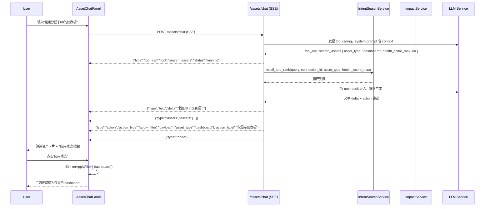

# Tableau 对话式资产中心 技术规格书

> 版本：v0.1 | 状态：草稿 | 日期：2026-05-08 | 关联提案：docs/DEV_PROGRESS.md（Agentic Tableau 三向升级）

---

## 1. 概述

### 1.1 目的

在 Tableau 资产列表页右侧增加常驻对话面板，用户可以用自然语言提问（"最近被高管查看过但健康分低于 60 的仪表板"），AI 直接返回匹配资产卡片，并可在用户确认后将筛选条件应用到主列表。

### 1.2 范围

- **包含**：后端 SSE 流式 chat endpoint；前端 `AssetChatPanel` 浮层组件；LLM tool calling（搜索资产、获取影响分析）；用户确认后驱动主列表行为
- **不包含**：对话历史持久化到后端（使用 sessionStorage）；批量操作执行（标注、归档等）；跨连接对话

### 1.3 关联文档

| 文档 | 路径 | 关系 |
|------|------|------|
| 意图搜索 SPEC | docs/specs/39-tableau-intent-search-spec.md | `intent_search_service` 作为 chat tool |
| 影响分析 SPEC | docs/specs/40-tableau-impact-analysis-spec.md | `impact_service` 作为 chat tool |
| NLQ Pipeline SPEC | docs/specs/14-nl-to-query-pipeline-spec.md | SSE 流式模式参考 |
| Ask Data SPEC | docs/specs/22-ask-data-architecture.md | SSE 实现范式 |

---

## 2. 数据模型

无新增表。对话历史存储在前端 `sessionStorage`，key 为 `tableau-asset-chat-{connection_id}`，切换连接时清空。

---

## 3. API 设计

### 3.1 端点总览

| 方法 | 路径 | 说明 | 认证 | 角色 |
|------|------|------|------|------|
| POST | `/api/tableau/assets/chat` | 资产对话（SSE 流式） | 需要 | analyst+ |

### 3.2 请求/响应 Schema

#### `POST /api/tableau/assets/chat`

**请求体：**
```json
{
  "message": "最近被高管查看过但健康分低于 60 的仪表板",
  "connection_id": "uuid-string",
  "history": [
    { "role": "user", "content": "上一条消息" },
    { "role": "assistant", "content": "上一条回答" }
  ],
  "context": {
    "current_filter": "dashboard",
    "visible_asset_count": 48
  }
}
```

**SSE 流式响应帧格式（`Content-Type: text/event-stream`）：**

```
# 文字流式输出
data: {"type": "text", "delta": "根据您的条件，我找到了以下仪表板："}

# 工具调用中（可选，用于前端显示"正在搜索..."）
data: {"type": "tool_call", "tool": "search_assets", "status": "running"}

# 资产卡片列表（一次性发出，不流式）
data: {"type": "assets", "assets": [
  {
    "id": "uuid",
    "name": "Executive Sales Dashboard",
    "asset_type": "dashboard",
    "health_score": 42,
    "project_name": "Revenue",
    "relevance_reason": "健康分 42，低于阈值，最近 7 天浏览量 340"
  }
]}

# 可应用的筛选动作（用户确认后才生效）
data: {"type": "action", "action_type": "apply_filter", "payload": {"asset_type": "dashboard"}, "action_label": "仅显示仪表板"}

# 对话结束
data: {"type": "done"}
```

**错误响应（非 SSE，HTTP 4xx/5xx）：**
```json
{ "error_code": "TAB_AC_001", "message": "connection_id 无效或无权限", "detail": {} }
{ "error_code": "TAB_AC_002", "message": "对话服务暂时不可用", "detail": {} }
```

---

## 4. 业务逻辑

### 4.1 Chat 服务处理流程

```
POST /api/tableau/assets/chat
  │
  ├─ 1. 权限校验：当前用户有访问 connection_id 的权限
  │
  ├─ 2. System Prompt 构建（asset_chat_service.build_system_prompt）
  │     注入上下文：connection_id, current_filter, visible_asset_count
  │     Tools 定义：search_assets, get_impact_analysis
  │
  ├─ 3. LLM Tool Calling 循环（最多 3 轮工具调用）
  │     - 调用 LLM，输出 text delta 或 tool_call
  │     - tool = "search_assets"  → 调用 intent_search_service.recall_and_rank()
  │     - tool = "get_impact_analysis" → 调用 impact_service.get_asset_impact()
  │     - 将 tool result 注入 history，继续 LLM
  │
  ├─ 4. 流式 yield：
  │     - text delta → {"type": "text", "delta": "..."}
  │     - tool_call 开始 → {"type": "tool_call", "tool": "...", "status": "running"}
  │     - 资产列表 → {"type": "assets", "assets": [...]}
  │     - 可选 action → {"type": "action", ...}
  │
  └─ 5. yield {"type": "done"}
```

### 4.2 Tool 定义

**`search_assets` tool：**
```json
{
  "name": "search_assets",
  "description": "根据自然语言查询搜索 Tableau 资产，返回相关资产列表",
  "parameters": {
    "query": { "type": "string" },
    "asset_type": { "type": "string", "enum": ["workbook", "dashboard", "view", "datasource", null] },
    "health_score_max": { "type": "number", "description": "健康分上限，如 60 表示只返回 <60 的资产" }
  }
}
```

**`get_impact_analysis` tool：**
```json
{
  "name": "get_impact_analysis",
  "description": "获取某个数据源的下游影响树，返回受影响的工作簿和视图/仪表板列表",
  "parameters": {
    "asset_id": { "type": "string", "description": "datasource 类型资产的 UUID" }
  }
}
```

### 4.3 Tool 实现（直接调用 service 层，不发 HTTP）

```python
# 在 asset_chat_service.py 中
from services.tableau.intent_search_service import IntentSearchService
from services.tableau.impact_service import ImpactService

async def _execute_tool(tool_name, tool_args, db, connection_id):
    if tool_name == "search_assets":
        return await IntentSearchService(db).recall_and_rank(
            query=tool_args["query"],
            connection_id=connection_id,
            asset_type=tool_args.get("asset_type"),
            health_score_max=tool_args.get("health_score_max")
        )
    elif tool_name == "get_impact_analysis":
        return ImpactService(db).get_asset_impact(tool_args["asset_id"])
```

**注意**：`IntentSearchService.recall_and_rank()` 是 intent search 的内部方法（无 LLM 排序，只做召回 + 过滤），区别于对外 API 中带 LLM 排序的完整流程，避免 chat 内部再嵌套 LLM 调用。

### 4.4 Action 生成规则

LLM 在响应末尾可以建议 action，格式为：
- `apply_filter`：payload 包含 `asset_type`（前端据此调用 `setAssetTypeFilter`）
- `highlight_assets`：payload 包含 `asset_ids`（前端高亮对应行）

Action 不自动执行，前端在用户点击"应用"按钮后才触发回调。

---

## 5. 错误码

| 错误码 | HTTP | 触发条件 |
|--------|------|---------|
| TAB_AC_001 | 403 | connection_id 无效或无权限 |
| TAB_AC_002 | 503 | LLM 服务不可用（超时/全部 fallback 失败） |

---

## 6. 安全

### 6.1 角色权限矩阵

| 操作 | admin | data_admin | analyst | user |
|------|-------|-----------|---------|------|
| 资产对话 | Y | Y | Y | N |

### 6.2 约束

- History 最多保留最近 10 轮（前端控制，超出时截断旧消息）
- Tool Calling 循环上限 3 次，超出后强制结束，返回已收集的结果

---

## 7. 集成点

### 7.1 上游依赖

| 模块 | 接口 | 用途 |
|------|------|------|
| `intent_search_service` | `IntentSearchService.recall_and_rank()` | search_assets tool 实现 |
| `impact_service` | `ImpactService.get_asset_impact()` | get_impact_analysis tool 实现 |
| LLM Layer | `llm_service.stream_for_tool_calling()` 或等效方法 | Tool Calling 模式 LLM 调用 |

### 7.2 前端组件集成

`AssetChatPanel` 组件通过 props 接收：
- `connectionId: string`
- `onApplyFilter: (assetType: string) => void`
- `onHighlightAssets: (assetIds: string[]) => void`

`AssetExplorer.tsx` 负责：
- 渲染右下角"助手"按钮，点击展开/收起 `AssetChatPanel`
- 实现 `onApplyFilter` 和 `onHighlightAssets` 回调
- 高亮逻辑：将 `highlightedAssetIds` 传入资产列表渲染，匹配行增加 `bg-yellow-50` 样式

---

## 8. 时序图



---

## 9. 测试策略

### 9.1 关键场景

| # | 场景 | 预期 | 优先级 |
|---|------|------|--------|
| 1 | 正常对话，LLM 调用 search_assets tool，返回资产卡片 | SSE 包含 `type:assets` 帧 | P0 |
| 2 | LLM 不调用 tool，直接回答通用问题 | SSE 仅包含 `type:text` 帧，无报错 | P0 |
| 3 | LLM 调用超过 3 次 tool | 强制截断，返回已收集结果 | P1 |
| 4 | LLM 服务不可用 | 返回 TAB_AC_002 | P0 |
| 5 | 前端：用户点击"应用"后主列表筛选变化 | `onApplyFilter` 被调用，主列表过滤 | P0 |
| 6 | 前端：切换连接后 sessionStorage 对话历史清空 | 新连接对话从空开始 | P0 |
| 7 | 前端：资产卡片可点击跳转详情页 | 跳转到 `/assets/tableau/{asset_id}` | P1 |

### 9.2 验收标准

- [ ] SSE 帧格式符合 §3.2 定义（`type` 字段、各类 payload 结构）
- [ ] Tool Calling 循环上限 3 次生效
- [ ] `onApplyFilter` / `onHighlightAssets` 回调被正确调用
- [ ] 切换连接清空对话历史
- [ ] 面板为浮层 overlay，不影响主列表宽度

### 9.3 Mock 与测试约束

- **SSE 流式测试**：后端用 `pytest` + `httpx.AsyncClient` 的 `stream` 方法采集帧，解析 JSON 逐帧断言
- **LLM Tool Calling Mock**：patch `llm_service.stream_for_tool_calling` 返回预定义帧序列（先 tool_call，再 text delta，再 done）
- **`IntentSearchService.recall_and_rank`**：在 asset_chat_service 测试中 patch 此方法，避免触发真实 DB 查询
- **前端 SSE Mock**：用 `page.route()` 拦截 `/api/tableau/assets/chat`，返回多帧 SSE 响应，断言各类型帧都渲染到 DOM
- **前端 action 测试**：mock `onApplyFilter` 回调，点击"应用"后验证回调被调用且参数正确

---

## 10. 开放问题

| # | 问题 | 状态 |
|---|------|------|
| 1 | LLM 是否支持 Tool Calling（当前 `llm_service` 的 `stream_for_tool_calling` 方法是否存在） | **coder 开工前必须确认**：若不存在，需先在 `llm_service` 补充 streaming tool calling 支持，或采用 ReAct 文本解析方式实现 tool dispatch |

---

## 11. 开发交付约束

### 11.1 架构约束

- `asset_chat_service.py` 放在 `backend/services/tableau/`，直接 import `IntentSearchService` 和 `ImpactService`，**不发 HTTP 请求**
- SSE 响应必须复用 `app/api/ask_data.py` 中已有的 SSE 生成器模式（`EventSourceResponse` 或 `StreamingResponse`）
- `AssetChatPanel` 使用 `React.lazy` 懒加载
- 前端 action 不自动执行，必须经过用户点击确认

### 11.2 强制检查清单

- [ ] 新 endpoint 已注册到 `app/api/tableau.py` 的 `router`（或新建 `tableau_chat.py` 并在 `main.py` 挂载）
- [ ] Tool Calling 循环上限 3 次硬编码为常量 `MAX_TOOL_ROUNDS = 3`
- [ ] History 截断上限 10 轮在前端实现（`slice(-10)`）
- [ ] `AssetChatPanel` 为浮层，z-index 不遮挡 Modal/Drawer 等高层组件
- [ ] 切换连接时 `sessionStorage.removeItem(chatKey)` 被调用

### 11.3 验证命令

```bash
cd backend && python3 -m py_compile services/tableau/asset_chat_service.py
cd backend && pytest tests/test_asset_chat.py -x -q
cd frontend && npm run type-check
cd frontend && npm run lint
```

### 11.4 开工前必做

1. 确认 §10 开放问题 #1（LLM Tool Calling 支持情况）
2. 读取 `backend/services/tableau/intent_search_service.py`（SPEC 39 产出）确认 `recall_and_rank` 方法签名
3. 读取 `backend/services/tableau/impact_service.py`（SPEC 40 产出）确认 `get_asset_impact` 方法签名
