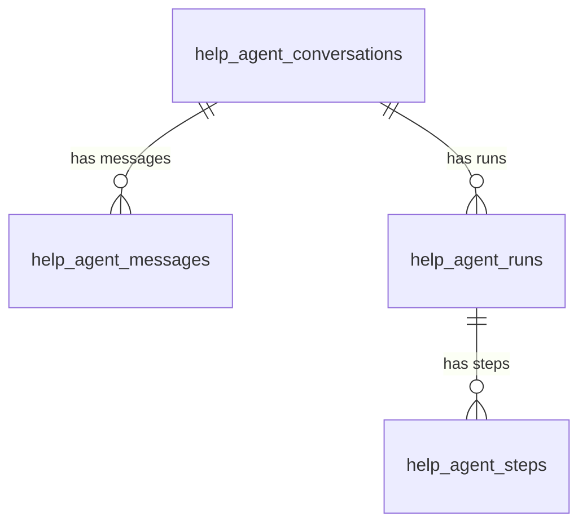

# Help Agent 技术规格书

> 版本：v0.4 | 状态：Ready for Implementation | 日期：2026-05-14 | 关联模块：Agent / 运维诊断 / 用户支持
>
> **变更记录**
> - v0.4（2026-05-14）— 修正全局 Help Agent 入口设计：取消右下角悬浮按钮作为 P0 推荐入口，统一改为 AppHeader 顶栏机器人 icon，放在消息通知左侧，避免与首页 AskBar、聊天输入区和移动端底部按钮冲突；补充入口布局约束、前端测试项，并将实施章节拆分为 Plan 与 Task。
> - v0.3（2026-05-13）— 补充工程落地约束：引入 `entry_point` 入口语义，区分 Global Drawer 弱上下文与 Inline Panel 强上下文；新增诊断进度 SSE 事件与步骤树 UI；独立表继续保留但要求 ORM 共用 observability mixin 与 schema parity 测试，防止结构漂移；错误结构化左移到 Runner 的 `StructuredBIError` / `structured_error`，Help Agent 仅对 legacy string 做 best-effort fallback；Planner 支持同层 related entities 并行 tool calling，P99 目标小于 5 秒。
> - v0.2（2026-05-13）— 修正 v0.1 的关键设计风险：取消 `agent_kind` 混表，改为独立 Help Agent 表；`page_context` 从强制路由开关降级为弱上下文；P0 增加 Inline Diagnostic Panel；静态页面帮助降级为前端 hint / LLM context，不作为核心工具；新增 bounded multi-step diagnosis；新增 structured error chain extraction；所有诊断结果必须带 `snapshot_at`。
> - v0.1（2026-05-12）— 初版草稿。

---

## 1. 概述

### 1.1 目的

为 Mulan BI Platform 增加一个面向最终用户和管理员的 Help Agent，帮助用户排查使用问题、解释系统状态、定位失败原因，并给出可执行的下一步建议。

Help Agent 不是泛聊机器人，也不是新的数据分析 Agent。它是一个只读诊断 Agent，围绕用户问题、当前页面、当前用户、run/task/connection/skill 等系统上下文做诊断事实采集，再由 LLM 基于事实生成面向用户的解释和建议。

P0 的核心原则：

- 用户问题优先，页面上下文只能辅助判断，不能强制劫持意图。
- 入口语义必须参与 Planner：Global Drawer 默认弱上下文，Inline Panel 默认强绑定当前对象。
- 诊断数据独立存储，禁止污染 Data Agent 的核心 run/conversation 表。
- 独立表必须通过共享 ORM mixin 与 schema parity 测试防止结构漂移。
- 真实排障允许有限多步下钻，而不是一次只调用一个孤立工具。
- 同层级诊断工具必须并行读取，避免串行等待扩大用户焦虑。
- 错误结构化应在 Runner 捕获异常时左移完成，Help Agent 不承担清洗烂日志的主要职责。
- 所有诊断结论必须带快照时间，避免并发状态变化造成误导。

### 1.2 背景问题

当前系统已经具备：

- Data Agent 首页问答与 ReAct 工具链。
- Agent Monitor，可查看 `bi_agent_runs` / `bi_agent_steps`。
- Task 管理，可查看任务运行、调度和同步状态。
- Skills Center，可配置技能版本、启停和回滚。
- Tableau / Connection API，可查看连接、同步状态、资产健康。

但用户遇到问题时仍需要人工串联这些信息：

- “为什么这次问答失败？”
- “这个 run 7 个步骤 88.5s，到底慢在哪里？”
- “为什么 schema 工具不可用？”
- “为什么我看不到某个 Tableau 数据源？”
- “同步任务是不是挂了？”
- “这个页面应该怎么用？”

Help Agent 的目标是把这些分散的可观测信息变成可对话的诊断界面。

### 1.3 范围

**P0 包含：**

- 新增 Help Agent 后端服务与 SSE API。
- 新增全局 Help Agent 前端入口：AppHeader 顶栏机器人 icon，支持当前页面上下文。
- 在关键失败节点提供 Inline Diagnostic Panel。
- 支持只读诊断工具：
  - Agent run / steps 诊断。
  - 当前用户最近失败问答诊断。
  - Tableau connection / sync status 诊断。
  - Task run / schedule 诊断。
  - Skill 启用状态诊断。
  - 结构化错误读取与 legacy fallback。
- 支持最多 4 步 bounded multi-step diagnosis。
- 支持同层 related entities 并行诊断。
- 支持诊断进度事件和 Inline Panel 步骤树。
- 新增独立 Help Agent 会话、消息、run、step 表。
- 新增 Help Agent / Data Agent observability 共享 mixin 约束与 parity 测试。
- 新增 `StructuredBIError` 标准和 structured error 读取约束。
- 对 Help Agent 自身执行过程独立落库，支持审计。
- 明确 coder 任务和 tester 验收清单。

**P0 不包含：**

- 不自动修改配置。
- 不自动触发同步、任务重跑、技能启停、连接密钥轮换。
- 不读取或展示明文密钥、token、password。
- 不替代 Data Agent 的问数能力。
- 不做跨用户诊断，除非当前用户具备 admin / data_admin 权限。
- 不引入新的向量知识库或 RAG 索引。
- 不把静态页面说明包装成核心 Agent 工具。

**P1 可扩展：**

- 经用户确认后的安全修复动作，例如重新触发同步、启用 skill、重跑失败任务。
- 文档知识库 RAG。
- 自动生成工单 / 通知。
- 管理员级批量健康巡检。
- 更完整的页面 DOM 状态感知与操作录制。

### 1.4 关联文档

| 文档 | 路径 | 关系 |
|------|------|------|
| Data Agent 架构 | `docs/specs/36-data-agent-architecture-spec.md` | SSE、会话、可观测性、ReAct 基座 |
| Data Agent 确定性 Schema Inventory Skill | `docs/specs/44-data-agent-deterministic-schema-inventory-spec.md` | 确定性 skill 与用户可见 thinking 文案规范 |
| 任务管理 | `docs/specs/33-task-management-spec.md` | Task run / schedule 诊断来源 |
| Tableau MCP V1 | `docs/specs/07-tableau-mcp-v1-spec.md` | Tableau 连接与同步状态来源 |
| Skills Center | `docs/specs/agents_skills.md` | Skill 状态、版本、启停诊断来源 |
| API 约定 | `docs/specs/02-api-conventions.md` | 认证、错误响应、分页约定 |
| 认证与 RBAC | `docs/specs/04-auth-rbac-spec.md` | 角色权限边界 |

---

## 2. 当前代码基线

### 2.1 可复用后端能力

| 文件 | 当前能力 | Help Agent 用法 |
|------|----------|----------------|
| `backend/app/api/agent.py` | Data Agent SSE 入口 | 参考 SSE 事件协议，不直接复用业务路由 |
| `backend/services/data_agent/runner.py` | 写入 `bi_agent_runs` / `bi_agent_steps` | Help Agent 读取 Data Agent 运行记录作为诊断对象，不写入这些表 |
| `backend/app/api/agent_admin.py` | Agent stats / runs / steps / sessions | 诊断 run、steps、耗时、错误 |
| `backend/app/api/tasks.py` | Task runs / schedules / stats / sync overview | 诊断任务失败、同步状态 |
| `backend/app/api/skills.py` | Skills CRUD / dispatch / versions | 诊断 skill 是否配置、是否启用 |
| `backend/app/api/tableau.py` | connections / sync-status / status / mcp-status | 诊断 Tableau 连接、同步、MCP |
| `backend/app/api/connection_hub.py` | data connections / test / health | 诊断数据连接健康 |
| `backend/services/data_agent/models.py` | `AgentConversation` / `AgentConversationMessage` / `BiAgentRun` / `BiAgentStep` | 作为被诊断数据源，禁止作为 Help Agent 自身日志存储 |

### 2.2 可复用前端能力

| 文件 | 当前能力 | Help Agent 用法 |
|------|----------|----------------|
| `frontend/src/api/agent.ts` | SSE client、Agent Admin types | 新增 Help Agent API client 可复用解析模式 |
| `frontend/src/pages/admin/agent-monitor/page.tsx` | run 展开、steps、耗时展示 | 可从 run 页面一键带入 run_id 问 Help Agent |
| `frontend/src/api/tasks.ts` | Task API client | 页面上下文可带 task_run_id / schedule_id |
| `frontend/src/api/skills.ts` | Skill API client | 页面上下文可带 skill_id |
| `frontend/src/config/menu.ts` | 智能体菜单结构 | P0 可增加 Help Agent 菜单项；全局入口放在 AppHeader 顶栏 |
| `frontend/src/router/config.tsx` | 路由注册 | P0 新增 `/agents/help` 页面 |

### 2.3 当前缺口

| 缺口 | 影响 | 本 spec 处理 |
|------|------|-------------|
| 没有面向用户的诊断入口 | 用户只能找管理员或人工翻日志 | 新增 Help Agent UI |
| run / step 信息只展示，不解释 | 普通用户难以理解失败原因 | 工具采集 + LLM 解释 |
| 页面上下文没有传给 Agent | 用户需要手动复制 run_id / task_id | 前端自动采集 page_context |
| 页面上下文可能劫持意图 | 用户问通用问题却被强制诊断当前 run | `page_context` 仅作为弱上下文，用户问题优先 |
| Inline 入口语义丢失 | 用户在 run 下方点“诊断”却被要求再次说明对象 | `entry_point=inline_panel` 时 selection 是强上下文 |
| 多步诊断等待焦虑 | 10 秒以上纯 thinking 让用户以为卡死 | SSE 输出进度事件，Inline Panel 展示步骤树和耗时 |
| 诊断与修复边界不清 | 自动化动作可能造成破坏 | P0 强制只读 |
| Help Agent 本身不可审计 | 难追踪诊断依据 | 独立 help run/step 落库 |
| 排障链路常常需要下钻 | 单工具摘要无法发现 root cause | P0 支持最多 4 步 bounded multi-step diagnosis |
| 同层下钻串行导致慢 | connection 和 skill 等状态可并行读取 | Planner 对同层 related_entities 使用并行 tool calling |
| 诊断期间状态会变化 | 用户看到的状态与回答不一致 | 每个工具结果和最终回答必须带 `snapshot_at` |
| 独立表结构漂移 | Help Agent 与 Data Agent 观测字段未来不一致 | 共享 ORM mixin + schema parity test |
| 字符串堆栈难解析 | Help Agent 用正则清洗烂日志不稳定 | Runner 左移写入 `structured_error` JSON |
| 全局悬浮按钮与 AskBar 冲突 | 首页/聊天页底部输入区被遮挡，移动端更明显 | P0 全局入口改为顶栏机器人 icon，位于消息通知左侧 |

---

## 3. 目标架构

### 3.1 架构定位

Help Agent 是独立于 Data Agent 的支持与诊断 Agent：

```text
Frontend Help Drawer / Inline Diagnostic Panel / /agents/help
        |
        | POST /api/help-agent/stream
        v
backend/app/api/help_agent.py
        |
        v
backend/services/help_agent/
  - planner.py         # 入口语义、意图识别、上下文选择、有限多步工具规划
  - service.py         # SSE 编排、落库、LLM 调用
  - error_chain.py     # legacy string 错误的 best-effort fallback
  - tools/             # 只读诊断工具
        |
        +--> Data Agent observability models
        +--> Tasks service / APIs
        +--> Tableau / Connection services
        +--> Skills service
        +--> Page context providers
```

### 3.2 与 Data Agent 的关系

| 项目 | Data Agent | Help Agent |
|------|------------|------------|
| 主要目标 | 问数、分析、生成业务回答 | 排障、解释、使用指导 |
| 用户问题 | “最近销售额是多少？” | “为什么刚才问答失败？” |
| 工具 | query / schema / chart / metrics | diagnose_run / diagnose_task / diagnose_connection / diagnose_skill / explain_page |
| 数据权限 | 业务数据权限 | 诊断信息权限 |
| 是否允许改配置 | 否 | P0 否 |
| 落库 | `bi_agent_runs` / `bi_agent_steps` | 独立 `help_agent_*` 表 |

Help Agent 可以读取 Data Agent 的 run/step 记录，但不能调用 Data Agent 去重新回答业务问题。

Help Agent 不得把自身运行记录写入 `bi_agent_runs` / `agent_conversations`。这些表是 Data Agent 的核心业务可观测表，P0 禁止混写，避免污染成功率、P95、调用量和历史会话列表。

### 3.3 P0 目录结构

```text
backend/services/help_agent/
  __init__.py
  service.py
  planner.py
  schemas.py
  renderer.py
  error_chain.py
  redaction.py
  tools/
    __init__.py
    base.py
    agent_run.py
    task.py
    connection.py
    skill.py
    page_context.py

backend/app/api/
  help_agent.py

frontend/src/api/
  helpAgent.ts

frontend/src/pages/agents/help-agent/
  page.tsx
  HelpAgentDrawer.tsx
  InlineDiagnosticPanel.tsx
  pageContext.ts
```

### 3.4 P0 执行链路

```text
User opens Help Agent
-> Frontend collects page_context
-> POST /api/help-agent/stream
-> Backend validates auth, entry_point and page_context
-> HelpPlanner evaluates entry_point first, user query second, page_context third
-> Read-only diagnostic tools collect facts with snapshot_at
-> SSE emits diagnostic_progress for each planned/running/completed tool
-> Planner may follow related_entities for up to 4 total tool calls; same-level tools run in parallel
-> HelpAgentService builds constrained prompt
-> LLM generates explanation and next steps
-> SSE emits thinking/tool_call/tool_result/token/done
-> Persist help conversation message
-> Persist help run and steps
```

---

## 4. 数据模型

### 4.1 迁移策略

P0 新增独立 Help Agent 表，禁止在 `agent_conversations`、`agent_conversation_messages`、`bi_agent_runs`、`bi_agent_steps` 中混写 Help Agent 自身日志。

原因：

- Help Agent 诊断 Data Agent run 时会产生“元诊断”记录，混入 `bi_agent_runs` 会污染 Data Agent 调用量、成功率、P95 和历史列表。
- 现有代码中所有统计查询都需要补 `agent_kind='data'` 过滤，遗漏风险高。
- Help Agent 的数据保留周期、查询模式和审计语义不同，应独立管理。

### 4.2 Schema 防漂移策略

P0 采用“独立物理表 + 共享 ORM mixin + schema parity test”，不采用 PostgreSQL partitioning。

决策理由：

- 独立物理表避免污染现有 Data Agent 统计与查询路径。
- ORM mixin 复用公共观测字段，避免 `help_agent_runs` / `bi_agent_runs` 长期结构漂移。
- partitioning 会牵涉现有主键、外键、迁移、查询计划和历史数据回填，P0 风险过高，列为 P1 备选。

必须新增共享 mixin：

```text
backend/services/agent_observability/
  __init__.py
  mixins.py
  structured_error.py
```

建议 mixin：

```python
class AgentRunTelemetryMixin:
    status = Column(String(16), nullable=False)
    error_code = Column(String(16), nullable=True)
    steps_count = Column(Integer, nullable=False, server_default=sa_text("0"))
    tools_used = Column(ARRAY(Text), nullable=True)
    response_type = Column(String(16), nullable=True)
    execution_time_ms = Column(Integer, nullable=True)
    created_at = Column(DateTime, server_default=sa_func.now(), nullable=False)
    completed_at = Column(DateTime, nullable=True)


class AgentStepTelemetryMixin:
    step_number = Column(Integer, nullable=False)
    step_type = Column(String(16), nullable=False)
    tool_name = Column(String(64), nullable=True)
    tool_params = Column(JSONB, nullable=True)
    tool_result_summary = Column(Text, nullable=True)
    content = Column(Text, nullable=True)
    execution_time_ms = Column(Integer, nullable=True)
    created_at = Column(DateTime, server_default=sa_func.now(), nullable=False)
```

要求：

- `BiAgentRun` / `BiAgentStep` 与 `HelpAgentRun` / `HelpAgentStep` 的公共观测字段必须来自同一 mixin。
- Help Agent 专属字段，例如 `page_context`、`snapshot_started_at`、`diagnostic_payload`、`related_entities`，放在 Help Agent model 自身，不强行塞入 Data Agent 表。
- 未来新增公共观测字段，例如 `token_cost`、`prompt_tokens`、`completion_tokens`、`human_feedback`，必须先加到 mixin，再由迁移同步到相关表。
- 必须增加 schema parity test：比较 `BiAgentRun` 与 `HelpAgentRun` 的公共 mixin 字段、类型、nullable、server_default 是否一致；Step 同理。

### 4.3 新增表

#### `help_agent_conversations`

Help Agent 会话表。


| 列名 | 类型 | 约束 | 说明 |
|------|------|------|------|
| `id` | `UUID` | PK, DEFAULT `gen_random_uuid()` | 会话 ID |
| `user_id` | `INTEGER` | NOT NULL, INDEX | 用户 ID |
| `title` | `VARCHAR(256)` | NULLABLE | 会话标题 |
| `status` | `VARCHAR(16)` | NOT NULL, DEFAULT `'active'` | `active` / `archived` |
| `last_page_path` | `VARCHAR(256)` | NULLABLE | 最近一次上下文页面路径 |
| `created_at` | `TIMESTAMP` | NOT NULL, DEFAULT `NOW()` | 创建时间 |
| `updated_at` | `TIMESTAMP` | NOT NULL, DEFAULT `NOW()` | 更新时间 |

索引：

| 索引名 | 列 | 用途 |
|--------|-----|------|
| `ix_hac_user_status_updated` | `(user_id, status, updated_at DESC)` | 会话列表 |

#### `help_agent_messages`

Help Agent 消息表。


| 列名 | 类型 | 约束 | 说明 |
|------|------|------|------|
| `id` | `BIGINT` | PK, AUTO | 主键 |
| `conversation_id` | `UUID` | FK → `help_agent_conversations.id`, NOT NULL | 会话 ID |
| `role` | `VARCHAR(16)` | NOT NULL | `user` / `assistant` |
| `content` | `TEXT` | NOT NULL | 消息正文 |
| `response_type` | `VARCHAR(16)` | NULLABLE | `help` / `error` |
| `response_data` | `JSONB` | NULLABLE | 诊断结构化 payload |
| `tools_used` | `TEXT[]` | NULLABLE | 使用的诊断工具 |
| `trace_id` | `UUID` | NULLABLE | 对应 `help_agent_runs.id` |
| `steps_count` | `INTEGER` | NULLABLE | 工具调用次数 |
| `execution_time_ms` | `INTEGER` | NULLABLE | 总耗时 |
| `sources_count` | `INTEGER` | NULLABLE | 诊断对象数量 |
| `top_sources` | `JSONB` | NULLABLE | 例如 `["run:a64eecc6", "connection:1"]` |
| `created_at` | `TIMESTAMP` | NOT NULL, DEFAULT `NOW()` | 创建时间 |

索引：

| 索引名 | 列 | 用途 |
|--------|-----|------|
| `ix_ham_conv_created` | `(conversation_id, created_at)` | 消息列表 |

#### `help_agent_runs`

Help Agent 单次诊断运行记录。


| 列名 | 类型 | 约束 | 说明 |
|------|------|------|------|
| `id` | `UUID` | PK, DEFAULT `gen_random_uuid()` | run ID |
| `conversation_id` | `UUID` | FK → `help_agent_conversations.id`, NOT NULL | 会话 ID |
| `user_id` | `INTEGER` | NOT NULL, INDEX | 用户 ID |
| `question` | `TEXT` | NOT NULL | 用户问题 |
| `page_context` | `JSONB` | NULLABLE | 脱敏后的页面上下文 |
| `status` | `VARCHAR(16)` | NOT NULL, DEFAULT `'running'` | `running` / `completed` / `failed` |
| `error_code` | `VARCHAR(16)` | NULLABLE | `HLP_*` 错误码 |
| `structured_error` | `JSONB` | NULLABLE | Help Agent 自身失败时的结构化错误 |
| `steps_count` | `INTEGER` | NOT NULL, DEFAULT `0` | 工具调用次数 |
| `tools_used` | `TEXT[]` | NULLABLE | 工具名 |
| `response_type` | `VARCHAR(16)` | NULLABLE | `help` / `error` |
| `execution_time_ms` | `INTEGER` | NULLABLE | 总耗时 |
| `snapshot_started_at` | `TIMESTAMP` | NOT NULL | 诊断开始快照时间 |
| `snapshot_completed_at` | `TIMESTAMP` | NULLABLE | 最后一个工具读取完成时间 |
| `created_at` | `TIMESTAMP` | NOT NULL, DEFAULT `NOW()` | 创建时间 |
| `completed_at` | `TIMESTAMP` | NULLABLE | 完成时间 |

索引：

| 索引名 | 列 | 用途 |
|--------|-----|------|
| `ix_har_user_created` | `(user_id, created_at DESC)` | 用户审计列表 |
| `ix_har_status_created` | `(status, created_at DESC)` | 失败诊断检索 |
| `ix_har_conversation_created` | `(conversation_id, created_at)` | 会话 run 列表 |

#### `help_agent_steps`

Help Agent 步骤记录。

| 列名 | 类型 | 约束 | 说明 |
|------|------|------|------|
| `id` | `BIGINT` | PK, AUTO | 主键 |
| `run_id` | `UUID` | FK → `help_agent_runs.id`, NOT NULL | run ID |
| `step_number` | `INTEGER` | NOT NULL | 步骤序号 |
| `step_type` | `VARCHAR(16)` | NOT NULL | `thinking` / `tool_call` / `tool_result` / `answer` / `error` |
| `tool_name` | `VARCHAR(64)` | NULLABLE | 工具名 |
| `tool_params` | `JSONB` | NULLABLE | 脱敏后的参数 |
| `tool_result_summary` | `TEXT` | NULLABLE | 结果摘要，最多 500 字 |
| `content` | `TEXT` | NULLABLE | thinking / answer / error 内容 |
| `diagnostic_payload` | `JSONB` | NULLABLE | 结构化诊断事实，已脱敏 |
| `structured_error` | `JSONB` | NULLABLE | 该步骤错误的结构化表示 |
| `related_entities` | `JSONB` | NULLABLE | 工具发现的关联实体引用 |
| `snapshot_at` | `TIMESTAMP` | NULLABLE | 该步骤读取数据的快照时间 |
| `execution_time_ms` | `INTEGER` | NULLABLE | 步骤耗时 |
| `created_at` | `TIMESTAMP` | NOT NULL, DEFAULT `NOW()` | 创建时间 |

索引：

| 索引名 | 列 | 用途 |
|--------|-----|------|
| `ix_has_run_step` | `(run_id, step_number)` | run 步骤展开 |

### 4.4 ER 关系图



### 4.5 字段约定

#### `help_agent_messages.response_data`

```json
{
  "snapshot_started_at": "2026-05-13T18:30:00+08:00",
  "snapshot_completed_at": "2026-05-13T18:30:03+08:00",
  "diagnostics": [],
  "findings": [],
  "recommendations": [],
  "related_entities": []
}
```

#### `help_agent_steps.step_type`

| step_type | 内容 |
|-----------|------|
| `thinking` | 用户可见的业务进度，例如“正在检查这次问答的执行步骤和错误信息。” |
| `tool_call` | 诊断工具名与参数，参数必须脱敏 |
| `tool_result` | 诊断事实摘要，最多 500 字；完整脱敏 payload 写 `diagnostic_payload` |
| `answer` | 最终建议摘要 |
| `error` | Help Agent 自身失败原因 |

### 4.6 上游结构化错误字段

Help Agent 不应主要依赖正则从字符串 stack trace 中提取 root cause。P0 必须把错误结构化左移到错误产生点。

必须新增标准结构：

```python
@dataclass
class StructuredBIError:
    error_type: str
    message: str
    error_code: str | None = None
    caused_by: list[dict] | None = None
    sql_error: dict | None = None
    timeout_target: str | None = None
    business_frames: list[str] | None = None
    retryable: bool | None = None
    redaction_applied: bool = True
```

P0 上游落库要求：

| 表 | 字段 | 写入方 |
|----|------|--------|
| `bi_agent_steps` | `structured_error JSONB NULLABLE` | Data Agent runner 在 error step / tool error 时写入 |
| `bi_task_runs` | `structured_error JSONB NULLABLE` | Task signal handler / task wrapper 在失败时写入 |
| `help_agent_runs` | `structured_error JSONB NULLABLE` | Help Agent 自身失败时写入 |
| `help_agent_steps` | `structured_error JSONB NULLABLE` | Help Agent tool 失败时写入 |

约束：

- 新代码路径捕获异常时必须优先构造 `StructuredBIError` 并落库。
- 对历史记录或第三方遗留字符串，只允许 Help Agent 走 best-effort fallback parser。
- fallback parser 不得作为主要架构依赖，也不得承诺稳定解析所有库的 stack trace。

### 4.7 迁移说明

- 新增表使用单独 Alembic 迁移。
- 不修改 `agent_conversations`、`agent_conversation_messages`。
- 允许对 `bi_agent_steps`、`bi_task_runs` 增加 nullable `structured_error JSONB`，用于结构化错误左移；不得把 Help Agent run/message 混写进去。
- 迁移必须支持 downgrade，删除顺序为 steps → runs → messages → conversations。
- 所有 `JSONB` 字段入库前必须经过脱敏函数。

---

## 5. API 与 SSE 契约

### 5.1 端点总览

| 方法 | 路径 | 说明 | 认证 | 角色 |
|------|------|------|------|------|
| POST | `/api/help-agent/stream` | Help Agent SSE 对话 | 需要 | user+ |
| GET | `/api/help-agent/conversations` | Help Agent 会话列表 | 需要 | user+ |
| GET | `/api/help-agent/conversations/{id}/messages` | Help Agent 消息列表 | 需要 | owner 或 admin |
| DELETE | `/api/help-agent/conversations/{id}` | 归档 Help Agent 会话 | 需要 | owner 或 admin |

P0 必须实现 `POST /api/help-agent/stream`。会话列表 API 查询独立 `help_agent_conversations` / `help_agent_messages`，不得复用 Data Agent 会话表。

### 5.2 `POST /api/help-agent/stream`

请求：

```json
{
  "question": "这个 run 为什么用了 88 秒？",
  "conversation_id": "8cb8f6e2-9d3e-4a6d-9a20-0a79fd9e2f37",
  "entry_point": "inline_panel",
  "page_context": {
    "path": "/agents/agent-monitor",
    "query": {
      "run_id": "a64eecc6-9e32-4b97-b9ee-f8f6e5270c17"
    },
    "selection": {
      "run_id": "a64eecc6-9e32-4b97-b9ee-f8f6e5270c17"
    },
    "client_time": "2026-05-13T18:30:00+08:00"
  }
}
```

请求字段：

| 字段 | 类型 | 必填 | 说明 |
|------|------|------|------|
| `question` | string | 是 | 用户问题。Inline Panel 可传空字符串，后端按当前对象执行默认诊断 |
| `conversation_id` | UUID | 否 | Help Agent 会话 ID |
| `entry_point` | string | 否 | `global_drawer` / `inline_panel` / `route_page`；默认 `global_drawer` |
| `page_context` | object | 否 | 页面上下文，必须脱敏 |

`entry_point` 语义：

| entry_point | 上下文权重 | 规则 |
|-------------|------------|------|
| `global_drawer` | 弱上下文 | 用户问题优先；只有相关时消费 `page_context.selection` |
| `inline_panel` | 强上下文 | `page_context.selection` 是默认诊断对象；空问题或“为什么/怎么回事/继续”等短问题按当前对象诊断 |
| `route_page` | 中等上下文 | `/agents/help` 独立页面，使用 URL query 中明确 id，否则按普通问答 |

Inline Panel 例外：

- 如果用户显式提出与当前对象无关的问题，例如“怎么连接 Tableau？”，不得强制诊断当前 run。
- 回答无关问题时，应在结尾提示：“如果你想诊断当前选中的 run，可以直接问失败原因或点击重新诊断。”

响应为 SSE：

```text
metadata
thinking
diagnostic_progress...
tool_call
tool_result
token...
done
```

`metadata`：

```json
{
  "type": "metadata",
  "conversation_id": "8cb8f6e2-9d3e-4a6d-9a20-0a79fd9e2f37",
  "run_id": "5fa4f8cf-c4b8-4e7d-9ecf-7a7c7e7e2f41"
}
```

`diagnostic_progress`：

```json
{
  "type": "diagnostic_progress",
  "run_id": "5fa4f8cf-c4b8-4e7d-9ecf-7a7c7e7e2f41",
  "step_key": "diagnose_connection:1",
  "label": "检查 Tableau 连接",
  "status": "running",
  "started_at": "2026-05-13T18:30:01+08:00",
  "finished_at": null,
  "execution_time_ms": null
}
```

状态枚举：

| status | 含义 |
|--------|------|
| `pending` | 已计划，尚未开始 |
| `running` | 正在读取 |
| `completed` | 已完成 |
| `failed` | 该步骤失败，但整体可继续 |
| `skipped` | 因权限、重复实体或步数上限跳过 |

`done`：

```json
{
  "type": "done",
  "answer": "这次主要耗时集中在 schema 工具返回后的整理阶段...",
  "trace_id": "5fa4f8cf-c4b8-4e7d-9ecf-7a7c7e7e2f41",
  "run_id": "5fa4f8cf-c4b8-4e7d-9ecf-7a7c7e7e2f41",
  "tools_used": ["diagnose_agent_run"],
  "response_type": "help",
  "response_data": {
    "snapshot_started_at": "2026-05-13T18:30:00+08:00",
    "snapshot_completed_at": "2026-05-13T18:30:03+08:00",
    "diagnostics": [],
    "findings": [],
    "recommendations": [],
    "related_entities": []
  },
  "steps_count": 3,
  "execution_time_ms": 820,
  "sources_count": 2,
  "top_sources": ["run:a64eecc6", "connection:1"]
}
```

最终回答必须包含快照说明，例如：

```text
截至 2026-05-13 18:30:03 的诊断结果显示：...
```

如果诊断对象仍处于 `running` 状态，必须补充：

```text
该对象仍在运行中，状态可能在你看到回答时已经变化。
```

### 5.3 SSE 文案约束

用户可见 `thinking` 只能使用业务友好文案：

```text
正在检查这次问答的执行步骤、耗时和错误信息。
```

禁止向用户展示：

```text
命中 help_agent intent，调用 diagnose_agent_run tool。
```

技术诊断信息应写入日志、`tool_call`、`tool_result` 或 `response_data.trace`。

### 5.4 错误响应

SSE error event：

```json
{
  "type": "error",
  "error_code": "HLP_004",
  "message": "没有权限查看该运行记录。",
  "user_hint": "请确认 run_id 是否属于你的会话，或联系管理员查看。"
}
```

---

## 6. Help Agent 工具

### 6.1 工具总览

| 工具名 | P0 | 输入 | 输出 | 权限 |
|--------|----|------|------|------|
| `diagnose_agent_run` | Y | `run_id` | run、steps、错误、耗时瓶颈 | owner 或 admin/data_admin |
| `diagnose_recent_agent_failure` | Y | `limit` | 当前用户最近失败 run | 当前用户 |
| `diagnose_task_run` | Y | `task_run_id` | 任务状态、耗时、错误摘要 | data_admin+ |
| `diagnose_connection` | Y | `connection_id` / `tableau_connection_id` | 连接状态、最近同步状态 | 按连接权限 |
| `diagnose_skill` | Y | `skill_key` | 是否配置、是否启用、活动版本 | data_admin+ |
| `read_structured_error` | Y | `structured_error` / legacy `error_text` | 读取结构化错误；仅对 legacy string 做 fallback | 内部工具 |
| `get_page_context_hint` | Context Provider | `path` | 页面标题、可用诊断入口、候选 entity | user+ |
| `search_help_docs` | P1 | `query` | 文档片段 | user+ |
| `suggest_safe_action` | P1 | diagnostic payload | 可确认的修复动作 | 按动作权限 |

`get_page_context_hint` 不是核心诊断工具，不应单独作为“AI 能力”包装静态帮助字典。它只为 Planner 和 LLM 提供轻量背景，例如当前页面标题和可用实体类型。静态“怎么用”说明优先由前端 Tooltip / Help hint 承担。

### 6.1.1 工具输出通用契约

所有 P0 诊断工具必须返回同一外层结构：

```json
{
  "tool": "diagnose_agent_run",
  "snapshot_at": "2026-05-13T18:30:03+08:00",
  "target": {
    "type": "agent_run",
    "id": "a64eecc6-9e32-4b97-b9ee-f8f6e5270c17"
  },
  "facts": {},
  "findings": [],
  "recommendations": [],
  "related_entities": [
    {
      "type": "connection",
      "id": 1,
      "reason": "该 run 使用了 connection_id=1"
    }
  ]
}
```

约束：

- `snapshot_at` 必填，使用后端读取完成时刻。
- `related_entities` 必须带 `type`、`id`、`reason`。
- 输出进入 LLM、SSE、DB 前必须脱敏。
- 工具不得返回原始 secret、cookie、Authorization。
- 如果输出包含错误，必须优先使用上游 `structured_error` JSON。

### 6.2 `diagnose_agent_run`

输入：

```json
{
  "run_id": "a64eecc6-9e32-4b97-b9ee-f8f6e5270c17"
}
```

采集内容：

- `bi_agent_runs.status`
- `bi_agent_runs.error_code`
- `bi_agent_runs.execution_time_ms`
- `bi_agent_runs.tools_used`
- `bi_agent_steps.step_number`
- `bi_agent_steps.step_type`
- `bi_agent_steps.tool_name`
- `bi_agent_steps.execution_time_ms`
- `duration_source`
- `tool_result_summary`
- `content`

输出 payload：

```json
{
  "target": {
    "type": "agent_run",
    "id": "a64eecc6-9e32-4b97-b9ee-f8f6e5270c17"
  },
  "snapshot_at": "2026-05-13T18:30:03+08:00",
  "status": "completed",
  "connection_id": 1,
  "total_ms": 88500,
  "slowest_step": {
    "step_number": 4,
    "step_type": "thinking",
    "duration_ms": 62000,
    "duration_source": "recorded"
  },
  "tool_breakdown": [
    {
      "tool": "schema",
      "duration_ms": 1200,
      "summary": "返回 150 个资产..."
    }
  ],
  "findings": [
    {
      "severity": "warning",
      "code": "LONG_THINKING",
      "message": "主要耗时集中在 LLM 整理阶段。"
    }
  ],
  "recommendations": [
    {
      "priority": "P0",
      "action": "对 schema inventory 类问题走确定性渲染，减少 LLM 二次整理。"
    }
  ],
  "related_entities": [
    {
      "type": "connection",
      "id": 1,
      "reason": "run.connection_id"
    },
    {
      "type": "skill",
      "id": "schema",
      "reason": "run.tools_used 包含 schema"
    }
  ]
}
```

诊断规则：

| 条件 | finding |
|------|---------|
| `status in ('failed', 'error')` | `RUN_FAILED` |
| `error_code` 非空 | `ERROR_CODE_PRESENT` |
| 任一步骤 `execution_time_ms >= 15000` | `SLOW_STEP` |
| `thinking` 总耗时占比 `>= 60%` | `LONG_THINKING` |
| `tool_result` 总耗时占比 `>= 60%` | `SLOW_TOOL` |
| `duration_source = derived` | `DERIVED_TIMING`，提示旧记录为推导值 |
| `tool_result_summary` 包含 error / failed | `TOOL_ERROR_SUMMARY` |
| `connection_id` 非空 | 在 `related_entities` 中返回 connection |
| `tools_used` 包含 `schema` / `query` 等 skill 工具 | 在 `related_entities` 中返回对应 skill |

### 6.3 `diagnose_recent_agent_failure`

用途：

当用户问“刚才为什么失败了？”但没有提供 run_id 时，读取当前用户最近 5 条 failed/error run，选择最近一条作为诊断目标。

约束：

- 普通用户只能读自己的 run。
- admin / data_admin 可以在 page_context 明确指定 user_id 时诊断其他用户。
- 如果最近 5 条没有失败记录，应返回“没有发现最近失败记录”，不得编造。

### 6.4 `diagnose_task_run`

采集内容来自 `bi_task_runs`：

- task_name / task_label
- status
- duration_ms
- started_at / finished_at
- retry_count / parent_run_id
- error_message
- result_summary
- 结构化错误链，优先来自 `bi_task_runs.structured_error`，legacy 记录才走 fallback parser

诊断规则：

| 条件 | finding |
|------|---------|
| `status = failed` | `TASK_FAILED` |
| `retry_count > 0` | `TASK_RETRIED` |
| `duration_ms >= 300000` | `TASK_SLOW` |
| `error_message` 包含连接/认证/timeout | 映射为 `CONNECTION_ERROR` / `AUTH_ERROR` / `TIMEOUT` |

### 6.5 `diagnose_connection`

采集内容：

- Tableau connection 是否存在、是否 active。
- `/api/tableau/connections/{conn_id}/status`
- `/api/tableau/connections/{conn_id}/sync-status`
- `/api/tableau/mcp-status`
- 普通 data connection 的 test / health 结果。

安全约束：

- 不返回 password、token、PAT secret、private key。
- 不在 `tool_params` 中保存 secret。
- 普通用户不得读取自己无权访问的连接。

### 6.6 `diagnose_skill`

采集内容：

- `skill_key`
- 是否存在。
- 是否启用。
- active version id。
- 最近版本信息。

诊断规则：

| 条件 | finding |
|------|---------|
| skill 不存在 | `SKILL_NOT_FOUND` |
| skill 已配置但禁用 | `SKILL_DISABLED` |
| active version 缺失 | `SKILL_NO_ACTIVE_VERSION` |
| dispatch 未返回该 skill | `SKILL_NOT_DISPATCHABLE` |

### 6.7 `read_structured_error`

用途：

读取上游 Runner 已落库的 `StructuredBIError` JSON。仅当历史数据没有结构化错误字段时，才对 error message、tool result summary、stack trace 片段做 best-effort fallback 提取。

架构约束：

- 新代码路径不得依赖 Help Agent 解析原始 stack trace。
- Data Agent runner、Task runner、Help Agent runner 捕获异常时必须负责构造结构化错误。
- Help Agent fallback parser 只能用于 legacy rows，输出必须标记 `source = "legacy_fallback"`。

输入：

```json
{
  "structured_error": {
    "error_type": "TableauMCPError",
    "message": "Tableau token expired"
  },
  "legacy_error_text": "Traceback ...",
  "source": "task_run.error_message"
}
```

输出：

```json
{
  "error_type": "TableauMCPError",
  "error_code": "MCP_010",
  "message": "Tableau token expired",
  "caused_by": [
    {
      "type": "HTTPError",
      "message": "401 Unauthorized"
    }
  ],
  "sql_error": null,
  "timeout_target": null,
  "business_frames": [
    "services.tableau.mcp_client.execute_query",
    "services.data_agent.tools.schema_tool.execute"
  ],
  "source": "structured_error",
  "redaction_applied": true
}
```

保留规则：

- exception type。
- error code。
- caused by chain。
- SQL error line / column / position。
- timeout target。
- 最多 5 个业务相关 frame，优先保留 `services.*` / `app.*`。

脱敏规则：

- 移除 token、password、Authorization、cookie、PAT secret、private key。
- 移除内存地址、临时文件随机路径中无诊断价值的片段。
- 不把完整原始 stack trace 传给 LLM。
- fallback 解析失败时，返回脱敏摘要并明确 `source = "legacy_fallback_failed"`。

### 6.8 `get_page_context_hint`

P0 仅作为 context provider，不作为核心工具单独展示。

建议文件：

```text
backend/services/help_agent/page_context.py
```

示例：

```python
PAGE_CONTEXT_HINTS = {
    "/agents/agent-monitor": {
        "title": "Agent 监控",
        "diagnostic_targets": ["agent_run"],
        "inline_panel_supported": True,
    }
}
```

如果用户明确问“这个页面怎么用”，P0 推荐前端显示静态 Help hint；Help Agent 可以回答，但不得为此调用 LLM 包装长篇静态文档。若没有诊断对象，应简洁回答并引导用户选择具体 run/task/connection。

---

## 7. 意图识别与工具编排

### 7.1 P0 意图类型

| intent | 示例 | 工具 |
|--------|------|------|
| `agent_run_diagnosis` | “这个 run 为什么慢？” | `diagnose_agent_run` |
| `recent_failure_diagnosis` | “刚才为什么失败？” | `diagnose_recent_agent_failure` |
| `task_diagnosis` | “这个同步任务为什么失败？” | `diagnose_task_run` |
| `connection_diagnosis` | “这个连接为什么不可用？” | `diagnose_connection` |
| `skill_diagnosis` | “schema 工具为什么没用？” | `diagnose_skill` |
| `page_help` | “这个页面怎么用？” | 前端 Help hint + 可选 `get_page_context_hint` |
| `general_help` | “我该怎么排查？” | 可选最近失败 + 页面 hint |

### 7.2 入口语义与用户问题优先规则

Planner 必须先读取 `entry_point`。`page_context` 的权重由入口决定：

| entry_point | selection 权重 | 适用心智 | 规则 |
|-------------|----------------|----------|------|
| `global_drawer` | 弱 | 用户可能问任意问题 | 用户问题优先；selection 只作候选背景 |
| `inline_panel` | 强 | 用户在具体对象下点“诊断” | selection 是默认诊断对象；空问题、短问题、弱指代按当前对象诊断 |
| `route_page` | 中 | 用户进入独立 Help 页面 | URL / query 明确对象时使用，否则按普通问题 |

Planner 必须遵循：

1. 先判断 `entry_point`。
2. 再判断用户问题的显式意图。
3. 再判断 `page_context.selection` 中的 id 是否与用户问题相关。
4. Global Drawer 下，只有相关时才消费 page_context id。
5. Inline Panel 下，空问题或“为什么/怎么回事/继续/帮我看看”等短问题默认消费 selection。
6. 如果用户问题与 Inline selection 明确冲突，以用户问题为准，但回答末尾应提示可继续诊断当前对象。

反例：

```json
{
  "question": "怎么连接 Tableau？",
  "entry_point": "inline_panel",
  "page_context": {
    "path": "/agents/agent-monitor",
    "selection": {
      "run_id": "a64eecc6-9e32-4b97-b9ee-f8f6e5270c17"
    }
  }
}
```

错误行为：

```text
因为 page_context 有 run_id，强制调用 diagnose_agent_run。
```

正确行为：

```text
回答 Tableau 连接配置流程；结尾提示“如果你想诊断当前选中的 run，可以直接问失败原因或点击重新诊断”。
```

### 7.3 上下文消费规则

| 信号 | Global Drawer | Inline Panel | 识别 |
|------|---------------|--------------|------|
| 用户问题中显式 UUID run_id | 直接使用 | 直接使用 | `agent_run_diagnosis` |
| `selection.run_id` + 空问题 | 不使用，要求用户说明 | 使用 | `agent_run_diagnosis` |
| `selection.run_id` + “为什么/慢/失败/这个” | 使用 | 使用 | `agent_run_diagnosis` |
| 用户问题中显式 `task_run_id` | 直接使用 | 直接使用 | `task_diagnosis` |
| `selection.task_run_id` + 空问题或弱指代 | 不使用 | 使用 | `task_diagnosis` |
| 用户问题中显式 `connection_id` | 直接使用 | 直接使用 | `connection_diagnosis` |
| `selection.connection_id` + 空问题或弱指代 | 不使用 | 使用 | `connection_diagnosis` |
| 用户问题中显式 `skill_key` | 直接使用 | 直接使用 | `skill_diagnosis` |
| `selection.skill_key` + 空问题或弱指代 | 不使用 | 使用 | `skill_diagnosis` |
| `path` 已知且问题包含“怎么用/什么意思/如何” | 页面 hint | 页面 hint | `page_help` |

### 7.4 Bounded Multi-step Diagnosis

P0 必须支持有限多步诊断。Planner 不是完整无限 ReAct loop，但允许根据工具输出的 `related_entities` 继续下钻。

约束：

- 单次请求最多 4 个 tool_call。
- 同一实体同一工具最多调用 1 次。
- 工具调用总耗时默认上限 5 秒；超时后用已获得事实回答。
- 同一层级的多个 `related_entities` 必须并行读取，不能串行放大耗时。
- Service 必须使用 `asyncio.gather(..., return_exceptions=True)` 或等价并发机制。
- 任何一步失败不得吞掉前面已获得的事实，应输出“部分诊断结果”。
- 所有工具结果按 `snapshot_at` 排序进入最终 payload。
- 性能目标：P50 < 2s，P95 < 4s，P99 < 5s，不包含最终 LLM token 流完整输出时间。

示例链路：

```text
用户：这个 run 为什么失败？
1. diagnose_agent_run(run_id)
   -> finding: TOOL_ERROR_SUMMARY
   -> related_entities: connection:1, skill:schema
2a. diagnose_connection(connection_id=1)  # 与 2b 并行
    -> finding: AUTH_ERROR
2b. diagnose_skill(skill_key=schema)
    -> finding: OK
最终回答：截至 snapshot，失败更可能由 connection token 过期引起，而不是 schema skill 禁用。
```

停止条件：

| 条件 | 行为 |
|------|------|
| findings 已足够解释 root cause | 停止下钻 |
| 达到 4 个 tool_call | 停止 |
| 下游实体无权限 | 记录 `HLP_003` partial finding，继续总结 |
| 工具超时 | 记录 partial finding，继续总结 |
| 只有静态页面 hint | 不调用 LLM 长篇扩写 |

### 7.4.1 进度事件要求

Planner 每规划一个工具步骤，必须向前端输出 `diagnostic_progress`：

- 计划时输出 `pending`。
- 启动时输出 `running`。
- 完成时输出 `completed`，带 `execution_time_ms`。
- 失败时输出 `failed`，带脱敏错误摘要。
- 跳过时输出 `skipped`，带原因。

Inline Panel 必须用这些事件渲染步骤树，避免用户面对超过 5 秒的纯文本 thinking。

### 7.5 LLM 使用边界

LLM 用于：

- 在工具返回事实后组织解释。
- 在没有明确 id 时做轻量意图分类。
- 在多个 findings 之间做优先级排序。

LLM 禁止：

- 自行假设 run/task/connection 存在。
- 编造未由工具返回的错误原因。
- 输出“已修复”“已重启”“已启用”等动作结果。
- 覆盖用户显式问题意图。
- 把 page_context 中无关 id 当作诊断目标。

### 7.6 Prompt 输入约束

传给 LLM 的上下文必须分为四块：

```text
SYSTEM:
你是 Mulan Help Agent。你只能基于 DIAGNOSTIC_FACTS 回答。
你不能声称执行了任何修改动作。
如果事实不足，说明缺少什么信息。
你必须在回答中说明诊断快照时间。
当解释 Tableau 资产页字段与首页问答/QueryTool 字段差异时，必须区分：
- metadata_fields：资产导入/API 同步得到的 Tableau 元数据层字段全集/字段快照，只用于资产治理、字段盘点、血缘/语义维护。
- queryable_fields：当前 published datasource 通过 Tableau MCP/VizQL 真正可查询的字段子集，是首页问答、QueryTool、LLM 查询 prompt 和 direct VizQL 的唯一可信字段来源。
如果用户问到 metadata_fields 有但 queryable_fields 没有的字段，应解释为“元数据存在但当前 published datasource 不支持 MCP/VizQL 查询”，并建议可替代字段；不得描述成“工具执行失败”。

USER_QUESTION:
...

PAGE_CONTEXT_HINT:
{
  "path": "/agents/agent-monitor",
  "title": "Agent 监控",
  "candidate_entities": []
}

DIAGNOSTIC_FACTS:
{
  "snapshot_started_at": "...",
  "snapshot_completed_at": "...",
  "facts": [],
  "findings": [],
  "recommendations": [],
  "related_entities": []
}
```

不得把原始 secret、完整栈 trace、超长 tool result 直接放入 prompt。错误信息必须优先读取 `structured_error`，legacy 字符串必须先经过 `read_structured_error` fallback 与 redaction。

---

## 8. 前端设计

### 8.1 入口

P0 必须实现两类入口：

| 入口 | 说明 |
|------|------|
| 顶栏 Help Agent 机器人按钮 | 固定在 AppHeader 右侧工具区，位于消息通知左侧，点击打开 Help Agent Drawer，适合通用问题 |
| Inline Diagnostic Panel | 嵌入 run/task/connection/skill 详情区域，适合强上下文排障 |

推荐同时增加菜单项：

```text
/agents/help
智能体 → Help Agent
```

### 8.1.1 顶栏全局入口布局

P0 全局入口必须使用顶栏 icon button，不再使用右下角 fixed floating button 作为默认入口。

布局位置：

```text
AppHeader 右侧工具区：
Help Agent 机器人 icon → 消息通知 → 用户头像
```

UI 约束：

- 按钮只展示 icon，不展示文字，避免挤压顶栏搜索区域。
- icon 优先使用 `ri-robot-2-line`；若当前 icon 集不可用，使用 `ri-customer-service-2-line`。
- `title` 必须为 `Help Agent` 或 `打开 Help Agent`。
- `aria-label` 必须为 `打开 Help Agent`。
- 点击 Help Agent 时必须关闭通知下拉和用户菜单，避免多浮层叠加。
- 顶栏 Help Agent 打开 Drawer 时，`entry_point` 使用 `global_drawer`。
- P0 禁止保留右下角 Help Agent fixed button，避免与首页 AskBar、聊天输入区、移动端菜单按钮冲突。

移动端约束：

- 顶栏 icon 应保持可点击。
- Drawer 移动端全屏。
- 不通过 bottom/right offset 规避 AskBar 冲突。

### 8.2 Help Agent Drawer

UI 要求：

- Drawer 宽度 desktop 建议 420-520px。
- 移动端全屏。
- 顶部显示当前页面标题，例如“当前页面：Agent 监控”。
- 输入框支持 Enter 发送，Shift+Enter 换行。
- 流式展示 answer token。
- 展示工具调用摘要，但默认折叠技术细节。
- 错误时展示 `message` + `user_hint`。
- Drawer 不得遮挡 Inline Diagnostic Panel 的主要使用路径；在具体 run/task 诊断场景中，优先使用 inline 形态。
- Drawer 的全局触发入口来自 AppHeader 顶栏 Help Agent icon。

### 8.2.1 Inline Diagnostic Panel

适用场景：

| 页面 | 触发位置 |
|------|----------|
| `/agents/agent-monitor` | run 展开区域 |
| `/system/tasks` | task run 详情或失败行 |
| `/agents/skills/:skillId` | skill 状态卡 |
| `/system/data-connections` | connection 详情或测试失败区域 |

UI 要求：

- 诊断结果在当前对象下方展开，不打开 Drawer。
- 顶部显示诊断对象、状态、快照时间。
- 流式展示 token，但保留当前页面表格/错误信息可见。
- 必须渲染诊断步骤树，消费 `diagnostic_progress` SSE 事件。
- 工具链条以紧凑 timeline 展示，例如 `run → connection + skill`。
- 每个步骤显示状态、耗时和错误摘要：
  - `[✓] 分析 Run 记录 (1.2s)`
  - `[↻] 正在检查 Tableau 连接...`
  - `[!] 检查 Skill 状态失败：无权限`
- 并行工具应在同一层级并排或缩进显示，避免误导用户以为串行执行。
- 超过 2 秒未完成时必须保持进度树更新，禁止只显示静态“正在检查...”文本。
- 支持“复制诊断摘要”。
- 支持“继续追问”，继续追问可以打开 Drawer 或在 inline panel 内继续。

### 8.3 页面上下文采集

前端必须提供 `buildHelpPageContext()`：

```ts
interface HelpPageContext {
  entry_point?: 'global_drawer' | 'inline_panel' | 'route_page';
  path: string;
  query: Record<string, string>;
  selection?: {
    run_id?: string;
    task_run_id?: number;
    connection_id?: number;
    skill_key?: string;
    asset_id?: number;
  };
  visible_state?: {
    status?: string;
    error_code?: string;
    expanded?: boolean;
  };
  client_time: string;
}
```

采集来源：

| 页面 | selection |
|------|-----------|
| `/agents/agent-monitor` | expanded run id / query run_id |
| `/system/tasks` | selected task run id / schedule id |
| `/agents/skills` | selected skill key |
| `/agents/skills/:skillId` | skill id / skill key |
| `/assets/tableau` | asset id / connection id |
| `/system/data-connections` | connection id |

前端不得采集：

- cookie。
- localStorage token。
- 表单中的密码、secret、PAT。
- 大段页面 DOM 文本。
- 完整表格数据。

`page_context` 仅作为上下文候选，后端不得因为其中存在 id 就强制路由。

如果请求顶层 `entry_point` 与 `page_context.entry_point` 冲突，以顶层 `entry_point` 为准。前端应优先在请求顶层传递入口语义。

### 8.4 Agent Monitor 集成

在 run 展开区域增加“诊断”按钮：

- 点击后在当前 run 展开区域下方打开 Inline Diagnostic Panel。
- 自动传入 `selection.run_id`。
- 默认问题文本可为：“请诊断这个 run 的失败原因和耗时瓶颈。”
- Panel 中必须显示诊断快照时间。

---

## 9. 权限与安全

### 9.1 角色权限矩阵

| 能力 | admin | data_admin | analyst | user |
|------|-------|------------|---------|------|
| 使用 Help Agent 基础问答 | Y | Y | Y | Y |
| 诊断自己的 Agent run | Y | Y | Y | Y |
| 诊断任意用户 Agent run | Y | Y | N | N |
| 诊断 Task run / schedules | Y | Y | N | N |
| 诊断 Tableau connection | Y | Y | 仅有权限连接 | 仅有权限连接 |
| 诊断 Skill 状态 | Y | Y | N | N |
| 执行修复动作 | P1 且需确认 | P1 且需确认 | N | N |

### 9.2 只读红线

P0 禁止 Help Agent 调用以下写接口：

- `POST /api/tasks/trigger`
- `PATCH /api/tasks/schedules/*`
- `POST /api/tableau/connections/*/sync`
- `POST /api/tableau/connections/*/test`
- `PATCH /api/skills/*`
- `POST /api/skills/*/rollback/*`
- `POST /api/skills/*/versions`
- `POST /api/connection-hub/connections/*/rotate-secret`

如果回答中建议用户执行这些动作，必须表述为“建议由管理员确认后执行”，不能声称已执行。

### 9.3 脱敏规则

任何工具输出进入 LLM prompt、SSE、落库前必须脱敏：

| 类型 | 脱敏 |
|------|------|
| password | `******` |
| token / access_token / refresh_token | 前 4 后 4，中间 `******` |
| PAT secret | `******` |
| private key | `******` |
| cookie / authorization | 不返回 |
| stack trace | 新代码路径必须使用上游 `structured_error`；legacy 字符串先经 `read_structured_error` fallback，再脱敏保留关键 error chain |

### 9.4 错误链处理规则

禁止把完整原始 stack trace 直接写入 LLM prompt、SSE 或数据库。

P0 架构要求：

- Data Agent runner、Task runner、Help Agent runner 必须在捕获异常时生成 `StructuredBIError`。
- Help Agent 优先读取 `structured_error` JSON，不应把解析杂乱 stack trace 作为主要能力。
- 只有历史数据缺失 `structured_error` 时，才允许对 legacy string 做 best-effort fallback。

允许保留：

- exception type。
- error_code。
- caused by chain。
- SQL line / column / position。
- timeout target。
- 最多 5 个业务相关 frame。

必须删除：

- secret、token、password、Authorization、cookie。
- private key。
- 内存地址。
- 无诊断价值的临时路径随机片段。

如果 legacy fallback 失败，工具应返回：

```json
{
  "error_type": "Unknown",
  "message": "无法从 legacy 字符串提取结构化错误链，已保留脱敏后的错误摘要。",
  "source": "legacy_fallback_failed",
  "redaction_applied": true
}
```

---

## 10. 错误码

| 错误码 | HTTP/SSE | 说明 | 触发条件 |
|--------|----------|------|----------|
| `HLP_001` | 400 | 请求无效 | question 为空或 page_context 非法 |
| `HLP_002` | 404 | 诊断对象不存在 | run/task/connection/skill 不存在 |
| `HLP_003` | 403 | 无权限 | 用户无权读取诊断对象 |
| `HLP_004` | 500 | 诊断工具失败 | 工具内部异常 |
| `HLP_005` | 503 | LLM 不可用 | LLM provider 未配置或调用失败 |
| `HLP_006` | 422 | 需要更多信息 | 无 run_id 且没有最近失败记录 |

---

## 11. 测试策略

### 11.1 后端单元测试

| # | 场景 | 预期 | 优先级 |
|---|------|------|--------|
| 1 | run_id 明确 | 命中 `diagnose_agent_run` | P0 |
| 2 | run 属于当前用户 | 返回 run + steps facts | P0 |
| 3 | 普通用户诊断他人 run | 返回 `HLP_003` | P0 |
| 4 | admin 诊断他人 run | 允许 | P0 |
| 5 | steps 存在慢 thinking | 输出 `LONG_THINKING` finding | P0 |
| 6 | tool_result 慢 | 输出 `SLOW_TOOL` finding | P0 |
| 7 | duration_source=derived | 输出 `DERIVED_TIMING` finding | P0 |
| 8 | 无 run_id 问“刚才为什么失败” | 查当前用户最近 failed run | P0 |
| 9 | 最近没有失败 | 返回 `HLP_006` 或友好说明 | P0 |
| 10 | skill 禁用 | 输出 `SKILL_DISABLED` | P0 |
| 11 | connection 无权限 | 返回 `HLP_003` | P0 |
| 12 | 工具异常 | SSE error，run 标记 failed | P0 |
| 13 | page_context 有 run_id，但用户问“怎么连接 Tableau” | 不调用 `diagnose_agent_run` | P0 |
| 14 | entry_point=inline_panel，selection 有 run_id，question 为空 | 默认诊断当前 run | P0 |
| 15 | entry_point=inline_panel，question=“为什么？” | 默认诊断当前 selection | P0 |
| 16 | run 诊断返回 connection 与 skill 两个 related entities | 并行下钻两个工具 | P0 |
| 17 | 新记录有 structured_error | 直接读取 JSON，不走 legacy parser | P0 |
| 18 | legacy 记录只有 stack trace | 走 fallback，输出 source 标记且不泄露 secret | P0 |
| 19 | 每个工具结果 | 都包含 `snapshot_at` | P0 |
| 20 | ORM models | Help/Data 公共观测字段来自 mixin 且 schema parity 通过 | P0 |

### 11.2 后端集成测试

| # | 场景 | 预期 | 优先级 |
|---|------|------|--------|
| 1 | `POST /api/help-agent/stream` 正常诊断 run | SSE 顺序包含 metadata/thinking/diagnostic_progress/tool_call/tool_result/token/done | P0 |
| 2 | Help Agent 执行完成 | 写入 `help_agent_runs`，不写入 `bi_agent_runs` | P0 |
| 3 | Help Agent steps 落库 | 写入 `help_agent_steps`，至少包含 thinking/tool_call/tool_result/answer | P0 |
| 4 | 会话创建 | 写入 `help_agent_conversations` | P0 |
| 5 | conversation_id 复用 | 消息追加到同一 help 会话 | P0 |
| 6 | LLM mock 返回 | answer 不包含工具未返回事实 | P0 |
| 7 | 多步诊断 | 最多 4 个 tool_call，且不会重复诊断同一实体 | P0 |
| 8 | running 对象诊断 | 最终回答包含状态可能变化提示 | P0 |
| 9 | 多个同层 related entities | 使用并行调用，总耗时接近最慢单工具而非线性相加 | P0 |
| 10 | schema parity test | Help/Data run/step 公共字段一致 | P0 |
| 11 | structured error migration | `bi_agent_steps` / `bi_task_runs` nullable structured_error 可 upgrade/downgrade | P0 |

### 11.3 前端测试

| # | 场景 | 预期 | 优先级 |
|---|------|------|--------|
| 1 | 打开 Help Drawer | 自动带当前 path | P0 |
| 2 | Agent Monitor 点击诊断 | 在当前 run 下方打开 Inline Diagnostic Panel | P0 |
| 3 | SSE token 流 | 回答逐步拼接 | P0 |
| 4 | tool_call 展示 | 默认折叠技术详情 | P0 |
| 5 | SSE error | 展示 message + user_hint | P0 |
| 6 | Inline panel | 显示快照时间与工具链 timeline | P0 |
| 7 | diagnostic_progress | Inline panel 更新步骤树状态和耗时 | P0 |
| 8 | 并行工具 | 同层步骤并排或同层级展示 | P0 |
| 9 | 等待超过 2 秒 | UI 仍显示具体 running step，不是静态 thinking | P0 |
| 10 | 顶栏全局入口 | Help Agent icon 位于消息通知左侧，点击打开 Drawer，并关闭通知/用户菜单 | P0 |
| 11 | 首页 AskBar 页面 | 不存在右下角 Help Agent 悬浮按钮遮挡 AskBar | P0 |
| 12 | 移动端 | Drawer 全屏且输入框可用 | P1 |

### 11.4 Mock 与测试约束

- **`HelpAgentService.stream()`**：返回 async generator，测试 SSE 必须完整消费 generator，不能只断言首个事件。
- **LLM 调用**：P0 测试必须 mock LLM，禁止依赖真实 provider。
- **诊断工具**：工具只读，测试不得 mock 为写接口成功。
- **权限测试**：普通用户和 admin/data_admin 必须分别覆盖。
- **时间字段**：run/step 耗时可使用固定毫秒值，避免依赖真实 sleep。
- **脱敏测试**：包含 `password/token/authorization` 的 fixture 必须验证输出不泄露原文。
- **意图测试**：必须覆盖 page_context 中存在 id 但用户问题无关的场景，确保不会误路由。
- **入口语义测试**：必须覆盖 `global_drawer` 与 `inline_panel` 对同一 `selection.run_id` 的不同权重。
- **多步测试**：必须覆盖 `related_entities` 触发下钻，以及达到步数上限停止。
- **并行测试**：必须 mock 两个同层工具的不同耗时，断言总耗时不会线性叠加。
- **快照测试**：所有 tool result、final response_data、最终回答文本都必须包含快照信息。
- **结构化错误测试**：新记录必须读取 `structured_error`；legacy 字符串 fallback 必须标记 source。
- **Schema parity 测试**：公共 mixin 字段类型、nullable、server_default 必须一致。

---

## 12. 实施计划与任务拆分

### 12.1 Plan

P0 实施按以下顺序推进：

| 阶段 | 目标 | 说明 | 验收 |
|---|---|---|---|
| Plan-1 | 后端数据与 API 基座 | 建表、ORM、SSE API、只读诊断工具、落库 | API 单测和 SSE 集成测试通过 |
| Plan-2 | 前端入口与 Drawer | 顶栏机器人 icon、Drawer、`/agents/help` 页面、page_context | 从 AppHeader 可打开 Drawer，且不遮挡 AskBar |
| Plan-3 | Inline 诊断体验 | Agent Monitor run 下方 Inline Diagnostic Panel、进度树、耗时 | 在 run 展开区域内完成诊断，不遮挡原始错误 |
| Plan-4 | 多步诊断与可观测 | related_entities 下钻、同层并行、snapshot、structured_error | 最多 4 步、同层并行、每步有快照和耗时 |
| Plan-5 | 测试与安全收口 | 权限、脱敏、schema parity、前端 type-check | 验收清单全部通过 |

P0 UX 决策：

- 全局 Help Agent 入口固定为 AppHeader 顶栏机器人 icon。
- 不使用右下角 fixed floating button。
- 具体对象诊断优先使用 Inline Diagnostic Panel。
- `/agents/help` 页面保留为完整页入口和路由兜底。

### 12.2 Backend Tasks

1. Alembic 迁移：
   - 新增 `help_agent_conversations`
   - 新增 `help_agent_messages`
   - 新增 `help_agent_runs`
   - 新增 `help_agent_steps`
   - 新增 §4.3 规定的索引。
   - 给 `bi_agent_steps` 增加 nullable `structured_error JSONB`。
   - 给 `bi_task_runs` 增加 nullable `structured_error JSONB`。

2. ORM 更新：
   - 新增 `services/agent_observability/mixins.py`。
   - 新增 `services/agent_observability/structured_error.py`。
   - 新增 Help Agent ORM models。
   - Data Agent / Help Agent 公共观测字段必须使用同一 mixin。
   - 新增 schema parity test，防止 Help/Data 公共观测字段漂移。

3. 新增 `services/help_agent/`：
   - `schemas.py`
   - `planner.py`
   - `service.py`
   - `renderer.py`
   - `error_chain.py`
   - `redaction.py`
   - `tools/*`

4. 新增 `app/api/help_agent.py`：
   - `POST /api/help-agent/stream`
   - `GET /api/help-agent/conversations`
   - `GET /api/help-agent/conversations/{id}/messages`
   - `DELETE /api/help-agent/conversations/{id}`

5. 注册路由：
   - `backend/app/main.py`

6. 落库：
   - Help Agent run 写 `help_agent_runs`
   - Help Agent conversation 写 `help_agent_conversations`
   - Help Agent messages 写 `help_agent_messages`
   - Help Agent steps 写 `help_agent_steps`
   - 不写入 `bi_agent_runs` / `bi_agent_steps`

7. 权限与脱敏：
   - 所有诊断工具调用统一权限 guard。
   - 所有 tool result 统一 redaction。

8. 多步诊断：
   - Planner 支持最多 4 步。
   - 工具输出 `related_entities`。
   - 防重复调用同一实体。
   - 同层 related entities 使用并行 tool calling。
   - 输出 `diagnostic_progress` SSE 事件。

9. 快照：
   - 所有 tool result 写 `snapshot_at`。
   - run 写 `snapshot_started_at` / `snapshot_completed_at`。

10. 结构化错误左移：
    - Data Agent runner 写 `bi_agent_steps.structured_error`。
    - Task runner / signal handler 写 `bi_task_runs.structured_error`。
    - Help Agent 只对 legacy string 做 fallback parser。

### 12.3 Frontend Tasks

1. 新增 `frontend/src/api/helpAgent.ts`。
2. 新增 Help Agent Drawer。
3. 新增 `/agents/help` 页面。
4. 在 AppHeader 顶栏消息通知左侧增加 Help Agent 机器人 icon button。
5. 从 AppShellLayout 删除右下角 fixed Help Agent floating button。
6. AppHeader 增加 `onOpenHelpAgent?: () => void` prop；点击 Help icon 时调用并关闭通知/用户菜单。
7. AppShellLayout 保留 `HelpAgentDrawer` 和 `helpOpen` 状态，通过 prop 传给 AppHeader。
8. 新增 `InlineDiagnosticPanel.tsx`。
9. 在 Agent Monitor run 展开区域增加“诊断”按钮，打开 inline panel。
10. 实现 `buildHelpPageContext()`。
11. 更新菜单与路由。
12. 补充前端类型与错误态。
13. 支持 `diagnostic_progress` SSE 事件。
14. Inline panel 渲染步骤树、并行层级和每步耗时。
15. 增加前端测试或 smoke 检查，覆盖 Help icon 不遮挡首页 AskBar。

### 12.4 Tester Tasks

1. 后端跑迁移 upgrade/downgrade/upgrade。
2. 跑 Help Agent 单元测试。
3. 跑 Help Agent SSE 集成测试。
4. 前端 type-check。
5. 手工验收：
   - `/agents/agent-monitor` 选择一个 run，点击诊断。
   - Inline Diagnostic Panel 在当前 run 下方展开，不遮挡原始错误信息。
   - Help Agent 能解释慢步骤。
   - Help Agent 能展示快照时间。
   - 普通用户无法诊断其他用户 run。
   - secret 不泄露。
   - 首页 AskBar 不被 Help Agent 悬浮按钮遮挡。
   - 顶栏 Help icon 位于消息通知左侧，点击后打开 Drawer。

---

## 13. 验收标准

- [ ] 用户可以从 AppHeader 顶栏 Help Agent 机器人 icon 打开 Help Agent。
- [ ] 顶栏 Help Agent icon 位于消息通知左侧。
- [ ] P0 不存在右下角 Help Agent fixed floating button 遮挡 AskBar。
- [ ] 用户可以在 Agent Monitor 对某个 run 一键打开 Inline Diagnostic Panel。
- [ ] Help Agent 能返回 run 总耗时、最慢步骤、慢原因、下一步建议。
- [ ] Help Agent 对 run 失败可沿 `related_entities` 下钻到 connection / skill，最多 4 步。
- [ ] Help Agent SSE 事件顺序稳定，且包含 `diagnostic_progress`。
- [ ] Inline Panel 展示步骤树、每步耗时和并行层级。
- [ ] entry_point=inline_panel 且问题为空或“为什么”时，默认诊断当前 selection。
- [ ] entry_point=inline_panel 但用户明确问无关问题时，不强制诊断当前 selection，并提示可继续诊断当前对象。
- [ ] 同层 related entities 并行读取，P99 目标小于 5 秒。
- [ ] Help Agent 自身 run/steps 被写入 `help_agent_runs` / `help_agent_steps`。
- [ ] Help Agent 不写入 `bi_agent_runs` / `bi_agent_steps`。
- [ ] Help/Data 公共观测字段来自共享 ORM mixin，并通过 schema parity test。
- [ ] 普通用户不能读取他人 run/task/connection 诊断信息。
- [ ] P0 不执行任何写操作。
- [ ] page_context 中有 run_id 但用户问题无关时，不触发 run 诊断。
- [ ] 最终回答包含诊断快照时间。
- [ ] running 对象的诊断回答提示状态可能变化。
- [ ] LLM 不可用时返回明确错误，不影响系统其他页面。
- [ ] 所有 secret 字段被脱敏。
- [ ] 新错误路径写入 `structured_error`；legacy stack trace 只走 fallback。
- [ ] 后端目标测试、前端 type-check 通过。

---

## 14. 开放问题

| # | 问题 | 建议 | 状态 |
|---|------|------|------|
| 1 | Help Agent 是否默认出现在菜单 | P0 提供 AppHeader 顶栏全局入口和 `/agents/help` 页面；菜单项可保留在智能体域 | 已确认 |
| 2 | 是否把 Help Agent 记录纳入 Agent Monitor 默认列表 | 不混入默认 Data Agent 列表；P1 可做独立 Help Agent 监控页或切换 Tab | 待实现 |
| 3 | P1 是否允许自动修复 | 只允许 admin/data_admin，经二次确认 | Deferred |
| 4 | 是否接入知识库 RAG | P1 接入，P0 使用轻量 page context hint | Deferred |

---

## 15. 开发交付约束

### 15.1 架构约束

- `services/help_agent/` 不得 import `frontend` 或 Web UI 代码。
- `services/help_agent/` 不得调用写接口。
- Help Agent 工具必须是只读函数，命名统一使用 `diagnose_*` 或 `explain_*`。
- 诊断事实必须先由工具产生，再交给 LLM 汇总。
- LLM prompt 中必须包含“只能基于 DIAGNOSTIC_FACTS 回答”的约束。
- `thinking` 文案必须用户友好，不展示内部路由名、skill 名或技术黑话。
- Help Agent 自身数据必须写入独立 `help_agent_*` 表，禁止写入 Data Agent 的 `bi_agent_*` 和 `agent_conversation*` 表。
- Data Agent / Help Agent 公共观测字段必须使用共享 ORM mixin，禁止复制粘贴两套独立字段定义。
- `entry_point` 必须参与 Planner；Global Drawer 弱上下文，Inline Panel 强上下文。
- 全局 Help Agent P0 入口必须在 AppHeader 顶栏，位于消息通知左侧；禁止使用右下角 fixed floating button 作为默认入口。
- Planner 最多执行 4 个 tool_call，禁止无限 ReAct loop。
- 同层 related entities 必须并行读取。
- 必须输出 `diagnostic_progress` SSE 事件。
- 所有 tool result 必须带 `snapshot_at`。
- 新错误路径必须写入 `StructuredBIError` / `structured_error`；Help Agent 只能对 legacy string 做 fallback。
- 所有时间统计使用 `time.monotonic()` 计算耗时。
- 所有数据库迁移必须可 downgrade。

### 15.2 强制检查清单

Coder 提交前必须执行：

```bash
python3 -m py_compile backend/app/api/help_agent.py
python3 -m py_compile backend/services/help_agent/service.py
python3 -m pytest backend/tests/services/help_agent -q
npm run type-check
```

如果测试路径需要从 `backend` 目录运行，应使用：

```bash
cd backend
python3 -m pytest tests/services/help_agent -q
```

### 15.3 禁止事项

- 禁止 Help Agent 在 P0 触发任务、同步、启停 skill、修改连接。
- 禁止把 secret、token、password、Authorization 写入 prompt、SSE 或数据库。
- 禁止在没有工具事实的情况下给出确定性故障结论。
- 禁止复用 Data Agent 的 query/schema 工具回答业务数据问题。
- 禁止把 Help Agent 会话混入 Data Agent 历史列表。
- 禁止把静态页面帮助包装成主要 Agent 能力。
- 禁止只保留 stack trace 首行后交给 LLM。
- 禁止在 Inline Panel 入口忽略 selection，让用户重复说明诊断对象。
- 禁止同层 related entities 串行调用导致线性耗时增长。
- 禁止在 P0 保留会遮挡首页 AskBar 或聊天输入区的右下角 Help Agent 悬浮按钮。
