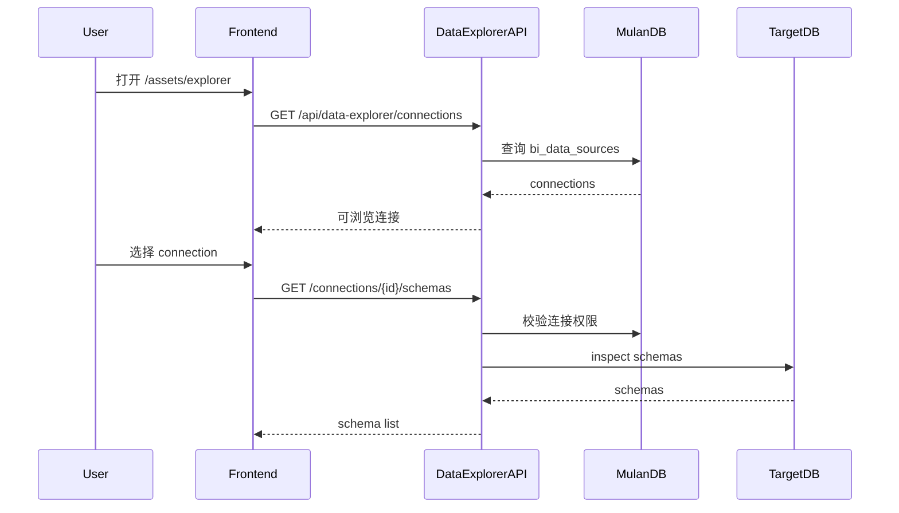
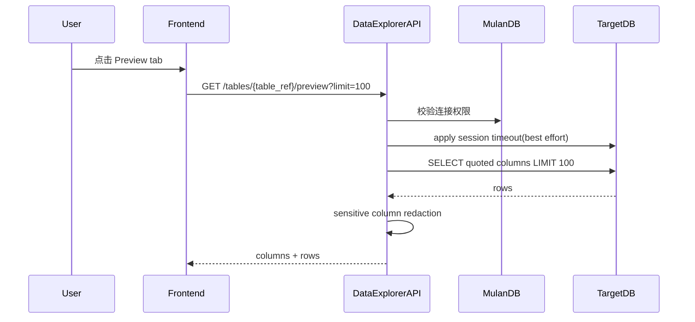

# Database Data Explorer POC 技术规格书

> 版本：v0.2 | 状态：Final / Ready for Implementation | 日期：2026-05-13 | 关联模块：资产 / 数据连接 / 数据浏览

---

## 1. 概述

### 1.1 目的

在 Mulan 中新增一个 Attu-style 的 Database Data Explorer POC，让用户从“数据库连接”出发，在同一个页面完成连接选择、schema/table 浏览、字段查看、数据预览和只读权限摘要。

本 Spec 是 Spec 46，目标不是一开始统一数仓资产、Tableau 资产和指标资产，而是先围绕 `/system/data-connections?tab=datasources` 中已经接入的数据库连接，验证 Data Explorer 的核心产品体验。

### 1.2 背景

当前 Mulan 已有：

- `配置 → 数据连接 → 数据库连接`：维护 `bi_data_sources`。
- `资产 → 数仓资产`：面向已同步/治理后的数仓资产。
- `资产 → Tableau 资产`：面向 Tableau workbook / datasource / view 等 BI 资产。
- Data Agent / SQL Agent：提供问数和 SQL 能力。

但缺少一个面向数据库连接的轻量工作台：

```text
选择数据库连接 → 浏览 schema/table → 查看字段 → 预览数据 → 查看当前权限摘要
```

Attu v3 的启发是：数据控制平面 GUI 应围绕对象工作流组织，而不是把连接、资产、权限、预览分散在不同模块里。

### 1.3 范围

**P0 包含：**

- 新增二级菜单：`资产 → Data Explorer`。
- 新增路由：`/assets/explorer`。
- 只接入数据库连接，即 `bi_data_sources` / `/api/datasources/` 来源。
- 新增独立后端 API：`/api/data-explorer/*`。
- 左侧连接/schema/table 资产树。
- 右侧对象详情页。
- P0 tab：
  - `Overview`
  - `Schema`
  - `Preview`
  - `Permissions(read-only)`
- 对数据预览做行数限制、超时控制、只读 SQL 防护和脱敏。
- 明确 coder / tester 交付清单。

**P0 不包含：**

- 不接入 `资产 → 数仓资产` API。
- 不接入 `资产 → Tableau 资产` API。
- 不复用 `frontend/src/api/dwAssets.ts`。
- 不复用 `frontend/src/api/tableau.ts`。
- 不新增对象级 ACL 写入能力。
- 不做 Grant / Revoke。
- 不做 Facet sidebar、Preview Config、Browse Session 持久化。
- 不做 Agent Panel。
- 不做 SQL 编辑器或任意 SQL 查询。
- 不做后台全量资产同步。

**P1 可扩展：**

- Facet filter / Preview Config。
- Saved filters / Browse sessions。
- 对象级权限模型与 Effective Permission Viewer。
- Context-aware Agent Panel。
- SQL / Semantic API Playground。
- 与数仓资产、Tableau 资产统一为多资产 Data Explorer。

### 1.4 关联文档

| 文档 | 路径 | 关系 |
|------|------|------|
| Spec 模板 | `docs/specs/00-spec-template.md` | 本规格书结构来源 |
| 数据源管理 | `docs/specs/05-datasource-management-spec.md` | 数据库连接来源 |
| 连接管理整合 | `docs/specs/34-connection-management-spec.md` | 连接管理 UI 与路由背景 |
| Data Agent 架构 | `docs/specs/36-data-agent-architecture-spec.md` | P1 Agent Panel 上游 |
| Help Agent | `docs/specs/45-help-agent-spec.md` | P1 对象级诊断与帮助入口 |
| API 约定 | `docs/specs/02-api-conventions.md` | API 响应、错误、认证约定 |
| 认证与 RBAC | `docs/specs/04-auth-rbac-spec.md` | 角色与权限边界 |

---

## 2. 当前代码基线

### 2.1 前端现状

| 文件 | 当前职责 | P0 使用方式 |
|------|----------|-------------|
| `frontend/src/config/menu.ts` | 左侧菜单配置 | 新增 `资产 → Data Explorer` |
| `frontend/src/router/config.tsx` | 路由注册 | 新增 `/assets/explorer` |
| `frontend/src/pages/system/data-connections/page.tsx` | 数据连接页，含 `数据库连接` / `Tableau 连接` tab | Data Explorer 只读取数据库连接来源 |
| `frontend/src/pages/assets/datasources/page.tsx` | 数据库连接 CRUD 页面 | 不复用页面，只复用概念与 API 来源 |
| `frontend/src/api/datasources.ts` | `/api/datasources/` client | 可用于连接列表，但 Data Explorer 建议新增独立 client |

当前 `数据连接` 页面 tab：

```text
/system/data-connections?tab=datasources  → 数据库连接
/system/data-connections?tab=tableau      → Tableau 连接
```

Spec 46 P0 只接入 `tab=datasources`。

### 2.2 后端现状

| 文件 | 当前职责 | P0 使用方式 |
|------|----------|-------------|
| `backend/app/api/datasources.py` | 数据库连接 CRUD / test / parse | 作为连接来源，不直接扩展 Explorer 业务 API |
| `services.datasources.models.DataSourceDatabase` | `bi_data_sources` 访问层 | Data Explorer 读取连接配置与 owner |
| `backend/services/ddl_checker/connector.py` | `DatabaseConnector`，支持连接和 inspect 表/列 | 可复用并扩展为只读 explorer connector |
| `backend/app/main.py` | 路由注册 | 注册 `data_explorer` router |

### 2.3 当前支持的数据库类型

连接管理 UI 当前暴露：

```text
mysql / sqlserver / postgresql / hive / starrocks / doris
```

但当前 `DatabaseConnector` 实际支持：

```text
mysql / postgresql / sqlite / starrocks
```

P0 支持矩阵：

| db_type | P0 Explorer 支持 | 说明 |
|---------|------------------|------|
| `postgresql` | Y | 通过 SQLAlchemy inspector |
| `mysql` | Y | 通过 SQLAlchemy inspector |
| `starrocks` | Y | MySQL 协议，需限制 preview SQL |
| `doris` | P0.5 | 若现有 connector 增加 MySQL 协议支持可开启 |
| `sqlserver` | N | P0 显示“不支持浏览”，不阻塞连接管理 |
| `hive` | N | P0 显示“不支持浏览”，不阻塞连接管理 |

---

## 3. 信息架构与菜单

### 3.1 菜单影响

新增二级菜单：

```text
资产
  ├── Data Explorer      ← 新增
  ├── 数仓资产           ← 保留，不改
  ├── Tableau 资产       ← 保留，不改
  └── 知识库             ← 保留，不改
```

菜单配置建议：

```ts
{
  key: 'data-explorer',
  label: 'Data Explorer',
  icon: 'ri-node-tree',
  path: '/assets/explorer',
  permission: { requiredRole: 'analyst' },
}
```

### 3.2 路由

新增：

```text
/assets/explorer
/assets/explorer/connections/:connectionId
/assets/explorer/connections/:connectionId/schemas/:schemaName/tables/:tableName
```

P0 可以只实现一个 React 页面，通过 query / internal state 切换选中对象：

```text
/assets/explorer?connection_id=1&schema=public&table=orders
```

### 3.3 P0 页面结构

```text
Data Explorer
  ├── 顶部工具栏
  │   ├── 连接搜索
  │   ├── 刷新 metadata
  │   └── 跳转到数据连接管理
  │
  ├── 左侧资产树
  │   ├── Connection
  │   ├── Schema
  │   └── Table / View
  │
  └── 右侧详情
      ├── Overview
      ├── Schema
      ├── Preview
      └── Permissions(read-only)
```

---

## 4. 数据模型

### 4.1 P0 新增表

P0 不新增数据库表。

理由：

- POC 目标是验证连接级数据浏览体验。
- schema/table/column 信息实时从目标数据库 inspect 获取。
- 不引入后台同步和资产缓存，避免和 `数仓资产` 模块边界重叠。

### 4.2 复用表

#### `bi_data_sources`

| 字段 | 用途 |
|------|------|
| `id` | Data Explorer connection id |
| `name` | 连接展示名 |
| `db_type` | 数据库类型与 connector 选择 |
| `host` / `port` / `database_name` | 连接目标 |
| `username` | 连接账号，展示时可见 |
| `password_encrypted` | 后端解密后连接目标数据库，禁止返回前端 |
| `owner_id` | 权限摘要与 owner 判断 |
| `is_active` | 仅 active 连接可浏览 |
| `last_tested_at` / `last_test_success` | Overview 状态 |
| `extra_config` | 连接扩展配置 |

### 4.3 逻辑资源标识

P0 不落库，但 API 与前端必须统一资源编码：

```text
dbconn:{connection_id}
dbschema:{connection_id}.{schema_name}
dbtable:{connection_id}.{schema_name}.{table_name}
dbcolumn:{connection_id}.{schema_name}.{table_name}.{column_name}
```

示例：

```text
dbtable:1.public.orders
```

### 4.4 迁移说明

P0 无 Alembic 迁移。

如果 coder 认为必须增加缓存表、收藏表或浏览会话表，必须先回到 spec 评审，不得在 P0 自行新增。

---

## 5. API 设计

### 5.1 端点总览

新增 router：

```text
backend/app/api/data_explorer.py
```

注册：

```text
app.include_router(data_explorer.router, prefix="/api/data-explorer", tags=["Data Explorer"])
```

端点：

| 方法 | 路径 | 说明 | 认证 | 角色 |
|------|------|------|------|------|
| GET | `/api/data-explorer/connections` | 可浏览数据库连接列表 | 需要 | analyst+ |
| GET | `/api/data-explorer/connections/{connection_id}/overview` | 连接概览 | 需要 | owner 或 admin/data_admin |
| GET | `/api/data-explorer/connections/{connection_id}/schemas` | schema 列表 | 需要 | owner 或 admin/data_admin |
| GET | `/api/data-explorer/connections/{connection_id}/tables` | table/view 列表 | 需要 | owner 或 admin/data_admin |
| GET | `/api/data-explorer/connections/{connection_id}/tables/{table_ref}/overview` | 表概览 | 需要 | owner 或 admin/data_admin |
| GET | `/api/data-explorer/connections/{connection_id}/tables/{table_ref}/columns` | 字段列表 | 需要 | owner 或 admin/data_admin |
| GET | `/api/data-explorer/connections/{connection_id}/tables/{table_ref}/preview` | 受限预览 | 需要 | owner 或 admin/data_admin |
| GET | `/api/data-explorer/connections/{connection_id}/tables/{table_ref}/permissions` | 权限摘要，只读 | 需要 | owner 或 admin/data_admin |

`table_ref` 编码规则：

```text
base64url(utf8(schema + "\x00" + table))
```

规范细节：

- `schema` 与 `table` 均按原始大小写的 UTF-8 字符串编码。
- 分隔符固定使用 NUL 字符 `\x00`。
- base64url 不带 padding。
- 后端 decode 后必须严格拆出两个非空片段；多于或少于两个片段均返回 `DEX_001`。
- decode 成功后仍必须通过 inspector / catalog 校验目标对象存在，`table_ref` 只解决传参确定性，不是安全边界。
- 禁止把 schema/table 直接拼 path，以避免特殊字符、大小写和 `/` 破坏路由。

### 5.2 `GET /connections`

返回当前用户可浏览的 active 数据库连接。

响应：

```json
{
  "items": [
    {
      "id": 1,
      "name": "prod_starrocks",
      "db_type": "starrocks",
      "host": "starrocks.internal",
      "port": 9030,
      "database_name": "analytics",
      "owner_id": 1,
      "is_active": true,
      "last_tested_at": "2026-05-13T10:00:00",
      "last_test_success": true,
      "explorer_supported": true,
      "unsupported_reason": null
    }
  ],
  "total": 1
}
```

权限：

- `admin` / `data_admin` 可看所有 active database connections。
- 其他用户 P0 只能看 `owner_id == current_user.id` 的连接。

### 5.3 `GET /connections/{id}/overview`

响应：

```json
{
  "connection": {
    "id": 1,
    "name": "prod_starrocks",
    "db_type": "starrocks",
    "host": "starrocks.internal",
    "port": 9030,
    "database_name": "analytics",
    "username": "readonly_user",
    "is_active": true,
    "last_tested_at": "2026-05-13T10:00:00",
    "last_test_success": true
  },
  "capabilities": {
    "schemas": true,
    "tables": true,
    "columns": true,
    "preview": true,
    "permissions": "read_only"
  },
  "summary": {
    "schema_count": 3,
    "table_count": 128,
    "view_count": 12
  }
}
```

`summary` 获取失败时，字段可为 `null`，不得导致整个 Overview 失败。

### 5.4 `GET /connections/{id}/schemas`

响应：

```json
{
  "items": [
    {
      "name": "public",
      "table_count": 42,
      "view_count": 5
    }
  ]
}
```

P0 对 MySQL / StarRocks：

- schema 可映射为 database。
- 若连接本身已指定 `database_name`，默认只返回该 database。

P0 对 PostgreSQL：

- 使用 SQLAlchemy inspector 获取 schema。
- 默认隐藏系统 schema：
  - `pg_catalog`
  - `information_schema`

### 5.5 `GET /connections/{id}/tables`

Query：

```text
schema=public
q=orders
type=table|view|all
limit=200
offset=0
```

响应：

```json
{
  "items": [
    {
      "schema": "public",
      "name": "orders",
      "type": "table",
      "comment": "订单表",
      "row_count": null,
      "column_count": 24,
      "table_ref": "cHVibGljAG9yZGVycw"
    }
  ],
  "total": 1,
  "limit": 200,
  "offset": 0
}
```

约束：

- P0 row_count 默认为 `null`，避免对大表执行昂贵 `COUNT(*)`。
- 若特定数据库可低成本从 system catalog 获取估算行数，可返回 `row_count_estimate`，不得执行全表 count。
- 如果对象类型是 `view`，`row_count` 与 `row_count_estimate` 必须强制返回 `null`，禁止尝试 `COUNT(*)` 或系统估算。

### 5.6 `GET /tables/{table_ref}/overview`

响应：

```json
{
  "resource_id": "dbtable:1.public.orders",
  "schema": "public",
  "name": "orders",
  "type": "table",
  "comment": "订单表",
  "primary_key": ["id"],
  "column_count": 24,
  "indexes_count": 3,
  "foreign_keys_count": 2,
  "preview_available": true
}
```

### 5.7 `GET /tables/{table_ref}/columns`

响应：

```json
{
  "items": [
    {
      "name": "id",
      "data_type": "bigint",
      "nullable": false,
      "default": null,
      "comment": "订单 ID",
      "is_primary_key": true,
      "is_indexed": true,
      "semantic_role": "identifier"
    },
    {
      "name": "amount",
      "data_type": "decimal(18,2)",
      "nullable": true,
      "default": null,
      "comment": "订单金额",
      "is_primary_key": false,
      "is_indexed": false,
      "semantic_role": "measure"
    }
  ]
}
```

`semantic_role` P0 用简单规则推断：

| 条件 | semantic_role |
|------|---------------|
| primary key | `identifier` |
| date/time/timestamp | `time` |
| numeric 且非 id | `measure` |
| boolean | `flag` |
| string / enum-like | `dimension` |

### 5.8 `GET /tables/{table_ref}/preview`

Query：

```text
limit=100
```

响应：

```json
{
  "columns": [
    {"name": "id", "data_type": "bigint"},
    {"name": "amount", "data_type": "decimal"}
  ],
  "rows": [
    [1, "99.00"]
  ],
  "limit": 100,
  "truncated": false,
  "execution_time_ms": 82,
  "redaction_applied": true
}
```

安全约束：

- `limit` 最大 100。
- 查询超时 5 秒。
- Preview 前必须尽力设置目标数据库 session 级查询超时，避免 API 超时后底层查询继续执行。
- 后端生成 SQL，前端不得传入 SQL。
- 只允许 `SELECT <quoted columns> FROM <quoted table> LIMIT :limit`。
- 禁止 preview 系统表。
- 字段名、schema 名、table 名必须优先使用 SQLAlchemy Core 生成；方言 reflection 不完整时，可使用 SQLAlchemy dialect identifier preparer / quote API 做标识符转义，但不得拼接未转义用户输入。
- P0 不支持 where/order by。

脱敏规则：

| 字段名命中 | 处理 |
|------------|------|
| `password` / `passwd` / `pwd` / `mima` / `密码` | `******` |
| `token` / `secret` / `api_key` | `******` |
| `phone` / `mobile` / `tel` / `telephone` / `shouji` / `dianhua` / `手机` / `电话` | 保留后 4 位 |
| `email` | mask local part |
| `id_card` / `idcard` / `ssn` / `shenfenzheng` / `身份证` / `证件号` | `******` |

字段名匹配必须大小写不敏感。中文字段名按原始 Unicode 字符串匹配，不做分词。

### 5.9 `GET /tables/{table_ref}/permissions`

P0 只读权限摘要，不做对象级 ACL。

响应：

```json
{
  "resource_id": "dbtable:1.public.orders",
  "mode": "connection_owner_summary",
  "current_user": {
    "id": 1,
    "role": "data_admin",
    "is_owner": true
  },
  "connection": {
    "owner_id": 1,
    "owner_name": "forrest"
  },
  "effective_actions": {
    "view_metadata": true,
    "preview_rows": true,
    "export": false,
    "grant": false
  },
  "explanation": [
    "P0 权限来自数据库连接访问权。",
    "当前用户是连接 owner 或具备 admin/data_admin 角色，因此可以浏览 metadata 和 preview。",
    "P0 不支持对象级 grant/revoke。"
  ]
}
```

---

## 6. 业务逻辑

### 6.1 用户流程

```text
打开 /assets/explorer
-> 左侧展示可浏览数据库连接
-> 选择连接
-> 展开 schema
-> 选择 table
-> 右侧展示 Overview
-> 切换 Schema 查看字段
-> 切换 Preview 查看前 100 行
-> 切换 Permissions 查看只读权限摘要
```

### 6.2 连接访问校验

统一函数：

```python
resolve_explorer_connection(connection_id, current_user, db) -> DataSource
```

规则：

- 连接不存在 → `DEX_002`
- `is_active = false` → `DEX_003`
- `db_type` 不支持 → `DEX_004`
- `admin` / `data_admin` 可访问所有 active database connections。
- 其他用户 P0 只能访问 `owner_id == current_user.id` 的连接。

### 6.3 Metadata 读取

建议新增服务：

```text
backend/services/data_explorer/
  __init__.py
  service.py
  connector.py
  schemas.py
  redaction.py
```

`connector.py` 可以包装现有 `DatabaseConnector`，但必须增加：

- schema listing。
- table/view listing。
- column listing。
- safe preview。
- identifier quote。
- timeout。
- unsupported db_type guard。

### 6.4 Preview SQL 生成

Preview SQL 必须由后端生成，优先使用 SQLAlchemy Core：

```python
stmt = select(*safe_columns).select_from(safe_table).limit(limit)
```

禁止：

```python
f"SELECT * FROM {schema}.{table} LIMIT {limit}"
```

执行要求：

- `table_ref` decode 后必须再次校验 table/view 存在。
- schema、table、column identifier 必须来自 inspector / catalog 结果。
- 参数值必须使用 bind parameter，不得拼接。
- 如果目标数据库方言不支持完整 reflection，允许使用 SQLAlchemy dialect 的 `identifier_preparer.quote()` / 等价 API 生成 quoted identifier，再组装只读 SELECT；仍禁止拼接未转义输入。
- StarRocks / Doris 这类 MySQL 协议数据库如需走方言 SQL，必须有单元测试覆盖包含反引号、点号、空格、大小写混合的 schema/table/column。

### 6.5 Preview 超时与连接释放

Preview 必须同时具备 API 层超时和目标数据库 session 层防护。

API 层：

- Preview 总耗时超过 5 秒返回 `DEX_007`。
- Metadata inspect 总耗时超过 5 秒返回 `DEX_006`。

目标数据库 session 层：

| db_type | P0 session 防护 | 说明 |
|---------|-----------------|------|
| `postgresql` | `SET LOCAL statement_timeout = 5000` | 必须在事务或连接 session 内 preview 前设置 |
| `mysql` | `SET SESSION MAX_EXECUTION_TIME=5000` | 能力可用时必须设置 |
| `starrocks` | best effort 设置 query timeout/session variable | 不支持时记录 warning，不阻断 preview |
| `doris` | best effort 设置 query timeout/session variable | P0.5 开启时执行 |

约束：

- session timeout 设置失败时，不得静默吞掉；必须记录脱敏 warning，并继续依赖 API 层 5 秒超时。
- session timeout 命令属于只读安全防护例外，不视为 DDL/DML。
- 目标数据库 connection 必须用 context manager 或 `try/finally` 释放，成功、异常、超时都要归还连接池。

示例：

```python
conn = engine.connect()
try:
    apply_session_timeout(conn, db_type, timeout_ms=5000)
    rows = conn.execute(stmt, params).fetchmany(limit)
finally:
    conn.close()
```

### 6.6 缓存策略

P0 不做持久缓存。

允许进程内短 TTL 缓存：

| 数据 | TTL | 说明 |
|------|-----|------|
| schema list | 60s | 降低频繁展开成本 |
| table list | 60s | 按 connection + schema 缓存 |
| columns | 300s | 字段变化频率较低 |

缓存不得跨用户泄露权限。cache key 必须包含 `connection_id`，不需要包含 user id，因为连接访问已在入口校验。

---

## 7. 错误码

| 错误码 | HTTP | 说明 | 触发条件 |
|--------|------|------|----------|
| `DEX_001` | 400 | 请求无效 | table_ref 无法解析、limit 超限 |
| `DEX_002` | 404 | 连接不存在 | `bi_data_sources` 无记录 |
| `DEX_003` | 400 | 连接未启用 | `is_active=false` |
| `DEX_004` | 422 | 数据库类型暂不支持浏览 | sqlserver/hive 等 P0 未支持 |
| `DEX_005` | 403 | 无权限访问连接 | 非 owner 且非 admin/data_admin |
| `DEX_006` | 504 | 元数据读取超时 | inspect 超过 5 秒 |
| `DEX_007` | 504 | Preview 超时 | preview 超过 5 秒 |
| `DEX_008` | 500 | Explorer connector 初始化失败 | connector 配置缺失、方言初始化失败 |
| `DEX_009` | 400 | 不允许预览该对象 | 系统表、视图限制或危险对象 |
| `DEX_010` | 502 | 目标数据库连接失败 | active 连接存在，但密码变更、网络断开或目标库拒绝连接 |

错误响应：

```json
{
  "error_code": "DEX_004",
  "message": "当前数据库类型暂不支持 Data Explorer 浏览。",
  "detail": {
    "db_type": "hive"
  }
}
```

`DEX_010` 前端处理要求：

- 左侧连接树对应节点显示红色断开图标。
- 右侧详情区展示可恢复错误状态和脱敏错误摘要。
- 不允许因为 `DEX_010` 导致整个 Data Explorer 页面白屏。
- 错误摘要不得包含 password、token、完整连接串或目标库返回的敏感认证片段。

---

## 8. 安全

### 8.1 角色权限矩阵

| 操作 | admin | data_admin | analyst | user |
|------|-------|------------|---------|------|
| 进入 Data Explorer | Y | Y | Y | N |
| 查看自己连接 metadata | Y | Y | Y | N |
| 查看他人连接 metadata | Y | Y | N | N |
| Preview 自己连接 | Y | Y | Y | N |
| Preview 他人连接 | Y | Y | N | N |
| 查看 Permissions 摘要 | Y | Y | Y | N |
| Grant / Revoke | N(P0) | N(P0) | N | N |
| Export | N(P0) | N(P0) | N | N |

### 8.2 Secret 保护

- API 不得返回 `password_encrypted`。
- API 不得返回解密后的 password。
- 错误信息不得包含连接串。
- 后端日志必须脱敏连接串中的 password。

### 8.3 Preview 数据脱敏

Preview 返回前必须对敏感字段名进行规则脱敏。

P0 不做值级机器学习识别，避免误伤和性能风险。

### 8.4 只读约束

P0 禁止：

- 任意 SQL 输入。
- DDL。
- DML。
- Export。
- 保存查询。
- 修改权限。
- 修改连接配置。

例外：

- 为保护目标数据库而执行的 session 级只读安全命令允许使用，例如 `SET LOCAL statement_timeout`、`SET SESSION MAX_EXECUTION_TIME` 或目标数据库等价 timeout 设置。
- 该例外只能用于限制查询耗时，不得用于修改业务数据、schema、权限或连接配置。

---

## 9. 集成点

### 9.1 上游依赖

| 模块 | 接口/文件 | 用途 |
|------|-----------|------|
| 数据源管理 | `bi_data_sources` | 数据库连接来源 |
| 数据源 API | `/api/datasources/` | 现有连接 CRUD，不直接承载 Explorer |
| DatabaseConnector | `services/ddl_checker/connector.py` | 连接目标数据库、inspect 表/列 |
| Auth/RBAC | `get_current_user` / `require_roles` | 访问控制 |

### 9.2 下游消费者

| 模块 | 消费方式 | 说明 |
|------|----------|------|
| Data Explorer 前端 | `frontend/src/api/dataExplorer.ts` | P0 主消费者 |
| Help Agent | P1 `page_context` | 可诊断当前 connection/table |
| Data Agent | P1 asset context | 可在当前 table 上提问 |

### 9.3 不集成模块

P0 明确不集成：

- `dwAssets.ts`
- `/api/assets/dw`
- `tableau.ts`
- `/api/tableau/assets`
- Tableau Inspector
- Metrics API
- Semantic Maintenance API

---

## 10. 时序图

### 10.1 打开连接与表列表



### 10.2 Preview



---

## 11. 前端实现

### 11.1 建议目录

```text
frontend/src/api/dataExplorer.ts

frontend/src/pages/assets/data-explorer/
  page.tsx
  components/
    ExplorerTree.tsx
    ConnectionNode.tsx
    TableDetail.tsx
    OverviewTab.tsx
    SchemaTab.tsx
    PreviewTab.tsx
    PermissionsTab.tsx
```

### 11.2 UI 约束

- 不做 landing page。
- 页面首屏就是工作台。
- 左侧资产树宽度固定 280-340px，可 resize 作为 P1。
- 右侧 tab 内容保持密度，避免营销式大卡片。
- Preview 表格必须支持横向滚动和 sticky header。
- 连接不支持浏览时，在树节点显示 disabled 状态和原因。
- 连接发生 `DEX_010` 时，在树节点显示红色断开图标，右侧展示错误面板，不得白屏。
- Preview 加载超过 2 秒时显示明确 loading 文案。

### 11.3 前端状态

P0 可使用组件本地 state，不引入全局 store。

URL 应保存当前选择：

```text
/assets/explorer?connection_id=1&schema=public&table=orders
```

刷新后恢复选中对象。

---

## 12. 测试策略

### 12.1 后端单元测试

| # | 场景 | 预期 | 优先级 |
|---|------|------|--------|
| 1 | admin 请求 connections | 返回所有 active database connections | P0 |
| 2 | analyst 请求 connections | 只返回 owner_id 是自己的 active connections | P0 |
| 3 | 连接不存在 | `DEX_002` | P0 |
| 4 | 连接未启用 | `DEX_003` | P0 |
| 5 | unsupported db_type | `DEX_004` | P0 |
| 6 | 非 owner analyst 访问连接 | `DEX_005` | P0 |
| 7 | table_ref 非法 | `DEX_001` | P0 |
| 8 | preview limit > 100 | 自动限制到 100 或 `DEX_001`，按实现统一 | P0 |
| 9 | preview 敏感列 | 返回值被 mask | P0 |
| 10 | connector 超时 | `DEX_006` / `DEX_007` | P0 |
| 11 | `table_ref` 使用 `schema + "\x00" + table` 编码 | 前后端 encode/decode 一致，base64url 无 padding | P0 |
| 12 | `table_ref` 缺少 NUL、多段或空 schema/table | `DEX_001` | P0 |
| 13 | decode 后对象不存在 | `DEX_001` 或 `DEX_009`，按实现统一 | P0 |
| 14 | view 的 row count | `row_count=null` 且 `row_count_estimate=null` | P0 |
| 15 | 中文/拼音敏感列 | `密码/mima/手机/shouji/身份证/shenfenzheng` 按规则 mask | P0 |
| 16 | PostgreSQL preview | preview 前执行 `SET LOCAL statement_timeout = 5000` | P0 |
| 17 | MySQL preview | preview 前执行 `SET SESSION MAX_EXECUTION_TIME=5000` 或能力不可用时 warning | P0 |
| 18 | preview 成功/异常/超时 | 目标数据库 connection 必须 close/归还连接池 | P0 |
| 19 | session timeout 设置失败 | 记录脱敏 warning，并继续依赖 API 层超时 | P0 |

### 12.2 后端集成测试

| # | 场景 | 预期 | 优先级 |
|---|------|------|--------|
| 1 | 使用测试 PostgreSQL 连接 | schemas/tables/columns/preview 全链路通过 | P0 |
| 2 | Preview SQL 注入型 table name | 通过 table_ref + quoting 防护，不执行危险 SQL | P0 |
| 3 | 目标 DB 连接失败 | 返回脱敏错误，不泄露密码 | P0 |
| 4 | active 连接密码被改或网络断开 | 返回 `DEX_010`，不影响连接管理页面 | P0 |

### 12.3 前端测试

| # | 场景 | 预期 | 优先级 |
|---|------|------|--------|
| 1 | 打开 `/assets/explorer` | 展示连接树和空状态 | P0 |
| 2 | 选择连接 | 加载 schema/table | P0 |
| 3 | 选择 table | 默认显示 Overview | P0 |
| 4 | 切换 Schema | 展示字段列表 | P0 |
| 5 | 切换 Preview | 展示前 100 行，敏感列已 mask | P0 |
| 6 | 切换 Permissions | 展示只读权限摘要 | P0 |
| 7 | URL 带 connection/schema/table | 刷新后恢复选中对象 | P0 |
| 8 | unsupported db_type | 显示 disabled 原因 | P0 |
| 9 | `DEX_010` | 树节点显示红色断开图标，右侧错误面板可读，不白屏 | P0 |
| 10 | Preview 脱敏 | 英文、中文、拼音敏感字段均展示 mask 后结果 | P0 |

### 12.4 Mock 与测试约束

- **Target DB**：后端集成测试优先使用本地 PostgreSQL fixture；不得依赖生产数据库。
- **DatabaseConnector**：单元测试应 mock connector，不访问真实网络。
- **Preview**：测试必须断言生成 SQL 不接受前端传入 SQL。
- **权限**：必须覆盖 admin、data_admin、analyst owner、analyst non-owner。
- **脱敏**：fixture 必须包含 `password/token/email/phone` 字段名。
- **中文脱敏**：fixture 必须包含 `密码/mima/手机/shouji/身份证/shenfenzheng` 字段名。
- **table_ref**：必须覆盖 base64url 无 padding、NUL 分隔、非法分隔符、空片段、对象不存在。
- **连接释放**：必须用 mock 断言 success/error/timeout 三类路径都会 close connection。
- **session timeout**：必须覆盖 PostgreSQL/MySQL 注入，以及 unsupported dialect 的 warning fallback。
- **超时**：用 mock sleep 模拟，不用真实等待 5 秒。

---

## 13. 验收标准

- [ ] 菜单出现 `资产 → Data Explorer`。
- [ ] `/assets/explorer` 可访问。
- [ ] Data Explorer 只展示数据库连接，不展示 Tableau 连接。
- [ ] 不调用 `/api/assets/dw`。
- [ ] 不调用 `/api/tableau/assets`。
- [ ] 用户可选择数据库连接并展开 schema/table。
- [ ] 用户可查看 table Overview。
- [ ] 用户可查看 columns Schema。
- [ ] 用户可 Preview 前 100 行。
- [ ] Preview 不允许输入任意 SQL。
- [ ] Preview SQL 使用 SQLAlchemy Core 或 SQLAlchemy 方言 quote API，不拼接未转义输入。
- [ ] Preview 前对 PostgreSQL/MySQL 注入 session 级 timeout；不支持时记录 warning。
- [ ] Preview 成功、异常、超时路径都释放目标数据库连接。
- [ ] Preview 敏感字段按规则脱敏。
- [ ] Preview 脱敏覆盖英文、中文、拼音字段名。
- [ ] `table_ref` 统一使用 `base64url(utf8(schema + "\x00" + table))`，无 padding。
- [ ] View 的 `row_count` 和 `row_count_estimate` 均为 `null`。
- [ ] 目标数据库连接失败返回 `DEX_010`，前端树节点显示红色断开状态且页面不白屏。
- [ ] Permissions tab 展示只读权限摘要。
- [ ] 非 owner analyst 不能浏览他人连接。
- [ ] unsupported db_type 有明确提示。
- [ ] 后端目标测试通过。
- [ ] 前端 type-check 通过。

---

## 14. 开放问题

| # | 问题 | 建议 | 状态 |
|---|------|------|------|
| 1 | Doris 是否 P0 支持 | 若确认 MySQL 协议可用，可在 connector 中按 StarRocks 类似支持 | 待确认 |
| 2 | analyst 是否应看 data_admin 创建的共享连接 | P0 不支持共享；P1 交给对象级权限模型 | Deferred |
| 3 | 是否展示 row count | P0 table 可展示低成本 estimate；view 强制 `null`；禁止 `COUNT(*)` | Closed for P0 |
| 4 | 是否保存浏览状态 | P0 用 URL；P1 做 browse session | Deferred |
| 5 | 是否接 Agent Panel | P1 接 Spec 45 / Data Agent context | Deferred |

---

## 15. 开发交付约束

### 15.1 架构约束

- Data Explorer P0 必须使用独立 API：`/api/data-explorer/*`。
- 禁止复用 `/api/assets/dw/*`。
- 禁止复用 `/api/tableau/*`。
- 禁止在 P0 新增资产同步表。
- 禁止把 Data Explorer 做成 `数据连接` 页面内部 tab；它必须是 `资产` 域独立二级菜单。
- 后端只读目标数据库，禁止执行 DDL / DML。
- session 级 timeout / cancellation 命令是只读安全防护例外，只允许用于限制查询耗时。
- Preview SQL 必须由后端生成，禁止前端传 SQL。
- Preview SQL 必须优先使用 SQLAlchemy Core；方言不支持时只能使用 SQLAlchemy identifier quote API 转义标识符。
- Preview 必须在目标数据库支持时注入 session 级 timeout，且保留 API 层 5 秒超时。
- Preview 的目标数据库 connection 必须通过 context manager 或 `try/finally` 在成功、异常、超时路径释放。
- `table_ref` 必须统一使用 `base64url(utf8(schema + "\x00" + table))`，不带 padding。
- `table_ref` decode 后必须拆出两个非空片段，并再次校验对象存在。
- View 的 `row_count` 与 `row_count_estimate` 必须返回 `null`，禁止对 view 估算或 count。
- Preview 脱敏必须覆盖英文、中文、拼音字段名规则。
- 目标数据库连接失败必须返回 `DEX_010`，不得造成前端白屏。
- 所有目标数据库错误必须脱敏。
- 所有连接 secret 禁止返回前端。

### 15.2 强制检查清单

Coder 提交前必须执行：

```bash
python3 -m py_compile backend/app/api/data_explorer.py
python3 -m pytest backend/tests/app/api/test_data_explorer.py -q
npm run type-check
```

如果后端测试需要从 `backend` 目录运行：

```bash
cd backend
python3 -m pytest tests/app/api/test_data_explorer.py -q
```

### 15.3 禁止事项

- 禁止修改 `数仓资产` 和 `Tableau 资产` 的现有 API 行为。
- 禁止在 P0 合并现有资产菜单。
- 禁止在 Preview 中支持任意 SQL。
- 禁止在 Preview 中拼接未转义 schema/table/column。
- 禁止返回密码、token、连接串。
- 禁止对大表执行无保护 `COUNT(*)`。
- 禁止对 view 执行 `COUNT(*)` 或 row count estimate。
- 禁止 API 层 timeout 后遗留目标数据库 connection 不释放。
- 禁止把 `table_ref` 当作安全边界，必须二次校验对象存在。
- 禁止将 unsupported db_type 静默失败。
