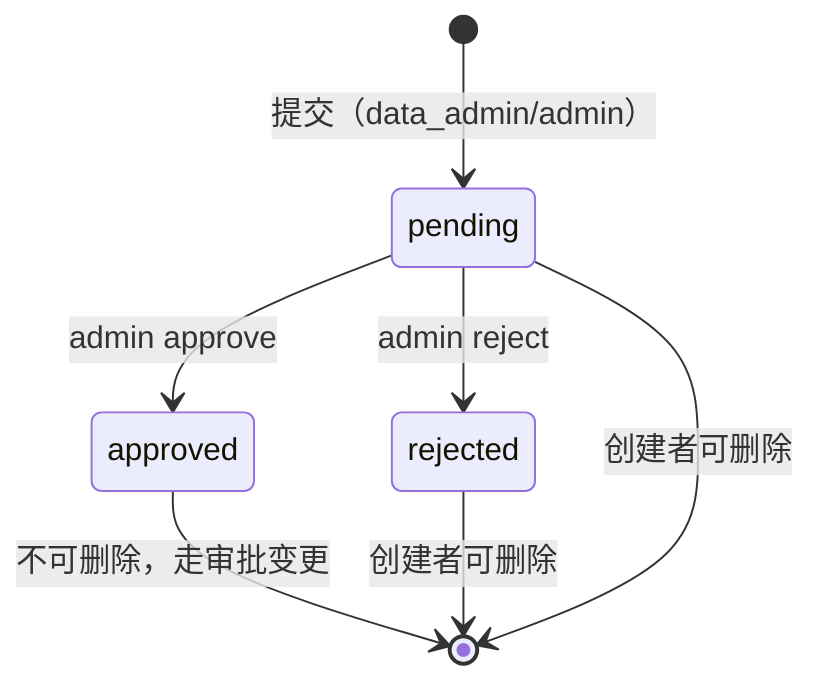
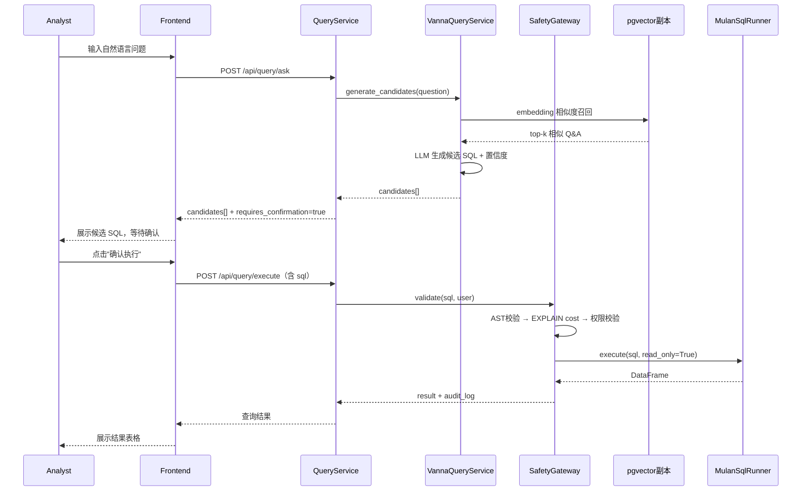

# Vanna NL2SQL 集成 技术规格书

> 版本：v0.1 | 状态：草稿 | 日期：2026-05-12 | 关联文档：`00_Inbox/Vanna集成落地建议书.md` v2.4

---

## 1. 概述

### 1.1 目的

将 Vanna 的 NL2SQL 训练召回能力集成到 Mulan BI Platform，提供**受控 SQL 候选生成**功能，让 analyst 可通过自然语言生成 SQL 候选并在人工确认后执行。

### 1.2 范围

- **包含**：SQL 候选生成（不自动执行）、训练数据管理（提交/审批）、SQL Safety Gateway、Eval 体系（Mock 数据）
- **不包含**：NL→VizQL 路径（保留现有 `nl_to_vizql.py`，不修改）、流式输出（Phase 2 再做）、多租户隔离（当前为单租户私有化部署）

### 1.3 架构决策记录

| 决策 | 结论 | 理由 |
|------|------|------|
| 租户模型 | 单租户私有化部署 | 多租户 HNSW 需专用向量引擎，当前不引入 |
| 向量存储部署 | pgvector 独立只读副本 | 防止余弦计算抢占 OLTP 连接池 |
| Eval 沙箱数据 | 人工构造 Mock 数据 | 生产数据克隆管道工期不可控 |
| Vanna 定位 | 召回+生成组件，非 Mulan NL2SQL 替代品 | 保留现有路径，Vanna 作为并行候选路径 |

### 1.4 关联文档

| 文档 | 路径 | 关系 |
|------|------|------|
| 设计建议书 | `00_Inbox/Vanna集成落地建议书.md` | 需求与设计来源（v2.4） |
| Auth/RBAC Spec | `docs/specs/04-auth-rbac-spec.md` | 鉴权依赖 |
| LLM Service | `backend/services/llm/service.py` | embedding 生成依赖 |

---

## 2. 数据模型

### 2.1 表定义

> 前缀约定：所有新表使用 `vanna_` 前缀。

#### `vanna_training_qa`

| 列名 | 类型 | 约束 | 说明 |
|------|------|------|------|
| id | UUID | PK, DEFAULT gen_random_uuid() | 主键 |
| question | TEXT | NOT NULL | 自然语言问题 |
| sql | TEXT | NOT NULL | 对应 SQL |
| question_embedding | vector(1536) | NULLABLE | 问题 embedding |
| sql_embedding | vector(1536) | NULLABLE | SQL embedding |
| status | TEXT | NOT NULL, DEFAULT 'pending', CHECK IN ('pending','approved','rejected') | 审批状态 |
| datasource_id | UUID | FK → bi_data_sources(id) | 关联数据源 |
| workspace_id | UUID | NULLABLE | NULL = org 级别 |
| schema_version | TEXT | NULLABLE | 数据源 schema 版本 |
| visibility_scope | TEXT | NOT NULL, DEFAULT 'private', CHECK IN ('private','team','org') | 可见范围 |
| rejection_reason | TEXT | NULLABLE | 拒绝原因 |
| approved_by | UUID | FK → auth_users(id) | 审批人 |
| rejected_by | UUID | FK → auth_users(id) | 拒绝人 |
| created_by | UUID | NOT NULL, FK → auth_users(id) | 创建人 |
| created_at | TIMESTAMPTZ | NOT NULL, DEFAULT now() | 创建时间 |
| updated_at | TIMESTAMPTZ | NOT NULL, DEFAULT now() | 更新时间 |
| tenant_id | UUID | NOT NULL | 租户 ID |

#### `vanna_training_ddl`

| 列名 | 类型 | 约束 | 说明 |
|------|------|------|------|
| id | UUID | PK | 主键 |
| ddl | TEXT | NOT NULL | DDL 文本 |
| ddl_embedding | vector(1536) | NULLABLE | DDL embedding |
| datasource_id | UUID | FK | 关联数据源 |
| workspace_id | UUID | NULLABLE | NULL = org 级别 |
| schema_version | TEXT | NULLABLE | schema 版本 |
| visibility_scope | TEXT | NOT NULL, DEFAULT 'private' | 可见范围 |
| status | TEXT | NOT NULL, DEFAULT 'pending' | 审批状态 |
| rejection_reason | TEXT | NULLABLE | — |
| approved_by | UUID | FK | — |
| rejected_by | UUID | FK | — |
| created_by | UUID | NOT NULL, FK | — |
| created_at | TIMESTAMPTZ | NOT NULL, DEFAULT now() | — |
| updated_at | TIMESTAMPTZ | NOT NULL, DEFAULT now() | — |
| tenant_id | UUID | NOT NULL | — |

#### `vanna_training_doc`

| 列名 | 类型 | 约束 | 说明 |
|------|------|------|------|
| id | UUID | PK | 主键 |
| content | TEXT | NOT NULL | 文档内容 |
| doc_embedding | vector(1536) | NULLABLE | 文档 embedding |
| source_type | TEXT | NOT NULL, CHECK IN ('policy','schema_doc','business_rule') | 文档类型 |
| datasource_id | UUID | FK | 关联数据源 |
| workspace_id | UUID | NULLABLE | — |
| schema_version | TEXT | NULLABLE | — |
| visibility_scope | TEXT | NOT NULL, DEFAULT 'private' | — |
| status | TEXT | NOT NULL, DEFAULT 'pending' | — |
| rejection_reason | TEXT | NULLABLE | — |
| approved_by | UUID | FK | — |
| rejected_by | UUID | FK | — |
| created_by | UUID | NOT NULL, FK | — |
| created_at | TIMESTAMPTZ | NOT NULL, DEFAULT now() | — |
| updated_at | TIMESTAMPTZ | NOT NULL, DEFAULT now() | — |
| tenant_id | UUID | NOT NULL | — |

#### `vanna_eval_benchmark`

| 列名 | 类型 | 约束 | 说明 |
|------|------|------|------|
| id | UUID | PK | 主键 |
| question | TEXT | NOT NULL | 金标问题 |
| expected_sql | TEXT | NOT NULL | 期望 SQL |
| alternative_sqls | TEXT[] | DEFAULT '{}' | 等价写法列表 |
| datasource_id | UUID | FK | 关联数据源 |
| schema_version | TEXT | NULLABLE | 金标对应 schema 版本 |
| difficulty | TEXT | NOT NULL, CHECK IN ('easy','medium','hard') | 难度 |
| category | TEXT | NOT NULL, CHECK IN ('aggregation','join','filter','subquery','window_function') | 类型 |
| eval_instructions | TEXT | NULLABLE | 人工评分说明 |
| created_by | UUID | NOT NULL, FK | 创建人 |
| created_at | TIMESTAMPTZ | NOT NULL, DEFAULT now() | — |
| tenant_id | UUID | NOT NULL | — |

### 2.2 索引策略

| 表 | 索引名 | 列 | 类型 | 说明 |
|----|--------|-----|------|------|
| vanna_training_qa | idx_vanna_qa_status | status | BTREE | 状态过滤 |
| vanna_training_qa | idx_vanna_qa_tenant | tenant_id | BTREE | 租户过滤 |
| vanna_training_qa | idx_vanna_qa_datasource | datasource_id | BTREE | 数据源过滤 |
| vanna_training_qa | idx_vanna_qa_workspace | workspace_id | BTREE | workspace 过滤 |
| vanna_training_qa | idx_vanna_qa_question_emb_hnsw | question_embedding | HNSW (cosine) | 向量召回，建在只读副本 |
| vanna_training_ddl | （同上模式） | — | — | — |
| vanna_training_doc | （同上模式） | — | — | — |
| vanna_eval_benchmark | idx_vanna_eval_difficulty | difficulty | BTREE | — |
| vanna_eval_benchmark | idx_vanna_eval_category | category | BTREE | — |

**HNSW 索引参数**：`m=16, ef_construction=200, WHERE status='approved'`（单租户，全局索引，仅建在向量只读副本上）

### 2.3 迁移说明

- 需先执行 `CREATE EXTENSION IF NOT EXISTS vector;`
- HNSW 索引不支持 `UPDATE`，`pending→approved` 状态变更后需在低峰时段执行 `REINDEX INDEX CONCURRENTLY`
- 向量副本通过流复制同步，HNSW 索引需在副本单独创建（主库不建 HNSW）

---

## 3. API 设计

### 3.1 端点总览

所有端点为 RPC 风格，路径动词明确操作意图。

| 方法 | 路径 | 说明 | 鉴权 | 角色 |
|------|------|------|------|------|
| POST | `/api/query/ask` | 生成 SQL 候选（不执行） | 需要 | 全部 |
| GET | `/api/query/history` | 对话历史 | 需要 | 全部 |
| POST | `/api/vanna/train/submit` | 提交 Q&A 训练数据 | 需要 | data_admin, admin |
| POST | `/api/vanna/train/submit-ddl` | 提交 DDL 训练数据 | 需要 | data_admin, admin |
| POST | `/api/vanna/train/submit-doc` | 提交文档训练数据 | 需要 | data_admin, admin |
| GET | `/api/vanna/train/list` | 列出训练数据 | 需要 | data_admin, admin |
| POST | `/api/vanna/train/{id}/delete` | 删除 own pending 数据 | 需要 | 全部角色（own + pending） |
| POST | `/api/vanna/train/{id}/approve` | 审批 pending → approved | 需要 | admin |
| POST | `/api/vanna/train/{id}/reject` | 拒绝 pending → rejected | 需要 | admin |
| GET | `/api/vanna/eval/report` | eval 评估报告 | 需要 | admin |

### 3.2 关键请求/响应 Schema

#### `POST /api/query/ask`

**请求：**
```json
{
  "question": "华东区 2025 Q1 毛利率最高的 10 个产品",
  "datasource_id": "uuid"
}
```

**响应 (200)：**
```json
{
  "candidates": [
    {
      "sql": "SELECT ...",
      "confidence": 0.87,
      "source": "embedding_recall",
      "similar_question": "华东区 2024 Q4 毛利率最高的产品"
    }
  ],
  "requires_confirmation": true
}
```

#### `POST /api/vanna/train/submit`

**请求：**
```json
{
  "question": "...",
  "sql": "SELECT ...",
  "datasource_id": "uuid",
  "visibility_scope": "team"
}
```

**响应 (201)：**
```json
{
  "id": "uuid",
  "status": "pending"
}
```

#### `POST /api/vanna/train/{id}/delete`

**校验**（服务层必须执行，不能只靠鉴权中间件）：
```python
record = db.query(VannaTrainingQA).filter_by(id=id).first()
if record.created_by != current_user.id:
    raise PermissionDenied("只能删除自己创建的数据")
if record.status != "pending":
    raise InvalidOperation("只能删除 pending 状态的数据")
```

### 3.3 错误码

| 错误码 | HTTP | 说明 | 触发条件 |
|--------|------|------|---------|
| VAN_001 | 400 | SQL 生成失败 | LLM 无法生成有效 SQL |
| VAN_002 | 400 | SQL 安全校验拒绝 | AST 非 SELECT / EXPLAIN cost 超限 / Prompt Injection |
| VAN_003 | 403 | 删除权限不足 | 非 own 数据或非 pending 状态 |
| VAN_004 | 404 | 训练数据不存在 | id 不存在 |
| VAN_005 | 409 | 状态冲突 | approved 数据不可删除 |
| VAN_006 | 429 | LLM 调用限流 | token 配额超限 |

---

## 4. 业务逻辑

### 4.1 训练数据状态机



### 4.2 SQL Safety Gateway 流程

```
用户确认执行候选 SQL
    ↓
阶段一：Prompt Injection 防护
  · 输入长度 ≤ 2000 字符
  · 检测 "ignore previous instructions" / "system:" → raise PromptInjectionError
  · 检测 LLM 特殊 token（<|im_start|> 等）→ raise PromptInjectionError（不替换，直接拒绝）
    ↓
阶段二：AST 解析 + 白名单
  · sqlglot.parse_one(sql, dialect="postgres")
  · isinstance(ast, exp.Select) → 非 SELECT 拒绝
  · LIMIT 注入（默认 1000）
    ↓
阶段二·五：EXPLAIN cost 预检
  · EXPLAIN sql → 解析 cost 值
  · cost > 100000 → 拒绝，返回 VAN_002
    ↓
阶段三：权限校验
  · 用户对 datasource 有查询权限
  · 字段敏感度分级校验 + 高敏感字段 masking
    ↓
阶段四：执行控制
  · SET LOCAL statement_timeout = '30s'（数据库层强制，不依赖应用层计时）
  · BEGIN READ ONLY
  · 审计日志：user_id + sql + datasource_id + timestamp
```

### 4.3 embedding 召回过滤规则

```
analyst 可见：
  (visibility_scope = 'private' AND created_by = user.id)
  OR visibility_scope IN ('team', 'org')

data_admin 可见：
  (visibility_scope = 'private' AND created_by = user.id)
  OR visibility_scope IN ('team', 'org')

admin 可见：全部 approved

workspace 过滤（全角色）：
  workspace_id = user.workspace_id OR workspace_id IS NULL

schema_version 过滤（有 datasource 时）：
  current_version IS NOT NULL → schema_version = current_version
  current_version IS NULL → 不加过滤（召回无版本标记的旧数据）
```

---

## 5. 错误码

见 §3.3。

---

## 6. 安全

### 6.1 角色权限矩阵

| 操作 | admin | data_admin | analyst | user |
|------|:-----:|:----------:|:-------:|:----:|
| 生成 SQL 候选 | Y | Y | Y | Y |
| 确认执行 SQL | Y | Y | Y | - |
| 提交训练数据 | Y | Y | - | - |
| 审批训练数据 | Y | - | - | - |
| 删除 own pending | Y | Y | Y | Y |
| 删除 approved | - | - | - | - |
| 查看训练列表 | Y（全部） | Y（own+team） | Y（own） | - |
| 查看 eval 报告 | Y | - | - | - |

### 6.2 向量存储隔离

- pgvector 部署在**独立只读副本**，与核心 OLTP 库（auth、workspace、datasource）物理分离
- 核心库与向量副本使用**独立连接池**，互不竞争
- HNSW 索引仅建在向量副本，主库不建

### 6.3 SQL 执行安全

- `statement_timeout` 在数据库层设置，不依赖应用层 try/except 超时
- EXPLAIN cost 拦截防御笛卡尔积等 LIMIT 无法阻止的资源耗尽攻击
- 所有执行记录入审计日志，不可删除

---

## 7. 集成点

### 7.1 上游依赖

| 模块 | 接口 | 用途 |
|------|------|------|
| `services/llm/service.py` | `LLMService.embed()` | question / sql / ddl / doc embedding 生成 |
| `services/llm/service.py` | `LLMService.complete_sql()` | SQL 候选生成 |
| `app/api/auth.py` | `get_current_user` | 鉴权依赖注入 |
| `tableau_connections` | 连接配置 | MulanSqlRunner 获取只读连接 |
| pgvector 只读副本 | SQL 连接 | 向量相似度检索 |

### 7.2 保留路径（不修改）

| 模块 | 说明 |
|------|------|
| `services/query/nl_to_vizql.py` | NL→VizQL 独立路径，与 Vanna 并行，不废弃 |

---

## 8. 时序图



---

## 9. 测试策略

### 9.1 关键场景

| # | 场景 | 预期 | 优先级 |
|---|------|------|--------|
| 1 | analyst 提问 → 生成候选 SQL → 确认执行 | 返回结果集，审计日志记录 | P0 |
| 2 | SQL 含 CROSS JOIN，无 WHERE 限制 | EXPLAIN cost 超限，拒绝执行，返回 VAN_002 | P0 |
| 3 | 输入含 "ignore previous instructions" | PromptInjectionError，返回 VAN_002 | P0 |
| 4 | analyst 删除他人 pending 数据 | PermissionDenied，返回 VAN_003 | P0 |
| 5 | analyst 删除 approved 数据 | InvalidOperation，返回 VAN_005 | P0 |
| 6 | org 级训练数据被 analyst 召回 | 召回成功（workspace_id IS NULL 匹配） | P1 |
| 7 | schema_version=NULL 的数据源，不过滤版本 | 召回不为空 | P1 |
| 8 | embedding 生成失败（LLM 不可用） | 降级返回空 candidates，不抛 500 | P1 |

### 9.2 验收标准（Phase 0b eval 门槛）

- [ ] Execution Accuracy ≥ 85%（Mock 数据金标集，≥ 20 条，easy/medium/hard 各占 1/3）
- [ ] Permission Violation Rate = 0%
- [ ] Generation Failure Rate ≤ 5%
- [ ] 所有 P0 场景测试通过

### 9.3 Mock 与测试约束

- **向量副本连接**：测试时用独立的 test pgvector 实例，不复用主 DB；`VannaQueryService` 的 `vector_db` 依赖通过 `dependency_overrides` 注入
- **HNSW 索引在测试中**：测试库数据量小，可用 ivfflat 代替 HNSW（避免 `lists` 参数限制）；在 conftest.py 中建表时检测数据量后决定索引类型
- **LLM 调用**：单元测试中 mock `LLMService.embed()` 和 `LLMService.complete_sql()`；集成测试用真实 LLM，需要 `OPENAI_API_KEY` 环境变量
- **Safety Gateway EXPLAIN**：测试中需真实 DB 连接才能执行 EXPLAIN；不可 mock EXPLAIN 结果（mock 后无法验证 cost 阈值逻辑）
- **statement_timeout**：集成测试验证超时行为时，构造一个故意慢的 SQL（如 `pg_sleep(60)`），断言 30s 内抛出 `QueryCanceled`

---

## 10. 开放问题

| # | 问题 | 负责人 | 状态 |
|---|------|--------|------|
| 1 | REINDEX CONCURRENTLY 的维护窗口如何安排？ | 运维 | 待定 |
| 2 | LLM 备用供应商（Azure OpenAI）在 Phase 1 接入，embedding 模型维度需一致 | 后端 | 待定 |
| 3 | eval 金标集维护责任人（schema 变更后需更新） | data_admin | 待定 |

---

## 11. 开发交付约束

### 11.1 架构约束

- `services/vanna/` 不得直接 import `app/api/` 层任何模块
- 向量检索必须通过独立连接（`vector_db` 参数），禁止复用核心 DB session
- SQL 执行必须经过 `SafetyGateway.validate()`，禁止 `MulanSqlRunner` 绕过直接调用
- `statement_timeout` 必须在数据库层设置（`SET LOCAL`），不允许只靠 Python `asyncio.wait_for` 超时
- Prompt Injection 检测到异常输入必须 `raise PromptInjectionError`，禁止替换字符后放行

### 11.2 强制检查清单

- [ ] 所有 Vanna API 端点挂接 `get_current_user` 依赖
- [ ] DELETE 端点服务层显式校验 `created_by == current_user.id`
- [ ] `isinstance(ast, exp.Select)` 校验顶层语句类型（不用 `ast.walk()`）
- [ ] EXPLAIN cost 检查在 `statement_timeout` 设置之前执行
- [ ] `sql_equivalence` 函数处理空集返回 `-1.0`，不触发 ZeroDivisionError
- [ ] 向量副本连接串与核心 DB 连接串分开配置（不同环境变量）

### 11.3 验证命令

```bash
cd backend && python3 -m py_compile services/vanna/*.py
cd backend && pytest tests/vanna/ -x -q
cd backend && pytest tests/vanna/ -x -q -k "safety_gateway"  # Safety Gateway 专项
```

### 11.4 正确/错误示范

```python
# ✗ 错误 — walk() 遍历所有子节点，SELECT 以外的节点会导致永远拒绝
if not all(node.__class__.__name__ == "Select" for node in ast.walk()):
    return False, "仅允许 SELECT 语句"

# ✓ 正确 — 只检查顶层语句类型
if not isinstance(ast, exp.Select):
    return False, "仅允许 SELECT 语句"
```

```python
# ✗ 错误 — IN (workspace_id, None) 不匹配 NULL 值
conditions["workspace_id__in"] = [user.workspace_id, None]

# ✓ 正确 — 分离精确匹配与 IS NULL，ORM 生成 OR 条件
conditions["_workspace"] = {
    "workspace_id": user.workspace_id,
    "include_org_level": True,  # → OR workspace_id IS NULL
}
```
