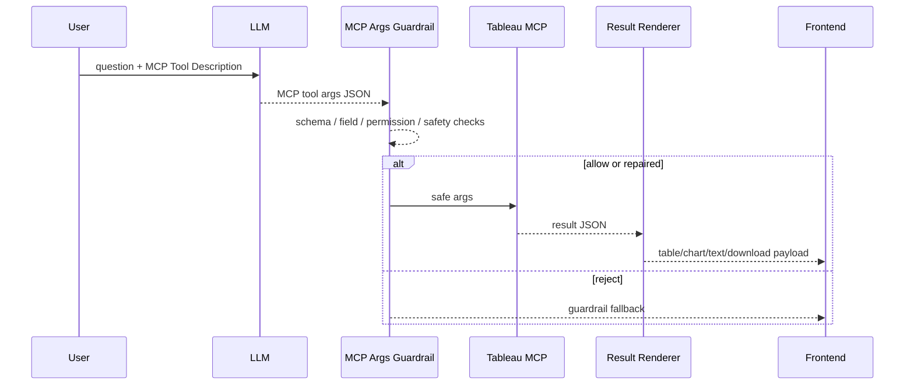

# Data Agent Transparent MCP Proxy 大减负迁移计划

> 版本：v0.1 | 状态：Ready for Review | 日期：2026-05-14 | 目标：将 Data Agent 从 QuerySpec 独裁链路迁移为 Transparent MCP Proxy + Guardrail

---

## 1. 背景与战略调整

### 1.1 旧定位：QuerySpec 独裁者

过去 Mulan Data Agent 在首页问答链路中承担了过多规划职责：

- 抢在 LLM 与 MCP 之前，通过 fallback 快路径强行补指标。
- 强制 LLM 先生成 Mulan 自定义 QuerySpec。
- 再把 QuerySpec 翻译成 Tableau MCP / VizQL 参数。
- 当 LLM 结果与 Mulan 预期不一致时，使用 deterministic `queryspec_fallback.py` 替换。

这导致 Mulan 在本不该做业务判断的地方主动干预：

- 把利润率问题拆错或多加客户数。
- 把“未发生 / 没有销售”查成“发生销售 TopN”。
- 用老三样指标覆盖用户真实问题。
- 因 operator mismatch 直接替换 LLM 计划。

### 1.2 新定位：透明防火墙

新的架构定位：

> LLM 负责基于 MCP Tool Description 生成 MCP 参数；Mulan 只在参数发往底层前做底线安全检查。

目标链路：

```text
User Question
  ↓
LLM reads MCP Tool Description / Schema
  ↓
LLM emits Tableau MCP Args
  ↓
Mulan MCP Args Guardrail checks args
  ↓
Tableau MCP executes
  ↓
Mulan packages result as table / chart / text / download
```

Mulan 不再主动：

- 教 LLM 选业务指标。
- 自动补销售额、利润、客户数。
- 强制中间 QuerySpec。
- 自动改 operator。
- 自动把失败计划替换成 deterministic QuerySpec。

Mulan 保留：

- 权限检查。
- 字段存在性检查。
- 参数 schema 检查。
- 查询规模控制。
- 明细扫描防护。
- 危险操作阻断。
- MCP 超时 / 连续失败熔断。
- 结果包装和可解释展示。

---

## 2. 核心原则

1. **先建防火墙，再拆独裁者**  
   不允许在没有 Guardrail 的情况下裸删 QuerySpec / fallback。

2. **先 feature flag，再默认切换**  
   新链路必须可灰度、可回滚。

3. **QuerySpec 降级，不立刻删除**  
   QuerySpec 从主链路 contract 降级为 legacy adapter / observability snapshot。

4. **Validator 降级为被动安检员**  
   只做安全、权限、字段、规模、方向性底线检查，不做业务规划。

5. **Repair 必须克制**  
   只允许确定性、低风险修补，不允许添加业务指标或重写用户意图。

6. **Reject 必须可理解**  
   Guardrail 拒绝时返回用户可理解的错误和下一步建议，不返回 500。

---

## 3. 目标架构

### 3.1 新主链路



### 3.2 Chain Mode

新增链路选择：

```text
DATA_AGENT_CHAIN_MODE=legacy_queryspec|mcp_proxy
```

P0 默认值必须固定为：

```text
DATA_AGENT_CHAIN_MODE=legacy_queryspec
DATA_AGENT_MCP_PROXY_ENABLED=false
DATA_AGENT_QUERYSPEC_FALLBACK_ENABLED=false
```

环境建议：

| 环境 | 默认值 | 说明 |
|---|---|---|
| 本地开发初期 | `legacy_queryspec` | 防止新链路未完成时影响开发 |
| 实验环境 | `mcp_proxy` + `DATA_AGENT_MCP_PROXY_ENABLED=true` | 跑回归集和真实问答 |
| 稳定后 | `mcp_proxy` + `DATA_AGENT_MCP_PROXY_ENABLED=true` | 通过验收后才允许切为默认主链路 |

链路选择规则：

| 条件 | 行为 |
|---|---|
| `DATA_AGENT_CHAIN_MODE=legacy_queryspec` | 走 `mcp_first_main.py` legacy queryspec chain。 |
| `DATA_AGENT_CHAIN_MODE=mcp_proxy` 且 `DATA_AGENT_MCP_PROXY_ENABLED=true` | 走 Transparent MCP Proxy + Guardrail。 |
| `DATA_AGENT_CHAIN_MODE=mcp_proxy` 但 `DATA_AGENT_MCP_PROXY_ENABLED=false` | 不裸跑新链路；必须回到 legacy queryspec chain 或返回清晰配置错误，并记录 trace。 |
| `DATA_AGENT_QUERYSPEC_FALLBACK_ENABLED=false` | QuerySpec invalid / operator mismatch / validator failed 不得自动调用 `queryspec_fallback.py` 替换计划。 |
| `DATA_AGENT_QUERYSPEC_FALLBACK_ENABLED=true` | 仅作为回滚开关恢复旧 fallback 行为。 |

### 3.3 QuerySpec 未来定位

| 项目 | 旧定位 | 新定位 |
|---|---|---|
| `queryspec.py` | 主查询计划 contract | legacy adapter contract |
| `queryspec_prompt_builder.py` | 主规划 prompt | legacy only |
| `queryspec_validator.py` | 主规划 validator | legacy only；新规则迁到 `mcp_args_guardrail.py` |
| `queryspec_fallback.py` | deterministic 替换器 | deprecated，默认关闭 |
| `mcp_first_main.py` | 主链路 | legacy queryspec chain |

Legacy policy：

1. `queryspec.py` 仅保留为旧链路 adapter contract 和 observability snapshot，不作为新 `mcp_proxy` 主计划 contract。
2. `queryspec_prompt_builder.py` 仅服务 legacy queryspec chain；新链路的 LLM 输入来自 MCP Tool Description / Schema。
3. `queryspec_validator.py` 仅服务 legacy queryspec chain；新链路的 schema、字段、权限、规模与危险操作检查由 `mcp_args_guardrail.py` 承担。
4. `queryspec_fallback.py` deprecated，默认由 `DATA_AGENT_QUERYSPEC_FALLBACK_ENABLED=false` 关闭自动替换；不得默认补指标、改 operator 或重写业务意图。
5. `mcp_first_main.py` 明确命名为 legacy queryspec chain，是 `DATA_AGENT_CHAIN_MODE=legacy_queryspec` 的回滚路径。

### 3.4 回滚策略

回滚只通过 feature flags 和 chain selector 完成，不删除 QuerySpec 相关文件，也不扩大 P0 目标：

1. 新链路异常、准确性回归或 Guardrail reject 不可理解：设置 `DATA_AGENT_CHAIN_MODE=legacy_queryspec`。
2. 需要完全关闭 MCP proxy：设置 `DATA_AGENT_MCP_PROXY_ENABLED=false`。
3. 需要临时恢复旧 QuerySpec fallback 自动替换：设置 `DATA_AGENT_QUERYSPEC_FALLBACK_ENABLED=true`，同时必须记录 fallback reason。
4. 回滚后仍不得使用 SchemaTool / asset inventory / 字段枚举冒充业务答案；错误成功仍按 P0 失败处理。

---

## 4. Guardrail 边界

### 4.1 Guardrail 输入

```python
{
    "question": str,
    "tool_name": str,
    "tool_schema": dict,
    "args": dict,
    "queryable_fields": list[str],
    "current_datasource": dict,
    "user_context": dict,
}
```

### 4.2 Guardrail 输出

```python
{
    "decision": "allow" | "repair" | "reject",
    "args": dict | None,
    "repairs": list[dict],
    "reject_code": str | None,
    "message": str,
    "user_hint": str,
}
```

### 4.3 允许的 Repair

| Repair | 条件 | 示例 |
|---|---|---|
| 补默认 limit | schema 支持 limit 且用户未要求全量 | `limit=100` |
| limit 下调 | 超过安全阈值 | `limit=10000 -> 100` |
| 字段大小写修正 | 只差大小写或空格 | `sales -> Sales` |
| 明确同义字段映射 | queryable_fields 中有唯一近义字段 | `订单日期 -> 发货日期` |
| enum 大小写修正 | schema enum 明确 | `desc -> DESC` |

Repair 必须记录到 explainability：

```json
{
  "type": "field_mapping",
  "from": "订单日期",
  "to": "发货日期",
  "reason": "requested field unavailable; closest queryable date field"
}
```

### 4.4 禁止的 Repair

| 禁止行为 | 原因 |
|---|---|
| 自动添加销售额、利润、客户数 | 业务规划越权 |
| 自动把利润率拆成老三样 | 可能改变用户指标语义 |
| 自动改业务 operator | 可能把问题改反 |
| 自动把“没有销售”改成“有销售” | 方向性错误 |
| 自动重写用户问题 | 不透明且难审计 |
| 自动补候选维度做归因 | 属于规划，不是安检 |

### 4.5 必须 Reject 的场景

| 场景 | 错误码 |
|---|---|
| JSON schema 不合法且无法克制修复 | `MCP_ARGS_SCHEMA_INVALID` |
| 字段不存在且无唯一安全映射 | `MCP_ARGS_UNKNOWN_FIELD` |
| datasource / connection 越权 | `MCP_ARGS_DATASOURCE_FORBIDDEN` |
| 请求 DDL / DML / 任意 SQL 危险操作 | `MCP_ARGS_UNSAFE_OPERATION` |
| 聚合问题请求无上限明细扫描 | `MCP_ARGS_UNSAFE_DETAIL_SCAN` |
| limit 缺失且无法设置默认值 | `MCP_ARGS_LIMIT_REQUIRED` |
| 用户语义与参数方向明显相反 | `MCP_ARGS_SEMANTIC_MISMATCH` |
| 查询结果预计过宽 | `MCP_ARGS_RESULT_TOO_WIDE` |
| MCP 连续失败触发熔断 | `MCP_CIRCUIT_OPEN` |

---

## 5. 迁移 Plan

### Plan 1：建立透明防火墙，不动旧主链路

目标：先新增能力，不破坏现有首页问答。

任务：

1. 新增 `backend/services/data_agent/mcp_args_guardrail.py`。
2. 定义 Guardrail 输入 / 输出 dataclass。
3. 实现 allow / repair / reject。
4. 实现 P0 安全规则。
5. 新增单测。

验收：

- 新 guardrail 单测通过。
- 旧 QuerySpec 链路行为不变。

### Plan 2：新增 MCP Args 直通实验链路

目标：让 LLM 直接生成 MCP Args，但通过 feature flag 灰度。

任务：

1. 新增 `backend/services/data_agent/mcp_proxy_main.py`。
2. 新增 feature flag：

```text
DATA_AGENT_MCP_PROXY_ENABLED=false
```

3. 新链路步骤：
   - 加载 MCP tool description / schema。
   - 让 LLM 直接输出 MCP tool args。
   - 调用 `mcp_args_guardrail`。
   - allow：执行 MCP。
   - repair：记录 repair 后执行 MCP。
   - reject：返回标准 guardrail fallback，不进入 QuerySpec fallback。
4. SSE 事件保持兼容。
5. `response_data` 继续兼容前端。
6. 新增 trace 字段：
   - `chain_mode: mcp_proxy`
   - `guardrail_decision`
   - `guardrail_repairs`

验收：

- flag 关闭时旧链路不受影响。
- flag 打开时可以跑通最小问答。
- 前端 MessageList / QueryResultTable 不需要大改。

### Plan 3：关闭 QuerySpec Fallback 自动替换

目标：先停用最危险的“独裁者”行为。

任务：

1. 新增 feature flag：

```text
DATA_AGENT_QUERYSPEC_FALLBACK_ENABLED=false
```

2. 修改 `mcp_first_main.py`：
   - LLM QuerySpec invalid 时，不再自动 `build_fallback_queryspec`。
   - operator mismatch 时，不再自动替换。
   - validator failed 时，不再 fallback 造 QuerySpec。
3. fallback 关闭时返回标准错误：
   - `fallback_type: query_plan_rejected`
   - `error_code`
   - `user_hint`
   - `trace_id`
4. 保留 `queryspec_fallback.py` 文件，但标记 deprecated。
5. 记录原本会触发 fallback 的 reason。
6. 更新测试：flag on/off 两类。

验收：

- 默认不再自动造 deterministic QuerySpec。
- 需要回滚时可以打开 flag 恢复旧行为。
- 重要问答不出现 500。

### Plan 4：QuerySpec 降级为 Legacy Adapter

目标：把 QuerySpec 从主 contract 降级为兼容层。

任务：

1. 文档标记：
   - `queryspec.py`: legacy adapter contract。
   - `queryspec_prompt_builder.py`: legacy only。
   - `queryspec_validator.py`: legacy only。
2. 新增代码注释：新链路不得新增 QuerySpec 依赖。
3. 标记 `mcp_first_main.py` 为 legacy queryspec chain。
4. 新增 architecture decision record。
5. 新增：

```text
DATA_AGENT_CHAIN_MODE=legacy_queryspec|mcp_proxy
```

6. 逐步把测试集迁到 MCP Args guardrail。

验收：

- 新开发不再扩展 QuerySpec。
- QuerySpec 只服务旧路径和对照日志。
- 无直接删除风险。

### Plan 5：回归测试集和灰度切换

目标：用真实业务问题证明新链路更少干预、更准确。

P0 测试集：

| # | 场景 | 要求 |
|---|---|---|
| 1 | 利润率 | 不得多加客户数 |
| 2 | 未发生 | 不得查成发生销售 TopN |
| 3 | TopN | 不得按订单 ID 排名 |
| 4 | 趋势 | 月度/年度时间粒度正确 |
| 5 | 归因 | 不猜因果，只基于返回数据 |
| 6 | 字段幻觉 | 可映射但必须记录 repair |
| 7 | 明细扫描 | 无 limit 或过大时拒绝 |
| 8 | 权限 | 非当前 datasource 必须拒绝 |
| 9 | 大结果 | 熔断或截断并说明 |
| 10 | MCP 失败 | 返回标准 fallback，不进入老三样补全 |

验收：

- `mcp_proxy` 通过 P0 测试集。
- 与 legacy 对比，利润率、未发生、归因类问题不得退化。
- 所有 reject 都是用户可理解错误，不是 500。

---

## 6. Task 拆分

### Backend Task A：Guardrail 基础

文件：

- `backend/services/data_agent/mcp_args_guardrail.py`
- `backend/tests/services/data_agent/test_mcp_args_guardrail.py`

产出：

- Guardrail dataclass / result schema。
- allow / repair / reject。
- P0 安全规则单测。

### Backend Task B：MCP Proxy 链路

文件：

- `backend/services/data_agent/mcp_proxy_main.py`
- `backend/services/data_agent/runner.py` 或当前 chain selector。
- `backend/tests/services/data_agent/test_mcp_proxy_main.py`

产出：

- feature flag。
- 直通 MCP Args 链路。
- SSE 事件兼容。
- `response_data` 兼容。

### Backend Task C：QuerySpec Fallback 降级

文件：

- `backend/services/data_agent/mcp_first_main.py`
- `backend/services/data_agent/queryspec_fallback.py`
- `backend/tests/services/data_agent/test_queryspec_fallback.py`

产出：

- fallback flag。
- 默认关闭自动替换。
- deprecated 注释。
- flag on/off 测试。

### Backend Task D：Chain Mode 管理

文件：

- `backend/services/data_agent/runner.py`
- 可选新增 `backend/services/data_agent/chain_selector.py`

产出：

```text
DATA_AGENT_CHAIN_MODE=legacy_queryspec|mcp_proxy
```

### Backend Task E：回归测试集

文件：

- `backend/tests/evals/test_data_agent_mcp_proxy_baseline.py`
- 或扩展现有 eval fixtures。

产出：

- 利润率、未发生、TopN、趋势、归因、字段幻觉、明细扫描测试。
- legacy vs mcp_proxy 对比输出。

### Frontend Task F：解释透明化

文件：

- `frontend/src/pages/home/components/AnalysisProcessBlock.tsx`
- `frontend/src/pages/home/components/MessageList.tsx`

产出：

- 展示 `chain_mode: mcp_proxy`。
- 展示 guardrail repair/reject 摘要。
- 不暴露内部长 JSON。
- 用户可理解地展示：
  - “已将 订单日期 映射为 发货日期”
  - “已限制最多返回 100 行”
  - “已阻止未受控明细扫描”

### Docs Task G：Spec 更新

文件：

- `docs/specs/36-data-agent-architecture-spec.md`
- `docs/specs/54-data-agent-transparent-mcp-proxy-plan.md`

产出：

- 旧定位问题复盘。
- 新链路架构。
- Guardrail 边界。
- QuerySpec legacy policy。
- 灰度和回滚策略。

---

## 7. 建议执行顺序

1. Docs Task G：先确认 spec，锁定边界。
2. Backend Task A：先建 Guardrail。
3. Backend Task C：加 flag，停止 queryspec_fallback 自动夺权。
4. Backend Task B：新增 mcp_proxy 实验链路。
5. Backend Task E：跑回归测试。
6. Frontend Task F：补透明解释。
7. Backend Task D：最后做 chain mode 默认切换。

---

## 8. 非目标

P0 不做：

- 删除 `queryspec.py`。
- 删除 `queryspec_validator.py`。
- 删除 `queryspec_prompt_builder.py`。
- 强制所有请求走 `mcp_proxy`。
- 自动修复业务语义。
- 自动补指标。
- 自动重写用户问题。

---

## 9. 验收标准

- [ ] 新增 `mcp_args_guardrail.py` 并通过 P0 单测。
- [ ] `DATA_AGENT_QUERYSPEC_FALLBACK_ENABLED=false` 时不会触发 `queryspec_fallback` 自动替换。
- [ ] `DATA_AGENT_CHAIN_MODE=legacy_queryspec` 时旧链路可用。
- [ ] `DATA_AGENT_CHAIN_MODE=mcp_proxy` 时新链路可跑通基础问答。
- [ ] 利润率问题不被多加客户数。
- [ ] 未发生问题不被查成发生 TopN。
- [ ] 字段映射 repair 被记录到 explainability。
- [ ] 明细扫描无 limit 或 limit 过大时被拒绝。
- [ ] Guardrail reject 返回用户可理解错误，不出现 500。
- [ ] 前端能展示 guardrail repair/reject 摘要。
