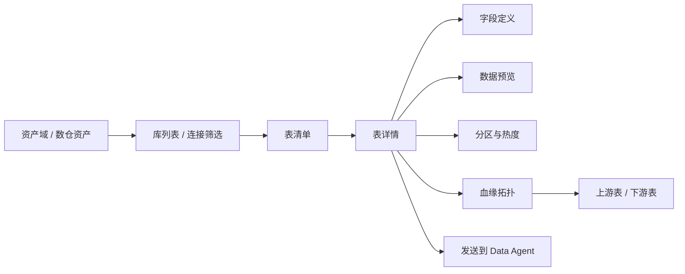
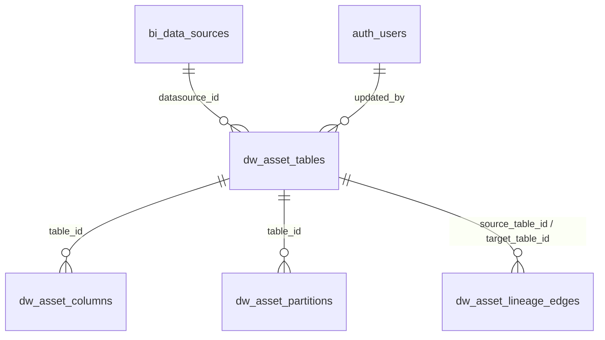
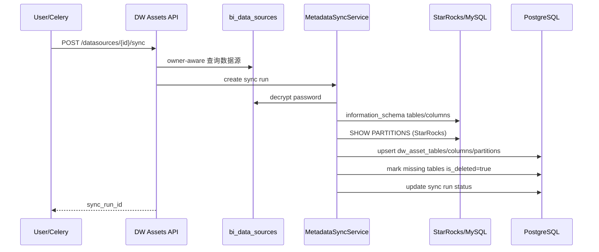

# 数仓资产（DW Assets）技术规格书

> 版本：v0.1 | 状态：草稿 | 日期：2026-05-08 | 关联 PRD：待创建

---

## 0. Spec Audit：现有规范范式总结

### 0.1 文档结构范式

Mulan 现有 Spec 以 `00-spec-template.md` 为骨架，成熟模块通常包含以下固定结构：

1. **概述**：目的、范围、关联文档，明确包含与不包含。
2. **数据模型**：表定义、ER 关系、索引策略、Alembic 迁移说明。
3. **API 设计**：端点总览、请求/响应 Schema、错误响应。
4. **业务逻辑**：状态机、校验规则、幂等策略、同步流程。
5. **错误码**：模块级错误码，格式遵循 `01-error-codes-standard.md`。
6. **安全**：RBAC 矩阵、IDOR 防护、加密/脱敏、敏感数据处理。
7. **集成点**：上游依赖、下游消费者、事件发射。
8. **时序图**：关键链路用 Mermaid 表达。
9. **测试策略**：P0/P1 场景、验收标准、Mock 约束。
10. **开发交付约束**：模块专属红线，供后续 coder 强制遵循。

Tableau 资产 Spec 的写法偏"系统边界 + 数据同步 + 资产治理"，Metrics Agent Spec 的写法偏"Source of Truth + 上下游消费 + 血缘/版本/审计"。本 Spec 采用二者结合：DW Assets 是数仓物理资产的 Source of Truth，同时承担 Data Agent / SQL Agent / DQC / 指标治理的元数据底座。

### 0.2 权限定义范式

现有平台使用四级角色：

`user < analyst < data_admin < admin`

权限定义遵循：

- 页面可见性使用前端 `menuConfig.permission.requiredRole` 或 `adminOnly`。
- 后端使用 `get_current_user`、`get_current_admin`、`require_roles([...])`。
- 属主资源必须做 IDOR 防护。根据 `02-api-conventions.md` §3.3.1，写操作不得只按 `id` 查询后在 Python 中判断 owner；非 admin 路径必须在查询层携带 `owner_id` 或通过父资源链式约束。
- 数据源、Tableau 连接等连接类资源采用 admin 可看全部，非 admin 只看自有或授权资源的模式。

DW Assets 权限采用：

- `analyst+`：只读浏览、搜索、查看字段、血缘、低风险预览。
- `data_admin+`：触发同步、编辑业务别名、标注分层/主题域、维护手工血缘。
- `admin`：跨连接全局管理、删除/归档资产、强制重建索引、查看同步错误明细。

### 0.3 API 命名约定

根据 `02-api-conventions.md`：

- 基础路径使用 `/api/{module}`，当前不加版本号。
- URL 使用 kebab-case，集合使用复数名词。
- 单资源使用 `/{collection}/{id}`。
- 动作使用 `POST /{collection}/{id}/{verb}`。
- 请求/响应字段使用 snake_case。
- 时间字段以 `*_at` 结尾，外键以 `*_id` 结尾，JSONB 字段以 `*_json` 结尾。
- 列表响应优先使用分页包络：`items / total / page / page_size / pages`。

因此 DW Assets 后端前缀定义为：

`/api/assets/dw`

前端路由定义为：

`/assets/dw`

---

## 1. 概述

### 1.1 目的

建设 Mulan BI 平台的核心"数仓资产"模块，将 StarRocks/MySQL 等数仓连接中的库、表、字段、分区、热度与血缘元数据同步到本地，形成可搜索、可治理、可被 Data Agent 消费的物理资产目录。

### 1.2 范围

**包含**：

- 基于已有 `bi_data_sources` 连接配置拉取 StarRocks/MySQL 元数据。
- 数仓库表列表、表详情、字段元数据、分区信息、热度指标、数据预览。
- 表级/字段级血缘关系的存储与展示。
- 业务别名、业务描述、主题域、标签等资产治理字段。
- Data Agent 首页交互埋点与上下文引用。

**不包含**：

- 新建数据库连接 CRUD，继续复用现有数据源管理。
- 实时数据质量检测，归属 DQC 模块。
- 指标口径审批，归属 Metrics Agent。
- 复杂 SQL 血缘解析引擎的完整实现，Phase 1 仅支持来源可识别的表级/字段级边。
- 大规模数据导出或全表下载。

### 1.3 关联文档

| 文档 | 路径 | 关系 |
|------|------|------|
| API 约定 | `docs/specs/02-api-conventions.md` | API 命名、分页、IDOR 防护 |
| Auth/RBAC | `docs/specs/04-auth-rbac-spec.md` | 角色与权限模型 |
| 数据源管理 | `docs/specs/05-datasource-management-spec.md` | 复用 `bi_data_sources` 连接配置 |
| Tableau 资产 | `docs/specs/07-tableau-mcp-v1-spec.md` | 资产同步、健康、字段元数据范式 |
| 指标治理 | `docs/specs/30-metrics-agent-spec.md` | Source of Truth、血缘、下游消费范式 |
| 连接管理 | `docs/specs/34-connection-management-spec.md` | 连接域边界 |
| UI/UX 基准 | `docs/specs/25-ui-ux-open-webui-inspired-redesign-spec.md` | 页面视觉规范 |
| 菜单重构 | `docs/specs/18-menu-restructure-spec.md` | 资产域菜单集成 |

---

## 2. 功能目标与消费路径

### 2.1 用户消费路径



消费路径定义：

1. **库**：以 `bi_data_sources` 中的一个活跃 SQL 数据源为入口，展示 `database_name` 对应的数仓库。
2. **表**：在库下按 schema、表类型、主题域、热度、更新时间过滤。
3. **详情**：展示表的业务别名、描述、字段、分区、行数估算、存储量、最近同步状态。
4. **血缘**：以当前表为中心展示上游、下游，支持按层级展开。
5. **Data Agent 交互**：用户可将表或字段作为上下文发送到首页 Data Agent，用于问数、解释字段、生成 SQL。

### 2.2 成功指标

| 指标 | 目标 |
|------|------|
| 元数据同步覆盖 | 活跃 StarRocks/MySQL 数据源 100% 可同步 |
| 列表响应 | P95 < 800ms（缓存命中，本地 PostgreSQL 查询） |
| 表详情响应 | P95 < 1000ms（不含实时预览） |
| 预览响应 | P95 < 5s，超时返回明确错误 |
| 权限隔离 | analyst 不可访问未授权连接资产 |
| Data Agent 引用 | 资产详情页可一键构造表上下文 |

---

## 3. 关联性分析：复用数据库连接配置

### 3.1 现有连接模型

DW Assets 不新增连接表，直接复用：

`bi_data_sources`

关键字段：

| 字段 | 用途 |
|------|------|
| `id` | `datasource_id`，DW 资产归属父资源 |
| `db_type` | 仅 Phase 1 支持 `starrocks`、`mysql` |
| `host` / `port` / `database_name` / `username` | 构建元数据连接 |
| `password_encrypted` | 使用 `get_datasource_crypto()` 解密 |
| `extra_config` | 连接超时、SSL、schema 白名单等扩展 |
| `owner_id` | IDOR 防护父级属主 |
| `is_active` | 仅同步和展示活跃连接 |

### 3.2 连接复用方式

后端实现必须复用现有能力：

- 使用 `app.core.crypto.get_datasource_crypto()` 解密 `password_encrypted`。
- 使用 `services.ddl_checker.connector.DatabaseConnector` 或其抽象能力建立 SQLAlchemy Engine。
- 使用 SQLAlchemy `inspect(engine)` 获取通用表/字段/索引/PK/FK。
- StarRocks 分区信息复用 `DatabaseConnector.show_partitions(db, tbl)`。
- 不允许在 DW Assets 中重新实现密码加密、连接 CRUD 或绕过 `bi_data_sources` 直接保存凭证。

### 3.3 支持范围

| db_type | Phase 1 支持 | 元数据策略 |
|---------|:------------:|-----------|
| `starrocks` | Y | `information_schema` + `SHOW PARTITIONS` |
| `mysql` | Y | `information_schema.TABLES/COLUMNS/STATISTICS` |
| `postgresql` | P2 | SQLAlchemy inspector + `pg_catalog` |
| `hive` | P2 | JDBC/SQLAlchemy 方言另行评估 |
| `sqlserver` | P2 | SQL Server `INFORMATION_SCHEMA` |
| `doris` | P2 | 类 StarRocks，但需单独验证 |

---

## 4. 数据模型

### 4.1 ER 关系



### 4.2 `dw_asset_tables`

表级数仓资产主表，是数仓物理表的本地 Source of Truth。

| 列名 | 类型 | 约束 | 说明 |
|------|------|------|------|
| id | INTEGER | PK, AUTO | 本地主键 |
| asset_uid | VARCHAR(192) | UNIQUE, NOT NULL | 稳定资产 ID，格式 `dw:{datasource_id}:{database_name}:{schema_name}:{table_name}` |
| datasource_id | INTEGER | NOT NULL, FK -> `bi_data_sources.id` | 所属数据源 |
| database_name | VARCHAR(128) | NOT NULL | 数据库名，来自数据源配置或 `information_schema` |
| schema_name | VARCHAR(128) | NOT NULL, DEFAULT '' | schema 名；MySQL/StarRocks 可为空字符串 |
| table_name | VARCHAR(256) | NOT NULL | 物理表名 |
| table_type | VARCHAR(32) | NOT NULL | `BASE TABLE` / `VIEW` / `MATERIALIZED_VIEW` |
| business_name | VARCHAR(256) | NULLABLE | 业务别名，可人工维护 |
| description | TEXT | NULLABLE | 业务描述，优先人工维护，其次表注释 |
| table_comment | TEXT | NULLABLE | 数据库原始表注释 |
| domain | VARCHAR(128) | NULLABLE | 主题域，格式 `"L1/L2"`，如 `"销售/订单"`；L1 单独存为 `"销售"`；见 §16 主题域体系 |
| layer | VARCHAR(32) | NULLABLE | 数仓分层：`ods` / `dim` / `dwd` / `dws` / `ads` / `other` |
| tags_json | JSONB | NOT NULL, DEFAULT `[]` | 标签数组 |
| owner_name | VARCHAR(128) | NULLABLE | 数仓侧 owner 或维护人 |
| row_count_estimate | BIGINT | NULLABLE | 行数估算，来自统计信息 |
| storage_bytes | BIGINT | NULLABLE | 存储大小，无法获取时为空 |
| partition_type | VARCHAR(64) | NULLABLE | 分区类型 |
| partition_key | VARCHAR(256) | NULLABLE | 分区字段或表达式 |
| partition_count | INTEGER | NULLABLE | 分区数量 |
| last_partition_name | VARCHAR(256) | NULLABLE | 最新分区名 |
| last_partition_at | TIMESTAMP | NULLABLE | 最新分区更新时间 |
| heat_score | FLOAT | NOT NULL, DEFAULT 0 | 热度评分 0-100 |
| query_count_7d | INTEGER | NOT NULL, DEFAULT 0 | 近 7 天查询次数 |
| query_count_30d | INTEGER | NOT NULL, DEFAULT 0 | 近 30 天查询次数 |
| last_queried_at | TIMESTAMP | NULLABLE | 最近被查询时间 |
| is_deleted | BOOLEAN | NOT NULL, DEFAULT false | 软删除 |
| raw_metadata_json | JSONB | NOT NULL, DEFAULT `{}` | 原始元数据快照 |
| synced_at | TIMESTAMP | NOT NULL | 最近同步时间 |
| created_at | TIMESTAMP | NOT NULL, DEFAULT now() | 创建时间 |
| updated_at | TIMESTAMP | NOT NULL, DEFAULT now() | 更新时间 |
| updated_by | INTEGER | NULLABLE, FK -> `auth_users.id` | 最近人工维护人 |

唯一约束：

`UNIQUE (datasource_id, database_name, schema_name, table_name)`

`asset_uid` 生成规则：

```text
asset_uid = "dw:{datasource_id}:{database_name}:{schema_name}:{table_name}"
```

说明：

- `database_name` 必须始终填充，来自 `bi_data_sources.database_name` 或 `information_schema.table_schema`。
- `schema_name` 对 MySQL/StarRocks 可为空字符串，但四段式格式固定，例如 `dw:1:dwd::fact_order`。
- API 展示层不得把 `asset_uid` 当作路径解析来源，详情查询以本地 `id` 为准。

### 4.3 `dw_asset_columns`

字段级元数据表。

| 列名 | 类型 | 约束 | 说明 |
|------|------|------|------|
| id | INTEGER | PK, AUTO | 主键 |
| table_id | INTEGER | NOT NULL, FK -> `dw_asset_tables.id` | 所属表 |
| column_name | VARCHAR(256) | NOT NULL | 物理字段名 |
| ordinal_position | INTEGER | NOT NULL | 字段顺序 |
| data_type | VARCHAR(128) | NOT NULL | 原始类型 |
| normalized_type | VARCHAR(64) | NULLABLE | 归一化类型：string/number/date/bool/json |
| is_nullable | BOOLEAN | NULLABLE | 是否可空 |
| is_primary_key | BOOLEAN | NOT NULL, DEFAULT false | 是否主键 |
| is_partition_key | BOOLEAN | NOT NULL, DEFAULT false | 是否分区字段 |
| default_value | TEXT | NULLABLE | 默认值 |
| column_comment | TEXT | NULLABLE | 数据库原始列注释 |
| business_name | VARCHAR(256) | NULLABLE | 字段业务别名 |
| description | TEXT | NULLABLE | 字段业务描述 |
| sensitivity_level | VARCHAR(32) | NOT NULL, DEFAULT `internal` | `public/internal/confidential/restricted` |
| sample_values_json | JSONB | NOT NULL, DEFAULT `[]` | 脱敏样例值，最多 5 个 |
| stats_json | JSONB | NOT NULL, DEFAULT `{}` | null_rate、distinct_count 等 P2 统计 |
| raw_metadata_json | JSONB | NOT NULL, DEFAULT `{}` | 原始字段元数据 |
| created_at | TIMESTAMP | NOT NULL, DEFAULT now() | 创建时间 |
| updated_at | TIMESTAMP | NOT NULL, DEFAULT now() | 更新时间 |

唯一约束：

`UNIQUE (table_id, column_name)`

### 4.4 `dw_asset_partitions`

分区快照表，仅存最近一次同步结果。StarRocks 使用 `SHOW PARTITIONS`，MySQL 非分区表可为空。

| 列名 | 类型 | 约束 | 说明 |
|------|------|------|------|
| id | INTEGER | PK, AUTO | 主键 |
| table_id | INTEGER | NOT NULL, FK -> `dw_asset_tables.id` | 所属表 |
| partition_name | VARCHAR(256) | NOT NULL | 分区名 |
| partition_value | TEXT | NULLABLE | 分区值或范围 |
| row_count_estimate | BIGINT | NULLABLE | 分区行数估算 |
| storage_bytes | BIGINT | NULLABLE | 分区存储大小 |
| visible_version | VARCHAR(64) | NULLABLE | StarRocks 可见版本 |
| raw_metadata_json | JSONB | NOT NULL, DEFAULT `{}` | 原始分区元数据 |
| updated_at | TIMESTAMP | NOT NULL, DEFAULT now() | 更新时间 |

唯一约束：

`UNIQUE (table_id, partition_name)`

### 4.5 `dw_asset_lineage_edges`

表级与字段级血缘边。Phase 1 优先表级，字段级可为空。

| 列名 | 类型 | 约束 | 说明 |
|------|------|------|------|
| id | INTEGER | PK, AUTO | 主键 |
| lineage_type | VARCHAR(32) | NOT NULL | `table` / `column` |
| source_table_id | INTEGER | NULLABLE, FK -> `dw_asset_tables.id` | 上游表 |
| source_column_id | INTEGER | NULLABLE, FK -> `dw_asset_columns.id` | 上游字段 |
| target_table_id | INTEGER | NOT NULL, FK -> `dw_asset_tables.id` | 下游表 |
| target_column_id | INTEGER | NULLABLE, FK -> `dw_asset_columns.id` | 下游字段 |
| relation_type | VARCHAR(32) | NOT NULL | `read` / `join` / `transform` / `manual` |
| confidence | FLOAT | NOT NULL, DEFAULT 1.0 | 置信度 |
| source_system | VARCHAR(64) | NOT NULL | `manual` / `sql_parser` / `etl_log` / `import` |
| transformation_logic | TEXT | NULLABLE | 转换说明或 SQL 片段摘要 |
| raw_metadata_json | JSONB | NOT NULL, DEFAULT `{}` | 原始血缘信息 |
| created_at | TIMESTAMP | NOT NULL, DEFAULT now() | 创建时间 |
| updated_at | TIMESTAMP | NOT NULL, DEFAULT now() | 更新时间 |

约束：

- `CHECK (lineage_type IN ('table', 'column'))`
- `CHECK (lineage_type != 'table' OR source_table_id IS NOT NULL)`
- `CHECK (lineage_type != 'column' OR (source_table_id IS NOT NULL AND source_column_id IS NOT NULL AND target_column_id IS NOT NULL))`
- `CHECK (source_table_id IS NULL OR source_table_id != target_table_id)`，禁止表级自环；字段级同表转换如后续需要，必须通过 `relation_type='transform'` 且另行扩展。

### 4.6 `dw_asset_sync_runs`

元数据同步运行记录。

| 列名 | 类型 | 约束 | 说明 |
|------|------|------|------|
| id | INTEGER | PK, AUTO | 主键 |
| datasource_id | INTEGER | NOT NULL, FK -> `bi_data_sources.id` | 数据源 |
| trigger_type | VARCHAR(32) | NOT NULL | `manual` / `scheduled` |
| status | VARCHAR(32) | NOT NULL | `running` / `success` / `failed` |
| started_at | TIMESTAMP | NOT NULL | 开始时间 |
| finished_at | TIMESTAMP | NULLABLE | 结束时间 |
| tables_found | INTEGER | NOT NULL, DEFAULT 0 | 发现表数 |
| tables_upserted | INTEGER | NOT NULL, DEFAULT 0 | upsert 表数 |
| columns_upserted | INTEGER | NOT NULL, DEFAULT 0 | upsert 字段数 |
| partitions_upserted | INTEGER | NOT NULL, DEFAULT 0 | upsert 分区数 |
| error_message | TEXT | NULLABLE | 脱敏错误消息 |
| details_json | JSONB | NOT NULL, DEFAULT `{}` | 同步细节 |
| operator_id | INTEGER | NULLABLE | 手动触发人 |

### 4.7 索引策略

| 表 | 索引名 | 列 | 类型 | 用途 |
|----|--------|----|------|------|
| dw_asset_tables | ix_dw_table_ds_deleted | `(datasource_id, is_deleted)` | BTREE | 按连接列资产 |
| dw_asset_tables | ix_dw_table_search | `(table_name, business_name)` | BTREE | 搜索兜底 |
| dw_asset_tables | ix_dw_table_domain_layer | `(domain, layer)` | BTREE | 主题域/分层筛选 |
| dw_asset_tables | ix_dw_table_heat | `(heat_score DESC)` | BTREE | 热度排序 |
| dw_asset_columns | ix_dw_col_table | `(table_id, ordinal_position)` | BTREE | 表详情字段列表 |
| dw_asset_columns | ix_dw_col_name | `(column_name)` | BTREE | 字段搜索 |
| dw_asset_partitions | ix_dw_partition_table | `(table_id, partition_name)` | BTREE | 分区查询 |
| dw_asset_lineage_edges | ix_dw_lineage_source | `(source_table_id)` | BTREE | 查下游 |
| dw_asset_lineage_edges | ix_dw_lineage_target | `(target_table_id)` | BTREE | 查上游 |
| dw_asset_sync_runs | ix_dw_sync_ds_started | `(datasource_id, started_at DESC)` | BTREE | 同步历史 |

---

## 5. API 设计

### 5.1 端点总览

后端路由前缀：

`/api/assets/dw`

| 方法 | 路径 | 认证 | 角色 | 说明 |
|------|------|------|------|------|
| GET | `/databases` | Cookie | analyst+ | 获取可浏览的数据源/库列表 |
| GET | `/search` | Cookie | analyst+ | 跨表/字段搜索与 autocomplete |
| GET | `/tables` | Cookie | analyst+ | 获取表清单，分页过滤 |
| GET | `/tables/{table_id}` | Cookie | analyst+ | 获取表详情 |
| PUT | `/tables/{table_id}` | Cookie | data_admin+ | 更新业务别名、描述、主题域、标签 |
| GET | `/tables/{table_id}/columns` | Cookie | analyst+ | 获取字段元数据，分页 |
| PUT | `/tables/{table_id}/columns/{column_id}` | Cookie | data_admin+ | 更新字段业务名、描述、敏感级别 |
| PATCH | `/tables/{table_id}/columns` | Cookie | data_admin+ | 批量更新字段治理信息 |
| GET | `/tables/{table_id}/partitions` | Cookie | analyst+ | 获取分区信息 |
| GET | `/tables/{table_id}/lineage` | Cookie | analyst+ | 获取血缘拓扑 |
| POST | `/tables/{table_id}/lineage` | Cookie | data_admin+ | 新增手工血缘 |
| DELETE | `/tables/{table_id}/lineage/{edge_id}` | Cookie | data_admin+ | 删除手工血缘 |
| GET | `/tables/{table_id}/preview` | Cookie | analyst+ | 获取采样数据预览 |
| POST | `/datasources/{datasource_id}/sync` | Cookie | data_admin+ | 触发元数据同步 |
| GET | `/sync-runs` | Cookie | data_admin+ | 获取同步历史 |
| POST | `/tables/{table_id}/agent-context` | Cookie | analyst+ | 生成 Data Agent 上下文埋点 |

### 5.2 `GET /api/assets/dw/databases`

说明：返回当前用户可访问且 `db_type in ('starrocks', 'mysql')` 的活跃数据源。

查询参数：

| 参数 | 类型 | 默认 | 说明 |
|------|------|------|------|
| db_type | string | 空 | `starrocks` / `mysql` |
| q | string | 空 | 按数据源名或库名搜索 |

响应：

```json
{
  "items": [
    {
      "datasource_id": 1,
      "name": "生产 StarRocks",
      "db_type": "starrocks",
      "database_name": "dwd",
      "host": "10.0.1.10",
      "table_count": 128,
      "last_synced_at": "2026-05-08 10:00:00",
      "sync_status": "success"
    }
  ],
  "total": 1
}
```

### 5.3 `GET /api/assets/dw/search`

说明：为全局搜索、Data Agent autocomplete、资产页搜索框提供跨表/跨字段轻量匹配。搜索只查本地 PostgreSQL 元数据，不连接外部数仓。

查询参数：

| 参数 | 类型 | 默认 | 说明 |
|------|------|------|------|
| q | string | 必填 | 搜索词，最短 2 字符 |
| scope | string | `table` | `table` / `column` / `all` |
| datasource_id | int | 空 | 限定数据源 |
| limit | int | 10 | 最大 50 |

响应：

```json
{
  "items": [
    {
      "type": "table",
      "table_id": 1001,
      "column_id": null,
      "label": "订单事实表",
      "matched_text": "fact_order",
      "datasource_id": 1,
      "database_name": "dwd",
      "table_name": "fact_order",
      "column_name": null,
      "score": 0.92
    }
  ],
  "total": 1
}
```

权限要求：

- 必须复用表列表相同的父级数据源权限谓词。
- analyst 可搜索可见表和非 restricted 字段；restricted 字段不返回。

### 5.4 `GET /api/assets/dw/tables`

查询参数：

| 参数 | 类型 | 默认 | 说明 |
|------|------|------|------|
| datasource_id | int | 空 | 指定数据源 |
| schema_name | string | 空 | schema |
| q | string | 空 | 表名、业务名、描述搜索 |
| domain | string | 空 | 主题域 |
| layer | string | 空 | 数仓分层 |
| table_type | string | 空 | 表类型 |
| has_partition | boolean | 空 | 是否分区表 |
| sort | string | `heat_score` | `heat_score` / `updated_at` / `table_name` |
| page | int | 1 | 页码 |
| page_size | int | 20 | 最大 100 |

响应：

```json
{
  "items": [
    {
      "id": 1001,
      "asset_uid": "dw:1:dwd::fact_order",
      "datasource_id": 1,
      "database_name": "dwd",
      "schema_name": "",
      "table_name": "fact_order",
      "business_name": "订单事实表",
      "description": "订单明细事实表",
      "table_type": "BASE TABLE",
      "domain": "sales",
      "layer": "dwd",
      "row_count_estimate": 98234123,
      "storage_bytes": 4294967296,
      "partition_key": "dt",
      "partition_count": 365,
      "heat_score": 86.5,
      "query_count_7d": 128,
      "field_count": 52,
      "synced_at": "2026-05-08 10:00:00"
    }
  ],
  "total": 128,
  "page": 1,
  "page_size": 20,
  "pages": 7
}
```

### 5.5 `GET /api/assets/dw/tables/{table_id}`

响应：

```json
{
  "id": 1001,
  "asset_uid": "dw:1:dwd::fact_order",
  "datasource": {
    "id": 1,
    "name": "生产 StarRocks",
    "db_type": "starrocks"
  },
  "database_name": "dwd",
  "schema_name": "",
  "table_name": "fact_order",
  "business_name": "订单事实表",
  "description": "订单明细事实表",
  "table_comment": "fact table for orders",
  "domain": "sales",
  "layer": "dwd",
  "tags": ["核心", "订单", "高频"],
  "row_count_estimate": 98234123,
  "storage_bytes": 4294967296,
  "partition_key": "dt",
  "partition_count": 365,
  "last_partition_name": "p20260508",
  "heat_score": 86.5,
  "lineage_summary": {
    "upstream_count": 4,
    "downstream_count": 9
  },
  "synced_at": "2026-05-08 10:00:00"
}
```

### 5.6 `PUT /api/assets/dw/tables/{table_id}`

仅允许维护治理字段，不允许修改物理元数据。

请求：

```json
{
  "business_name": "订单事实表",
  "description": "订单粒度事实表，供销售分析使用",
  "domain": "sales",
  "layer": "dwd",
  "tags": ["核心", "订单"]
}
```

响应：

```json
{
  "message": "数仓资产已更新",
  "table": { "...": "..." }
}
```

### 5.7 `GET /api/assets/dw/tables/{table_id}/columns`

查询参数：

| 参数 | 类型 | 默认 | 说明 |
|------|------|------|------|
| q | string | 空 | 字段名、业务名、注释搜索 |
| sensitivity_level | string | 空 | 敏感级别过滤 |
| page | int | 1 | 页码 |
| page_size | int | 100 | 最大 200 |

分页策略：

- 默认返回 100 个字段，最大 200。
- 宽表超过 200 字段时前端必须分页或使用搜索过滤。
- 响应必须包含标准分页包络，避免大宽表一次性渲染导致页面卡顿。

响应：

```json
{
  "items": [
    {
      "id": 501,
      "column_name": "order_id",
      "ordinal_position": 1,
      "data_type": "BIGINT",
      "normalized_type": "number",
      "is_nullable": false,
      "is_primary_key": true,
      "is_partition_key": false,
      "column_comment": "订单 ID",
      "business_name": "订单 ID",
      "description": "订单唯一标识",
      "sensitivity_level": "internal",
      "sample_values": []
    }
  ],
  "total": 252,
  "page": 1,
  "page_size": 100,
  "pages": 3
}
```

### 5.8 `PUT /api/assets/dw/tables/{table_id}/columns/{column_id}`

说明：更新单个字段的治理信息，不允许修改物理字段名、类型、顺序。

请求：

```json
{
  "business_name": "订单金额",
  "description": "用户实际支付金额，单位元",
  "sensitivity_level": "internal"
}
```

响应：

```json
{
  "message": "字段元数据已更新",
  "column": { "...": "..." }
}
```

### 5.9 `PATCH /api/assets/dw/tables/{table_id}/columns`

说明：批量更新字段治理信息，供详情页字段抽屉批量保存使用。

请求：

```json
{
  "items": [
    {
      "column_id": 501,
      "business_name": "订单金额",
      "description": "用户实际支付金额",
      "sensitivity_level": "internal"
    }
  ]
}
```

约束：

- 单次最多 50 个字段。
- 所有 `column_id` 必须属于 path 中的 `table_id`，否则返回 400。
- 必须写审计事件 `dw_asset.columns_updated`。

### 5.10 `GET /api/assets/dw/tables/{table_id}/partitions`

查询参数：

| 参数 | 类型 | 默认 | 说明 |
|------|------|------|------|
| page | int | 1 | 页码 |
| page_size | int | 50 | 最大 200 |

响应：

```json
{
  "items": [
    {
      "id": 801,
      "partition_name": "p20260508",
      "partition_value": "dt=2026-05-08",
      "row_count_estimate": 1203456,
      "storage_bytes": 52428800,
      "visible_version": "128",
      "updated_at": "2026-05-08 10:00:00"
    }
  ],
  "total": 365,
  "page": 1,
  "page_size": 50,
  "pages": 8
}
```

### 5.11 `GET /api/assets/dw/tables/{table_id}/preview`

查询参数：

| 参数 | 类型 | 默认 | 说明 |
|------|------|------|------|
| limit | int | 20 | analyst 最大 20，data_admin/admin 最大 100 |
| columns | string | 空 | 逗号分隔字段白名单；为空时取前 20 个非 restricted 字段 |

采样逻辑：

1. 先按 `table_id` 查本地元数据，并通过 `datasource_id` 做父级权限校验。
2. 解密 `bi_data_sources.password_encrypted`，建立只读连接。
3. 只允许从 `dw_asset_columns` 中存在的字段构造 SELECT，字段名必须做 identifier quoting，禁止拼接用户传入的任意 SQL。
4. analyst 自动排除 `sensitivity_level in ('confidential', 'restricted')` 字段；data_admin/admin 可查看 `confidential`，`restricted` 默认仍隐藏。
5. SQL 形态固定为：`SELECT <safe_columns> FROM <safe_table> LIMIT :limit`。
6. 超时 5 秒，失败返回脱敏错误。
7. 返回结果不落库；仅记录审计事件 `dw_asset.preview`.

响应：

```json
{
  "columns": [
    {"name": "order_id", "data_type": "BIGINT"},
    {"name": "amount", "data_type": "DECIMAL(18,2)"}
  ],
  "rows": [
    {"order_id": 10001, "amount": "99.00"}
  ],
  "limit": 20,
  "truncated": false,
  "masked_columns": ["user_phone"]
}
```

### 5.12 `GET /api/assets/dw/tables/{table_id}/lineage`

查询参数：

| 参数 | 类型 | 默认 | 说明 |
|------|------|------|------|
| depth | int | 1 | 最大 3 |
| direction | string | `both` | `upstream` / `downstream` / `both` |
| level | string | `table` | `table` / `column` |

响应：

```json
{
  "nodes": [
    {
      "id": "table:1001",
      "type": "table",
      "label": "订单事实表",
      "table_id": 1001,
      "layer": "dwd",
      "heat_score": 86.5
    }
  ],
  "edges": [
    {
      "id": "edge:1",
      "source": "table:900",
      "target": "table:1001",
      "relation_type": "transform",
      "confidence": 0.92
    }
  ],
  "center": "table:1001",
  "depth": 1
}
```

### 5.13 `POST /api/assets/dw/tables/{table_id}/lineage`

说明：新增手工血缘边。Phase 1 仅允许 `source_system='manual'` 的写入。

请求：

```json
{
  "lineage_type": "table",
  "source_table_id": 900,
  "target_table_id": 1001,
  "relation_type": "manual",
  "transformation_logic": "每日订单明细聚合生成"
}
```

响应：

```json
{
  "message": "血缘关系已创建",
  "edge": { "...": "..." }
}
```

### 5.14 `DELETE /api/assets/dw/tables/{table_id}/lineage/{edge_id}`

说明：删除手工血缘。仅允许删除 `source_system='manual'` 的边；自动解析或导入的血缘只能通过重跑同步或导入任务覆盖。

响应：

```json
{
  "message": "血缘关系已删除",
  "success": true
}
```

约束：

- `edge_id` 必须以 `target_table_id = table_id` 或 `source_table_id = table_id` 命中当前表关联边。
- 删除后必须触发关联表的 `downstream_count` 刷新任务。
- 必须写审计事件 `dw_asset.lineage_deleted`。

### 5.15 `POST /api/assets/dw/datasources/{datasource_id}/sync`

请求：

```json
{
  "mode": "incremental",
  "include_partitions": true
}
```

约束：

- `mode` 支持 `incremental` / `full`。
- Phase 1 同步任务可同步执行或投递 Celery，但 API 必须立即返回 `sync_run_id`。
- 非 admin 必须在查询层确认 `bi_data_sources.owner_id == current_user.id` 或具备数据管理员授权。

响应：

```json
{
  "sync_run_id": 42,
  "status": "running",
  "message": "元数据同步已开始"
}
```

### 5.16 `GET /api/assets/dw/sync-runs`

查询参数：

| 参数 | 类型 | 默认 | 说明 |
|------|------|------|------|
| datasource_id | int | 空 | 限定数据源 |
| status | string | 空 | `running` / `success` / `failed` |
| page | int | 1 | 页码 |
| page_size | int | 20 | 最大 100 |

响应：

```json
{
  "items": [
    {
      "id": 42,
      "datasource_id": 1,
      "trigger_type": "manual",
      "status": "success",
      "started_at": "2026-05-08 10:00:00",
      "finished_at": "2026-05-08 10:02:30",
      "tables_found": 128,
      "tables_upserted": 128,
      "columns_upserted": 2432,
      "partitions_upserted": 365,
      "error_message": null
    }
  ],
  "total": 1,
  "page": 1,
  "page_size": 20,
  "pages": 1
}
```

权限要求：

- admin 可查看全部同步历史。
- data_admin 只能查看自有或授权数据源的同步历史。
- analyst 不开放该端点。

### 5.17 `POST /api/assets/dw/tables/{table_id}/agent-context`

说明：生成首页 Data Agent 可消费的上下文，并记录埋点。

请求：

```json
{
  "intent": "ask_about_table",
  "selected_columns": ["order_id", "amount", "dt"]
}
```

响应：

```json
{
  "context": {
    "type": "dw_table",
    "asset_uid": "dw:1:dwd::fact_order",
    "table_name": "fact_order",
    "business_name": "订单事实表",
    "columns": [
      {"name": "order_id", "type": "BIGINT", "business_name": "订单 ID"}
    ]
  },
  "event_id": "uuid"
}
```

---

## 6. 业务逻辑

### 6.1 元数据同步流程



同步策略：

- **增量同步**：以 `(datasource_id, schema_name, table_name)` upsert 表，以 `(table_id, column_name)` upsert 字段。
- **软删除**：本次同步未出现但历史存在的表标记 `is_deleted=true`。
- **人工字段保护**：`business_name`、`description`、`domain`、`layer`、`tags_json` 由人工维护，自动同步不得覆盖非空人工值。
- **错误脱敏**：连接字符串、用户名、密码不得进入 `error_message` 或日志。
- **幂等性**：同一元数据重复同步不得产生重复记录。

### 6.2 热度计算

Phase 1 先采用本地可解释公式：

```text
heat_score = min(100,
  query_count_7d * 0.5 +
  query_count_30d * 0.1 +
  downstream_count * 3 +
  has_recent_partition_bonus
)
```

数据来源优先级：

1. 本平台 Data Agent / SQL Agent 查询日志中的表引用。
2. 手工导入的查询统计。
3. 暂无统计时为 0，不 mock 随机值。

刷新时机：

| 触发 | 刷新范围 | 说明 |
|------|----------|------|
| 元数据同步完成 | 当前 `datasource_id` 下全部表 | 批量刷新 `downstream_count`、分区 bonus、基础热度 |
| 手工血缘新增/删除 | 受影响 source/target 表及一跳邻居 | 同步更新 `downstream_count`，避免详情页显示过期 |
| 每日定时任务 | 全量活跃表 | 从查询日志滚动计算 `query_count_7d/30d` |
| Data Agent / SQL Agent 查询完成 | 命中的表 | 异步累加查询计数，不阻塞用户请求 |

实现约束：

- `downstream_count` 不直接存字段，查询详情时可由血缘边聚合；若为了排序性能引入缓存字段，必须在血缘变更和同步完成后刷新。
- 热度刷新失败不得影响元数据同步主事务，但必须记录 warning 与 sync run `details_json.heat_refresh_error`。

### 6.2.1 定时同步策略

默认调度：

| 项 | 策略 |
|----|------|
| 默认频率 | 每天 02:30 执行活跃 StarRocks/MySQL 数据源增量同步 |
| 手动同步 | data_admin+ 可对自有/授权数据源触发 |
| 并发控制 | 同一 `datasource_id` 只允许一个 `running` sync run |
| 全局并发 | Phase 1 最多 2 个数据源并行同步，避免打爆数仓 |
| 重试策略 | 定时任务失败最多重试 2 次，间隔 5 分钟、15 分钟 |
| 超时策略 | 单数据源同步最长 30 分钟，超时标记 failed |
| 失败通知 | 写入 `dw_asset_sync_runs.error_message`，并发射通知事件 `dw_asset.sync_failed` 给 admin/data_admin |

同一数据源并发控制必须以数据库状态为准：创建新 sync run 前查询 `status='running'`，存在则返回 `DWASSET_004`，不得只依赖进程内锁。

### 6.3 血缘来源

Phase 1 支持：

- 手工维护表级血缘。
- 从已保存 SQL/任务日志中解析简单 `INSERT INTO target SELECT ... FROM source`。
- 从导入 JSON 写入血缘边。

不做：

- 任意复杂 SQL 的 100% 字段级解析承诺。
- 跨系统实时血缘抓取。

### 6.4 连接授权模型

Phase 1 授权范围：

- `admin`：可访问所有 `bi_data_sources` 下的 DW Assets。
- `data_admin`：可访问自己创建的连接；若未来已有共享授权表，则接入该授权表。
- `analyst`：默认可访问自己创建的连接和被授权连接；如果当前代码库尚无 `bi_datasource_grants` 或等价机制，Phase 1 降级为 `owner + admin`，并在 UI 中隐藏无授权数据源。

设计决策：

- 本 Spec 不新建独立 DW 授权表，避免和数据源授权割裂。
- 如果实现时发现已有 `bi_datasource_grants` / shared permissions 能表达数据源授权，DW Assets 必须复用它。
- 所有资产权限都从父级 `bi_data_sources` 继承，不允许对单表单独开放给未授权用户。

---

## 7. 权限矩阵

| 操作 | admin | data_admin | analyst | user |
|------|:-----:|:----------:|:-------:|:----:|
| 查看库/表列表 | Y | Y | Y | N |
| 查看表详情/字段 | Y | Y | Y | N |
| 查看血缘 | Y | Y | Y | N |
| 数据预览 | Y(100 行) | Y(100 行) | Y(20 行，隐藏敏感字段) | N |
| 触发元数据同步 | Y | Y(自有/授权连接) | N | N |
| 编辑业务别名/描述/标签 | Y | Y(自有/授权连接) | N | N |
| 新增/删除手工血缘 | Y | Y(自有/授权连接) | N | N |
| 删除/归档资产 | Y | N | N | N |
| 查看同步错误明细 | Y | Y(自有/授权连接) | N | N |
| 发送到 Data Agent | Y | Y | Y | N |

权限实现要求：

- 所有 `table_id` 子资源必须通过 `dw_asset_tables.datasource_id -> bi_data_sources.id` 做链式权限校验。
- 非 admin 查询必须在 SQL 查询层携带 `owner_id` 或授权谓词，不得只在 Python 层过滤。
- 数据预览必须再次校验父连接权限，不能只信任本地资产表记录。

---

## 8. UI/UX 规范

### 8.1 菜单集成

资产域首位新增：

| key | label | path | icon | 权限 |
|-----|-------|------|------|------|
| `dw-assets` | 数仓资产 | `/assets/dw` | `ri-database-2-line` | analyst+ |

放置规则：

- 位于"资产"域首位，高于 Tableau 资产。
- 域图标保持 `ri-stack-line`。
- 详情页 `/assets/dw/:tableId` 不在菜单中显示。

### 8.2 列表页布局

页面使用工作型布局，避免营销式 hero。

结构：

1. 顶部紧凑标题区：标题"数仓资产"、数据源选择器、同步按钮。
2. 左侧过滤器：数据源、分层、主题域、表类型、是否分区、热度范围。
3. 主区域表资产卡片列表。
4. 右侧可选 Inspector：当前选中表的字段摘要与血缘摘要。

卡片内容：

- 表名 + 业务别名。
- 数据源 / schema / 分层。
- 行数估算、存储量、字段数、分区数。
- 热度条（0-100）。
- 标签与最近同步时间。
- 操作：查看详情、发送到 Data Agent。

样式遵循 Spec 25：

- 页面底色 `bg-slate-50`，卡片 `bg-white border border-slate-200`。
- 品牌色使用 `blue-700`。
- 三态必须完整：Loading / Empty / Error。
- 所有文案中文。
- 卡片圆角不超过 `rounded-lg`。

### 8.3 表详情页布局

详情页分区：

1. Header：表名、业务别名、热度、分层、同步状态。
2. Overview：描述、数据源、行数、存储、分区、更新时间。
3. Tabs：
   - 字段定义
   - 数据预览
   - 分区信息
   - 血缘拓扑
   - 变更/同步记录

字段定义 Tab：

- 表格列：字段名、业务名、类型、主键、分区键、敏感级别、注释。
- analyst 只读；data_admin+ 可打开编辑抽屉维护业务名/描述/敏感级别。

数据预览 Tab：

- 默认不自动加载，用户点击"加载预览"后请求。
- 显示采样行数、脱敏字段提示、加载耗时。
- 超时或权限不足显示 ErrorState。

### 8.4 血缘图展示逻辑

血缘图使用全宽面板而非嵌套卡片。

节点：

- 中心节点：当前表，蓝色强调。
- 上游节点：左侧，slate 中性色。
- 下游节点：右侧，emerald 或 amber 表示影响范围。
- 节点显示：业务名优先，其次表名；副文本显示分层和热度。

边：

- `manual`：实线。
- `sql_parser`：虚线。
- `etl_log`：实线 + 标签。
- 低置信度 `<0.7`：降低透明度并显示"待确认"。

交互：

- 点击节点跳转对应表详情。
- 支持 `depth=1/2/3` 分段控件。
- 支持 upstream/downstream/both segmented control。
- 空血缘显示"暂无血缘关系"，并给 data_admin+ 显示"添加手工血缘"按钮。

### 8.5 与首页 Data Agent 的交互埋点

资产页提供"发送到 Data Agent"动作。

埋点事件：

| 事件 | 触发 | Payload |
|------|------|---------|
| `dw_asset.viewed` | 打开表详情 | `table_id, asset_uid, datasource_id` |
| `dw_asset.previewed` | 加载数据预览 | `table_id, limit, visible_columns_count` |
| `dw_asset.sent_to_agent` | 发送到 Data Agent | `table_id, selected_columns, intent` |
| `dw_asset.lineage_opened` | 打开血缘 Tab | `table_id, depth, direction` |

Data Agent 上下文必须只包含元数据与低风险样例，不得直接注入大量真实数据值。

---

## 9. 错误码

| 错误码 | HTTP | 说明 | 触发条件 |
|--------|------|------|----------|
| DWASSET_001 | 404 | 数仓资产不存在 | table_id 不存在或无权限 |
| DWASSET_002 | 403 | 无权访问该数据源资产 | 父级数据源不属于当前用户且非 admin |
| DWASSET_003 | 400 | 不支持的数据源类型 | 非 starrocks/mysql |
| DWASSET_004 | 409 | 同步任务已在运行 | 同一 datasource 存在 running |
| DWASSET_005 | 500 | 元数据同步失败 | information_schema 或连接异常 |
| DWASSET_006 | 400 | 非法字段选择 | preview columns 不在字段白名单 |
| DWASSET_007 | 503 | 数据预览超时 | 预览查询超过 5 秒 |
| DWASSET_008 | 400 | 非法血缘关系 | source/target 不存在或形成自环 |

---

## 10. 安全与合规

### 10.1 连接安全

- 不保存新凭证，只读取 `bi_data_sources.password_encrypted`。
- 解密只发生在同步和预览执行期间。
- 日志和错误响应不得包含 host 以外的敏感连接信息，不得包含 password、完整 JDBC URL。

### 10.2 SQL 安全

- 数据预览禁止接收任意 SQL。
- 所有表名、字段名来自本地已同步元数据并做 identifier quoting。
- LIMIT 使用参数化或整数白名单。
- 禁止 preview 执行 JOIN、WHERE 用户表达式、ORDER BY 用户输入。
- preview 必须使用独立短生命周期连接，查询结束立即 dispose，不复用元数据同步连接。
- preview 必须设置 `statement_timeout` 或等价执行超时：PostgreSQL/MySQL/StarRocks 统一目标 5 秒；不支持 session timeout 的方言必须用应用层 `asyncio.wait_for` 兜底。
- preview 连接池容量必须独立限制，Phase 1 默认最多 2 个并发 preview，防止慢查询阻塞同步或常规 API。

### 10.3 数据敏感性

- 默认字段敏感级别为 `internal`。
- 字段名命中下列正则规则时自动标记敏感级别。匹配对象为小写后的 `column_name`、`business_name`、`column_comment` 拼接文本，采用包含式正则而非精确匹配，因此 `user_phone_number` 会命中：

| 规则 | 正则 | 默认级别 |
|------|------|----------|
| 手机/电话 | `(^|_)(phone|mobile|tel|telephone)(_|$)` | `confidential` |
| 邮箱 | `(^|_)(email|mail)(_|$)` | `confidential` |
| 身份证/证件 | `(id_card|identity|certificate|passport)` | `restricted` |
| 密码/密钥 | `(password|passwd|pwd|token|secret|api_key|access_key)` | `restricted` |
| 地址 | `(^|_)(address|addr)(_|$)` | `confidential` |
| 姓名 | `(^|_)(name|real_name|username)(_|$)` | `internal`，需人工确认是否升级 |

- analyst 预览隐藏 confidential/restricted 字段。
- preview 结果不缓存、不落库。
- 自动标记只在字段首次同步或字段名/注释变化时运行；人工维护的 `sensitivity_level` 优先级更高，后续同步不得覆盖。

### 10.4 审计

必须记录：

- `dw_asset.sync_triggered`
- `dw_asset.updated`
- `dw_asset.previewed`
- `dw_asset.lineage_created`
- `dw_asset.lineage_deleted`
- `dw_asset.sent_to_agent`

---

## 11. 集成点

### 11.1 上游依赖

| 模块 | 接口/表 | 用途 |
|------|---------|------|
| 数据源管理 | `bi_data_sources` | 连接配置与 owner 权限 |
| 加密服务 | `get_datasource_crypto()` | 解密连接密码 |
| DatabaseConnector | `connect/get_table_names/get_table_columns/show_partitions` | 拉取元数据 |
| Auth/RBAC | `require_roles` | 权限控制 |
| Task 管理 | Celery Beat | 定时同步 |

### 11.2 下游消费者

| 模块 | 消费方式 | 说明 |
|------|----------|------|
| 首页 Data Agent | `agent-context` | 将表/字段作为问数上下文 |
| SQL Agent | 读取表字段元数据 | 生成 SQL 前验证字段存在 |
| DQC | 读取表字段和分区 | 生成质量规则或巡检 |
| Metrics Agent | 关联 `datasource_id/table_name/column_name` | 指标字段血缘 |
| 全局搜索 | sitemap 派生 | 搜索数仓表 |

---

## 12. 测试策略

### 12.1 关键场景

| # | 场景 | 预期 | 优先级 |
|---|------|------|--------|
| 1 | analyst 查看有权限表详情 | 200，返回表和字段 | P0 |
| 2 | analyst 访问他人数据源资产 | 403 或 404 | P0 |
| 3 | data_admin 触发自有数据源同步 | 创建 sync_run，upsert 表字段 | P0 |
| 4 | preview 传入不存在字段 | 400 `DWASSET_006` | P0 |
| 5 | preview restricted 字段 | analyst 响应中隐藏 | P0 |
| 6 | 重复同步同一数据源 | 不产生重复表字段 | P1 |
| 7 | 表被物理删除 | 本地 `is_deleted=true` | P1 |
| 8 | 血缘 depth=2 | 返回中心节点两跳内图 | P1 |
| 9 | Data Agent 上下文 | 只包含元数据和允许字段 | P1 |

### 12.2 Mock 与测试约束

- **`MetadataSyncService`**：同步逻辑使用同步 SQLAlchemy Session；测试中 mock `DatabaseConnector` 不需要 AsyncMock。
- **`preview_table`**：不得用真实生产数据测试；使用 SQLite 或测试 MySQL fixture，断言 SQL 只包含白名单字段。
- **`show_partitions`**：StarRocks 分区测试用假返回值，不依赖外部 StarRocks。
- **IDOR 测试**：必须构造用户 A/B 两个数据源，用户 A 访问用户 B 的 table_id 必须失败。

---

## 13. 开发交付约束

### 13.1 架构约束

- 禁止新增连接凭证表；必须复用 `bi_data_sources`。
- 禁止 preview 接收任意 SQL。
- 禁止将真实预览数据写入数据库、日志或 Data Agent 长期上下文。
- 禁止自动同步覆盖人工维护字段。
- 所有新增表必须通过 Alembic 迁移创建，不允许 API 内联 DDL。
- 所有数仓资产表统一使用 `dw_asset_` 前缀；该前缀已登记到 `.claude/rules/alembic.md`。
- 所有后端错误消息必须中文且脱敏。
- 所有写操作必须调用审计日志。

### 13.2 后续实现文件建议

| 层 | 路径 |
|----|------|
| ORM | `backend/services/dw_assets/models.py` |
| 同步服务 | `backend/services/dw_assets/sync_service.py` |
| 预览服务 | `backend/services/dw_assets/preview_service.py` |
| 血缘服务 | `backend/services/dw_assets/lineage_service.py` |
| API | `backend/app/api/dw_assets.py` |
| 前端 API | `frontend/src/api/dwAssets.ts` |
| 列表页 | `frontend/src/pages/assets/dw/page.tsx` |
| 详情页 | `frontend/src/pages/assets/dw/detail.tsx` |
| 路由 | `frontend/src/router/config.tsx` |
| 菜单 | `frontend/src/config/menu.ts` |

### 13.3 强制验证

后端：

```bash
cd backend && python3 -m py_compile $(git diff --name-only | grep '\.py$')
cd backend && pytest tests/ -x -q
```

前端：

```bash
cd frontend && npm run type-check
cd frontend && npm run lint
cd frontend && npm test -- --run
cd frontend && npm run build
```

---

## 16. 主题域体系（Domain Taxonomy）

> 决策记录：Phase 1 不引入结构化外键表，以复合字符串格式存储 L1/L2，Phase 2 视级联筛选需求再迁移。

### 16.1 两层主题域定义

#### L1：一级域 — 业务板块（Subject Area）

- **定义**：按企业核心职能划分，通常高度稳定，数量有限（通常 5–15 个）。
- **示例**：销售域（Sales）、财务域（Finance）、供应链域（SCM）、人力资源域（HR）。
- **作用**：作为全局搜索和权限隔离的第一道物理/逻辑边界。

#### L2：二级域 — 业务过程/子域（Business Process / Sub-domain）

- **定义**：在 L1 下按具体业务活动划分，对应数据仓库建模中的"事实"。
- **示例**：
  - 销售域 → 订单过程、退货过程、客户意向
  - 财务域 → 应收账款、费用报销、资产折旧
- **作用**：AI Agent 识别"事实表（Fact Table）"关联关系的最关键层级。

### 16.2 存储格式约定

`domain` 字段使用复合字符串格式，不引入单独外键表：

| 值示例 | 含义 |
|--------|------|
| `"销售"` | 仅打了 L1 标签 |
| `"销售/订单"` | L1 = 销售，L2 = 订单 |
| `"财务/费用报销"` | L1 = 财务，L2 = 费用报销 |
| `null` | 未分配主题域 |

查询时：
- 按 L1 过滤：`domain = 'L1'` 或 `domain LIKE 'L1/%'`
- 按 L2 精确过滤：`domain = 'L1/L2'`

### 16.3 辅助接口

`GET /api/assets/dw/domain-values` — 返回当前所有已使用的 domain 值去重列表，前端用于构造级联下拉选择器（L1 聚合 + L2 枚举），不需要独立的域管理表。

### 16.4 Phase 2 迁移路径

如果 Phase 2 需要：
1. 跨表统计（某 L1 下表数量）
2. 前端级联下拉保证枚举一致性
3. 域级权限隔离（按 L1 做数据访问控制）

则使用 Alembic 迁移：新建 `dw_asset_domains` 表（id / name / parent_id / level），`dw_asset_tables` 增加 `domain_id` 外键，现有 `domain` 字符串字段通过脚本拆分填充，迁移完成后废弃字符串字段。

---

## 14. 开放问题

| # | 问题 | 建议 | 状态 |
|---|------|------|------|
| 1 | StarRocks 热度是否可接入 query_profile | Phase 1 先用平台查询日志，P2 接入 StarRocks 审计日志 | 待定 |
| 2 | PostgreSQL/Hive 是否纳入首版 | Phase 1 不纳入，避免方言发散 | 已建议 |
| 3 | 字段级血缘是否必须首版完整 | Phase 1 表级为主，字段级允许 manual/import | 已建议 |

---

## 15. Phase 规划与里程碑

| Phase | 范围 | 后端交付 | 前端交付 | 不做事项 |
|-------|------|----------|----------|----------|
| Phase 1 | MySQL/StarRocks 数仓资产基础消费路径 | 元数据同步、表/字段/分区存储、表级血缘、数据预览、权限校验、Data Agent 上下文 | `/assets/dw` 列表页、表详情页、字段与预览 Tab、基础血缘图、菜单集成 | 个人收藏、复杂 SQL 自动字段血缘、跨引擎统一方言 |
| Phase 1.1 | 治理编辑增强 | 表业务信息编辑、字段业务别名/敏感级别编辑、手工血缘增删、搜索 autocomplete | 编辑抽屉、批量字段编辑、搜索框联想 | 审批流、数据质量规则执行 |
| Phase 2 | 热度与血缘深化 | 接入 StarRocks 审计日志、字段级血缘导入、PostgreSQL/Hive 方言评估 | 血缘筛选、影响分析、质量/热度趋势 | 自研完整 SQL Parser |
| Phase 3 | 资产运营闭环 | 资产订阅、变更通知、质量规则联动、资产 Owner 协同 | 订阅中心、变更通知、治理工作台入口 | 替代指标治理或 Tableau 资产模块 |
