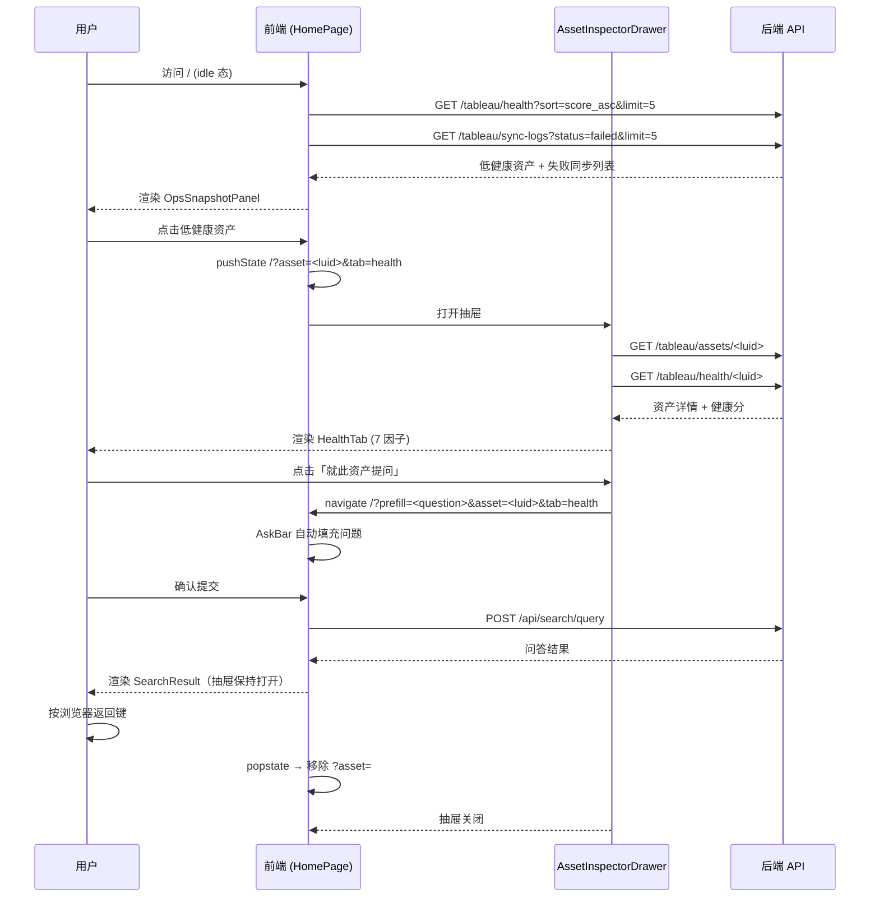

# Spec 20: 运维工作台（Ops Workbench，Split-Pane）

> 版本：v0.2 | 状态：草稿 | 日期：2026-04-27 | 作者：Forrest
> 依赖：Spec 07（Tableau MCP V1）、Spec 10（Tableau 健康评分）、Spec 14（NL-to-Query）、Spec 18（菜单重构）、Spec 21（首页重构）、Spec 22（首页问数架构）

---

## 1. 概述

### 1.1 目的

把原本分散在 **首页（`/`）问答**、**Tableau 资产浏览（`/tableau/assets`）**、**Tableau 健康检查（`/tableau/health`）** 三处的运维动线，合并为单一 Split-Pane 工作台，落在根路由 `/`。BI 运维人员在一屏内即可完成：问数 → 看资产 → 看健康 → 处置。

### 1.2 范围

- **包含**：
  - 根路由 `/` 改造为 Split-Pane 工作台
  - URL 驱动的资产抽屉 `AssetInspectorDrawer`
  - `OpsSnapshotPanel`（idle 态运维快照）
  - `ScopePicker` 顶栏筛选（连接 / 项目）
  - `AssetInspector` 6 Tab 统一抽取为 `features/tableau-inspector/`
  - 权限/降级/窄屏策略
- **不包含**：
  - 不改动任何后端 API（复用现有 search / tableau / health 端点）
  - 不改动 `/chat/:id` 对话流与消息存储
  - 不做资产图谱识别（lineage 推断）
  - 不合并 `/tableau/connections` 连接管理页
  - 不做移动端适配

### 1.4 现有原型代码（需替换）

> ⚠️ **决议：代码适配 Spec**（2026-04-27）。以下文件为早期原型，架构与本 Spec 不一致（原型使用 `/ops/workbench` 三面板模式，Spec 要求根路由 `/` Split-Pane 模式）。实施时须按 Spec 重写，不可在原型基础上迭代。

| 文件 | 说明 | 处置 |
|------|------|------|
| `frontend/src/pages/ops/workbench/page.tsx` | 原型主页 | Phase 2 完成后删除 |
| `frontend/src/pages/ops/workbench/QueryPanel.tsx` | 原型查询面板 | 功能迁入 `features/ops-workbench/` |
| `frontend/src/pages/ops/workbench/AssetPanel.tsx` | 原型资产面板 | 功能迁入 `features/tableau-inspector/` |
| `frontend/src/pages/ops/workbench/HealthPanel.tsx` | 原型健康面板 | 功能迁入 OpsSnapshotPanel |
| `frontend/src/router/config.tsx` | `/ops/workbench` 路由注册 | Phase 2 删除该路由 |
| `frontend/src/config/menu.ts` | 工作台菜单项 (`/ops/workbench`) | Phase 2 改为指向 `/` |

### 1.3 关联文档

| 文档 | 路径 | 关系 |
|------|------|------|
| Spec 21 | `docs/specs/21-home-redesign-spec.md` | 首页对话式布局的上一代设计，被本 Spec 合并/扩展 |
| Spec 22 | `docs/specs/22-ask-data-architecture.md` | 问数端到端链路（search API）不变 |
| Spec 18 | `docs/specs/18-menu-restructure-spec.md` | 菜单顶栏继续沿用；本 Spec 只改 `/` 的主内容区 |
| Spec 10 | `docs/specs/10-tableau-health-scoring-spec.md` | 健康评分 API 作为 HealthTab 数据源 |
| Spec 07 | `docs/specs/07-tableau-mcp-v1-spec.md` | 资产/字段读取 API |

---

## 2. 目标与非目标

### 2.1 目标

- BI 运维人员在 `/` 一屏完成：问数、资产浏览、健康检查、问题定位
- URL 可分享：复制 `/?asset=xxx&tab=health&connection=1` 即可还原上下文
- 权限降级安全：无 `tableau` 权限用户看不到资产抽屉入口
- 前端代码复用：`AssetInspector` 抽成独立 feature 模块，供首页抽屉与 `/tableau/assets/:id` 详情页共用

### 2.2 非目标

- 不改后端 API
- 不改 `/chat/:id` 对话流
- 不做资产血缘图谱识别
- 不合并 `/tableau/connections`
- 不做移动端适配（< 768px 不保证体验）

---

## 3. 架构方案

### 3.1 组件树

```
HomePage /                         (pages/home/page.tsx)
├── ScopeContext.Provider          (features/ops-workbench/scope/)
│   └─ { connectionId, projectId, setScope }
├── ScopePicker                    顶栏筛选（连接 / 项目）
├── 主体 Split-Pane
│   ├── ConversationBar            左侧 260px，保留不变
│   └── 主区域 flex-1
│       ├── [idle 态]
│       │   ├── WelcomeHero
│       │   ├── SuggestionGrid
│       │   └── OpsSnapshotPanel   新增（低健康资产 / 最近同步失败 / 待处置）
│       └── [result 态]
│           ├── AskBar             保留
│           ├── SearchResult       保留（不动消息结构）
│           └── DataUsedFooter     保留
└── AssetInspectorDrawer           右侧抽屉，?asset= 触发
    └── AssetInspector             (features/tableau-inspector/)
        ├── InfoTab
        ├── DatasourcesTab
        ├── ChildrenTab
        ├── FieldsTab
        ├── HealthTab
        └── AiExplainTab
```

### 3.2 状态驱动方式

- **URL 是单一事实来源**（Single Source of Truth）：抽屉开合、Tab 选择、Scope 筛选全部编码到 query string
- **ScopeContext** 只做派生与广播，不直接存源（避免双向同步）
- **React Query** 管接口缓存，按 `[connectionId, projectId, assetId, tab]` 组 key

### 3.3 Split-Pane 宽度策略

| 视口 | ConversationBar | 主区域 | AssetInspectorDrawer |
|------|----------------|--------|----------------------|
| ≥ 1536px (2xl) | 260px 固定 | flex-1 | 520px 固定右推 |
| 1280–1535px (xl) | 260px 固定 | flex-1 | 520px 覆盖式（非推开） |
| < 1280px | 260px 固定 | flex-1 | **全屏 Sheet**（顶层覆盖） |
| < 768px | 不保证 | — | — |

---

## 4. URL 契约

### 4.1 Query 参数

| 参数 | 取值 | 说明 | 默认 |
|------|------|------|------|
| `asset` | `<string>` Tableau LUID | 打开资产抽屉 | 无（抽屉关闭） |
| `tab` | `info \| datasources \| children \| fields \| health \| ai` | 抽屉内 Tab | `info` |
| `connection` | `<number>` TableauConnection.id | ScopePicker 选中连接 | 用户最近一次选择（localStorage） |
| `scope_project` | `<string>` project LUID | 项目级过滤 | 无 |

### 4.2 历史栈策略（pushState vs replaceState）

| 动作 | 方式 | 原因 |
|------|------|------|
| 首次打开抽屉（`asset=` 从无到有） | `pushState` | 用户按浏览器返回键期望关闭抽屉 |
| 抽屉内切换 Tab | `replaceState` | 不污染历史栈 |
| 关闭抽屉（`asset=` 从有到无） | `pushState` | 可前进回到抽屉 |
| 切换 Scope（`connection` / `scope_project`） | `replaceState` | 筛选是"调参"，不入栈 |
| 提交问答（从 idle 进入 result 态） | 不改 URL | 结果态通过前端 state 切换，复用 `/` |

### 4.3 示例 URL

- `/` — idle 态，显示 WelcomeHero + OpsSnapshotPanel
- `/?connection=3` — idle 态 + Scope 已选连接 3
- `/?asset=abc-123&tab=health` — 抽屉打开在 Health Tab
- `/?connection=3&scope_project=proj-xyz&asset=abc-123&tab=fields` — 完整上下文

---

## 5. 数据与接口

### 5.1 复用后端接口（无新增）

| 用途 | 方法 | 路径 | 来源 Spec |
|------|------|------|----------|
| 问数 | POST | `/api/search/query` | Spec 14/22 |
| 连接列表 | GET | `/api/tableau/connections` | Spec 07 |
| 项目列表 | GET | `/api/tableau/projects?connection_id=` | Spec 07 |
| 资产详情 | GET | `/api/tableau/assets/:luid` | Spec 07 |
| 资产字段 | GET | `/api/tableau/assets/:luid/fields` | Spec 07 |
| 资产健康 | GET | `/api/tableau/health/:luid` | Spec 10 |
| 运维快照（低健康） | GET | `/api/tableau/health/low-score?limit=5` | Spec 10 |
| 同步日志最近失败 | GET | `/api/tableau/sync-logs?status=failed&limit=5` | Spec 07 |

> 若 `/api/tableau/health/low-score` 接口尚不存在，Phase 4 作为「可选后端补丁」提 PR；前端先用现有 `/api/tableau/health?sort=score_asc&limit=5` 代替。

### 5.2 前端 Scope 类型

```ts
// features/ops-workbench/scope/types.ts
export interface OpsScope {
  connectionId: number | null;
  projectId: string | null;
}
```

### 5.3 Feature Flag

```ts
// src/config.ts
export const ENABLE_OPS_WORKBENCH: boolean =
  (import.meta.env.VITE_ENABLE_OPS_WORKBENCH ?? 'true') !== 'false';
```

- Phase 2 抽屉逻辑、Phase 3 OpsSnapshot、Phase 4 HealthTab 联动均以此 flag 守门
- 关闭后 `/` 回退到 Spec 21 对话式首页

---

## 5.4 错误码

本 Spec 不新增后端错误码。前端复用以下现有错误码处理：

| 错误码 | 来源 | 前端处理 |
|--------|------|---------|
| `AUTH_003` | 无 `tableau` 权限访问资产 | 抽屉不打开，Toast "无权限查看该资产" |
| `TAB_006` | `asset` LUID 对应的资产不存在 | 抽屉显示空态 "资产不存在或已删除" |
| `HS_003` | 健康扫描时数据源连接失败 | HealthTab 显示 ErrorBoundary |
| `LLM_001` | AI 解读时无 LLM 配置 | AiExplainTab 显示 "AI 服务未配置" |

前端错误处理统一通过全局拦截器（Spec 01 Section 6），本模块仅需处理上述业务特定场景。

---

## 5.5 安全与权限

### 角色权限矩阵

| 操作 | admin | data_admin | analyst | user |
|------|-------|-----------|---------|------|
| 查看 idle 态首页 | Y | Y | Y | Y |
| 使用问数功能 | Y | Y | Y | Y |
| 打开资产抽屉 | Y | Y | Y（需 `tableau` 权限） | N |
| 查看 OpsSnapshotPanel | Y | Y | N | N |
| 使用 ScopePicker 切换连接 | Y | Y | Y（需 `tableau` 权限） | N |
| AskAboutThis 跳转提问 | Y | Y | Y（需 `tableau` 权限） | N |

### 安全约束

- 前端权限校验通过 `useAuth()` 判断 `tableau` permission，在请求前拦截
- API 层仍有 403 兜底，防止前端旁路
- URL 中 `?asset=` 参数不暴露敏感信息（仅 Tableau LUID，非内部 ID）
- `ENABLE_OPS_WORKBENCH` feature flag 关闭时，所有新功能入口不可访问

---

## 5.6 时序图



---

## 6. 文件级改动计划

> 约定：路径均以 `frontend/` 为根。

### Phase 1 — `AssetInspector` 抽取到 feature 模块

**新增**
- `frontend/src/features/tableau-inspector/index.ts`（公开导出）
- `frontend/src/features/tableau-inspector/AssetInspector.tsx`（壳组件，含 Tab 路由）
- `frontend/src/features/tableau-inspector/tabs/InfoTab.tsx`
- `frontend/src/features/tableau-inspector/tabs/DatasourcesTab.tsx`
- `frontend/src/features/tableau-inspector/tabs/ChildrenTab.tsx`
- `frontend/src/features/tableau-inspector/tabs/FieldsTab.tsx`
- `frontend/src/features/tableau-inspector/tabs/HealthTab.tsx`
- `frontend/src/features/tableau-inspector/tabs/AiExplainTab.tsx`
- `frontend/src/features/tableau-inspector/hooks/useAssetDetail.ts`
- `frontend/src/features/tableau-inspector/hooks/useAssetFields.ts`
- `frontend/src/features/tableau-inspector/hooks/useAssetHealth.ts`
- `frontend/src/features/tableau-inspector/types.ts`

**修改**
- `frontend/src/pages/tableau/asset-detail/page.tsx` — 改为 thin wrapper，内部直接渲染 `<AssetInspector mode="page" />`
- `frontend/src/pages/tableau/assets/page.tsx` — 列表点击行为改为：若 `ENABLE_OPS_WORKBENCH=true` 跳 `/?asset=<luid>`，否则保持 `/tableau/assets/:luid`

**删除**
- 原 `asset-detail/page.tsx` 内联实现（迁移到 feature）

### Phase 2 — 根路由 Split-Pane 壳 + 抽屉

**新增**
- `frontend/src/features/ops-workbench/index.ts`
- `frontend/src/features/ops-workbench/OpsWorkbench.tsx`（壳，负责 idle/result 切换）
- `frontend/src/features/ops-workbench/drawer/AssetInspectorDrawer.tsx`
- `frontend/src/features/ops-workbench/drawer/useDrawerUrlState.ts`（?asset= / ?tab= 读写）
- `frontend/src/features/ops-workbench/scope/ScopeContext.tsx`
- `frontend/src/features/ops-workbench/scope/ScopePicker.tsx`
- `frontend/src/features/ops-workbench/scope/useScopeUrlState.ts`

**修改**
- `frontend/src/pages/home/page.tsx` — 用 `<OpsWorkbench />` 包裹原 idle/result 结构；`ENABLE_OPS_WORKBENCH=false` 时走旧逻辑
- `frontend/src/config.ts` — 新增 `ENABLE_OPS_WORKBENCH` flag
- `frontend/src/router/config.tsx` — `/` 路由不变，但确认 `<HomePage />` 内部 Suspense 边界兼容抽屉懒加载

### Phase 3 — `OpsSnapshotPanel`（idle 态）

**新增**
- `frontend/src/features/ops-workbench/snapshot/OpsSnapshotPanel.tsx`
- `frontend/src/features/ops-workbench/snapshot/LowHealthList.tsx`
- `frontend/src/features/ops-workbench/snapshot/RecentSyncFailures.tsx`
- `frontend/src/features/ops-workbench/snapshot/PendingActionsList.tsx`
- `frontend/src/features/ops-workbench/snapshot/hooks/useOpsSnapshot.ts`

**修改**
- `frontend/src/pages/home/page.tsx` — idle 态加入 `<OpsSnapshotPanel />`，位置在 `SuggestionGrid` 下方
- `frontend/src/pages/home/components/WelcomeHero.tsx` — 仅调整 margin 让位给 OpsSnapshotPanel，不改结构

### Phase 4 — HealthTab 与问答联动

**新增**
- `frontend/src/features/tableau-inspector/tabs/HealthTab/FactorBreakdown.tsx`
- `frontend/src/features/tableau-inspector/tabs/HealthTab/AskAboutThis.tsx`（点击跳 `/` 并自动填充问题）

**修改**
- `frontend/src/features/tableau-inspector/tabs/HealthTab.tsx` — 完整实现 7 因子面板
- `frontend/src/pages/home/components/AskBar.tsx` — 支持 URL `?prefill=<question>` 预填

### Phase 5 — 权限 / 降级 / 窄屏

**修改**
- `frontend/src/features/ops-workbench/OpsWorkbench.tsx` — 根据 `useAuth()` 判断 `tableau` 权限，决定是否渲染抽屉入口
- `frontend/src/features/ops-workbench/snapshot/OpsSnapshotPanel.tsx` — 无权限时显示空态卡片
- `frontend/src/features/ops-workbench/drawer/AssetInspectorDrawer.tsx` — 窄屏（< 1280px）切换 Sheet 模式
- `frontend/src/config/menu.ts` — 若 `ENABLE_OPS_WORKBENCH=true`，`/tableau/assets` 菜单项仍保留，但标注 `ops-workbench` 同入口

### 热点文件（任一时刻仅一个 coder 写）

- `frontend/src/pages/home/page.tsx`
- `frontend/src/router/config.tsx`
- `frontend/src/config/menu.ts`
- `frontend/src/config.ts`

其余 `features/**` 下新文件可多 coder 并行。

---

## 7. 任务拆分

| # | Phase | 任务 | 主要文件 | Coder 角色 | 预估 |
|---|-------|------|---------|-----------|------|
| T1 | 1 | 建立 `features/tableau-inspector/` 骨架 + types + hooks | inspector/* | coder-fe | M |
| T2 | 1 | 迁移 InfoTab / DatasourcesTab / ChildrenTab / FieldsTab | inspector/tabs/* | coder-fe | M |
| T3 | 1 | 迁移 HealthTab / AiExplainTab（占位可先） | inspector/tabs/* | coder-fe | S |
| T4 | 1 | 改造 `asset-detail/page.tsx` 为 wrapper | pages/tableau/asset-detail/* | coder-fe | S |
| T5 | 2 | `ScopeContext` + `ScopePicker` + URL hook | ops-workbench/scope/* | coder-fe | M |
| T6 | 2 | `AssetInspectorDrawer` + URL 状态机 | ops-workbench/drawer/* | coder-fe | M |
| T7 | 2 | `OpsWorkbench` 壳 + `home/page.tsx` 接入 | ops-workbench/*, pages/home/page.tsx | coder-fe-senior | M |
| T8 | 2 | `ENABLE_OPS_WORKBENCH` flag 落位 | config.ts | coder-fe | XS |
| T9 | 3 | `OpsSnapshotPanel` + 3 个子列表 | ops-workbench/snapshot/* | coder-fe | M |
| T10 | 3 | `useOpsSnapshot` 聚合 hook | ops-workbench/snapshot/hooks/* | coder-fe | S |
| T11 | 4 | HealthTab 完整实现 + FactorBreakdown | inspector/tabs/HealthTab/* | coder-fe | M |
| T12 | 4 | `AskAboutThis` 跳转 + AskBar prefill | inspector/tabs/HealthTab/*, home/components/AskBar.tsx | coder-fe | S |
| T13 | 5 | 权限判断 + 无权限降级空态 | ops-workbench/* | coder-fe | S |
| T14 | 5 | 窄屏 Sheet 模式 | drawer/* | coder-fe | S |
| T15 | 5 | E2E 回归（Playwright / RTL） | tests/e2e/* | coder-qa | M |

---

## 8. 验收标准

### Phase 1 验收（Inspector 抽取）

- [ ] `features/tableau-inspector/` 目录创建完整，对外仅通过 `index.ts` 导出
- [ ] `/tableau/assets/:luid` 页面访问正常，6 个 Tab 渲染与迁移前一致（像素级）
- [ ] `AssetInspector` 支持 `mode="page" | "drawer"` prop，切换内边距与滚动容器
- [ ] 无任何 `pages/tableau/asset-detail/` 下的业务逻辑残留（仅剩 wrapper）
- [ ] `npm run typecheck` 通过
- [ ] `npm run lint` 通过

### Phase 2 验收（Split-Pane 壳 + 抽屉）

- [ ] 访问 `/?asset=<真实 luid>` 抽屉打开，Tab 默认 info
- [ ] 访问 `/?asset=<luid>&tab=fields` 直接跳到 FieldsTab
- [ ] 抽屉内切 Tab，URL 同步更新（`replaceState`），浏览器返回键**不回到上一个 Tab**而是关闭抽屉
- [ ] 浏览器返回键能关闭抽屉回到纯 `/`
- [ ] 浏览器前进键能重新打开抽屉
- [ ] `ScopePicker` 切换连接，URL 更新 `?connection=`，localStorage 写入最近选择
- [ ] 刷新页面，Scope 状态从 URL 恢复，URL 无 `connection=` 时从 localStorage 恢复
- [ ] `ENABLE_OPS_WORKBENCH=false` 时 `/` 完全回退到旧版首页

### Phase 3 验收（OpsSnapshot）

- [ ] idle 态 `/` 显示 `OpsSnapshotPanel`，3 个列表均能加载
- [ ] 列表项点击跳 `/?asset=<luid>&tab=health`，抽屉直接打开在 Health
- [ ] Scope 改变时，Panel 三个列表同步刷新（React Query key 包含 scope）
- [ ] 无 `tableau` 权限时，Panel 显示空态卡片，不请求 API
- [ ] 加载失败时显示 ErrorBoundary 兜底，不影响问答区

### Phase 4 验收（HealthTab 联动）

- [ ] HealthTab 显示 7 因子分数与权重（对齐 Spec 10）
- [ ] 点击「就此资产提问」跳 `/?prefill=<预生成问题>&asset=<luid>&tab=health`
- [ ] AskBar 读取 `?prefill=` 自动填充但不自动提交（等用户确认）
- [ ] 问答提交后抽屉保持打开（不因结果态而关闭）

### Phase 5 验收（权限/降级/窄屏）

- [ ] 无 `tableau` 权限用户访问 `/?asset=xxx`，抽屉不打开（URL 保留，显示 toast "无权限"）
- [ ] 视口 < 1280px 时抽屉切换为全屏 Sheet，顶部有关闭按钮
- [ ] 视口 < 768px 给出「请使用桌面端」降级提示
- [ ] 分享链接 `/?connection=3&asset=xxx&tab=health` 被无权限用户打开时，Scope 保留但抽屉不开
- [ ] Lighthouse 性能评分 ≥ 旧首页 -5% 以内

---

## 9. 测试计划

### 9.1 单元测试（RTL + Vitest）

| 目标 | 文件 |
|------|------|
| `useDrawerUrlState` pushState/replaceState 分支 | `features/ops-workbench/drawer/__tests__/useDrawerUrlState.test.ts` |
| `useScopeUrlState` URL ↔ Context 双向同步 | `features/ops-workbench/scope/__tests__/useScopeUrlState.test.ts` |
| `AssetInspector` Tab 切换不触发父级重渲染 | `features/tableau-inspector/__tests__/AssetInspector.test.tsx` |
| `OpsSnapshotPanel` 权限降级 | `features/ops-workbench/snapshot/__tests__/OpsSnapshotPanel.test.tsx` |

### 9.2 集成测试（Playwright）

| 场景 | 文件 |
|------|------|
| 从 idle 态点击快照跳到 HealthTab | `tests/e2e/ops-workbench/snapshot-to-health.spec.ts` |
| 分享 URL 恢复完整上下文 | `tests/e2e/ops-workbench/share-url.spec.ts` |
| 浏览器前进后退历史栈 | `tests/e2e/ops-workbench/history-stack.spec.ts` |
| 无权限用户的降级 | `tests/e2e/ops-workbench/no-permission.spec.ts` |
| 窄屏 Sheet 模式 | `tests/e2e/ops-workbench/narrow-viewport.spec.ts` |

### 9.3 回归测试

- `/tableau/assets` 列表页所有行为不变
- `/tableau/assets/:luid` 详情页视觉无差异
- `/chat/:id` 对话流不受影响（Spec 21/22 无回归）
- `/tableau/health` 独立页面仍可访问（作为冗余入口）

### 9.4 Mock 与测试约束

- **URL 状态**：`useDrawerUrlState` / `useScopeUrlState` 测试需 mock `window.history.pushState` / `replaceState`，断言调用参数而非真实导航。RTL 中使用 `MemoryRouter` 并传入初始 URL 参数
- **ScopeContext**：测试组件需用 `<ScopeContext.Provider value={mockScope}>` 包裹，不可依赖真实 URL 解析
- **Tableau API Mock**：Playwright 集成测试中 `page.route('**/api/tableau/**', ...)` 必须返回完整响应体（含 `fields`、`health_score` 等），mock 数据中的唯一值须出现在 DOM 断言中（遵守 `docs/TESTING.md` 闭环要求）
- **Feature Flag**：测试 `ENABLE_OPS_WORKBENCH=false` 降级路径时，mock `import.meta.env.VITE_ENABLE_OPS_WORKBENCH` 为 `'false'`
- **权限 Mock**：`useAuth()` 返回 `{ permissions: [] }`（无 `tableau`）时，断言抽屉不渲染且无 API 请求发出

---

## 10. 风险与回滚

### 10.1 风险清单

| # | 风险 | 影响 | 缓解 |
|---|------|------|------|
| R1 | URL 状态机与 React Router 前进后退冲突 | 用户操作与历史栈不一致，迷惑 | 按第 4.2 节 pushState/replaceState 策略严格执行，E2E 覆盖 |
| R2 | 抽屉在窄屏挤压问答区不可用 | < 1280px 用户无法正常工作 | Phase 5 切 Sheet 模式；< 768px 降级提示 |
| R3 | 多 coder 并发改热点文件冲突 | `home/page.tsx` / `router/config.tsx` / `config/menu.ts` / `config.ts` 冲突 | 任务分派时上述 4 文件任一时刻仅一人写；Phase 串行交接 |
| R4 | `AssetInspector` 抽取引入视觉漂移 | 详情页被用户感知到样式变化 | Phase 1 结束必须视觉回归（截屏对比） |
| R5 | OpsSnapshot 接口压力 | idle 态并发三接口，首屏变慢 | React Query staleTime 60s；首屏只请求当前 scope；失败不阻塞 |
| R6 | `ENABLE_OPS_WORKBENCH` flag 遗漏 | 功能半开半闭 | flag 守门必须覆盖 Phase 2/3/4 所有新入口 |
| R7 | 权限校验前端旁路 | 无 `tableau` 权限用户仍触发资产请求 | `useAuth()` 判断在请求前，API 层仍兜底 403 |

### 10.2 回滚方案

- **Phase 级独立 PR**：每 Phase 一个 PR，一个 PR 可独立 revert
- **Feature Flag 一键关闭**：`ENABLE_OPS_WORKBENCH=false` 立即回退到旧版首页，无需 revert
- **路由兜底**：`/tableau/assets/:luid` 详情页保持可访问，即使 `/` 下抽屉故障，用户仍有独立入口
- **数据无迁移**：纯前端改造，无 DB schema 变更，无数据回滚需求

---

## 11. 开放问题

| # | 问题 | 负责人 | 状态 |
|---|------|--------|------|
| 1 | `/api/tableau/health/low-score` 是否需要新增专用接口？还是复用 `?sort=score_asc` | backend-owner | 待定 |
| 2 | `AskAboutThis` 预生成问题模板由前端硬编码还是 LLM 生成 | llm-owner | 待定 |
| 3 | 窄屏 Sheet 是否保留 ConversationBar | ux-owner | 待定 |
| 4 | `OpsSnapshotPanel` 是否允许用户自定义展示卡片 | pm | 暂不做（v0.2 考虑） |

---

## 12. 开发交付约束

### 架构红线（违反 = PR 拒绝）

1. **`features/` 模块封装** — `features/ops-workbench/` 和 `features/tableau-inspector/` 不得 import `pages/` 下的任何组件（单向依赖：pages → features → components）
2. **URL 是唯一事实来源** — 抽屉开合、Tab 选择、Scope 筛选状态只存 URL query string，`ScopeContext` 只做派生广播
3. **Feature Flag 守门** — Phase 2/3/4 所有新入口必须检查 `ENABLE_OPS_WORKBENCH`；遗漏即拒绝
4. **lazy 加载** — `AssetInspectorDrawer`、各 Tab 组件必须 `React.lazy` 加载
5. **无后端改动** — 本 Spec 不改任何后端文件。若需新增 API（如 `low-score`），须开独立 PR
6. **原型代码清理** — Phase 2 完成后，`pages/ops/workbench/` 目录须整体删除，不得保留

### SPEC 20 强制检查清单

- [ ] `features/tableau-inspector/` 只通过 `index.ts` 导出，无内部模块直接 import
- [ ] `features/ops-workbench/` 不 import `pages/` 或 `features/tableau-inspector/` 内部模块
- [ ] `useDrawerUrlState` 使用 `pushState`（开/关抽屉）和 `replaceState`（切 Tab）
- [ ] `ENABLE_OPS_WORKBENCH=false` 时 `/` 完全回退到旧版首页
- [ ] `pages/ops/workbench/` 原型代码在 Phase 2 PR 中删除
- [ ] `/ops/workbench` 路由在 `router/config.tsx` 中移除
- [ ] 无 `tableau` 权限用户访问 `/?asset=xxx` 不触发 Tableau API 请求
- [ ] 所有用户可见文案为中文

### 验证命令

```bash
# 前端编译
cd frontend && npm run type-check
cd frontend && npm run lint
cd frontend && npm test -- --run
cd frontend && npm run build

# 检查 features/ 不 import pages/
grep -r "from.*pages/" frontend/src/features/ && echo "FAIL: features imports pages" || echo "PASS"

# 检查原型代码清理（Phase 2+ 后执行）
test -d frontend/src/pages/ops/workbench && echo "FAIL: prototype dir still exists" || echo "PASS"

# 检查 feature flag 覆盖
grep -r "ENABLE_OPS_WORKBENCH" frontend/src/features/ops-workbench/ | wc -l
```

### 正确 / 错误示范

```tsx
// ❌ 错误：features/ 直接 import pages/
import { SomeComponent } from '../../../pages/home/components/WelcomeHero';

// ✅ 正确：features/ 只 import components/ 或自身模块
import { Card } from '../../../components/ui/Card';

// ❌ 错误：抽屉状态存 React state
const [isDrawerOpen, setIsDrawerOpen] = useState(false);

// ✅ 正确：URL 是唯一事实来源
const { assetLuid } = useDrawerUrlState();
const isDrawerOpen = !!assetLuid;

// ❌ 错误：Phase 3 新入口未检查 feature flag
<OpsSnapshotPanel />

// ✅ 正确：feature flag 守门
{ENABLE_OPS_WORKBENCH && <OpsSnapshotPanel />}

// ❌ 错误：在原型上迭代
// pages/ops/workbench/page.tsx — 添加新功能...

// ✅ 正确：按 Spec 在 features/ 下重写
// features/ops-workbench/OpsWorkbench.tsx — 新实现
```
