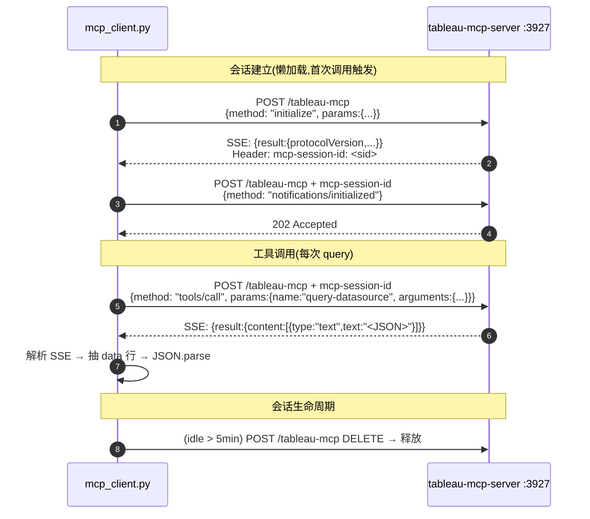

# T-R1 · Tableau MCP Client 重写设计

> [!abstract] 一句话目标
> 把 `backend/services/tableau/mcp_client.py` 从**自定义 REST 协议**改造为**标准 MCP streamable-http 协议**,对接官方 `@tableau/mcp-server@latest`。保持对外 API(`query_datasource(...)` 等)签名不变,确保上游 `nlq_service.py` 零改动。

---

## 1. 动机

### 1.1 协议不匹配现状
现有代码(`mcp_client.py:427`)假设 MCP Server 暴露 `POST {URL}/query-datasource`,请求体是自定义 JSON-RPC:

```json
{ "jsonrpc":"2.0", "id":1, "method":"query-datasource",
  "params": {"datasourceLuid":"...", "query":{...}, "env":{...}} }
```

官方 `@tableau/mcp-server@1.18.1` 的实际协议:
- **单端点** `POST /tableau-mcp`(路径固定)
- **Streamable-http 传输**(响应是 SSE `event: message\ndata: {...}`)
- **MCP 标准握手三步**:`initialize` → `notifications/initialized` → `tools/call`
- **会话状态**通过 HTTP header `mcp-session-id` 维护
- **凭据**(PAT/Site)在 server 进程启动 env 里,**不**在每次请求里

现有代码直接 POST 打不通,`_build_jsonrpc_request` 里那段 `env` 注入需要彻底删除。

### 1.2 单租户约束(新发现)
官方 server **每进程只绑一个 Tableau Site**。本次 MVP 只有 `zy_bi` 一个连接,跑单进程即可。多连接支持作为 P2 技术债,本 spec 不覆盖。

---

## 2. 目标与非目标

### 2.1 目标
- ✅ `mcp_client.py` 能连通 `http://localhost:3927/tableau-mcp`
- ✅ `TableauMCPClient.query_datasource(...)` 签名不变,行为等价
- ✅ 保留 `_connection_id_var` contextvars、`TableauMCPError` 错误分类、per-connection 实例缓存、FIFO OOM 防护、idle 超时清理
- ✅ 新增 session-id 生命周期管理(初始化、过期重建、`DELETE` 会话)
- ✅ 新增 SSE 响应解析
- ✅ 单元测试 mock MCP server,覆盖 happy/timeout/5xx/4xx/session-expired 五条路径

### 2.2 非目标(明确不做)
- ❌ 多租户 MCP(一个 client 对应多个 Tableau Site)
- ❌ 真连 Tableau Online 的集成测试(Q 阶段做)
- ❌ 重构 `nlq_service.py`(上游零改动)
- ❌ 重写 `get-datasource-metadata` / `list-datasources` 等其他工具(本次只改 `query-datasource`;后续再加)
- ❌ OAuth 认证(本地 dev 用 `DANGEROUSLY_DISABLE_OAUTH=true`)

---

## 3. 架构设计

### 3.1 新的 HTTP 流程



### 3.2 Session 管理策略

| 状态 | 判定 | 动作 |
|---|---|---|
| 未初始化 | `_session_id is None` | 发起 initialize + initialized |
| 活跃 | 最近一次成功调用 < 5 min | 直接复用 |
| 过期(被 server 清理) | 收到 HTTP 400 `No valid session ID provided` | 清空 session_id,重新 initialize 重试一次 |
| 主动释放 | 进程退出 / `invalidate()` | 发 `DELETE /tableau-mcp` |

### 3.3 类结构(保留 per-connection 实例,但 session 是进程级共享)

```
┌─ Module-level ────────────────────────────────────────────┐
│  _mcp_session_state: {                                     │
│      session_id: Optional[str],                            │
│      last_activity: float,                                 │
│      lock: threading.Lock,                                 │
│      protocol_version: str,                                │
│  }                                                         │
│  _http_session: requests.Session (连接池复用)               │
│                                                            │
│  def _ensure_session() -> str                              │
│  def _reset_session() -> None                              │
│  def _post_mcp(payload, expect_sse=True) -> dict           │
│  def _parse_sse(response) -> dict                          │
└────────────────────────────────────────────────────────────┘

┌─ class TableauMCPClient (保留) ────────────────────────────┐
│  保留:                                                       │
│    - per-connection_id 单例缓存                             │
│    - _MAX_INSTANCES, _IDLE_TIMEOUT                          │
│    - _ds_connection_cache (DB 连接信息缓存)                 │
│    - _get_connection_by_luid(...)                           │
│    - _decrypt_pat(...) — 仍保留用于将来 multi-tenant       │
│                          但本次 MVP **不调用**             │
│    - query_datasource(...) — 签名不变                      │
│                                                             │
│  修改:                                                       │
│    - _build_jsonrpc_request → 生成 tools/call payload       │
│    - _send_jsonrpc → 调 _post_mcp 并处理 session 生命周期  │
│    - _parse_jsonrpc_response → 从 SSE content[] 解析         │
│                                                             │
│  删除:                                                       │
│    - env_vars 注入逻辑(PAT 已由 server 进程持有)          │
└─────────────────────────────────────────────────────────────┘
```

### 3.4 为何 session 是进程级不是 per-connection

- MVP 只有 1 个 Tableau Site,所有 `connection_id` 共享同一个 MCP server 进程
- MCP session 与 HTTP keep-alive 类似,是**传输层概念**,和租户无关
- 多 server 进程场景(P2+)再改造成 `{site → session_id}` 映射

---

## 4. 对外契约(零变化)

保持 `nlq_service.py` 调用方视角不变:

```python
from services.tableau.mcp_client import get_tableau_mcp_client, TableauMCPError

client = get_tableau_mcp_client(connection_id=42)
result = client.query_datasource(
    datasource_luid="abc-123",
    query={"fields":[...], "filters":[...]},
    limit=1000,
    timeout=30,
    connection_id=42,
)
# result == {"fields": [...], "rows": [[...], ...]}
```

**关键**:`result` 的 schema 必须与老代码返回值一致(PRD §5.5.3)。下面 §6 说明怎么从 MCP 响应抽出。

---

## 5. 关键契约

### 5.1 `_build_jsonrpc_request` 新版

```python
def _build_jsonrpc_request(
    self, datasource_luid: str, query: Dict[str, Any], limit: int,
) -> dict:
    return {
        "jsonrpc": "2.0",
        "id": next_id(),                         # 自增
        "method": "tools/call",
        "params": {
            "name": "query-datasource",
            "arguments": {
                "datasourceLuid": datasource_luid,
                "query": query,
                # limit 在 MCP 工具的 query schema 里,放到 query 里还是 arguments 顶层?
                # ⚠️ 需落地时用 get-datasource-metadata 的 input schema 核对
                # 暂放 query 内;若官方 schema 有顶层 limit,调整到 arguments.limit
            },
        },
    }
```

> [!todo] 执行者落地前必须做
> 用下面命令抓取 `query-datasource` 的真实 input schema,据此定 `limit` 位置:
> ```bash
> curl -sS -X POST http://localhost:3927/tableau-mcp \
>   -H "Content-Type: application/json" \
>   -H "Accept: application/json, text/event-stream" \
>   -H "mcp-session-id: $SID" \
>   -d '{"jsonrpc":"2.0","id":99,"method":"tools/list"}' | \
>   grep -o '"name":"query-datasource".*' | head -c 2000
> ```

### 5.2 HTTP Headers(所有请求)

| Header | 值 | 时机 |
|---|---|---|
| `Content-Type` | `application/json` | 总是 |
| `Accept` | `application/json, text/event-stream` | 总是 |
| `MCP-Protocol-Version` | `2025-06-18` | 总是 |
| `mcp-session-id` | `<sid>` | initialize 之后所有请求 |

### 5.3 SSE 解析

响应 `Content-Type: text/event-stream`,单次响应一条事件,形如:
```
event: message
data: {"jsonrpc":"2.0","id":1,"result":{...}}

```

解析规则:
1. 按行分割
2. 找 `data: ` 开头的行
3. 剥前缀,`json.loads`
4. 多 `data:` 行时用 `\n` 连接(MCP 允许多行;Tableau server 目前单行)

参考实现:
```python
def _parse_sse(response_text: str) -> dict:
    lines = response_text.split("\n")
    data_lines = [line[6:] for line in lines if line.startswith("data: ")]
    if not data_lines:
        raise TableauMCPError(code="NLQ_006", message="MCP SSE 响应无 data 字段")
    payload = "\n".join(data_lines)
    return json.loads(payload)
```

### 5.4 `tools/call` 响应结构 → PRD §5.5.3 映射

MCP `tools/call` 对 `query-datasource` 的响应形如:
```json
{"result": {
  "content": [
    {"type":"text", "text":"{\"fields\":[...],\"rows\":[[...]]}"}
  ],
  "isError": false
}}
```

映射逻辑:
```python
def _parse_jsonrpc_response(body: dict) -> dict:
    if "error" in body:
        raise TableauMCPError(
            code=_map_mcp_error(body["error"].get("code")),
            message=body["error"].get("message", "MCP 错误"),
            details=body["error"].get("data", {}),
        )

    result = body.get("result", {})

    # tools/call 的错误可能走 isError + content[text]
    if result.get("isError"):
        error_text = _extract_text(result.get("content", []))
        raise TableauMCPError(
            code="NLQ_006",
            message=f"MCP 工具执行失败: {error_text[:200]}",
            details={"tool": "query-datasource"},
        )

    content = result.get("content", [])
    text_payload = _extract_text(content)
    try:
        data = json.loads(text_payload)
    except json.JSONDecodeError as e:
        raise TableauMCPError(
            code="NLQ_006",
            message="query-datasource 返回非 JSON 文本",
            details={"raw": text_payload[:500]},
        )

    # data 期望结构 {"fields":[...], "rows":[[...]]}
    return data


def _extract_text(content: list) -> str:
    parts = [c.get("text","") for c in content if c.get("type") == "text"]
    return "".join(parts)
```

### 5.5 错误码映射

| 触发条件 | 现有错误码 | 保留 |
|---|---|---|
| HTTP 连接超时 / 不可达 | `NLQ_006` | ✅ |
| HTTP 5xx(含 1 次重试) | `NLQ_006` | ✅ |
| HTTP 4xx (非 session) | `NLQ_006` / `NLQ_009` | ✅ |
| Session 过期(HTTP 400 + "No valid session ID") | 内部自动 1 次重试重建 session,失败后 `NLQ_006` | **新增** |
| 查询超时(timeout 参数) | `NLQ_007` | ✅ |
| tools/call 返回 `isError: true` | `NLQ_006` | ✅ |
| 数据源不存在/无权限 | `NLQ_009` | ✅ |
| 连接未开启直连(`mcp_direct_enabled=false`) | `MCP_010` | ✅ |

### 5.6 重试策略

保持现有(PRD §5.5.5):
- 网络错误 / 5xx:重试 1 次,间隔 1s
- 4xx:不重试
- **新增**:session-id 过期 → 自动清 session + 重建 1 次,不计入外层重试

---

## 6. 移除项清单

| 行号(现文件) | 内容 | 处理 |
|---|---|---|
| `mcp_client.py:350-355` | `env_vars = {...}` 注入 PAT | **删除** |
| `mcp_client.py:395-409` | `_build_jsonrpc_request` 中的 `env` 字段 | **删除** |
| `mcp_client.py:341-346` | `mcp_direct_enabled` 检查 | **保留**但 MVP 前先手动 SQL 开启 |
| `mcp_client.py:327-338` | `is_active` / `last_test_success` 校验 | **保留** |
| `mcp_client.py:377-388` | `_decrypt_pat` | **保留**(为多租户预留) |

---

## 7. 新增环境配置

### 7.1 `backend/.env.local` / `config/dev/.env.dev` 追加

```env
# Tableau MCP Server(本地,单租户 MVP)
TABLEAU_MCP_SERVER_URL=http://localhost:3927/tableau-mcp
TABLEAU_MCP_PROTOCOL_VERSION=2025-06-18
TABLEAU_MCP_SESSION_IDLE_SECONDS=300
```

### 7.2 `services/common/settings.py` 调整

- `get_tableau_mcp_server_url()` 默认值改为 `http://localhost:3927/tableau-mcp`(去掉旧的 `localhost:8080/mcp`)
- 新增 `get_tableau_mcp_protocol_version() -> str`(默认 `"2025-06-18"`)

### 7.3 MCP Server 启动脚本(配套交付)

新建 `scripts/dev/start-tableau-mcp.sh`:
```bash
#!/usr/bin/env bash
set -euo pipefail
ENV_FILE="${TABLEAU_MCP_ENV_FILE:-$HOME/.cache/mulan-dev/tableau-mcp.env}"
[ -f "$ENV_FILE" ] || { echo "env 文件缺失: $ENV_FILE"; exit 1; }
set -a; source "$ENV_FILE"; set +a
exec npx -y @tableau/mcp-server@latest
```

env 文件模板(放 `~/.cache/mulan-dev/tableau-mcp.env`,chmod 600):
```env
TRANSPORT=http
HTTP_PORT=3927
DANGEROUSLY_DISABLE_OAUTH=true
SERVER=https://online.tableau.com
SITE_NAME=zy_bi
PAT_NAME=claw_only
PAT_VALUE=<填入,不入 git>
```

---

## 8. 测试计划

### 8.1 单元测试(`tests/services/tableau/test_mcp_client.py`)

用 `responses` 或 `respx` mock HTTP,断言:
- [ ] `test_query_datasource_happy_path` — initialize + tools/call 成功返回
- [ ] `test_session_id_reuse` — 第二次调用不重复 initialize
- [ ] `test_session_expired_auto_recover` — 第一次返回 400 "No valid session ID",自动重建后成功
- [ ] `test_timeout_raises_nlq_007` — server 挂起超过 timeout
- [ ] `test_5xx_retry_once_then_fail` — 两次 5xx 后 raise NLQ_006
- [ ] `test_4xx_no_retry` — 400(非 session 错误)直接 raise
- [ ] `test_tools_call_iserror_true` — `isError: true` 映射到 NLQ_006
- [ ] `test_invalid_json_in_content_text` — content[0].text 不是 JSON 时 raise
- [ ] `test_contextvars_isolation` — 并发两个 connection_id 互不串扰
- [ ] `test_instance_cache_invalidate` — `invalidate(cid)` 后下次调用重建

### 8.2 集成测试(真连 `zy_bi`,Q 阶段再跑)

- [ ] `test_real_list_datasources` — 调 list-datasources 拉到非空列表
- [ ] `test_real_get_datasource_metadata` — 对第一个 datasource 拉 metadata
- [ ] `test_real_query_datasource_simple` — 对简单 VizQL 查一条数

---

## 9. 交付约束(按 `SPEC_DEVELOPER_PROMPT_TEMPLATE.md`)

### 9.1 强制检查清单

- [ ] **禁用 `os.environ`**:除了 `services/common/settings.py` 的 getter,其他地方不得直接读 env
- [ ] **ruff clean**:`ruff check backend/services/tableau/mcp_client.py` 无 F821/F401
- [ ] **mypy(如项目启用)**:无新增 type error
- [ ] **不引入新依赖**:用现有 `requests`,不得引入 `mcp` Python SDK(保持轻量)
  - 理由:只用到 MCP 协议的 3 个 method,自己实现比引入 SDK 依赖更可控
- [ ] **保留所有现有错误码**,新增的 session 过期走内部重试不暴露新码
- [ ] **不修改 `nlq_service.py`**:如发现上游需要配合改动,停下来先上报
- [ ] **SQL 安全**:`_get_connection_by_luid` 继续用 ORM,不得改字符串拼接

### 9.2 Prompt 给执行者的注意事项

> 你将修改 `backend/services/tableau/mcp_client.py`。这是 **Tableau MCP 协议层适配**,不是业务逻辑变更。上游 `services/llm/nlq_service.py` 对你调用 `query_datasource(...)` 的签名和返回值有强假设,**任何对外契约变化必须先报告给 Forrest**。
>
> 第一步:运行下面命令验证 MCP server 是否在跑:
> ```bash
> curl -sS http://localhost:3927/tableau-mcp -X POST \
>   -H 'Content-Type: application/json' \
>   -H 'Accept: application/json, text/event-stream' \
>   -d '{"jsonrpc":"2.0","id":1,"method":"initialize","params":{"protocolVersion":"2025-06-18","capabilities":{},"clientInfo":{"name":"probe","version":"0.1"}}}'
> ```
> 期望看到 `event: message\ndata: {...serverInfo:{name:"tableau-mcp"}}`。没起来就停下来问 Forrest。
>
> 第二步:读现有 `mcp_client.py` 全文,理解 per-connection_id 缓存、contextvars、错误映射。**保留这些**。
>
> 第三步:按本 spec §3.3 结构重写,参照 §5.1~§5.6 的契约。
>
> 第四步:写单测(§8.1),跑通。
>
> 第五步:人工跑一次真实调用(§8.2),报告结果。

---

## 10. 回滚预案

改动集中在 1 个文件(`mcp_client.py`),回滚 = `git revert`。

不影响的模块:
- `nlq_service.py` 上游调用签名不变
- 数据库 schema 不变
- 前端不感知

---

## 11. 已知未解问题(交接时一并带)

| # | 问题 | 建议处置 |
|---|---|---|
| 1 | `query-datasource` 工具的 input schema 里 `limit` 字段位置 | 落地前用 `tools/list` 拉 schema 现验证 |
| 2 | 若 Tableau Online SSE 有多 `data:` 行(流式)怎么办 | 当前 MVP 单条响应足够;流式放 P2 |
| 3 | 多 Tableau 连接(P2)如何动态起 MCP server 进程 | 新 spec,本次不覆盖 |
| 4 | session 过期的精确错误文案 | 落地时收集实际 error body 再细化判断逻辑 |
| 5 | MCP server 挂掉时前端应如何降级提示 | F 轨 `ErrorCard` 设计时对齐 |

---

## 12. 后续延伸(不在本 spec 范围)

- **T-R5 · Metadata 工具接入**:`get-datasource-metadata` 用于字段缓存(替代现有 PG 查询)
- **T-R6 · 多租户 MCP 管理**:设计 `{connection_id → mcp_server_process}` 映射与生命周期
- **T-R7 · OAuth 启用**:生产环境禁用 `DANGEROUSLY_DISABLE_OAUTH`
- **T-R8 · 监控**:MCP 调用延迟/错误率接入 `bi_capability_invocations` 审计

---

> [!success] DoD
> - [ ] 重写后 `mcp_client.py` 单元测试 10 条全绿
> - [ ] 对真实 `zy_bi` 能成功跑 `list-datasources`/`get-datasource-metadata`/`query-datasource` 三项
> - [ ] `nlq_service.py` 零改动,原有测试继续绿
> - [ ] ruff 无告警
> - [ ] `.env.dev` + `start-tableau-mcp.sh` 提交,PAT 不落 git
