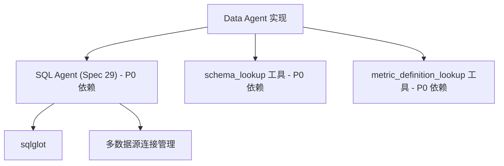

# Data Agent 实现路线图

> 状态：待启动 | 日期：2026-04-20 | 依赖：Spec 28 (Data Agent), Spec 29 (SQL Agent)

---

## 1. 依赖分析



### 阻塞依赖

| 依赖 | 来源 | 状态 | 备注 |
|------|------|------|------|
| SQL Agent HTTP API | Spec 29 | ❌ 未实现 | Data Agent 通过 HTTP 调用 |
| `schema_lookup` | 语义层元数据 | ❌ 未实现 | P0 工具，归因分析前必须 |
| `metric_definition_lookup` | 语义层元数据 | ❌ 未实现 | P0 工具，指标口径统一 |

---

## 2. 实施批次

### P0（核心链路，必须先完成）

#### Batch 0：SQL Agent（前置依赖）

> **责任方**：Codex agent  
> **输出**：`backend/services/sql_agent/` + API 端点  
> **Spec**：docs/specs/29-sql-agent-spec.md

```
backend/services/sql_agent/
├── __init__.py
├── router.py           # FastAPI 路由
├── executor.py         # 方言执行器
├── validator.py        # 安全校验（sqlglot）
├── result_formatter.py # 结果标准化
└── models.py           # Pydantic 模型
```

**API 端点**：`POST /api/agents/sql/query`

---

#### Batch 1：Data Agent 核心骨架

> **责任方**：Codex agent  
> **输出**：ReAct 循环引擎 + Session 管理  
> **Spec**：docs/specs/28-data-agent-spec.md §2, §3, §9

```
backend/services/data_agent/
├── __init__.py
├── react_loop.py       # ReAct 主循环引擎
├── session_mgr.py      # 会话状态管理
├── attribution.py      # 归因分析六步
├── report_gen.py       # 报告生成
└── models.py           # Pydantic 模型
```

**数据库表**（Alembic migration）：
- `analysis_sessions`
- `analysis_session_steps`
- `analysis_insights`
- `analysis_reports`

---

#### Batch 2：分析工具实现

> **责任方**：Codex agent  
> **Spec**：docs/specs/28-data-agent-spec.md §4

| 工具 | 优先级 | 依赖 | 实现方式 |
|------|--------|------|---------|
| `schema_lookup` | P0 | 语义层 | stub → 真实实现 |
| `metric_definition_lookup` | P0 | 语义层 | stub → 真实实现 |
| `sql_execute` | P0 | SQL Agent | HTTP 调用 |
| `quality_check` | P1 | Quality Framework | Repository 接口 |
| `time_series_compare` | P1 | SQL Agent | 封装 SQL |
| `dimension_drilldown` | P1 | SQL Agent | 封装 SQL |
| `statistical_analysis` | P2 | Python stats | 实现 |
| `correlation_detect` | P2 | Python stats | 实现 |
| `hypothesis_store` | P0 | DB | 直接读写 |
| `past_analysis_retrieve` | P2 | 搜索 | 简单搜索 |
| `report_write` | P0 | DB | 直接实现 |
| `visualization_spec` | P1 | 可视化 Agent | stub → 真实 |
| `insight_publish` | P0 | 通知系统 | 直接实现 |
| `tableau_query` | P1 | Tableau MCP | MCP 调用 |

---

#### Batch 3：主动洞察引擎

> **责任方**：Codex agent  
> **Spec**：docs/specs/28-data-agent-spec.md §6

- 扫描调度（定时 + 增量）
- 异常检测算法
- 推送渠道集成

---

## 3. 实施约束

1. **核心链路禁止 mock**：SQL 执行、ReAct 循环必须真实
2. **Session 状态必须持久化**：每步执行后写 DB
3. **敏感数据过滤**：工具输出 ingestion 边界执行
4. **Agent-to-Agent Auth**：mTLS/HMAC Token（见 Spec §2.3）

---

## 4. Gate 检查

每批次完成后必须通过：

```bash
# 后端语法检查
cd backend && python3 -m py_compile $(git diff --name-only | grep '\.py$')

# 运行相关测试
cd backend && pytest tests/ -x -q -k "data_agent"

# API 启动验证
cd backend && uvicorn app.main:app --port 8000 &
sleep 2 && curl -s http://localhost:8000/health && kill %1
```

---

## 5. 当前状态

| 批次 | 状态 | 备注 |
|------|------|------|
| Batch 0: SQL Agent | ❌ 未开始 | 前置依赖 |
| Batch 1: Data Agent 骨架 | ❌ 未开始 | 等待 SQL Agent |
| Batch 2: 工具集 | ⏳ 部分可并行 | 工具可独立 stub |
| Batch 3: 主动洞察 | ❌ 未开始 | 等待 Batch 1 |

---

## 6. 立即启动

要开始实施，请说"启动 Batch 0"或"启动 Data Agent 实施"。
